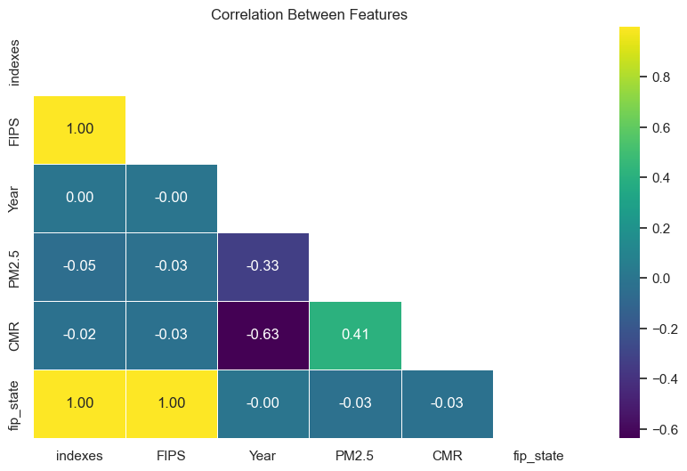
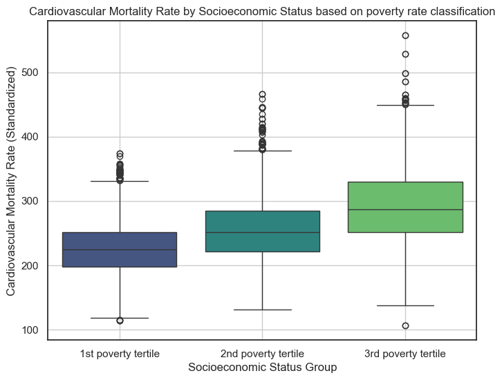
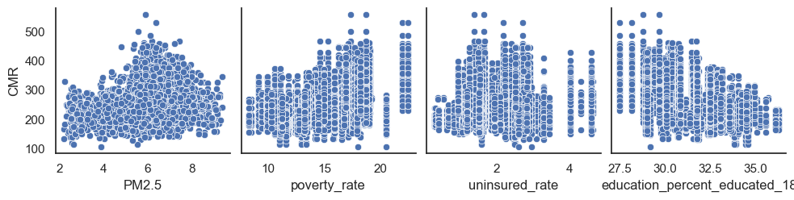
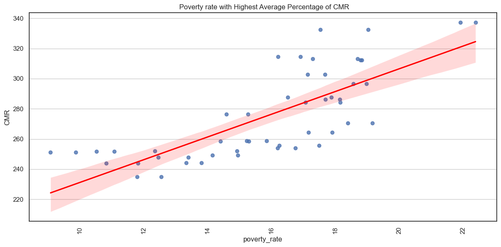
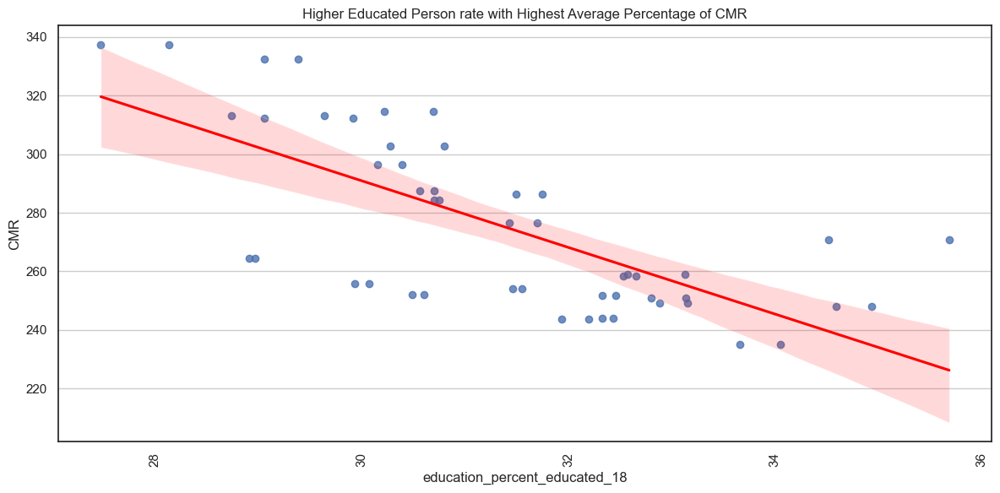
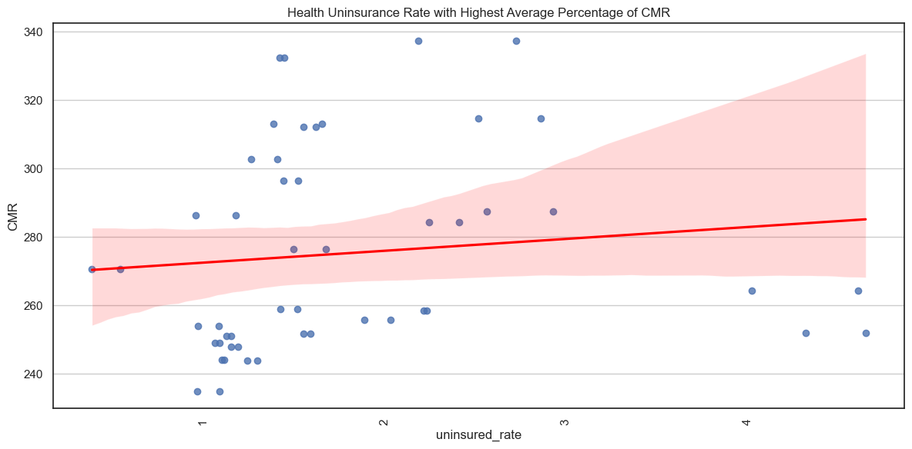
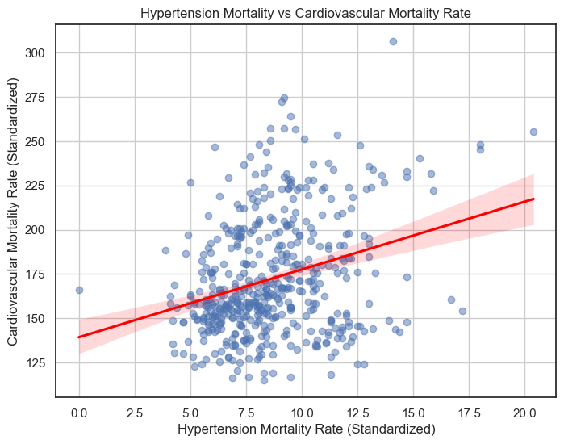

# The Critical Influence of Air Pollution and Socioeconomic Status on Cardiovascular Disease Mortality Rates in the U.S. with Public Health and Social Justice Implications
### Bayowa Onabajo
### Department of Applied Data Science and Analytics, Howard University
### April 22, 2025

# Introduction 
Cardiovascular disease (CVD) continues to be one of the leading cause of death in the United States. While its biomedical causes are well-documented, this paper expands the discourse by examining the intersection between air pollution—particularly fine particulate matter (PM2.5)—and socioeconomic status (SES). Disparities in air pollution exposure remain a public health and social justice issue especially for densely populated communities. Fine particulate matter (PM2.5), a pollutant linked to industrial activity and human activity, has been shown to elevate risks for cardiovascular disease mortality, especially among populations in economically disadvantaged communities (Crouse et al., 2012; Di et al., 2017). Our research investigates, using a cross-sectional approach, whether there is a statistical relationship between cardiovascular disease mortality rates (CMR) and long-term PM2.5 exposure, and whether socioeconomic status influences this relationship. 

### Why Cardiovascular Disease is Significant. 

Cardiovascular disease (CVD) is a class of diseases that affect the heart or blood vessels in simple terms. These conditions include and are not limited to coronary artery disease , stroke, heart failure and hypertension (more likely a risk factor). CVD is a critical public health concern due to its high prevalence and substantial impact on morbidity and mortality, contributing significantly to healthcare costs and reduced quality of life. An understanding of its determinants is essential for developing effective prevention, intervention strategies and for healthier communities.

### Air Pollution and Particulate Matter 2.5 (PM2.5).

Air pollution, particularly fine particulate matter (PM2.5), has emerged as a significant environmental risk factor for CVD. PM2.5 refers to minute airborne particles that are 2.5 micrometers in diameter or less. These particles can be inhaled through the bronchi, bronchioles and alveoli of the lungs, entering the bloodstream and triggering a cascade of adverse physiological responses.
Its vascular impacts are also documented as PM2.5 exposure is associated with increased inflammation, oxidative stress, endothelial dysfunction, and altered blood coagulation (Krittanawong et al.,2023). These processes contribute to the development and progression of atherosclerosis, hypertension, and CVD.

### Socioeconomic Status: Factors and Importance

Socioeconomic status (SES) is a multifaceted social construct encompassing various socio-economic factors significantly influencing individuals and communities. Key indicators of SES include income, which affects access to essential resources such as healthcare, healthy food, and housing; education, which shapes health literacy, employment prospects, and health-promoting behaviors; and healthcare access, which determines the availability and quality of medical services for disease prevention, diagnosis, and treatment. Notably, lower socioeconomic status is frequently associated with increased exposure to risk factors for cardiovascular disease (Cox et al.,2018).

### Public Health and Social Justice Implications

The confluence of elevated particulate matter 2.5 levels and low socioeconomic status (SES) carries significant implications for both public health and social justice (Ma et al.,2023). Communities characterized by lower SES frequently experience a disproportionate burden of cardiovascular disease (CVD). This disparity can be related to increased exposure to environmental pollutants coupled with diminished access to resources that could otherwise mitigate adverse health effects. The inequitable distribution represents a critical environmental injustice wherein marginalized populations are unjustly subjected to elevated health risks. Consequently, effectively addressing the multipronged challenge of CVD necessitates a holistic approach that integrates both biomedical and socio-environmental determinants. Interventions should be strategically designed to achieve a dual objective by reducing overall pollution levels and actively mitigating existing socioeconomic disparities to foster health equity.

This study analyzes data from 2,132 U.S. counties, using a cross-sectional approach to identify how geography, poverty, and pollution converge to produce avoidable, unequal mortality outcomes.This paper contributes to the growing body of research emphasizing the need for social justice policies that protect vulnerable populations and address health disparities driven by structural inequality. 

### Framework: 
The study adopts a Fundamental cause theory multifactorial framework Phelan et al. (2010), emphasizing how environmental and social stressors interact in a way that intensifies harm beyond their individual effects.

## Research questions: 
What is the association between air pollution(PM2.5), socioeconomic factors (poverty, education, and health insurance) and cardiovascular mortality rates in the U.S.

How does hypertension rate influence cardiovascular mortality rates in the U.S.

## Problem statement: 
Cardiovascular disease (CVD) is a leading cause of death in the United States, with growing evidence suggesting that air pollution exposure measured as particulate matter 2.5(PM 2.5) influences cardiovascular morbidity, mortality and this disproportionately affects low-income populations. Individuals from lower socioeconomic backgrounds are more likely to live in areas with higher pollution levels, overcrowding, limited healthcare access, and economic stressors that contribute to CVD risk factors such as hypertension. These inequalities raise concerns about how socioeconomic and environmental conditions intersect in shaping public health outcomes. To what degree does air pollution and socioeconomic status influence cardiovascular mortality rates in disadvantaged populations?

## Data Definition 

### American Community Survey (2009,2010): 1-Year Estimates.
Last Updated: January 25, 2024.
https://www.census.gov/data/developers/data-sets/acs-1year/2009.html
https://www.census.gov/data/developers/data-sets/acs-1year/2010.html
These datasets consists of above 48,000 variables as part of the American community survey which provides data annually. The dataset covers broad social, housing, economic and demographic variables in all U.S. nations and states.The data are presented as counts. The variables from the ACS1 dataset were used in this paper as they are appropriate for the statistical approach needed to match the other datasets.

### PM2.5 and cardiovascular mortality rate.
Last Updated: November 12, 2020
https://catalog.data.gov/dataset/annual-pm2-5-and-cardiovascular-mortality-rate-data-trends-modified-by-county-socioeconomi
The dataset comprises socioeconomic status information for 2,132 counties in form of indexes and quintiles across the United States, provided by the U.S. Environmental Protection Agency. It also includes average annual cardiovascular mortality rates and total particulate matter 2.5 concentrations for each county over a 21-year span (1990–2010). The cardiovascular mortality data was collected from the U.S. National Center for Health Statistics, while PM2.5 levels were estimated using the EPA’s Community Multiscale Air Quality (CMAQ) modeling system. Additionally, socioeconomic data was extracted from the U.S. Census Bureau. 

### Heart Disease Mortality by State.
Last Updated: February 25, 2022
https://www.cdc.gov/nchs/pressroom/sosmap/heart_disease_mortality/heart_disease.htm
The dataset shows the number of deaths per 100,000 population attributed to heart disease in U.S. states with variables like death rate and number of deaths. It also adjusts for differences in age distribution and population size.


### Hypertension Mortality by State
Last Updated: March 3, 2022
https://www.cdc.gov/nchs/pressroom/sosmap/hypertension_mortality/hypertension.htm
The dataset shows the number of deaths per 100,000 population attributed to hypertension in U.S. states with variables like death rate and number of deaths. It also adjusts for differences in age distribution and population size.


```python
# Import libraries
import numpy as np                  # Scientific Computing
import pandas as pd                 # Data Analysis
import matplotlib.pyplot as plt     # Plotting
import seaborn as sns               # Statistical Data Visualization

# pandas returns all the rows and columns for the dataframe
pd.set_option('display.max_rows', None)
pd.set_option('display.max_columns', None)

# Force pandas to display full numbers instead of scientific notation
# pd.options.display.float_format = '{:.0f}'.format

# Library to suppress warnings
import warnings
warnings.filterwarnings('ignore')
```


```python
# Read the dataset
path = pd.read_csv('/Users/bayowaonabajo/Downloads/SES_PM25_CMR_data-2/County_annual_PM25_CMR.csv')

# Create the Dataframe
df_annualcounty_pm25_cmr = pd.DataFrame(path)
```


```python
# Read the dataset
path = pd.read_csv('/Users/bayowaonabajo/Downloads/SES_PM25_CMR_data-2/County_SES_index_quintile.csv')

# Create the Dataframe
df_county_sespm25_index_quintile = pd.DataFrame(path)
```


```python
# Read the dataset
path = pd.read_csv('/Users/bayowaonabajo/Downloads/data-table-heart-dx-mort.csv')

# Create the Dataframe
df_heart_dx_mort = pd.DataFrame(path)
```


```python
# Read the dataset
path = pd.read_csv('/Users/bayowaonabajo/Downloads/data-table-htn-dx-mort.csv')

# Create the Dataframe
df_htn_dx_mort = pd.DataFrame(path)
```


```python
# Read the dataset
path = pd.read_csv('/Users/bayowaonabajo/Downloads/acs_vars_2009_2010_states.csv')


```

### METHODOLOGY : 
Data for this study were drawn from publicly available national sources and harmonized across a cross-sectional frame (2009–2010). Data cleaning, feature engineering were done for data analysis and visualizations. Statistical and visual analysis were done with explanations for key findings.

#### Data Cleaning and Preparation


```python
df_annualcounty_pm25_cmr.head()
```


<div>
<style scoped>
    .dataframe tbody tr th:only-of-type {
        vertical-align: middle;
    }

    .dataframe tbody tr th {
        vertical-align: top;
    }

    .dataframe thead th {
        text-align: right;
    }
</style>
<table border="1" class="dataframe">
  <thead>
    <tr style="text-align: right;">
      <th></th>
      <th>Unnamed: 0</th>
      <th>FIPS</th>
      <th>Year</th>
      <th>PM2.5</th>
      <th>CMR</th>
      <th>fip_state</th>
      <th>state</th>
    </tr>
  </thead>
  <tbody>
    <tr>
      <th>0</th>
      <td>1</td>
      <td>1001</td>
      <td>1990</td>
      <td>9.749792</td>
      <td>471.758888</td>
      <td>1</td>
      <td>AL</td>
    </tr>
    <tr>
      <th>1</th>
      <td>2</td>
      <td>1001</td>
      <td>1991</td>
      <td>9.069443</td>
      <td>456.869651</td>
      <td>1</td>
      <td>AL</td>
    </tr>
    <tr>
      <th>2</th>
      <td>3</td>
      <td>1001</td>
      <td>1992</td>
      <td>9.105352</td>
      <td>520.014377</td>
      <td>1</td>
      <td>AL</td>
    </tr>
    <tr>
      <th>3</th>
      <td>4</td>
      <td>1001</td>
      <td>1993</td>
      <td>8.752873</td>
      <td>454.436425</td>
      <td>1</td>
      <td>AL</td>
    </tr>
    <tr>
      <th>4</th>
      <td>5</td>
      <td>1001</td>
      <td>1994</td>
      <td>9.024049</td>
      <td>415.035332</td>
      <td>1</td>
      <td>AL</td>
    </tr>
  </tbody>
</table>
</div>


```python
# Load the dataset
df = pd.read_csv('/Users/bayowaonabajo/Downloads/acs_vars_2009_2010_states.csv')

# State abbreviations mapping
state_abbreviations = {
    'Alabama': 'AL',
    'Alaska': 'AK',
    'Arizona': 'AZ',
    'Arkansas': 'AR',
    'California': 'CA',
    'Colorado': 'CO',
    'Connecticut': 'CT',
    'Delaware': 'DE',
    'District of Columbia': 'DC',
    'Florida': 'FL',
    'Georgia': 'GA',
    'Hawaii': 'HI',
    'Idaho': 'ID',
    'Illinois': 'IL',
    'Indiana': 'IN',
    'Iowa': 'IA',
    'Kansas': 'KS',
    'Kentucky': 'KY',
    'Louisiana': 'LA',
    'Maine': 'ME',
    'Maryland': 'MD',
    'Massachusetts': 'MA',
    'Michigan': 'MI',
    'Minnesota': 'MN',
    'Mississippi': 'MS',
    'Missouri': 'MO',
    'Montana': 'MT',
    'Nebraska': 'NE',
    'Nevada': 'NV',
    'New Hampshire': 'NH',
    'New Jersey': 'NJ',
    'New Mexico': 'NM',
    'New York': 'NY',
    'North Carolina': 'NC',
    'North Dakota': 'ND',
    'Ohio': 'OH',
    'Oklahoma': 'OK',
    'Oregon': 'OR',
    'Pennsylvania': 'PA',
    'Rhode Island': 'RI',
    'South Carolina': 'SC',
    'South Dakota': 'SD',
    'Tennessee': 'TN',
    'Texas': 'TX',
    'Utah': 'UT',
    'Vermont': 'VT',
    'Virginia': 'VA',
    'Washington': 'WA',
    'West Virginia': 'WV',
    'Wisconsin': 'WI',
    'Wyoming': 'WY',
    'Puerto Rico': 'PR'
}

# Replace state names with abbreviations
df['state'] = df['state'].map(state_abbreviations)


# Save the updated dataset to a new variable
df_acs_2009_2010_states = df

# Rename columns
df_acs_2009_2010_states = df_acs_2009_2010_states.rename(columns={'state.1': 'fip'})


df_acs_2009_2010_states.head()

 

```


<div>
<style scoped>
    .dataframe tbody tr th:only-of-type {
        vertical-align: middle;
    }

    .dataframe tbody tr th {
        vertical-align: top;
    }

    .dataframe thead th {
        text-align: right;
    }
</style>
<table border="1" class="dataframe">
  <thead>
    <tr style="text-align: right;">
      <th></th>
      <th>state</th>
      <th>median_income</th>
      <th>total_population_poverty</th>
      <th>poverty_count</th>
      <th>total_population_uninsured</th>
      <th>uninsured_count</th>
      <th>total_population_education_18</th>
      <th>high_school_diploma</th>
      <th>ged_alternative</th>
      <th>associates_degree</th>
      <th>bachelors_degree</th>
      <th>masters_degree</th>
      <th>professional_degree</th>
      <th>doctorate_degree</th>
      <th>fip</th>
      <th>poverty_rate</th>
      <th>uninsured_rate</th>
      <th>educated_adults</th>
      <th>education_percent_educated_18</th>
      <th>year</th>
    </tr>
  </thead>
  <tbody>
    <tr>
      <th>0</th>
      <td>AL</td>
      <td>40489</td>
      <td>4588899</td>
      <td>804683</td>
      <td>4616028</td>
      <td>66730</td>
      <td>3115982</td>
      <td>27958</td>
      <td>464551</td>
      <td>88341</td>
      <td>211422</td>
      <td>68352</td>
      <td>26346</td>
      <td>18412</td>
      <td>1</td>
      <td>17.535426</td>
      <td>1.445615</td>
      <td>905382</td>
      <td>29.056073</td>
      <td>2009</td>
    </tr>
    <tr>
      <th>1</th>
      <td>AK</td>
      <td>66953</td>
      <td>682412</td>
      <td>61653</td>
      <td>678081</td>
      <td>24993</td>
      <td>431178</td>
      <td>4388</td>
      <td>68535</td>
      <td>15906</td>
      <td>34369</td>
      <td>13071</td>
      <td>3876</td>
      <td>2806</td>
      <td>2</td>
      <td>9.034571</td>
      <td>3.685843</td>
      <td>142951</td>
      <td>33.153593</td>
      <td>2009</td>
    </tr>
    <tr>
      <th>2</th>
      <td>AZ</td>
      <td>48745</td>
      <td>6475485</td>
      <td>1069897</td>
      <td>6501531</td>
      <td>207853</td>
      <td>4248231</td>
      <td>46247</td>
      <td>513087</td>
      <td>150479</td>
      <td>348081</td>
      <td>135252</td>
      <td>41173</td>
      <td>29019</td>
      <td>4</td>
      <td>16.522268</td>
      <td>3.196985</td>
      <td>1263338</td>
      <td>29.737978</td>
      <td>2009</td>
    </tr>
    <tr>
      <th>3</th>
      <td>AR</td>
      <td>37823</td>
      <td>2806056</td>
      <td>527378</td>
      <td>2833391</td>
      <td>44061</td>
      <td>1903914</td>
      <td>18213</td>
      <td>324262</td>
      <td>41334</td>
      <td>114200</td>
      <td>33797</td>
      <td>13430</td>
      <td>7963</td>
      <td>5</td>
      <td>18.794279</td>
      <td>1.555062</td>
      <td>553199</td>
      <td>29.055882</td>
      <td>2009</td>
    </tr>
    <tr>
      <th>4</th>
      <td>CA</td>
      <td>58931</td>
      <td>36202780</td>
      <td>5128708</td>
      <td>36376938</td>
      <td>890998</td>
      <td>23782109</td>
      <td>308968</td>
      <td>2474351</td>
      <td>820990</td>
      <td>2220258</td>
      <td>830392</td>
      <td>306369</td>
      <td>210817</td>
      <td>6</td>
      <td>14.166614</td>
      <td>2.449349</td>
      <td>7172145</td>
      <td>30.157733</td>
      <td>2009</td>
    </tr>
  </tbody>
</table>
</div>


Block for extracting the merging the acs variables needed
#import censusdata
#import requests
#import pandas as pd

#censusdata.census_api_key = "YOURAPIKEY"  #apikey

#Define API endpoint and parameters
base_url = "https://api.census.gov/data/{year}/acs/acs1" 
variables = "NAME,B19013_001E,B17001_001E,B17001_002E,B27010_001E,B27010_017E,B15002_001E,B15002_010E,B15002_011E,B15002_014E,B15002_015E,B15002_016E,B15002_017E,B15002_018E"
state_code = "*"  # Fetch data for all states

#Store dataframes in a list
all_dfs = []

#Loop through the years 2009, and 2010
for year in [2009, 2010]:
    # Construct the API request URL, inserting the current year
    url = f"{base_url.format(year=year)}?get={variables}&for=state:{state_code}&key={censusdata.census_api_key}"

    # Make the API request
    response = requests.get(url)

    # Check if successful
    if response.status_code == 200:
        print(f"Data fetched for {year}!")
        data = response.json()  # Parse through JSON response

        header = data[0]  # First row contains column names
        rows = data[1:]  # Remaining rows containing data
        df_acs = pd.DataFrame(rows, columns=header)

        
        # Rename columns for clarity
        df_acs = df_acs.rename(columns={
            "NAME": "state",
            "B19013_001E": "median_income",
            "B17001_001E": "total_population_poverty",
            "B17001_002E": "poverty_count",
            "B27010_001E": "total_population_uninsured",
            "B27010_017E": "uninsured_count",
            "B15002_001E": "total_population_education_18",
            "B15002_010E": "high_school_diploma",
            "B15002_011E": "ged_alternative",
            "B15002_014E": "associates_degree",
            "B15002_015E": "bachelors_degree",
            "B15002_016E": "masters_degree",
            "B15002_017E": "professional_degree",
            "B15002_018E": "doctorate_degree"
        })

        # Convert numeric columns to appropriate data types
        numeric_columns = ["median_income", "total_population_poverty", "poverty_count",
                           "total_population_uninsured", "uninsured_count",
                           "total_population_education_18", "high_school_diploma",
                           "ged_alternative", "associates_degree", "bachelors_degree",
                           "masters_degree", "professional_degree", "doctorate_degree"]
        df_acs[numeric_columns] = df_acs[numeric_columns].apply(pd.to_numeric, errors="coerce")

        # Calculate percentages
        df_acs["poverty_rate"] = (df_acs["poverty_count"] / df_acs["total_population_poverty"]) * 100
        df_acs["uninsured_rate"] = (df_acs["uninsured_count"] / df_acs["total_population_uninsured"]) * 100


       #Calculate Educated Adults
        df_acs["educated_adults"] = df_acs["high_school_diploma"] + df_acs["ged_alternative"] + \
                                      df_acs["associates_degree"] + df_acs["bachelors_degree"] + \
                                      df_acs["masters_degree"] + df_acs["professional_degree"] + \
                                      df_acs["doctorate_degree"]

        df_acs["education_percent_educated_18"] = (df_acs["educated_adults"] / df_acs["total_population_education_18"]) * 100

        df_acs['year'] = year #add the year
        all_dfs.append(df_acs) #append to the list
    else:
        print(f"Error for {year}: {response.status_code}")
        print(response.text)
        continue #Skips the current year to the next.

#if not all_dfs:
    print("Warning: No data was able to be collected.")
#else:
    df_acs_vars_09_10_states = pd.concat(all_dfs, ignore_index=True)
    df_acs_vars_09_10_states


```python
import pandas as pd

# Load the dataset
Ses_pm25_cmr_data = '/Users/bayowaonabajo/Downloads/SES_PM25_CMR_data-2/County_annual_PM25_CMR.csv'

df2 = pd.read_csv(Ses_pm25_cmr_data, dtype={'FIPS': str})  

# State FIPS to state abbreviation extracted from FIPS in original ses_pm25_cmr file encoded as two-digit State FIPS code and three-digit county code
state_fips_mapping = {
    '01': 'AL', '02': 'AK', '04': 'AZ', '05': 'AR', '06': 'CA', '08': 'CO', '09': 'CT',
    '10': 'DE', '11': 'DC', '12': 'FL', '13': 'GA', '15': 'HI', '16': 'ID', '17': 'IL',
    '18': 'IN', '19': 'IA', '20': 'KS', '21': 'KY', '22': 'LA', '23': 'ME', '24': 'MD',
    '25': 'MA', '26': 'MI', '27': 'MN', '28': 'MS', '29': 'MO', '30': 'MT', '31': 'NE',
    '32': 'NV', '33': 'NH', '34': 'NJ', '35': 'NM', '36': 'NY', '37': 'NC', '38': 'ND',
    '39': 'OH', '40': 'OK', '41': 'OR', '42': 'PA', '44': 'RI', '45': 'SC', '46': 'SD',
    '47': 'TN', '48': 'TX', '49': 'UT', '50': 'VT', '51': 'VA', '53': 'WA', '54': 'WV',
    '55': 'WI', '56': 'WY'
}

# Extract state FIPS and map to abbreviations
def extract_state_info(df):
    df['fip_state'] = df['FIPS'].str[:2]  # Extract first two digits
    df['state'] = df['fip_state'].map(state_fips_mapping)
    return df

df2 = extract_state_info(df2)
df2.head()

# update dataset with fip state codes and states
updated_file = '/Users/bayowaonabajo/Downloads/SES_PM25_CMR_data-2/County_annual_PM25_CMR.csv'
df2.to_csv(updated_file, index=False)

# Display few rows
df2.head()

```


<div>
<style scoped>
    .dataframe tbody tr th:only-of-type {
        vertical-align: middle;
    }

    .dataframe tbody tr th {
        vertical-align: top;
    }

    .dataframe thead th {
        text-align: right;
    }
</style>
<table border="1" class="dataframe">
  <thead>
    <tr style="text-align: right;">
      <th></th>
      <th>Unnamed: 0</th>
      <th>FIPS</th>
      <th>Year</th>
      <th>PM2.5</th>
      <th>CMR</th>
      <th>fip_state</th>
      <th>state</th>
    </tr>
  </thead>
  <tbody>
    <tr>
      <th>0</th>
      <td>1</td>
      <td>01001</td>
      <td>1990</td>
      <td>9.749792</td>
      <td>471.758888</td>
      <td>01</td>
      <td>AL</td>
    </tr>
    <tr>
      <th>1</th>
      <td>2</td>
      <td>01001</td>
      <td>1991</td>
      <td>9.069443</td>
      <td>456.869651</td>
      <td>01</td>
      <td>AL</td>
    </tr>
    <tr>
      <th>2</th>
      <td>3</td>
      <td>01001</td>
      <td>1992</td>
      <td>9.105352</td>
      <td>520.014377</td>
      <td>01</td>
      <td>AL</td>
    </tr>
    <tr>
      <th>3</th>
      <td>4</td>
      <td>01001</td>
      <td>1993</td>
      <td>8.752873</td>
      <td>454.436425</td>
      <td>01</td>
      <td>AL</td>
    </tr>
    <tr>
      <th>4</th>
      <td>5</td>
      <td>01001</td>
      <td>1994</td>
      <td>9.024049</td>
      <td>415.035332</td>
      <td>01</td>
      <td>AL</td>
    </tr>
  </tbody>
</table>
</div>


```python
import pandas as pd

# Load the dataset
Ses_index_quintile_file = '/Users/bayowaonabajo/Downloads/SES_PM25_CMR_data-2/County_SES_index_quintile.csv'

df1 = pd.read_csv(Ses_index_quintile_file, dtype={'FIPS': str})  

# State FIPS to state abbreviation extracted from FIPS in original ses_index_quintile file encoded as two-digit State FIPS code and three-digit county code
state_fips_mapping = {
    '01': 'AL', '02': 'AK', '04': 'AZ', '05': 'AR', '06': 'CA', '08': 'CO', '09': 'CT',
    '10': 'DE', '11': 'DC', '12': 'FL', '13': 'GA', '15': 'HI', '16': 'ID', '17': 'IL',
    '18': 'IN', '19': 'IA', '20': 'KS', '21': 'KY', '22': 'LA', '23': 'ME', '24': 'MD',
    '25': 'MA', '26': 'MI', '27': 'MN', '28': 'MS', '29': 'MO', '30': 'MT', '31': 'NE',
    '32': 'NV', '33': 'NH', '34': 'NJ', '35': 'NM', '36': 'NY', '37': 'NC', '38': 'ND',
    '39': 'OH', '40': 'OK', '41': 'OR', '42': 'PA', '44': 'RI', '45': 'SC', '46': 'SD',
    '47': 'TN', '48': 'TX', '49': 'UT', '50': 'VT', '51': 'VA', '53': 'WA', '54': 'WV',
    '55': 'WI', '56': 'WY'
}

# Extract state FIPS and map to abbreviations
def extract_state_info(df):
    df['fip_state'] = df['FIPS'].str[:2]  # Extract first two digits
    df['state'] = df['fip_state'].map(state_fips_mapping)
    return df

df1 = extract_state_info(df1)
df1.head()

# update dataset with fip state codes and states
updated_file = '/Users/bayowaonabajo/Downloads/SES_PM25_CMR_data-2/County_SES_index_quintile.csv'
df1.to_csv(updated_file, index=False)

df1

# Display few rows
df1.head()

```


<div>
<style scoped>
    .dataframe tbody tr th:only-of-type {
        vertical-align: middle;
    }

    .dataframe tbody tr th {
        vertical-align: top;
    }

    .dataframe thead th {
        text-align: right;
    }
</style>
<table border="1" class="dataframe">
  <thead>
    <tr style="text-align: right;">
      <th></th>
      <th>Unnamed: 0</th>
      <th>FIPS</th>
      <th>SES_index_1990</th>
      <th>SES_index_2000</th>
      <th>SES_index_2010</th>
      <th>SES_quintile_1990</th>
      <th>SES_quintile_2000</th>
      <th>SES_quintile_2010</th>
      <th>fip_state</th>
      <th>state</th>
    </tr>
  </thead>
  <tbody>
    <tr>
      <th>0</th>
      <td>1</td>
      <td>01001</td>
      <td>-0.079387</td>
      <td>-0.322846</td>
      <td>-0.405150</td>
      <td>Q3</td>
      <td>Q3</td>
      <td>Q2</td>
      <td>01</td>
      <td>AL</td>
    </tr>
    <tr>
      <th>1</th>
      <td>2</td>
      <td>01003</td>
      <td>-0.187240</td>
      <td>-0.467794</td>
      <td>-0.403987</td>
      <td>Q3</td>
      <td>Q2</td>
      <td>Q2</td>
      <td>01</td>
      <td>AL</td>
    </tr>
    <tr>
      <th>2</th>
      <td>3</td>
      <td>01005</td>
      <td>1.279538</td>
      <td>2.013751</td>
      <td>1.740142</td>
      <td>Q5</td>
      <td>Q5</td>
      <td>Q5</td>
      <td>01</td>
      <td>AL</td>
    </tr>
    <tr>
      <th>3</th>
      <td>4</td>
      <td>01009</td>
      <td>0.124421</td>
      <td>-0.375181</td>
      <td>-0.405849</td>
      <td>Q4</td>
      <td>Q3</td>
      <td>Q2</td>
      <td>01</td>
      <td>AL</td>
    </tr>
    <tr>
      <th>4</th>
      <td>5</td>
      <td>01011</td>
      <td>2.877256</td>
      <td>3.519681</td>
      <td>2.617074</td>
      <td>Q5</td>
      <td>Q5</td>
      <td>Q5</td>
      <td>01</td>
      <td>AL</td>
    </tr>
  </tbody>
</table>
</div>


```python
# Display first ten rows of the dataframe
df_annualcounty_pm25_cmr.head()
```


<div>
<style scoped>
    .dataframe tbody tr th:only-of-type {
        vertical-align: middle;
    }

    .dataframe tbody tr th {
        vertical-align: top;
    }

    .dataframe thead th {
        text-align: right;
    }
</style>
<table border="1" class="dataframe">
  <thead>
    <tr style="text-align: right;">
      <th></th>
      <th>Unnamed: 0</th>
      <th>FIPS</th>
      <th>Year</th>
      <th>PM2.5</th>
      <th>CMR</th>
      <th>fip_state</th>
      <th>state</th>
    </tr>
  </thead>
  <tbody>
    <tr>
      <th>0</th>
      <td>1</td>
      <td>1001</td>
      <td>1990</td>
      <td>9.749792</td>
      <td>471.758888</td>
      <td>1</td>
      <td>AL</td>
    </tr>
    <tr>
      <th>1</th>
      <td>2</td>
      <td>1001</td>
      <td>1991</td>
      <td>9.069443</td>
      <td>456.869651</td>
      <td>1</td>
      <td>AL</td>
    </tr>
    <tr>
      <th>2</th>
      <td>3</td>
      <td>1001</td>
      <td>1992</td>
      <td>9.105352</td>
      <td>520.014377</td>
      <td>1</td>
      <td>AL</td>
    </tr>
    <tr>
      <th>3</th>
      <td>4</td>
      <td>1001</td>
      <td>1993</td>
      <td>8.752873</td>
      <td>454.436425</td>
      <td>1</td>
      <td>AL</td>
    </tr>
    <tr>
      <th>4</th>
      <td>5</td>
      <td>1001</td>
      <td>1994</td>
      <td>9.024049</td>
      <td>415.035332</td>
      <td>1</td>
      <td>AL</td>
    </tr>
  </tbody>
</table>
</div>


```python
# Display last ten rows of the dataframe
df_annualcounty_pm25_cmr.tail(5)
```


<div>
<style scoped>
    .dataframe tbody tr th:only-of-type {
        vertical-align: middle;
    }

    .dataframe tbody tr th {
        vertical-align: top;
    }

    .dataframe thead th {
        text-align: right;
    }
</style>
<table border="1" class="dataframe">
  <thead>
    <tr style="text-align: right;">
      <th></th>
      <th>Unnamed: 0</th>
      <th>FIPS</th>
      <th>Year</th>
      <th>PM2.5</th>
      <th>CMR</th>
      <th>fip_state</th>
      <th>state</th>
    </tr>
  </thead>
  <tbody>
    <tr>
      <th>44767</th>
      <td>44768</td>
      <td>56037</td>
      <td>2006</td>
      <td>3.776910</td>
      <td>247.510138</td>
      <td>56</td>
      <td>WY</td>
    </tr>
    <tr>
      <th>44768</th>
      <td>44769</td>
      <td>56037</td>
      <td>2007</td>
      <td>3.609803</td>
      <td>292.450269</td>
      <td>56</td>
      <td>WY</td>
    </tr>
    <tr>
      <th>44769</th>
      <td>44770</td>
      <td>56037</td>
      <td>2008</td>
      <td>3.297100</td>
      <td>182.189745</td>
      <td>56</td>
      <td>WY</td>
    </tr>
    <tr>
      <th>44770</th>
      <td>44771</td>
      <td>56037</td>
      <td>2009</td>
      <td>3.119896</td>
      <td>242.828987</td>
      <td>56</td>
      <td>WY</td>
    </tr>
    <tr>
      <th>44771</th>
      <td>44772</td>
      <td>56037</td>
      <td>2010</td>
      <td>3.230996</td>
      <td>254.860863</td>
      <td>56</td>
      <td>WY</td>
    </tr>
  </tbody>
</table>
</div>


```python
path = pd.read_csv('/Users/bayowaonabajo/Downloads/SES_PM25_CMR_data-2/County_SES_index_quintile.csv')

df_county_sespm25_index_quintile = pd.DataFrame(path)
```


```python
df_county_sespm25_index_quintile.head()
```


<div>
<style scoped>
    .dataframe tbody tr th:only-of-type {
        vertical-align: middle;
    }

    .dataframe tbody tr th {
        vertical-align: top;
    }

    .dataframe thead th {
        text-align: right;
    }
</style>
<table border="1" class="dataframe">
  <thead>
    <tr style="text-align: right;">
      <th></th>
      <th>Unnamed: 0</th>
      <th>FIPS</th>
      <th>SES_index_1990</th>
      <th>SES_index_2000</th>
      <th>SES_index_2010</th>
      <th>SES_quintile_1990</th>
      <th>SES_quintile_2000</th>
      <th>SES_quintile_2010</th>
      <th>fip_state</th>
      <th>state</th>
    </tr>
  </thead>
  <tbody>
    <tr>
      <th>0</th>
      <td>1</td>
      <td>1001</td>
      <td>-0.079387</td>
      <td>-0.322846</td>
      <td>-0.405150</td>
      <td>Q3</td>
      <td>Q3</td>
      <td>Q2</td>
      <td>1</td>
      <td>AL</td>
    </tr>
    <tr>
      <th>1</th>
      <td>2</td>
      <td>1003</td>
      <td>-0.187240</td>
      <td>-0.467794</td>
      <td>-0.403987</td>
      <td>Q3</td>
      <td>Q2</td>
      <td>Q2</td>
      <td>1</td>
      <td>AL</td>
    </tr>
    <tr>
      <th>2</th>
      <td>3</td>
      <td>1005</td>
      <td>1.279538</td>
      <td>2.013751</td>
      <td>1.740142</td>
      <td>Q5</td>
      <td>Q5</td>
      <td>Q5</td>
      <td>1</td>
      <td>AL</td>
    </tr>
    <tr>
      <th>3</th>
      <td>4</td>
      <td>1009</td>
      <td>0.124421</td>
      <td>-0.375181</td>
      <td>-0.405849</td>
      <td>Q4</td>
      <td>Q3</td>
      <td>Q2</td>
      <td>1</td>
      <td>AL</td>
    </tr>
    <tr>
      <th>4</th>
      <td>5</td>
      <td>1011</td>
      <td>2.877256</td>
      <td>3.519681</td>
      <td>2.617074</td>
      <td>Q5</td>
      <td>Q5</td>
      <td>Q5</td>
      <td>1</td>
      <td>AL</td>
    </tr>
  </tbody>
</table>
</div>


```python
#df_county_sespm25_index_quintile.tail()
```


```python
df_heart_dx_mort.head()
```


<div>
<style scoped>
    .dataframe tbody tr th:only-of-type {
        vertical-align: middle;
    }

    .dataframe tbody tr th {
        vertical-align: top;
    }

    .dataframe thead th {
        text-align: right;
    }
</style>
<table border="1" class="dataframe">
  <thead>
    <tr style="text-align: right;">
      <th></th>
      <th>YEAR</th>
      <th>STATE</th>
      <th>RATE</th>
      <th>DEATHS</th>
      <th>URL</th>
    </tr>
  </thead>
  <tbody>
    <tr>
      <th>0</th>
      <td>2022</td>
      <td>AL</td>
      <td>234.2</td>
      <td>14958</td>
      <td>/nchs/pressroom/states/alabama/al.htm</td>
    </tr>
    <tr>
      <th>1</th>
      <td>2022</td>
      <td>AK</td>
      <td>145.7</td>
      <td>1013</td>
      <td>/nchs/pressroom/states/alaska/ak.htm</td>
    </tr>
    <tr>
      <th>2</th>
      <td>2022</td>
      <td>AZ</td>
      <td>148.5</td>
      <td>14593</td>
      <td>/nchs/pressroom/states/arizona/az.htm</td>
    </tr>
    <tr>
      <th>3</th>
      <td>2022</td>
      <td>AR</td>
      <td>224.1</td>
      <td>8664</td>
      <td>/nchs/pressroom/states/arkansas/ar.htm</td>
    </tr>
    <tr>
      <th>4</th>
      <td>2022</td>
      <td>CA</td>
      <td>142.4</td>
      <td>66340</td>
      <td>/nchs/pressroom/states/california/ca.htm</td>
    </tr>
  </tbody>
</table>
</div>


```python
#df_heart_dx_mort.tail()
```


```python
df_htn_dx_mort['YEAR'].unique()
```


    array([2022, 2021, 2020, 2019, 2018, 2017, 2016, 2015, 2014, 2005])


```python
df_htn_dx_mort.head(5)
```


<div>
<style scoped>
    .dataframe tbody tr th:only-of-type {
        vertical-align: middle;
    }

    .dataframe tbody tr th {
        vertical-align: top;
    }

    .dataframe thead th {
        text-align: right;
    }
</style>
<table border="1" class="dataframe">
  <thead>
    <tr style="text-align: right;">
      <th></th>
      <th>YEAR</th>
      <th>STATE</th>
      <th>RATE</th>
      <th>DEATHS</th>
      <th>URL</th>
    </tr>
  </thead>
  <tbody>
    <tr>
      <th>0</th>
      <td>2022</td>
      <td>AL</td>
      <td>13.2</td>
      <td>849</td>
      <td>/nchs/pressroom/states/alabama/al.htm</td>
    </tr>
    <tr>
      <th>1</th>
      <td>2022</td>
      <td>AK</td>
      <td>8.6</td>
      <td>56</td>
      <td>/nchs/pressroom/states/alaska/ak.htm</td>
    </tr>
    <tr>
      <th>2</th>
      <td>2022</td>
      <td>AZ</td>
      <td>11.3</td>
      <td>1109</td>
      <td>/nchs/pressroom/states/arizona/az.htm</td>
    </tr>
    <tr>
      <th>3</th>
      <td>2022</td>
      <td>AR</td>
      <td>12.1</td>
      <td>454</td>
      <td>/nchs/pressroom/states/arkansas/ar.htm</td>
    </tr>
    <tr>
      <th>4</th>
      <td>2022</td>
      <td>CA</td>
      <td>14.4</td>
      <td>6727</td>
      <td>/nchs/pressroom/states/california/ca.htm</td>
    </tr>
  </tbody>
</table>
</div>


```python
df_heart_dx_mort['YEAR'].unique()
```


    array([2022, 2021, 2020, 2019, 2018, 2017, 2016, 2015, 2014, 2005])


```python
df_heart_dx_mort.head()
```


<div>
<style scoped>
    .dataframe tbody tr th:only-of-type {
        vertical-align: middle;
    }

    .dataframe tbody tr th {
        vertical-align: top;
    }

    .dataframe thead th {
        text-align: right;
    }
</style>
<table border="1" class="dataframe">
  <thead>
    <tr style="text-align: right;">
      <th></th>
      <th>YEAR</th>
      <th>STATE</th>
      <th>RATE</th>
      <th>DEATHS</th>
      <th>URL</th>
    </tr>
  </thead>
  <tbody>
    <tr>
      <th>0</th>
      <td>2022</td>
      <td>AL</td>
      <td>234.2</td>
      <td>14958</td>
      <td>/nchs/pressroom/states/alabama/al.htm</td>
    </tr>
    <tr>
      <th>1</th>
      <td>2022</td>
      <td>AK</td>
      <td>145.7</td>
      <td>1013</td>
      <td>/nchs/pressroom/states/alaska/ak.htm</td>
    </tr>
    <tr>
      <th>2</th>
      <td>2022</td>
      <td>AZ</td>
      <td>148.5</td>
      <td>14593</td>
      <td>/nchs/pressroom/states/arizona/az.htm</td>
    </tr>
    <tr>
      <th>3</th>
      <td>2022</td>
      <td>AR</td>
      <td>224.1</td>
      <td>8664</td>
      <td>/nchs/pressroom/states/arkansas/ar.htm</td>
    </tr>
    <tr>
      <th>4</th>
      <td>2022</td>
      <td>CA</td>
      <td>142.4</td>
      <td>66340</td>
      <td>/nchs/pressroom/states/california/ca.htm</td>
    </tr>
  </tbody>
</table>
</div>


```python
#df_htn_dx_mort.tail()
```


```python
# Display first ten rows of the dataframe
df_acs_2009_2010_states.head()
```


<div>
<style scoped>
    .dataframe tbody tr th:only-of-type {
        vertical-align: middle;
    }

    .dataframe tbody tr th {
        vertical-align: top;
    }

    .dataframe thead th {
        text-align: right;
    }
</style>
<table border="1" class="dataframe">
  <thead>
    <tr style="text-align: right;">
      <th></th>
      <th>state</th>
      <th>median_income</th>
      <th>total_population_poverty</th>
      <th>poverty_count</th>
      <th>total_population_uninsured</th>
      <th>uninsured_count</th>
      <th>total_population_education_18</th>
      <th>high_school_diploma</th>
      <th>ged_alternative</th>
      <th>associates_degree</th>
      <th>bachelors_degree</th>
      <th>masters_degree</th>
      <th>professional_degree</th>
      <th>doctorate_degree</th>
      <th>fip</th>
      <th>poverty_rate</th>
      <th>uninsured_rate</th>
      <th>educated_adults</th>
      <th>education_percent_educated_18</th>
      <th>year</th>
    </tr>
  </thead>
  <tbody>
    <tr>
      <th>0</th>
      <td>AL</td>
      <td>40489</td>
      <td>4588899</td>
      <td>804683</td>
      <td>4616028</td>
      <td>66730</td>
      <td>3115982</td>
      <td>27958</td>
      <td>464551</td>
      <td>88341</td>
      <td>211422</td>
      <td>68352</td>
      <td>26346</td>
      <td>18412</td>
      <td>1</td>
      <td>17.535426</td>
      <td>1.445615</td>
      <td>905382</td>
      <td>29.056073</td>
      <td>2009</td>
    </tr>
    <tr>
      <th>1</th>
      <td>AK</td>
      <td>66953</td>
      <td>682412</td>
      <td>61653</td>
      <td>678081</td>
      <td>24993</td>
      <td>431178</td>
      <td>4388</td>
      <td>68535</td>
      <td>15906</td>
      <td>34369</td>
      <td>13071</td>
      <td>3876</td>
      <td>2806</td>
      <td>2</td>
      <td>9.034571</td>
      <td>3.685843</td>
      <td>142951</td>
      <td>33.153593</td>
      <td>2009</td>
    </tr>
    <tr>
      <th>2</th>
      <td>AZ</td>
      <td>48745</td>
      <td>6475485</td>
      <td>1069897</td>
      <td>6501531</td>
      <td>207853</td>
      <td>4248231</td>
      <td>46247</td>
      <td>513087</td>
      <td>150479</td>
      <td>348081</td>
      <td>135252</td>
      <td>41173</td>
      <td>29019</td>
      <td>4</td>
      <td>16.522268</td>
      <td>3.196985</td>
      <td>1263338</td>
      <td>29.737978</td>
      <td>2009</td>
    </tr>
    <tr>
      <th>3</th>
      <td>AR</td>
      <td>37823</td>
      <td>2806056</td>
      <td>527378</td>
      <td>2833391</td>
      <td>44061</td>
      <td>1903914</td>
      <td>18213</td>
      <td>324262</td>
      <td>41334</td>
      <td>114200</td>
      <td>33797</td>
      <td>13430</td>
      <td>7963</td>
      <td>5</td>
      <td>18.794279</td>
      <td>1.555062</td>
      <td>553199</td>
      <td>29.055882</td>
      <td>2009</td>
    </tr>
    <tr>
      <th>4</th>
      <td>CA</td>
      <td>58931</td>
      <td>36202780</td>
      <td>5128708</td>
      <td>36376938</td>
      <td>890998</td>
      <td>23782109</td>
      <td>308968</td>
      <td>2474351</td>
      <td>820990</td>
      <td>2220258</td>
      <td>830392</td>
      <td>306369</td>
      <td>210817</td>
      <td>6</td>
      <td>14.166614</td>
      <td>2.449349</td>
      <td>7172145</td>
      <td>30.157733</td>
      <td>2009</td>
    </tr>
  </tbody>
</table>
</div>


```python
# Display last ten rows of the dataframe
#df_acs_2009_2010_states.tail()
```


```python
df_annualcounty_pm25_cmr.info()
```

    <class 'pandas.core.frame.DataFrame'>
    RangeIndex: 44772 entries, 0 to 44771
    Data columns (total 7 columns):
     #   Column      Non-Null Count  Dtype  
    ---  ------      --------------  -----  
     0   Unnamed: 0  44772 non-null  int64  
     1   FIPS        44772 non-null  int64  
     2   Year        44772 non-null  int64  
     3   PM2.5       44772 non-null  float64
     4   CMR         44772 non-null  float64
     5   fip_state   44772 non-null  int64  
     6   state       44772 non-null  object 
    dtypes: float64(2), int64(4), object(1)
    memory usage: 2.4+ MB


```python
# This is the number of rows and columns in the data
df_annualcounty_pm25_cmr.shape
```


    (44772, 7)


The dataframe has 44772  rows and 7 columns. The total number of datapoints expected is 313404


```python
df_county_sespm25_index_quintile.shape
```


    (2132, 10)


The dataframe has 2132  rows and 10 columns. The total number of datapoints expected is 21320


```python
df_county_sespm25_index_quintile.info()
```

    <class 'pandas.core.frame.DataFrame'>
    RangeIndex: 2132 entries, 0 to 2131
    Data columns (total 10 columns):
     #   Column             Non-Null Count  Dtype  
    ---  ------             --------------  -----  
     0   Unnamed: 0         2132 non-null   int64  
     1   FIPS               2132 non-null   int64  
     2   SES_index_1990     2132 non-null   float64
     3   SES_index_2000     2132 non-null   float64
     4   SES_index_2010     2132 non-null   float64
     5   SES_quintile_1990  2132 non-null   object 
     6   SES_quintile_2000  2132 non-null   object 
     7   SES_quintile_2010  2132 non-null   object 
     8   fip_state          2132 non-null   int64  
     9   state              2132 non-null   object 
    dtypes: float64(3), int64(3), object(4)
    memory usage: 166.7+ KB


```python
df_heart_dx_mort.shape
```


    (501, 5)


The dataframe has 501 rows and 5 columns. The total number of datapoints expected is 2505


```python
df_heart_dx_mort.info()
```

    <class 'pandas.core.frame.DataFrame'>
    RangeIndex: 501 entries, 0 to 500
    Data columns (total 5 columns):
     #   Column  Non-Null Count  Dtype  
    ---  ------  --------------  -----  
     0   YEAR    501 non-null    int64  
     1   STATE   501 non-null    object 
     2   RATE    501 non-null    float64
     3   DEATHS  501 non-null    object 
     4   URL     501 non-null    object 
    dtypes: float64(1), int64(1), object(3)
    memory usage: 19.7+ KB


```python
df_htn_dx_mort.shape
```


    (501, 5)


The dataframe has 501  rows and 5 columns. The total number of datapoints expected is 2505


```python
df_htn_dx_mort.info()
```

    <class 'pandas.core.frame.DataFrame'>
    RangeIndex: 501 entries, 0 to 500
    Data columns (total 5 columns):
     #   Column  Non-Null Count  Dtype  
    ---  ------  --------------  -----  
     0   YEAR    501 non-null    int64  
     1   STATE   501 non-null    object 
     2   RATE    501 non-null    float64
     3   DEATHS  501 non-null    object 
     4   URL     501 non-null    object 
    dtypes: float64(1), int64(1), object(3)
    memory usage: 19.7+ KB


```python
df_acs_2009_2010_states.shape
```


    (104, 20)


The dataframe has 104  rows and 20 columns. The total number of datapoints expected is 2080


```python
df_acs_2009_2010_states.info()
```

    <class 'pandas.core.frame.DataFrame'>
    RangeIndex: 104 entries, 0 to 103
    Data columns (total 20 columns):
     #   Column                         Non-Null Count  Dtype  
    ---  ------                         --------------  -----  
     0   state                          104 non-null    object 
     1   median_income                  104 non-null    int64  
     2   total_population_poverty       104 non-null    int64  
     3   poverty_count                  104 non-null    int64  
     4   total_population_uninsured     104 non-null    int64  
     5   uninsured_count                104 non-null    int64  
     6   total_population_education_18  104 non-null    int64  
     7   high_school_diploma            104 non-null    int64  
     8   ged_alternative                104 non-null    int64  
     9   associates_degree              104 non-null    int64  
     10  bachelors_degree               104 non-null    int64  
     11  masters_degree                 104 non-null    int64  
     12  professional_degree            104 non-null    int64  
     13  doctorate_degree               104 non-null    int64  
     14  fip                            104 non-null    int64  
     15  poverty_rate                   104 non-null    float64
     16  uninsured_rate                 104 non-null    float64
     17  educated_adults                104 non-null    int64  
     18  education_percent_educated_18  104 non-null    float64
     19  year                           104 non-null    int64  
    dtypes: float64(3), int64(16), object(1)
    memory usage: 16.4+ KB


```python
df_annualcounty_pm25_cmr['state'].unique()
```


    array(['AL', 'AZ', 'AR', 'CA', 'CO', 'CT', 'DE', 'DC', 'FL', 'GA', 'ID',
           'IL', 'IN', 'IA', 'KS', 'KY', 'LA', 'ME', 'MD', 'MA', 'MI', 'MN',
           'MS', 'MO', 'MT', 'NE', 'NV', 'NH', 'NJ', 'NM', 'NY', 'NC', 'ND',
           'OH', 'OK', 'OR', 'PA', 'RI', 'SC', 'SD', 'TN', 'TX', 'UT', 'VT',
           'VA', 'WA', 'WV', 'WI', 'WY'], dtype=object)


```python
#create a list of the columns in the dataset
df_annualcounty_pm25_cmrCol = df_annualcounty_pm25_cmr.columns 
df_annualcounty_pm25_cmrCol

```


    Index(['Unnamed: 0', 'FIPS', 'Year', 'PM2.5', 'CMR', 'fip_state', 'state'], dtype='object')


```python
# Update the Headers for Consistency

df_annualcounty_pm25_cmrCol = df_annualcounty_pm25_cmr.rename(columns = {'Unnamed: 0':'indexes'})

# view the new columns and update the variable
df_annualcounty_pm25_cmr = df_annualcounty_pm25_cmrCol

df_annualcounty_pm25_cmr.head()
```


<div>
<style scoped>
    .dataframe tbody tr th:only-of-type {
        vertical-align: middle;
    }

    .dataframe tbody tr th {
        vertical-align: top;
    }

    .dataframe thead th {
        text-align: right;
    }
</style>
<table border="1" class="dataframe">
  <thead>
    <tr style="text-align: right;">
      <th></th>
      <th>indexes</th>
      <th>FIPS</th>
      <th>Year</th>
      <th>PM2.5</th>
      <th>CMR</th>
      <th>fip_state</th>
      <th>state</th>
    </tr>
  </thead>
  <tbody>
    <tr>
      <th>0</th>
      <td>1</td>
      <td>1001</td>
      <td>1990</td>
      <td>9.749792</td>
      <td>471.758888</td>
      <td>1</td>
      <td>AL</td>
    </tr>
    <tr>
      <th>1</th>
      <td>2</td>
      <td>1001</td>
      <td>1991</td>
      <td>9.069443</td>
      <td>456.869651</td>
      <td>1</td>
      <td>AL</td>
    </tr>
    <tr>
      <th>2</th>
      <td>3</td>
      <td>1001</td>
      <td>1992</td>
      <td>9.105352</td>
      <td>520.014377</td>
      <td>1</td>
      <td>AL</td>
    </tr>
    <tr>
      <th>3</th>
      <td>4</td>
      <td>1001</td>
      <td>1993</td>
      <td>8.752873</td>
      <td>454.436425</td>
      <td>1</td>
      <td>AL</td>
    </tr>
    <tr>
      <th>4</th>
      <td>5</td>
      <td>1001</td>
      <td>1994</td>
      <td>9.024049</td>
      <td>415.035332</td>
      <td>1</td>
      <td>AL</td>
    </tr>
  </tbody>
</table>
</div>


Renamed the column "Unnamed:0' to indexes for a more explanatory dataset.


```python
df_annualcounty_pm25_cmr_filtered = df_annualcounty_pm25_cmr[(df_annualcounty_pm25_cmr['Year'] < 1990) | (df_annualcounty_pm25_cmr['Year'] > 2008)]
```


```python
df_annualcounty_pm25_cmr_filtered.tail()
```


<div>
<style scoped>
    .dataframe tbody tr th:only-of-type {
        vertical-align: middle;
    }

    .dataframe tbody tr th {
        vertical-align: top;
    }

    .dataframe thead th {
        text-align: right;
    }
</style>
<table border="1" class="dataframe">
  <thead>
    <tr style="text-align: right;">
      <th></th>
      <th>indexes</th>
      <th>FIPS</th>
      <th>Year</th>
      <th>PM2.5</th>
      <th>CMR</th>
      <th>fip_state</th>
      <th>state</th>
    </tr>
  </thead>
  <tbody>
    <tr>
      <th>44729</th>
      <td>44730</td>
      <td>56029</td>
      <td>2010</td>
      <td>2.571525</td>
      <td>170.765285</td>
      <td>56</td>
      <td>WY</td>
    </tr>
    <tr>
      <th>44749</th>
      <td>44750</td>
      <td>56033</td>
      <td>2009</td>
      <td>2.566431</td>
      <td>235.312525</td>
      <td>56</td>
      <td>WY</td>
    </tr>
    <tr>
      <th>44750</th>
      <td>44751</td>
      <td>56033</td>
      <td>2010</td>
      <td>2.642380</td>
      <td>175.671813</td>
      <td>56</td>
      <td>WY</td>
    </tr>
    <tr>
      <th>44770</th>
      <td>44771</td>
      <td>56037</td>
      <td>2009</td>
      <td>3.119896</td>
      <td>242.828987</td>
      <td>56</td>
      <td>WY</td>
    </tr>
    <tr>
      <th>44771</th>
      <td>44772</td>
      <td>56037</td>
      <td>2010</td>
      <td>3.230996</td>
      <td>254.860863</td>
      <td>56</td>
      <td>WY</td>
    </tr>
  </tbody>
</table>
</div>


Dropped rows with year 1990 to 2008 for a matching analysis of timeline with the ACS 2009 and 2010 dataset. Dropping the rows narrowed the number of states in the dataset to 49 from 50.


```python
df_annualstate_county_pm25_cmr = df_annualcounty_pm25_cmr_filtered

df_annualstate_county_pm25_cmr['state'].unique()
```


    array(['AL', 'AZ', 'AR', 'CA', 'CO', 'CT', 'DE', 'DC', 'FL', 'GA', 'ID',
           'IL', 'IN', 'IA', 'KS', 'KY', 'LA', 'ME', 'MD', 'MA', 'MI', 'MN',
           'MS', 'MO', 'MT', 'NE', 'NV', 'NH', 'NJ', 'NM', 'NY', 'NC', 'ND',
           'OH', 'OK', 'OR', 'PA', 'RI', 'SC', 'SD', 'TN', 'TX', 'UT', 'VT',
           'VA', 'WA', 'WV', 'WI', 'WY'], dtype=object)


```python
# Determine the number of missing values
df_annualstate_county_pm25_cmr.isnull().sum()
```


    indexes      0
    FIPS         0
    Year         0
    PM2.5        0
    CMR          0
    fip_state    0
    state        0
    dtype: int64


```python
# Determine the percentage of missing values
# Typically less than five percent missing values may not affect the results
# More than 5% can be dropped, replaced with existing data, or imputed using mean or median.

def missing(Dataframe):
    print('Percentage of missing values in the dataset:\n',
          round((Dataframe.isnull().sum() *100/len(Dataframe)), 2).sort_values(ascending=False))
    

missing(df_annualstate_county_pm25_cmr)
```

    Percentage of missing values in the dataset:
     indexes      0.0
    FIPS         0.0
    Year         0.0
    PM2.5        0.0
    CMR          0.0
    fip_state    0.0
    state        0.0
    dtype: float64


I have no missing values in this dataset which is good for my analysis as it allows for a faster and complete statistical analysis, exploration and visualization


```python
# create a list of the columns in the dataset
df_county_sespm25_index_quintileCol = df_county_sespm25_index_quintile.columns 
df_county_sespm25_index_quintileCol

```


    Index(['Unnamed: 0', 'FIPS', 'SES_index_1990', 'SES_index_2000',
           'SES_index_2010', 'SES_quintile_1990', 'SES_quintile_2000',
           'SES_quintile_2010', 'fip_state', 'state'],
          dtype='object')


```python
# Update the Headers for Syntax Consistency

df_county_sespm25_index_quintileCol = df_county_sespm25_index_quintile.rename(columns = {'Unnamed: 0':'indexes'})

# view the new columns and update the variable

df_county_sespm25_index_quintile = df_county_sespm25_index_quintileCol

df_county_sespm25_index_quintile.head()

```


<div>
<style scoped>
    .dataframe tbody tr th:only-of-type {
        vertical-align: middle;
    }

    .dataframe tbody tr th {
        vertical-align: top;
    }

    .dataframe thead th {
        text-align: right;
    }
</style>
<table border="1" class="dataframe">
  <thead>
    <tr style="text-align: right;">
      <th></th>
      <th>indexes</th>
      <th>FIPS</th>
      <th>SES_index_1990</th>
      <th>SES_index_2000</th>
      <th>SES_index_2010</th>
      <th>SES_quintile_1990</th>
      <th>SES_quintile_2000</th>
      <th>SES_quintile_2010</th>
      <th>fip_state</th>
      <th>state</th>
    </tr>
  </thead>
  <tbody>
    <tr>
      <th>0</th>
      <td>1</td>
      <td>1001</td>
      <td>-0.079387</td>
      <td>-0.322846</td>
      <td>-0.405150</td>
      <td>Q3</td>
      <td>Q3</td>
      <td>Q2</td>
      <td>1</td>
      <td>AL</td>
    </tr>
    <tr>
      <th>1</th>
      <td>2</td>
      <td>1003</td>
      <td>-0.187240</td>
      <td>-0.467794</td>
      <td>-0.403987</td>
      <td>Q3</td>
      <td>Q2</td>
      <td>Q2</td>
      <td>1</td>
      <td>AL</td>
    </tr>
    <tr>
      <th>2</th>
      <td>3</td>
      <td>1005</td>
      <td>1.279538</td>
      <td>2.013751</td>
      <td>1.740142</td>
      <td>Q5</td>
      <td>Q5</td>
      <td>Q5</td>
      <td>1</td>
      <td>AL</td>
    </tr>
    <tr>
      <th>3</th>
      <td>4</td>
      <td>1009</td>
      <td>0.124421</td>
      <td>-0.375181</td>
      <td>-0.405849</td>
      <td>Q4</td>
      <td>Q3</td>
      <td>Q2</td>
      <td>1</td>
      <td>AL</td>
    </tr>
    <tr>
      <th>4</th>
      <td>5</td>
      <td>1011</td>
      <td>2.877256</td>
      <td>3.519681</td>
      <td>2.617074</td>
      <td>Q5</td>
      <td>Q5</td>
      <td>Q5</td>
      <td>1</td>
      <td>AL</td>
    </tr>
  </tbody>
</table>
</div>


Renamed the column "Unnamed:0' to indexes for a more explanatory dataset.


```python
# Determine the number of missing values

df_county_sespm25_index_quintile.isnull().sum()
```


    indexes              0
    FIPS                 0
    SES_index_1990       0
    SES_index_2000       0
    SES_index_2010       0
    SES_quintile_1990    0
    SES_quintile_2000    0
    SES_quintile_2010    0
    fip_state            0
    state                0
    dtype: int64


```python
#  function to determine the percentage of missing values
# Typically less than five percent missing values may not affect the results
# More than 5% can be dropped, replaced with existing data, or imputed using mean or median.

def missing(Dataframe):
    print('Percentage of missing values in the dataset:\n',
          round((Dataframe.isnull().sum() *100/len(Dataframe)), 2).sort_values(ascending=False))
    

missing(df_county_sespm25_index_quintile)
```

    Percentage of missing values in the dataset:
     indexes              0.0
    FIPS                 0.0
    SES_index_1990       0.0
    SES_index_2000       0.0
    SES_index_2010       0.0
    SES_quintile_1990    0.0
    SES_quintile_2000    0.0
    SES_quintile_2010    0.0
    fip_state            0.0
    state                0.0
    dtype: float64


```python
#create a list of the columns in the dataset
df_heart_dx_mortCol = df_heart_dx_mort.columns 
df_heart_dx_mortCol

```


    Index(['YEAR', 'STATE', 'RATE', 'DEATHS', 'URL'], dtype='object')


```python
#create a list of the columns in the dataset
df_heart_dx_mortCol = df_heart_dx_mort.columns 
df_heart_dx_mortCol 

```


    Index(['YEAR', 'STATE', 'RATE', 'DEATHS', 'URL'], dtype='object')


```python
# Update the Headers for Consistency

df_heart_dx_mortCol = df_heart_dx_mort.rename(columns = {'STATE':'state'})

# view the new columns and update the variable

df_heart_dx_mort = df_heart_dx_mortCol

df_heart_dx_mort.head()
```


<div>
<style scoped>
    .dataframe tbody tr th:only-of-type {
        vertical-align: middle;
    }

    .dataframe tbody tr th {
        vertical-align: top;
    }

    .dataframe thead th {
        text-align: right;
    }
</style>
<table border="1" class="dataframe">
  <thead>
    <tr style="text-align: right;">
      <th></th>
      <th>YEAR</th>
      <th>state</th>
      <th>RATE</th>
      <th>DEATHS</th>
      <th>URL</th>
    </tr>
  </thead>
  <tbody>
    <tr>
      <th>0</th>
      <td>2022</td>
      <td>AL</td>
      <td>234.2</td>
      <td>14958</td>
      <td>/nchs/pressroom/states/alabama/al.htm</td>
    </tr>
    <tr>
      <th>1</th>
      <td>2022</td>
      <td>AK</td>
      <td>145.7</td>
      <td>1013</td>
      <td>/nchs/pressroom/states/alaska/ak.htm</td>
    </tr>
    <tr>
      <th>2</th>
      <td>2022</td>
      <td>AZ</td>
      <td>148.5</td>
      <td>14593</td>
      <td>/nchs/pressroom/states/arizona/az.htm</td>
    </tr>
    <tr>
      <th>3</th>
      <td>2022</td>
      <td>AR</td>
      <td>224.1</td>
      <td>8664</td>
      <td>/nchs/pressroom/states/arkansas/ar.htm</td>
    </tr>
    <tr>
      <th>4</th>
      <td>2022</td>
      <td>CA</td>
      <td>142.4</td>
      <td>66340</td>
      <td>/nchs/pressroom/states/california/ca.htm</td>
    </tr>
  </tbody>
</table>
</div>


Changed the column name 'STATE' to 'state' in this cardiovascular disease rate dataset to allign with similar column names in the other datasets for easier manipulation and merging if needed.


```python
df_heart_dx_mort.head()
```


<div>
<style scoped>
    .dataframe tbody tr th:only-of-type {
        vertical-align: middle;
    }

    .dataframe tbody tr th {
        vertical-align: top;
    }

    .dataframe thead th {
        text-align: right;
    }
</style>
<table border="1" class="dataframe">
  <thead>
    <tr style="text-align: right;">
      <th></th>
      <th>YEAR</th>
      <th>state</th>
      <th>RATE</th>
      <th>DEATHS</th>
      <th>URL</th>
    </tr>
  </thead>
  <tbody>
    <tr>
      <th>0</th>
      <td>2022</td>
      <td>AL</td>
      <td>234.2</td>
      <td>14958</td>
      <td>/nchs/pressroom/states/alabama/al.htm</td>
    </tr>
    <tr>
      <th>1</th>
      <td>2022</td>
      <td>AK</td>
      <td>145.7</td>
      <td>1013</td>
      <td>/nchs/pressroom/states/alaska/ak.htm</td>
    </tr>
    <tr>
      <th>2</th>
      <td>2022</td>
      <td>AZ</td>
      <td>148.5</td>
      <td>14593</td>
      <td>/nchs/pressroom/states/arizona/az.htm</td>
    </tr>
    <tr>
      <th>3</th>
      <td>2022</td>
      <td>AR</td>
      <td>224.1</td>
      <td>8664</td>
      <td>/nchs/pressroom/states/arkansas/ar.htm</td>
    </tr>
    <tr>
      <th>4</th>
      <td>2022</td>
      <td>CA</td>
      <td>142.4</td>
      <td>66340</td>
      <td>/nchs/pressroom/states/california/ca.htm</td>
    </tr>
  </tbody>
</table>
</div>


```python
# Load the dataset
df = df_heart_dx_mort

df['state'] = df['state'].replace({
    'District of Columbia' : 'DC',
    
})

# Save the updated dataset
df_heart_dx_mort = df


df_heart_dx_mort.head(5)

```


<div>
<style scoped>
    .dataframe tbody tr th:only-of-type {
        vertical-align: middle;
    }

    .dataframe tbody tr th {
        vertical-align: top;
    }

    .dataframe thead th {
        text-align: right;
    }
</style>
<table border="1" class="dataframe">
  <thead>
    <tr style="text-align: right;">
      <th></th>
      <th>YEAR</th>
      <th>state</th>
      <th>RATE</th>
      <th>DEATHS</th>
      <th>URL</th>
    </tr>
  </thead>
  <tbody>
    <tr>
      <th>0</th>
      <td>2022</td>
      <td>AL</td>
      <td>234.2</td>
      <td>14958</td>
      <td>/nchs/pressroom/states/alabama/al.htm</td>
    </tr>
    <tr>
      <th>1</th>
      <td>2022</td>
      <td>AK</td>
      <td>145.7</td>
      <td>1013</td>
      <td>/nchs/pressroom/states/alaska/ak.htm</td>
    </tr>
    <tr>
      <th>2</th>
      <td>2022</td>
      <td>AZ</td>
      <td>148.5</td>
      <td>14593</td>
      <td>/nchs/pressroom/states/arizona/az.htm</td>
    </tr>
    <tr>
      <th>3</th>
      <td>2022</td>
      <td>AR</td>
      <td>224.1</td>
      <td>8664</td>
      <td>/nchs/pressroom/states/arkansas/ar.htm</td>
    </tr>
    <tr>
      <th>4</th>
      <td>2022</td>
      <td>CA</td>
      <td>142.4</td>
      <td>66340</td>
      <td>/nchs/pressroom/states/california/ca.htm</td>
    </tr>
  </tbody>
</table>
</div>


Changed the variable 'District of columbia' to 'DC' in the state column for conformity with the rest of the dataset.


```python
print(df['state'].unique())
```

    ['AL' 'AK' 'AZ' 'AR' 'CA' 'CO' 'CT' 'DE' 'DC' 'FL' 'GA' 'HI' 'ID' 'IL'
     'IN' 'IA' 'KS' 'KY' 'LA' 'ME' 'MD' 'MA' 'MI' 'MN' 'MS' 'MO' 'MT' 'NE'
     'NV' 'NH' 'NJ' 'NM' 'NY' 'NC' 'ND' 'OH' 'OK' 'OR' 'PA' 'RI' 'SC' 'SD'
     'TN' 'TX' 'UT' 'VT' 'VA' 'WA' 'WV' 'WI' 'WY']


```python
# Determine the number of missing values

df_heart_dx_mort.isnull().sum()
```


    YEAR      0
    state     0
    RATE      0
    DEATHS    0
    URL       0
    dtype: int64


```python
def missing(Dataframe):
    print('Percentage of missing values in the dataset:\n',
          round((Dataframe.isnull().sum() *100/len(Dataframe)), 2).sort_values(ascending=False))
    

missing(df_heart_dx_mort)
```

    Percentage of missing values in the dataset:
     YEAR      0.0
    state     0.0
    RATE      0.0
    DEATHS    0.0
    URL       0.0
    dtype: float64


I have no missing values in this dataset which is also good for my analysis as it allows for a faster and complete statistical analysis, exploration and visualization


```python
#create a list of the columns in the dataset
df_htn_dx_mortCol = df_htn_dx_mort.columns 
df_htn_dx_mortCol
```


    Index(['YEAR', 'STATE', 'RATE', 'DEATHS', 'URL'], dtype='object')


Changed the column name 'STATE' to 'state' in this hypertensive disease rate dataset to allign with similar column names in the other datasets for easier manipulation and merging if needed.


```python
# Update the Headers for Consistency

df_htn_dx_mortCol = df_htn_dx_mort.rename(columns = {'STATE':'state'})

# view the new columns and update the variable

df_htn_dx_mort = df_htn_dx_mortCol

df_htn_dx_mort.head()
```


<div>
<style scoped>
    .dataframe tbody tr th:only-of-type {
        vertical-align: middle;
    }

    .dataframe tbody tr th {
        vertical-align: top;
    }

    .dataframe thead th {
        text-align: right;
    }
</style>
<table border="1" class="dataframe">
  <thead>
    <tr style="text-align: right;">
      <th></th>
      <th>YEAR</th>
      <th>state</th>
      <th>RATE</th>
      <th>DEATHS</th>
      <th>URL</th>
    </tr>
  </thead>
  <tbody>
    <tr>
      <th>0</th>
      <td>2022</td>
      <td>AL</td>
      <td>13.2</td>
      <td>849</td>
      <td>/nchs/pressroom/states/alabama/al.htm</td>
    </tr>
    <tr>
      <th>1</th>
      <td>2022</td>
      <td>AK</td>
      <td>8.6</td>
      <td>56</td>
      <td>/nchs/pressroom/states/alaska/ak.htm</td>
    </tr>
    <tr>
      <th>2</th>
      <td>2022</td>
      <td>AZ</td>
      <td>11.3</td>
      <td>1109</td>
      <td>/nchs/pressroom/states/arizona/az.htm</td>
    </tr>
    <tr>
      <th>3</th>
      <td>2022</td>
      <td>AR</td>
      <td>12.1</td>
      <td>454</td>
      <td>/nchs/pressroom/states/arkansas/ar.htm</td>
    </tr>
    <tr>
      <th>4</th>
      <td>2022</td>
      <td>CA</td>
      <td>14.4</td>
      <td>6727</td>
      <td>/nchs/pressroom/states/california/ca.htm</td>
    </tr>
  </tbody>
</table>
</div>


```python
# Load the dataset
df = df_htn_dx_mort

df['state'] = df['state'].replace({
    'District of Columbia' : 'DC',
    
})

# Save the updated dataset
df_htn_dx_mort = df


df_htn_dx_mort.head()

```


<div>
<style scoped>
    .dataframe tbody tr th:only-of-type {
        vertical-align: middle;
    }

    .dataframe tbody tr th {
        vertical-align: top;
    }

    .dataframe thead th {
        text-align: right;
    }
</style>
<table border="1" class="dataframe">
  <thead>
    <tr style="text-align: right;">
      <th></th>
      <th>YEAR</th>
      <th>state</th>
      <th>RATE</th>
      <th>DEATHS</th>
      <th>URL</th>
    </tr>
  </thead>
  <tbody>
    <tr>
      <th>0</th>
      <td>2022</td>
      <td>AL</td>
      <td>13.2</td>
      <td>849</td>
      <td>/nchs/pressroom/states/alabama/al.htm</td>
    </tr>
    <tr>
      <th>1</th>
      <td>2022</td>
      <td>AK</td>
      <td>8.6</td>
      <td>56</td>
      <td>/nchs/pressroom/states/alaska/ak.htm</td>
    </tr>
    <tr>
      <th>2</th>
      <td>2022</td>
      <td>AZ</td>
      <td>11.3</td>
      <td>1109</td>
      <td>/nchs/pressroom/states/arizona/az.htm</td>
    </tr>
    <tr>
      <th>3</th>
      <td>2022</td>
      <td>AR</td>
      <td>12.1</td>
      <td>454</td>
      <td>/nchs/pressroom/states/arkansas/ar.htm</td>
    </tr>
    <tr>
      <th>4</th>
      <td>2022</td>
      <td>CA</td>
      <td>14.4</td>
      <td>6727</td>
      <td>/nchs/pressroom/states/california/ca.htm</td>
    </tr>
  </tbody>
</table>
</div>


Changed the variable 'District of columbia' to 'DC' in the state column for conformity with the rest of the dataset.


```python
# number of missing values

df_htn_dx_mort.isnull().sum()
```


    YEAR      0
    state     0
    RATE      0
    DEATHS    0
    URL       0
    dtype: int64


```python
def missing(Dataframe):
    print('Percentage of missing values in the dataset:\n',
          round((Dataframe.isnull().sum() *100/len(Dataframe)), 2).sort_values(ascending=False))
    

missing(df_htn_dx_mort)
```

    Percentage of missing values in the dataset:
     YEAR      0.0
    state     0.0
    RATE      0.0
    DEATHS    0.0
    URL       0.0
    dtype: float64


I have no missing values in this dataset which is also good for my analysis as it allows for a faster and complete statistical analysis, exploration and visualization


```python
#create a list of the columns in the dataset
df_acs_2009_2010_statesCol = df_acs_2009_2010_states.columns 
df_acs_2009_2010_statesCol

```


    Index(['state', 'median_income', 'total_population_poverty', 'poverty_count',
           'total_population_uninsured', 'uninsured_count',
           'total_population_education_18', 'high_school_diploma',
           'ged_alternative', 'associates_degree', 'bachelors_degree',
           'masters_degree', 'professional_degree', 'doctorate_degree', 'fip',
           'poverty_rate', 'uninsured_rate', 'educated_adults',
           'education_percent_educated_18', 'year'],
          dtype='object')


The column names in this collated ACS rate dataset allign with research goals so i will keep them as they are.


```python
df_acs_2009_2010_states.head()
```


<div>
<style scoped>
    .dataframe tbody tr th:only-of-type {
        vertical-align: middle;
    }

    .dataframe tbody tr th {
        vertical-align: top;
    }

    .dataframe thead th {
        text-align: right;
    }
</style>
<table border="1" class="dataframe">
  <thead>
    <tr style="text-align: right;">
      <th></th>
      <th>state</th>
      <th>median_income</th>
      <th>total_population_poverty</th>
      <th>poverty_count</th>
      <th>total_population_uninsured</th>
      <th>uninsured_count</th>
      <th>total_population_education_18</th>
      <th>high_school_diploma</th>
      <th>ged_alternative</th>
      <th>associates_degree</th>
      <th>bachelors_degree</th>
      <th>masters_degree</th>
      <th>professional_degree</th>
      <th>doctorate_degree</th>
      <th>fip</th>
      <th>poverty_rate</th>
      <th>uninsured_rate</th>
      <th>educated_adults</th>
      <th>education_percent_educated_18</th>
      <th>year</th>
    </tr>
  </thead>
  <tbody>
    <tr>
      <th>0</th>
      <td>AL</td>
      <td>40489</td>
      <td>4588899</td>
      <td>804683</td>
      <td>4616028</td>
      <td>66730</td>
      <td>3115982</td>
      <td>27958</td>
      <td>464551</td>
      <td>88341</td>
      <td>211422</td>
      <td>68352</td>
      <td>26346</td>
      <td>18412</td>
      <td>1</td>
      <td>17.535426</td>
      <td>1.445615</td>
      <td>905382</td>
      <td>29.056073</td>
      <td>2009</td>
    </tr>
    <tr>
      <th>1</th>
      <td>AK</td>
      <td>66953</td>
      <td>682412</td>
      <td>61653</td>
      <td>678081</td>
      <td>24993</td>
      <td>431178</td>
      <td>4388</td>
      <td>68535</td>
      <td>15906</td>
      <td>34369</td>
      <td>13071</td>
      <td>3876</td>
      <td>2806</td>
      <td>2</td>
      <td>9.034571</td>
      <td>3.685843</td>
      <td>142951</td>
      <td>33.153593</td>
      <td>2009</td>
    </tr>
    <tr>
      <th>2</th>
      <td>AZ</td>
      <td>48745</td>
      <td>6475485</td>
      <td>1069897</td>
      <td>6501531</td>
      <td>207853</td>
      <td>4248231</td>
      <td>46247</td>
      <td>513087</td>
      <td>150479</td>
      <td>348081</td>
      <td>135252</td>
      <td>41173</td>
      <td>29019</td>
      <td>4</td>
      <td>16.522268</td>
      <td>3.196985</td>
      <td>1263338</td>
      <td>29.737978</td>
      <td>2009</td>
    </tr>
    <tr>
      <th>3</th>
      <td>AR</td>
      <td>37823</td>
      <td>2806056</td>
      <td>527378</td>
      <td>2833391</td>
      <td>44061</td>
      <td>1903914</td>
      <td>18213</td>
      <td>324262</td>
      <td>41334</td>
      <td>114200</td>
      <td>33797</td>
      <td>13430</td>
      <td>7963</td>
      <td>5</td>
      <td>18.794279</td>
      <td>1.555062</td>
      <td>553199</td>
      <td>29.055882</td>
      <td>2009</td>
    </tr>
    <tr>
      <th>4</th>
      <td>CA</td>
      <td>58931</td>
      <td>36202780</td>
      <td>5128708</td>
      <td>36376938</td>
      <td>890998</td>
      <td>23782109</td>
      <td>308968</td>
      <td>2474351</td>
      <td>820990</td>
      <td>2220258</td>
      <td>830392</td>
      <td>306369</td>
      <td>210817</td>
      <td>6</td>
      <td>14.166614</td>
      <td>2.449349</td>
      <td>7172145</td>
      <td>30.157733</td>
      <td>2009</td>
    </tr>
  </tbody>
</table>
</div>


```python
# number of missing values

df_acs_2009_2010_states.isnull().sum()
```


    state                            0
    median_income                    0
    total_population_poverty         0
    poverty_count                    0
    total_population_uninsured       0
    uninsured_count                  0
    total_population_education_18    0
    high_school_diploma              0
    ged_alternative                  0
    associates_degree                0
    bachelors_degree                 0
    masters_degree                   0
    professional_degree              0
    doctorate_degree                 0
    fip                              0
    poverty_rate                     0
    uninsured_rate                   0
    educated_adults                  0
    education_percent_educated_18    0
    year                             0
    dtype: int64


```python
def missing(Dataframe):
    print('Percentage of missing values in the dataset:\n',
          round((Dataframe.isnull().sum() *100/len(Dataframe)), 2).sort_values(ascending=False))
    

missing(df_acs_2009_2010_states)
```

    Percentage of missing values in the dataset:
     state                            0.0
    median_income                    0.0
    education_percent_educated_18    0.0
    educated_adults                  0.0
    uninsured_rate                   0.0
    poverty_rate                     0.0
    fip                              0.0
    doctorate_degree                 0.0
    professional_degree              0.0
    masters_degree                   0.0
    bachelors_degree                 0.0
    associates_degree                0.0
    ged_alternative                  0.0
    high_school_diploma              0.0
    total_population_education_18    0.0
    uninsured_count                  0.0
    total_population_uninsured       0.0
    poverty_count                    0.0
    total_population_poverty         0.0
    year                             0.0
    dtype: float64


I have no missing values in this collated ACS dataset which is also good for my analysis as it allows for a faster and complete statistical analysis, exploration and visualization


```python
df_annualstate_county_pm25_cmr.head() 
```


<div>
<style scoped>
    .dataframe tbody tr th:only-of-type {
        vertical-align: middle;
    }

    .dataframe tbody tr th {
        vertical-align: top;
    }

    .dataframe thead th {
        text-align: right;
    }
</style>
<table border="1" class="dataframe">
  <thead>
    <tr style="text-align: right;">
      <th></th>
      <th>indexes</th>
      <th>FIPS</th>
      <th>Year</th>
      <th>PM2.5</th>
      <th>CMR</th>
      <th>fip_state</th>
      <th>state</th>
    </tr>
  </thead>
  <tbody>
    <tr>
      <th>19</th>
      <td>20</td>
      <td>1001</td>
      <td>2009</td>
      <td>6.402091</td>
      <td>330.876172</td>
      <td>1</td>
      <td>AL</td>
    </tr>
    <tr>
      <th>20</th>
      <td>21</td>
      <td>1001</td>
      <td>2010</td>
      <td>6.942778</td>
      <td>316.911479</td>
      <td>1</td>
      <td>AL</td>
    </tr>
    <tr>
      <th>40</th>
      <td>41</td>
      <td>1003</td>
      <td>2009</td>
      <td>5.419087</td>
      <td>270.402216</td>
      <td>1</td>
      <td>AL</td>
    </tr>
    <tr>
      <th>41</th>
      <td>42</td>
      <td>1003</td>
      <td>2010</td>
      <td>5.837704</td>
      <td>276.377191</td>
      <td>1</td>
      <td>AL</td>
    </tr>
    <tr>
      <th>61</th>
      <td>62</td>
      <td>1005</td>
      <td>2009</td>
      <td>5.840124</td>
      <td>383.159080</td>
      <td>1</td>
      <td>AL</td>
    </tr>
  </tbody>
</table>
</div>


### Exploratory Data Analysis and Feature Engineering

#### Descriptive Statistics


```python
df_annualstate_county_pm25_cmr.describe()
```


<div>
<style scoped>
    .dataframe tbody tr th:only-of-type {
        vertical-align: middle;
    }

    .dataframe tbody tr th {
        vertical-align: top;
    }

    .dataframe thead th {
        text-align: right;
    }
</style>
<table border="1" class="dataframe">
  <thead>
    <tr style="text-align: right;">
      <th></th>
      <th>indexes</th>
      <th>FIPS</th>
      <th>Year</th>
      <th>PM2.5</th>
      <th>CMR</th>
      <th>fip_state</th>
    </tr>
  </thead>
  <tbody>
    <tr>
      <th>count</th>
      <td>4264.000000</td>
      <td>4264.000000</td>
      <td>4264.000000</td>
      <td>4264.000000</td>
      <td>4264.000000</td>
      <td>4264.0000</td>
    </tr>
    <tr>
      <th>mean</th>
      <td>22396.000000</td>
      <td>30599.787992</td>
      <td>2009.500000</td>
      <td>6.171229</td>
      <td>257.605458</td>
      <td>30.5000</td>
    </tr>
    <tr>
      <th>std</th>
      <td>12926.077525</td>
      <td>15142.415588</td>
      <td>0.500059</td>
      <td>1.396911</td>
      <td>56.675549</td>
      <td>15.1239</td>
    </tr>
    <tr>
      <th>min</th>
      <td>20.000000</td>
      <td>1001.000000</td>
      <td>2009.000000</td>
      <td>2.192728</td>
      <td>106.135757</td>
      <td>1.0000</td>
    </tr>
    <tr>
      <th>25%</th>
      <td>11208.000000</td>
      <td>18162.500000</td>
      <td>2009.000000</td>
      <td>5.521922</td>
      <td>216.515285</td>
      <td>18.0000</td>
    </tr>
    <tr>
      <th>50%</th>
      <td>22396.000000</td>
      <td>29164.000000</td>
      <td>2009.500000</td>
      <td>6.391946</td>
      <td>250.385485</td>
      <td>29.0000</td>
    </tr>
    <tr>
      <th>75%</th>
      <td>33584.000000</td>
      <td>45019.500000</td>
      <td>2010.000000</td>
      <td>7.126114</td>
      <td>291.266376</td>
      <td>45.0000</td>
    </tr>
    <tr>
      <th>max</th>
      <td>44772.000000</td>
      <td>56037.000000</td>
      <td>2010.000000</td>
      <td>9.384544</td>
      <td>557.426037</td>
      <td>56.0000</td>
    </tr>
  </tbody>
</table>
</div>


The minimum and maximum values for the pm2.5 are 2.19 µg/m³ and 9.38 µg/m³ while the minimum and maximum values for the cardiovascular mortality rate are 106.1 per 100,000 and 557.4 per 100,000.

The mean PM2.5 of 6.17 and median of 6.39 suggests a relatively normal distribution for particulate matter of size 2.5

The mean CMR of 257.6 and median of 250.4 suggests a near symmetric distribution as well.

The quartile ranges are 25th percentile of 5.5 and 216.5 for PM2.5 and CMR respectively. The 75th percentile are 7.12 and 291.26 for PM2.5 and CMR respectively.


The standard deviation of PM2.5 at 1.39 indicates small variability across counties and states.However the standard deviation of CMR at 56.7 shows a high spread in cardiovascular mortality rates across states.


```python
df_heart_dx_mort.describe()
```


<div>
<style scoped>
    .dataframe tbody tr th:only-of-type {
        vertical-align: middle;
    }

    .dataframe tbody tr th {
        vertical-align: top;
    }

    .dataframe thead th {
        text-align: right;
    }
</style>
<table border="1" class="dataframe">
  <thead>
    <tr style="text-align: right;">
      <th></th>
      <th>YEAR</th>
      <th>RATE</th>
    </tr>
  </thead>
  <tbody>
    <tr>
      <th>count</th>
      <td>501.000000</td>
      <td>501.000000</td>
    </tr>
    <tr>
      <th>mean</th>
      <td>2016.710579</td>
      <td>172.287425</td>
    </tr>
    <tr>
      <th>std</th>
      <td>4.611515</td>
      <td>32.655107</td>
    </tr>
    <tr>
      <th>min</th>
      <td>2005.000000</td>
      <td>114.900000</td>
    </tr>
    <tr>
      <th>25%</th>
      <td>2015.000000</td>
      <td>149.300000</td>
    </tr>
    <tr>
      <th>50%</th>
      <td>2018.000000</td>
      <td>163.400000</td>
    </tr>
    <tr>
      <th>75%</th>
      <td>2020.000000</td>
      <td>192.000000</td>
    </tr>
    <tr>
      <th>max</th>
      <td>2022.000000</td>
      <td>306.400000</td>
    </tr>
  </tbody>
</table>
</div>


The minimum and maximum values for this dataframe are 114.9 and 306.4 per 100,000.

The mean of 172.3 and median of 163.4 suggests a right-skewed distribution.

The quartile ranges are 25th percentile of 149.3. and 75th percentile of 192.0.

The standard deviation of 32.7 is high and could allude to significant differences in heart disease mortality rates across states in the USA.


```python
df_htn_dx_mort.describe()
```


<div>
<style scoped>
    .dataframe tbody tr th:only-of-type {
        vertical-align: middle;
    }

    .dataframe tbody tr th {
        vertical-align: top;
    }

    .dataframe thead th {
        text-align: right;
    }
</style>
<table border="1" class="dataframe">
  <thead>
    <tr style="text-align: right;">
      <th></th>
      <th>YEAR</th>
      <th>RATE</th>
    </tr>
  </thead>
  <tbody>
    <tr>
      <th>count</th>
      <td>501.000000</td>
      <td>501.000000</td>
    </tr>
    <tr>
      <th>mean</th>
      <td>2016.710579</td>
      <td>8.628343</td>
    </tr>
    <tr>
      <th>std</th>
      <td>4.611515</td>
      <td>2.518634</td>
    </tr>
    <tr>
      <th>min</th>
      <td>2005.000000</td>
      <td>0.000000</td>
    </tr>
    <tr>
      <th>25%</th>
      <td>2015.000000</td>
      <td>6.900000</td>
    </tr>
    <tr>
      <th>50%</th>
      <td>2018.000000</td>
      <td>8.300000</td>
    </tr>
    <tr>
      <th>75%</th>
      <td>2020.000000</td>
      <td>10.100000</td>
    </tr>
    <tr>
      <th>max</th>
      <td>2022.000000</td>
      <td>20.400000</td>
    </tr>
  </tbody>
</table>
</div>


The minimum and maximum values for this dataframe are 0.0 and 20.4 deaths per 100,000.

The mean of 8.63 and median of 8.30 suggests a right-skewed distribution.

The quartile ranges are 25th percentile of 6.9 and 75th percentile of 10.1.

The standard deviation of 2.51 indicates moderate variability in hypertension mortality rates across states in the USA.


```python
df_county_sespm25_index_quintile.describe()
```


<div>
<style scoped>
    .dataframe tbody tr th:only-of-type {
        vertical-align: middle;
    }

    .dataframe tbody tr th {
        vertical-align: top;
    }

    .dataframe thead th {
        text-align: right;
    }
</style>
<table border="1" class="dataframe">
  <thead>
    <tr style="text-align: right;">
      <th></th>
      <th>indexes</th>
      <th>FIPS</th>
      <th>SES_index_1990</th>
      <th>SES_index_2000</th>
      <th>SES_index_2010</th>
      <th>fip_state</th>
    </tr>
  </thead>
  <tbody>
    <tr>
      <th>count</th>
      <td>2132.000000</td>
      <td>2132.000000</td>
      <td>2.132000e+03</td>
      <td>2.132000e+03</td>
      <td>2.132000e+03</td>
      <td>2132.000000</td>
    </tr>
    <tr>
      <th>mean</th>
      <td>1066.500000</td>
      <td>30599.787992</td>
      <td>-7.332054e-17</td>
      <td>8.998431e-17</td>
      <td>1.999651e-17</td>
      <td>30.500000</td>
    </tr>
    <tr>
      <th>std</th>
      <td>615.599708</td>
      <td>15144.191928</td>
      <td>9.641826e-01</td>
      <td>9.837311e-01</td>
      <td>9.556947e-01</td>
      <td>15.125674</td>
    </tr>
    <tr>
      <th>min</th>
      <td>1.000000</td>
      <td>1001.000000</td>
      <td>-2.535586e+00</td>
      <td>-1.646289e+00</td>
      <td>-1.836970e+00</td>
      <td>1.000000</td>
    </tr>
    <tr>
      <th>25%</th>
      <td>533.750000</td>
      <td>18162.500000</td>
      <td>-6.293172e-01</td>
      <td>-6.843596e-01</td>
      <td>-6.735622e-01</td>
      <td>18.000000</td>
    </tr>
    <tr>
      <th>50%</th>
      <td>1066.500000</td>
      <td>29164.000000</td>
      <td>-1.083418e-01</td>
      <td>-2.034422e-01</td>
      <td>-1.362228e-01</td>
      <td>29.000000</td>
    </tr>
    <tr>
      <th>75%</th>
      <td>1599.250000</td>
      <td>45019.500000</td>
      <td>5.120400e-01</td>
      <td>4.586209e-01</td>
      <td>4.726322e-01</td>
      <td>45.000000</td>
    </tr>
    <tr>
      <th>max</th>
      <td>2132.000000</td>
      <td>56037.000000</td>
      <td>5.645396e+00</td>
      <td>6.646980e+00</td>
      <td>6.456330e+00</td>
      <td>56.000000</td>
    </tr>
  </tbody>
</table>
</div>


The mean index of 1066 and median of 1066 indicates a normal distribution.


```python
df_acs_2009_2010_states.describe()
```


<div>
<style scoped>
    .dataframe tbody tr th:only-of-type {
        vertical-align: middle;
    }

    .dataframe tbody tr th {
        vertical-align: top;
    }

    .dataframe thead th {
        text-align: right;
    }
</style>
<table border="1" class="dataframe">
  <thead>
    <tr style="text-align: right;">
      <th></th>
      <th>median_income</th>
      <th>total_population_poverty</th>
      <th>poverty_count</th>
      <th>total_population_uninsured</th>
      <th>uninsured_count</th>
      <th>total_population_education_18</th>
      <th>high_school_diploma</th>
      <th>ged_alternative</th>
      <th>associates_degree</th>
      <th>bachelors_degree</th>
      <th>masters_degree</th>
      <th>professional_degree</th>
      <th>doctorate_degree</th>
      <th>fip</th>
      <th>poverty_rate</th>
      <th>uninsured_rate</th>
      <th>educated_adults</th>
      <th>education_percent_educated_18</th>
      <th>year</th>
    </tr>
  </thead>
  <tbody>
    <tr>
      <th>count</th>
      <td>104.000000</td>
      <td>1.040000e+02</td>
      <td>1.040000e+02</td>
      <td>1.040000e+02</td>
      <td>1.040000e+02</td>
      <td>1.040000e+02</td>
      <td>104.000000</td>
      <td>1.040000e+02</td>
      <td>104.000000</td>
      <td>1.040000e+02</td>
      <td>104.000000</td>
      <td>104.000000</td>
      <td>104.000000</td>
      <td>104.000000</td>
      <td>104.000000</td>
      <td>104.000000</td>
      <td>1.040000e+02</td>
      <td>104.000000</td>
      <td>104.000000</td>
    </tr>
    <tr>
      <th>mean</th>
      <td>49604.144231</td>
      <td>5.847806e+06</td>
      <td>8.895052e+05</td>
      <td>5.898023e+06</td>
      <td>1.189426e+05</td>
      <td>3.954632e+06</td>
      <td>36626.605769</td>
      <td>5.468577e+05</td>
      <td>128807.413462</td>
      <td>3.352190e+05</td>
      <td>128972.538462</td>
      <td>45831.567308</td>
      <td>29320.500000</td>
      <td>29.788462</td>
      <td>14.904238</td>
      <td>1.825752</td>
      <td>1.251635e+06</td>
      <td>32.088187</td>
      <td>2009.500000</td>
    </tr>
    <tr>
      <th>std</th>
      <td>9270.377961</td>
      <td>6.565761e+06</td>
      <td>1.035133e+06</td>
      <td>6.609771e+06</td>
      <td>1.921948e+05</td>
      <td>4.374467e+06</td>
      <td>51599.678880</td>
      <td>5.364355e+05</td>
      <td>146554.195832</td>
      <td>3.906015e+05</td>
      <td>153383.624955</td>
      <td>55949.004524</td>
      <td>35674.130151</td>
      <td>16.692928</td>
      <td>5.258778</td>
      <td>0.942193</td>
      <td>1.347906e+06</td>
      <td>2.150077</td>
      <td>0.502421</td>
    </tr>
    <tr>
      <th>min</th>
      <td>18314.000000</td>
      <td>5.299820e+05</td>
      <td>5.214400e+04</td>
      <td>5.337160e+05</td>
      <td>2.309000e+03</td>
      <td>3.557930e+05</td>
      <td>2014.000000</td>
      <td>3.896300e+04</td>
      <td>4215.000000</td>
      <td>2.796800e+04</td>
      <td>9389.000000</td>
      <td>2694.000000</td>
      <td>2056.000000</td>
      <td>1.000000</td>
      <td>8.286452</td>
      <td>0.305054</td>
      <td>1.193710e+05</td>
      <td>25.197119</td>
      <td>2009.000000</td>
    </tr>
    <tr>
      <th>25%</th>
      <td>43628.000000</td>
      <td>1.689948e+06</td>
      <td>2.264710e+05</td>
      <td>1.710142e+06</td>
      <td>2.477325e+04</td>
      <td>1.111880e+06</td>
      <td>7695.750000</td>
      <td>1.616908e+05</td>
      <td>40002.750000</td>
      <td>8.855700e+04</td>
      <td>29652.250000</td>
      <td>12377.250000</td>
      <td>7564.500000</td>
      <td>16.750000</td>
      <td>11.822853</td>
      <td>1.154294</td>
      <td>3.617645e+05</td>
      <td>30.592055</td>
      <td>2009.000000</td>
    </tr>
    <tr>
      <th>50%</th>
      <td>48258.000000</td>
      <td>4.056070e+06</td>
      <td>6.204850e+05</td>
      <td>4.082100e+06</td>
      <td>6.684400e+04</td>
      <td>2.746110e+06</td>
      <td>23654.000000</td>
      <td>3.791155e+05</td>
      <td>87378.000000</td>
      <td>2.021790e+05</td>
      <td>69815.500000</td>
      <td>26596.000000</td>
      <td>15831.500000</td>
      <td>29.500000</td>
      <td>14.240783</td>
      <td>1.542725</td>
      <td>8.376770e+05</td>
      <td>32.441705</td>
      <td>2009.500000</td>
    </tr>
    <tr>
      <th>75%</th>
      <td>55437.250000</td>
      <td>6.489280e+06</td>
      <td>9.851172e+05</td>
      <td>6.512686e+06</td>
      <td>1.220512e+05</td>
      <td>4.466785e+06</td>
      <td>38665.750000</td>
      <td>6.576772e+05</td>
      <td>153692.250000</td>
      <td>4.507875e+05</td>
      <td>169878.250000</td>
      <td>59284.250000</td>
      <td>39900.500000</td>
      <td>42.500000</td>
      <td>17.081788</td>
      <td>2.421341</td>
      <td>1.490284e+06</td>
      <td>33.640857</td>
      <td>2010.000000</td>
    </tr>
    <tr>
      <th>max</th>
      <td>69272.000000</td>
      <td>3.659337e+07</td>
      <td>5.783043e+06</td>
      <td>3.681557e+07</td>
      <td>1.119685e+06</td>
      <td>2.409720e+07</td>
      <td>324410.000000</td>
      <td>2.474351e+06</td>
      <td>822526.000000</td>
      <td>2.220258e+06</td>
      <td>849249.000000</td>
      <td>306369.000000</td>
      <td>219994.000000</td>
      <td>72.000000</td>
      <td>45.032912</td>
      <td>4.650732</td>
      <td>7.191509e+06</td>
      <td>36.254092</td>
      <td>2010.000000</td>
    </tr>
  </tbody>
</table>
</div>


The dataset shows considerable variability across several socioeconomic indicators. Median income ranges from a low of 18,314 to a high of 69,272, reflecting significant economic disparities. The number of individuals without health insurance also varies widely, from as few as 2,532 to as many as 914,426 people, highlighting potential disparities in healthcare access.
Educational attainment, specifically the percentage of the state population with only higher education, spans from 25.2% to 36.25%. The average rate of higher education is 32.1%, closely aligned with the median of 32.44%, suggesting a relatively symmetric distribution with minimal skewness.
In contrast, poverty rates exhibit a broader spread, ranging from 8.3% to 45.03%. The mean poverty rate is 14.9%, while the median is slightly lower at 14.24%, indicating a right-skewed distribution where a smaller number of states experience significantly higher poverty levels. Supporting this, the interquartile range (IQR) for poverty is 5.25, signifying notable dispersion within the central 50% of the data. Moreover, the variance in poverty rate exceeds the mean, highlighting substantial variability across observations.
Health uninsurance rates, while generally lower, still display meaningful variation—from 0.31% to 4.65%. The mean rate stands at 1.82%, compared to a median of 1.54%, again suggesting a mild right-skew in the distribution. However, the variance here is relatively low (0.88), indicating that the data is more clustered around the central tendency than other variables.
Overall, the patterns suggest that while some indicators like educational attainment show consistency across states, others—particularly poverty and income—reveal significant inequality. The skewed distributions and wide IQRs in these domains may require further investigation into structural and regional factors influencing these disparities.


```python
#Merge SES index quintile data and PM25/CMR data
#Read SES data with 'FIPS' as str and load
df_county_ses_quintile_index = df_county_sespm25_index_quintile
df_county_ses_quintile_index['FIPS'] = df_county_ses_quintile_index['FIPS'].astype(str)

# Ensure df_pm25_cmr is also a string
df_pm25_cmr = df_annualstate_county_pm25_cmr
df_pm25_cmr['FIPS'] = df_pm25_cmr['FIPS'].astype(str)

# Merge  on 'FIPS'
df_merged_state_county = pd.merge(df_pm25_cmr, df_county_ses_quintile_index, on='FIPS', how='inner')


# View merged DataFrame
df_merged_state_county.head()


```


<div>
<style scoped>
    .dataframe tbody tr th:only-of-type {
        vertical-align: middle;
    }

    .dataframe tbody tr th {
        vertical-align: top;
    }

    .dataframe thead th {
        text-align: right;
    }
</style>
<table border="1" class="dataframe">
  <thead>
    <tr style="text-align: right;">
      <th></th>
      <th>indexes_x</th>
      <th>FIPS</th>
      <th>Year</th>
      <th>PM2.5</th>
      <th>CMR</th>
      <th>fip_state_x</th>
      <th>state_x</th>
      <th>indexes_y</th>
      <th>SES_index_1990</th>
      <th>SES_index_2000</th>
      <th>SES_index_2010</th>
      <th>SES_quintile_1990</th>
      <th>SES_quintile_2000</th>
      <th>SES_quintile_2010</th>
      <th>fip_state_y</th>
      <th>state_y</th>
    </tr>
  </thead>
  <tbody>
    <tr>
      <th>0</th>
      <td>20</td>
      <td>1001</td>
      <td>2009</td>
      <td>6.402091</td>
      <td>330.876172</td>
      <td>1</td>
      <td>AL</td>
      <td>1</td>
      <td>-0.079387</td>
      <td>-0.322846</td>
      <td>-0.405150</td>
      <td>Q3</td>
      <td>Q3</td>
      <td>Q2</td>
      <td>1</td>
      <td>AL</td>
    </tr>
    <tr>
      <th>1</th>
      <td>21</td>
      <td>1001</td>
      <td>2010</td>
      <td>6.942778</td>
      <td>316.911479</td>
      <td>1</td>
      <td>AL</td>
      <td>1</td>
      <td>-0.079387</td>
      <td>-0.322846</td>
      <td>-0.405150</td>
      <td>Q3</td>
      <td>Q3</td>
      <td>Q2</td>
      <td>1</td>
      <td>AL</td>
    </tr>
    <tr>
      <th>2</th>
      <td>41</td>
      <td>1003</td>
      <td>2009</td>
      <td>5.419087</td>
      <td>270.402216</td>
      <td>1</td>
      <td>AL</td>
      <td>2</td>
      <td>-0.187240</td>
      <td>-0.467794</td>
      <td>-0.403987</td>
      <td>Q3</td>
      <td>Q2</td>
      <td>Q2</td>
      <td>1</td>
      <td>AL</td>
    </tr>
    <tr>
      <th>3</th>
      <td>42</td>
      <td>1003</td>
      <td>2010</td>
      <td>5.837704</td>
      <td>276.377191</td>
      <td>1</td>
      <td>AL</td>
      <td>2</td>
      <td>-0.187240</td>
      <td>-0.467794</td>
      <td>-0.403987</td>
      <td>Q3</td>
      <td>Q2</td>
      <td>Q2</td>
      <td>1</td>
      <td>AL</td>
    </tr>
    <tr>
      <th>4</th>
      <td>62</td>
      <td>1005</td>
      <td>2009</td>
      <td>5.840124</td>
      <td>383.159080</td>
      <td>1</td>
      <td>AL</td>
      <td>3</td>
      <td>1.279538</td>
      <td>2.013751</td>
      <td>1.740142</td>
      <td>Q5</td>
      <td>Q5</td>
      <td>Q5</td>
      <td>1</td>
      <td>AL</td>
    </tr>
  </tbody>
</table>
</div>


```python
# Feature Engineering
# Drop only existing columns
df_merged_state_county = df_merged_state_county.drop(columns=['fip_state_y', 'state_y','indexes_y','indexes_x'])

# Rename columns
df_merged_state_county = df_merged_state_county.rename(columns={ 'fip_state_x': 'fip','state_x': 'state'})

# View merged DataFrame
df_merged_state_county.head(20)

```


<div>
<style scoped>
    .dataframe tbody tr th:only-of-type {
        vertical-align: middle;
    }

    .dataframe tbody tr th {
        vertical-align: top;
    }

    .dataframe thead th {
        text-align: right;
    }
</style>
<table border="1" class="dataframe">
  <thead>
    <tr style="text-align: right;">
      <th></th>
      <th>FIPS</th>
      <th>Year</th>
      <th>PM2.5</th>
      <th>CMR</th>
      <th>fip</th>
      <th>state</th>
      <th>SES_index_1990</th>
      <th>SES_index_2000</th>
      <th>SES_index_2010</th>
      <th>SES_quintile_1990</th>
      <th>SES_quintile_2000</th>
      <th>SES_quintile_2010</th>
    </tr>
  </thead>
  <tbody>
    <tr>
      <th>0</th>
      <td>1001</td>
      <td>2009</td>
      <td>6.402091</td>
      <td>330.876172</td>
      <td>1</td>
      <td>AL</td>
      <td>-0.079387</td>
      <td>-0.322846</td>
      <td>-0.405150</td>
      <td>Q3</td>
      <td>Q3</td>
      <td>Q2</td>
    </tr>
    <tr>
      <th>1</th>
      <td>1001</td>
      <td>2010</td>
      <td>6.942778</td>
      <td>316.911479</td>
      <td>1</td>
      <td>AL</td>
      <td>-0.079387</td>
      <td>-0.322846</td>
      <td>-0.405150</td>
      <td>Q3</td>
      <td>Q3</td>
      <td>Q2</td>
    </tr>
    <tr>
      <th>2</th>
      <td>1003</td>
      <td>2009</td>
      <td>5.419087</td>
      <td>270.402216</td>
      <td>1</td>
      <td>AL</td>
      <td>-0.187240</td>
      <td>-0.467794</td>
      <td>-0.403987</td>
      <td>Q3</td>
      <td>Q2</td>
      <td>Q2</td>
    </tr>
    <tr>
      <th>3</th>
      <td>1003</td>
      <td>2010</td>
      <td>5.837704</td>
      <td>276.377191</td>
      <td>1</td>
      <td>AL</td>
      <td>-0.187240</td>
      <td>-0.467794</td>
      <td>-0.403987</td>
      <td>Q3</td>
      <td>Q2</td>
      <td>Q2</td>
    </tr>
    <tr>
      <th>4</th>
      <td>1005</td>
      <td>2009</td>
      <td>5.840124</td>
      <td>383.159080</td>
      <td>1</td>
      <td>AL</td>
      <td>1.279538</td>
      <td>2.013751</td>
      <td>1.740142</td>
      <td>Q5</td>
      <td>Q5</td>
      <td>Q5</td>
    </tr>
    <tr>
      <th>5</th>
      <td>1005</td>
      <td>2010</td>
      <td>6.339941</td>
      <td>387.051896</td>
      <td>1</td>
      <td>AL</td>
      <td>1.279538</td>
      <td>2.013751</td>
      <td>1.740142</td>
      <td>Q5</td>
      <td>Q5</td>
      <td>Q5</td>
    </tr>
    <tr>
      <th>6</th>
      <td>1009</td>
      <td>2009</td>
      <td>7.091090</td>
      <td>285.100812</td>
      <td>1</td>
      <td>AL</td>
      <td>0.124421</td>
      <td>-0.375181</td>
      <td>-0.405849</td>
      <td>Q4</td>
      <td>Q3</td>
      <td>Q2</td>
    </tr>
    <tr>
      <th>7</th>
      <td>1009</td>
      <td>2010</td>
      <td>7.897200</td>
      <td>279.421128</td>
      <td>1</td>
      <td>AL</td>
      <td>0.124421</td>
      <td>-0.375181</td>
      <td>-0.405849</td>
      <td>Q4</td>
      <td>Q3</td>
      <td>Q2</td>
    </tr>
    <tr>
      <th>8</th>
      <td>1011</td>
      <td>2009</td>
      <td>6.548729</td>
      <td>310.851335</td>
      <td>1</td>
      <td>AL</td>
      <td>2.877256</td>
      <td>3.519681</td>
      <td>2.617074</td>
      <td>Q5</td>
      <td>Q5</td>
      <td>Q5</td>
    </tr>
    <tr>
      <th>9</th>
      <td>1011</td>
      <td>2010</td>
      <td>7.171266</td>
      <td>362.096030</td>
      <td>1</td>
      <td>AL</td>
      <td>2.877256</td>
      <td>3.519681</td>
      <td>2.617074</td>
      <td>Q5</td>
      <td>Q5</td>
      <td>Q5</td>
    </tr>
    <tr>
      <th>10</th>
      <td>1013</td>
      <td>2009</td>
      <td>5.553551</td>
      <td>283.798082</td>
      <td>1</td>
      <td>AL</td>
      <td>1.922153</td>
      <td>1.858747</td>
      <td>1.680438</td>
      <td>Q5</td>
      <td>Q5</td>
      <td>Q5</td>
    </tr>
    <tr>
      <th>11</th>
      <td>1013</td>
      <td>2010</td>
      <td>6.013731</td>
      <td>394.257094</td>
      <td>1</td>
      <td>AL</td>
      <td>1.922153</td>
      <td>1.858747</td>
      <td>1.680438</td>
      <td>Q5</td>
      <td>Q5</td>
      <td>Q5</td>
    </tr>
    <tr>
      <th>12</th>
      <td>1015</td>
      <td>2009</td>
      <td>6.582951</td>
      <td>355.071369</td>
      <td>1</td>
      <td>AL</td>
      <td>0.103711</td>
      <td>0.448460</td>
      <td>0.913785</td>
      <td>Q4</td>
      <td>Q4</td>
      <td>Q5</td>
    </tr>
    <tr>
      <th>13</th>
      <td>1015</td>
      <td>2010</td>
      <td>7.406110</td>
      <td>354.016025</td>
      <td>1</td>
      <td>AL</td>
      <td>0.103711</td>
      <td>0.448460</td>
      <td>0.913785</td>
      <td>Q4</td>
      <td>Q4</td>
      <td>Q5</td>
    </tr>
    <tr>
      <th>14</th>
      <td>1017</td>
      <td>2009</td>
      <td>6.183137</td>
      <td>360.897531</td>
      <td>1</td>
      <td>AL</td>
      <td>0.660426</td>
      <td>0.829457</td>
      <td>1.443492</td>
      <td>Q4</td>
      <td>Q5</td>
      <td>Q5</td>
    </tr>
    <tr>
      <th>15</th>
      <td>1017</td>
      <td>2010</td>
      <td>6.865899</td>
      <td>366.882019</td>
      <td>1</td>
      <td>AL</td>
      <td>0.660426</td>
      <td>0.829457</td>
      <td>1.443492</td>
      <td>Q4</td>
      <td>Q5</td>
      <td>Q5</td>
    </tr>
    <tr>
      <th>16</th>
      <td>1021</td>
      <td>2009</td>
      <td>6.037810</td>
      <td>344.930926</td>
      <td>1</td>
      <td>AL</td>
      <td>0.492201</td>
      <td>0.316738</td>
      <td>0.340982</td>
      <td>Q4</td>
      <td>Q4</td>
      <td>Q4</td>
    </tr>
    <tr>
      <th>17</th>
      <td>1021</td>
      <td>2010</td>
      <td>6.720577</td>
      <td>308.845625</td>
      <td>1</td>
      <td>AL</td>
      <td>0.492201</td>
      <td>0.316738</td>
      <td>0.340982</td>
      <td>Q4</td>
      <td>Q4</td>
      <td>Q4</td>
    </tr>
    <tr>
      <th>18</th>
      <td>1023</td>
      <td>2009</td>
      <td>5.263957</td>
      <td>376.460282</td>
      <td>1</td>
      <td>AL</td>
      <td>1.802146</td>
      <td>1.774375</td>
      <td>0.742904</td>
      <td>Q5</td>
      <td>Q5</td>
      <td>Q5</td>
    </tr>
    <tr>
      <th>19</th>
      <td>1023</td>
      <td>2010</td>
      <td>5.834130</td>
      <td>355.032353</td>
      <td>1</td>
      <td>AL</td>
      <td>1.802146</td>
      <td>1.774375</td>
      <td>0.742904</td>
      <td>Q5</td>
      <td>Q5</td>
      <td>Q5</td>
    </tr>
  </tbody>
</table>
</div>


```python
#Utilizing plotly

import plotly.express as px

df_state_2010 = df_merged_state_county[df_merged_state_county['Year'] == 2010].groupby('state', as_index=False).agg({
    'PM2.5': 'mean',
    'CMR': 'mean',
    'SES_index_2010': 'mean'  
})

# --- Choropleth Map ---
fig_pm25 = px.choropleth(
    df_state_2010,
    locations='state',           
    locationmode="USA-states",   
    color='PM2.5',              
    scope="usa",               
    color_continuous_scale="Viridis",
    title="Average PM2.5 Levels in 2010",
    hover_data=['state', 'PM2.5']  
)
fig_pm25.update_layout(height=900, width=1000)

fig_cmr = px.choropleth(
    df_state_2010,
    locations='state',
    locationmode="USA-states",
    color='CMR',
    scope="usa",
    color_continuous_scale="OrRd",
    title="Average Cardiovascular Mortality Rates in 2010",
    hover_data=['state', 'CMR']
)
fig_cmr.update_layout(height=900, width=1000)

fig_ses = px.choropleth(
    df_state_2010,
    locations='state',
    locationmode="USA-states",
    color='SES_index_2010',
    scope="usa",
    color_continuous_scale="Plasma",
    title="Average Socioeconomic Status Index in 2010",
    hover_data=['state', 'SES_index_2010']
)
fig_ses.update_layout(height=900, width=1000)

fig_pm25.show()
fig_cmr.show()
fig_ses.show()
```


<div>                            <div id="b1b64a15-e2be-4791-a3de-a3c6571e6e3e" class="plotly-graph-div" style="height:900px; width:1000px;"></div>            <script type="text/javascript">                require(["plotly"], function(Plotly) {                    window.PLOTLYENV=window.PLOTLYENV || {};                                    if (document.getElementById("b1b64a15-e2be-4791-a3de-a3c6571e6e3e")) {                    Plotly.newPlot(                        "b1b64a15-e2be-4791-a3de-a3c6571e6e3e",                        [{"coloraxis":"coloraxis","customdata":[["AL",6.823958395426044],["AR",6.324625896252688],["AZ",3.0646673713090515],["CA",3.9757774777261456],["CO",2.9774061630502784],["CT",6.119914394402717],["DC",8.94598186533326],["DE",7.482574407404484],["FL",6.32488247858579],["GA",7.5587268141078665],["IA",5.971922348201392],["ID",4.0126616429039625],["IL",6.926551965657342],["IN",7.766832710846604],["KS",6.503989052371585],["KY",7.205058418933881],["LA",6.1794453553606],["MA",6.5939007533960385],["MD",7.890313869409409],["ME",4.153206046216114],["MI",5.68190811282885],["MN",5.648708199112376],["MO",6.63000531369081],["MS",6.421066194084481],["MT",2.876555659594796],["NC",6.814605078056149],["ND",4.152667553651933],["NE",5.248765818984082],["NH",5.080160235048144],["NJ",7.425095323295616],["NM",3.9362619523864697],["NV",2.862079838184046],["NY",6.076320916360598],["OH",7.632693097061052],["OK",6.222685157177226],["OR",3.3770300181144375],["PA",6.860390656723894],["RI",6.358060833121968],["SC",6.890519534715711],["SD",4.578024408808914],["TN",6.735688516363375],["TX",5.841553300254247],["UT",3.280337131188101],["VA",6.9401198141050084],["VT",4.907161421423342],["WA",3.5138171934791793],["WI",5.357285552734457],["WV",6.7173551119187325],["WY",2.9436173609908747]],"geo":"geo","hovertemplate":"state=%{customdata[0]}\u003cbr\u003ePM2.5=%{z}\u003cextra\u003e\u003c\u002fextra\u003e","locationmode":"USA-states","locations":["AL","AR","AZ","CA","CO","CT","DC","DE","FL","GA","IA","ID","IL","IN","KS","KY","LA","MA","MD","ME","MI","MN","MO","MS","MT","NC","ND","NE","NH","NJ","NM","NV","NY","OH","OK","OR","PA","RI","SC","SD","TN","TX","UT","VA","VT","WA","WI","WV","WY"],"name":"","z":[6.823958395426044,6.324625896252688,3.0646673713090515,3.9757774777261456,2.9774061630502784,6.119914394402717,8.94598186533326,7.482574407404484,6.32488247858579,7.5587268141078665,5.971922348201392,4.0126616429039625,6.926551965657342,7.766832710846604,6.503989052371585,7.205058418933881,6.1794453553606,6.5939007533960385,7.890313869409409,4.153206046216114,5.68190811282885,5.648708199112376,6.63000531369081,6.421066194084481,2.876555659594796,6.814605078056149,4.152667553651933,5.248765818984082,5.080160235048144,7.425095323295616,3.9362619523864697,2.862079838184046,6.076320916360598,7.632693097061052,6.222685157177226,3.3770300181144375,6.860390656723894,6.358060833121968,6.890519534715711,4.578024408808914,6.735688516363375,5.841553300254247,3.280337131188101,6.9401198141050084,4.907161421423342,3.5138171934791793,5.357285552734457,6.7173551119187325,2.9436173609908747],"type":"choropleth"}],                        {"template":{"data":{"histogram2dcontour":[{"type":"histogram2dcontour","colorbar":{"outlinewidth":0,"ticks":""},"colorscale":[[0.0,"#0d0887"],[0.1111111111111111,"#46039f"],[0.2222222222222222,"#7201a8"],[0.3333333333333333,"#9c179e"],[0.4444444444444444,"#bd3786"],[0.5555555555555556,"#d8576b"],[0.6666666666666666,"#ed7953"],[0.7777777777777778,"#fb9f3a"],[0.8888888888888888,"#fdca26"],[1.0,"#f0f921"]]}],"choropleth":[{"type":"choropleth","colorbar":{"outlinewidth":0,"ticks":""}}],"histogram2d":[{"type":"histogram2d","colorbar":{"outlinewidth":0,"ticks":""},"colorscale":[[0.0,"#0d0887"],[0.1111111111111111,"#46039f"],[0.2222222222222222,"#7201a8"],[0.3333333333333333,"#9c179e"],[0.4444444444444444,"#bd3786"],[0.5555555555555556,"#d8576b"],[0.6666666666666666,"#ed7953"],[0.7777777777777778,"#fb9f3a"],[0.8888888888888888,"#fdca26"],[1.0,"#f0f921"]]}],"heatmap":[{"type":"heatmap","colorbar":{"outlinewidth":0,"ticks":""},"colorscale":[[0.0,"#0d0887"],[0.1111111111111111,"#46039f"],[0.2222222222222222,"#7201a8"],[0.3333333333333333,"#9c179e"],[0.4444444444444444,"#bd3786"],[0.5555555555555556,"#d8576b"],[0.6666666666666666,"#ed7953"],[0.7777777777777778,"#fb9f3a"],[0.8888888888888888,"#fdca26"],[1.0,"#f0f921"]]}],"heatmapgl":[{"type":"heatmapgl","colorbar":{"outlinewidth":0,"ticks":""},"colorscale":[[0.0,"#0d0887"],[0.1111111111111111,"#46039f"],[0.2222222222222222,"#7201a8"],[0.3333333333333333,"#9c179e"],[0.4444444444444444,"#bd3786"],[0.5555555555555556,"#d8576b"],[0.6666666666666666,"#ed7953"],[0.7777777777777778,"#fb9f3a"],[0.8888888888888888,"#fdca26"],[1.0,"#f0f921"]]}],"contourcarpet":[{"type":"contourcarpet","colorbar":{"outlinewidth":0,"ticks":""}}],"contour":[{"type":"contour","colorbar":{"outlinewidth":0,"ticks":""},"colorscale":[[0.0,"#0d0887"],[0.1111111111111111,"#46039f"],[0.2222222222222222,"#7201a8"],[0.3333333333333333,"#9c179e"],[0.4444444444444444,"#bd3786"],[0.5555555555555556,"#d8576b"],[0.6666666666666666,"#ed7953"],[0.7777777777777778,"#fb9f3a"],[0.8888888888888888,"#fdca26"],[1.0,"#f0f921"]]}],"surface":[{"type":"surface","colorbar":{"outlinewidth":0,"ticks":""},"colorscale":[[0.0,"#0d0887"],[0.1111111111111111,"#46039f"],[0.2222222222222222,"#7201a8"],[0.3333333333333333,"#9c179e"],[0.4444444444444444,"#bd3786"],[0.5555555555555556,"#d8576b"],[0.6666666666666666,"#ed7953"],[0.7777777777777778,"#fb9f3a"],[0.8888888888888888,"#fdca26"],[1.0,"#f0f921"]]}],"mesh3d":[{"type":"mesh3d","colorbar":{"outlinewidth":0,"ticks":""}}],"scatter":[{"fillpattern":{"fillmode":"overlay","size":10,"solidity":0.2},"type":"scatter"}],"parcoords":[{"type":"parcoords","line":{"colorbar":{"outlinewidth":0,"ticks":""}}}],"scatterpolargl":[{"type":"scatterpolargl","marker":{"colorbar":{"outlinewidth":0,"ticks":""}}}],"bar":[{"error_x":{"color":"#2a3f5f"},"error_y":{"color":"#2a3f5f"},"marker":{"line":{"color":"#E5ECF6","width":0.5},"pattern":{"fillmode":"overlay","size":10,"solidity":0.2}},"type":"bar"}],"scattergeo":[{"type":"scattergeo","marker":{"colorbar":{"outlinewidth":0,"ticks":""}}}],"scatterpolar":[{"type":"scatterpolar","marker":{"colorbar":{"outlinewidth":0,"ticks":""}}}],"histogram":[{"marker":{"pattern":{"fillmode":"overlay","size":10,"solidity":0.2}},"type":"histogram"}],"scattergl":[{"type":"scattergl","marker":{"colorbar":{"outlinewidth":0,"ticks":""}}}],"scatter3d":[{"type":"scatter3d","line":{"colorbar":{"outlinewidth":0,"ticks":""}},"marker":{"colorbar":{"outlinewidth":0,"ticks":""}}}],"scattermapbox":[{"type":"scattermapbox","marker":{"colorbar":{"outlinewidth":0,"ticks":""}}}],"scatterternary":[{"type":"scatterternary","marker":{"colorbar":{"outlinewidth":0,"ticks":""}}}],"scattercarpet":[{"type":"scattercarpet","marker":{"colorbar":{"outlinewidth":0,"ticks":""}}}],"carpet":[{"aaxis":{"endlinecolor":"#2a3f5f","gridcolor":"white","linecolor":"white","minorgridcolor":"white","startlinecolor":"#2a3f5f"},"baxis":{"endlinecolor":"#2a3f5f","gridcolor":"white","linecolor":"white","minorgridcolor":"white","startlinecolor":"#2a3f5f"},"type":"carpet"}],"table":[{"cells":{"fill":{"color":"#EBF0F8"},"line":{"color":"white"}},"header":{"fill":{"color":"#C8D4E3"},"line":{"color":"white"}},"type":"table"}],"barpolar":[{"marker":{"line":{"color":"#E5ECF6","width":0.5},"pattern":{"fillmode":"overlay","size":10,"solidity":0.2}},"type":"barpolar"}],"pie":[{"automargin":true,"type":"pie"}]},"layout":{"autotypenumbers":"strict","colorway":["#636efa","#EF553B","#00cc96","#ab63fa","#FFA15A","#19d3f3","#FF6692","#B6E880","#FF97FF","#FECB52"],"font":{"color":"#2a3f5f"},"hovermode":"closest","hoverlabel":{"align":"left"},"paper_bgcolor":"white","plot_bgcolor":"#E5ECF6","polar":{"bgcolor":"#E5ECF6","angularaxis":{"gridcolor":"white","linecolor":"white","ticks":""},"radialaxis":{"gridcolor":"white","linecolor":"white","ticks":""}},"ternary":{"bgcolor":"#E5ECF6","aaxis":{"gridcolor":"white","linecolor":"white","ticks":""},"baxis":{"gridcolor":"white","linecolor":"white","ticks":""},"caxis":{"gridcolor":"white","linecolor":"white","ticks":""}},"coloraxis":{"colorbar":{"outlinewidth":0,"ticks":""}},"colorscale":{"sequential":[[0.0,"#0d0887"],[0.1111111111111111,"#46039f"],[0.2222222222222222,"#7201a8"],[0.3333333333333333,"#9c179e"],[0.4444444444444444,"#bd3786"],[0.5555555555555556,"#d8576b"],[0.6666666666666666,"#ed7953"],[0.7777777777777778,"#fb9f3a"],[0.8888888888888888,"#fdca26"],[1.0,"#f0f921"]],"sequentialminus":[[0.0,"#0d0887"],[0.1111111111111111,"#46039f"],[0.2222222222222222,"#7201a8"],[0.3333333333333333,"#9c179e"],[0.4444444444444444,"#bd3786"],[0.5555555555555556,"#d8576b"],[0.6666666666666666,"#ed7953"],[0.7777777777777778,"#fb9f3a"],[0.8888888888888888,"#fdca26"],[1.0,"#f0f921"]],"diverging":[[0,"#8e0152"],[0.1,"#c51b7d"],[0.2,"#de77ae"],[0.3,"#f1b6da"],[0.4,"#fde0ef"],[0.5,"#f7f7f7"],[0.6,"#e6f5d0"],[0.7,"#b8e186"],[0.8,"#7fbc41"],[0.9,"#4d9221"],[1,"#276419"]]},"xaxis":{"gridcolor":"white","linecolor":"white","ticks":"","title":{"standoff":15},"zerolinecolor":"white","automargin":true,"zerolinewidth":2},"yaxis":{"gridcolor":"white","linecolor":"white","ticks":"","title":{"standoff":15},"zerolinecolor":"white","automargin":true,"zerolinewidth":2},"scene":{"xaxis":{"backgroundcolor":"#E5ECF6","gridcolor":"white","linecolor":"white","showbackground":true,"ticks":"","zerolinecolor":"white","gridwidth":2},"yaxis":{"backgroundcolor":"#E5ECF6","gridcolor":"white","linecolor":"white","showbackground":true,"ticks":"","zerolinecolor":"white","gridwidth":2},"zaxis":{"backgroundcolor":"#E5ECF6","gridcolor":"white","linecolor":"white","showbackground":true,"ticks":"","zerolinecolor":"white","gridwidth":2}},"shapedefaults":{"line":{"color":"#2a3f5f"}},"annotationdefaults":{"arrowcolor":"#2a3f5f","arrowhead":0,"arrowwidth":1},"geo":{"bgcolor":"white","landcolor":"#E5ECF6","subunitcolor":"white","showland":true,"showlakes":true,"lakecolor":"white"},"title":{"x":0.05},"mapbox":{"style":"light"}}},"geo":{"domain":{"x":[0.0,1.0],"y":[0.0,1.0]},"center":{},"scope":"usa"},"coloraxis":{"colorbar":{"title":{"text":"PM2.5"}},"colorscale":[[0.0,"#440154"],[0.1111111111111111,"#482878"],[0.2222222222222222,"#3e4989"],[0.3333333333333333,"#31688e"],[0.4444444444444444,"#26828e"],[0.5555555555555556,"#1f9e89"],[0.6666666666666666,"#35b779"],[0.7777777777777778,"#6ece58"],[0.8888888888888888,"#b5de2b"],[1.0,"#fde725"]]},"legend":{"tracegroupgap":0},"title":{"text":"Average PM2.5 Levels in 2010"},"height":900,"width":1000},                        {"responsive": true}                    ).then(function(){
var gd = document.getElementById('b1b64a15-e2be-4791-a3de-a3c6571e6e3e');
var x = new MutationObserver(function (mutations, observer) {
        var display = window.getComputedStyle(gd).display;
        if (!display || display === 'none') {
            console.log([gd, 'removed!']);
            Plotly.purge(gd);
            observer.disconnect();
        }
});

// Listen for the removal of the full notebook cells
var notebookContainer = gd.closest('#notebook-container');
if (notebookContainer) {
    x.observe(notebookContainer, {childList: true});
}

// Listen for the clearing of the current output cell
var outputEl = gd.closest('.output');
if (outputEl) {
    x.observe(outputEl, {childList: true});
} 
                        })                };                });            </script>        </div>


<div>                            <div id="6612f434-ca23-4753-bac5-0187897d2f30" class="plotly-graph-div" style="height:900px; width:1000px;"></div>            <script type="text/javascript">                require(["plotly"], function(Plotly) {                    window.PLOTLYENV=window.PLOTLYENV || {};                                    if (document.getElementById("6612f434-ca23-4753-bac5-0187897d2f30")) {                    Plotly.newPlot(                        "6612f434-ca23-4753-bac5-0187897d2f30",                        [{"coloraxis":"coloraxis","customdata":[["AL",331.5512743423918],["AR",310.50351164449063],["AZ",199.13757539354978],["CA",221.15498474206748],["CO",190.12198735683143],["CT",206.03748978849487],["DC",268.115681330919],["DE",239.08209948418133],["FL",227.10955519448774],["GA",281.7320417198364],["IA",231.75397558831034],["ID",227.6694117405756],["IL",242.351476113708],["IN",257.67058354842516],["KS",231.18110053419005],["KY",291.9861840007077],["LA",310.7050310433696],["MA",195.4761157230129],["MD",241.75378473778323],["ME",204.48475246535546],["MI",252.00443341181617],["MN",180.8061094381688],["MO",271.2069330757732],["MS",336.8739163793626],["MT",214.4905678151319],["NC",252.49555843583474],["ND",215.89299551479775],["NE",212.8495628609741],["NH",200.198961322541],["NJ",232.02833685823524],["NM",206.33959485787207],["NV",251.05287517425612],["NY",247.38909675246998],["OH",260.4108165681373],["OK",313.56793566510754],["OR",205.1313046406256],["PA",241.8911752294666],["RI",199.1972866255096],["SC",284.6591798739303],["SD",210.61929531818996],["TN",302.80254744869995],["TX",260.8902075046588],["UT",205.55604123562858],["VA",248.6095024628721],["VT",204.3737568883906],["WA",210.0772482566499],["WI",218.38644344335242],["WV",282.41914157490555],["WY",217.3395605925311]],"geo":"geo","hovertemplate":"state=%{customdata[0]}\u003cbr\u003eCMR=%{z}\u003cextra\u003e\u003c\u002fextra\u003e","locationmode":"USA-states","locations":["AL","AR","AZ","CA","CO","CT","DC","DE","FL","GA","IA","ID","IL","IN","KS","KY","LA","MA","MD","ME","MI","MN","MO","MS","MT","NC","ND","NE","NH","NJ","NM","NV","NY","OH","OK","OR","PA","RI","SC","SD","TN","TX","UT","VA","VT","WA","WI","WV","WY"],"name":"","z":[331.5512743423918,310.50351164449063,199.13757539354978,221.15498474206748,190.12198735683143,206.03748978849487,268.115681330919,239.08209948418133,227.10955519448774,281.7320417198364,231.75397558831034,227.6694117405756,242.351476113708,257.67058354842516,231.18110053419005,291.9861840007077,310.7050310433696,195.4761157230129,241.75378473778323,204.48475246535546,252.00443341181617,180.8061094381688,271.2069330757732,336.8739163793626,214.4905678151319,252.49555843583474,215.89299551479775,212.8495628609741,200.198961322541,232.02833685823524,206.33959485787207,251.05287517425612,247.38909675246998,260.4108165681373,313.56793566510754,205.1313046406256,241.8911752294666,199.1972866255096,284.6591798739303,210.61929531818996,302.80254744869995,260.8902075046588,205.55604123562858,248.6095024628721,204.3737568883906,210.0772482566499,218.38644344335242,282.41914157490555,217.3395605925311],"type":"choropleth"}],                        {"template":{"data":{"histogram2dcontour":[{"type":"histogram2dcontour","colorbar":{"outlinewidth":0,"ticks":""},"colorscale":[[0.0,"#0d0887"],[0.1111111111111111,"#46039f"],[0.2222222222222222,"#7201a8"],[0.3333333333333333,"#9c179e"],[0.4444444444444444,"#bd3786"],[0.5555555555555556,"#d8576b"],[0.6666666666666666,"#ed7953"],[0.7777777777777778,"#fb9f3a"],[0.8888888888888888,"#fdca26"],[1.0,"#f0f921"]]}],"choropleth":[{"type":"choropleth","colorbar":{"outlinewidth":0,"ticks":""}}],"histogram2d":[{"type":"histogram2d","colorbar":{"outlinewidth":0,"ticks":""},"colorscale":[[0.0,"#0d0887"],[0.1111111111111111,"#46039f"],[0.2222222222222222,"#7201a8"],[0.3333333333333333,"#9c179e"],[0.4444444444444444,"#bd3786"],[0.5555555555555556,"#d8576b"],[0.6666666666666666,"#ed7953"],[0.7777777777777778,"#fb9f3a"],[0.8888888888888888,"#fdca26"],[1.0,"#f0f921"]]}],"heatmap":[{"type":"heatmap","colorbar":{"outlinewidth":0,"ticks":""},"colorscale":[[0.0,"#0d0887"],[0.1111111111111111,"#46039f"],[0.2222222222222222,"#7201a8"],[0.3333333333333333,"#9c179e"],[0.4444444444444444,"#bd3786"],[0.5555555555555556,"#d8576b"],[0.6666666666666666,"#ed7953"],[0.7777777777777778,"#fb9f3a"],[0.8888888888888888,"#fdca26"],[1.0,"#f0f921"]]}],"heatmapgl":[{"type":"heatmapgl","colorbar":{"outlinewidth":0,"ticks":""},"colorscale":[[0.0,"#0d0887"],[0.1111111111111111,"#46039f"],[0.2222222222222222,"#7201a8"],[0.3333333333333333,"#9c179e"],[0.4444444444444444,"#bd3786"],[0.5555555555555556,"#d8576b"],[0.6666666666666666,"#ed7953"],[0.7777777777777778,"#fb9f3a"],[0.8888888888888888,"#fdca26"],[1.0,"#f0f921"]]}],"contourcarpet":[{"type":"contourcarpet","colorbar":{"outlinewidth":0,"ticks":""}}],"contour":[{"type":"contour","colorbar":{"outlinewidth":0,"ticks":""},"colorscale":[[0.0,"#0d0887"],[0.1111111111111111,"#46039f"],[0.2222222222222222,"#7201a8"],[0.3333333333333333,"#9c179e"],[0.4444444444444444,"#bd3786"],[0.5555555555555556,"#d8576b"],[0.6666666666666666,"#ed7953"],[0.7777777777777778,"#fb9f3a"],[0.8888888888888888,"#fdca26"],[1.0,"#f0f921"]]}],"surface":[{"type":"surface","colorbar":{"outlinewidth":0,"ticks":""},"colorscale":[[0.0,"#0d0887"],[0.1111111111111111,"#46039f"],[0.2222222222222222,"#7201a8"],[0.3333333333333333,"#9c179e"],[0.4444444444444444,"#bd3786"],[0.5555555555555556,"#d8576b"],[0.6666666666666666,"#ed7953"],[0.7777777777777778,"#fb9f3a"],[0.8888888888888888,"#fdca26"],[1.0,"#f0f921"]]}],"mesh3d":[{"type":"mesh3d","colorbar":{"outlinewidth":0,"ticks":""}}],"scatter":[{"fillpattern":{"fillmode":"overlay","size":10,"solidity":0.2},"type":"scatter"}],"parcoords":[{"type":"parcoords","line":{"colorbar":{"outlinewidth":0,"ticks":""}}}],"scatterpolargl":[{"type":"scatterpolargl","marker":{"colorbar":{"outlinewidth":0,"ticks":""}}}],"bar":[{"error_x":{"color":"#2a3f5f"},"error_y":{"color":"#2a3f5f"},"marker":{"line":{"color":"#E5ECF6","width":0.5},"pattern":{"fillmode":"overlay","size":10,"solidity":0.2}},"type":"bar"}],"scattergeo":[{"type":"scattergeo","marker":{"colorbar":{"outlinewidth":0,"ticks":""}}}],"scatterpolar":[{"type":"scatterpolar","marker":{"colorbar":{"outlinewidth":0,"ticks":""}}}],"histogram":[{"marker":{"pattern":{"fillmode":"overlay","size":10,"solidity":0.2}},"type":"histogram"}],"scattergl":[{"type":"scattergl","marker":{"colorbar":{"outlinewidth":0,"ticks":""}}}],"scatter3d":[{"type":"scatter3d","line":{"colorbar":{"outlinewidth":0,"ticks":""}},"marker":{"colorbar":{"outlinewidth":0,"ticks":""}}}],"scattermapbox":[{"type":"scattermapbox","marker":{"colorbar":{"outlinewidth":0,"ticks":""}}}],"scatterternary":[{"type":"scatterternary","marker":{"colorbar":{"outlinewidth":0,"ticks":""}}}],"scattercarpet":[{"type":"scattercarpet","marker":{"colorbar":{"outlinewidth":0,"ticks":""}}}],"carpet":[{"aaxis":{"endlinecolor":"#2a3f5f","gridcolor":"white","linecolor":"white","minorgridcolor":"white","startlinecolor":"#2a3f5f"},"baxis":{"endlinecolor":"#2a3f5f","gridcolor":"white","linecolor":"white","minorgridcolor":"white","startlinecolor":"#2a3f5f"},"type":"carpet"}],"table":[{"cells":{"fill":{"color":"#EBF0F8"},"line":{"color":"white"}},"header":{"fill":{"color":"#C8D4E3"},"line":{"color":"white"}},"type":"table"}],"barpolar":[{"marker":{"line":{"color":"#E5ECF6","width":0.5},"pattern":{"fillmode":"overlay","size":10,"solidity":0.2}},"type":"barpolar"}],"pie":[{"automargin":true,"type":"pie"}]},"layout":{"autotypenumbers":"strict","colorway":["#636efa","#EF553B","#00cc96","#ab63fa","#FFA15A","#19d3f3","#FF6692","#B6E880","#FF97FF","#FECB52"],"font":{"color":"#2a3f5f"},"hovermode":"closest","hoverlabel":{"align":"left"},"paper_bgcolor":"white","plot_bgcolor":"#E5ECF6","polar":{"bgcolor":"#E5ECF6","angularaxis":{"gridcolor":"white","linecolor":"white","ticks":""},"radialaxis":{"gridcolor":"white","linecolor":"white","ticks":""}},"ternary":{"bgcolor":"#E5ECF6","aaxis":{"gridcolor":"white","linecolor":"white","ticks":""},"baxis":{"gridcolor":"white","linecolor":"white","ticks":""},"caxis":{"gridcolor":"white","linecolor":"white","ticks":""}},"coloraxis":{"colorbar":{"outlinewidth":0,"ticks":""}},"colorscale":{"sequential":[[0.0,"#0d0887"],[0.1111111111111111,"#46039f"],[0.2222222222222222,"#7201a8"],[0.3333333333333333,"#9c179e"],[0.4444444444444444,"#bd3786"],[0.5555555555555556,"#d8576b"],[0.6666666666666666,"#ed7953"],[0.7777777777777778,"#fb9f3a"],[0.8888888888888888,"#fdca26"],[1.0,"#f0f921"]],"sequentialminus":[[0.0,"#0d0887"],[0.1111111111111111,"#46039f"],[0.2222222222222222,"#7201a8"],[0.3333333333333333,"#9c179e"],[0.4444444444444444,"#bd3786"],[0.5555555555555556,"#d8576b"],[0.6666666666666666,"#ed7953"],[0.7777777777777778,"#fb9f3a"],[0.8888888888888888,"#fdca26"],[1.0,"#f0f921"]],"diverging":[[0,"#8e0152"],[0.1,"#c51b7d"],[0.2,"#de77ae"],[0.3,"#f1b6da"],[0.4,"#fde0ef"],[0.5,"#f7f7f7"],[0.6,"#e6f5d0"],[0.7,"#b8e186"],[0.8,"#7fbc41"],[0.9,"#4d9221"],[1,"#276419"]]},"xaxis":{"gridcolor":"white","linecolor":"white","ticks":"","title":{"standoff":15},"zerolinecolor":"white","automargin":true,"zerolinewidth":2},"yaxis":{"gridcolor":"white","linecolor":"white","ticks":"","title":{"standoff":15},"zerolinecolor":"white","automargin":true,"zerolinewidth":2},"scene":{"xaxis":{"backgroundcolor":"#E5ECF6","gridcolor":"white","linecolor":"white","showbackground":true,"ticks":"","zerolinecolor":"white","gridwidth":2},"yaxis":{"backgroundcolor":"#E5ECF6","gridcolor":"white","linecolor":"white","showbackground":true,"ticks":"","zerolinecolor":"white","gridwidth":2},"zaxis":{"backgroundcolor":"#E5ECF6","gridcolor":"white","linecolor":"white","showbackground":true,"ticks":"","zerolinecolor":"white","gridwidth":2}},"shapedefaults":{"line":{"color":"#2a3f5f"}},"annotationdefaults":{"arrowcolor":"#2a3f5f","arrowhead":0,"arrowwidth":1},"geo":{"bgcolor":"white","landcolor":"#E5ECF6","subunitcolor":"white","showland":true,"showlakes":true,"lakecolor":"white"},"title":{"x":0.05},"mapbox":{"style":"light"}}},"geo":{"domain":{"x":[0.0,1.0],"y":[0.0,1.0]},"center":{},"scope":"usa"},"coloraxis":{"colorbar":{"title":{"text":"CMR"}},"colorscale":[[0.0,"rgb(255,247,236)"],[0.125,"rgb(254,232,200)"],[0.25,"rgb(253,212,158)"],[0.375,"rgb(253,187,132)"],[0.5,"rgb(252,141,89)"],[0.625,"rgb(239,101,72)"],[0.75,"rgb(215,48,31)"],[0.875,"rgb(179,0,0)"],[1.0,"rgb(127,0,0)"]]},"legend":{"tracegroupgap":0},"title":{"text":"Average Cardiovascular Mortality Rates in 2010"},"height":900,"width":1000},                        {"responsive": true}                    ).then(function(){
var gd = document.getElementById('6612f434-ca23-4753-bac5-0187897d2f30');
var x = new MutationObserver(function (mutations, observer) {{
        var display = window.getComputedStyle(gd).display;
        if (!display || display === 'none') {{
            console.log([gd, 'removed!']);
            Plotly.purge(gd);
            observer.disconnect();
        }}
}});

// Listen for the removal of the full notebook cells
var notebookContainer = gd.closest('#notebook-container');
if (notebookContainer) {{
    x.observe(notebookContainer, {childList: true});
}}

// Listen for the clearing of the current output cell
var outputEl = gd.closest('.output');
if (outputEl) {{
    x.observe(outputEl, {childList: true});
}}
                        })                };                });            </script>        </div>


<div>                            <div id="f724b77a-ea41-47da-a2f2-e57e1792de5f" class="plotly-graph-div" style="height:900px; width:1000px;"></div>            <script type="text/javascript">                require(["plotly"], function(Plotly) {                    window.PLOTLYENV=window.PLOTLYENV || {};                                    if (document.getElementById("f724b77a-ea41-47da-a2f2-e57e1792de5f")) {                    Plotly.newPlot(                        "f724b77a-ea41-47da-a2f2-e57e1792de5f",                        [{"coloraxis":"coloraxis","customdata":[["AL",0.8343857655668349],["AR",0.6485980436879609],["AZ",0.43223353200746356],["CA",0.1042009583115284],["CO",-0.3827487437709215],["CT",-0.7607473069304451],["DC",1.09110367182848],["DE",-0.3211600230190097],["FL",0.04713716427060859],["GA",0.7451212553536536],["IA",-0.86076933125753],["ID",-0.1881118377274214],["IL",-0.36634815374060087],["IN",-0.3818677828994628],["KS",-0.56435399755293],["KY",0.5915494153379707],["LA",0.8083020579930583],["MA",-0.336217177562502],["MD",-0.7127947751349779],["ME",-0.49332650617987156],["MI",-0.19355613090923252],["MN",-0.8893478855267337],["MO",-0.11526786067367009],["MS",1.5136677496501003],["MT",-0.502767378741645],["NC",0.4413641729453513],["ND",-0.675214942000091],["NE",-0.7332710195439015],["NH",-0.9398763454717768],["NJ",-0.5367583207565566],["NM",0.6283499347593223],["NV",-0.49381020676991333],["NY",-0.2883370092634033],["OH",-0.20673280856025836],["OK",0.09196475675187733],["OR",-0.09603788533527087],["PA",-0.5586089993971998],["RI",-0.706909893287286],["SC",1.0895682808437899],["SD",-0.23838860193343495],["TN",0.34001930340795056],["TX",0.23366155963354002],["UT",-0.7900616370218321],["VA",-0.2480836949369219],["VT",-0.6915927498942448],["WA",-0.13495273712733655],["WI",-0.7533683921262548],["WV",0.11369267173002409],["WY",-0.9457595434656485]],"geo":"geo","hovertemplate":"state=%{customdata[0]}\u003cbr\u003eSES_index_2010=%{z}\u003cextra\u003e\u003c\u002fextra\u003e","locationmode":"USA-states","locations":["AL","AR","AZ","CA","CO","CT","DC","DE","FL","GA","IA","ID","IL","IN","KS","KY","LA","MA","MD","ME","MI","MN","MO","MS","MT","NC","ND","NE","NH","NJ","NM","NV","NY","OH","OK","OR","PA","RI","SC","SD","TN","TX","UT","VA","VT","WA","WI","WV","WY"],"name":"","z":[0.8343857655668349,0.6485980436879609,0.43223353200746356,0.1042009583115284,-0.3827487437709215,-0.7607473069304451,1.09110367182848,-0.3211600230190097,0.04713716427060859,0.7451212553536536,-0.86076933125753,-0.1881118377274214,-0.36634815374060087,-0.3818677828994628,-0.56435399755293,0.5915494153379707,0.8083020579930583,-0.336217177562502,-0.7127947751349779,-0.49332650617987156,-0.19355613090923252,-0.8893478855267337,-0.11526786067367009,1.5136677496501003,-0.502767378741645,0.4413641729453513,-0.675214942000091,-0.7332710195439015,-0.9398763454717768,-0.5367583207565566,0.6283499347593223,-0.49381020676991333,-0.2883370092634033,-0.20673280856025836,0.09196475675187733,-0.09603788533527087,-0.5586089993971998,-0.706909893287286,1.0895682808437899,-0.23838860193343495,0.34001930340795056,0.23366155963354002,-0.7900616370218321,-0.2480836949369219,-0.6915927498942448,-0.13495273712733655,-0.7533683921262548,0.11369267173002409,-0.9457595434656485],"type":"choropleth"}],                        {"template":{"data":{"histogram2dcontour":[{"type":"histogram2dcontour","colorbar":{"outlinewidth":0,"ticks":""},"colorscale":[[0.0,"#0d0887"],[0.1111111111111111,"#46039f"],[0.2222222222222222,"#7201a8"],[0.3333333333333333,"#9c179e"],[0.4444444444444444,"#bd3786"],[0.5555555555555556,"#d8576b"],[0.6666666666666666,"#ed7953"],[0.7777777777777778,"#fb9f3a"],[0.8888888888888888,"#fdca26"],[1.0,"#f0f921"]]}],"choropleth":[{"type":"choropleth","colorbar":{"outlinewidth":0,"ticks":""}}],"histogram2d":[{"type":"histogram2d","colorbar":{"outlinewidth":0,"ticks":""},"colorscale":[[0.0,"#0d0887"],[0.1111111111111111,"#46039f"],[0.2222222222222222,"#7201a8"],[0.3333333333333333,"#9c179e"],[0.4444444444444444,"#bd3786"],[0.5555555555555556,"#d8576b"],[0.6666666666666666,"#ed7953"],[0.7777777777777778,"#fb9f3a"],[0.8888888888888888,"#fdca26"],[1.0,"#f0f921"]]}],"heatmap":[{"type":"heatmap","colorbar":{"outlinewidth":0,"ticks":""},"colorscale":[[0.0,"#0d0887"],[0.1111111111111111,"#46039f"],[0.2222222222222222,"#7201a8"],[0.3333333333333333,"#9c179e"],[0.4444444444444444,"#bd3786"],[0.5555555555555556,"#d8576b"],[0.6666666666666666,"#ed7953"],[0.7777777777777778,"#fb9f3a"],[0.8888888888888888,"#fdca26"],[1.0,"#f0f921"]]}],"heatmapgl":[{"type":"heatmapgl","colorbar":{"outlinewidth":0,"ticks":""},"colorscale":[[0.0,"#0d0887"],[0.1111111111111111,"#46039f"],[0.2222222222222222,"#7201a8"],[0.3333333333333333,"#9c179e"],[0.4444444444444444,"#bd3786"],[0.5555555555555556,"#d8576b"],[0.6666666666666666,"#ed7953"],[0.7777777777777778,"#fb9f3a"],[0.8888888888888888,"#fdca26"],[1.0,"#f0f921"]]}],"contourcarpet":[{"type":"contourcarpet","colorbar":{"outlinewidth":0,"ticks":""}}],"contour":[{"type":"contour","colorbar":{"outlinewidth":0,"ticks":""},"colorscale":[[0.0,"#0d0887"],[0.1111111111111111,"#46039f"],[0.2222222222222222,"#7201a8"],[0.3333333333333333,"#9c179e"],[0.4444444444444444,"#bd3786"],[0.5555555555555556,"#d8576b"],[0.6666666666666666,"#ed7953"],[0.7777777777777778,"#fb9f3a"],[0.8888888888888888,"#fdca26"],[1.0,"#f0f921"]]}],"surface":[{"type":"surface","colorbar":{"outlinewidth":0,"ticks":""},"colorscale":[[0.0,"#0d0887"],[0.1111111111111111,"#46039f"],[0.2222222222222222,"#7201a8"],[0.3333333333333333,"#9c179e"],[0.4444444444444444,"#bd3786"],[0.5555555555555556,"#d8576b"],[0.6666666666666666,"#ed7953"],[0.7777777777777778,"#fb9f3a"],[0.8888888888888888,"#fdca26"],[1.0,"#f0f921"]]}],"mesh3d":[{"type":"mesh3d","colorbar":{"outlinewidth":0,"ticks":""}}],"scatter":[{"fillpattern":{"fillmode":"overlay","size":10,"solidity":0.2},"type":"scatter"}],"parcoords":[{"type":"parcoords","line":{"colorbar":{"outlinewidth":0,"ticks":""}}}],"scatterpolargl":[{"type":"scatterpolargl","marker":{"colorbar":{"outlinewidth":0,"ticks":""}}}],"bar":[{"error_x":{"color":"#2a3f5f"},"error_y":{"color":"#2a3f5f"},"marker":{"line":{"color":"#E5ECF6","width":0.5},"pattern":{"fillmode":"overlay","size":10,"solidity":0.2}},"type":"bar"}],"scattergeo":[{"type":"scattergeo","marker":{"colorbar":{"outlinewidth":0,"ticks":""}}}],"scatterpolar":[{"type":"scatterpolar","marker":{"colorbar":{"outlinewidth":0,"ticks":""}}}],"histogram":[{"marker":{"pattern":{"fillmode":"overlay","size":10,"solidity":0.2}},"type":"histogram"}],"scattergl":[{"type":"scattergl","marker":{"colorbar":{"outlinewidth":0,"ticks":""}}}],"scatter3d":[{"type":"scatter3d","line":{"colorbar":{"outlinewidth":0,"ticks":""}},"marker":{"colorbar":{"outlinewidth":0,"ticks":""}}}],"scattermapbox":[{"type":"scattermapbox","marker":{"colorbar":{"outlinewidth":0,"ticks":""}}}],"scatterternary":[{"type":"scatterternary","marker":{"colorbar":{"outlinewidth":0,"ticks":""}}}],"scattercarpet":[{"type":"scattercarpet","marker":{"colorbar":{"outlinewidth":0,"ticks":""}}}],"carpet":[{"aaxis":{"endlinecolor":"#2a3f5f","gridcolor":"white","linecolor":"white","minorgridcolor":"white","startlinecolor":"#2a3f5f"},"baxis":{"endlinecolor":"#2a3f5f","gridcolor":"white","linecolor":"white","minorgridcolor":"white","startlinecolor":"#2a3f5f"},"type":"carpet"}],"table":[{"cells":{"fill":{"color":"#EBF0F8"},"line":{"color":"white"}},"header":{"fill":{"color":"#C8D4E3"},"line":{"color":"white"}},"type":"table"}],"barpolar":[{"marker":{"line":{"color":"#E5ECF6","width":0.5},"pattern":{"fillmode":"overlay","size":10,"solidity":0.2}},"type":"barpolar"}],"pie":[{"automargin":true,"type":"pie"}]},"layout":{"autotypenumbers":"strict","colorway":["#636efa","#EF553B","#00cc96","#ab63fa","#FFA15A","#19d3f3","#FF6692","#B6E880","#FF97FF","#FECB52"],"font":{"color":"#2a3f5f"},"hovermode":"closest","hoverlabel":{"align":"left"},"paper_bgcolor":"white","plot_bgcolor":"#E5ECF6","polar":{"bgcolor":"#E5ECF6","angularaxis":{"gridcolor":"white","linecolor":"white","ticks":""},"radialaxis":{"gridcolor":"white","linecolor":"white","ticks":""}},"ternary":{"bgcolor":"#E5ECF6","aaxis":{"gridcolor":"white","linecolor":"white","ticks":""},"baxis":{"gridcolor":"white","linecolor":"white","ticks":""},"caxis":{"gridcolor":"white","linecolor":"white","ticks":""}},"coloraxis":{"colorbar":{"outlinewidth":0,"ticks":""}},"colorscale":{"sequential":[[0.0,"#0d0887"],[0.1111111111111111,"#46039f"],[0.2222222222222222,"#7201a8"],[0.3333333333333333,"#9c179e"],[0.4444444444444444,"#bd3786"],[0.5555555555555556,"#d8576b"],[0.6666666666666666,"#ed7953"],[0.7777777777777778,"#fb9f3a"],[0.8888888888888888,"#fdca26"],[1.0,"#f0f921"]],"sequentialminus":[[0.0,"#0d0887"],[0.1111111111111111,"#46039f"],[0.2222222222222222,"#7201a8"],[0.3333333333333333,"#9c179e"],[0.4444444444444444,"#bd3786"],[0.5555555555555556,"#d8576b"],[0.6666666666666666,"#ed7953"],[0.7777777777777778,"#fb9f3a"],[0.8888888888888888,"#fdca26"],[1.0,"#f0f921"]],"diverging":[[0,"#8e0152"],[0.1,"#c51b7d"],[0.2,"#de77ae"],[0.3,"#f1b6da"],[0.4,"#fde0ef"],[0.5,"#f7f7f7"],[0.6,"#e6f5d0"],[0.7,"#b8e186"],[0.8,"#7fbc41"],[0.9,"#4d9221"],[1,"#276419"]]},"xaxis":{"gridcolor":"white","linecolor":"white","ticks":"","title":{"standoff":15},"zerolinecolor":"white","automargin":true,"zerolinewidth":2},"yaxis":{"gridcolor":"white","linecolor":"white","ticks":"","title":{"standoff":15},"zerolinecolor":"white","automargin":true,"zerolinewidth":2},"scene":{"xaxis":{"backgroundcolor":"#E5ECF6","gridcolor":"white","linecolor":"white","showbackground":true,"ticks":"","zerolinecolor":"white","gridwidth":2},"yaxis":{"backgroundcolor":"#E5ECF6","gridcolor":"white","linecolor":"white","showbackground":true,"ticks":"","zerolinecolor":"white","gridwidth":2},"zaxis":{"backgroundcolor":"#E5ECF6","gridcolor":"white","linecolor":"white","showbackground":true,"ticks":"","zerolinecolor":"white","gridwidth":2}},"shapedefaults":{"line":{"color":"#2a3f5f"}},"annotationdefaults":{"arrowcolor":"#2a3f5f","arrowhead":0,"arrowwidth":1},"geo":{"bgcolor":"white","landcolor":"#E5ECF6","subunitcolor":"white","showland":true,"showlakes":true,"lakecolor":"white"},"title":{"x":0.05},"mapbox":{"style":"light"}}},"geo":{"domain":{"x":[0.0,1.0],"y":[0.0,1.0]},"center":{},"scope":"usa"},"coloraxis":{"colorbar":{"title":{"text":"SES_index_2010"}},"colorscale":[[0.0,"#0d0887"],[0.1111111111111111,"#46039f"],[0.2222222222222222,"#7201a8"],[0.3333333333333333,"#9c179e"],[0.4444444444444444,"#bd3786"],[0.5555555555555556,"#d8576b"],[0.6666666666666666,"#ed7953"],[0.7777777777777778,"#fb9f3a"],[0.8888888888888888,"#fdca26"],[1.0,"#f0f921"]]},"legend":{"tracegroupgap":0},"title":{"text":"Average Socioeconomic Status Index in 2010"},"height":900,"width":1000},                        {"responsive": true}                    ).then(function(){
var gd = document.getElementById('f724b77a-ea41-47da-a2f2-e57e1792de5f');
var x = new MutationObserver(function (mutations, observer) {{
        var display = window.getComputedStyle(gd).display;
        if (!display || display === 'none') {{
            console.log([gd, 'removed!']);
            Plotly.purge(gd);
            observer.disconnect();
        }}
}});

// Listen for the removal of the full notebook cells
var notebookContainer = gd.closest('#notebook-container');
if (notebookContainer) {{
    x.observe(notebookContainer, {childList: true});
}}

// Listen for the clearing of the current output cell
var outputEl = gd.closest('.output');
if (outputEl) {{
    x.observe(outputEl, {childList: true});
}}
                       })                };                });            </script>        </div>


```python
# Feature Engineering 

df1 = df_acs_2009_2010_states

df2 = df_annualstate_county_pm25_cmr

# second dataset has state-level FIPS in a different column, rename it to 'fip_state'


df2.rename(columns={'fip_state': 'fip'}, inplace=True)

df_acs_pm25_cmr_ses_index_state_combined = pd.merge(df1, df2, how='inner', on='fip')

df_acs_pm25_cmr_ses_index_state_combined.rename(columns={'state_x': 'state'}, inplace=True)

df_acs_pm25_cmr_ses_index_state_combined.drop(columns=['state_y'], inplace=True)

df_acs_pm25_cmr_ses_index_state_combined.head(5)


```


<div>
<style scoped>
    .dataframe tbody tr th:only-of-type {
        vertical-align: middle;
    }

    .dataframe tbody tr th {
        vertical-align: top;
    }

    .dataframe thead th {
        text-align: right;
    }
</style>
<table border="1" class="dataframe">
  <thead>
    <tr style="text-align: right;">
      <th></th>
      <th>state</th>
      <th>median_income</th>
      <th>total_population_poverty</th>
      <th>poverty_count</th>
      <th>total_population_uninsured</th>
      <th>uninsured_count</th>
      <th>total_population_education_18</th>
      <th>high_school_diploma</th>
      <th>ged_alternative</th>
      <th>associates_degree</th>
      <th>bachelors_degree</th>
      <th>masters_degree</th>
      <th>professional_degree</th>
      <th>doctorate_degree</th>
      <th>fip</th>
      <th>poverty_rate</th>
      <th>uninsured_rate</th>
      <th>educated_adults</th>
      <th>education_percent_educated_18</th>
      <th>year</th>
      <th>indexes</th>
      <th>FIPS</th>
      <th>Year</th>
      <th>PM2.5</th>
      <th>CMR</th>
    </tr>
  </thead>
  <tbody>
    <tr>
      <th>0</th>
      <td>AL</td>
      <td>40489</td>
      <td>4588899</td>
      <td>804683</td>
      <td>4616028</td>
      <td>66730</td>
      <td>3115982</td>
      <td>27958</td>
      <td>464551</td>
      <td>88341</td>
      <td>211422</td>
      <td>68352</td>
      <td>26346</td>
      <td>18412</td>
      <td>1</td>
      <td>17.535426</td>
      <td>1.445615</td>
      <td>905382</td>
      <td>29.056073</td>
      <td>2009</td>
      <td>20</td>
      <td>1001</td>
      <td>2009</td>
      <td>6.402091</td>
      <td>330.876172</td>
    </tr>
    <tr>
      <th>1</th>
      <td>AL</td>
      <td>40489</td>
      <td>4588899</td>
      <td>804683</td>
      <td>4616028</td>
      <td>66730</td>
      <td>3115982</td>
      <td>27958</td>
      <td>464551</td>
      <td>88341</td>
      <td>211422</td>
      <td>68352</td>
      <td>26346</td>
      <td>18412</td>
      <td>1</td>
      <td>17.535426</td>
      <td>1.445615</td>
      <td>905382</td>
      <td>29.056073</td>
      <td>2009</td>
      <td>21</td>
      <td>1001</td>
      <td>2010</td>
      <td>6.942778</td>
      <td>316.911479</td>
    </tr>
    <tr>
      <th>2</th>
      <td>AL</td>
      <td>40489</td>
      <td>4588899</td>
      <td>804683</td>
      <td>4616028</td>
      <td>66730</td>
      <td>3115982</td>
      <td>27958</td>
      <td>464551</td>
      <td>88341</td>
      <td>211422</td>
      <td>68352</td>
      <td>26346</td>
      <td>18412</td>
      <td>1</td>
      <td>17.535426</td>
      <td>1.445615</td>
      <td>905382</td>
      <td>29.056073</td>
      <td>2009</td>
      <td>41</td>
      <td>1003</td>
      <td>2009</td>
      <td>5.419087</td>
      <td>270.402216</td>
    </tr>
    <tr>
      <th>3</th>
      <td>AL</td>
      <td>40489</td>
      <td>4588899</td>
      <td>804683</td>
      <td>4616028</td>
      <td>66730</td>
      <td>3115982</td>
      <td>27958</td>
      <td>464551</td>
      <td>88341</td>
      <td>211422</td>
      <td>68352</td>
      <td>26346</td>
      <td>18412</td>
      <td>1</td>
      <td>17.535426</td>
      <td>1.445615</td>
      <td>905382</td>
      <td>29.056073</td>
      <td>2009</td>
      <td>42</td>
      <td>1003</td>
      <td>2010</td>
      <td>5.837704</td>
      <td>276.377191</td>
    </tr>
    <tr>
      <th>4</th>
      <td>AL</td>
      <td>40489</td>
      <td>4588899</td>
      <td>804683</td>
      <td>4616028</td>
      <td>66730</td>
      <td>3115982</td>
      <td>27958</td>
      <td>464551</td>
      <td>88341</td>
      <td>211422</td>
      <td>68352</td>
      <td>26346</td>
      <td>18412</td>
      <td>1</td>
      <td>17.535426</td>
      <td>1.445615</td>
      <td>905382</td>
      <td>29.056073</td>
      <td>2009</td>
      <td>62</td>
      <td>1005</td>
      <td>2009</td>
      <td>5.840124</td>
      <td>383.159080</td>
    </tr>
  </tbody>
</table>
</div>


```python
#Utilizing plotly

import plotly.express as px

df_state_2010 = df_acs_pm25_cmr_ses_index_state_combined[df_acs_pm25_cmr_ses_index_state_combined['Year'] == 2010].groupby('state', as_index=False).agg({
    'PM2.5': 'mean',
    'CMR': 'mean',
    'poverty_rate': 'mean'  
})

# --- Choropleth Map ---
fig_pm25 = px.choropleth(
    df_state_2010,
    locations='state',           
    locationmode="USA-states",   
    color='PM2.5',              
    scope="usa",               
    color_continuous_scale="Viridis",
    title="Average PM2.5 Levels in 2010",
    hover_data=['state', 'PM2.5']  
)
fig_pm25.update_layout(height=900, width=1000)

fig_cmr = px.choropleth(
    df_state_2010,
    locations='state',
    locationmode="USA-states",
    color='CMR',
    scope="usa",
    color_continuous_scale="OrRd",
    title="Average Cardiovascular Mortality Rates in 2010",
    hover_data=['state', 'CMR']
)
fig_cmr.update_layout(height=900, width=1000)

fig_poverty = px.choropleth(
    df_state_2010,
    locations='state',
    locationmode="USA-states",
    color='poverty_rate',
    scope="usa",
    color_continuous_scale="Plasma",
    title="Average Poverty Rate in 2010",
    hover_data=['state', 'poverty_rate']
)
fig_poverty.update_layout(height=900, width=1000)

fig_pm25.show()
fig_cmr.show()
fig_poverty.show()
```


<div>                            <div id="c54b0de2-5091-40df-8314-2fb99656a56a" class="plotly-graph-div" style="height:900px; width:1000px;"></div>            <script type="text/javascript">                require(["plotly"], function(Plotly) {                    window.PLOTLYENV=window.PLOTLYENV || {};                                    if (document.getElementById("c54b0de2-5091-40df-8314-2fb99656a56a")) {                    Plotly.newPlot(                        "c54b0de2-5091-40df-8314-2fb99656a56a",                        [{"coloraxis":"coloraxis","customdata":[["AL",6.823958395426044],["AR",6.324625896252688],["AZ",3.0646673713090515],["CA",3.9757774777261456],["CO",2.9774061630502784],["CT",6.119914394402717],["DC",8.94598186533326],["DE",7.482574407404484],["FL",6.32488247858579],["GA",7.5587268141078665],["IA",5.971922348201392],["ID",4.0126616429039625],["IL",6.926551965657342],["IN",7.766832710846604],["KS",6.503989052371585],["KY",7.205058418933881],["LA",6.1794453553606],["MA",6.5939007533960385],["MD",7.890313869409409],["ME",4.153206046216114],["MI",5.68190811282885],["MN",5.648708199112376],["MO",6.63000531369081],["MS",6.421066194084481],["MT",2.876555659594796],["NC",6.814605078056149],["ND",4.152667553651933],["NE",5.248765818984082],["NH",5.080160235048144],["NJ",7.425095323295616],["NM",3.9362619523864697],["NV",2.862079838184046],["NY",6.076320916360598],["OH",7.632693097061052],["OK",6.222685157177226],["OR",3.3770300181144375],["PA",6.860390656723894],["RI",6.358060833121968],["SC",6.890519534715711],["SD",4.578024408808914],["TN",6.735688516363375],["TX",5.841553300254247],["UT",3.280337131188101],["VA",6.9401198141050084],["VT",4.907161421423342],["WA",3.5138171934791793],["WI",5.357285552734457],["WV",6.7173551119187325],["WY",2.9436173609908747]],"geo":"geo","hovertemplate":"state=%{customdata[0]}\u003cbr\u003ePM2.5=%{z}\u003cextra\u003e\u003c\u002fextra\u003e","locationmode":"USA-states","locations":["AL","AR","AZ","CA","CO","CT","DC","DE","FL","GA","IA","ID","IL","IN","KS","KY","LA","MA","MD","ME","MI","MN","MO","MS","MT","NC","ND","NE","NH","NJ","NM","NV","NY","OH","OK","OR","PA","RI","SC","SD","TN","TX","UT","VA","VT","WA","WI","WV","WY"],"name":"","z":[6.823958395426044,6.324625896252688,3.0646673713090515,3.9757774777261456,2.9774061630502784,6.119914394402717,8.94598186533326,7.482574407404484,6.32488247858579,7.5587268141078665,5.971922348201392,4.0126616429039625,6.926551965657342,7.766832710846604,6.503989052371585,7.205058418933881,6.1794453553606,6.5939007533960385,7.890313869409409,4.153206046216114,5.68190811282885,5.648708199112376,6.63000531369081,6.421066194084481,2.876555659594796,6.814605078056149,4.152667553651933,5.248765818984082,5.080160235048144,7.425095323295616,3.9362619523864697,2.862079838184046,6.076320916360598,7.632693097061052,6.222685157177226,3.3770300181144375,6.860390656723894,6.358060833121968,6.890519534715711,4.578024408808914,6.735688516363375,5.841553300254247,3.280337131188101,6.9401198141050084,4.907161421423342,3.5138171934791793,5.357285552734457,6.7173551119187325,2.9436173609908747],"type":"choropleth"}],                        {"template":{"data":{"histogram2dcontour":[{"type":"histogram2dcontour","colorbar":{"outlinewidth":0,"ticks":""},"colorscale":[[0.0,"#0d0887"],[0.1111111111111111,"#46039f"],[0.2222222222222222,"#7201a8"],[0.3333333333333333,"#9c179e"],[0.4444444444444444,"#bd3786"],[0.5555555555555556,"#d8576b"],[0.6666666666666666,"#ed7953"],[0.7777777777777778,"#fb9f3a"],[0.8888888888888888,"#fdca26"],[1.0,"#f0f921"]]}],"choropleth":[{"type":"choropleth","colorbar":{"outlinewidth":0,"ticks":""}}],"histogram2d":[{"type":"histogram2d","colorbar":{"outlinewidth":0,"ticks":""},"colorscale":[[0.0,"#0d0887"],[0.1111111111111111,"#46039f"],[0.2222222222222222,"#7201a8"],[0.3333333333333333,"#9c179e"],[0.4444444444444444,"#bd3786"],[0.5555555555555556,"#d8576b"],[0.6666666666666666,"#ed7953"],[0.7777777777777778,"#fb9f3a"],[0.8888888888888888,"#fdca26"],[1.0,"#f0f921"]]}],"heatmap":[{"type":"heatmap","colorbar":{"outlinewidth":0,"ticks":""},"colorscale":[[0.0,"#0d0887"],[0.1111111111111111,"#46039f"],[0.2222222222222222,"#7201a8"],[0.3333333333333333,"#9c179e"],[0.4444444444444444,"#bd3786"],[0.5555555555555556,"#d8576b"],[0.6666666666666666,"#ed7953"],[0.7777777777777778,"#fb9f3a"],[0.8888888888888888,"#fdca26"],[1.0,"#f0f921"]]}],"heatmapgl":[{"type":"heatmapgl","colorbar":{"outlinewidth":0,"ticks":""},"colorscale":[[0.0,"#0d0887"],[0.1111111111111111,"#46039f"],[0.2222222222222222,"#7201a8"],[0.3333333333333333,"#9c179e"],[0.4444444444444444,"#bd3786"],[0.5555555555555556,"#d8576b"],[0.6666666666666666,"#ed7953"],[0.7777777777777778,"#fb9f3a"],[0.8888888888888888,"#fdca26"],[1.0,"#f0f921"]]}],"contourcarpet":[{"type":"contourcarpet","colorbar":{"outlinewidth":0,"ticks":""}}],"contour":[{"type":"contour","colorbar":{"outlinewidth":0,"ticks":""},"colorscale":[[0.0,"#0d0887"],[0.1111111111111111,"#46039f"],[0.2222222222222222,"#7201a8"],[0.3333333333333333,"#9c179e"],[0.4444444444444444,"#bd3786"],[0.5555555555555556,"#d8576b"],[0.6666666666666666,"#ed7953"],[0.7777777777777778,"#fb9f3a"],[0.8888888888888888,"#fdca26"],[1.0,"#f0f921"]]}],"surface":[{"type":"surface","colorbar":{"outlinewidth":0,"ticks":""},"colorscale":[[0.0,"#0d0887"],[0.1111111111111111,"#46039f"],[0.2222222222222222,"#7201a8"],[0.3333333333333333,"#9c179e"],[0.4444444444444444,"#bd3786"],[0.5555555555555556,"#d8576b"],[0.6666666666666666,"#ed7953"],[0.7777777777777778,"#fb9f3a"],[0.8888888888888888,"#fdca26"],[1.0,"#f0f921"]]}],"mesh3d":[{"type":"mesh3d","colorbar":{"outlinewidth":0,"ticks":""}}],"scatter":[{"fillpattern":{"fillmode":"overlay","size":10,"solidity":0.2},"type":"scatter"}],"parcoords":[{"type":"parcoords","line":{"colorbar":{"outlinewidth":0,"ticks":""}}}],"scatterpolargl":[{"type":"scatterpolargl","marker":{"colorbar":{"outlinewidth":0,"ticks":""}}}],"bar":[{"error_x":{"color":"#2a3f5f"},"error_y":{"color":"#2a3f5f"},"marker":{"line":{"color":"#E5ECF6","width":0.5},"pattern":{"fillmode":"overlay","size":10,"solidity":0.2}},"type":"bar"}],"scattergeo":[{"type":"scattergeo","marker":{"colorbar":{"outlinewidth":0,"ticks":""}}}],"scatterpolar":[{"type":"scatterpolar","marker":{"colorbar":{"outlinewidth":0,"ticks":""}}}],"histogram":[{"marker":{"pattern":{"fillmode":"overlay","size":10,"solidity":0.2}},"type":"histogram"}],"scattergl":[{"type":"scattergl","marker":{"colorbar":{"outlinewidth":0,"ticks":""}}}],"scatter3d":[{"type":"scatter3d","line":{"colorbar":{"outlinewidth":0,"ticks":""}},"marker":{"colorbar":{"outlinewidth":0,"ticks":""}}}],"scattermapbox":[{"type":"scattermapbox","marker":{"colorbar":{"outlinewidth":0,"ticks":""}}}],"scatterternary":[{"type":"scatterternary","marker":{"colorbar":{"outlinewidth":0,"ticks":""}}}],"scattercarpet":[{"type":"scattercarpet","marker":{"colorbar":{"outlinewidth":0,"ticks":""}}}],"carpet":[{"aaxis":{"endlinecolor":"#2a3f5f","gridcolor":"white","linecolor":"white","minorgridcolor":"white","startlinecolor":"#2a3f5f"},"baxis":{"endlinecolor":"#2a3f5f","gridcolor":"white","linecolor":"white","minorgridcolor":"white","startlinecolor":"#2a3f5f"},"type":"carpet"}],"table":[{"cells":{"fill":{"color":"#EBF0F8"},"line":{"color":"white"}},"header":{"fill":{"color":"#C8D4E3"},"line":{"color":"white"}},"type":"table"}],"barpolar":[{"marker":{"line":{"color":"#E5ECF6","width":0.5},"pattern":{"fillmode":"overlay","size":10,"solidity":0.2}},"type":"barpolar"}],"pie":[{"automargin":true,"type":"pie"}]},"layout":{"autotypenumbers":"strict","colorway":["#636efa","#EF553B","#00cc96","#ab63fa","#FFA15A","#19d3f3","#FF6692","#B6E880","#FF97FF","#FECB52"],"font":{"color":"#2a3f5f"},"hovermode":"closest","hoverlabel":{"align":"left"},"paper_bgcolor":"white","plot_bgcolor":"#E5ECF6","polar":{"bgcolor":"#E5ECF6","angularaxis":{"gridcolor":"white","linecolor":"white","ticks":""},"radialaxis":{"gridcolor":"white","linecolor":"white","ticks":""}},"ternary":{"bgcolor":"#E5ECF6","aaxis":{"gridcolor":"white","linecolor":"white","ticks":""},"baxis":{"gridcolor":"white","linecolor":"white","ticks":""},"caxis":{"gridcolor":"white","linecolor":"white","ticks":""}},"coloraxis":{"colorbar":{"outlinewidth":0,"ticks":""}},"colorscale":{"sequential":[[0.0,"#0d0887"],[0.1111111111111111,"#46039f"],[0.2222222222222222,"#7201a8"],[0.3333333333333333,"#9c179e"],[0.4444444444444444,"#bd3786"],[0.5555555555555556,"#d8576b"],[0.6666666666666666,"#ed7953"],[0.7777777777777778,"#fb9f3a"],[0.8888888888888888,"#fdca26"],[1.0,"#f0f921"]],"sequentialminus":[[0.0,"#0d0887"],[0.1111111111111111,"#46039f"],[0.2222222222222222,"#7201a8"],[0.3333333333333333,"#9c179e"],[0.4444444444444444,"#bd3786"],[0.5555555555555556,"#d8576b"],[0.6666666666666666,"#ed7953"],[0.7777777777777778,"#fb9f3a"],[0.8888888888888888,"#fdca26"],[1.0,"#f0f921"]],"diverging":[[0,"#8e0152"],[0.1,"#c51b7d"],[0.2,"#de77ae"],[0.3,"#f1b6da"],[0.4,"#fde0ef"],[0.5,"#f7f7f7"],[0.6,"#e6f5d0"],[0.7,"#b8e186"],[0.8,"#7fbc41"],[0.9,"#4d9221"],[1,"#276419"]]},"xaxis":{"gridcolor":"white","linecolor":"white","ticks":"","title":{"standoff":15},"zerolinecolor":"white","automargin":true,"zerolinewidth":2},"yaxis":{"gridcolor":"white","linecolor":"white","ticks":"","title":{"standoff":15},"zerolinecolor":"white","automargin":true,"zerolinewidth":2},"scene":{"xaxis":{"backgroundcolor":"#E5ECF6","gridcolor":"white","linecolor":"white","showbackground":true,"ticks":"","zerolinecolor":"white","gridwidth":2},"yaxis":{"backgroundcolor":"#E5ECF6","gridcolor":"white","linecolor":"white","showbackground":true,"ticks":"","zerolinecolor":"white","gridwidth":2},"zaxis":{"backgroundcolor":"#E5ECF6","gridcolor":"white","linecolor":"white","showbackground":true,"ticks":"","zerolinecolor":"white","gridwidth":2}},"shapedefaults":{"line":{"color":"#2a3f5f"}},"annotationdefaults":{"arrowcolor":"#2a3f5f","arrowhead":0,"arrowwidth":1},"geo":{"bgcolor":"white","landcolor":"#E5ECF6","subunitcolor":"white","showland":true,"showlakes":true,"lakecolor":"white"},"title":{"x":0.05},"mapbox":{"style":"light"}}},"geo":{"domain":{"x":[0.0,1.0],"y":[0.0,1.0]},"center":{},"scope":"usa"},"coloraxis":{"colorbar":{"title":{"text":"PM2.5"}},"colorscale":[[0.0,"#440154"],[0.1111111111111111,"#482878"],[0.2222222222222222,"#3e4989"],[0.3333333333333333,"#31688e"],[0.4444444444444444,"#26828e"],[0.5555555555555556,"#1f9e89"],[0.6666666666666666,"#35b779"],[0.7777777777777778,"#6ece58"],[0.8888888888888888,"#b5de2b"],[1.0,"#fde725"]]},"legend":{"tracegroupgap":0},"title":{"text":"Average PM2.5 Levels in 2010"},"height":900,"width":1000},                        {"responsive": true}                    ).then(function(){
var gd = document.getElementById('c54b0de2-5091-40df-8314-2fb99656a56a');
var x = new MutationObserver(function (mutations, observer) {{
        var display = window.getComputedStyle(gd).display;
        if (!display || display === 'none') {{
            console.log([gd, 'removed!']);
            Plotly.purge(gd);
            observer.disconnect();
        }}
}});

// Listen for the removal of the full notebook cells
var notebookContainer = gd.closest('#notebook-container');
if (notebookContainer) {{
    x.observe(notebookContainer, {childList: true});
}}

// Listen for the clearing of the current output cell
var outputEl = gd.closest('.output');
if (outputEl) {{
    x.observe(outputEl, {childList: true});
}}
                       })                };                });            </script>        </div>


<div>                            <div id="9db13781-9fb4-46ca-95da-662ab715633d" class="plotly-graph-div" style="height:900px; width:1000px;"></div>            <script type="text/javascript">                require(["plotly"], function(Plotly) {                    window.PLOTLYENV=window.PLOTLYENV || {};                                    if (document.getElementById("9db13781-9fb4-46ca-95da-662ab715633d")) {                    Plotly.newPlot(                        "9db13781-9fb4-46ca-95da-662ab715633d",                        [{"coloraxis":"coloraxis","customdata":[["AL",331.5512743423918],["AR",310.50351164449063],["AZ",199.13757539354978],["CA",221.15498474206748],["CO",190.12198735683143],["CT",206.03748978849487],["DC",268.115681330919],["DE",239.08209948418133],["FL",227.10955519448774],["GA",281.7320417198364],["IA",231.75397558831034],["ID",227.6694117405756],["IL",242.351476113708],["IN",257.67058354842516],["KS",231.18110053419005],["KY",291.9861840007077],["LA",310.7050310433696],["MA",195.4761157230129],["MD",241.75378473778323],["ME",204.48475246535546],["MI",252.00443341181617],["MN",180.8061094381688],["MO",271.2069330757732],["MS",336.8739163793626],["MT",214.4905678151319],["NC",252.49555843583474],["ND",215.89299551479775],["NE",212.8495628609741],["NH",200.198961322541],["NJ",232.02833685823524],["NM",206.33959485787207],["NV",251.05287517425612],["NY",247.38909675246998],["OH",260.4108165681373],["OK",313.56793566510754],["OR",205.1313046406256],["PA",241.8911752294666],["RI",199.1972866255096],["SC",284.6591798739303],["SD",210.61929531818996],["TN",302.80254744869995],["TX",260.8902075046588],["UT",205.55604123562858],["VA",248.6095024628721],["VT",204.3737568883906],["WA",210.0772482566499],["WI",218.38644344335242],["WV",282.41914157490555],["WY",217.3395605925311]],"geo":"geo","hovertemplate":"state=%{customdata[0]}\u003cbr\u003eCMR=%{z}\u003cextra\u003e\u003c\u002fextra\u003e","locationmode":"USA-states","locations":["AL","AR","AZ","CA","CO","CT","DC","DE","FL","GA","IA","ID","IL","IN","KS","KY","LA","MA","MD","ME","MI","MN","MO","MS","MT","NC","ND","NE","NH","NJ","NM","NV","NY","OH","OK","OR","PA","RI","SC","SD","TN","TX","UT","VA","VT","WA","WI","WV","WY"],"name":"","z":[331.5512743423918,310.50351164449063,199.13757539354978,221.15498474206748,190.12198735683143,206.03748978849487,268.115681330919,239.08209948418133,227.10955519448774,281.7320417198364,231.75397558831034,227.6694117405756,242.351476113708,257.67058354842516,231.18110053419005,291.9861840007077,310.7050310433696,195.4761157230129,241.75378473778323,204.48475246535546,252.00443341181617,180.8061094381688,271.2069330757732,336.8739163793626,214.4905678151319,252.49555843583474,215.89299551479775,212.8495628609741,200.198961322541,232.02833685823524,206.33959485787207,251.05287517425612,247.38909675246998,260.4108165681373,313.56793566510754,205.1313046406256,241.8911752294666,199.1972866255096,284.6591798739303,210.61929531818996,302.80254744869995,260.8902075046588,205.55604123562858,248.6095024628721,204.3737568883906,210.0772482566499,218.38644344335242,282.41914157490555,217.3395605925311],"type":"choropleth"}],                        {"template":{"data":{"histogram2dcontour":[{"type":"histogram2dcontour","colorbar":{"outlinewidth":0,"ticks":""},"colorscale":[[0.0,"#0d0887"],[0.1111111111111111,"#46039f"],[0.2222222222222222,"#7201a8"],[0.3333333333333333,"#9c179e"],[0.4444444444444444,"#bd3786"],[0.5555555555555556,"#d8576b"],[0.6666666666666666,"#ed7953"],[0.7777777777777778,"#fb9f3a"],[0.8888888888888888,"#fdca26"],[1.0,"#f0f921"]]}],"choropleth":[{"type":"choropleth","colorbar":{"outlinewidth":0,"ticks":""}}],"histogram2d":[{"type":"histogram2d","colorbar":{"outlinewidth":0,"ticks":""},"colorscale":[[0.0,"#0d0887"],[0.1111111111111111,"#46039f"],[0.2222222222222222,"#7201a8"],[0.3333333333333333,"#9c179e"],[0.4444444444444444,"#bd3786"],[0.5555555555555556,"#d8576b"],[0.6666666666666666,"#ed7953"],[0.7777777777777778,"#fb9f3a"],[0.8888888888888888,"#fdca26"],[1.0,"#f0f921"]]}],"heatmap":[{"type":"heatmap","colorbar":{"outlinewidth":0,"ticks":""},"colorscale":[[0.0,"#0d0887"],[0.1111111111111111,"#46039f"],[0.2222222222222222,"#7201a8"],[0.3333333333333333,"#9c179e"],[0.4444444444444444,"#bd3786"],[0.5555555555555556,"#d8576b"],[0.6666666666666666,"#ed7953"],[0.7777777777777778,"#fb9f3a"],[0.8888888888888888,"#fdca26"],[1.0,"#f0f921"]]}],"heatmapgl":[{"type":"heatmapgl","colorbar":{"outlinewidth":0,"ticks":""},"colorscale":[[0.0,"#0d0887"],[0.1111111111111111,"#46039f"],[0.2222222222222222,"#7201a8"],[0.3333333333333333,"#9c179e"],[0.4444444444444444,"#bd3786"],[0.5555555555555556,"#d8576b"],[0.6666666666666666,"#ed7953"],[0.7777777777777778,"#fb9f3a"],[0.8888888888888888,"#fdca26"],[1.0,"#f0f921"]]}],"contourcarpet":[{"type":"contourcarpet","colorbar":{"outlinewidth":0,"ticks":""}}],"contour":[{"type":"contour","colorbar":{"outlinewidth":0,"ticks":""},"colorscale":[[0.0,"#0d0887"],[0.1111111111111111,"#46039f"],[0.2222222222222222,"#7201a8"],[0.3333333333333333,"#9c179e"],[0.4444444444444444,"#bd3786"],[0.5555555555555556,"#d8576b"],[0.6666666666666666,"#ed7953"],[0.7777777777777778,"#fb9f3a"],[0.8888888888888888,"#fdca26"],[1.0,"#f0f921"]]}],"surface":[{"type":"surface","colorbar":{"outlinewidth":0,"ticks":""},"colorscale":[[0.0,"#0d0887"],[0.1111111111111111,"#46039f"],[0.2222222222222222,"#7201a8"],[0.3333333333333333,"#9c179e"],[0.4444444444444444,"#bd3786"],[0.5555555555555556,"#d8576b"],[0.6666666666666666,"#ed7953"],[0.7777777777777778,"#fb9f3a"],[0.8888888888888888,"#fdca26"],[1.0,"#f0f921"]]}],"mesh3d":[{"type":"mesh3d","colorbar":{"outlinewidth":0,"ticks":""}}],"scatter":[{"fillpattern":{"fillmode":"overlay","size":10,"solidity":0.2},"type":"scatter"}],"parcoords":[{"type":"parcoords","line":{"colorbar":{"outlinewidth":0,"ticks":""}}}],"scatterpolargl":[{"type":"scatterpolargl","marker":{"colorbar":{"outlinewidth":0,"ticks":""}}}],"bar":[{"error_x":{"color":"#2a3f5f"},"error_y":{"color":"#2a3f5f"},"marker":{"line":{"color":"#E5ECF6","width":0.5},"pattern":{"fillmode":"overlay","size":10,"solidity":0.2}},"type":"bar"}],"scattergeo":[{"type":"scattergeo","marker":{"colorbar":{"outlinewidth":0,"ticks":""}}}],"scatterpolar":[{"type":"scatterpolar","marker":{"colorbar":{"outlinewidth":0,"ticks":""}}}],"histogram":[{"marker":{"pattern":{"fillmode":"overlay","size":10,"solidity":0.2}},"type":"histogram"}],"scattergl":[{"type":"scattergl","marker":{"colorbar":{"outlinewidth":0,"ticks":""}}}],"scatter3d":[{"type":"scatter3d","line":{"colorbar":{"outlinewidth":0,"ticks":""}},"marker":{"colorbar":{"outlinewidth":0,"ticks":""}}}],"scattermapbox":[{"type":"scattermapbox","marker":{"colorbar":{"outlinewidth":0,"ticks":""}}}],"scatterternary":[{"type":"scatterternary","marker":{"colorbar":{"outlinewidth":0,"ticks":""}}}],"scattercarpet":[{"type":"scattercarpet","marker":{"colorbar":{"outlinewidth":0,"ticks":""}}}],"carpet":[{"aaxis":{"endlinecolor":"#2a3f5f","gridcolor":"white","linecolor":"white","minorgridcolor":"white","startlinecolor":"#2a3f5f"},"baxis":{"endlinecolor":"#2a3f5f","gridcolor":"white","linecolor":"white","minorgridcolor":"white","startlinecolor":"#2a3f5f"},"type":"carpet"}],"table":[{"cells":{"fill":{"color":"#EBF0F8"},"line":{"color":"white"}},"header":{"fill":{"color":"#C8D4E3"},"line":{"color":"white"}},"type":"table"}],"barpolar":[{"marker":{"line":{"color":"#E5ECF6","width":0.5},"pattern":{"fillmode":"overlay","size":10,"solidity":0.2}},"type":"barpolar"}],"pie":[{"automargin":true,"type":"pie"}]},"layout":{"autotypenumbers":"strict","colorway":["#636efa","#EF553B","#00cc96","#ab63fa","#FFA15A","#19d3f3","#FF6692","#B6E880","#FF97FF","#FECB52"],"font":{"color":"#2a3f5f"},"hovermode":"closest","hoverlabel":{"align":"left"},"paper_bgcolor":"white","plot_bgcolor":"#E5ECF6","polar":{"bgcolor":"#E5ECF6","angularaxis":{"gridcolor":"white","linecolor":"white","ticks":""},"radialaxis":{"gridcolor":"white","linecolor":"white","ticks":""}},"ternary":{"bgcolor":"#E5ECF6","aaxis":{"gridcolor":"white","linecolor":"white","ticks":""},"baxis":{"gridcolor":"white","linecolor":"white","ticks":""},"caxis":{"gridcolor":"white","linecolor":"white","ticks":""}},"coloraxis":{"colorbar":{"outlinewidth":0,"ticks":""}},"colorscale":{"sequential":[[0.0,"#0d0887"],[0.1111111111111111,"#46039f"],[0.2222222222222222,"#7201a8"],[0.3333333333333333,"#9c179e"],[0.4444444444444444,"#bd3786"],[0.5555555555555556,"#d8576b"],[0.6666666666666666,"#ed7953"],[0.7777777777777778,"#fb9f3a"],[0.8888888888888888,"#fdca26"],[1.0,"#f0f921"]],"sequentialminus":[[0.0,"#0d0887"],[0.1111111111111111,"#46039f"],[0.2222222222222222,"#7201a8"],[0.3333333333333333,"#9c179e"],[0.4444444444444444,"#bd3786"],[0.5555555555555556,"#d8576b"],[0.6666666666666666,"#ed7953"],[0.7777777777777778,"#fb9f3a"],[0.8888888888888888,"#fdca26"],[1.0,"#f0f921"]],"diverging":[[0,"#8e0152"],[0.1,"#c51b7d"],[0.2,"#de77ae"],[0.3,"#f1b6da"],[0.4,"#fde0ef"],[0.5,"#f7f7f7"],[0.6,"#e6f5d0"],[0.7,"#b8e186"],[0.8,"#7fbc41"],[0.9,"#4d9221"],[1,"#276419"]]},"xaxis":{"gridcolor":"white","linecolor":"white","ticks":"","title":{"standoff":15},"zerolinecolor":"white","automargin":true,"zerolinewidth":2},"yaxis":{"gridcolor":"white","linecolor":"white","ticks":"","title":{"standoff":15},"zerolinecolor":"white","automargin":true,"zerolinewidth":2},"scene":{"xaxis":{"backgroundcolor":"#E5ECF6","gridcolor":"white","linecolor":"white","showbackground":true,"ticks":"","zerolinecolor":"white","gridwidth":2},"yaxis":{"backgroundcolor":"#E5ECF6","gridcolor":"white","linecolor":"white","showbackground":true,"ticks":"","zerolinecolor":"white","gridwidth":2},"zaxis":{"backgroundcolor":"#E5ECF6","gridcolor":"white","linecolor":"white","showbackground":true,"ticks":"","zerolinecolor":"white","gridwidth":2}},"shapedefaults":{"line":{"color":"#2a3f5f"}},"annotationdefaults":{"arrowcolor":"#2a3f5f","arrowhead":0,"arrowwidth":1},"geo":{"bgcolor":"white","landcolor":"#E5ECF6","subunitcolor":"white","showland":true,"showlakes":true,"lakecolor":"white"},"title":{"x":0.05},"mapbox":{"style":"light"}}},"geo":{"domain":{"x":[0.0,1.0],"y":[0.0,1.0]},"center":{},"scope":"usa"},"coloraxis":{"colorbar":{"title":{"text":"CMR"}},"colorscale":[[0.0,"rgb(255,247,236)"],[0.125,"rgb(254,232,200)"],[0.25,"rgb(253,212,158)"],[0.375,"rgb(253,187,132)"],[0.5,"rgb(252,141,89)"],[0.625,"rgb(239,101,72)"],[0.75,"rgb(215,48,31)"],[0.875,"rgb(179,0,0)"],[1.0,"rgb(127,0,0)"]]},"legend":{"tracegroupgap":0},"title":{"text":"Average Cardiovascular Mortality Rates in 2010"},"height":900,"width":1000},                        {"responsive": true}                    ).then(function(){
var gd = document.getElementById('9db13781-9fb4-46ca-95da-662ab715633d');
var x = new MutationObserver(function (mutations, observer) {{
        var display = window.getComputedStyle(gd).display;
        if (!display || display === 'none') {{
            console.log([gd, 'removed!']);
            Plotly.purge(gd);
            observer.disconnect();
        }}
}});

// Listen for the removal of the full notebook cells
var notebookContainer = gd.closest('#notebook-container');
if (notebookContainer) {{
    x.observe(notebookContainer, {childList: true});
}}

// Listen for the clearing of the current output cell
var outputEl = gd.closest('.output');
if (outputEl) {{
    x.observe(outputEl, {childList: true});
}}
                        })                };                });            </script>        </div>


<div>                            <div id="ceeef1ca-bb73-43b8-b29d-80f6eb47ddbd" class="plotly-graph-div" style="height:900px; width:1000px;"></div>            <script type="text/javascript">                require(["plotly"], function(Plotly) {                    window.PLOTLYENV=window.PLOTLYENV || {};                                    if (document.getElementById("ceeef1ca-bb73-43b8-b29d-80f6eb47ddbd")) {                    Plotly.newPlot(                        "ceeef1ca-bb73-43b8-b29d-80f6eb47ddbd",                        [{"coloraxis":"coloraxis","customdata":[["AL",18.284487393646152],["AR",18.81502778891148],["AZ",16.983466136199247],["CA",14.985069782414957],["CO",13.136751378187606],["CT",9.750057962645691],["DC",18.78282852223811],["DE",11.330153146700772],["FL",15.734525053764191],["GA",17.19566163171743],["IA",12.180838131596033],["ID",15.003381416657161],["IL",13.571551845455145],["IN",14.848699971117288],["KS",13.480489401209661],["KY",18.772102573811264],["LA",17.995512730157834],["MA",10.869391713093586],["MD",9.480322023951713],["ME",12.620507288866275],["MI",16.476655417182844],["MN",11.260714615245467],["MO",14.932302033197091],["MS",22.155739307157358],["MT",14.86477087606678],["NC",16.871939580270492],["ND",12.342516437211993],["NE",12.646305211951812],["NH",8.394121758996212],["NJ",9.81171895493109],["NM",19.20320788570956],["NV",13.638783626819627],["NY",14.550463929291464],["OH",15.541147673551597],["OK",16.55898044656906],["OR",15.049178846076542],["PA",12.933943052202695],["RI",12.752852268605565],["SC",17.608841264393075],["SD",14.326300628065855],["TN",17.407369511004312],["TX",17.536573186888457],["UT",12.345787143017484],["VA",10.80287354313077],["VT",12.038520466047062],["WA",12.873899785879168],["WI",12.824298253854113],["WV",17.91568317507493],["WY",10.505945235902775]],"geo":"geo","hovertemplate":"state=%{customdata[0]}\u003cbr\u003epoverty_rate=%{z}\u003cextra\u003e\u003c\u002fextra\u003e","locationmode":"USA-states","locations":["AL","AR","AZ","CA","CO","CT","DC","DE","FL","GA","IA","ID","IL","IN","KS","KY","LA","MA","MD","ME","MI","MN","MO","MS","MT","NC","ND","NE","NH","NJ","NM","NV","NY","OH","OK","OR","PA","RI","SC","SD","TN","TX","UT","VA","VT","WA","WI","WV","WY"],"name":"","z":[18.284487393646152,18.81502778891148,16.983466136199247,14.985069782414957,13.136751378187606,9.750057962645691,18.78282852223811,11.330153146700772,15.734525053764191,17.19566163171743,12.180838131596033,15.003381416657161,13.571551845455145,14.848699971117288,13.480489401209661,18.772102573811264,17.995512730157834,10.869391713093586,9.480322023951713,12.620507288866275,16.476655417182844,11.260714615245467,14.932302033197091,22.155739307157358,14.86477087606678,16.871939580270492,12.342516437211993,12.646305211951812,8.394121758996212,9.81171895493109,19.20320788570956,13.638783626819627,14.550463929291464,15.541147673551597,16.55898044656906,15.049178846076542,12.933943052202695,12.752852268605565,17.608841264393075,14.326300628065855,17.407369511004312,17.536573186888457,12.345787143017484,10.80287354313077,12.038520466047062,12.873899785879168,12.824298253854113,17.91568317507493,10.505945235902775],"type":"choropleth"}],                        {"template":{"data":{"histogram2dcontour":[{"type":"histogram2dcontour","colorbar":{"outlinewidth":0,"ticks":""},"colorscale":[[0.0,"#0d0887"],[0.1111111111111111,"#46039f"],[0.2222222222222222,"#7201a8"],[0.3333333333333333,"#9c179e"],[0.4444444444444444,"#bd3786"],[0.5555555555555556,"#d8576b"],[0.6666666666666666,"#ed7953"],[0.7777777777777778,"#fb9f3a"],[0.8888888888888888,"#fdca26"],[1.0,"#f0f921"]]}],"choropleth":[{"type":"choropleth","colorbar":{"outlinewidth":0,"ticks":""}}],"histogram2d":[{"type":"histogram2d","colorbar":{"outlinewidth":0,"ticks":""},"colorscale":[[0.0,"#0d0887"],[0.1111111111111111,"#46039f"],[0.2222222222222222,"#7201a8"],[0.3333333333333333,"#9c179e"],[0.4444444444444444,"#bd3786"],[0.5555555555555556,"#d8576b"],[0.6666666666666666,"#ed7953"],[0.7777777777777778,"#fb9f3a"],[0.8888888888888888,"#fdca26"],[1.0,"#f0f921"]]}],"heatmap":[{"type":"heatmap","colorbar":{"outlinewidth":0,"ticks":""},"colorscale":[[0.0,"#0d0887"],[0.1111111111111111,"#46039f"],[0.2222222222222222,"#7201a8"],[0.3333333333333333,"#9c179e"],[0.4444444444444444,"#bd3786"],[0.5555555555555556,"#d8576b"],[0.6666666666666666,"#ed7953"],[0.7777777777777778,"#fb9f3a"],[0.8888888888888888,"#fdca26"],[1.0,"#f0f921"]]}],"heatmapgl":[{"type":"heatmapgl","colorbar":{"outlinewidth":0,"ticks":""},"colorscale":[[0.0,"#0d0887"],[0.1111111111111111,"#46039f"],[0.2222222222222222,"#7201a8"],[0.3333333333333333,"#9c179e"],[0.4444444444444444,"#bd3786"],[0.5555555555555556,"#d8576b"],[0.6666666666666666,"#ed7953"],[0.7777777777777778,"#fb9f3a"],[0.8888888888888888,"#fdca26"],[1.0,"#f0f921"]]}],"contourcarpet":[{"type":"contourcarpet","colorbar":{"outlinewidth":0,"ticks":""}}],"contour":[{"type":"contour","colorbar":{"outlinewidth":0,"ticks":""},"colorscale":[[0.0,"#0d0887"],[0.1111111111111111,"#46039f"],[0.2222222222222222,"#7201a8"],[0.3333333333333333,"#9c179e"],[0.4444444444444444,"#bd3786"],[0.5555555555555556,"#d8576b"],[0.6666666666666666,"#ed7953"],[0.7777777777777778,"#fb9f3a"],[0.8888888888888888,"#fdca26"],[1.0,"#f0f921"]]}],"surface":[{"type":"surface","colorbar":{"outlinewidth":0,"ticks":""},"colorscale":[[0.0,"#0d0887"],[0.1111111111111111,"#46039f"],[0.2222222222222222,"#7201a8"],[0.3333333333333333,"#9c179e"],[0.4444444444444444,"#bd3786"],[0.5555555555555556,"#d8576b"],[0.6666666666666666,"#ed7953"],[0.7777777777777778,"#fb9f3a"],[0.8888888888888888,"#fdca26"],[1.0,"#f0f921"]]}],"mesh3d":[{"type":"mesh3d","colorbar":{"outlinewidth":0,"ticks":""}}],"scatter":[{"fillpattern":{"fillmode":"overlay","size":10,"solidity":0.2},"type":"scatter"}],"parcoords":[{"type":"parcoords","line":{"colorbar":{"outlinewidth":0,"ticks":""}}}],"scatterpolargl":[{"type":"scatterpolargl","marker":{"colorbar":{"outlinewidth":0,"ticks":""}}}],"bar":[{"error_x":{"color":"#2a3f5f"},"error_y":{"color":"#2a3f5f"},"marker":{"line":{"color":"#E5ECF6","width":0.5},"pattern":{"fillmode":"overlay","size":10,"solidity":0.2}},"type":"bar"}],"scattergeo":[{"type":"scattergeo","marker":{"colorbar":{"outlinewidth":0,"ticks":""}}}],"scatterpolar":[{"type":"scatterpolar","marker":{"colorbar":{"outlinewidth":0,"ticks":""}}}],"histogram":[{"marker":{"pattern":{"fillmode":"overlay","size":10,"solidity":0.2}},"type":"histogram"}],"scattergl":[{"type":"scattergl","marker":{"colorbar":{"outlinewidth":0,"ticks":""}}}],"scatter3d":[{"type":"scatter3d","line":{"colorbar":{"outlinewidth":0,"ticks":""}},"marker":{"colorbar":{"outlinewidth":0,"ticks":""}}}],"scattermapbox":[{"type":"scattermapbox","marker":{"colorbar":{"outlinewidth":0,"ticks":""}}}],"scatterternary":[{"type":"scatterternary","marker":{"colorbar":{"outlinewidth":0,"ticks":""}}}],"scattercarpet":[{"type":"scattercarpet","marker":{"colorbar":{"outlinewidth":0,"ticks":""}}}],"carpet":[{"aaxis":{"endlinecolor":"#2a3f5f","gridcolor":"white","linecolor":"white","minorgridcolor":"white","startlinecolor":"#2a3f5f"},"baxis":{"endlinecolor":"#2a3f5f","gridcolor":"white","linecolor":"white","minorgridcolor":"white","startlinecolor":"#2a3f5f"},"type":"carpet"}],"table":[{"cells":{"fill":{"color":"#EBF0F8"},"line":{"color":"white"}},"header":{"fill":{"color":"#C8D4E3"},"line":{"color":"white"}},"type":"table"}],"barpolar":[{"marker":{"line":{"color":"#E5ECF6","width":0.5},"pattern":{"fillmode":"overlay","size":10,"solidity":0.2}},"type":"barpolar"}],"pie":[{"automargin":true,"type":"pie"}]},"layout":{"autotypenumbers":"strict","colorway":["#636efa","#EF553B","#00cc96","#ab63fa","#FFA15A","#19d3f3","#FF6692","#B6E880","#FF97FF","#FECB52"],"font":{"color":"#2a3f5f"},"hovermode":"closest","hoverlabel":{"align":"left"},"paper_bgcolor":"white","plot_bgcolor":"#E5ECF6","polar":{"bgcolor":"#E5ECF6","angularaxis":{"gridcolor":"white","linecolor":"white","ticks":""},"radialaxis":{"gridcolor":"white","linecolor":"white","ticks":""}},"ternary":{"bgcolor":"#E5ECF6","aaxis":{"gridcolor":"white","linecolor":"white","ticks":""},"baxis":{"gridcolor":"white","linecolor":"white","ticks":""},"caxis":{"gridcolor":"white","linecolor":"white","ticks":""}},"coloraxis":{"colorbar":{"outlinewidth":0,"ticks":""}},"colorscale":{"sequential":[[0.0,"#0d0887"],[0.1111111111111111,"#46039f"],[0.2222222222222222,"#7201a8"],[0.3333333333333333,"#9c179e"],[0.4444444444444444,"#bd3786"],[0.5555555555555556,"#d8576b"],[0.6666666666666666,"#ed7953"],[0.7777777777777778,"#fb9f3a"],[0.8888888888888888,"#fdca26"],[1.0,"#f0f921"]],"sequentialminus":[[0.0,"#0d0887"],[0.1111111111111111,"#46039f"],[0.2222222222222222,"#7201a8"],[0.3333333333333333,"#9c179e"],[0.4444444444444444,"#bd3786"],[0.5555555555555556,"#d8576b"],[0.6666666666666666,"#ed7953"],[0.7777777777777778,"#fb9f3a"],[0.8888888888888888,"#fdca26"],[1.0,"#f0f921"]],"diverging":[[0,"#8e0152"],[0.1,"#c51b7d"],[0.2,"#de77ae"],[0.3,"#f1b6da"],[0.4,"#fde0ef"],[0.5,"#f7f7f7"],[0.6,"#e6f5d0"],[0.7,"#b8e186"],[0.8,"#7fbc41"],[0.9,"#4d9221"],[1,"#276419"]]},"xaxis":{"gridcolor":"white","linecolor":"white","ticks":"","title":{"standoff":15},"zerolinecolor":"white","automargin":true,"zerolinewidth":2},"yaxis":{"gridcolor":"white","linecolor":"white","ticks":"","title":{"standoff":15},"zerolinecolor":"white","automargin":true,"zerolinewidth":2},"scene":{"xaxis":{"backgroundcolor":"#E5ECF6","gridcolor":"white","linecolor":"white","showbackground":true,"ticks":"","zerolinecolor":"white","gridwidth":2},"yaxis":{"backgroundcolor":"#E5ECF6","gridcolor":"white","linecolor":"white","showbackground":true,"ticks":"","zerolinecolor":"white","gridwidth":2},"zaxis":{"backgroundcolor":"#E5ECF6","gridcolor":"white","linecolor":"white","showbackground":true,"ticks":"","zerolinecolor":"white","gridwidth":2}},"shapedefaults":{"line":{"color":"#2a3f5f"}},"annotationdefaults":{"arrowcolor":"#2a3f5f","arrowhead":0,"arrowwidth":1},"geo":{"bgcolor":"white","landcolor":"#E5ECF6","subunitcolor":"white","showland":true,"showlakes":true,"lakecolor":"white"},"title":{"x":0.05},"mapbox":{"style":"light"}}},"geo":{"domain":{"x":[0.0,1.0],"y":[0.0,1.0]},"center":{},"scope":"usa"},"coloraxis":{"colorbar":{"title":{"text":"poverty_rate"}},"colorscale":[[0.0,"#0d0887"],[0.1111111111111111,"#46039f"],[0.2222222222222222,"#7201a8"],[0.3333333333333333,"#9c179e"],[0.4444444444444444,"#bd3786"],[0.5555555555555556,"#d8576b"],[0.6666666666666666,"#ed7953"],[0.7777777777777778,"#fb9f3a"],[0.8888888888888888,"#fdca26"],[1.0,"#f0f921"]]},"legend":{"tracegroupgap":0},"title":{"text":"Average Poverty Rate in 2010"},"height":900,"width":1000},                        {"responsive": true}                    ).then(function(){
var gd = document.getElementById('ceeef1ca-bb73-43b8-b29d-80f6eb47ddbd');
var x = new MutationObserver(function (mutations, observer) {{
        var display = window.getComputedStyle(gd).display;
        if (!display || display === 'none') {{
            console.log([gd, 'removed!']);
            Plotly.purge(gd);
            observer.disconnect();
        }}
}});

// Listen for the removal of the full notebook cells
var notebookContainer = gd.closest('#notebook-container');
if (notebookContainer) {{
    x.observe(notebookContainer, {childList: true});
}}

// Listen for the clearing of the current output cell
var outputEl = gd.closest('.output');
if (outputEl) {{
    x.observe(outputEl, {childList: true});
}}
                        })                };                });            </script>        </div>


```python
# Feature engineering 
# Merge on 'state' and 'YEAR' for alignment
df_cvd_htn_mort_combined = pd.merge(df_heart_dx_mort, df_htn_dx_mort, on=['state', 'YEAR'])


# View merged DataFrame
#df_cvd_htn_mort_combined.head()

df_cvd_htn_mort_combined_reup = df_cvd_htn_mort_combined.rename(columns={'RATE_x': 'Cvdmortrate', 'DEATHS_x': 'Cvddeathcount', 'URL_x': 'URL_cvdmort', 'RATE_y': 'Htndxdeathrate','DEATHS_y': 'Htndxdeathcount', 'URL_y': 'URL_htnmort'})

df_cvd_htn_mort_combined_reup.head()

# Save as csv if needed
#df_cvd_htn_mort_combined_reup.to_csv('cvd_htn_mort_rate_combined_data.csv', index=False)

```


<div>
<style scoped>
    .dataframe tbody tr th:only-of-type {
        vertical-align: middle;
    }

    .dataframe tbody tr th {
        vertical-align: top;
    }

    .dataframe thead th {
        text-align: right;
    }
</style>
<table border="1" class="dataframe">
  <thead>
    <tr style="text-align: right;">
      <th></th>
      <th>YEAR</th>
      <th>state</th>
      <th>Cvdmortrate</th>
      <th>Cvddeathcount</th>
      <th>URL_cvdmort</th>
      <th>Htndxdeathrate</th>
      <th>Htndxdeathcount</th>
      <th>URL_htnmort</th>
    </tr>
  </thead>
  <tbody>
    <tr>
      <th>0</th>
      <td>2022</td>
      <td>AL</td>
      <td>234.2</td>
      <td>14958</td>
      <td>/nchs/pressroom/states/alabama/al.htm</td>
      <td>13.2</td>
      <td>849</td>
      <td>/nchs/pressroom/states/alabama/al.htm</td>
    </tr>
    <tr>
      <th>1</th>
      <td>2022</td>
      <td>AK</td>
      <td>145.7</td>
      <td>1013</td>
      <td>/nchs/pressroom/states/alaska/ak.htm</td>
      <td>8.6</td>
      <td>56</td>
      <td>/nchs/pressroom/states/alaska/ak.htm</td>
    </tr>
    <tr>
      <th>2</th>
      <td>2022</td>
      <td>AZ</td>
      <td>148.5</td>
      <td>14593</td>
      <td>/nchs/pressroom/states/arizona/az.htm</td>
      <td>11.3</td>
      <td>1109</td>
      <td>/nchs/pressroom/states/arizona/az.htm</td>
    </tr>
    <tr>
      <th>3</th>
      <td>2022</td>
      <td>AR</td>
      <td>224.1</td>
      <td>8664</td>
      <td>/nchs/pressroom/states/arkansas/ar.htm</td>
      <td>12.1</td>
      <td>454</td>
      <td>/nchs/pressroom/states/arkansas/ar.htm</td>
    </tr>
    <tr>
      <th>4</th>
      <td>2022</td>
      <td>CA</td>
      <td>142.4</td>
      <td>66340</td>
      <td>/nchs/pressroom/states/california/ca.htm</td>
      <td>14.4</td>
      <td>6727</td>
      <td>/nchs/pressroom/states/california/ca.htm</td>
    </tr>
  </tbody>
</table>
</div>


```python
df_acs_pm25_cmr_ses_index_state_combined.drop(columns=['year'], inplace=True)
df_acs_pm25_cmr_ses_index_state_combined.head(5)
```


<div>
<style scoped>
    .dataframe tbody tr th:only-of-type {
        vertical-align: middle;
    }

    .dataframe tbody tr th {
        vertical-align: top;
    }

    .dataframe thead th {
        text-align: right;
    }
</style>
<table border="1" class="dataframe">
  <thead>
    <tr style="text-align: right;">
      <th></th>
      <th>state</th>
      <th>median_income</th>
      <th>total_population_poverty</th>
      <th>poverty_count</th>
      <th>total_population_uninsured</th>
      <th>uninsured_count</th>
      <th>total_population_education_18</th>
      <th>high_school_diploma</th>
      <th>ged_alternative</th>
      <th>associates_degree</th>
      <th>bachelors_degree</th>
      <th>masters_degree</th>
      <th>professional_degree</th>
      <th>doctorate_degree</th>
      <th>fip</th>
      <th>poverty_rate</th>
      <th>uninsured_rate</th>
      <th>educated_adults</th>
      <th>education_percent_educated_18</th>
      <th>indexes</th>
      <th>FIPS</th>
      <th>Year</th>
      <th>PM2.5</th>
      <th>CMR</th>
    </tr>
  </thead>
  <tbody>
    <tr>
      <th>0</th>
      <td>AL</td>
      <td>40489</td>
      <td>4588899</td>
      <td>804683</td>
      <td>4616028</td>
      <td>66730</td>
      <td>3115982</td>
      <td>27958</td>
      <td>464551</td>
      <td>88341</td>
      <td>211422</td>
      <td>68352</td>
      <td>26346</td>
      <td>18412</td>
      <td>1</td>
      <td>17.535426</td>
      <td>1.445615</td>
      <td>905382</td>
      <td>29.056073</td>
      <td>20</td>
      <td>1001</td>
      <td>2009</td>
      <td>6.402091</td>
      <td>330.876172</td>
    </tr>
    <tr>
      <th>1</th>
      <td>AL</td>
      <td>40489</td>
      <td>4588899</td>
      <td>804683</td>
      <td>4616028</td>
      <td>66730</td>
      <td>3115982</td>
      <td>27958</td>
      <td>464551</td>
      <td>88341</td>
      <td>211422</td>
      <td>68352</td>
      <td>26346</td>
      <td>18412</td>
      <td>1</td>
      <td>17.535426</td>
      <td>1.445615</td>
      <td>905382</td>
      <td>29.056073</td>
      <td>21</td>
      <td>1001</td>
      <td>2010</td>
      <td>6.942778</td>
      <td>316.911479</td>
    </tr>
    <tr>
      <th>2</th>
      <td>AL</td>
      <td>40489</td>
      <td>4588899</td>
      <td>804683</td>
      <td>4616028</td>
      <td>66730</td>
      <td>3115982</td>
      <td>27958</td>
      <td>464551</td>
      <td>88341</td>
      <td>211422</td>
      <td>68352</td>
      <td>26346</td>
      <td>18412</td>
      <td>1</td>
      <td>17.535426</td>
      <td>1.445615</td>
      <td>905382</td>
      <td>29.056073</td>
      <td>41</td>
      <td>1003</td>
      <td>2009</td>
      <td>5.419087</td>
      <td>270.402216</td>
    </tr>
    <tr>
      <th>3</th>
      <td>AL</td>
      <td>40489</td>
      <td>4588899</td>
      <td>804683</td>
      <td>4616028</td>
      <td>66730</td>
      <td>3115982</td>
      <td>27958</td>
      <td>464551</td>
      <td>88341</td>
      <td>211422</td>
      <td>68352</td>
      <td>26346</td>
      <td>18412</td>
      <td>1</td>
      <td>17.535426</td>
      <td>1.445615</td>
      <td>905382</td>
      <td>29.056073</td>
      <td>42</td>
      <td>1003</td>
      <td>2010</td>
      <td>5.837704</td>
      <td>276.377191</td>
    </tr>
    <tr>
      <th>4</th>
      <td>AL</td>
      <td>40489</td>
      <td>4588899</td>
      <td>804683</td>
      <td>4616028</td>
      <td>66730</td>
      <td>3115982</td>
      <td>27958</td>
      <td>464551</td>
      <td>88341</td>
      <td>211422</td>
      <td>68352</td>
      <td>26346</td>
      <td>18412</td>
      <td>1</td>
      <td>17.535426</td>
      <td>1.445615</td>
      <td>905382</td>
      <td>29.056073</td>
      <td>62</td>
      <td>1005</td>
      <td>2009</td>
      <td>5.840124</td>
      <td>383.159080</td>
    </tr>
  </tbody>
</table>
</div>


### Correlation Analysis 
###### Plots and Correlation map: These visualizations illustrate the relationships between socioeconomic factor variables, pm2.5 and CMR. 


```python
df_annualcounty_pm25_cmrCorr = df_annualcounty_pm25_cmr.corr(numeric_only=True)
#df_annualcounty_pm25_cmrCorr #view output
```


```python
# Set seaborn themes
sns.set_theme(style='white')
sns.color_palette('viridis', as_cmap=True)
```


<div style="vertical-align: middle;"><strong>viridis</strong> </div><div class="cmap"></div><div style="vertical-align: middle; max-width: 514px; display: flex; justify-content: space-between;"><div style="float: left;"><div title="#440154ff" style="display: inline-block; width: 1em; height: 1em; margin: 0; vertical-align: middle; border: 1px solid #555; background-color: #440154ff;"></div> under</div><div style="margin: 0 auto; display: inline-block;">bad <div title="#00000000" style="display: inline-block; width: 1em; height: 1em; margin: 0; vertical-align: middle; border: 1px solid #555; background-color: #00000000;"></div></div><div style="float: right;">over <div title="#fde725ff" style="display: inline-block; width: 1em; height: 1em; margin: 0; vertical-align: middle; border: 1px solid #555; background-color: #fde725ff;"></div></div></div>


```python
# Create the plot
plt.figure(figsize=(10,6))
matrix = df_annualcounty_pm25_cmrCorr
mask = np.triu(np.ones_like(matrix, dtype=float))
sns.heatmap(df_annualcounty_pm25_cmrCorr,
           annot=True,
           linewidths=.5,
           cmap='viridis',
           fmt= '.2f',
           mask=mask)

# Specify the name of the plot
plt.title('Correlation Between Features')
plt.show()
```


    

    


There is a weak positive correlation between PM2.5 levels and cardiovascular mortality risk (CMR), with a correlation coefficient (r) of 0.41. This suggests that higher levels of air pollution, specifically fine particulate matter (PM2.5), are modestly associated with increased cardiovascular mortality.
Additionally, there is a moderately strong negative correlation between the year and CMR (r = –0.63), indicating a possible declining trend in cardiovascular mortality over time.


```python
df_merged_state_countyCorr = df_merged_state_county.corr(numeric_only=True)
#df_merged_state_countyCorr #view output
```


```python
# Set seaborn themes
sns.set_theme(style='white')
sns.color_palette('viridis', as_cmap=True)
```


<div style="vertical-align: middle;"><strong>viridis</strong> </div><div class="cmap"></div><div style="vertical-align: middle; max-width: 514px; display: flex; justify-content: space-between;"><div style="float: left;"><div title="#440154ff" style="display: inline-block; width: 1em; height: 1em; margin: 0; vertical-align: middle; border: 1px solid #555; background-color: #440154ff;"></div> under</div><div style="margin: 0 auto; display: inline-block;">bad <div title="#00000000" style="display: inline-block; width: 1em; height: 1em; margin: 0; vertical-align: middle; border: 1px solid #555; background-color: #00000000;"></div></div><div style="float: right;">over <div title="#fde725ff" style="display: inline-block; width: 1em; height: 1em; margin: 0; vertical-align: middle; border: 1px solid #555; background-color: #fde725ff;"></div></div></div>


```python
# Create the plot
plt.figure(figsize=(10,6))
matrix = df_merged_state_countyCorr
mask = np.triu(np.ones_like(matrix, dtype=float))
sns.heatmap(df_merged_state_countyCorr,
           annot=True,
           linewidths=.5,
           cmap='viridis',
           fmt= '.2f',
           mask=mask)

# Specify the name of the plot
plt.title('Correlation Between Features')
plt.show()
```


    

    


### Findings
Its worth noting that this heat map suggests from the correlation values between socio-economic indexes and cardiovascular mortality rate that cardiomortality rate increases as socioeconomic status index increases and this is in contrast to research that suggests that a higher socioeconomic status is associated with a lower CMR due to better health habits and healthcare access. Some possible reasons for this correlation may be due to confounding by region or other variables and could also be due SES indices capturing complexities such as counties with much older poupulation etc.


```python
# Hypothesis test
from scipy.stats import ttest_ind

# Hypothesis "States/Counties with higher PM2.5 levels have higher CMR"
high_pm25 = df_merged_state_county[df_merged_state_county['PM2.5'] > df_merged_state_county['PM2.5'].median()]['CMR']
low_pm25 = df_merged_state_county[df_merged_state_county['PM2.5'] <= df_merged_state_county['PM2.5'].median()]['CMR']

# Perform t-test
t_stat, p_value = ttest_ind(high_pm25, low_pm25)
print(f"t-statistic: {t_stat}, p-value: {p_value}")
```

    t-statistic: 7.1673660317328, p-value: 8.96756932006852e-13


### Findings.

There is a statistically significant difference in the CMR between states/counties with high PM2.5 levels than those with low PM2.5 levels.

##### Associations between socioeconomic factors (poverty, education, and health insurance) and cardiovascular mortality rates across some U.S. states


```python
#Correlation Analysis
df_acs_pm25_cmr_ses_index_state_combinedCorr = df_acs_pm25_cmr_ses_index_state_combined[['poverty_rate', 'uninsured_rate','education_percent_educated_18', 'PM2.5','CMR']].corr()
#df_acs_pm25_cmr_ses_index_state_combinedCorr #view output
```


```python
# Set seaborn themes
sns.set_theme(style='white')
sns.color_palette('viridis', as_cmap=True)
```


<div style="vertical-align: middle;"><strong>viridis</strong> </div><div class="cmap"></div><div style="vertical-align: middle; max-width: 514px; display: flex; justify-content: space-between;"><div style="float: left;"><div title="#440154ff" style="display: inline-block; width: 1em; height: 1em; margin: 0; vertical-align: middle; border: 1px solid #555; background-color: #440154ff;"></div> under</div><div style="margin: 0 auto; display: inline-block;">bad <div title="#00000000" style="display: inline-block; width: 1em; height: 1em; margin: 0; vertical-align: middle; border: 1px solid #555; background-color: #00000000;"></div></div><div style="float: right;">over <div title="#fde725ff" style="display: inline-block; width: 1em; height: 1em; margin: 0; vertical-align: middle; border: 1px solid #555; background-color: #fde725ff;"></div></div></div>


```python
# Create the plot
plt.figure(figsize=(10,5))
matrix = df_acs_pm25_cmr_ses_index_state_combinedCorr
mask = np.triu(np.ones_like(matrix, dtype=float))
sns.heatmap(df_acs_pm25_cmr_ses_index_state_combinedCorr,
           annot=True,
           linewidths=.5,
           cmap='viridis',
           fmt= '.2f',
           mask=mask)

# Specify the name of the plot
plt.title('Correlation Between Features')
plt.show()
```


    

    


 ##### Boxplots on SES and CMR: They reveal systematic differences in CMR across socioeconomic groups. 

### Findings.
This suggests a modestly positive correlation between the poverty rate,pm2.5  and cardiovascularmortality rate, with a correlation coefficient (r) of 0.48 and 0.22 indicating that increasing poverty levels and pm2.5 levels may be associated with higher CMR.


```python
plt.figure(figsize=(10, 6))
sns.boxplot(data=df_merged_state_county, x='SES_quintile_2010', y='CMR', palette='coolwarm')
plt.title('Distribution of Cardiovascular Mortality Across SES Quintiles (2010)', fontsize=14)
plt.xlabel('SES Quintile')
plt.ylabel('Cardiovascular Mortality Rate')
plt.grid(True)
plt.tight_layout()
plt.show()


```


    

    


### Findings.
The contrast noticed in the boxplots between the influence of social classification based on socioeconomic status on cardiovascular mortality and the influence of poverty levels classified into tertiles on cardiovascular mortality suggests that while socioeconomic status and poverty are related, their impacts on cardiovascular health may be distinct. Socioeconomic status likely captures broader factors, such as access to quality education, stable employment, and social support networks, whereas poverty levels focus more narrowly on income deprivation. Further statistical analysis is important to determine the significance of the observed differences. 


```python
# Categorize states into Low, Medium, High SES Groups
df_acs_pm25_cmr_ses_index_state_combined['SES_Group'] = pd.qcut(df_acs_pm25_cmr_ses_index_state_combined['poverty_rate'], q=3, labels=['1st poverty tertile', '2nd poverty tertile', '3rd poverty tertile'])

# Boxplot
plt.figure(figsize=(8,6))
sns.boxplot(data=df_acs_pm25_cmr_ses_index_state_combined, x="SES_Group", y="CMR", palette="viridis")
plt.title("Cardiovascular Mortality Rate by Socioeconomic Status based on poverty rate classification")
plt.xlabel("Socioeconomic Status Group")
plt.ylabel("Cardiovascular Mortality Rate (Standardized)")
plt.grid(True)
plt.show()
```


    

    


```python
sns.pairplot(
    df_acs_pm25_cmr_ses_index_state_combined,
    x_vars=["PM2.5", "poverty_rate", "uninsured_rate","education_percent_educated_18"],
    y_vars=["CMR"]
)


plt.show()
```


    

    


#### This pairplot above provides a matrix of scatter plots, examining how different socioeconomic factors (poverty, education, insurance) relate to Cardiomortality rate (CMR).

###Findings.
The pairwise relationships shows that higher pm2.5 rates may be associated with increased CMR and shows that lower education and higher poverty rates may be associated with increased CMR.


```python
sns.pairplot(
    df_acs_pm25_cmr_ses_index_state_combined,
    x_vars=["PM2.5", "poverty_rate", "uninsured_rate","education_percent_educated_18"],
    y_vars=["CMR"],
    hue="SES_Group",  
    palette="viridis" ,
    height=4,  
    aspect=1.5 
)

# Add a legend
plt.legend(title="Cardiovascular mortality rate compared to socioeconomic factors", bbox_to_anchor=(1.05, 1), loc='upper left')

# Adjust layout
plt.tight_layout()

# Show the plot
plt.show()
```


    

    


### Scatter Plots above of CMR in relation to PM2.5 and Socioeconomic Indicators: 
These plots demonstrate that environmental and social determinants influence CMR. It suggests a differential impact of PM2.5 on cardiovascular mortality across socioeconomic status groups, potentially indicating increased vulnerability in lower SES communities who may experience elevated CMR even at lower pollution levels, and further reveals socioeconomic differences wherein higher poverty and uninsured rates, coupled with lower education levels (probably indicative of lower SES), are associated with increased CMR, while the stratification by SES Group allows for a preliminary exploration of the intersectional nature of these factors by showing how the relationship between one socioeconomic indicator and CMR may vary across different SES levels.


```python
# Group by variable1 and calculate the average percentage of variable2 for each variable1
averageVariable1 = df_acs_pm25_cmr_ses_index_state_combined.groupby('PM2.5')['CMR'].mean()

# Sort variable1 based on the highest average percentage of variable2
maxVariable1 = averageVariable1.sort_values(ascending=False).head(50)

# Create a scatter plot
plt.figure(figsize=(12, 6))
sns.regplot(x=maxVariable1.index, y=maxVariable1.values, scatter=True, line_kws={'color': 'red'})
plt.scatter(maxVariable1.index, maxVariable1.values)
plt.xlabel('PM2.5')
plt.ylabel('CMR')
plt.title(' PM2.5 with Highest Average Percentage of CMR')
plt.xticks(rotation=90)
plt.grid(axis='y')
plt.tight_layout()
# Show the visualization
plt.show()
```


    

    


### This plot above and below explores the impact of air pollution (PM2.5) on cardiovascular mortality.

### Findings.
Higher PM2.5 levels appear to be linked to an increase in CMR when variables are standardized, reinforcing environmental concerns in cardiovascular health. But higher PM2.5 levels appear to be linked to a decrease in CMR when variables are averaged.


```python
# Scatter Plot: PM2.5 vs Cardiovascular Mortality Rate
plt.figure(figsize=(8,6))
sns.regplot(data=df_acs_pm25_cmr_ses_index_state_combined, x="PM2.5", y="CMR", scatter_kws={'alpha':0.5}, line_kws={'color':'red'})
plt.title("PM2.5 vs. Cardiovascular Mortality Rate")
plt.xlabel("PM2.5 (Standardized)")
plt.ylabel("Cardiovascular Mortality Rate (Standardized)")
plt.grid(True)
plt.show()
```


    

    


```python

```


```python
# States of interest
states = ['DC', 'MD', 'VA', 'WV', 'PA', 'DE', 'MN', 'NY', 'NJ', 'TX', 'OH']
df_filtered = df_acs_pm25_cmr_ses_index_state_combined[df_acs_pm25_cmr_ses_index_state_combined['state'].isin(states)]

# Group by state and calculate mean CMR and Hypertension Rate
df_grouped = df_filtered.groupby('state')[['CMR', 'PM2.5','poverty_rate','uninsured_rate','education_percent_educated_18']].mean().reset_index()

# Join the grouped dataframe for plotting
df_melted = df_grouped.melt(
    id_vars=['state'], 
    value_vars=['CMR', 'PM2.5','poverty_rate','uninsured_rate','education_percent_educated_18'],  
    var_name='Metric', 
    value_name='Value'
)

# Create a side-by-side bar plot
plt.figure(figsize=(12, 8))
sns.barplot(
    x='state',
    y='Value',
    hue='Metric',  
    data=df_melted,
    palette='viridis'
)
plt.title('Average Cardiovascular Mortality Rate (CMR) Per 100,000,PM2.5, Poverty Rate, Lack of Health Insurance and Educated Adults Percentage by State', fontsize=16)
plt.xlabel('State', fontsize=14)
plt.ylabel('Value', fontsize=14)
plt.xticks(rotation=90)
plt.legend(title='Metric')
plt.show()
```


    

    


### This scatter plot examines the correlation between the poverty rate and cardiovascular mortality rates.

### Findings.
The plot shows a positive correlation with standardized and non-standardized variables, indicating that states with higher poverty rates may have some influence on increased cardiovascular mortality rates.


```python
# Group by variable1 and calculate the average percentage of variable2 for each variable1
averageVariable1 = df_acs_pm25_cmr_ses_index_state_combined.groupby('poverty_rate')['CMR'].mean()

# Sort variable1 based on the highest average percentage of variable2
maxVariable1 = averageVariable1.sort_values(ascending=False).head(50)

# Create a scatter plot
plt.figure(figsize=(12, 6))
sns.regplot(x=maxVariable1.index, y=maxVariable1.values, scatter=True, line_kws={'color': 'red'})
plt.xlabel('poverty_rate')
plt.ylabel('CMR')
plt.title(' Poverty rate with Highest Average Percentage of CMR')
plt.xticks(rotation=90)
plt.grid(axis='y')
plt.tight_layout()
# Show the visualization
plt.show()
```


    

    


### This scatter plot examines the correlation between the higher education rates and cardiovascular mortality rates.

### Findings.
The plot shows a potential negative correlation with standardized and non_standardized variables, indicating that states with higher educated citizen rates may have some influence on decreased cardiovascular mortality rates.


```python
# Group  by variable1 and calculate the average percentage of variable2 for each variable1
averageVariable1 = df_acs_pm25_cmr_ses_index_state_combined.groupby('education_percent_educated_18')['CMR'].mean()

# Sort variable1 based on the highest average percentage of variable2
maxVariable1 = averageVariable1.sort_values(ascending=False).head(50)

# Create a scatter plot
plt.figure(figsize=(12, 6))
sns.regplot(x=maxVariable1.index, y=maxVariable1.values, scatter=True, line_kws={'color': 'red'})
plt.xlabel('education_percent_educated_18')
plt.ylabel('CMR')
plt.title('Higher Educated Person rate with Highest Average Percentage of CMR')
plt.xticks(rotation=90)
plt.grid(axis='y')
plt.tight_layout()
# Show the visualization
plt.show()
```


    

    


### This scatter plot examines the correlation between the uninsured rate and cardiovascular mortality rates.

### Findings.
The plot shows a potential positive correlation, indicating that states with higher uninsured rates may have some influence on increased cardiovascular mortality rates.


```python
#Group by variable1 and calculate the average percentage of variable2 for each variable1
averageVariable1 = df_acs_pm25_cmr_ses_index_state_combined.groupby('uninsured_rate')['CMR'].mean()

# Sort variable1 based on the highest average percentage of variable2
maxVariable1 = averageVariable1.sort_values(ascending=False).head(50)

# Create a scatter plot
plt.figure(figsize=(12, 6))
sns.regplot(x=maxVariable1.index, y=maxVariable1.values, scatter=True, line_kws={'color': 'red'})
plt.xlabel('uninsured_rate')
plt.ylabel('CMR')
plt.title('Health Uninsurance Rate with Highest Average Percentage of CMR')
plt.xticks(rotation=90)
plt.grid(axis='y')
plt.tight_layout()
# Show the visualization
plt.show()
```


    

    


```python
#  Plotly Scatter chart
import plotly.express as px 

fig = px.scatter (df_acs_pm25_cmr_ses_index_state_combined,
x='poverty_rate',
y = 'CMR' ,
color = 'education_percent_educated_18',
title = 'The Interaction Between CVD Mortality, and Socioeconomic Status Factors( Poverty rate, higher education)',
labels={
"poverty_rate": "Poverty rate",
"CMR": "Cardiovascular Mortality Rates",
"education_percent_educated_18": "Rates of Population with Higher Education "
},
color_continuous_scale=px. colors. sequential.Viridis)
fig. show()
```


<div>                            <div id="3c2b9f6d-92bb-4fae-8a75-fa5c453df26d" class="plotly-graph-div" style="height:525px; width:100%;"></div>            <script type="text/javascript">                require(["plotly"], function(Plotly) {                    window.PLOTLYENV=window.PLOTLYENV || {};                                    if (document.getElementById("3c2b9f6d-92bb-4fae-8a75-fa5c453df26d")) {                    Plotly.newPlot(                        "3c2b9f6d-92bb-4fae-8a75-fa5c453df26d",                        [{"hovertemplate":"Poverty rate=%{x}\u003cbr\u003eCardiovascular Mortality Rates=%{y}\u003cbr\u003eRates of Population with Higher Education =%{marker.color}\u003cextra\u003e\u003c\u002fextra\u003e","legendgroup":"","marker":{"color":[29.056072852795683,29.056072852795683,29.056072852795683,29.056072852795683,29.056072852795683,29.056072852795683,29.056072852795683,29.056072852795683,29.056072852795683,29.056072852795683,29.056072852795683,29.056072852795683,29.056072852795683,29.056072852795683,29.056072852795683,29.056072852795683,29.056072852795683,29.056072852795683,29.056072852795683,29.056072852795683,29.056072852795683,29.056072852795683,29.056072852795683,29.056072852795683,29.056072852795683,29.056072852795683,29.056072852795683,29.056072852795683,29.056072852795683,29.056072852795683,29.056072852795683,29.056072852795683,29.056072852795683,29.056072852795683,29.056072852795683,29.056072852795683,29.056072852795683,29.056072852795683,29.056072852795683,29.056072852795683,29.056072852795683,29.056072852795683,29.056072852795683,29.056072852795683,29.056072852795683,29.056072852795683,29.056072852795683,29.056072852795683,29.056072852795683,29.056072852795683,29.056072852795683,29.056072852795683,29.056072852795683,29.056072852795683,29.056072852795683,29.056072852795683,29.056072852795683,29.056072852795683,29.056072852795683,29.056072852795683,29.056072852795683,29.056072852795683,29.056072852795683,29.056072852795683,29.056072852795683,29.056072852795683,29.056072852795683,29.056072852795683,29.056072852795683,29.056072852795683,29.056072852795683,29.056072852795683,29.056072852795683,29.056072852795683,29.056072852795683,29.056072852795683,29.056072852795683,29.056072852795683,29.056072852795683,29.056072852795683,29.056072852795683,29.056072852795683,29.056072852795683,29.056072852795683,29.056072852795683,29.056072852795683,29.056072852795683,29.056072852795683,29.056072852795683,29.056072852795683,29.056072852795683,29.056072852795683,29.056072852795683,29.056072852795683,29.056072852795683,29.056072852795683,29.056072852795683,29.056072852795683,29.056072852795683,29.056072852795683,29.056072852795683,29.056072852795683,29.056072852795683,29.056072852795683,29.056072852795683,29.056072852795683,29.056072852795683,29.056072852795683,29.056072852795683,29.056072852795683,29.056072852795683,29.056072852795683,29.737977996017634,29.737977996017634,29.737977996017634,29.737977996017634,29.737977996017634,29.737977996017634,29.737977996017634,29.737977996017634,29.737977996017634,29.737977996017634,29.737977996017634,29.737977996017634,29.737977996017634,29.737977996017634,29.737977996017634,29.737977996017634,29.737977996017634,29.737977996017634,29.737977996017634,29.737977996017634,29.737977996017634,29.737977996017634,29.737977996017634,29.737977996017634,29.737977996017634,29.737977996017634,29.055881725750215,29.055881725750215,29.055881725750215,29.055881725750215,29.055881725750215,29.055881725750215,29.055881725750215,29.055881725750215,29.055881725750215,29.055881725750215,29.055881725750215,29.055881725750215,29.055881725750215,29.055881725750215,29.055881725750215,29.055881725750215,29.055881725750215,29.055881725750215,29.055881725750215,29.055881725750215,29.055881725750215,29.055881725750215,29.055881725750215,29.055881725750215,29.055881725750215,29.055881725750215,29.055881725750215,29.055881725750215,29.055881725750215,29.055881725750215,29.055881725750215,29.055881725750215,29.055881725750215,29.055881725750215,29.055881725750215,29.055881725750215,29.055881725750215,29.055881725750215,29.055881725750215,29.055881725750215,29.055881725750215,29.055881725750215,29.055881725750215,29.055881725750215,29.055881725750215,29.055881725750215,29.055881725750215,29.055881725750215,29.055881725750215,29.055881725750215,29.055881725750215,29.055881725750215,29.055881725750215,29.055881725750215,29.055881725750215,29.055881725750215,29.055881725750215,29.055881725750215,29.055881725750215,29.055881725750215,29.055881725750215,29.055881725750215,29.055881725750215,29.055881725750215,29.055881725750215,29.055881725750215,29.055881725750215,29.055881725750215,29.055881725750215,29.055881725750215,29.055881725750215,29.055881725750215,29.055881725750215,29.055881725750215,29.055881725750215,29.055881725750215,29.055881725750215,29.055881725750215,29.055881725750215,29.055881725750215,29.055881725750215,29.055881725750215,29.055881725750215,29.055881725750215,29.055881725750215,29.055881725750215,29.055881725750215,29.055881725750215,29.055881725750215,29.055881725750215,29.055881725750215,29.055881725750215,29.055881725750215,29.055881725750215,29.055881725750215,29.055881725750215,29.055881725750215,29.055881725750215,29.055881725750215,29.055881725750215,30.157733277565924,30.157733277565924,30.157733277565924,30.157733277565924,30.157733277565924,30.157733277565924,30.157733277565924,30.157733277565924,30.157733277565924,30.157733277565924,30.157733277565924,30.157733277565924,30.157733277565924,30.157733277565924,30.157733277565924,30.157733277565924,30.157733277565924,30.157733277565924,30.157733277565924,30.157733277565924,30.157733277565924,30.157733277565924,30.157733277565924,30.157733277565924,30.157733277565924,30.157733277565924,30.157733277565924,30.157733277565924,30.157733277565924,30.157733277565924,30.157733277565924,30.157733277565924,30.157733277565924,30.157733277565924,30.157733277565924,30.157733277565924,30.157733277565924,30.157733277565924,30.157733277565924,30.157733277565924,30.157733277565924,30.157733277565924,30.157733277565924,30.157733277565924,30.157733277565924,30.157733277565924,30.157733277565924,30.157733277565924,30.157733277565924,30.157733277565924,30.157733277565924,30.157733277565924,30.157733277565924,30.157733277565924,30.157733277565924,30.157733277565924,30.157733277565924,30.157733277565924,30.157733277565924,30.157733277565924,30.157733277565924,30.157733277565924,30.157733277565924,30.157733277565924,30.157733277565924,30.157733277565924,30.157733277565924,30.157733277565924,30.157733277565924,30.157733277565924,30.157733277565924,30.157733277565924,30.157733277565924,30.157733277565924,30.157733277565924,30.157733277565924,30.157733277565924,30.157733277565924,30.157733277565924,30.157733277565924,30.157733277565924,30.157733277565924,30.157733277565924,30.157733277565924,30.157733277565924,30.157733277565924,30.157733277565924,30.157733277565924,30.157733277565924,30.157733277565924,30.157733277565924,30.157733277565924,30.157733277565924,30.157733277565924,30.157733277565924,30.157733277565924,30.157733277565924,30.157733277565924,30.157733277565924,30.157733277565924,30.157733277565924,30.157733277565924,30.157733277565924,30.157733277565924,33.91008839583065,33.91008839583065,33.91008839583065,33.91008839583065,33.91008839583065,33.91008839583065,33.91008839583065,33.91008839583065,33.91008839583065,33.91008839583065,33.91008839583065,33.91008839583065,33.91008839583065,33.91008839583065,33.91008839583065,33.91008839583065,33.91008839583065,33.91008839583065,33.91008839583065,33.91008839583065,33.91008839583065,33.91008839583065,33.91008839583065,33.91008839583065,33.91008839583065,33.91008839583065,33.91008839583065,33.91008839583065,33.91008839583065,33.91008839583065,33.91008839583065,33.91008839583065,33.91008839583065,33.91008839583065,33.91008839583065,33.91008839583065,33.91008839583065,33.91008839583065,33.91008839583065,33.91008839583065,33.91008839583065,33.91008839583065,33.91008839583065,33.91008839583065,33.91008839583065,33.91008839583065,33.91008839583065,33.91008839583065,33.91008839583065,33.91008839583065,33.91008839583065,33.91008839583065,33.91008839583065,33.91008839583065,34.67220640431252,34.67220640431252,34.67220640431252,34.67220640431252,34.67220640431252,34.67220640431252,34.67220640431252,34.67220640431252,34.67220640431252,34.67220640431252,34.67220640431252,34.67220640431252,34.67220640431252,34.67220640431252,34.67220640431252,34.67220640431252,31.936390689140076,31.936390689140076,31.936390689140076,31.936390689140076,31.936390689140076,31.936390689140076,34.5170248381697,34.5170248381697,31.828449526847397,31.828449526847397,31.828449526847397,31.828449526847397,31.828449526847397,31.828449526847397,31.828449526847397,31.828449526847397,31.828449526847397,31.828449526847397,31.828449526847397,31.828449526847397,31.828449526847397,31.828449526847397,31.828449526847397,31.828449526847397,31.828449526847397,31.828449526847397,31.828449526847397,31.828449526847397,31.828449526847397,31.828449526847397,31.828449526847397,31.828449526847397,31.828449526847397,31.828449526847397,31.828449526847397,31.828449526847397,31.828449526847397,31.828449526847397,31.828449526847397,31.828449526847397,31.828449526847397,31.828449526847397,31.828449526847397,31.828449526847397,31.828449526847397,31.828449526847397,31.828449526847397,31.828449526847397,31.828449526847397,31.828449526847397,31.828449526847397,31.828449526847397,31.828449526847397,31.828449526847397,31.828449526847397,31.828449526847397,31.828449526847397,31.828449526847397,31.828449526847397,31.828449526847397,31.828449526847397,31.828449526847397,31.828449526847397,31.828449526847397,31.828449526847397,31.828449526847397,31.828449526847397,31.828449526847397,31.828449526847397,31.828449526847397,31.828449526847397,31.828449526847397,31.828449526847397,31.828449526847397,31.828449526847397,31.828449526847397,31.828449526847397,31.828449526847397,31.828449526847397,31.828449526847397,31.828449526847397,31.828449526847397,31.828449526847397,31.828449526847397,31.828449526847397,31.828449526847397,31.828449526847397,31.828449526847397,31.828449526847397,31.828449526847397,31.828449526847397,31.828449526847397,31.828449526847397,31.828449526847397,31.828449526847397,31.828449526847397,31.828449526847397,31.828449526847397,31.828449526847397,31.828449526847397,31.828449526847397,31.828449526847397,31.828449526847397,31.828449526847397,31.828449526847397,31.828449526847397,31.828449526847397,31.828449526847397,31.828449526847397,31.828449526847397,31.828449526847397,31.828449526847397,31.828449526847397,31.828449526847397,31.828449526847397,31.828449526847397,31.828449526847397,31.828449526847397,31.828449526847397,31.828449526847397,30.56087273763845,30.56087273763845,30.56087273763845,30.56087273763845,30.56087273763845,30.56087273763845,30.56087273763845,30.56087273763845,30.56087273763845,30.56087273763845,30.56087273763845,30.56087273763845,30.56087273763845,30.56087273763845,30.56087273763845,30.56087273763845,30.56087273763845,30.56087273763845,30.56087273763845,30.56087273763845,30.56087273763845,30.56087273763845,30.56087273763845,30.56087273763845,30.56087273763845,30.56087273763845,30.56087273763845,30.56087273763845,30.56087273763845,30.56087273763845,30.56087273763845,30.56087273763845,30.56087273763845,30.56087273763845,30.56087273763845,30.56087273763845,30.56087273763845,30.56087273763845,30.56087273763845,30.56087273763845,30.56087273763845,30.56087273763845,30.56087273763845,30.56087273763845,30.56087273763845,30.56087273763845,30.56087273763845,30.56087273763845,30.56087273763845,30.56087273763845,30.56087273763845,30.56087273763845,30.56087273763845,30.56087273763845,30.56087273763845,30.56087273763845,30.56087273763845,30.56087273763845,30.56087273763845,30.56087273763845,30.56087273763845,30.56087273763845,30.56087273763845,30.56087273763845,30.56087273763845,30.56087273763845,30.56087273763845,30.56087273763845,30.56087273763845,30.56087273763845,30.56087273763845,30.56087273763845,30.56087273763845,30.56087273763845,30.56087273763845,30.56087273763845,30.56087273763845,30.56087273763845,30.56087273763845,30.56087273763845,30.56087273763845,30.56087273763845,30.56087273763845,30.56087273763845,30.56087273763845,30.56087273763845,30.56087273763845,30.56087273763845,30.56087273763845,30.56087273763845,30.56087273763845,30.56087273763845,30.56087273763845,30.56087273763845,30.56087273763845,30.56087273763845,30.56087273763845,30.56087273763845,30.56087273763845,30.56087273763845,30.56087273763845,30.56087273763845,30.56087273763845,30.56087273763845,30.56087273763845,30.56087273763845,30.56087273763845,30.56087273763845,30.56087273763845,30.56087273763845,30.56087273763845,30.56087273763845,30.56087273763845,30.56087273763845,30.56087273763845,30.56087273763845,30.56087273763845,30.56087273763845,30.56087273763845,30.56087273763845,30.56087273763845,30.56087273763845,30.56087273763845,30.56087273763845,30.56087273763845,30.56087273763845,30.56087273763845,30.56087273763845,30.56087273763845,30.56087273763845,30.56087273763845,30.56087273763845,30.56087273763845,30.56087273763845,30.56087273763845,30.56087273763845,30.56087273763845,30.56087273763845,30.56087273763845,30.56087273763845,30.56087273763845,30.56087273763845,30.56087273763845,30.56087273763845,30.56087273763845,30.56087273763845,30.56087273763845,30.56087273763845,30.56087273763845,30.56087273763845,30.56087273763845,30.56087273763845,30.56087273763845,30.56087273763845,30.56087273763845,30.56087273763845,30.56087273763845,30.56087273763845,30.56087273763845,30.56087273763845,30.56087273763845,30.56087273763845,30.56087273763845,30.56087273763845,30.56087273763845,30.56087273763845,30.56087273763845,30.56087273763845,30.56087273763845,30.56087273763845,30.56087273763845,30.56087273763845,30.56087273763845,30.56087273763845,30.56087273763845,30.56087273763845,30.56087273763845,30.56087273763845,30.56087273763845,30.56087273763845,30.56087273763845,30.56087273763845,30.56087273763845,30.56087273763845,30.56087273763845,30.56087273763845,30.56087273763845,30.56087273763845,30.56087273763845,30.56087273763845,30.56087273763845,30.56087273763845,30.56087273763845,30.56087273763845,30.56087273763845,30.56087273763845,30.56087273763845,30.56087273763845,30.56087273763845,30.56087273763845,31.53611488694966,31.53611488694966,31.53611488694966,31.53611488694966,31.53611488694966,31.53611488694966,31.53611488694966,31.53611488694966,31.53611488694966,31.53611488694966,31.53611488694966,31.53611488694966,31.53611488694966,31.53611488694966,31.53611488694966,31.53611488694966,31.53611488694966,31.53611488694966,31.53611488694966,31.53611488694966,31.53611488694966,31.53611488694966,31.53611488694966,31.53611488694966,31.53611488694966,31.53611488694966,31.53611488694966,31.53611488694966,31.53611488694966,31.53611488694966,31.53611488694966,31.53611488694966,31.53611488694966,31.53611488694966,31.53611488694966,31.53611488694966,31.53611488694966,31.53611488694966,31.53611488694966,31.53611488694966,31.53611488694966,31.53611488694966,32.32756235042529,32.32756235042529,32.32756235042529,32.32756235042529,32.32756235042529,32.32756235042529,32.32756235042529,32.32756235042529,32.32756235042529,32.32756235042529,32.32756235042529,32.32756235042529,32.32756235042529,32.32756235042529,32.32756235042529,32.32756235042529,32.32756235042529,32.32756235042529,32.32756235042529,32.32756235042529,32.32756235042529,32.32756235042529,32.32756235042529,32.32756235042529,32.32756235042529,32.32756235042529,32.32756235042529,32.32756235042529,32.32756235042529,32.32756235042529,32.32756235042529,32.32756235042529,32.32756235042529,32.32756235042529,32.32756235042529,32.32756235042529,32.32756235042529,32.32756235042529,32.32756235042529,32.32756235042529,32.32756235042529,32.32756235042529,32.32756235042529,32.32756235042529,32.32756235042529,32.32756235042529,32.32756235042529,32.32756235042529,32.32756235042529,32.32756235042529,32.32756235042529,32.32756235042529,32.32756235042529,32.32756235042529,32.32756235042529,32.32756235042529,32.32756235042529,32.32756235042529,32.32756235042529,32.32756235042529,32.32756235042529,32.32756235042529,32.32756235042529,32.32756235042529,32.32756235042529,32.32756235042529,32.32756235042529,32.32756235042529,32.32756235042529,32.32756235042529,32.32756235042529,32.32756235042529,32.32756235042529,32.32756235042529,32.32756235042529,32.32756235042529,32.32756235042529,32.32756235042529,32.32756235042529,32.32756235042529,32.32756235042529,32.32756235042529,32.32756235042529,32.32756235042529,32.32756235042529,32.32756235042529,32.32756235042529,32.32756235042529,32.32756235042529,32.32756235042529,32.32756235042529,32.32756235042529,32.32756235042529,32.32756235042529,32.32756235042529,32.32756235042529,32.32756235042529,32.32756235042529,32.32756235042529,32.32756235042529,32.32756235042529,32.32756235042529,32.32756235042529,32.32756235042529,32.32756235042529,32.32756235042529,32.32756235042529,32.32756235042529,32.32756235042529,32.32756235042529,32.32756235042529,32.32756235042529,32.32756235042529,32.32756235042529,32.32756235042529,32.32756235042529,32.32756235042529,32.32756235042529,32.32756235042529,32.32756235042529,32.32756235042529,32.32756235042529,32.32756235042529,32.32756235042529,32.32756235042529,32.32756235042529,32.32756235042529,32.32756235042529,32.32756235042529,32.32756235042529,32.32756235042529,32.32756235042529,32.32756235042529,32.32756235042529,32.32756235042529,32.32756235042529,32.32756235042529,32.32756235042529,32.32756235042529,32.32756235042529,32.32756235042529,32.32756235042529,32.32756235042529,32.32756235042529,32.32756235042529,32.32756235042529,32.32756235042529,32.32756235042529,32.32756235042529,32.32756235042529,32.32756235042529,32.32756235042529,32.53097269156565,32.53097269156565,32.53097269156565,32.53097269156565,32.53097269156565,32.53097269156565,32.53097269156565,32.53097269156565,32.53097269156565,32.53097269156565,32.53097269156565,32.53097269156565,32.53097269156565,32.53097269156565,32.53097269156565,32.53097269156565,32.53097269156565,32.53097269156565,32.53097269156565,32.53097269156565,32.53097269156565,32.53097269156565,32.53097269156565,32.53097269156565,32.53097269156565,32.53097269156565,32.53097269156565,32.53097269156565,32.53097269156565,32.53097269156565,32.53097269156565,32.53097269156565,32.53097269156565,32.53097269156565,32.53097269156565,32.53097269156565,32.53097269156565,32.53097269156565,32.53097269156565,32.53097269156565,32.53097269156565,32.53097269156565,32.53097269156565,32.53097269156565,32.53097269156565,32.53097269156565,32.53097269156565,32.53097269156565,32.53097269156565,32.53097269156565,32.53097269156565,32.53097269156565,32.53097269156565,32.53097269156565,32.53097269156565,32.53097269156565,32.53097269156565,32.53097269156565,32.53097269156565,32.53097269156565,32.53097269156565,32.53097269156565,32.53097269156565,32.53097269156565,32.53097269156565,32.53097269156565,32.53097269156565,32.53097269156565,32.53097269156565,32.53097269156565,32.53097269156565,32.53097269156565,32.53097269156565,32.53097269156565,32.53097269156565,32.53097269156565,32.53097269156565,32.53097269156565,32.53097269156565,32.53097269156565,32.53097269156565,32.53097269156565,32.53097269156565,32.53097269156565,32.53097269156565,32.53097269156565,32.53097269156565,32.53097269156565,32.53097269156565,32.53097269156565,32.53097269156565,32.53097269156565,32.53097269156565,32.53097269156565,32.53097269156565,32.53097269156565,32.53097269156565,32.53097269156565,32.53097269156565,32.53097269156565,32.53097269156565,32.53097269156565,32.53097269156565,32.53097269156565,32.53097269156565,32.53097269156565,32.53097269156565,32.53097269156565,32.53097269156565,32.53097269156565,32.53097269156565,32.53097269156565,32.53097269156565,32.53097269156565,32.53097269156565,32.53097269156565,32.53097269156565,32.53097269156565,32.53097269156565,32.53097269156565,32.53097269156565,32.53097269156565,32.53097269156565,32.53097269156565,32.53097269156565,32.53097269156565,32.53097269156565,32.53097269156565,32.53097269156565,32.53097269156565,32.53097269156565,32.53097269156565,32.53097269156565,32.53097269156565,32.53097269156565,32.53097269156565,32.53097269156565,32.53097269156565,32.53097269156565,32.53097269156565,32.53097269156565,32.53097269156565,32.53097269156565,32.53097269156565,32.53097269156565,32.53097269156565,32.53097269156565,32.53097269156565,32.53097269156565,32.53097269156565,32.53097269156565,32.53097269156565,32.53097269156565,32.53097269156565,32.53097269156565,32.53097269156565,32.53097269156565,32.53097269156565,33.66217425741975,33.66217425741975,33.66217425741975,33.66217425741975,33.66217425741975,33.66217425741975,33.66217425741975,33.66217425741975,33.66217425741975,33.66217425741975,33.66217425741975,33.66217425741975,33.66217425741975,33.66217425741975,33.66217425741975,33.66217425741975,33.66217425741975,33.66217425741975,33.66217425741975,33.66217425741975,33.66217425741975,33.66217425741975,33.66217425741975,33.66217425741975,33.66217425741975,33.66217425741975,33.66217425741975,33.66217425741975,33.66217425741975,33.66217425741975,33.66217425741975,33.66217425741975,33.66217425741975,33.66217425741975,33.66217425741975,33.66217425741975,33.66217425741975,33.66217425741975,33.66217425741975,33.66217425741975,33.66217425741975,33.66217425741975,33.66217425741975,33.66217425741975,33.66217425741975,33.66217425741975,33.66217425741975,33.66217425741975,33.66217425741975,33.66217425741975,33.66217425741975,33.66217425741975,33.66217425741975,33.66217425741975,33.66217425741975,33.66217425741975,33.66217425741975,33.66217425741975,33.66217425741975,33.66217425741975,33.66217425741975,33.66217425741975,33.66217425741975,33.66217425741975,33.66217425741975,33.66217425741975,33.66217425741975,33.66217425741975,33.66217425741975,33.66217425741975,33.66217425741975,33.66217425741975,33.66217425741975,33.66217425741975,33.66217425741975,33.66217425741975,33.66217425741975,33.66217425741975,33.66217425741975,33.66217425741975,33.66217425741975,33.66217425741975,33.66217425741975,33.66217425741975,33.66217425741975,33.66217425741975,33.66217425741975,33.66217425741975,33.66217425741975,33.66217425741975,33.66217425741975,33.66217425741975,33.66217425741975,33.66217425741975,33.66217425741975,33.66217425741975,33.66217425741975,33.66217425741975,33.66217425741975,33.66217425741975,33.66217425741975,33.66217425741975,33.66217425741975,33.66217425741975,33.66217425741975,33.66217425741975,33.66217425741975,33.66217425741975,33.66217425741975,33.66217425741975,33.66217425741975,33.66217425741975,33.66217425741975,33.66217425741975,33.66217425741975,33.66217425741975,33.66217425741975,33.66217425741975,33.66217425741975,33.66217425741975,32.38631903746378,32.38631903746378,32.38631903746378,32.38631903746378,32.38631903746378,32.38631903746378,32.38631903746378,32.38631903746378,32.38631903746378,32.38631903746378,32.38631903746378,32.38631903746378,32.38631903746378,32.38631903746378,32.38631903746378,32.38631903746378,32.38631903746378,32.38631903746378,32.38631903746378,32.38631903746378,32.38631903746378,32.38631903746378,32.38631903746378,32.38631903746378,32.38631903746378,32.38631903746378,32.38631903746378,32.38631903746378,32.38631903746378,32.38631903746378,32.38631903746378,32.38631903746378,32.38631903746378,32.38631903746378,32.38631903746378,32.38631903746378,32.38631903746378,32.38631903746378,32.38631903746378,32.38631903746378,32.38631903746378,32.38631903746378,32.38631903746378,32.38631903746378,32.38631903746378,32.38631903746378,32.38631903746378,32.38631903746378,32.38631903746378,32.38631903746378,32.38631903746378,32.38631903746378,32.38631903746378,32.38631903746378,32.38631903746378,32.38631903746378,32.38631903746378,32.38631903746378,32.38631903746378,32.38631903746378,32.38631903746378,32.38631903746378,32.38631903746378,32.38631903746378,32.38631903746378,32.38631903746378,32.38631903746378,32.38631903746378,32.38631903746378,32.38631903746378,32.38631903746378,32.38631903746378,32.38631903746378,32.38631903746378,32.38631903746378,32.38631903746378,32.38631903746378,32.38631903746378,32.38631903746378,32.38631903746378,32.38631903746378,32.38631903746378,32.38631903746378,32.38631903746378,32.38631903746378,32.38631903746378,32.38631903746378,32.38631903746378,32.38631903746378,32.38631903746378,32.38631903746378,32.38631903746378,30.156989128474184,30.156989128474184,30.156989128474184,30.156989128474184,30.156989128474184,30.156989128474184,30.156989128474184,30.156989128474184,30.156989128474184,30.156989128474184,30.156989128474184,30.156989128474184,30.156989128474184,30.156989128474184,30.156989128474184,30.156989128474184,30.156989128474184,30.156989128474184,30.156989128474184,30.156989128474184,30.156989128474184,30.156989128474184,30.156989128474184,30.156989128474184,30.156989128474184,30.156989128474184,30.156989128474184,30.156989128474184,30.156989128474184,30.156989128474184,30.156989128474184,30.156989128474184,30.156989128474184,30.156989128474184,30.156989128474184,30.156989128474184,30.156989128474184,30.156989128474184,30.156989128474184,30.156989128474184,30.156989128474184,30.156989128474184,30.156989128474184,30.156989128474184,30.156989128474184,30.156989128474184,30.156989128474184,30.156989128474184,30.156989128474184,30.156989128474184,30.156989128474184,30.156989128474184,30.156989128474184,30.156989128474184,30.156989128474184,30.156989128474184,30.156989128474184,30.156989128474184,30.156989128474184,30.156989128474184,30.156989128474184,30.156989128474184,30.156989128474184,30.156989128474184,30.156989128474184,30.156989128474184,30.156989128474184,30.156989128474184,30.156989128474184,30.156989128474184,30.156989128474184,30.156989128474184,30.156989128474184,30.156989128474184,30.156989128474184,30.156989128474184,30.156989128474184,30.156989128474184,30.156989128474184,30.156989128474184,30.156989128474184,30.156989128474184,30.156989128474184,30.156989128474184,30.156989128474184,30.156989128474184,30.156989128474184,30.156989128474184,30.156989128474184,30.156989128474184,30.156989128474184,30.156989128474184,30.156989128474184,30.156989128474184,30.156989128474184,30.156989128474184,30.156989128474184,30.156989128474184,30.156989128474184,30.156989128474184,30.156989128474184,30.156989128474184,30.156989128474184,30.156989128474184,30.156989128474184,30.156989128474184,30.156989128474184,30.156989128474184,30.156989128474184,30.156989128474184,30.156989128474184,30.156989128474184,30.156989128474184,30.156989128474184,30.156989128474184,30.156989128474184,30.156989128474184,30.156989128474184,30.156989128474184,30.156989128474184,30.156989128474184,30.156989128474184,30.156989128474184,30.156989128474184,30.156989128474184,30.156989128474184,30.156989128474184,30.156989128474184,30.156989128474184,30.156989128474184,30.156989128474184,30.156989128474184,30.156989128474184,30.156989128474184,30.156989128474184,30.156989128474184,30.156989128474184,30.156989128474184,30.156989128474184,30.156989128474184,30.156989128474184,30.156989128474184,30.156989128474184,30.156989128474184,30.156989128474184,30.156989128474184,30.156989128474184,30.156989128474184,30.156989128474184,30.156989128474184,30.156989128474184,30.156989128474184,30.156989128474184,30.156989128474184,28.739887577616596,28.739887577616596,28.739887577616596,28.739887577616596,28.739887577616596,28.739887577616596,28.739887577616596,28.739887577616596,28.739887577616596,28.739887577616596,28.739887577616596,28.739887577616596,28.739887577616596,28.739887577616596,28.739887577616596,28.739887577616596,28.739887577616596,28.739887577616596,28.739887577616596,28.739887577616596,28.739887577616596,28.739887577616596,28.739887577616596,28.739887577616596,28.739887577616596,28.739887577616596,28.739887577616596,28.739887577616596,28.739887577616596,28.739887577616596,28.739887577616596,28.739887577616596,28.739887577616596,28.739887577616596,28.739887577616596,28.739887577616596,28.739887577616596,28.739887577616596,28.739887577616596,28.739887577616596,28.739887577616596,28.739887577616596,28.739887577616596,28.739887577616596,28.739887577616596,28.739887577616596,28.739887577616596,28.739887577616596,28.739887577616596,28.739887577616596,28.739887577616596,28.739887577616596,28.739887577616596,28.739887577616596,28.739887577616596,28.739887577616596,28.739887577616596,28.739887577616596,28.739887577616596,28.739887577616596,28.739887577616596,28.739887577616596,28.739887577616596,28.739887577616596,28.739887577616596,28.739887577616596,28.739887577616596,28.739887577616596,28.739887577616596,28.739887577616596,28.739887577616596,28.739887577616596,28.739887577616596,28.739887577616596,28.739887577616596,28.739887577616596,28.739887577616596,28.739887577616596,28.739887577616596,28.739887577616596,28.739887577616596,28.739887577616596,28.739887577616596,28.739887577616596,28.739887577616596,28.739887577616596,28.739887577616596,28.739887577616596,28.739887577616596,28.739887577616596,28.739887577616596,28.739887577616596,28.739887577616596,28.739887577616596,28.739887577616596,28.739887577616596,28.739887577616596,28.739887577616596,28.739887577616596,28.739887577616596,28.739887577616596,28.739887577616596,28.739887577616596,28.739887577616596,28.739887577616596,28.739887577616596,33.33870285943482,33.33870285943482,33.33870285943482,33.33870285943482,33.33870285943482,33.33870285943482,33.33870285943482,33.33870285943482,33.33870285943482,33.33870285943482,33.33870285943482,33.33870285943482,33.33870285943482,33.33870285943482,33.33870285943482,33.33870285943482,33.33870285943482,33.33870285943482,33.33870285943482,33.33870285943482,33.33870285943482,33.33870285943482,33.33870285943482,33.33870285943482,33.33870285943482,33.33870285943482,33.33870285943482,33.33870285943482,33.33870285943482,33.33870285943482,33.139375823351735,33.139375823351735,33.139375823351735,33.139375823351735,33.139375823351735,33.139375823351735,33.139375823351735,33.139375823351735,33.139375823351735,33.139375823351735,33.139375823351735,33.139375823351735,33.139375823351735,33.139375823351735,33.139375823351735,33.139375823351735,33.139375823351735,33.139375823351735,33.139375823351735,33.139375823351735,33.139375823351735,33.139375823351735,33.139375823351735,33.139375823351735,33.139375823351735,33.139375823351735,33.139375823351735,33.139375823351735,33.139375823351735,33.139375823351735,33.139375823351735,33.139375823351735,33.139375823351735,33.139375823351735,33.139375823351735,33.139375823351735,33.139375823351735,33.139375823351735,33.139375823351735,33.139375823351735,33.139375823351735,33.139375823351735,33.139375823351735,33.139375823351735,33.139375823351735,33.139375823351735,35.14119424689535,35.14119424689535,35.14119424689535,35.14119424689535,35.14119424689535,35.14119424689535,35.14119424689535,35.14119424689535,35.14119424689535,35.14119424689535,35.14119424689535,35.14119424689535,35.14119424689535,35.14119424689535,35.14119424689535,35.14119424689535,35.14119424689535,35.14119424689535,35.14119424689535,35.14119424689535,35.14119424689535,35.14119424689535,35.14119424689535,35.14119424689535,31.461544557444483,31.461544557444483,31.461544557444483,31.461544557444483,31.461544557444483,31.461544557444483,31.461544557444483,31.461544557444483,31.461544557444483,31.461544557444483,31.461544557444483,31.461544557444483,31.461544557444483,31.461544557444483,31.461544557444483,31.461544557444483,31.461544557444483,31.461544557444483,31.461544557444483,31.461544557444483,31.461544557444483,31.461544557444483,31.461544557444483,31.461544557444483,31.461544557444483,31.461544557444483,31.461544557444483,31.461544557444483,31.461544557444483,31.461544557444483,31.461544557444483,31.461544557444483,31.461544557444483,31.461544557444483,31.461544557444483,31.461544557444483,31.461544557444483,31.461544557444483,31.461544557444483,31.461544557444483,31.461544557444483,31.461544557444483,31.461544557444483,31.461544557444483,31.461544557444483,31.461544557444483,31.461544557444483,31.461544557444483,31.461544557444483,31.461544557444483,31.461544557444483,31.461544557444483,31.461544557444483,31.461544557444483,31.461544557444483,31.461544557444483,31.461544557444483,31.461544557444483,31.461544557444483,31.461544557444483,31.461544557444483,31.461544557444483,31.461544557444483,31.461544557444483,31.461544557444483,31.461544557444483,31.461544557444483,31.461544557444483,31.461544557444483,31.461544557444483,31.461544557444483,31.461544557444483,31.461544557444483,31.461544557444483,31.461544557444483,31.461544557444483,31.461544557444483,31.461544557444483,31.461544557444483,31.461544557444483,31.461544557444483,31.461544557444483,31.461544557444483,31.461544557444483,31.461544557444483,31.461544557444483,31.461544557444483,31.461544557444483,31.461544557444483,31.461544557444483,31.461544557444483,31.461544557444483,31.461544557444483,31.461544557444483,31.461544557444483,31.461544557444483,31.461544557444483,31.461544557444483,31.461544557444483,31.461544557444483,31.461544557444483,31.461544557444483,31.461544557444483,31.461544557444483,31.461544557444483,31.461544557444483,31.461544557444483,31.461544557444483,31.461544557444483,31.461544557444483,31.461544557444483,31.461544557444483,31.461544557444483,31.461544557444483,31.461544557444483,31.461544557444483,31.461544557444483,31.461544557444483,31.461544557444483,31.461544557444483,31.461544557444483,31.461544557444483,31.461544557444483,31.461544557444483,31.461544557444483,31.461544557444483,31.461544557444483,31.461544557444483,31.461544557444483,31.461544557444483,31.461544557444483,31.461544557444483,31.461544557444483,31.461544557444483,31.461544557444483,31.461544557444483,34.45981860233903,34.45981860233903,34.45981860233903,34.45981860233903,34.45981860233903,34.45981860233903,34.45981860233903,34.45981860233903,34.45981860233903,34.45981860233903,34.45981860233903,34.45981860233903,34.45981860233903,34.45981860233903,34.45981860233903,34.45981860233903,34.45981860233903,34.45981860233903,34.45981860233903,34.45981860233903,34.45981860233903,34.45981860233903,34.45981860233903,34.45981860233903,34.45981860233903,34.45981860233903,34.45981860233903,34.45981860233903,34.45981860233903,34.45981860233903,34.45981860233903,34.45981860233903,34.45981860233903,34.45981860233903,34.45981860233903,34.45981860233903,34.45981860233903,34.45981860233903,34.45981860233903,34.45981860233903,34.45981860233903,34.45981860233903,34.45981860233903,34.45981860233903,34.45981860233903,34.45981860233903,34.45981860233903,34.45981860233903,34.45981860233903,34.45981860233903,34.45981860233903,34.45981860233903,34.45981860233903,34.45981860233903,34.45981860233903,34.45981860233903,34.45981860233903,34.45981860233903,34.45981860233903,34.45981860233903,34.45981860233903,34.45981860233903,34.45981860233903,34.45981860233903,34.45981860233903,34.45981860233903,34.45981860233903,34.45981860233903,34.45981860233903,34.45981860233903,34.45981860233903,34.45981860233903,34.45981860233903,34.45981860233903,34.45981860233903,34.45981860233903,34.45981860233903,34.45981860233903,34.45981860233903,34.45981860233903,34.45981860233903,34.45981860233903,34.45981860233903,34.45981860233903,34.45981860233903,34.45981860233903,34.45981860233903,34.45981860233903,34.45981860233903,34.45981860233903,34.45981860233903,34.45981860233903,34.45981860233903,34.45981860233903,34.45981860233903,34.45981860233903,34.45981860233903,34.45981860233903,34.45981860233903,34.45981860233903,34.45981860233903,34.45981860233903,34.45981860233903,34.45981860233903,34.45981860233903,34.45981860233903,34.45981860233903,34.45981860233903,34.45981860233903,34.45981860233903,34.45981860233903,34.45981860233903,34.45981860233903,34.45981860233903,34.45981860233903,34.45981860233903,34.45981860233903,34.45981860233903,34.45981860233903,34.45981860233903,27.478184345894817,27.478184345894817,27.478184345894817,27.478184345894817,27.478184345894817,27.478184345894817,27.478184345894817,27.478184345894817,27.478184345894817,27.478184345894817,27.478184345894817,27.478184345894817,27.478184345894817,27.478184345894817,27.478184345894817,27.478184345894817,27.478184345894817,27.478184345894817,27.478184345894817,27.478184345894817,27.478184345894817,27.478184345894817,27.478184345894817,27.478184345894817,27.478184345894817,27.478184345894817,27.478184345894817,27.478184345894817,27.478184345894817,27.478184345894817,27.478184345894817,27.478184345894817,27.478184345894817,27.478184345894817,27.478184345894817,27.478184345894817,27.478184345894817,27.478184345894817,27.478184345894817,27.478184345894817,27.478184345894817,27.478184345894817,27.478184345894817,27.478184345894817,27.478184345894817,27.478184345894817,27.478184345894817,27.478184345894817,27.478184345894817,27.478184345894817,27.478184345894817,27.478184345894817,27.478184345894817,27.478184345894817,27.478184345894817,27.478184345894817,27.478184345894817,27.478184345894817,27.478184345894817,27.478184345894817,27.478184345894817,27.478184345894817,27.478184345894817,27.478184345894817,27.478184345894817,27.478184345894817,27.478184345894817,27.478184345894817,27.478184345894817,27.478184345894817,27.478184345894817,27.478184345894817,27.478184345894817,27.478184345894817,27.478184345894817,27.478184345894817,27.478184345894817,27.478184345894817,27.478184345894817,27.478184345894817,27.478184345894817,27.478184345894817,27.478184345894817,27.478184345894817,27.478184345894817,27.478184345894817,27.478184345894817,27.478184345894817,27.478184345894817,27.478184345894817,27.478184345894817,27.478184345894817,27.478184345894817,27.478184345894817,27.478184345894817,27.478184345894817,27.478184345894817,27.478184345894817,27.478184345894817,27.478184345894817,27.478184345894817,27.478184345894817,27.478184345894817,27.478184345894817,27.478184345894817,27.478184345894817,27.478184345894817,27.478184345894817,27.478184345894817,27.478184345894817,27.478184345894817,27.478184345894817,27.478184345894817,27.478184345894817,27.478184345894817,27.478184345894817,27.478184345894817,27.478184345894817,31.431617124760383,31.431617124760383,31.431617124760383,31.431617124760383,31.431617124760383,31.431617124760383,31.431617124760383,31.431617124760383,31.431617124760383,31.431617124760383,31.431617124760383,31.431617124760383,31.431617124760383,31.431617124760383,31.431617124760383,31.431617124760383,31.431617124760383,31.431617124760383,31.431617124760383,31.431617124760383,31.431617124760383,31.431617124760383,31.431617124760383,31.431617124760383,31.431617124760383,31.431617124760383,31.431617124760383,31.431617124760383,31.431617124760383,31.431617124760383,31.431617124760383,31.431617124760383,31.431617124760383,31.431617124760383,31.431617124760383,31.431617124760383,31.431617124760383,31.431617124760383,31.431617124760383,31.431617124760383,31.431617124760383,31.431617124760383,31.431617124760383,31.431617124760383,31.431617124760383,31.431617124760383,31.431617124760383,31.431617124760383,31.431617124760383,31.431617124760383,31.431617124760383,31.431617124760383,31.431617124760383,31.431617124760383,31.431617124760383,31.431617124760383,31.431617124760383,31.431617124760383,31.431617124760383,31.431617124760383,31.431617124760383,31.431617124760383,31.431617124760383,31.431617124760383,31.431617124760383,31.431617124760383,31.431617124760383,31.431617124760383,31.431617124760383,31.431617124760383,31.431617124760383,31.431617124760383,31.431617124760383,31.431617124760383,31.431617124760383,31.431617124760383,31.431617124760383,31.431617124760383,31.431617124760383,31.431617124760383,31.431617124760383,31.431617124760383,31.431617124760383,31.431617124760383,31.431617124760383,31.431617124760383,31.431617124760383,31.431617124760383,31.431617124760383,31.431617124760383,31.431617124760383,31.431617124760383,31.431617124760383,31.431617124760383,31.431617124760383,31.431617124760383,31.431617124760383,31.431617124760383,31.431617124760383,31.431617124760383,31.431617124760383,31.431617124760383,31.431617124760383,31.431617124760383,31.431617124760383,31.431617124760383,31.431617124760383,31.431617124760383,31.431617124760383,31.431617124760383,31.431617124760383,31.431617124760383,31.431617124760383,31.431617124760383,31.431617124760383,31.431617124760383,31.431617124760383,31.431617124760383,31.431617124760383,31.431617124760383,31.431617124760383,31.431617124760383,31.431617124760383,31.431617124760383,31.431617124760383,31.431617124760383,31.431617124760383,31.431617124760383,31.431617124760383,31.431617124760383,31.431617124760383,31.431617124760383,31.431617124760383,31.431617124760383,31.431617124760383,31.431617124760383,31.431617124760383,31.431617124760383,31.431617124760383,31.431617124760383,31.431617124760383,31.431617124760383,31.431617124760383,31.431617124760383,31.431617124760383,31.431617124760383,33.55126474196551,33.55126474196551,33.55126474196551,33.55126474196551,33.55126474196551,33.55126474196551,33.55126474196551,33.55126474196551,33.55126474196551,33.55126474196551,33.55126474196551,33.55126474196551,33.55126474196551,33.55126474196551,33.55126474196551,33.55126474196551,33.55126474196551,33.55126474196551,33.55126474196551,33.55126474196551,33.55126474196551,33.55126474196551,33.55126474196551,33.55126474196551,33.55126474196551,33.55126474196551,33.55126474196551,33.55126474196551,33.55126474196551,33.55126474196551,33.55126474196551,33.55126474196551,33.55126474196551,33.55126474196551,33.55126474196551,33.55126474196551,33.55126474196551,33.55126474196551,32.49906783555752,32.49906783555752,32.49906783555752,32.49906783555752,32.49906783555752,32.49906783555752,32.49906783555752,32.49906783555752,32.49906783555752,32.49906783555752,32.49906783555752,32.49906783555752,32.49906783555752,32.49906783555752,32.49906783555752,32.49906783555752,32.49906783555752,32.49906783555752,32.49906783555752,32.49906783555752,32.49906783555752,32.49906783555752,32.49906783555752,32.49906783555752,32.49906783555752,32.49906783555752,32.49906783555752,32.49906783555752,32.49906783555752,32.49906783555752,32.49906783555752,32.49906783555752,32.49906783555752,32.49906783555752,32.49906783555752,32.49906783555752,32.49906783555752,32.49906783555752,32.49906783555752,32.49906783555752,32.49906783555752,32.49906783555752,32.49906783555752,32.49906783555752,32.49906783555752,32.49906783555752,32.49906783555752,32.49906783555752,32.49906783555752,32.49906783555752,32.49906783555752,32.49906783555752,32.49906783555752,32.49906783555752,32.49906783555752,32.49906783555752,32.49906783555752,32.49906783555752,32.49906783555752,32.49906783555752,30.493062591458703,30.493062591458703,30.493062591458703,30.493062591458703,30.493062591458703,30.493062591458703,30.493062591458703,30.493062591458703,30.493062591458703,30.493062591458703,30.493062591458703,30.493062591458703,30.493062591458703,30.493062591458703,30.493062591458703,30.493062591458703,35.04846872933391,35.04846872933391,35.04846872933391,35.04846872933391,35.04846872933391,35.04846872933391,35.04846872933391,35.04846872933391,35.04846872933391,35.04846872933391,35.04846872933391,35.04846872933391,35.04846872933391,35.04846872933391,35.04846872933391,35.04846872933391,35.04846872933391,35.04846872933391,35.04846872933391,35.04846872933391,34.33158879935353,34.33158879935353,34.33158879935353,34.33158879935353,34.33158879935353,34.33158879935353,34.33158879935353,34.33158879935353,34.33158879935353,34.33158879935353,34.33158879935353,34.33158879935353,34.33158879935353,34.33158879935353,34.33158879935353,34.33158879935353,34.33158879935353,34.33158879935353,34.33158879935353,34.33158879935353,34.33158879935353,34.33158879935353,34.33158879935353,34.33158879935353,34.33158879935353,34.33158879935353,34.33158879935353,34.33158879935353,34.33158879935353,34.33158879935353,34.33158879935353,34.33158879935353,34.33158879935353,34.33158879935353,34.33158879935353,34.33158879935353,34.33158879935353,34.33158879935353,34.33158879935353,34.33158879935353,34.33158879935353,34.33158879935353,29.17175347813962,29.17175347813962,29.17175347813962,29.17175347813962,29.17175347813962,29.17175347813962,29.17175347813962,29.17175347813962,29.17175347813962,29.17175347813962,29.17175347813962,29.17175347813962,29.17175347813962,29.17175347813962,29.17175347813962,29.17175347813962,29.17175347813962,29.17175347813962,29.17175347813962,29.17175347813962,29.17175347813962,29.17175347813962,29.17175347813962,29.17175347813962,29.17175347813962,29.17175347813962,29.17175347813962,29.17175347813962,29.17175347813962,29.17175347813962,29.17175347813962,29.17175347813962,29.17175347813962,29.17175347813962,29.17175347813962,29.17175347813962,29.17175347813962,29.17175347813962,29.17175347813962,29.17175347813962,29.17175347813962,29.17175347813962,29.17175347813962,29.17175347813962,33.151155925352526,33.151155925352526,33.151155925352526,33.151155925352526,33.151155925352526,33.151155925352526,33.151155925352526,33.151155925352526,33.151155925352526,33.151155925352526,33.151155925352526,33.151155925352526,33.151155925352526,33.151155925352526,33.151155925352526,33.151155925352526,33.151155925352526,33.151155925352526,33.151155925352526,33.151155925352526,33.151155925352526,33.151155925352526,33.151155925352526,33.151155925352526,33.151155925352526,33.151155925352526,33.151155925352526,33.151155925352526,33.151155925352526,33.151155925352526,33.151155925352526,33.151155925352526,33.151155925352526,33.151155925352526,33.151155925352526,33.151155925352526,33.151155925352526,33.151155925352526,33.151155925352526,33.151155925352526,33.151155925352526,33.151155925352526,33.151155925352526,33.151155925352526,33.151155925352526,33.151155925352526,33.151155925352526,33.151155925352526,33.151155925352526,33.151155925352526,33.151155925352526,33.151155925352526,33.151155925352526,33.151155925352526,33.151155925352526,33.151155925352526,33.151155925352526,33.151155925352526,33.151155925352526,33.151155925352526,33.151155925352526,33.151155925352526,33.151155925352526,33.151155925352526,33.151155925352526,33.151155925352526,33.151155925352526,33.151155925352526,33.151155925352526,33.151155925352526,33.151155925352526,33.151155925352526,33.151155925352526,33.151155925352526,33.151155925352526,33.151155925352526,33.151155925352526,33.151155925352526,33.151155925352526,33.151155925352526,33.151155925352526,33.151155925352526,33.151155925352526,33.151155925352526,33.151155925352526,33.151155925352526,33.151155925352526,33.151155925352526,33.151155925352526,33.151155925352526,33.151155925352526,33.151155925352526,33.151155925352526,33.151155925352526,33.151155925352526,33.151155925352526,33.151155925352526,33.151155925352526,33.151155925352526,33.151155925352526,33.151155925352526,33.151155925352526,33.151155925352526,33.151155925352526,33.151155925352526,33.151155925352526,33.151155925352526,33.151155925352526,33.151155925352526,33.151155925352526,33.151155925352526,33.151155925352526,33.151155925352526,33.151155925352526,33.151155925352526,33.151155925352526,33.151155925352526,33.151155925352526,33.151155925352526,33.151155925352526,33.151155925352526,33.151155925352526,29.93691147688865,29.93691147688865,29.93691147688865,29.93691147688865,29.93691147688865,29.93691147688865,29.93691147688865,29.93691147688865,29.93691147688865,29.93691147688865,29.93691147688865,29.93691147688865,29.93691147688865,29.93691147688865,29.93691147688865,29.93691147688865,29.93691147688865,29.93691147688865,29.93691147688865,29.93691147688865,29.93691147688865,29.93691147688865,29.93691147688865,29.93691147688865,29.93691147688865,29.93691147688865,29.93691147688865,29.93691147688865,29.93691147688865,29.93691147688865,29.93691147688865,29.93691147688865,29.93691147688865,29.93691147688865,29.93691147688865,29.93691147688865,29.93691147688865,29.93691147688865,29.93691147688865,29.93691147688865,29.93691147688865,29.93691147688865,29.93691147688865,29.93691147688865,29.93691147688865,29.93691147688865,29.93691147688865,29.93691147688865,29.93691147688865,29.93691147688865,29.93691147688865,29.93691147688865,29.93691147688865,29.93691147688865,29.93691147688865,29.93691147688865,29.93691147688865,29.93691147688865,29.93691147688865,29.93691147688865,29.93691147688865,29.93691147688865,29.93691147688865,29.93691147688865,29.93691147688865,29.93691147688865,29.93691147688865,29.93691147688865,29.93691147688865,29.93691147688865,29.93691147688865,29.93691147688865,29.93691147688865,29.93691147688865,29.93691147688865,29.93691147688865,29.93691147688865,29.93691147688865,29.93691147688865,29.93691147688865,29.93691147688865,29.93691147688865,29.93691147688865,29.93691147688865,29.93691147688865,29.93691147688865,29.93691147688865,29.93691147688865,29.93691147688865,29.93691147688865,29.93691147688865,29.93691147688865,29.93691147688865,29.93691147688865,29.93691147688865,29.93691147688865,29.93691147688865,29.93691147688865,29.93691147688865,29.93691147688865,29.93691147688865,29.93691147688865,29.93691147688865,29.93691147688865,29.93691147688865,29.93691147688865,29.93691147688865,29.93691147688865,29.93691147688865,29.93691147688865,29.93691147688865,29.93691147688865,29.93691147688865,29.93691147688865,29.93691147688865,29.93691147688865,29.93691147688865,29.93691147688865,29.93691147688865,29.93691147688865,29.93691147688865,29.93691147688865,29.93691147688865,29.93691147688865,29.93691147688865,29.93691147688865,29.93691147688865,29.93691147688865,29.93691147688865,29.93691147688865,29.93691147688865,29.93691147688865,29.93691147688865,29.93691147688865,29.93691147688865,29.93691147688865,29.93691147688865,29.93691147688865,29.93691147688865,29.93691147688865,29.93691147688865,29.93691147688865,29.93691147688865,29.93691147688865,29.93691147688865,29.93691147688865,29.93691147688865,29.93691147688865,29.93691147688865,29.93691147688865,29.93691147688865,29.93691147688865,29.93691147688865,29.93691147688865,29.93691147688865,29.93691147688865,29.93691147688865,29.93691147688865,29.93691147688865,29.93691147688865,29.93691147688865,29.93691147688865,29.93691147688865,29.93691147688865,29.93691147688865,29.93691147688865,29.93691147688865,29.93691147688865,29.93691147688865,29.93691147688865,29.93691147688865,29.93691147688865,31.98111745562483,31.98111745562483,31.98111745562483,31.98111745562483,31.98111745562483,31.98111745562483,31.98111745562483,31.98111745562483,31.98111745562483,31.98111745562483,31.98111745562483,31.98111745562483,31.98111745562483,31.98111745562483,31.98111745562483,31.98111745562483,31.98111745562483,31.98111745562483,31.98111745562483,31.98111745562483,31.98111745562483,31.98111745562483,31.98111745562483,31.98111745562483,31.98111745562483,31.98111745562483,31.98111745562483,31.98111745562483,31.98111745562483,31.98111745562483,32.571034541222495,32.571034541222495,32.571034541222495,32.571034541222495,32.571034541222495,32.571034541222495,32.571034541222495,32.571034541222495,32.571034541222495,32.571034541222495,32.571034541222495,32.571034541222495,32.571034541222495,32.571034541222495,32.571034541222495,32.571034541222495,32.571034541222495,32.571034541222495,32.571034541222495,32.571034541222495,32.571034541222495,32.571034541222495,32.571034541222495,32.571034541222495,32.571034541222495,32.571034541222495,32.571034541222495,32.571034541222495,32.571034541222495,32.571034541222495,32.571034541222495,32.571034541222495,32.571034541222495,32.571034541222495,32.571034541222495,32.571034541222495,32.571034541222495,32.571034541222495,32.571034541222495,32.571034541222495,32.571034541222495,32.571034541222495,32.571034541222495,32.571034541222495,32.571034541222495,32.571034541222495,32.571034541222495,32.571034541222495,32.571034541222495,32.571034541222495,32.571034541222495,32.571034541222495,32.571034541222495,32.571034541222495,32.571034541222495,32.571034541222495,32.571034541222495,32.571034541222495,32.571034541222495,32.571034541222495,32.571034541222495,32.571034541222495,32.571034541222495,32.571034541222495,32.571034541222495,32.571034541222495,32.571034541222495,32.571034541222495,32.571034541222495,32.571034541222495,32.571034541222495,32.571034541222495,32.571034541222495,32.571034541222495,32.571034541222495,32.571034541222495,32.571034541222495,32.571034541222495,32.571034541222495,32.571034541222495,32.571034541222495,32.571034541222495,32.571034541222495,32.571034541222495,32.571034541222495,32.571034541222495,32.571034541222495,32.571034541222495,32.571034541222495,32.571034541222495,32.571034541222495,32.571034541222495,32.571034541222495,32.571034541222495,32.571034541222495,32.571034541222495,32.571034541222495,32.571034541222495,32.571034541222495,32.571034541222495,32.571034541222495,32.571034541222495,32.571034541222495,32.571034541222495,32.571034541222495,32.571034541222495,32.571034541222495,32.571034541222495,32.571034541222495,32.571034541222495,32.571034541222495,32.571034541222495,32.571034541222495,32.571034541222495,32.571034541222495,32.571034541222495,32.571034541222495,32.571034541222495,32.571034541222495,32.571034541222495,32.571034541222495,32.571034541222495,32.571034541222495,32.571034541222495,32.571034541222495,32.571034541222495,32.571034541222495,32.571034541222495,32.571034541222495,32.571034541222495,32.571034541222495,32.571034541222495,32.571034541222495,32.571034541222495,32.571034541222495,32.571034541222495,32.571034541222495,32.571034541222495,32.571034541222495,32.571034541222495,32.571034541222495,32.571034541222495,32.571034541222495,32.571034541222495,32.571034541222495,32.571034541222495,32.571034541222495,32.571034541222495,32.571034541222495,32.571034541222495,32.571034541222495,32.571034541222495,32.571034541222495,32.571034541222495,32.571034541222495,32.571034541222495,32.571034541222495,32.571034541222495,32.571034541222495,32.571034541222495,32.571034541222495,32.571034541222495,32.571034541222495,32.571034541222495,32.571034541222495,32.571034541222495,32.571034541222495,32.571034541222495,32.571034541222495,32.571034541222495,30.21840866414814,30.21840866414814,30.21840866414814,30.21840866414814,30.21840866414814,30.21840866414814,30.21840866414814,30.21840866414814,30.21840866414814,30.21840866414814,30.21840866414814,30.21840866414814,30.21840866414814,30.21840866414814,30.21840866414814,30.21840866414814,30.21840866414814,30.21840866414814,30.21840866414814,30.21840866414814,30.21840866414814,30.21840866414814,30.21840866414814,30.21840866414814,30.21840866414814,30.21840866414814,30.21840866414814,30.21840866414814,30.21840866414814,30.21840866414814,30.21840866414814,30.21840866414814,30.21840866414814,30.21840866414814,30.21840866414814,30.21840866414814,30.21840866414814,30.21840866414814,30.21840866414814,30.21840866414814,30.21840866414814,30.21840866414814,30.21840866414814,30.21840866414814,30.21840866414814,30.21840866414814,30.21840866414814,30.21840866414814,30.21840866414814,30.21840866414814,30.21840866414814,30.21840866414814,30.21840866414814,30.21840866414814,30.21840866414814,30.21840866414814,30.21840866414814,30.21840866414814,30.21840866414814,30.21840866414814,30.21840866414814,30.21840866414814,30.21840866414814,30.21840866414814,30.21840866414814,30.21840866414814,30.21840866414814,30.21840866414814,30.21840866414814,30.21840866414814,30.21840866414814,30.21840866414814,30.21840866414814,30.21840866414814,30.21840866414814,30.21840866414814,30.21840866414814,30.21840866414814,30.21840866414814,30.21840866414814,30.21840866414814,30.21840866414814,30.21840866414814,30.21840866414814,30.21840866414814,30.21840866414814,30.21840866414814,30.21840866414814,30.21840866414814,30.21840866414814,30.21840866414814,30.21840866414814,30.21840866414814,30.21840866414814,30.21840866414814,30.21840866414814,30.21840866414814,30.21840866414814,30.21840866414814,30.21840866414814,30.21840866414814,30.21840866414814,30.21840866414814,30.21840866414814,30.768618191292862,30.768618191292862,30.768618191292862,30.768618191292862,30.768618191292862,30.768618191292862,30.768618191292862,30.768618191292862,30.768618191292862,30.768618191292862,30.768618191292862,30.768618191292862,30.768618191292862,30.768618191292862,30.768618191292862,30.768618191292862,30.768618191292862,30.768618191292862,30.768618191292862,30.768618191292862,30.768618191292862,30.768618191292862,30.768618191292862,30.768618191292862,30.768618191292862,30.768618191292862,30.768618191292862,30.768618191292862,30.768618191292862,30.768618191292862,30.768618191292862,30.768618191292862,30.768618191292862,30.768618191292862,30.768618191292862,30.768618191292862,30.768618191292862,30.768618191292862,30.768618191292862,30.768618191292862,30.768618191292862,30.768618191292862,30.768618191292862,30.768618191292862,30.768618191292862,30.768618191292862,30.768618191292862,30.768618191292862,30.768618191292862,30.768618191292862,30.768618191292862,30.768618191292862,30.768618191292862,30.768618191292862,34.588337757123746,34.588337757123746,34.588337757123746,34.588337757123746,34.588337757123746,34.588337757123746,34.588337757123746,34.588337757123746,34.588337757123746,34.588337757123746,34.588337757123746,34.588337757123746,34.588337757123746,34.588337757123746,34.588337757123746,34.588337757123746,34.588337757123746,34.588337757123746,34.588337757123746,34.588337757123746,34.588337757123746,34.588337757123746,34.588337757123746,34.588337757123746,34.588337757123746,34.588337757123746,34.588337757123746,34.588337757123746,34.588337757123746,34.588337757123746,34.588337757123746,34.588337757123746,34.588337757123746,34.588337757123746,34.588337757123746,34.588337757123746,34.588337757123746,34.588337757123746,34.588337757123746,34.588337757123746,34.588337757123746,34.588337757123746,34.588337757123746,34.588337757123746,34.588337757123746,34.588337757123746,34.588337757123746,34.588337757123746,34.588337757123746,34.588337757123746,34.588337757123746,34.588337757123746,34.588337757123746,34.588337757123746,34.588337757123746,34.588337757123746,34.588337757123746,34.588337757123746,34.588337757123746,34.588337757123746,34.588337757123746,34.588337757123746,34.588337757123746,34.588337757123746,34.588337757123746,34.588337757123746,34.588337757123746,34.588337757123746,34.588337757123746,34.588337757123746,34.588337757123746,34.588337757123746,34.588337757123746,34.588337757123746,34.588337757123746,34.588337757123746,34.588337757123746,34.588337757123746,34.588337757123746,34.588337757123746,34.588337757123746,34.588337757123746,34.588337757123746,34.588337757123746,34.588337757123746,34.588337757123746,34.588337757123746,34.588337757123746,34.588337757123746,34.588337757123746,34.588337757123746,34.588337757123746,34.588337757123746,34.588337757123746,34.588337757123746,34.588337757123746,34.588337757123746,34.588337757123746,34.588337757123746,34.588337757123746,34.588337757123746,34.588337757123746,34.588337757123746,34.588337757123746,34.588337757123746,34.588337757123746,34.588337757123746,34.588337757123746,34.588337757123746,34.588337757123746,34.588337757123746,34.588337757123746,34.588337757123746,34.588337757123746,34.588337757123746,34.588337757123746,34.588337757123746,34.588337757123746,34.588337757123746,34.588337757123746,34.588337757123746,34.588337757123746,34.588337757123746,34.588337757123746,32.779272323269026,32.779272323269026,32.779272323269026,32.779272323269026,32.779272323269026,32.779272323269026,32.779272323269026,32.779272323269026,32.779272323269026,32.779272323269026,30.699263711554835,30.699263711554835,30.699263711554835,30.699263711554835,30.699263711554835,30.699263711554835,30.699263711554835,30.699263711554835,30.699263711554835,30.699263711554835,30.699263711554835,30.699263711554835,30.699263711554835,30.699263711554835,30.699263711554835,30.699263711554835,30.699263711554835,30.699263711554835,30.699263711554835,30.699263711554835,30.699263711554835,30.699263711554835,30.699263711554835,30.699263711554835,30.699263711554835,30.699263711554835,30.699263711554835,30.699263711554835,30.699263711554835,30.699263711554835,30.699263711554835,30.699263711554835,30.699263711554835,30.699263711554835,30.699263711554835,30.699263711554835,30.699263711554835,30.699263711554835,30.699263711554835,30.699263711554835,30.699263711554835,30.699263711554835,30.699263711554835,30.699263711554835,30.699263711554835,30.699263711554835,30.699263711554835,30.699263711554835,30.699263711554835,30.699263711554835,30.699263711554835,30.699263711554835,30.699263711554835,30.699263711554835,30.699263711554835,30.699263711554835,30.699263711554835,30.699263711554835,30.699263711554835,30.699263711554835,30.699263711554835,30.699263711554835,30.699263711554835,30.699263711554835,30.699263711554835,30.699263711554835,30.699263711554835,30.699263711554835,30.699263711554835,30.699263711554835,30.699263711554835,30.699263711554835,30.699263711554835,30.699263711554835,30.699263711554835,30.699263711554835,30.699263711554835,30.699263711554835,30.699263711554835,30.699263711554835,30.699263711554835,30.699263711554835,33.06397422093938,33.06397422093938,33.06397422093938,33.06397422093938,33.06397422093938,33.06397422093938,33.06397422093938,33.06397422093938,33.06397422093938,33.06397422093938,33.06397422093938,33.06397422093938,33.06397422093938,33.06397422093938,33.06397422093938,33.06397422093938,33.06397422093938,33.06397422093938,33.06397422093938,33.06397422093938,33.06397422093938,33.06397422093938,33.06397422093938,33.06397422093938,33.06397422093938,33.06397422093938,33.06397422093938,33.06397422093938,33.06397422093938,33.06397422093938,33.06397422093938,33.06397422093938,33.06397422093938,33.06397422093938,33.06397422093938,33.06397422093938,33.06397422093938,33.06397422093938,30.278532518403328,30.278532518403328,30.278532518403328,30.278532518403328,30.278532518403328,30.278532518403328,30.278532518403328,30.278532518403328,30.278532518403328,30.278532518403328,30.278532518403328,30.278532518403328,30.278532518403328,30.278532518403328,30.278532518403328,30.278532518403328,30.278532518403328,30.278532518403328,30.278532518403328,30.278532518403328,30.278532518403328,30.278532518403328,30.278532518403328,30.278532518403328,30.278532518403328,30.278532518403328,30.278532518403328,30.278532518403328,30.278532518403328,30.278532518403328,30.278532518403328,30.278532518403328,30.278532518403328,30.278532518403328,30.278532518403328,30.278532518403328,30.278532518403328,30.278532518403328,30.278532518403328,30.278532518403328,30.278532518403328,30.278532518403328,30.278532518403328,30.278532518403328,30.278532518403328,30.278532518403328,30.278532518403328,30.278532518403328,30.278532518403328,30.278532518403328,30.278532518403328,30.278532518403328,30.278532518403328,30.278532518403328,30.278532518403328,30.278532518403328,30.278532518403328,30.278532518403328,30.278532518403328,30.278532518403328,30.278532518403328,30.278532518403328,30.278532518403328,30.278532518403328,30.278532518403328,30.278532518403328,30.278532518403328,30.278532518403328,30.278532518403328,30.278532518403328,30.278532518403328,30.278532518403328,30.278532518403328,30.278532518403328,30.278532518403328,30.278532518403328,30.278532518403328,30.278532518403328,30.278532518403328,30.278532518403328,30.278532518403328,30.278532518403328,30.278532518403328,30.278532518403328,30.278532518403328,30.278532518403328,30.278532518403328,30.278532518403328,30.278532518403328,30.278532518403328,30.278532518403328,30.278532518403328,30.278532518403328,30.278532518403328,30.278532518403328,30.278532518403328,30.278532518403328,30.278532518403328,30.278532518403328,30.278532518403328,30.278532518403328,30.278532518403328,30.278532518403328,30.278532518403328,30.278532518403328,30.278532518403328,30.278532518403328,30.278532518403328,30.278532518403328,30.278532518403328,30.278532518403328,30.278532518403328,30.278532518403328,30.278532518403328,30.278532518403328,30.278532518403328,30.278532518403328,30.278532518403328,30.278532518403328,30.278532518403328,30.278532518403328,30.278532518403328,30.278532518403328,30.278532518403328,30.278532518403328,30.278532518403328,30.278532518403328,30.278532518403328,30.278532518403328,30.278532518403328,30.278532518403328,30.278532518403328,30.278532518403328,30.278532518403328,30.278532518403328,30.278532518403328,30.278532518403328,30.278532518403328,30.278532518403328,30.278532518403328,30.278532518403328,30.278532518403328,30.278532518403328,30.278532518403328,30.278532518403328,30.278532518403328,28.913651135754016,28.913651135754016,28.913651135754016,28.913651135754016,28.913651135754016,28.913651135754016,28.913651135754016,28.913651135754016,28.913651135754016,28.913651135754016,28.913651135754016,28.913651135754016,28.913651135754016,28.913651135754016,28.913651135754016,28.913651135754016,28.913651135754016,28.913651135754016,28.913651135754016,28.913651135754016,28.913651135754016,28.913651135754016,28.913651135754016,28.913651135754016,28.913651135754016,28.913651135754016,28.913651135754016,28.913651135754016,28.913651135754016,28.913651135754016,28.913651135754016,28.913651135754016,28.913651135754016,28.913651135754016,28.913651135754016,28.913651135754016,28.913651135754016,28.913651135754016,28.913651135754016,28.913651135754016,28.913651135754016,28.913651135754016,28.913651135754016,28.913651135754016,28.913651135754016,28.913651135754016,28.913651135754016,28.913651135754016,28.913651135754016,28.913651135754016,28.913651135754016,28.913651135754016,28.913651135754016,28.913651135754016,28.913651135754016,28.913651135754016,28.913651135754016,28.913651135754016,28.913651135754016,28.913651135754016,28.913651135754016,28.913651135754016,28.913651135754016,28.913651135754016,28.913651135754016,28.913651135754016,28.913651135754016,28.913651135754016,28.913651135754016,28.913651135754016,28.913651135754016,28.913651135754016,28.913651135754016,28.913651135754016,28.913651135754016,28.913651135754016,28.913651135754016,28.913651135754016,28.913651135754016,28.913651135754016,28.913651135754016,28.913651135754016,28.913651135754016,28.913651135754016,28.913651135754016,28.913651135754016,28.913651135754016,28.913651135754016,28.913651135754016,28.913651135754016,28.913651135754016,28.913651135754016,28.913651135754016,28.913651135754016,28.913651135754016,28.913651135754016,28.913651135754016,28.913651135754016,28.913651135754016,28.913651135754016,28.913651135754016,28.913651135754016,28.913651135754016,28.913651135754016,28.913651135754016,28.913651135754016,28.913651135754016,28.913651135754016,28.913651135754016,28.913651135754016,28.913651135754016,28.913651135754016,28.913651135754016,28.913651135754016,28.913651135754016,28.913651135754016,28.913651135754016,28.913651135754016,28.913651135754016,28.913651135754016,28.913651135754016,28.913651135754016,28.913651135754016,28.913651135754016,28.913651135754016,28.913651135754016,28.913651135754016,28.913651135754016,28.913651135754016,28.913651135754016,28.913651135754016,28.913651135754016,28.913651135754016,28.913651135754016,28.913651135754016,28.913651135754016,28.913651135754016,28.913651135754016,28.913651135754016,28.913651135754016,28.913651135754016,28.913651135754016,28.913651135754016,28.913651135754016,28.913651135754016,28.913651135754016,28.913651135754016,28.913651135754016,28.913651135754016,28.913651135754016,28.913651135754016,28.913651135754016,28.913651135754016,28.913651135754016,28.913651135754016,28.913651135754016,28.913651135754016,28.913651135754016,28.913651135754016,28.913651135754016,28.913651135754016,28.913651135754016,28.913651135754016,28.913651135754016,28.913651135754016,28.913651135754016,28.913651135754016,28.913651135754016,28.913651135754016,28.913651135754016,28.913651135754016,28.913651135754016,28.913651135754016,28.913651135754016,28.913651135754016,28.913651135754016,28.913651135754016,28.913651135754016,28.913651135754016,28.913651135754016,28.913651135754016,28.913651135754016,28.913651135754016,28.913651135754016,28.913651135754016,28.913651135754016,28.913651135754016,28.913651135754016,28.913651135754016,28.913651135754016,28.913651135754016,28.913651135754016,28.913651135754016,28.913651135754016,28.913651135754016,28.913651135754016,28.913651135754016,28.913651135754016,28.913651135754016,28.913651135754016,28.913651135754016,28.913651135754016,28.913651135754016,28.913651135754016,28.913651135754016,28.913651135754016,28.913651135754016,28.913651135754016,28.913651135754016,28.913651135754016,28.913651135754016,28.913651135754016,28.913651135754016,28.913651135754016,28.913651135754016,28.913651135754016,28.913651135754016,28.913651135754016,28.913651135754016,28.913651135754016,28.913651135754016,28.913651135754016,28.913651135754016,28.913651135754016,28.913651135754016,28.913651135754016,28.913651135754016,28.913651135754016,28.913651135754016,28.913651135754016,28.913651135754016,28.913651135754016,28.913651135754016,28.913651135754016,28.913651135754016,28.913651135754016,28.913651135754016,28.913651135754016,28.913651135754016,28.913651135754016,28.913651135754016,28.913651135754016,28.913651135754016,28.913651135754016,28.913651135754016,28.913651135754016,28.913651135754016,28.913651135754016,28.913651135754016,28.913651135754016,28.913651135754016,28.913651135754016,28.913651135754016,28.913651135754016,28.913651135754016,28.913651135754016,28.913651135754016,28.913651135754016,28.913651135754016,28.913651135754016,28.913651135754016,28.913651135754016,28.913651135754016,28.913651135754016,28.913651135754016,28.913651135754016,28.913651135754016,28.913651135754016,28.913651135754016,28.913651135754016,28.913651135754016,28.913651135754016,28.913651135754016,28.913651135754016,28.913651135754016,28.913651135754016,28.913651135754016,28.913651135754016,28.913651135754016,28.913651135754016,28.913651135754016,28.913651135754016,28.913651135754016,28.913651135754016,28.913651135754016,28.913651135754016,28.913651135754016,28.913651135754016,28.913651135754016,28.913651135754016,32.45771778036701,32.45771778036701,32.45771778036701,32.45771778036701,32.45771778036701,32.45771778036701,32.45771778036701,32.45771778036701,32.45771778036701,32.45771778036701,32.45771778036701,32.45771778036701,32.45771778036701,32.45771778036701,32.45771778036701,32.45771778036701,32.45771778036701,32.45771778036701,32.45771778036701,32.45771778036701,32.45771778036701,32.45771778036701,32.45771778036701,32.45771778036701,32.45771778036701,32.45771778036701,32.45771778036701,32.45771778036701,32.45771778036701,32.45771778036701,36.254092407922286,36.254092407922286,36.254092407922286,36.254092407922286,36.254092407922286,36.254092407922286,36.254092407922286,36.254092407922286,36.254092407922286,36.254092407922286,36.254092407922286,36.254092407922286,36.254092407922286,36.254092407922286,36.254092407922286,36.254092407922286,36.254092407922286,36.254092407922286,36.254092407922286,36.254092407922286,36.254092407922286,36.254092407922286,36.254092407922286,36.254092407922286,32.32569512942332,32.32569512942332,32.32569512942332,32.32569512942332,32.32569512942332,32.32569512942332,32.32569512942332,32.32569512942332,32.32569512942332,32.32569512942332,32.32569512942332,32.32569512942332,32.32569512942332,32.32569512942332,32.32569512942332,32.32569512942332,32.32569512942332,32.32569512942332,32.32569512942332,32.32569512942332,32.32569512942332,32.32569512942332,32.32569512942332,32.32569512942332,32.32569512942332,32.32569512942332,32.32569512942332,32.32569512942332,32.32569512942332,32.32569512942332,32.32569512942332,32.32569512942332,32.32569512942332,32.32569512942332,32.32569512942332,32.32569512942332,32.32569512942332,32.32569512942332,32.32569512942332,32.32569512942332,32.32569512942332,32.32569512942332,32.32569512942332,32.32569512942332,32.32569512942332,32.32569512942332,32.32569512942332,32.32569512942332,32.32569512942332,32.32569512942332,32.32569512942332,32.32569512942332,32.32569512942332,32.32569512942332,32.32569512942332,32.32569512942332,32.32569512942332,32.32569512942332,32.32569512942332,32.32569512942332,32.32569512942332,32.32569512942332,32.32569512942332,32.32569512942332,32.32569512942332,32.32569512942332,32.32569512942332,32.32569512942332,32.32569512942332,32.32569512942332,32.32569512942332,32.32569512942332,32.32569512942332,32.32569512942332,32.32569512942332,32.32569512942332,32.32569512942332,32.32569512942332,32.32569512942332,32.32569512942332,32.32569512942332,32.32569512942332,32.32569512942332,32.32569512942332,32.32569512942332,32.32569512942332,32.32569512942332,32.32569512942332,32.32569512942332,32.32569512942332,32.32569512942332,32.32569512942332,32.32569512942332,32.32569512942332,32.32569512942332,32.32569512942332,32.32569512942332,32.32569512942332,32.32569512942332,32.32569512942332,32.32569512942332,32.32569512942332,32.32569512942332,32.32569512942332,32.32569512942332,32.32569512942332,32.32569512942332,32.32569512942332,32.32569512942332,32.32569512942332,32.32569512942332,32.32569512942332,32.32569512942332,32.32569512942332,32.32569512942332,32.32569512942332,32.32569512942332,32.32569512942332,32.32569512942332,32.32569512942332,32.32569512942332,32.32569512942332,32.32569512942332,32.32569512942332,32.32569512942332,32.32569512942332,32.32569512942332,32.32569512942332,32.32569512942332,32.32569512942332,32.32569512942332,32.32569512942332,32.32569512942332,32.32569512942332,32.32569512942332,32.32569512942332,32.32569512942332,32.32569512942332,32.32569512942332,32.32569512942332,32.32569512942332,32.32569512942332,32.32569512942332,32.32569512942332,32.32569512942332,32.32569512942332,32.32569512942332,32.32569512942332,32.32569512942332,32.32569512942332,32.32569512942332,32.32569512942332,32.32569512942332,32.32569512942332,32.32569512942332,32.32569512942332,32.32569512942332,32.32569512942332,32.32569512942332,32.32569512942332,32.32569512942332,32.32569512942332,32.32569512942332,32.32569512942332,32.32569512942332,32.32569512942332,32.32569512942332,32.32569512942332,32.32569512942332,32.32569512942332,32.32569512942332,32.32569512942332,32.32569512942332,32.32569512942332,32.32569512942332,32.32569512942332,32.32569512942332,32.32569512942332,32.32569512942332,32.32569512942332,32.32569512942332,32.32569512942332,32.32569512942332,32.32569512942332,32.32569512942332,32.32569512942332,32.68452817336584,32.68452817336584,32.68452817336584,32.68452817336584,32.68452817336584,32.68452817336584,32.68452817336584,32.68452817336584,32.68452817336584,32.68452817336584,32.68452817336584,32.68452817336584,32.68452817336584,32.68452817336584,32.68452817336584,32.68452817336584,32.68452817336584,32.68452817336584,32.68452817336584,32.68452817336584,32.68452817336584,32.68452817336584,32.68452817336584,32.68452817336584,32.68452817336584,32.68452817336584,32.68452817336584,32.68452817336584,32.68452817336584,32.68452817336584,32.68452817336584,32.68452817336584,32.68452817336584,32.68452817336584,32.68452817336584,32.68452817336584,32.68452817336584,32.68452817336584,32.68452817336584,32.68452817336584,32.68452817336584,32.68452817336584,32.68452817336584,32.68452817336584,32.68452817336584,32.68452817336584,32.68452817336584,32.68452817336584,32.68452817336584,32.68452817336584,32.68452817336584,32.68452817336584,32.68452817336584,32.68452817336584,32.68452817336584,32.68452817336584,32.68452817336584,32.68452817336584,32.68452817336584,32.68452817336584,32.68452817336584,32.68452817336584,31.49698997502261,31.49698997502261,31.49698997502261,31.49698997502261,31.49698997502261,31.49698997502261,31.49698997502261,31.49698997502261,31.49698997502261,31.49698997502261,31.49698997502261,31.49698997502261,31.49698997502261,31.49698997502261,31.49698997502261,31.49698997502261,31.49698997502261,31.49698997502261,31.49698997502261,31.49698997502261,31.49698997502261,31.49698997502261,31.49698997502261,31.49698997502261,31.49698997502261,31.49698997502261,31.49698997502261,31.49698997502261,31.49698997502261,31.49698997502261,31.49698997502261,31.49698997502261,31.49698997502261,31.49698997502261,31.49698997502261,31.49698997502261,31.49698997502261,31.49698997502261,31.49698997502261,31.49698997502261,31.49698997502261,31.49698997502261,31.49698997502261,31.49698997502261,31.49698997502261,31.49698997502261,31.49698997502261,31.49698997502261,31.49698997502261,31.49698997502261,31.49698997502261,31.49698997502261,31.49698997502261,31.49698997502261,31.49698997502261,31.49698997502261,31.49698997502261,31.49698997502261,31.49698997502261,31.49698997502261,31.49698997502261,31.49698997502261,31.49698997502261,31.49698997502261,31.49698997502261,31.49698997502261,31.49698997502261,31.49698997502261,31.49698997502261,31.49698997502261,31.49698997502261,31.49698997502261,31.49698997502261,31.49698997502261,31.49698997502261,31.49698997502261,31.49698997502261,31.49698997502261,31.49698997502261,31.49698997502261,34.46678803165415,34.46678803165415,34.46678803165415,34.46678803165415,34.46678803165415,34.46678803165415,34.46678803165415,34.46678803165415,34.46678803165415,34.46678803165415,34.46678803165415,34.46678803165415,34.46678803165415,34.46678803165415,34.46678803165415,34.46678803165415,34.46678803165415,34.46678803165415,34.46678803165415,34.46678803165415,34.46678803165415,34.46678803165415,34.46678803165415,34.46678803165415,34.46678803165415,34.46678803165415,34.46678803165415,34.46678803165415,34.46678803165415,34.46678803165415,34.46678803165415,34.46678803165415,34.46678803165415,34.46678803165415,34.46678803165415,34.46678803165415,34.46678803165415,34.46678803165415,34.46678803165415,34.46678803165415,34.46678803165415,34.46678803165415,34.46678803165415,34.46678803165415,34.46678803165415,34.46678803165415,34.46678803165415,34.46678803165415,34.46678803165415,34.46678803165415,34.46678803165415,34.46678803165415,34.46678803165415,34.46678803165415,34.46678803165415,34.46678803165415,34.46678803165415,34.46678803165415,34.46678803165415,34.46678803165415,34.46678803165415,34.46678803165415,34.46678803165415,34.46678803165415,34.46678803165415,34.46678803165415,34.46678803165415,34.46678803165415,34.46678803165415,34.46678803165415,34.46678803165415,34.46678803165415,34.46678803165415,34.46678803165415,34.46678803165415,34.46678803165415,34.46678803165415,34.46678803165415,34.46678803165415,34.46678803165415,34.46678803165415,34.46678803165415,34.46678803165415,34.46678803165415,34.46678803165415,34.46678803165415,34.46678803165415,34.46678803165415,34.46678803165415,34.46678803165415,34.46678803165415,34.46678803165415,34.46678803165415,34.46678803165415,34.46678803165415,34.46678803165415,34.46678803165415,34.46678803165415,34.46678803165415,34.46678803165415,34.46678803165415,34.46678803165415,34.46678803165415,34.46678803165415,34.46678803165415,34.46678803165415,34.46678803165415,34.46678803165415,34.46678803165415,34.46678803165415,34.46678803165415,34.46678803165415,34.46678803165415,34.46678803165415,34.46678803165415,34.46678803165415,34.46678803165415,34.46678803165415,33.5506881810491,33.5506881810491,33.5506881810491,33.5506881810491,33.5506881810491,33.5506881810491,33.5506881810491,33.5506881810491,33.5506881810491,33.5506881810491,33.5506881810491,33.5506881810491,33.5506881810491,33.5506881810491,33.5506881810491,33.5506881810491,33.5506881810491,33.5506881810491,33.5506881810491,33.5506881810491,33.5506881810491,33.5506881810491,33.5506881810491,33.5506881810491,33.5506881810491,33.5506881810491,29.38402117208774,29.38402117208774,29.38402117208774,29.38402117208774,29.38402117208774,29.38402117208774,29.38402117208774,29.38402117208774,29.38402117208774,29.38402117208774,29.38402117208774,29.38402117208774,29.38402117208774,29.38402117208774,29.38402117208774,29.38402117208774,29.38402117208774,29.38402117208774,29.38402117208774,29.38402117208774,29.38402117208774,29.38402117208774,29.38402117208774,29.38402117208774,29.38402117208774,29.38402117208774,29.38402117208774,29.38402117208774,29.38402117208774,29.38402117208774,29.38402117208774,29.38402117208774,29.38402117208774,29.38402117208774,29.38402117208774,29.38402117208774,29.38402117208774,29.38402117208774,29.38402117208774,29.38402117208774,29.38402117208774,29.38402117208774,29.38402117208774,29.38402117208774,29.38402117208774,29.38402117208774,29.38402117208774,29.38402117208774,29.38402117208774,29.38402117208774,29.38402117208774,29.38402117208774,29.38402117208774,29.38402117208774,29.38402117208774,29.38402117208774,29.38402117208774,29.38402117208774,29.38402117208774,29.38402117208774,29.38402117208774,29.38402117208774,29.38402117208774,29.38402117208774,29.38402117208774,29.38402117208774,29.38402117208774,29.38402117208774,29.38402117208774,29.38402117208774,29.38402117208774,29.38402117208774,29.38402117208774,29.38402117208774,29.38402117208774,29.38402117208774,29.38402117208774,29.38402117208774,29.38402117208774,29.38402117208774,29.38402117208774,29.38402117208774,29.38402117208774,29.38402117208774,29.38402117208774,29.38402117208774,29.38402117208774,29.38402117208774,29.38402117208774,29.38402117208774,29.38402117208774,29.38402117208774,29.38402117208774,29.38402117208774,29.38402117208774,29.38402117208774,29.38402117208774,29.38402117208774,29.38402117208774,29.38402117208774,29.38402117208774,29.38402117208774,29.38402117208774,29.38402117208774,29.38402117208774,29.38402117208774,29.38402117208774,29.38402117208774,29.38402117208774,29.38402117208774,29.38402117208774,29.38402117208774,30.04653273714068,30.04653273714068,30.04653273714068,30.04653273714068,30.04653273714068,30.04653273714068,30.04653273714068,30.04653273714068,30.04653273714068,30.04653273714068,30.04653273714068,30.04653273714068,30.04653273714068,30.04653273714068,30.04653273714068,30.04653273714068,30.04653273714068,30.04653273714068,30.04653273714068,30.04653273714068,30.04653273714068,30.04653273714068,30.04653273714068,30.04653273714068,30.04653273714068,30.04653273714068,29.918016986363604,29.918016986363604,29.918016986363604,29.918016986363604,29.918016986363604,29.918016986363604,29.918016986363604,29.918016986363604,29.918016986363604,29.918016986363604,29.918016986363604,29.918016986363604,29.918016986363604,29.918016986363604,29.918016986363604,29.918016986363604,29.918016986363604,29.918016986363604,29.918016986363604,29.918016986363604,29.918016986363604,29.918016986363604,29.918016986363604,29.918016986363604,29.918016986363604,29.918016986363604,29.918016986363604,29.918016986363604,29.918016986363604,29.918016986363604,29.918016986363604,29.918016986363604,29.918016986363604,29.918016986363604,29.918016986363604,29.918016986363604,29.918016986363604,29.918016986363604,29.918016986363604,29.918016986363604,29.918016986363604,29.918016986363604,29.918016986363604,29.918016986363604,29.918016986363604,29.918016986363604,29.918016986363604,29.918016986363604,29.918016986363604,29.918016986363604,29.918016986363604,29.918016986363604,29.918016986363604,29.918016986363604,29.918016986363604,29.918016986363604,29.918016986363604,29.918016986363604,29.918016986363604,29.918016986363604,29.918016986363604,29.918016986363604,29.918016986363604,29.918016986363604,29.918016986363604,29.918016986363604,29.918016986363604,29.918016986363604,29.918016986363604,29.918016986363604,29.918016986363604,29.918016986363604,29.918016986363604,29.918016986363604,29.918016986363604,29.918016986363604,29.918016986363604,29.918016986363604,29.918016986363604,29.918016986363604,29.918016986363604,29.918016986363604,29.918016986363604,29.918016986363604,29.918016986363604,29.918016986363604,29.918016986363604,29.918016986363604,29.918016986363604,29.918016986363604,29.918016986363604,29.918016986363604,29.918016986363604,29.918016986363604,29.918016986363604,29.918016986363604,29.918016986363604,29.918016986363604,29.918016986363604,29.918016986363604,29.843753631127267,29.843753631127267,29.843753631127267,29.843753631127267,29.843753631127267,29.843753631127267,29.843753631127267,29.843753631127267,29.843753631127267,29.843753631127267,29.843753631127267,29.843753631127267,29.843753631127267,29.843753631127267,29.843753631127267,29.843753631127267,29.843753631127267,29.843753631127267,29.843753631127267,29.843753631127267,29.843753631127267,29.843753631127267,29.843753631127267,29.843753631127267,29.843753631127267,29.843753631127267,29.843753631127267,29.843753631127267,29.843753631127267,29.843753631127267,29.843753631127267,29.843753631127267,29.843753631127267,29.843753631127267,29.843753631127267,29.843753631127267,29.843753631127267,29.843753631127267,29.843753631127267,29.843753631127267,29.843753631127267,29.843753631127267,29.843753631127267,29.843753631127267,29.843753631127267,29.843753631127267,29.843753631127267,29.843753631127267,29.843753631127267,29.843753631127267,29.843753631127267,29.843753631127267,29.843753631127267,29.843753631127267,29.843753631127267,29.843753631127267,29.843753631127267,29.843753631127267,29.843753631127267,29.843753631127267,29.843753631127267,29.843753631127267,29.843753631127267,29.843753631127267,29.843753631127267,29.843753631127267,29.843753631127267,29.843753631127267,29.843753631127267,29.843753631127267,29.843753631127267,29.843753631127267,29.843753631127267,29.843753631127267,29.843753631127267,29.843753631127267,29.843753631127267,29.843753631127267,29.843753631127267,29.843753631127267,29.843753631127267,29.843753631127267,29.843753631127267,29.843753631127267,29.843753631127267,29.843753631127267,29.843753631127267,29.843753631127267,29.843753631127267,29.843753631127267,29.843753631127267,29.843753631127267,29.843753631127267,29.843753631127267,29.843753631127267,29.843753631127267,29.843753631127267,29.843753631127267,29.843753631127267,29.843753631127267,29.843753631127267,29.843753631127267,29.843753631127267,29.843753631127267,33.83484898791934,33.83484898791934,33.83484898791934,33.83484898791934,33.83484898791934,33.83484898791934,33.83484898791934,33.83484898791934,33.83484898791934,33.83484898791934,33.83484898791934,33.83484898791934,33.83484898791934,33.83484898791934,33.83484898791934,33.83484898791934,33.83484898791934,33.83484898791934,33.83484898791934,33.83484898791934,33.83484898791934,33.83484898791934,33.83484898791934,33.83484898791934,33.83484898791934,33.83484898791934,33.83484898791934,33.83484898791934,33.83484898791934,33.83484898791934,33.83484898791934,33.83484898791934,33.83484898791934,33.83484898791934,33.83484898791934,33.83484898791934,33.83484898791934,33.83484898791934,33.83484898791934,33.83484898791934,33.83484898791934,33.83484898791934,33.83484898791934,33.83484898791934,33.83484898791934,33.83484898791934,33.83484898791934,33.83484898791934,33.83484898791934,33.83484898791934,33.83484898791934,33.83484898791934,33.83484898791934,33.83484898791934,34.61981947787181,34.61981947787181,34.61981947787181,34.61981947787181,34.61981947787181,34.61981947787181,34.61981947787181,34.61981947787181,34.61981947787181,34.61981947787181,34.61981947787181,34.61981947787181,34.61981947787181,34.61981947787181,34.61981947787181,34.61981947787181,32.19902826164031,32.19902826164031,32.19902826164031,32.19902826164031,32.19902826164031,32.19902826164031,35.683166036504616,35.683166036504616,31.758156709486045,31.758156709486045,31.758156709486045,31.758156709486045,31.758156709486045,31.758156709486045,31.758156709486045,31.758156709486045,31.758156709486045,31.758156709486045,31.758156709486045,31.758156709486045,31.758156709486045,31.758156709486045,31.758156709486045,31.758156709486045,31.758156709486045,31.758156709486045,31.758156709486045,31.758156709486045,31.758156709486045,31.758156709486045,31.758156709486045,31.758156709486045,31.758156709486045,31.758156709486045,31.758156709486045,31.758156709486045,31.758156709486045,31.758156709486045,31.758156709486045,31.758156709486045,31.758156709486045,31.758156709486045,31.758156709486045,31.758156709486045,31.758156709486045,31.758156709486045,31.758156709486045,31.758156709486045,31.758156709486045,31.758156709486045,31.758156709486045,31.758156709486045,31.758156709486045,31.758156709486045,31.758156709486045,31.758156709486045,31.758156709486045,31.758156709486045,31.758156709486045,31.758156709486045,31.758156709486045,31.758156709486045,31.758156709486045,31.758156709486045,31.758156709486045,31.758156709486045,31.758156709486045,31.758156709486045,31.758156709486045,31.758156709486045,31.758156709486045,31.758156709486045,31.758156709486045,31.758156709486045,31.758156709486045,31.758156709486045,31.758156709486045,31.758156709486045,31.758156709486045,31.758156709486045,31.758156709486045,31.758156709486045,31.758156709486045,31.758156709486045,31.758156709486045,31.758156709486045,31.758156709486045,31.758156709486045,31.758156709486045,31.758156709486045,31.758156709486045,31.758156709486045,31.758156709486045,31.758156709486045,31.758156709486045,31.758156709486045,31.758156709486045,31.758156709486045,31.758156709486045,31.758156709486045,31.758156709486045,31.758156709486045,31.758156709486045,31.758156709486045,31.758156709486045,31.758156709486045,31.758156709486045,31.758156709486045,31.758156709486045,31.758156709486045,31.758156709486045,31.758156709486045,31.758156709486045,31.758156709486045,31.758156709486045,31.758156709486045,31.758156709486045,31.758156709486045,31.758156709486045,31.758156709486045,30.70148724513974,30.70148724513974,30.70148724513974,30.70148724513974,30.70148724513974,30.70148724513974,30.70148724513974,30.70148724513974,30.70148724513974,30.70148724513974,30.70148724513974,30.70148724513974,30.70148724513974,30.70148724513974,30.70148724513974,30.70148724513974,30.70148724513974,30.70148724513974,30.70148724513974,30.70148724513974,30.70148724513974,30.70148724513974,30.70148724513974,30.70148724513974,30.70148724513974,30.70148724513974,30.70148724513974,30.70148724513974,30.70148724513974,30.70148724513974,30.70148724513974,30.70148724513974,30.70148724513974,30.70148724513974,30.70148724513974,30.70148724513974,30.70148724513974,30.70148724513974,30.70148724513974,30.70148724513974,30.70148724513974,30.70148724513974,30.70148724513974,30.70148724513974,30.70148724513974,30.70148724513974,30.70148724513974,30.70148724513974,30.70148724513974,30.70148724513974,30.70148724513974,30.70148724513974,30.70148724513974,30.70148724513974,30.70148724513974,30.70148724513974,30.70148724513974,30.70148724513974,30.70148724513974,30.70148724513974,30.70148724513974,30.70148724513974,30.70148724513974,30.70148724513974,30.70148724513974,30.70148724513974,30.70148724513974,30.70148724513974,30.70148724513974,30.70148724513974,30.70148724513974,30.70148724513974,30.70148724513974,30.70148724513974,30.70148724513974,30.70148724513974,30.70148724513974,30.70148724513974,30.70148724513974,30.70148724513974,30.70148724513974,30.70148724513974,30.70148724513974,30.70148724513974,30.70148724513974,30.70148724513974,30.70148724513974,30.70148724513974,30.70148724513974,30.70148724513974,30.70148724513974,30.70148724513974,30.70148724513974,30.70148724513974,30.70148724513974,30.70148724513974,30.70148724513974,30.70148724513974,30.70148724513974,30.70148724513974,30.70148724513974,30.70148724513974,30.70148724513974,30.70148724513974,30.70148724513974,30.70148724513974,30.70148724513974,30.70148724513974,30.70148724513974,30.70148724513974,30.70148724513974,30.70148724513974,30.70148724513974,30.70148724513974,30.70148724513974,30.70148724513974,30.70148724513974,30.70148724513974,30.70148724513974,30.70148724513974,30.70148724513974,30.70148724513974,30.70148724513974,30.70148724513974,30.70148724513974,30.70148724513974,30.70148724513974,30.70148724513974,30.70148724513974,30.70148724513974,30.70148724513974,30.70148724513974,30.70148724513974,30.70148724513974,30.70148724513974,30.70148724513974,30.70148724513974,30.70148724513974,30.70148724513974,30.70148724513974,30.70148724513974,30.70148724513974,30.70148724513974,30.70148724513974,30.70148724513974,30.70148724513974,30.70148724513974,30.70148724513974,30.70148724513974,30.70148724513974,30.70148724513974,30.70148724513974,30.70148724513974,30.70148724513974,30.70148724513974,30.70148724513974,30.70148724513974,30.70148724513974,30.70148724513974,30.70148724513974,30.70148724513974,30.70148724513974,30.70148724513974,30.70148724513974,30.70148724513974,30.70148724513974,30.70148724513974,30.70148724513974,30.70148724513974,30.70148724513974,30.70148724513974,30.70148724513974,30.70148724513974,30.70148724513974,30.70148724513974,30.70148724513974,30.70148724513974,30.70148724513974,30.70148724513974,30.70148724513974,30.70148724513974,30.70148724513974,30.70148724513974,30.70148724513974,30.70148724513974,30.70148724513974,30.70148724513974,30.70148724513974,30.70148724513974,30.70148724513974,30.70148724513974,30.70148724513974,30.70148724513974,30.70148724513974,30.70148724513974,30.70148724513974,30.70148724513974,30.70148724513974,30.70148724513974,30.70148724513974,31.763999639613736,31.763999639613736,31.763999639613736,31.763999639613736,31.763999639613736,31.763999639613736,31.763999639613736,31.763999639613736,31.763999639613736,31.763999639613736,31.763999639613736,31.763999639613736,31.763999639613736,31.763999639613736,31.763999639613736,31.763999639613736,31.763999639613736,31.763999639613736,31.763999639613736,31.763999639613736,31.763999639613736,31.763999639613736,31.763999639613736,31.763999639613736,31.763999639613736,31.763999639613736,31.763999639613736,31.763999639613736,31.763999639613736,31.763999639613736,31.763999639613736,31.763999639613736,31.763999639613736,31.763999639613736,31.763999639613736,31.763999639613736,31.763999639613736,31.763999639613736,31.763999639613736,31.763999639613736,31.763999639613736,31.763999639613736,32.43411520427812,32.43411520427812,32.43411520427812,32.43411520427812,32.43411520427812,32.43411520427812,32.43411520427812,32.43411520427812,32.43411520427812,32.43411520427812,32.43411520427812,32.43411520427812,32.43411520427812,32.43411520427812,32.43411520427812,32.43411520427812,32.43411520427812,32.43411520427812,32.43411520427812,32.43411520427812,32.43411520427812,32.43411520427812,32.43411520427812,32.43411520427812,32.43411520427812,32.43411520427812,32.43411520427812,32.43411520427812,32.43411520427812,32.43411520427812,32.43411520427812,32.43411520427812,32.43411520427812,32.43411520427812,32.43411520427812,32.43411520427812,32.43411520427812,32.43411520427812,32.43411520427812,32.43411520427812,32.43411520427812,32.43411520427812,32.43411520427812,32.43411520427812,32.43411520427812,32.43411520427812,32.43411520427812,32.43411520427812,32.43411520427812,32.43411520427812,32.43411520427812,32.43411520427812,32.43411520427812,32.43411520427812,32.43411520427812,32.43411520427812,32.43411520427812,32.43411520427812,32.43411520427812,32.43411520427812,32.43411520427812,32.43411520427812,32.43411520427812,32.43411520427812,32.43411520427812,32.43411520427812,32.43411520427812,32.43411520427812,32.43411520427812,32.43411520427812,32.43411520427812,32.43411520427812,32.43411520427812,32.43411520427812,32.43411520427812,32.43411520427812,32.43411520427812,32.43411520427812,32.43411520427812,32.43411520427812,32.43411520427812,32.43411520427812,32.43411520427812,32.43411520427812,32.43411520427812,32.43411520427812,32.43411520427812,32.43411520427812,32.43411520427812,32.43411520427812,32.43411520427812,32.43411520427812,32.43411520427812,32.43411520427812,32.43411520427812,32.43411520427812,32.43411520427812,32.43411520427812,32.43411520427812,32.43411520427812,32.43411520427812,32.43411520427812,32.43411520427812,32.43411520427812,32.43411520427812,32.43411520427812,32.43411520427812,32.43411520427812,32.43411520427812,32.43411520427812,32.43411520427812,32.43411520427812,32.43411520427812,32.43411520427812,32.43411520427812,32.43411520427812,32.43411520427812,32.43411520427812,32.43411520427812,32.43411520427812,32.43411520427812,32.43411520427812,32.43411520427812,32.43411520427812,32.43411520427812,32.43411520427812,32.43411520427812,32.43411520427812,32.43411520427812,32.43411520427812,32.43411520427812,32.43411520427812,32.43411520427812,32.43411520427812,32.43411520427812,32.43411520427812,32.43411520427812,32.43411520427812,32.43411520427812,32.43411520427812,32.43411520427812,32.43411520427812,32.43411520427812,32.43411520427812,32.43411520427812,32.43411520427812,32.43411520427812,32.43411520427812,32.43411520427812,32.43411520427812,32.43411520427812,32.43411520427812,32.65304867986604,32.65304867986604,32.65304867986604,32.65304867986604,32.65304867986604,32.65304867986604,32.65304867986604,32.65304867986604,32.65304867986604,32.65304867986604,32.65304867986604,32.65304867986604,32.65304867986604,32.65304867986604,32.65304867986604,32.65304867986604,32.65304867986604,32.65304867986604,32.65304867986604,32.65304867986604,32.65304867986604,32.65304867986604,32.65304867986604,32.65304867986604,32.65304867986604,32.65304867986604,32.65304867986604,32.65304867986604,32.65304867986604,32.65304867986604,32.65304867986604,32.65304867986604,32.65304867986604,32.65304867986604,32.65304867986604,32.65304867986604,32.65304867986604,32.65304867986604,32.65304867986604,32.65304867986604,32.65304867986604,32.65304867986604,32.65304867986604,32.65304867986604,32.65304867986604,32.65304867986604,32.65304867986604,32.65304867986604,32.65304867986604,32.65304867986604,32.65304867986604,32.65304867986604,32.65304867986604,32.65304867986604,32.65304867986604,32.65304867986604,32.65304867986604,32.65304867986604,32.65304867986604,32.65304867986604,32.65304867986604,32.65304867986604,32.65304867986604,32.65304867986604,32.65304867986604,32.65304867986604,32.65304867986604,32.65304867986604,32.65304867986604,32.65304867986604,32.65304867986604,32.65304867986604,32.65304867986604,32.65304867986604,32.65304867986604,32.65304867986604,32.65304867986604,32.65304867986604,32.65304867986604,32.65304867986604,32.65304867986604,32.65304867986604,32.65304867986604,32.65304867986604,32.65304867986604,32.65304867986604,32.65304867986604,32.65304867986604,32.65304867986604,32.65304867986604,32.65304867986604,32.65304867986604,32.65304867986604,32.65304867986604,32.65304867986604,32.65304867986604,32.65304867986604,32.65304867986604,32.65304867986604,32.65304867986604,32.65304867986604,32.65304867986604,32.65304867986604,32.65304867986604,32.65304867986604,32.65304867986604,32.65304867986604,32.65304867986604,32.65304867986604,32.65304867986604,32.65304867986604,32.65304867986604,32.65304867986604,32.65304867986604,32.65304867986604,32.65304867986604,32.65304867986604,32.65304867986604,32.65304867986604,32.65304867986604,32.65304867986604,32.65304867986604,32.65304867986604,32.65304867986604,32.65304867986604,32.65304867986604,32.65304867986604,32.65304867986604,32.65304867986604,32.65304867986604,32.65304867986604,32.65304867986604,32.65304867986604,32.65304867986604,32.65304867986604,32.65304867986604,32.65304867986604,32.65304867986604,32.65304867986604,32.65304867986604,32.65304867986604,32.65304867986604,32.65304867986604,32.65304867986604,32.65304867986604,32.65304867986604,32.65304867986604,32.65304867986604,32.65304867986604,32.65304867986604,32.65304867986604,32.65304867986604,32.65304867986604,32.65304867986604,32.65304867986604,32.65304867986604,32.65304867986604,32.65304867986604,34.050431323791294,34.050431323791294,34.050431323791294,34.050431323791294,34.050431323791294,34.050431323791294,34.050431323791294,34.050431323791294,34.050431323791294,34.050431323791294,34.050431323791294,34.050431323791294,34.050431323791294,34.050431323791294,34.050431323791294,34.050431323791294,34.050431323791294,34.050431323791294,34.050431323791294,34.050431323791294,34.050431323791294,34.050431323791294,34.050431323791294,34.050431323791294,34.050431323791294,34.050431323791294,34.050431323791294,34.050431323791294,34.050431323791294,34.050431323791294,34.050431323791294,34.050431323791294,34.050431323791294,34.050431323791294,34.050431323791294,34.050431323791294,34.050431323791294,34.050431323791294,34.050431323791294,34.050431323791294,34.050431323791294,34.050431323791294,34.050431323791294,34.050431323791294,34.050431323791294,34.050431323791294,34.050431323791294,34.050431323791294,34.050431323791294,34.050431323791294,34.050431323791294,34.050431323791294,34.050431323791294,34.050431323791294,34.050431323791294,34.050431323791294,34.050431323791294,34.050431323791294,34.050431323791294,34.050431323791294,34.050431323791294,34.050431323791294,34.050431323791294,34.050431323791294,34.050431323791294,34.050431323791294,34.050431323791294,34.050431323791294,34.050431323791294,34.050431323791294,34.050431323791294,34.050431323791294,34.050431323791294,34.050431323791294,34.050431323791294,34.050431323791294,34.050431323791294,34.050431323791294,34.050431323791294,34.050431323791294,34.050431323791294,34.050431323791294,34.050431323791294,34.050431323791294,34.050431323791294,34.050431323791294,34.050431323791294,34.050431323791294,34.050431323791294,34.050431323791294,34.050431323791294,34.050431323791294,34.050431323791294,34.050431323791294,34.050431323791294,34.050431323791294,34.050431323791294,34.050431323791294,34.050431323791294,34.050431323791294,34.050431323791294,34.050431323791294,34.050431323791294,34.050431323791294,34.050431323791294,34.050431323791294,34.050431323791294,34.050431323791294,34.050431323791294,34.050431323791294,34.050431323791294,34.050431323791294,34.050431323791294,34.050431323791294,34.050431323791294,34.050431323791294,34.050431323791294,34.050431323791294,34.050431323791294,34.050431323791294,32.449294581733604,32.449294581733604,32.449294581733604,32.449294581733604,32.449294581733604,32.449294581733604,32.449294581733604,32.449294581733604,32.449294581733604,32.449294581733604,32.449294581733604,32.449294581733604,32.449294581733604,32.449294581733604,32.449294581733604,32.449294581733604,32.449294581733604,32.449294581733604,32.449294581733604,32.449294581733604,32.449294581733604,32.449294581733604,32.449294581733604,32.449294581733604,32.449294581733604,32.449294581733604,32.449294581733604,32.449294581733604,32.449294581733604,32.449294581733604,32.449294581733604,32.449294581733604,32.449294581733604,32.449294581733604,32.449294581733604,32.449294581733604,32.449294581733604,32.449294581733604,32.449294581733604,32.449294581733604,32.449294581733604,32.449294581733604,32.449294581733604,32.449294581733604,32.449294581733604,32.449294581733604,32.449294581733604,32.449294581733604,32.449294581733604,32.449294581733604,32.449294581733604,32.449294581733604,32.449294581733604,32.449294581733604,32.449294581733604,32.449294581733604,32.449294581733604,32.449294581733604,32.449294581733604,32.449294581733604,32.449294581733604,32.449294581733604,32.449294581733604,32.449294581733604,32.449294581733604,32.449294581733604,32.449294581733604,32.449294581733604,32.449294581733604,32.449294581733604,32.449294581733604,32.449294581733604,32.449294581733604,32.449294581733604,32.449294581733604,32.449294581733604,32.449294581733604,32.449294581733604,32.449294581733604,32.449294581733604,32.449294581733604,32.449294581733604,32.449294581733604,32.449294581733604,32.449294581733604,32.449294581733604,32.449294581733604,32.449294581733604,32.449294581733604,32.449294581733604,32.449294581733604,32.449294581733604,30.386889713389003,30.386889713389003,30.386889713389003,30.386889713389003,30.386889713389003,30.386889713389003,30.386889713389003,30.386889713389003,30.386889713389003,30.386889713389003,30.386889713389003,30.386889713389003,30.386889713389003,30.386889713389003,30.386889713389003,30.386889713389003,30.386889713389003,30.386889713389003,30.386889713389003,30.386889713389003,30.386889713389003,30.386889713389003,30.386889713389003,30.386889713389003,30.386889713389003,30.386889713389003,30.386889713389003,30.386889713389003,30.386889713389003,30.386889713389003,30.386889713389003,30.386889713389003,30.386889713389003,30.386889713389003,30.386889713389003,30.386889713389003,30.386889713389003,30.386889713389003,30.386889713389003,30.386889713389003,30.386889713389003,30.386889713389003,30.386889713389003,30.386889713389003,30.386889713389003,30.386889713389003,30.386889713389003,30.386889713389003,30.386889713389003,30.386889713389003,30.386889713389003,30.386889713389003,30.386889713389003,30.386889713389003,30.386889713389003,30.386889713389003,30.386889713389003,30.386889713389003,30.386889713389003,30.386889713389003,30.386889713389003,30.386889713389003,30.386889713389003,30.386889713389003,30.386889713389003,30.386889713389003,30.386889713389003,30.386889713389003,30.386889713389003,30.386889713389003,30.386889713389003,30.386889713389003,30.386889713389003,30.386889713389003,30.386889713389003,30.386889713389003,30.386889713389003,30.386889713389003,30.386889713389003,30.386889713389003,30.386889713389003,30.386889713389003,30.386889713389003,30.386889713389003,30.386889713389003,30.386889713389003,30.386889713389003,30.386889713389003,30.386889713389003,30.386889713389003,30.386889713389003,30.386889713389003,30.386889713389003,30.386889713389003,30.386889713389003,30.386889713389003,30.386889713389003,30.386889713389003,30.386889713389003,30.386889713389003,30.386889713389003,30.386889713389003,30.386889713389003,30.386889713389003,30.386889713389003,30.386889713389003,30.386889713389003,30.386889713389003,30.386889713389003,30.386889713389003,30.386889713389003,30.386889713389003,30.386889713389003,30.386889713389003,30.386889713389003,30.386889713389003,30.386889713389003,30.386889713389003,30.386889713389003,30.386889713389003,30.386889713389003,30.386889713389003,30.386889713389003,30.386889713389003,30.386889713389003,30.386889713389003,30.386889713389003,30.386889713389003,30.386889713389003,30.386889713389003,30.386889713389003,30.386889713389003,30.386889713389003,30.386889713389003,30.386889713389003,30.386889713389003,30.386889713389003,30.386889713389003,30.386889713389003,30.386889713389003,30.386889713389003,30.386889713389003,30.386889713389003,30.386889713389003,30.386889713389003,30.386889713389003,30.386889713389003,30.386889713389003,30.386889713389003,30.386889713389003,30.386889713389003,30.386889713389003,30.386889713389003,30.386889713389003,29.6383762284417,29.6383762284417,29.6383762284417,29.6383762284417,29.6383762284417,29.6383762284417,29.6383762284417,29.6383762284417,29.6383762284417,29.6383762284417,29.6383762284417,29.6383762284417,29.6383762284417,29.6383762284417,29.6383762284417,29.6383762284417,29.6383762284417,29.6383762284417,29.6383762284417,29.6383762284417,29.6383762284417,29.6383762284417,29.6383762284417,29.6383762284417,29.6383762284417,29.6383762284417,29.6383762284417,29.6383762284417,29.6383762284417,29.6383762284417,29.6383762284417,29.6383762284417,29.6383762284417,29.6383762284417,29.6383762284417,29.6383762284417,29.6383762284417,29.6383762284417,29.6383762284417,29.6383762284417,29.6383762284417,29.6383762284417,29.6383762284417,29.6383762284417,29.6383762284417,29.6383762284417,29.6383762284417,29.6383762284417,29.6383762284417,29.6383762284417,29.6383762284417,29.6383762284417,29.6383762284417,29.6383762284417,29.6383762284417,29.6383762284417,29.6383762284417,29.6383762284417,29.6383762284417,29.6383762284417,29.6383762284417,29.6383762284417,29.6383762284417,29.6383762284417,29.6383762284417,29.6383762284417,29.6383762284417,29.6383762284417,29.6383762284417,29.6383762284417,29.6383762284417,29.6383762284417,29.6383762284417,29.6383762284417,29.6383762284417,29.6383762284417,29.6383762284417,29.6383762284417,29.6383762284417,29.6383762284417,29.6383762284417,29.6383762284417,29.6383762284417,29.6383762284417,29.6383762284417,29.6383762284417,29.6383762284417,29.6383762284417,29.6383762284417,29.6383762284417,29.6383762284417,29.6383762284417,29.6383762284417,29.6383762284417,29.6383762284417,29.6383762284417,29.6383762284417,29.6383762284417,29.6383762284417,29.6383762284417,29.6383762284417,29.6383762284417,29.6383762284417,29.6383762284417,29.6383762284417,29.6383762284417,33.711876236641075,33.711876236641075,33.711876236641075,33.711876236641075,33.711876236641075,33.711876236641075,33.711876236641075,33.711876236641075,33.711876236641075,33.711876236641075,33.711876236641075,33.711876236641075,33.711876236641075,33.711876236641075,33.711876236641075,33.711876236641075,33.711876236641075,33.711876236641075,33.711876236641075,33.711876236641075,33.711876236641075,33.711876236641075,33.711876236641075,33.711876236641075,33.711876236641075,33.711876236641075,33.711876236641075,33.711876236641075,33.711876236641075,33.711876236641075,32.79975546499086,32.79975546499086,32.79975546499086,32.79975546499086,32.79975546499086,32.79975546499086,32.79975546499086,32.79975546499086,32.79975546499086,32.79975546499086,32.79975546499086,32.79975546499086,32.79975546499086,32.79975546499086,32.79975546499086,32.79975546499086,32.79975546499086,32.79975546499086,32.79975546499086,32.79975546499086,32.79975546499086,32.79975546499086,32.79975546499086,32.79975546499086,32.79975546499086,32.79975546499086,32.79975546499086,32.79975546499086,32.79975546499086,32.79975546499086,32.79975546499086,32.79975546499086,32.79975546499086,32.79975546499086,32.79975546499086,32.79975546499086,32.79975546499086,32.79975546499086,32.79975546499086,32.79975546499086,32.79975546499086,32.79975546499086,32.79975546499086,32.79975546499086,32.79975546499086,32.79975546499086,35.25702987599178,35.25702987599178,35.25702987599178,35.25702987599178,35.25702987599178,35.25702987599178,35.25702987599178,35.25702987599178,35.25702987599178,35.25702987599178,35.25702987599178,35.25702987599178,35.25702987599178,35.25702987599178,35.25702987599178,35.25702987599178,35.25702987599178,35.25702987599178,35.25702987599178,35.25702987599178,35.25702987599178,35.25702987599178,35.25702987599178,35.25702987599178,31.54725691082576,31.54725691082576,31.54725691082576,31.54725691082576,31.54725691082576,31.54725691082576,31.54725691082576,31.54725691082576,31.54725691082576,31.54725691082576,31.54725691082576,31.54725691082576,31.54725691082576,31.54725691082576,31.54725691082576,31.54725691082576,31.54725691082576,31.54725691082576,31.54725691082576,31.54725691082576,31.54725691082576,31.54725691082576,31.54725691082576,31.54725691082576,31.54725691082576,31.54725691082576,31.54725691082576,31.54725691082576,31.54725691082576,31.54725691082576,31.54725691082576,31.54725691082576,31.54725691082576,31.54725691082576,31.54725691082576,31.54725691082576,31.54725691082576,31.54725691082576,31.54725691082576,31.54725691082576,31.54725691082576,31.54725691082576,31.54725691082576,31.54725691082576,31.54725691082576,31.54725691082576,31.54725691082576,31.54725691082576,31.54725691082576,31.54725691082576,31.54725691082576,31.54725691082576,31.54725691082576,31.54725691082576,31.54725691082576,31.54725691082576,31.54725691082576,31.54725691082576,31.54725691082576,31.54725691082576,31.54725691082576,31.54725691082576,31.54725691082576,31.54725691082576,31.54725691082576,31.54725691082576,31.54725691082576,31.54725691082576,31.54725691082576,31.54725691082576,31.54725691082576,31.54725691082576,31.54725691082576,31.54725691082576,31.54725691082576,31.54725691082576,31.54725691082576,31.54725691082576,31.54725691082576,31.54725691082576,31.54725691082576,31.54725691082576,31.54725691082576,31.54725691082576,31.54725691082576,31.54725691082576,31.54725691082576,31.54725691082576,31.54725691082576,31.54725691082576,31.54725691082576,31.54725691082576,31.54725691082576,31.54725691082576,31.54725691082576,31.54725691082576,31.54725691082576,31.54725691082576,31.54725691082576,31.54725691082576,31.54725691082576,31.54725691082576,31.54725691082576,31.54725691082576,31.54725691082576,31.54725691082576,31.54725691082576,31.54725691082576,31.54725691082576,31.54725691082576,31.54725691082576,31.54725691082576,31.54725691082576,31.54725691082576,31.54725691082576,31.54725691082576,31.54725691082576,31.54725691082576,31.54725691082576,31.54725691082576,31.54725691082576,31.54725691082576,31.54725691082576,31.54725691082576,31.54725691082576,31.54725691082576,31.54725691082576,31.54725691082576,31.54725691082576,31.54725691082576,31.54725691082576,31.54725691082576,31.54725691082576,31.54725691082576,31.54725691082576,31.54725691082576,34.57612831396878,34.57612831396878,34.57612831396878,34.57612831396878,34.57612831396878,34.57612831396878,34.57612831396878,34.57612831396878,34.57612831396878,34.57612831396878,34.57612831396878,34.57612831396878,34.57612831396878,34.57612831396878,34.57612831396878,34.57612831396878,34.57612831396878,34.57612831396878,34.57612831396878,34.57612831396878,34.57612831396878,34.57612831396878,34.57612831396878,34.57612831396878,34.57612831396878,34.57612831396878,34.57612831396878,34.57612831396878,34.57612831396878,34.57612831396878,34.57612831396878,34.57612831396878,34.57612831396878,34.57612831396878,34.57612831396878,34.57612831396878,34.57612831396878,34.57612831396878,34.57612831396878,34.57612831396878,34.57612831396878,34.57612831396878,34.57612831396878,34.57612831396878,34.57612831396878,34.57612831396878,34.57612831396878,34.57612831396878,34.57612831396878,34.57612831396878,34.57612831396878,34.57612831396878,34.57612831396878,34.57612831396878,34.57612831396878,34.57612831396878,34.57612831396878,34.57612831396878,34.57612831396878,34.57612831396878,34.57612831396878,34.57612831396878,34.57612831396878,34.57612831396878,34.57612831396878,34.57612831396878,34.57612831396878,34.57612831396878,34.57612831396878,34.57612831396878,34.57612831396878,34.57612831396878,34.57612831396878,34.57612831396878,34.57612831396878,34.57612831396878,34.57612831396878,34.57612831396878,34.57612831396878,34.57612831396878,34.57612831396878,34.57612831396878,34.57612831396878,34.57612831396878,34.57612831396878,34.57612831396878,34.57612831396878,34.57612831396878,34.57612831396878,34.57612831396878,34.57612831396878,34.57612831396878,34.57612831396878,34.57612831396878,34.57612831396878,34.57612831396878,34.57612831396878,34.57612831396878,34.57612831396878,34.57612831396878,34.57612831396878,34.57612831396878,34.57612831396878,34.57612831396878,34.57612831396878,34.57612831396878,34.57612831396878,34.57612831396878,34.57612831396878,34.57612831396878,34.57612831396878,34.57612831396878,34.57612831396878,34.57612831396878,34.57612831396878,34.57612831396878,34.57612831396878,34.57612831396878,34.57612831396878,34.57612831396878,28.132183998580135,28.132183998580135,28.132183998580135,28.132183998580135,28.132183998580135,28.132183998580135,28.132183998580135,28.132183998580135,28.132183998580135,28.132183998580135,28.132183998580135,28.132183998580135,28.132183998580135,28.132183998580135,28.132183998580135,28.132183998580135,28.132183998580135,28.132183998580135,28.132183998580135,28.132183998580135,28.132183998580135,28.132183998580135,28.132183998580135,28.132183998580135,28.132183998580135,28.132183998580135,28.132183998580135,28.132183998580135,28.132183998580135,28.132183998580135,28.132183998580135,28.132183998580135,28.132183998580135,28.132183998580135,28.132183998580135,28.132183998580135,28.132183998580135,28.132183998580135,28.132183998580135,28.132183998580135,28.132183998580135,28.132183998580135,28.132183998580135,28.132183998580135,28.132183998580135,28.132183998580135,28.132183998580135,28.132183998580135,28.132183998580135,28.132183998580135,28.132183998580135,28.132183998580135,28.132183998580135,28.132183998580135,28.132183998580135,28.132183998580135,28.132183998580135,28.132183998580135,28.132183998580135,28.132183998580135,28.132183998580135,28.132183998580135,28.132183998580135,28.132183998580135,28.132183998580135,28.132183998580135,28.132183998580135,28.132183998580135,28.132183998580135,28.132183998580135,28.132183998580135,28.132183998580135,28.132183998580135,28.132183998580135,28.132183998580135,28.132183998580135,28.132183998580135,28.132183998580135,28.132183998580135,28.132183998580135,28.132183998580135,28.132183998580135,28.132183998580135,28.132183998580135,28.132183998580135,28.132183998580135,28.132183998580135,28.132183998580135,28.132183998580135,28.132183998580135,28.132183998580135,28.132183998580135,28.132183998580135,28.132183998580135,28.132183998580135,28.132183998580135,28.132183998580135,28.132183998580135,28.132183998580135,28.132183998580135,28.132183998580135,28.132183998580135,28.132183998580135,28.132183998580135,28.132183998580135,28.132183998580135,28.132183998580135,28.132183998580135,28.132183998580135,28.132183998580135,28.132183998580135,28.132183998580135,28.132183998580135,28.132183998580135,28.132183998580135,28.132183998580135,28.132183998580135,28.132183998580135,31.69470160600816,31.69470160600816,31.69470160600816,31.69470160600816,31.69470160600816,31.69470160600816,31.69470160600816,31.69470160600816,31.69470160600816,31.69470160600816,31.69470160600816,31.69470160600816,31.69470160600816,31.69470160600816,31.69470160600816,31.69470160600816,31.69470160600816,31.69470160600816,31.69470160600816,31.69470160600816,31.69470160600816,31.69470160600816,31.69470160600816,31.69470160600816,31.69470160600816,31.69470160600816,31.69470160600816,31.69470160600816,31.69470160600816,31.69470160600816,31.69470160600816,31.69470160600816,31.69470160600816,31.69470160600816,31.69470160600816,31.69470160600816,31.69470160600816,31.69470160600816,31.69470160600816,31.69470160600816,31.69470160600816,31.69470160600816,31.69470160600816,31.69470160600816,31.69470160600816,31.69470160600816,31.69470160600816,31.69470160600816,31.69470160600816,31.69470160600816,31.69470160600816,31.69470160600816,31.69470160600816,31.69470160600816,31.69470160600816,31.69470160600816,31.69470160600816,31.69470160600816,31.69470160600816,31.69470160600816,31.69470160600816,31.69470160600816,31.69470160600816,31.69470160600816,31.69470160600816,31.69470160600816,31.69470160600816,31.69470160600816,31.69470160600816,31.69470160600816,31.69470160600816,31.69470160600816,31.69470160600816,31.69470160600816,31.69470160600816,31.69470160600816,31.69470160600816,31.69470160600816,31.69470160600816,31.69470160600816,31.69470160600816,31.69470160600816,31.69470160600816,31.69470160600816,31.69470160600816,31.69470160600816,31.69470160600816,31.69470160600816,31.69470160600816,31.69470160600816,31.69470160600816,31.69470160600816,31.69470160600816,31.69470160600816,31.69470160600816,31.69470160600816,31.69470160600816,31.69470160600816,31.69470160600816,31.69470160600816,31.69470160600816,31.69470160600816,31.69470160600816,31.69470160600816,31.69470160600816,31.69470160600816,31.69470160600816,31.69470160600816,31.69470160600816,31.69470160600816,31.69470160600816,31.69470160600816,31.69470160600816,31.69470160600816,31.69470160600816,31.69470160600816,31.69470160600816,31.69470160600816,31.69470160600816,31.69470160600816,31.69470160600816,31.69470160600816,31.69470160600816,31.69470160600816,31.69470160600816,31.69470160600816,31.69470160600816,31.69470160600816,31.69470160600816,31.69470160600816,31.69470160600816,31.69470160600816,31.69470160600816,31.69470160600816,31.69470160600816,31.69470160600816,31.69470160600816,31.69470160600816,31.69470160600816,31.69470160600816,31.69470160600816,31.69470160600816,31.69470160600816,31.69470160600816,31.69470160600816,31.69470160600816,33.63375099561336,33.63375099561336,33.63375099561336,33.63375099561336,33.63375099561336,33.63375099561336,33.63375099561336,33.63375099561336,33.63375099561336,33.63375099561336,33.63375099561336,33.63375099561336,33.63375099561336,33.63375099561336,33.63375099561336,33.63375099561336,33.63375099561336,33.63375099561336,33.63375099561336,33.63375099561336,33.63375099561336,33.63375099561336,33.63375099561336,33.63375099561336,33.63375099561336,33.63375099561336,33.63375099561336,33.63375099561336,33.63375099561336,33.63375099561336,33.63375099561336,33.63375099561336,33.63375099561336,33.63375099561336,33.63375099561336,33.63375099561336,33.63375099561336,33.63375099561336,33.06086987357932,33.06086987357932,33.06086987357932,33.06086987357932,33.06086987357932,33.06086987357932,33.06086987357932,33.06086987357932,33.06086987357932,33.06086987357932,33.06086987357932,33.06086987357932,33.06086987357932,33.06086987357932,33.06086987357932,33.06086987357932,33.06086987357932,33.06086987357932,33.06086987357932,33.06086987357932,33.06086987357932,33.06086987357932,33.06086987357932,33.06086987357932,33.06086987357932,33.06086987357932,33.06086987357932,33.06086987357932,33.06086987357932,33.06086987357932,33.06086987357932,33.06086987357932,33.06086987357932,33.06086987357932,33.06086987357932,33.06086987357932,33.06086987357932,33.06086987357932,33.06086987357932,33.06086987357932,33.06086987357932,33.06086987357932,33.06086987357932,33.06086987357932,33.06086987357932,33.06086987357932,33.06086987357932,33.06086987357932,33.06086987357932,33.06086987357932,33.06086987357932,33.06086987357932,33.06086987357932,33.06086987357932,33.06086987357932,33.06086987357932,33.06086987357932,33.06086987357932,33.06086987357932,33.06086987357932,30.60244868764424,30.60244868764424,30.60244868764424,30.60244868764424,30.60244868764424,30.60244868764424,30.60244868764424,30.60244868764424,30.60244868764424,30.60244868764424,30.60244868764424,30.60244868764424,30.60244868764424,30.60244868764424,30.60244868764424,30.60244868764424,35.54824815065739,35.54824815065739,35.54824815065739,35.54824815065739,35.54824815065739,35.54824815065739,35.54824815065739,35.54824815065739,35.54824815065739,35.54824815065739,35.54824815065739,35.54824815065739,35.54824815065739,35.54824815065739,35.54824815065739,35.54824815065739,35.54824815065739,35.54824815065739,35.54824815065739,35.54824815065739,34.21187143521316,34.21187143521316,34.21187143521316,34.21187143521316,34.21187143521316,34.21187143521316,34.21187143521316,34.21187143521316,34.21187143521316,34.21187143521316,34.21187143521316,34.21187143521316,34.21187143521316,34.21187143521316,34.21187143521316,34.21187143521316,34.21187143521316,34.21187143521316,34.21187143521316,34.21187143521316,34.21187143521316,34.21187143521316,34.21187143521316,34.21187143521316,34.21187143521316,34.21187143521316,34.21187143521316,34.21187143521316,34.21187143521316,34.21187143521316,34.21187143521316,34.21187143521316,34.21187143521316,34.21187143521316,34.21187143521316,34.21187143521316,34.21187143521316,34.21187143521316,34.21187143521316,34.21187143521316,34.21187143521316,34.21187143521316,29.171590266071934,29.171590266071934,29.171590266071934,29.171590266071934,29.171590266071934,29.171590266071934,29.171590266071934,29.171590266071934,29.171590266071934,29.171590266071934,29.171590266071934,29.171590266071934,29.171590266071934,29.171590266071934,29.171590266071934,29.171590266071934,29.171590266071934,29.171590266071934,29.171590266071934,29.171590266071934,29.171590266071934,29.171590266071934,29.171590266071934,29.171590266071934,29.171590266071934,29.171590266071934,29.171590266071934,29.171590266071934,29.171590266071934,29.171590266071934,29.171590266071934,29.171590266071934,29.171590266071934,29.171590266071934,29.171590266071934,29.171590266071934,29.171590266071934,29.171590266071934,29.171590266071934,29.171590266071934,29.171590266071934,29.171590266071934,29.171590266071934,29.171590266071934,32.884209197845536,32.884209197845536,32.884209197845536,32.884209197845536,32.884209197845536,32.884209197845536,32.884209197845536,32.884209197845536,32.884209197845536,32.884209197845536,32.884209197845536,32.884209197845536,32.884209197845536,32.884209197845536,32.884209197845536,32.884209197845536,32.884209197845536,32.884209197845536,32.884209197845536,32.884209197845536,32.884209197845536,32.884209197845536,32.884209197845536,32.884209197845536,32.884209197845536,32.884209197845536,32.884209197845536,32.884209197845536,32.884209197845536,32.884209197845536,32.884209197845536,32.884209197845536,32.884209197845536,32.884209197845536,32.884209197845536,32.884209197845536,32.884209197845536,32.884209197845536,32.884209197845536,32.884209197845536,32.884209197845536,32.884209197845536,32.884209197845536,32.884209197845536,32.884209197845536,32.884209197845536,32.884209197845536,32.884209197845536,32.884209197845536,32.884209197845536,32.884209197845536,32.884209197845536,32.884209197845536,32.884209197845536,32.884209197845536,32.884209197845536,32.884209197845536,32.884209197845536,32.884209197845536,32.884209197845536,32.884209197845536,32.884209197845536,32.884209197845536,32.884209197845536,32.884209197845536,32.884209197845536,32.884209197845536,32.884209197845536,32.884209197845536,32.884209197845536,32.884209197845536,32.884209197845536,32.884209197845536,32.884209197845536,32.884209197845536,32.884209197845536,32.884209197845536,32.884209197845536,32.884209197845536,32.884209197845536,32.884209197845536,32.884209197845536,32.884209197845536,32.884209197845536,32.884209197845536,32.884209197845536,32.884209197845536,32.884209197845536,32.884209197845536,32.884209197845536,32.884209197845536,32.884209197845536,32.884209197845536,32.884209197845536,32.884209197845536,32.884209197845536,32.884209197845536,32.884209197845536,32.884209197845536,32.884209197845536,32.884209197845536,32.884209197845536,32.884209197845536,32.884209197845536,32.884209197845536,32.884209197845536,32.884209197845536,32.884209197845536,32.884209197845536,32.884209197845536,32.884209197845536,32.884209197845536,32.884209197845536,32.884209197845536,32.884209197845536,32.884209197845536,32.884209197845536,32.884209197845536,32.884209197845536,32.884209197845536,32.884209197845536,32.884209197845536,30.06960107157858,30.06960107157858,30.06960107157858,30.06960107157858,30.06960107157858,30.06960107157858,30.06960107157858,30.06960107157858,30.06960107157858,30.06960107157858,30.06960107157858,30.06960107157858,30.06960107157858,30.06960107157858,30.06960107157858,30.06960107157858,30.06960107157858,30.06960107157858,30.06960107157858,30.06960107157858,30.06960107157858,30.06960107157858,30.06960107157858,30.06960107157858,30.06960107157858,30.06960107157858,30.06960107157858,30.06960107157858,30.06960107157858,30.06960107157858,30.06960107157858,30.06960107157858,30.06960107157858,30.06960107157858,30.06960107157858,30.06960107157858,30.06960107157858,30.06960107157858,30.06960107157858,30.06960107157858,30.06960107157858,30.06960107157858,30.06960107157858,30.06960107157858,30.06960107157858,30.06960107157858,30.06960107157858,30.06960107157858,30.06960107157858,30.06960107157858,30.06960107157858,30.06960107157858,30.06960107157858,30.06960107157858,30.06960107157858,30.06960107157858,30.06960107157858,30.06960107157858,30.06960107157858,30.06960107157858,30.06960107157858,30.06960107157858,30.06960107157858,30.06960107157858,30.06960107157858,30.06960107157858,30.06960107157858,30.06960107157858,30.06960107157858,30.06960107157858,30.06960107157858,30.06960107157858,30.06960107157858,30.06960107157858,30.06960107157858,30.06960107157858,30.06960107157858,30.06960107157858,30.06960107157858,30.06960107157858,30.06960107157858,30.06960107157858,30.06960107157858,30.06960107157858,30.06960107157858,30.06960107157858,30.06960107157858,30.06960107157858,30.06960107157858,30.06960107157858,30.06960107157858,30.06960107157858,30.06960107157858,30.06960107157858,30.06960107157858,30.06960107157858,30.06960107157858,30.06960107157858,30.06960107157858,30.06960107157858,30.06960107157858,30.06960107157858,30.06960107157858,30.06960107157858,30.06960107157858,30.06960107157858,30.06960107157858,30.06960107157858,30.06960107157858,30.06960107157858,30.06960107157858,30.06960107157858,30.06960107157858,30.06960107157858,30.06960107157858,30.06960107157858,30.06960107157858,30.06960107157858,30.06960107157858,30.06960107157858,30.06960107157858,30.06960107157858,30.06960107157858,30.06960107157858,30.06960107157858,30.06960107157858,30.06960107157858,30.06960107157858,30.06960107157858,30.06960107157858,30.06960107157858,30.06960107157858,30.06960107157858,30.06960107157858,30.06960107157858,30.06960107157858,30.06960107157858,30.06960107157858,30.06960107157858,30.06960107157858,30.06960107157858,30.06960107157858,30.06960107157858,30.06960107157858,30.06960107157858,30.06960107157858,30.06960107157858,30.06960107157858,30.06960107157858,30.06960107157858,30.06960107157858,30.06960107157858,30.06960107157858,30.06960107157858,30.06960107157858,30.06960107157858,30.06960107157858,30.06960107157858,30.06960107157858,30.06960107157858,30.06960107157858,30.06960107157858,30.06960107157858,30.06960107157858,30.06960107157858,30.06960107157858,30.06960107157858,30.06960107157858,30.06960107157858,30.06960107157858,30.06960107157858,30.06960107157858,33.533884491563306,33.533884491563306,33.533884491563306,33.533884491563306,33.533884491563306,33.533884491563306,33.533884491563306,33.533884491563306,33.533884491563306,33.533884491563306,33.533884491563306,33.533884491563306,33.533884491563306,33.533884491563306,33.533884491563306,33.533884491563306,33.533884491563306,33.533884491563306,33.533884491563306,33.533884491563306,33.533884491563306,33.533884491563306,33.533884491563306,33.533884491563306,33.533884491563306,33.533884491563306,33.533884491563306,33.533884491563306,33.533884491563306,33.533884491563306,33.125942496738375,33.125942496738375,33.125942496738375,33.125942496738375,33.125942496738375,33.125942496738375,33.125942496738375,33.125942496738375,33.125942496738375,33.125942496738375,33.125942496738375,33.125942496738375,33.125942496738375,33.125942496738375,33.125942496738375,33.125942496738375,33.125942496738375,33.125942496738375,33.125942496738375,33.125942496738375,33.125942496738375,33.125942496738375,33.125942496738375,33.125942496738375,33.125942496738375,33.125942496738375,33.125942496738375,33.125942496738375,33.125942496738375,33.125942496738375,33.125942496738375,33.125942496738375,33.125942496738375,33.125942496738375,33.125942496738375,33.125942496738375,33.125942496738375,33.125942496738375,33.125942496738375,33.125942496738375,33.125942496738375,33.125942496738375,33.125942496738375,33.125942496738375,33.125942496738375,33.125942496738375,33.125942496738375,33.125942496738375,33.125942496738375,33.125942496738375,33.125942496738375,33.125942496738375,33.125942496738375,33.125942496738375,33.125942496738375,33.125942496738375,33.125942496738375,33.125942496738375,33.125942496738375,33.125942496738375,33.125942496738375,33.125942496738375,33.125942496738375,33.125942496738375,33.125942496738375,33.125942496738375,33.125942496738375,33.125942496738375,33.125942496738375,33.125942496738375,33.125942496738375,33.125942496738375,33.125942496738375,33.125942496738375,33.125942496738375,33.125942496738375,33.125942496738375,33.125942496738375,33.125942496738375,33.125942496738375,33.125942496738375,33.125942496738375,33.125942496738375,33.125942496738375,33.125942496738375,33.125942496738375,33.125942496738375,33.125942496738375,33.125942496738375,33.125942496738375,33.125942496738375,33.125942496738375,33.125942496738375,33.125942496738375,33.125942496738375,33.125942496738375,33.125942496738375,33.125942496738375,33.125942496738375,33.125942496738375,33.125942496738375,33.125942496738375,33.125942496738375,33.125942496738375,33.125942496738375,33.125942496738375,33.125942496738375,33.125942496738375,33.125942496738375,33.125942496738375,33.125942496738375,33.125942496738375,33.125942496738375,33.125942496738375,33.125942496738375,33.125942496738375,33.125942496738375,33.125942496738375,33.125942496738375,33.125942496738375,33.125942496738375,33.125942496738375,33.125942496738375,33.125942496738375,33.125942496738375,33.125942496738375,33.125942496738375,33.125942496738375,33.125942496738375,33.125942496738375,33.125942496738375,33.125942496738375,33.125942496738375,33.125942496738375,33.125942496738375,33.125942496738375,33.125942496738375,33.125942496738375,33.125942496738375,33.125942496738375,33.125942496738375,33.125942496738375,33.125942496738375,33.125942496738375,33.125942496738375,33.125942496738375,33.125942496738375,33.125942496738375,33.125942496738375,33.125942496738375,33.125942496738375,33.125942496738375,33.125942496738375,33.125942496738375,33.125942496738375,33.125942496738375,33.125942496738375,33.125942496738375,33.125942496738375,33.125942496738375,33.125942496738375,33.125942496738375,33.125942496738375,33.125942496738375,33.125942496738375,33.125942496738375,33.125942496738375,33.125942496738375,33.125942496738375,33.125942496738375,30.693451324976635,30.693451324976635,30.693451324976635,30.693451324976635,30.693451324976635,30.693451324976635,30.693451324976635,30.693451324976635,30.693451324976635,30.693451324976635,30.693451324976635,30.693451324976635,30.693451324976635,30.693451324976635,30.693451324976635,30.693451324976635,30.693451324976635,30.693451324976635,30.693451324976635,30.693451324976635,30.693451324976635,30.693451324976635,30.693451324976635,30.693451324976635,30.693451324976635,30.693451324976635,30.693451324976635,30.693451324976635,30.693451324976635,30.693451324976635,30.693451324976635,30.693451324976635,30.693451324976635,30.693451324976635,30.693451324976635,30.693451324976635,30.693451324976635,30.693451324976635,30.693451324976635,30.693451324976635,30.693451324976635,30.693451324976635,30.693451324976635,30.693451324976635,30.693451324976635,30.693451324976635,30.693451324976635,30.693451324976635,30.693451324976635,30.693451324976635,30.693451324976635,30.693451324976635,30.693451324976635,30.693451324976635,30.693451324976635,30.693451324976635,30.693451324976635,30.693451324976635,30.693451324976635,30.693451324976635,30.693451324976635,30.693451324976635,30.693451324976635,30.693451324976635,30.693451324976635,30.693451324976635,30.693451324976635,30.693451324976635,30.693451324976635,30.693451324976635,30.693451324976635,30.693451324976635,30.693451324976635,30.693451324976635,30.693451324976635,30.693451324976635,30.693451324976635,30.693451324976635,30.693451324976635,30.693451324976635,30.693451324976635,30.693451324976635,30.693451324976635,30.693451324976635,30.693451324976635,30.693451324976635,30.693451324976635,30.693451324976635,30.693451324976635,30.693451324976635,30.693451324976635,30.693451324976635,30.693451324976635,30.693451324976635,30.693451324976635,30.693451324976635,30.693451324976635,30.693451324976635,30.693451324976635,30.693451324976635,30.693451324976635,30.693451324976635,30.693451324976635,30.693451324976635,31.11596452005938,31.11596452005938,31.11596452005938,31.11596452005938,31.11596452005938,31.11596452005938,31.11596452005938,31.11596452005938,31.11596452005938,31.11596452005938,31.11596452005938,31.11596452005938,31.11596452005938,31.11596452005938,31.11596452005938,31.11596452005938,31.11596452005938,31.11596452005938,31.11596452005938,31.11596452005938,31.11596452005938,31.11596452005938,31.11596452005938,31.11596452005938,31.11596452005938,31.11596452005938,31.11596452005938,31.11596452005938,31.11596452005938,31.11596452005938,31.11596452005938,31.11596452005938,31.11596452005938,31.11596452005938,31.11596452005938,31.11596452005938,31.11596452005938,31.11596452005938,31.11596452005938,31.11596452005938,31.11596452005938,31.11596452005938,31.11596452005938,31.11596452005938,31.11596452005938,31.11596452005938,31.11596452005938,31.11596452005938,31.11596452005938,31.11596452005938,31.11596452005938,31.11596452005938,31.11596452005938,31.11596452005938,34.93183978562719,34.93183978562719,34.93183978562719,34.93183978562719,34.93183978562719,34.93183978562719,34.93183978562719,34.93183978562719,34.93183978562719,34.93183978562719,34.93183978562719,34.93183978562719,34.93183978562719,34.93183978562719,34.93183978562719,34.93183978562719,34.93183978562719,34.93183978562719,34.93183978562719,34.93183978562719,34.93183978562719,34.93183978562719,34.93183978562719,34.93183978562719,34.93183978562719,34.93183978562719,34.93183978562719,34.93183978562719,34.93183978562719,34.93183978562719,34.93183978562719,34.93183978562719,34.93183978562719,34.93183978562719,34.93183978562719,34.93183978562719,34.93183978562719,34.93183978562719,34.93183978562719,34.93183978562719,34.93183978562719,34.93183978562719,34.93183978562719,34.93183978562719,34.93183978562719,34.93183978562719,34.93183978562719,34.93183978562719,34.93183978562719,34.93183978562719,34.93183978562719,34.93183978562719,34.93183978562719,34.93183978562719,34.93183978562719,34.93183978562719,34.93183978562719,34.93183978562719,34.93183978562719,34.93183978562719,34.93183978562719,34.93183978562719,34.93183978562719,34.93183978562719,34.93183978562719,34.93183978562719,34.93183978562719,34.93183978562719,34.93183978562719,34.93183978562719,34.93183978562719,34.93183978562719,34.93183978562719,34.93183978562719,34.93183978562719,34.93183978562719,34.93183978562719,34.93183978562719,34.93183978562719,34.93183978562719,34.93183978562719,34.93183978562719,34.93183978562719,34.93183978562719,34.93183978562719,34.93183978562719,34.93183978562719,34.93183978562719,34.93183978562719,34.93183978562719,34.93183978562719,34.93183978562719,34.93183978562719,34.93183978562719,34.93183978562719,34.93183978562719,34.93183978562719,34.93183978562719,34.93183978562719,34.93183978562719,34.93183978562719,34.93183978562719,34.93183978562719,34.93183978562719,34.93183978562719,34.93183978562719,34.93183978562719,34.93183978562719,34.93183978562719,34.93183978562719,34.93183978562719,34.93183978562719,34.93183978562719,34.93183978562719,34.93183978562719,34.93183978562719,34.93183978562719,34.93183978562719,34.93183978562719,34.93183978562719,34.93183978562719,34.93183978562719,34.93183978562719,34.93183978562719,31.345715859201466,31.345715859201466,31.345715859201466,31.345715859201466,31.345715859201466,31.345715859201466,31.345715859201466,31.345715859201466,31.345715859201466,31.345715859201466,30.750690306948737,30.750690306948737,30.750690306948737,30.750690306948737,30.750690306948737,30.750690306948737,30.750690306948737,30.750690306948737,30.750690306948737,30.750690306948737,30.750690306948737,30.750690306948737,30.750690306948737,30.750690306948737,30.750690306948737,30.750690306948737,30.750690306948737,30.750690306948737,30.750690306948737,30.750690306948737,30.750690306948737,30.750690306948737,30.750690306948737,30.750690306948737,30.750690306948737,30.750690306948737,30.750690306948737,30.750690306948737,30.750690306948737,30.750690306948737,30.750690306948737,30.750690306948737,30.750690306948737,30.750690306948737,30.750690306948737,30.750690306948737,30.750690306948737,30.750690306948737,30.750690306948737,30.750690306948737,30.750690306948737,30.750690306948737,30.750690306948737,30.750690306948737,30.750690306948737,30.750690306948737,30.750690306948737,30.750690306948737,30.750690306948737,30.750690306948737,30.750690306948737,30.750690306948737,30.750690306948737,30.750690306948737,30.750690306948737,30.750690306948737,30.750690306948737,30.750690306948737,30.750690306948737,30.750690306948737,30.750690306948737,30.750690306948737,30.750690306948737,30.750690306948737,30.750690306948737,30.750690306948737,30.750690306948737,30.750690306948737,30.750690306948737,30.750690306948737,30.750690306948737,30.750690306948737,30.750690306948737,30.750690306948737,30.750690306948737,30.750690306948737,30.750690306948737,30.750690306948737,30.750690306948737,30.750690306948737,30.750690306948737,30.750690306948737,34.61894627699439,34.61894627699439,34.61894627699439,34.61894627699439,34.61894627699439,34.61894627699439,34.61894627699439,34.61894627699439,34.61894627699439,34.61894627699439,34.61894627699439,34.61894627699439,34.61894627699439,34.61894627699439,34.61894627699439,34.61894627699439,34.61894627699439,34.61894627699439,34.61894627699439,34.61894627699439,34.61894627699439,34.61894627699439,34.61894627699439,34.61894627699439,34.61894627699439,34.61894627699439,34.61894627699439,34.61894627699439,34.61894627699439,34.61894627699439,34.61894627699439,34.61894627699439,34.61894627699439,34.61894627699439,34.61894627699439,34.61894627699439,34.61894627699439,34.61894627699439,30.79923561972482,30.79923561972482,30.79923561972482,30.79923561972482,30.79923561972482,30.79923561972482,30.79923561972482,30.79923561972482,30.79923561972482,30.79923561972482,30.79923561972482,30.79923561972482,30.79923561972482,30.79923561972482,30.79923561972482,30.79923561972482,30.79923561972482,30.79923561972482,30.79923561972482,30.79923561972482,30.79923561972482,30.79923561972482,30.79923561972482,30.79923561972482,30.79923561972482,30.79923561972482,30.79923561972482,30.79923561972482,30.79923561972482,30.79923561972482,30.79923561972482,30.79923561972482,30.79923561972482,30.79923561972482,30.79923561972482,30.79923561972482,30.79923561972482,30.79923561972482,30.79923561972482,30.79923561972482,30.79923561972482,30.79923561972482,30.79923561972482,30.79923561972482,30.79923561972482,30.79923561972482,30.79923561972482,30.79923561972482,30.79923561972482,30.79923561972482,30.79923561972482,30.79923561972482,30.79923561972482,30.79923561972482,30.79923561972482,30.79923561972482,30.79923561972482,30.79923561972482,30.79923561972482,30.79923561972482,30.79923561972482,30.79923561972482,30.79923561972482,30.79923561972482,30.79923561972482,30.79923561972482,30.79923561972482,30.79923561972482,30.79923561972482,30.79923561972482,30.79923561972482,30.79923561972482,30.79923561972482,30.79923561972482,30.79923561972482,30.79923561972482,30.79923561972482,30.79923561972482,30.79923561972482,30.79923561972482,30.79923561972482,30.79923561972482,30.79923561972482,30.79923561972482,30.79923561972482,30.79923561972482,30.79923561972482,30.79923561972482,30.79923561972482,30.79923561972482,30.79923561972482,30.79923561972482,30.79923561972482,30.79923561972482,30.79923561972482,30.79923561972482,30.79923561972482,30.79923561972482,30.79923561972482,30.79923561972482,30.79923561972482,30.79923561972482,30.79923561972482,30.79923561972482,30.79923561972482,30.79923561972482,30.79923561972482,30.79923561972482,30.79923561972482,30.79923561972482,30.79923561972482,30.79923561972482,30.79923561972482,30.79923561972482,30.79923561972482,30.79923561972482,30.79923561972482,30.79923561972482,30.79923561972482,30.79923561972482,30.79923561972482,30.79923561972482,30.79923561972482,30.79923561972482,30.79923561972482,30.79923561972482,30.79923561972482,30.79923561972482,30.79923561972482,30.79923561972482,30.79923561972482,30.79923561972482,30.79923561972482,30.79923561972482,30.79923561972482,30.79923561972482,30.79923561972482,30.79923561972482,30.79923561972482,30.79923561972482,30.79923561972482,30.79923561972482,30.79923561972482,30.79923561972482,30.79923561972482,30.79923561972482,28.96918372809949,28.96918372809949,28.96918372809949,28.96918372809949,28.96918372809949,28.96918372809949,28.96918372809949,28.96918372809949,28.96918372809949,28.96918372809949,28.96918372809949,28.96918372809949,28.96918372809949,28.96918372809949,28.96918372809949,28.96918372809949,28.96918372809949,28.96918372809949,28.96918372809949,28.96918372809949,28.96918372809949,28.96918372809949,28.96918372809949,28.96918372809949,28.96918372809949,28.96918372809949,28.96918372809949,28.96918372809949,28.96918372809949,28.96918372809949,28.96918372809949,28.96918372809949,28.96918372809949,28.96918372809949,28.96918372809949,28.96918372809949,28.96918372809949,28.96918372809949,28.96918372809949,28.96918372809949,28.96918372809949,28.96918372809949,28.96918372809949,28.96918372809949,28.96918372809949,28.96918372809949,28.96918372809949,28.96918372809949,28.96918372809949,28.96918372809949,28.96918372809949,28.96918372809949,28.96918372809949,28.96918372809949,28.96918372809949,28.96918372809949,28.96918372809949,28.96918372809949,28.96918372809949,28.96918372809949,28.96918372809949,28.96918372809949,28.96918372809949,28.96918372809949,28.96918372809949,28.96918372809949,28.96918372809949,28.96918372809949,28.96918372809949,28.96918372809949,28.96918372809949,28.96918372809949,28.96918372809949,28.96918372809949,28.96918372809949,28.96918372809949,28.96918372809949,28.96918372809949,28.96918372809949,28.96918372809949,28.96918372809949,28.96918372809949,28.96918372809949,28.96918372809949,28.96918372809949,28.96918372809949,28.96918372809949,28.96918372809949,28.96918372809949,28.96918372809949,28.96918372809949,28.96918372809949,28.96918372809949,28.96918372809949,28.96918372809949,28.96918372809949,28.96918372809949,28.96918372809949,28.96918372809949,28.96918372809949,28.96918372809949,28.96918372809949,28.96918372809949,28.96918372809949,28.96918372809949,28.96918372809949,28.96918372809949,28.96918372809949,28.96918372809949,28.96918372809949,28.96918372809949,28.96918372809949,28.96918372809949,28.96918372809949,28.96918372809949,28.96918372809949,28.96918372809949,28.96918372809949,28.96918372809949,28.96918372809949,28.96918372809949,28.96918372809949,28.96918372809949,28.96918372809949,28.96918372809949,28.96918372809949,28.96918372809949,28.96918372809949,28.96918372809949,28.96918372809949,28.96918372809949,28.96918372809949,28.96918372809949,28.96918372809949,28.96918372809949,28.96918372809949,28.96918372809949,28.96918372809949,28.96918372809949,28.96918372809949,28.96918372809949,28.96918372809949,28.96918372809949,28.96918372809949,28.96918372809949,28.96918372809949,28.96918372809949,28.96918372809949,28.96918372809949,28.96918372809949,28.96918372809949,28.96918372809949,28.96918372809949,28.96918372809949,28.96918372809949,28.96918372809949,28.96918372809949,28.96918372809949,28.96918372809949,28.96918372809949,28.96918372809949,28.96918372809949,28.96918372809949,28.96918372809949,28.96918372809949,28.96918372809949,28.96918372809949,28.96918372809949,28.96918372809949,28.96918372809949,28.96918372809949,28.96918372809949,28.96918372809949,28.96918372809949,28.96918372809949,28.96918372809949,28.96918372809949,28.96918372809949,28.96918372809949,28.96918372809949,28.96918372809949,28.96918372809949,28.96918372809949,28.96918372809949,28.96918372809949,28.96918372809949,28.96918372809949,28.96918372809949,28.96918372809949,28.96918372809949,28.96918372809949,28.96918372809949,28.96918372809949,28.96918372809949,28.96918372809949,28.96918372809949,28.96918372809949,28.96918372809949,28.96918372809949,28.96918372809949,28.96918372809949,28.96918372809949,28.96918372809949,28.96918372809949,28.96918372809949,28.96918372809949,28.96918372809949,28.96918372809949,28.96918372809949,28.96918372809949,28.96918372809949,28.96918372809949,28.96918372809949,28.96918372809949,28.96918372809949,28.96918372809949,28.96918372809949,28.96918372809949,28.96918372809949,28.96918372809949,28.96918372809949,28.96918372809949,28.96918372809949,28.96918372809949,28.96918372809949,28.96918372809949,28.96918372809949,28.96918372809949,28.96918372809949,28.96918372809949,28.96918372809949,28.96918372809949,28.96918372809949,28.96918372809949,28.96918372809949,28.96918372809949,28.96918372809949,28.96918372809949,28.96918372809949,28.96918372809949,28.96918372809949,28.96918372809949,28.96918372809949,28.96918372809949,28.96918372809949,28.96918372809949,28.96918372809949,28.96918372809949,28.96918372809949,28.96918372809949,28.96918372809949,28.96918372809949,28.96918372809949,28.96918372809949,28.96918372809949,28.96918372809949,28.96918372809949,28.96918372809949,28.96918372809949,28.96918372809949,28.96918372809949,28.96918372809949,28.96918372809949,28.96918372809949,28.96918372809949,28.96918372809949,28.96918372809949,28.96918372809949,28.96918372809949,28.96918372809949,28.96918372809949,28.96918372809949,28.96918372809949,28.96918372809949,28.96918372809949,28.96918372809949,28.96918372809949,28.96918372809949,28.96918372809949,28.96918372809949,28.96918372809949,28.96918372809949,28.96918372809949,28.96918372809949,28.96918372809949,28.96918372809949,28.96918372809949,28.96918372809949,28.96918372809949,28.96918372809949,32.67542641958981,32.67542641958981,32.67542641958981,32.67542641958981,32.67542641958981,32.67542641958981,32.67542641958981,32.67542641958981,32.67542641958981,32.67542641958981,32.67542641958981,32.67542641958981,32.67542641958981,32.67542641958981,32.67542641958981,32.67542641958981,32.67542641958981,32.67542641958981,32.67542641958981,32.67542641958981,32.67542641958981,32.67542641958981,32.67542641958981,32.67542641958981,32.67542641958981,32.67542641958981,32.67542641958981,32.67542641958981,32.67542641958981,32.67542641958981,36.07977876865828,36.07977876865828,36.07977876865828,36.07977876865828,36.07977876865828,36.07977876865828,36.07977876865828,36.07977876865828,36.07977876865828,36.07977876865828,36.07977876865828,36.07977876865828,36.07977876865828,36.07977876865828,36.07977876865828,36.07977876865828,36.07977876865828,36.07977876865828,36.07977876865828,36.07977876865828,36.07977876865828,36.07977876865828,36.07977876865828,36.07977876865828,32.45609601102419,32.45609601102419,32.45609601102419,32.45609601102419,32.45609601102419,32.45609601102419,32.45609601102419,32.45609601102419,32.45609601102419,32.45609601102419,32.45609601102419,32.45609601102419,32.45609601102419,32.45609601102419,32.45609601102419,32.45609601102419,32.45609601102419,32.45609601102419,32.45609601102419,32.45609601102419,32.45609601102419,32.45609601102419,32.45609601102419,32.45609601102419,32.45609601102419,32.45609601102419,32.45609601102419,32.45609601102419,32.45609601102419,32.45609601102419,32.45609601102419,32.45609601102419,32.45609601102419,32.45609601102419,32.45609601102419,32.45609601102419,32.45609601102419,32.45609601102419,32.45609601102419,32.45609601102419,32.45609601102419,32.45609601102419,32.45609601102419,32.45609601102419,32.45609601102419,32.45609601102419,32.45609601102419,32.45609601102419,32.45609601102419,32.45609601102419,32.45609601102419,32.45609601102419,32.45609601102419,32.45609601102419,32.45609601102419,32.45609601102419,32.45609601102419,32.45609601102419,32.45609601102419,32.45609601102419,32.45609601102419,32.45609601102419,32.45609601102419,32.45609601102419,32.45609601102419,32.45609601102419,32.45609601102419,32.45609601102419,32.45609601102419,32.45609601102419,32.45609601102419,32.45609601102419,32.45609601102419,32.45609601102419,32.45609601102419,32.45609601102419,32.45609601102419,32.45609601102419,32.45609601102419,32.45609601102419,32.45609601102419,32.45609601102419,32.45609601102419,32.45609601102419,32.45609601102419,32.45609601102419,32.45609601102419,32.45609601102419,32.45609601102419,32.45609601102419,32.45609601102419,32.45609601102419,32.45609601102419,32.45609601102419,32.45609601102419,32.45609601102419,32.45609601102419,32.45609601102419,32.45609601102419,32.45609601102419,32.45609601102419,32.45609601102419,32.45609601102419,32.45609601102419,32.45609601102419,32.45609601102419,32.45609601102419,32.45609601102419,32.45609601102419,32.45609601102419,32.45609601102419,32.45609601102419,32.45609601102419,32.45609601102419,32.45609601102419,32.45609601102419,32.45609601102419,32.45609601102419,32.45609601102419,32.45609601102419,32.45609601102419,32.45609601102419,32.45609601102419,32.45609601102419,32.45609601102419,32.45609601102419,32.45609601102419,32.45609601102419,32.45609601102419,32.45609601102419,32.45609601102419,32.45609601102419,32.45609601102419,32.45609601102419,32.45609601102419,32.45609601102419,32.45609601102419,32.45609601102419,32.45609601102419,32.45609601102419,32.45609601102419,32.45609601102419,32.45609601102419,32.45609601102419,32.45609601102419,32.45609601102419,32.45609601102419,32.45609601102419,32.45609601102419,32.45609601102419,32.45609601102419,32.45609601102419,32.45609601102419,32.45609601102419,32.45609601102419,32.45609601102419,32.45609601102419,32.45609601102419,32.45609601102419,32.45609601102419,32.45609601102419,32.45609601102419,32.45609601102419,32.45609601102419,32.45609601102419,32.45609601102419,32.45609601102419,32.45609601102419,32.45609601102419,32.45609601102419,32.45609601102419,32.45609601102419,32.45609601102419,32.45609601102419,32.45609601102419,32.45609601102419,32.45609601102419,32.45609601102419,32.45609601102419,32.45609601102419,32.45609601102419,32.45609601102419,32.45609601102419,32.45609601102419,32.45609601102419,32.45609601102419,32.470758426573525,32.470758426573525,32.470758426573525,32.470758426573525,32.470758426573525,32.470758426573525,32.470758426573525,32.470758426573525,32.470758426573525,32.470758426573525,32.470758426573525,32.470758426573525,32.470758426573525,32.470758426573525,32.470758426573525,32.470758426573525,32.470758426573525,32.470758426573525,32.470758426573525,32.470758426573525,32.470758426573525,32.470758426573525,32.470758426573525,32.470758426573525,32.470758426573525,32.470758426573525,32.470758426573525,32.470758426573525,32.470758426573525,32.470758426573525,32.470758426573525,32.470758426573525,32.470758426573525,32.470758426573525,32.470758426573525,32.470758426573525,32.470758426573525,32.470758426573525,32.470758426573525,32.470758426573525,32.470758426573525,32.470758426573525,32.470758426573525,32.470758426573525,32.470758426573525,32.470758426573525,32.470758426573525,32.470758426573525,32.470758426573525,32.470758426573525,32.470758426573525,32.470758426573525,32.470758426573525,32.470758426573525,32.470758426573525,32.470758426573525,32.470758426573525,32.470758426573525,32.470758426573525,32.470758426573525,32.470758426573525,32.470758426573525,31.74728344610955,31.74728344610955,31.74728344610955,31.74728344610955,31.74728344610955,31.74728344610955,31.74728344610955,31.74728344610955,31.74728344610955,31.74728344610955,31.74728344610955,31.74728344610955,31.74728344610955,31.74728344610955,31.74728344610955,31.74728344610955,31.74728344610955,31.74728344610955,31.74728344610955,31.74728344610955,31.74728344610955,31.74728344610955,31.74728344610955,31.74728344610955,31.74728344610955,31.74728344610955,31.74728344610955,31.74728344610955,31.74728344610955,31.74728344610955,31.74728344610955,31.74728344610955,31.74728344610955,31.74728344610955,31.74728344610955,31.74728344610955,31.74728344610955,31.74728344610955,31.74728344610955,31.74728344610955,31.74728344610955,31.74728344610955,31.74728344610955,31.74728344610955,31.74728344610955,31.74728344610955,31.74728344610955,31.74728344610955,31.74728344610955,31.74728344610955,31.74728344610955,31.74728344610955,31.74728344610955,31.74728344610955,31.74728344610955,31.74728344610955,31.74728344610955,31.74728344610955,31.74728344610955,31.74728344610955,31.74728344610955,31.74728344610955,31.74728344610955,31.74728344610955,31.74728344610955,31.74728344610955,31.74728344610955,31.74728344610955,31.74728344610955,31.74728344610955,31.74728344610955,31.74728344610955,31.74728344610955,31.74728344610955,31.74728344610955,31.74728344610955,31.74728344610955,31.74728344610955,31.74728344610955,31.74728344610955,34.50105847046084,34.50105847046084,34.50105847046084,34.50105847046084,34.50105847046084,34.50105847046084,34.50105847046084,34.50105847046084,34.50105847046084,34.50105847046084,34.50105847046084,34.50105847046084,34.50105847046084,34.50105847046084,34.50105847046084,34.50105847046084,34.50105847046084,34.50105847046084,34.50105847046084,34.50105847046084,34.50105847046084,34.50105847046084,34.50105847046084,34.50105847046084,34.50105847046084,34.50105847046084,34.50105847046084,34.50105847046084,34.50105847046084,34.50105847046084,34.50105847046084,34.50105847046084,34.50105847046084,34.50105847046084,34.50105847046084,34.50105847046084,34.50105847046084,34.50105847046084,34.50105847046084,34.50105847046084,34.50105847046084,34.50105847046084,34.50105847046084,34.50105847046084,34.50105847046084,34.50105847046084,34.50105847046084,34.50105847046084,34.50105847046084,34.50105847046084,34.50105847046084,34.50105847046084,34.50105847046084,34.50105847046084,34.50105847046084,34.50105847046084,34.50105847046084,34.50105847046084,34.50105847046084,34.50105847046084,34.50105847046084,34.50105847046084,34.50105847046084,34.50105847046084,34.50105847046084,34.50105847046084,34.50105847046084,34.50105847046084,34.50105847046084,34.50105847046084,34.50105847046084,34.50105847046084,34.50105847046084,34.50105847046084,34.50105847046084,34.50105847046084,34.50105847046084,34.50105847046084,34.50105847046084,34.50105847046084,34.50105847046084,34.50105847046084,34.50105847046084,34.50105847046084,34.50105847046084,34.50105847046084,34.50105847046084,34.50105847046084,34.50105847046084,34.50105847046084,34.50105847046084,34.50105847046084,34.50105847046084,34.50105847046084,34.50105847046084,34.50105847046084,34.50105847046084,34.50105847046084,34.50105847046084,34.50105847046084,34.50105847046084,34.50105847046084,34.50105847046084,34.50105847046084,34.50105847046084,34.50105847046084,34.50105847046084,34.50105847046084,34.50105847046084,34.50105847046084,34.50105847046084,34.50105847046084,34.50105847046084,34.50105847046084,34.50105847046084,34.50105847046084,34.50105847046084,34.50105847046084,33.07121425740866,33.07121425740866,33.07121425740866,33.07121425740866,33.07121425740866,33.07121425740866,33.07121425740866,33.07121425740866,33.07121425740866,33.07121425740866,33.07121425740866,33.07121425740866,33.07121425740866,33.07121425740866,33.07121425740866,33.07121425740866,33.07121425740866,33.07121425740866,33.07121425740866,33.07121425740866,33.07121425740866,33.07121425740866,33.07121425740866,33.07121425740866,33.07121425740866,33.07121425740866],"coloraxis":"coloraxis","symbol":"circle"},"mode":"markers","name":"","showlegend":false,"x":[17.53542625366128,17.53542625366128,17.53542625366128,17.53542625366128,17.53542625366128,17.53542625366128,17.53542625366128,17.53542625366128,17.53542625366128,17.53542625366128,17.53542625366128,17.53542625366128,17.53542625366128,17.53542625366128,17.53542625366128,17.53542625366128,17.53542625366128,17.53542625366128,17.53542625366128,17.53542625366128,17.53542625366128,17.53542625366128,17.53542625366128,17.53542625366128,17.53542625366128,17.53542625366128,17.53542625366128,17.53542625366128,17.53542625366128,17.53542625366128,17.53542625366128,17.53542625366128,17.53542625366128,17.53542625366128,17.53542625366128,17.53542625366128,17.53542625366128,17.53542625366128,17.53542625366128,17.53542625366128,17.53542625366128,17.53542625366128,17.53542625366128,17.53542625366128,17.53542625366128,17.53542625366128,17.53542625366128,17.53542625366128,17.53542625366128,17.53542625366128,17.53542625366128,17.53542625366128,17.53542625366128,17.53542625366128,17.53542625366128,17.53542625366128,17.53542625366128,17.53542625366128,17.53542625366128,17.53542625366128,17.53542625366128,17.53542625366128,17.53542625366128,17.53542625366128,17.53542625366128,17.53542625366128,17.53542625366128,17.53542625366128,17.53542625366128,17.53542625366128,17.53542625366128,17.53542625366128,17.53542625366128,17.53542625366128,17.53542625366128,17.53542625366128,17.53542625366128,17.53542625366128,17.53542625366128,17.53542625366128,17.53542625366128,17.53542625366128,17.53542625366128,17.53542625366128,17.53542625366128,17.53542625366128,17.53542625366128,17.53542625366128,17.53542625366128,17.53542625366128,17.53542625366128,17.53542625366128,17.53542625366128,17.53542625366128,17.53542625366128,17.53542625366128,17.53542625366128,17.53542625366128,17.53542625366128,17.53542625366128,17.53542625366128,17.53542625366128,17.53542625366128,17.53542625366128,17.53542625366128,17.53542625366128,17.53542625366128,17.53542625366128,17.53542625366128,17.53542625366128,17.53542625366128,17.53542625366128,16.522268216203113,16.522268216203113,16.522268216203113,16.522268216203113,16.522268216203113,16.522268216203113,16.522268216203113,16.522268216203113,16.522268216203113,16.522268216203113,16.522268216203113,16.522268216203113,16.522268216203113,16.522268216203113,16.522268216203113,16.522268216203113,16.522268216203113,16.522268216203113,16.522268216203113,16.522268216203113,16.522268216203113,16.522268216203113,16.522268216203113,16.522268216203113,16.522268216203113,16.522268216203113,18.794279230350355,18.794279230350355,18.794279230350355,18.794279230350355,18.794279230350355,18.794279230350355,18.794279230350355,18.794279230350355,18.794279230350355,18.794279230350355,18.794279230350355,18.794279230350355,18.794279230350355,18.794279230350355,18.794279230350355,18.794279230350355,18.794279230350355,18.794279230350355,18.794279230350355,18.794279230350355,18.794279230350355,18.794279230350355,18.794279230350355,18.794279230350355,18.794279230350355,18.794279230350355,18.794279230350355,18.794279230350355,18.794279230350355,18.794279230350355,18.794279230350355,18.794279230350355,18.794279230350355,18.794279230350355,18.794279230350355,18.794279230350355,18.794279230350355,18.794279230350355,18.794279230350355,18.794279230350355,18.794279230350355,18.794279230350355,18.794279230350355,18.794279230350355,18.794279230350355,18.794279230350355,18.794279230350355,18.794279230350355,18.794279230350355,18.794279230350355,18.794279230350355,18.794279230350355,18.794279230350355,18.794279230350355,18.794279230350355,18.794279230350355,18.794279230350355,18.794279230350355,18.794279230350355,18.794279230350355,18.794279230350355,18.794279230350355,18.794279230350355,18.794279230350355,18.794279230350355,18.794279230350355,18.794279230350355,18.794279230350355,18.794279230350355,18.794279230350355,18.794279230350355,18.794279230350355,18.794279230350355,18.794279230350355,18.794279230350355,18.794279230350355,18.794279230350355,18.794279230350355,18.794279230350355,18.794279230350355,18.794279230350355,18.794279230350355,18.794279230350355,18.794279230350355,18.794279230350355,18.794279230350355,18.794279230350355,18.794279230350355,18.794279230350355,18.794279230350355,18.794279230350355,18.794279230350355,18.794279230350355,18.794279230350355,18.794279230350355,18.794279230350355,18.794279230350355,18.794279230350355,18.794279230350355,18.794279230350355,14.16661372413942,14.16661372413942,14.16661372413942,14.16661372413942,14.16661372413942,14.16661372413942,14.16661372413942,14.16661372413942,14.16661372413942,14.16661372413942,14.16661372413942,14.16661372413942,14.16661372413942,14.16661372413942,14.16661372413942,14.16661372413942,14.16661372413942,14.16661372413942,14.16661372413942,14.16661372413942,14.16661372413942,14.16661372413942,14.16661372413942,14.16661372413942,14.16661372413942,14.16661372413942,14.16661372413942,14.16661372413942,14.16661372413942,14.16661372413942,14.16661372413942,14.16661372413942,14.16661372413942,14.16661372413942,14.16661372413942,14.16661372413942,14.16661372413942,14.16661372413942,14.16661372413942,14.16661372413942,14.16661372413942,14.16661372413942,14.16661372413942,14.16661372413942,14.16661372413942,14.16661372413942,14.16661372413942,14.16661372413942,14.16661372413942,14.16661372413942,14.16661372413942,14.16661372413942,14.16661372413942,14.16661372413942,14.16661372413942,14.16661372413942,14.16661372413942,14.16661372413942,14.16661372413942,14.16661372413942,14.16661372413942,14.16661372413942,14.16661372413942,14.16661372413942,14.16661372413942,14.16661372413942,14.16661372413942,14.16661372413942,14.16661372413942,14.16661372413942,14.16661372413942,14.16661372413942,14.16661372413942,14.16661372413942,14.16661372413942,14.16661372413942,14.16661372413942,14.16661372413942,14.16661372413942,14.16661372413942,14.16661372413942,14.16661372413942,14.16661372413942,14.16661372413942,14.16661372413942,14.16661372413942,14.16661372413942,14.16661372413942,14.16661372413942,14.16661372413942,14.16661372413942,14.16661372413942,14.16661372413942,14.16661372413942,14.16661372413942,14.16661372413942,14.16661372413942,14.16661372413942,14.16661372413942,14.16661372413942,14.16661372413942,14.16661372413942,14.16661372413942,14.16661372413942,12.901751676458762,12.901751676458762,12.901751676458762,12.901751676458762,12.901751676458762,12.901751676458762,12.901751676458762,12.901751676458762,12.901751676458762,12.901751676458762,12.901751676458762,12.901751676458762,12.901751676458762,12.901751676458762,12.901751676458762,12.901751676458762,12.901751676458762,12.901751676458762,12.901751676458762,12.901751676458762,12.901751676458762,12.901751676458762,12.901751676458762,12.901751676458762,12.901751676458762,12.901751676458762,12.901751676458762,12.901751676458762,12.901751676458762,12.901751676458762,12.901751676458762,12.901751676458762,12.901751676458762,12.901751676458762,12.901751676458762,12.901751676458762,12.901751676458762,12.901751676458762,12.901751676458762,12.901751676458762,12.901751676458762,12.901751676458762,12.901751676458762,12.901751676458762,12.901751676458762,12.901751676458762,12.901751676458762,12.901751676458762,12.901751676458762,12.901751676458762,12.901751676458762,12.901751676458762,12.901751676458762,12.901751676458762,9.400683480253532,9.400683480253532,9.400683480253532,9.400683480253532,9.400683480253532,9.400683480253532,9.400683480253532,9.400683480253532,9.400683480253532,9.400683480253532,9.400683480253532,9.400683480253532,9.400683480253532,9.400683480253532,9.400683480253532,9.400683480253532,10.830898101215835,10.830898101215835,10.830898101215835,10.830898101215835,10.830898101215835,10.830898101215835,18.400681993990453,18.400681993990453,14.940449789512034,14.940449789512034,14.940449789512034,14.940449789512034,14.940449789512034,14.940449789512034,14.940449789512034,14.940449789512034,14.940449789512034,14.940449789512034,14.940449789512034,14.940449789512034,14.940449789512034,14.940449789512034,14.940449789512034,14.940449789512034,14.940449789512034,14.940449789512034,14.940449789512034,14.940449789512034,14.940449789512034,14.940449789512034,14.940449789512034,14.940449789512034,14.940449789512034,14.940449789512034,14.940449789512034,14.940449789512034,14.940449789512034,14.940449789512034,14.940449789512034,14.940449789512034,14.940449789512034,14.940449789512034,14.940449789512034,14.940449789512034,14.940449789512034,14.940449789512034,14.940449789512034,14.940449789512034,14.940449789512034,14.940449789512034,14.940449789512034,14.940449789512034,14.940449789512034,14.940449789512034,14.940449789512034,14.940449789512034,14.940449789512034,14.940449789512034,14.940449789512034,14.940449789512034,14.940449789512034,14.940449789512034,14.940449789512034,14.940449789512034,14.940449789512034,14.940449789512034,14.940449789512034,14.940449789512034,14.940449789512034,14.940449789512034,14.940449789512034,14.940449789512034,14.940449789512034,14.940449789512034,14.940449789512034,14.940449789512034,14.940449789512034,14.940449789512034,14.940449789512034,14.940449789512034,14.940449789512034,14.940449789512034,14.940449789512034,14.940449789512034,14.940449789512034,14.940449789512034,14.940449789512034,14.940449789512034,14.940449789512034,14.940449789512034,14.940449789512034,14.940449789512034,14.940449789512034,14.940449789512034,14.940449789512034,14.940449789512034,14.940449789512034,14.940449789512034,14.940449789512034,14.940449789512034,14.940449789512034,14.940449789512034,14.940449789512034,14.940449789512034,14.940449789512034,14.940449789512034,14.940449789512034,14.940449789512034,14.940449789512034,14.940449789512034,14.940449789512034,14.940449789512034,14.940449789512034,14.940449789512034,14.940449789512034,14.940449789512034,14.940449789512034,14.940449789512034,14.940449789512034,14.940449789512034,16.5131735284846,16.5131735284846,16.5131735284846,16.5131735284846,16.5131735284846,16.5131735284846,16.5131735284846,16.5131735284846,16.5131735284846,16.5131735284846,16.5131735284846,16.5131735284846,16.5131735284846,16.5131735284846,16.5131735284846,16.5131735284846,16.5131735284846,16.5131735284846,16.5131735284846,16.5131735284846,16.5131735284846,16.5131735284846,16.5131735284846,16.5131735284846,16.5131735284846,16.5131735284846,16.5131735284846,16.5131735284846,16.5131735284846,16.5131735284846,16.5131735284846,16.5131735284846,16.5131735284846,16.5131735284846,16.5131735284846,16.5131735284846,16.5131735284846,16.5131735284846,16.5131735284846,16.5131735284846,16.5131735284846,16.5131735284846,16.5131735284846,16.5131735284846,16.5131735284846,16.5131735284846,16.5131735284846,16.5131735284846,16.5131735284846,16.5131735284846,16.5131735284846,16.5131735284846,16.5131735284846,16.5131735284846,16.5131735284846,16.5131735284846,16.5131735284846,16.5131735284846,16.5131735284846,16.5131735284846,16.5131735284846,16.5131735284846,16.5131735284846,16.5131735284846,16.5131735284846,16.5131735284846,16.5131735284846,16.5131735284846,16.5131735284846,16.5131735284846,16.5131735284846,16.5131735284846,16.5131735284846,16.5131735284846,16.5131735284846,16.5131735284846,16.5131735284846,16.5131735284846,16.5131735284846,16.5131735284846,16.5131735284846,16.5131735284846,16.5131735284846,16.5131735284846,16.5131735284846,16.5131735284846,16.5131735284846,16.5131735284846,16.5131735284846,16.5131735284846,16.5131735284846,16.5131735284846,16.5131735284846,16.5131735284846,16.5131735284846,16.5131735284846,16.5131735284846,16.5131735284846,16.5131735284846,16.5131735284846,16.5131735284846,16.5131735284846,16.5131735284846,16.5131735284846,16.5131735284846,16.5131735284846,16.5131735284846,16.5131735284846,16.5131735284846,16.5131735284846,16.5131735284846,16.5131735284846,16.5131735284846,16.5131735284846,16.5131735284846,16.5131735284846,16.5131735284846,16.5131735284846,16.5131735284846,16.5131735284846,16.5131735284846,16.5131735284846,16.5131735284846,16.5131735284846,16.5131735284846,16.5131735284846,16.5131735284846,16.5131735284846,16.5131735284846,16.5131735284846,16.5131735284846,16.5131735284846,16.5131735284846,16.5131735284846,16.5131735284846,16.5131735284846,16.5131735284846,16.5131735284846,16.5131735284846,16.5131735284846,16.5131735284846,16.5131735284846,16.5131735284846,16.5131735284846,16.5131735284846,16.5131735284846,16.5131735284846,16.5131735284846,16.5131735284846,16.5131735284846,16.5131735284846,16.5131735284846,16.5131735284846,16.5131735284846,16.5131735284846,16.5131735284846,16.5131735284846,16.5131735284846,16.5131735284846,16.5131735284846,16.5131735284846,16.5131735284846,16.5131735284846,16.5131735284846,16.5131735284846,16.5131735284846,16.5131735284846,16.5131735284846,16.5131735284846,16.5131735284846,16.5131735284846,16.5131735284846,16.5131735284846,16.5131735284846,16.5131735284846,16.5131735284846,16.5131735284846,16.5131735284846,16.5131735284846,16.5131735284846,16.5131735284846,16.5131735284846,16.5131735284846,16.5131735284846,16.5131735284846,16.5131735284846,16.5131735284846,16.5131735284846,16.5131735284846,16.5131735284846,16.5131735284846,16.5131735284846,16.5131735284846,16.5131735284846,16.5131735284846,16.5131735284846,16.5131735284846,16.5131735284846,16.5131735284846,16.5131735284846,14.293792784152917,14.293792784152917,14.293792784152917,14.293792784152917,14.293792784152917,14.293792784152917,14.293792784152917,14.293792784152917,14.293792784152917,14.293792784152917,14.293792784152917,14.293792784152917,14.293792784152917,14.293792784152917,14.293792784152917,14.293792784152917,14.293792784152917,14.293792784152917,14.293792784152917,14.293792784152917,14.293792784152917,14.293792784152917,14.293792784152917,14.293792784152917,14.293792784152917,14.293792784152917,14.293792784152917,14.293792784152917,14.293792784152917,14.293792784152917,14.293792784152917,14.293792784152917,14.293792784152917,14.293792784152917,14.293792784152917,14.293792784152917,14.293792784152917,14.293792784152917,14.293792784152917,14.293792784152917,14.293792784152917,14.293792784152917,13.337412006393016,13.337412006393016,13.337412006393016,13.337412006393016,13.337412006393016,13.337412006393016,13.337412006393016,13.337412006393016,13.337412006393016,13.337412006393016,13.337412006393016,13.337412006393016,13.337412006393016,13.337412006393016,13.337412006393016,13.337412006393016,13.337412006393016,13.337412006393016,13.337412006393016,13.337412006393016,13.337412006393016,13.337412006393016,13.337412006393016,13.337412006393016,13.337412006393016,13.337412006393016,13.337412006393016,13.337412006393016,13.337412006393016,13.337412006393016,13.337412006393016,13.337412006393016,13.337412006393016,13.337412006393016,13.337412006393016,13.337412006393016,13.337412006393016,13.337412006393016,13.337412006393016,13.337412006393016,13.337412006393016,13.337412006393016,13.337412006393016,13.337412006393016,13.337412006393016,13.337412006393016,13.337412006393016,13.337412006393016,13.337412006393016,13.337412006393016,13.337412006393016,13.337412006393016,13.337412006393016,13.337412006393016,13.337412006393016,13.337412006393016,13.337412006393016,13.337412006393016,13.337412006393016,13.337412006393016,13.337412006393016,13.337412006393016,13.337412006393016,13.337412006393016,13.337412006393016,13.337412006393016,13.337412006393016,13.337412006393016,13.337412006393016,13.337412006393016,13.337412006393016,13.337412006393016,13.337412006393016,13.337412006393016,13.337412006393016,13.337412006393016,13.337412006393016,13.337412006393016,13.337412006393016,13.337412006393016,13.337412006393016,13.337412006393016,13.337412006393016,13.337412006393016,13.337412006393016,13.337412006393016,13.337412006393016,13.337412006393016,13.337412006393016,13.337412006393016,13.337412006393016,13.337412006393016,13.337412006393016,13.337412006393016,13.337412006393016,13.337412006393016,13.337412006393016,13.337412006393016,13.337412006393016,13.337412006393016,13.337412006393016,13.337412006393016,13.337412006393016,13.337412006393016,13.337412006393016,13.337412006393016,13.337412006393016,13.337412006393016,13.337412006393016,13.337412006393016,13.337412006393016,13.337412006393016,13.337412006393016,13.337412006393016,13.337412006393016,13.337412006393016,13.337412006393016,13.337412006393016,13.337412006393016,13.337412006393016,13.337412006393016,13.337412006393016,13.337412006393016,13.337412006393016,13.337412006393016,13.337412006393016,13.337412006393016,13.337412006393016,13.337412006393016,13.337412006393016,13.337412006393016,13.337412006393016,13.337412006393016,13.337412006393016,13.337412006393016,13.337412006393016,13.337412006393016,13.337412006393016,13.337412006393016,13.337412006393016,13.337412006393016,13.337412006393016,13.337412006393016,13.337412006393016,13.337412006393016,13.337412006393016,13.337412006393016,13.337412006393016,13.337412006393016,13.337412006393016,13.337412006393016,13.337412006393016,14.40170218341116,14.40170218341116,14.40170218341116,14.40170218341116,14.40170218341116,14.40170218341116,14.40170218341116,14.40170218341116,14.40170218341116,14.40170218341116,14.40170218341116,14.40170218341116,14.40170218341116,14.40170218341116,14.40170218341116,14.40170218341116,14.40170218341116,14.40170218341116,14.40170218341116,14.40170218341116,14.40170218341116,14.40170218341116,14.40170218341116,14.40170218341116,14.40170218341116,14.40170218341116,14.40170218341116,14.40170218341116,14.40170218341116,14.40170218341116,14.40170218341116,14.40170218341116,14.40170218341116,14.40170218341116,14.40170218341116,14.40170218341116,14.40170218341116,14.40170218341116,14.40170218341116,14.40170218341116,14.40170218341116,14.40170218341116,14.40170218341116,14.40170218341116,14.40170218341116,14.40170218341116,14.40170218341116,14.40170218341116,14.40170218341116,14.40170218341116,14.40170218341116,14.40170218341116,14.40170218341116,14.40170218341116,14.40170218341116,14.40170218341116,14.40170218341116,14.40170218341116,14.40170218341116,14.40170218341116,14.40170218341116,14.40170218341116,14.40170218341116,14.40170218341116,14.40170218341116,14.40170218341116,14.40170218341116,14.40170218341116,14.40170218341116,14.40170218341116,14.40170218341116,14.40170218341116,14.40170218341116,14.40170218341116,14.40170218341116,14.40170218341116,14.40170218341116,14.40170218341116,14.40170218341116,14.40170218341116,14.40170218341116,14.40170218341116,14.40170218341116,14.40170218341116,14.40170218341116,14.40170218341116,14.40170218341116,14.40170218341116,14.40170218341116,14.40170218341116,14.40170218341116,14.40170218341116,14.40170218341116,14.40170218341116,14.40170218341116,14.40170218341116,14.40170218341116,14.40170218341116,14.40170218341116,14.40170218341116,14.40170218341116,14.40170218341116,14.40170218341116,14.40170218341116,14.40170218341116,14.40170218341116,14.40170218341116,14.40170218341116,14.40170218341116,14.40170218341116,14.40170218341116,14.40170218341116,14.40170218341116,14.40170218341116,14.40170218341116,14.40170218341116,14.40170218341116,14.40170218341116,14.40170218341116,14.40170218341116,14.40170218341116,14.40170218341116,14.40170218341116,14.40170218341116,14.40170218341116,14.40170218341116,14.40170218341116,14.40170218341116,14.40170218341116,14.40170218341116,14.40170218341116,14.40170218341116,14.40170218341116,14.40170218341116,14.40170218341116,14.40170218341116,14.40170218341116,14.40170218341116,14.40170218341116,14.40170218341116,14.40170218341116,14.40170218341116,14.40170218341116,14.40170218341116,14.40170218341116,14.40170218341116,14.40170218341116,14.40170218341116,14.40170218341116,14.40170218341116,14.40170218341116,14.40170218341116,14.40170218341116,14.40170218341116,14.40170218341116,14.40170218341116,14.40170218341116,14.40170218341116,11.80318547715386,11.80318547715386,11.80318547715386,11.80318547715386,11.80318547715386,11.80318547715386,11.80318547715386,11.80318547715386,11.80318547715386,11.80318547715386,11.80318547715386,11.80318547715386,11.80318547715386,11.80318547715386,11.80318547715386,11.80318547715386,11.80318547715386,11.80318547715386,11.80318547715386,11.80318547715386,11.80318547715386,11.80318547715386,11.80318547715386,11.80318547715386,11.80318547715386,11.80318547715386,11.80318547715386,11.80318547715386,11.80318547715386,11.80318547715386,11.80318547715386,11.80318547715386,11.80318547715386,11.80318547715386,11.80318547715386,11.80318547715386,11.80318547715386,11.80318547715386,11.80318547715386,11.80318547715386,11.80318547715386,11.80318547715386,11.80318547715386,11.80318547715386,11.80318547715386,11.80318547715386,11.80318547715386,11.80318547715386,11.80318547715386,11.80318547715386,11.80318547715386,11.80318547715386,11.80318547715386,11.80318547715386,11.80318547715386,11.80318547715386,11.80318547715386,11.80318547715386,11.80318547715386,11.80318547715386,11.80318547715386,11.80318547715386,11.80318547715386,11.80318547715386,11.80318547715386,11.80318547715386,11.80318547715386,11.80318547715386,11.80318547715386,11.80318547715386,11.80318547715386,11.80318547715386,11.80318547715386,11.80318547715386,11.80318547715386,11.80318547715386,11.80318547715386,11.80318547715386,11.80318547715386,11.80318547715386,11.80318547715386,11.80318547715386,11.80318547715386,11.80318547715386,11.80318547715386,11.80318547715386,11.80318547715386,11.80318547715386,11.80318547715386,11.80318547715386,11.80318547715386,11.80318547715386,11.80318547715386,11.80318547715386,11.80318547715386,11.80318547715386,11.80318547715386,11.80318547715386,11.80318547715386,11.80318547715386,11.80318547715386,11.80318547715386,11.80318547715386,11.80318547715386,11.80318547715386,11.80318547715386,11.80318547715386,11.80318547715386,11.80318547715386,11.80318547715386,11.80318547715386,11.80318547715386,11.80318547715386,11.80318547715386,11.80318547715386,11.80318547715386,11.80318547715386,11.80318547715386,11.80318547715386,11.80318547715386,13.35803431423673,13.35803431423673,13.35803431423673,13.35803431423673,13.35803431423673,13.35803431423673,13.35803431423673,13.35803431423673,13.35803431423673,13.35803431423673,13.35803431423673,13.35803431423673,13.35803431423673,13.35803431423673,13.35803431423673,13.35803431423673,13.35803431423673,13.35803431423673,13.35803431423673,13.35803431423673,13.35803431423673,13.35803431423673,13.35803431423673,13.35803431423673,13.35803431423673,13.35803431423673,13.35803431423673,13.35803431423673,13.35803431423673,13.35803431423673,13.35803431423673,13.35803431423673,13.35803431423673,13.35803431423673,13.35803431423673,13.35803431423673,13.35803431423673,13.35803431423673,13.35803431423673,13.35803431423673,13.35803431423673,13.35803431423673,13.35803431423673,13.35803431423673,13.35803431423673,13.35803431423673,13.35803431423673,13.35803431423673,13.35803431423673,13.35803431423673,13.35803431423673,13.35803431423673,13.35803431423673,13.35803431423673,13.35803431423673,13.35803431423673,13.35803431423673,13.35803431423673,13.35803431423673,13.35803431423673,13.35803431423673,13.35803431423673,13.35803431423673,13.35803431423673,13.35803431423673,13.35803431423673,13.35803431423673,13.35803431423673,13.35803431423673,13.35803431423673,13.35803431423673,13.35803431423673,13.35803431423673,13.35803431423673,13.35803431423673,13.35803431423673,13.35803431423673,13.35803431423673,13.35803431423673,13.35803431423673,13.35803431423673,13.35803431423673,13.35803431423673,13.35803431423673,13.35803431423673,13.35803431423673,13.35803431423673,13.35803431423673,13.35803431423673,13.35803431423673,13.35803431423673,13.35803431423673,18.561905175827004,18.561905175827004,18.561905175827004,18.561905175827004,18.561905175827004,18.561905175827004,18.561905175827004,18.561905175827004,18.561905175827004,18.561905175827004,18.561905175827004,18.561905175827004,18.561905175827004,18.561905175827004,18.561905175827004,18.561905175827004,18.561905175827004,18.561905175827004,18.561905175827004,18.561905175827004,18.561905175827004,18.561905175827004,18.561905175827004,18.561905175827004,18.561905175827004,18.561905175827004,18.561905175827004,18.561905175827004,18.561905175827004,18.561905175827004,18.561905175827004,18.561905175827004,18.561905175827004,18.561905175827004,18.561905175827004,18.561905175827004,18.561905175827004,18.561905175827004,18.561905175827004,18.561905175827004,18.561905175827004,18.561905175827004,18.561905175827004,18.561905175827004,18.561905175827004,18.561905175827004,18.561905175827004,18.561905175827004,18.561905175827004,18.561905175827004,18.561905175827004,18.561905175827004,18.561905175827004,18.561905175827004,18.561905175827004,18.561905175827004,18.561905175827004,18.561905175827004,18.561905175827004,18.561905175827004,18.561905175827004,18.561905175827004,18.561905175827004,18.561905175827004,18.561905175827004,18.561905175827004,18.561905175827004,18.561905175827004,18.561905175827004,18.561905175827004,18.561905175827004,18.561905175827004,18.561905175827004,18.561905175827004,18.561905175827004,18.561905175827004,18.561905175827004,18.561905175827004,18.561905175827004,18.561905175827004,18.561905175827004,18.561905175827004,18.561905175827004,18.561905175827004,18.561905175827004,18.561905175827004,18.561905175827004,18.561905175827004,18.561905175827004,18.561905175827004,18.561905175827004,18.561905175827004,18.561905175827004,18.561905175827004,18.561905175827004,18.561905175827004,18.561905175827004,18.561905175827004,18.561905175827004,18.561905175827004,18.561905175827004,18.561905175827004,18.561905175827004,18.561905175827004,18.561905175827004,18.561905175827004,18.561905175827004,18.561905175827004,18.561905175827004,18.561905175827004,18.561905175827004,18.561905175827004,18.561905175827004,18.561905175827004,18.561905175827004,18.561905175827004,18.561905175827004,18.561905175827004,18.561905175827004,18.561905175827004,18.561905175827004,18.561905175827004,18.561905175827004,18.561905175827004,18.561905175827004,18.561905175827004,18.561905175827004,18.561905175827004,18.561905175827004,18.561905175827004,18.561905175827004,18.561905175827004,18.561905175827004,18.561905175827004,18.561905175827004,18.561905175827004,18.561905175827004,18.561905175827004,18.561905175827004,18.561905175827004,18.561905175827004,18.561905175827004,18.561905175827004,18.561905175827004,18.561905175827004,18.561905175827004,18.561905175827004,18.561905175827004,18.561905175827004,18.561905175827004,18.561905175827004,18.561905175827004,18.561905175827004,18.561905175827004,17.296767107706064,17.296767107706064,17.296767107706064,17.296767107706064,17.296767107706064,17.296767107706064,17.296767107706064,17.296767107706064,17.296767107706064,17.296767107706064,17.296767107706064,17.296767107706064,17.296767107706064,17.296767107706064,17.296767107706064,17.296767107706064,17.296767107706064,17.296767107706064,17.296767107706064,17.296767107706064,17.296767107706064,17.296767107706064,17.296767107706064,17.296767107706064,17.296767107706064,17.296767107706064,17.296767107706064,17.296767107706064,17.296767107706064,17.296767107706064,17.296767107706064,17.296767107706064,17.296767107706064,17.296767107706064,17.296767107706064,17.296767107706064,17.296767107706064,17.296767107706064,17.296767107706064,17.296767107706064,17.296767107706064,17.296767107706064,17.296767107706064,17.296767107706064,17.296767107706064,17.296767107706064,17.296767107706064,17.296767107706064,17.296767107706064,17.296767107706064,17.296767107706064,17.296767107706064,17.296767107706064,17.296767107706064,17.296767107706064,17.296767107706064,17.296767107706064,17.296767107706064,17.296767107706064,17.296767107706064,17.296767107706064,17.296767107706064,17.296767107706064,17.296767107706064,17.296767107706064,17.296767107706064,17.296767107706064,17.296767107706064,17.296767107706064,17.296767107706064,17.296767107706064,17.296767107706064,17.296767107706064,17.296767107706064,17.296767107706064,17.296767107706064,17.296767107706064,17.296767107706064,17.296767107706064,17.296767107706064,17.296767107706064,17.296767107706064,17.296767107706064,17.296767107706064,17.296767107706064,17.296767107706064,17.296767107706064,17.296767107706064,17.296767107706064,17.296767107706064,17.296767107706064,17.296767107706064,17.296767107706064,17.296767107706064,17.296767107706064,17.296767107706064,17.296767107706064,17.296767107706064,17.296767107706064,17.296767107706064,17.296767107706064,17.296767107706064,17.296767107706064,17.296767107706064,17.296767107706064,17.296767107706064,12.30671853098279,12.30671853098279,12.30671853098279,12.30671853098279,12.30671853098279,12.30671853098279,12.30671853098279,12.30671853098279,12.30671853098279,12.30671853098279,12.30671853098279,12.30671853098279,12.30671853098279,12.30671853098279,12.30671853098279,12.30671853098279,12.30671853098279,12.30671853098279,12.30671853098279,12.30671853098279,12.30671853098279,12.30671853098279,12.30671853098279,12.30671853098279,12.30671853098279,12.30671853098279,12.30671853098279,12.30671853098279,12.30671853098279,12.30671853098279,9.088963142360887,9.088963142360887,9.088963142360887,9.088963142360887,9.088963142360887,9.088963142360887,9.088963142360887,9.088963142360887,9.088963142360887,9.088963142360887,9.088963142360887,9.088963142360887,9.088963142360887,9.088963142360887,9.088963142360887,9.088963142360887,9.088963142360887,9.088963142360887,9.088963142360887,9.088963142360887,9.088963142360887,9.088963142360887,9.088963142360887,9.088963142360887,9.088963142360887,9.088963142360887,9.088963142360887,9.088963142360887,9.088963142360887,9.088963142360887,9.088963142360887,9.088963142360887,9.088963142360887,9.088963142360887,9.088963142360887,9.088963142360887,9.088963142360887,9.088963142360887,9.088963142360887,9.088963142360887,9.088963142360887,9.088963142360887,9.088963142360887,9.088963142360887,9.088963142360887,9.088963142360887,10.289659064113152,10.289659064113152,10.289659064113152,10.289659064113152,10.289659064113152,10.289659064113152,10.289659064113152,10.289659064113152,10.289659064113152,10.289659064113152,10.289659064113152,10.289659064113152,10.289659064113152,10.289659064113152,10.289659064113152,10.289659064113152,10.289659064113152,10.289659064113152,10.289659064113152,10.289659064113152,10.289659064113152,10.289659064113152,10.289659064113152,10.289659064113152,16.195007652730283,16.195007652730283,16.195007652730283,16.195007652730283,16.195007652730283,16.195007652730283,16.195007652730283,16.195007652730283,16.195007652730283,16.195007652730283,16.195007652730283,16.195007652730283,16.195007652730283,16.195007652730283,16.195007652730283,16.195007652730283,16.195007652730283,16.195007652730283,16.195007652730283,16.195007652730283,16.195007652730283,16.195007652730283,16.195007652730283,16.195007652730283,16.195007652730283,16.195007652730283,16.195007652730283,16.195007652730283,16.195007652730283,16.195007652730283,16.195007652730283,16.195007652730283,16.195007652730283,16.195007652730283,16.195007652730283,16.195007652730283,16.195007652730283,16.195007652730283,16.195007652730283,16.195007652730283,16.195007652730283,16.195007652730283,16.195007652730283,16.195007652730283,16.195007652730283,16.195007652730283,16.195007652730283,16.195007652730283,16.195007652730283,16.195007652730283,16.195007652730283,16.195007652730283,16.195007652730283,16.195007652730283,16.195007652730283,16.195007652730283,16.195007652730283,16.195007652730283,16.195007652730283,16.195007652730283,16.195007652730283,16.195007652730283,16.195007652730283,16.195007652730283,16.195007652730283,16.195007652730283,16.195007652730283,16.195007652730283,16.195007652730283,16.195007652730283,16.195007652730283,16.195007652730283,16.195007652730283,16.195007652730283,16.195007652730283,16.195007652730283,16.195007652730283,16.195007652730283,16.195007652730283,16.195007652730283,16.195007652730283,16.195007652730283,16.195007652730283,16.195007652730283,16.195007652730283,16.195007652730283,16.195007652730283,16.195007652730283,16.195007652730283,16.195007652730283,16.195007652730283,16.195007652730283,16.195007652730283,16.195007652730283,16.195007652730283,16.195007652730283,16.195007652730283,16.195007652730283,16.195007652730283,16.195007652730283,16.195007652730283,16.195007652730283,16.195007652730283,16.195007652730283,16.195007652730283,16.195007652730283,16.195007652730283,16.195007652730283,16.195007652730283,16.195007652730283,16.195007652730283,16.195007652730283,16.195007652730283,16.195007652730283,16.195007652730283,16.195007652730283,16.195007652730283,16.195007652730283,16.195007652730283,16.195007652730283,16.195007652730283,16.195007652730283,16.195007652730283,16.195007652730283,16.195007652730283,16.195007652730283,16.195007652730283,16.195007652730283,16.195007652730283,16.195007652730283,16.195007652730283,16.195007652730283,16.195007652730283,16.195007652730283,16.195007652730283,16.195007652730283,10.968280382884366,10.968280382884366,10.968280382884366,10.968280382884366,10.968280382884366,10.968280382884366,10.968280382884366,10.968280382884366,10.968280382884366,10.968280382884366,10.968280382884366,10.968280382884366,10.968280382884366,10.968280382884366,10.968280382884366,10.968280382884366,10.968280382884366,10.968280382884366,10.968280382884366,10.968280382884366,10.968280382884366,10.968280382884366,10.968280382884366,10.968280382884366,10.968280382884366,10.968280382884366,10.968280382884366,10.968280382884366,10.968280382884366,10.968280382884366,10.968280382884366,10.968280382884366,10.968280382884366,10.968280382884366,10.968280382884366,10.968280382884366,10.968280382884366,10.968280382884366,10.968280382884366,10.968280382884366,10.968280382884366,10.968280382884366,10.968280382884366,10.968280382884366,10.968280382884366,10.968280382884366,10.968280382884366,10.968280382884366,10.968280382884366,10.968280382884366,10.968280382884366,10.968280382884366,10.968280382884366,10.968280382884366,10.968280382884366,10.968280382884366,10.968280382884366,10.968280382884366,10.968280382884366,10.968280382884366,10.968280382884366,10.968280382884366,10.968280382884366,10.968280382884366,10.968280382884366,10.968280382884366,10.968280382884366,10.968280382884366,10.968280382884366,10.968280382884366,10.968280382884366,10.968280382884366,10.968280382884366,10.968280382884366,10.968280382884366,10.968280382884366,10.968280382884366,10.968280382884366,10.968280382884366,10.968280382884366,10.968280382884366,10.968280382884366,10.968280382884366,10.968280382884366,10.968280382884366,10.968280382884366,10.968280382884366,10.968280382884366,10.968280382884366,10.968280382884366,10.968280382884366,10.968280382884366,10.968280382884366,10.968280382884366,10.968280382884366,10.968280382884366,10.968280382884366,10.968280382884366,10.968280382884366,10.968280382884366,10.968280382884366,10.968280382884366,10.968280382884366,10.968280382884366,10.968280382884366,10.968280382884366,10.968280382884366,10.968280382884366,10.968280382884366,10.968280382884366,10.968280382884366,10.968280382884366,10.968280382884366,10.968280382884366,10.968280382884366,10.968280382884366,10.968280382884366,10.968280382884366,10.968280382884366,10.968280382884366,21.920174417686123,21.920174417686123,21.920174417686123,21.920174417686123,21.920174417686123,21.920174417686123,21.920174417686123,21.920174417686123,21.920174417686123,21.920174417686123,21.920174417686123,21.920174417686123,21.920174417686123,21.920174417686123,21.920174417686123,21.920174417686123,21.920174417686123,21.920174417686123,21.920174417686123,21.920174417686123,21.920174417686123,21.920174417686123,21.920174417686123,21.920174417686123,21.920174417686123,21.920174417686123,21.920174417686123,21.920174417686123,21.920174417686123,21.920174417686123,21.920174417686123,21.920174417686123,21.920174417686123,21.920174417686123,21.920174417686123,21.920174417686123,21.920174417686123,21.920174417686123,21.920174417686123,21.920174417686123,21.920174417686123,21.920174417686123,21.920174417686123,21.920174417686123,21.920174417686123,21.920174417686123,21.920174417686123,21.920174417686123,21.920174417686123,21.920174417686123,21.920174417686123,21.920174417686123,21.920174417686123,21.920174417686123,21.920174417686123,21.920174417686123,21.920174417686123,21.920174417686123,21.920174417686123,21.920174417686123,21.920174417686123,21.920174417686123,21.920174417686123,21.920174417686123,21.920174417686123,21.920174417686123,21.920174417686123,21.920174417686123,21.920174417686123,21.920174417686123,21.920174417686123,21.920174417686123,21.920174417686123,21.920174417686123,21.920174417686123,21.920174417686123,21.920174417686123,21.920174417686123,21.920174417686123,21.920174417686123,21.920174417686123,21.920174417686123,21.920174417686123,21.920174417686123,21.920174417686123,21.920174417686123,21.920174417686123,21.920174417686123,21.920174417686123,21.920174417686123,21.920174417686123,21.920174417686123,21.920174417686123,21.920174417686123,21.920174417686123,21.920174417686123,21.920174417686123,21.920174417686123,21.920174417686123,21.920174417686123,21.920174417686123,21.920174417686123,21.920174417686123,21.920174417686123,21.920174417686123,21.920174417686123,21.920174417686123,21.920174417686123,21.920174417686123,21.920174417686123,21.920174417686123,21.920174417686123,21.920174417686123,21.920174417686123,21.920174417686123,21.920174417686123,21.920174417686123,21.920174417686123,14.591441393985194,14.591441393985194,14.591441393985194,14.591441393985194,14.591441393985194,14.591441393985194,14.591441393985194,14.591441393985194,14.591441393985194,14.591441393985194,14.591441393985194,14.591441393985194,14.591441393985194,14.591441393985194,14.591441393985194,14.591441393985194,14.591441393985194,14.591441393985194,14.591441393985194,14.591441393985194,14.591441393985194,14.591441393985194,14.591441393985194,14.591441393985194,14.591441393985194,14.591441393985194,14.591441393985194,14.591441393985194,14.591441393985194,14.591441393985194,14.591441393985194,14.591441393985194,14.591441393985194,14.591441393985194,14.591441393985194,14.591441393985194,14.591441393985194,14.591441393985194,14.591441393985194,14.591441393985194,14.591441393985194,14.591441393985194,14.591441393985194,14.591441393985194,14.591441393985194,14.591441393985194,14.591441393985194,14.591441393985194,14.591441393985194,14.591441393985194,14.591441393985194,14.591441393985194,14.591441393985194,14.591441393985194,14.591441393985194,14.591441393985194,14.591441393985194,14.591441393985194,14.591441393985194,14.591441393985194,14.591441393985194,14.591441393985194,14.591441393985194,14.591441393985194,14.591441393985194,14.591441393985194,14.591441393985194,14.591441393985194,14.591441393985194,14.591441393985194,14.591441393985194,14.591441393985194,14.591441393985194,14.591441393985194,14.591441393985194,14.591441393985194,14.591441393985194,14.591441393985194,14.591441393985194,14.591441393985194,14.591441393985194,14.591441393985194,14.591441393985194,14.591441393985194,14.591441393985194,14.591441393985194,14.591441393985194,14.591441393985194,14.591441393985194,14.591441393985194,14.591441393985194,14.591441393985194,14.591441393985194,14.591441393985194,14.591441393985194,14.591441393985194,14.591441393985194,14.591441393985194,14.591441393985194,14.591441393985194,14.591441393985194,14.591441393985194,14.591441393985194,14.591441393985194,14.591441393985194,14.591441393985194,14.591441393985194,14.591441393985194,14.591441393985194,14.591441393985194,14.591441393985194,14.591441393985194,14.591441393985194,14.591441393985194,14.591441393985194,14.591441393985194,14.591441393985194,14.591441393985194,14.591441393985194,14.591441393985194,14.591441393985194,14.591441393985194,14.591441393985194,14.591441393985194,14.591441393985194,14.591441393985194,14.591441393985194,14.591441393985194,14.591441393985194,14.591441393985194,14.591441393985194,14.591441393985194,14.591441393985194,14.591441393985194,14.591441393985194,14.591441393985194,14.591441393985194,14.591441393985194,14.591441393985194,14.591441393985194,14.591441393985194,14.591441393985194,14.591441393985194,14.591441393985194,14.591441393985194,14.591441393985194,15.113918673447928,15.113918673447928,15.113918673447928,15.113918673447928,15.113918673447928,15.113918673447928,15.113918673447928,15.113918673447928,15.113918673447928,15.113918673447928,15.113918673447928,15.113918673447928,15.113918673447928,15.113918673447928,15.113918673447928,15.113918673447928,15.113918673447928,15.113918673447928,15.113918673447928,15.113918673447928,15.113918673447928,15.113918673447928,15.113918673447928,15.113918673447928,15.113918673447928,15.113918673447928,15.113918673447928,15.113918673447928,15.113918673447928,15.113918673447928,15.113918673447928,15.113918673447928,15.113918673447928,15.113918673447928,15.113918673447928,15.113918673447928,15.113918673447928,15.113918673447928,12.347705499476517,12.347705499476517,12.347705499476517,12.347705499476517,12.347705499476517,12.347705499476517,12.347705499476517,12.347705499476517,12.347705499476517,12.347705499476517,12.347705499476517,12.347705499476517,12.347705499476517,12.347705499476517,12.347705499476517,12.347705499476517,12.347705499476517,12.347705499476517,12.347705499476517,12.347705499476517,12.347705499476517,12.347705499476517,12.347705499476517,12.347705499476517,12.347705499476517,12.347705499476517,12.347705499476517,12.347705499476517,12.347705499476517,12.347705499476517,12.347705499476517,12.347705499476517,12.347705499476517,12.347705499476517,12.347705499476517,12.347705499476517,12.347705499476517,12.347705499476517,12.347705499476517,12.347705499476517,12.347705499476517,12.347705499476517,12.347705499476517,12.347705499476517,12.347705499476517,12.347705499476517,12.347705499476517,12.347705499476517,12.347705499476517,12.347705499476517,12.347705499476517,12.347705499476517,12.347705499476517,12.347705499476517,12.347705499476517,12.347705499476517,12.347705499476517,12.347705499476517,12.347705499476517,12.347705499476517,12.351528633071664,12.351528633071664,12.351528633071664,12.351528633071664,12.351528633071664,12.351528633071664,12.351528633071664,12.351528633071664,12.351528633071664,12.351528633071664,12.351528633071664,12.351528633071664,12.351528633071664,12.351528633071664,12.351528633071664,12.351528633071664,8.501792014248927,8.501792014248927,8.501792014248927,8.501792014248927,8.501792014248927,8.501792014248927,8.501792014248927,8.501792014248927,8.501792014248927,8.501792014248927,8.501792014248927,8.501792014248927,8.501792014248927,8.501792014248927,8.501792014248927,8.501792014248927,8.501792014248927,8.501792014248927,8.501792014248927,8.501792014248927,9.366827020006658,9.366827020006658,9.366827020006658,9.366827020006658,9.366827020006658,9.366827020006658,9.366827020006658,9.366827020006658,9.366827020006658,9.366827020006658,9.366827020006658,9.366827020006658,9.366827020006658,9.366827020006658,9.366827020006658,9.366827020006658,9.366827020006658,9.366827020006658,9.366827020006658,9.366827020006658,9.366827020006658,9.366827020006658,9.366827020006658,9.366827020006658,9.366827020006658,9.366827020006658,9.366827020006658,9.366827020006658,9.366827020006658,9.366827020006658,9.366827020006658,9.366827020006658,9.366827020006658,9.366827020006658,9.366827020006658,9.366827020006658,9.366827020006658,9.366827020006658,9.366827020006658,9.366827020006658,9.366827020006658,9.366827020006658,17.96646271133563,17.96646271133563,17.96646271133563,17.96646271133563,17.96646271133563,17.96646271133563,17.96646271133563,17.96646271133563,17.96646271133563,17.96646271133563,17.96646271133563,17.96646271133563,17.96646271133563,17.96646271133563,17.96646271133563,17.96646271133563,17.96646271133563,17.96646271133563,17.96646271133563,17.96646271133563,17.96646271133563,17.96646271133563,17.96646271133563,17.96646271133563,17.96646271133563,17.96646271133563,17.96646271133563,17.96646271133563,17.96646271133563,17.96646271133563,17.96646271133563,17.96646271133563,17.96646271133563,17.96646271133563,17.96646271133563,17.96646271133563,17.96646271133563,17.96646271133563,17.96646271133563,17.96646271133563,17.96646271133563,17.96646271133563,17.96646271133563,17.96646271133563,14.156550770042308,14.156550770042308,14.156550770042308,14.156550770042308,14.156550770042308,14.156550770042308,14.156550770042308,14.156550770042308,14.156550770042308,14.156550770042308,14.156550770042308,14.156550770042308,14.156550770042308,14.156550770042308,14.156550770042308,14.156550770042308,14.156550770042308,14.156550770042308,14.156550770042308,14.156550770042308,14.156550770042308,14.156550770042308,14.156550770042308,14.156550770042308,14.156550770042308,14.156550770042308,14.156550770042308,14.156550770042308,14.156550770042308,14.156550770042308,14.156550770042308,14.156550770042308,14.156550770042308,14.156550770042308,14.156550770042308,14.156550770042308,14.156550770042308,14.156550770042308,14.156550770042308,14.156550770042308,14.156550770042308,14.156550770042308,14.156550770042308,14.156550770042308,14.156550770042308,14.156550770042308,14.156550770042308,14.156550770042308,14.156550770042308,14.156550770042308,14.156550770042308,14.156550770042308,14.156550770042308,14.156550770042308,14.156550770042308,14.156550770042308,14.156550770042308,14.156550770042308,14.156550770042308,14.156550770042308,14.156550770042308,14.156550770042308,14.156550770042308,14.156550770042308,14.156550770042308,14.156550770042308,14.156550770042308,14.156550770042308,14.156550770042308,14.156550770042308,14.156550770042308,14.156550770042308,14.156550770042308,14.156550770042308,14.156550770042308,14.156550770042308,14.156550770042308,14.156550770042308,14.156550770042308,14.156550770042308,14.156550770042308,14.156550770042308,14.156550770042308,14.156550770042308,14.156550770042308,14.156550770042308,14.156550770042308,14.156550770042308,14.156550770042308,14.156550770042308,14.156550770042308,14.156550770042308,14.156550770042308,14.156550770042308,14.156550770042308,14.156550770042308,14.156550770042308,14.156550770042308,14.156550770042308,14.156550770042308,14.156550770042308,14.156550770042308,14.156550770042308,14.156550770042308,14.156550770042308,14.156550770042308,14.156550770042308,14.156550770042308,14.156550770042308,14.156550770042308,14.156550770042308,14.156550770042308,14.156550770042308,14.156550770042308,14.156550770042308,14.156550770042308,14.156550770042308,14.156550770042308,14.156550770042308,14.156550770042308,14.156550770042308,14.156550770042308,16.25134620382614,16.25134620382614,16.25134620382614,16.25134620382614,16.25134620382614,16.25134620382614,16.25134620382614,16.25134620382614,16.25134620382614,16.25134620382614,16.25134620382614,16.25134620382614,16.25134620382614,16.25134620382614,16.25134620382614,16.25134620382614,16.25134620382614,16.25134620382614,16.25134620382614,16.25134620382614,16.25134620382614,16.25134620382614,16.25134620382614,16.25134620382614,16.25134620382614,16.25134620382614,16.25134620382614,16.25134620382614,16.25134620382614,16.25134620382614,16.25134620382614,16.25134620382614,16.25134620382614,16.25134620382614,16.25134620382614,16.25134620382614,16.25134620382614,16.25134620382614,16.25134620382614,16.25134620382614,16.25134620382614,16.25134620382614,16.25134620382614,16.25134620382614,16.25134620382614,16.25134620382614,16.25134620382614,16.25134620382614,16.25134620382614,16.25134620382614,16.25134620382614,16.25134620382614,16.25134620382614,16.25134620382614,16.25134620382614,16.25134620382614,16.25134620382614,16.25134620382614,16.25134620382614,16.25134620382614,16.25134620382614,16.25134620382614,16.25134620382614,16.25134620382614,16.25134620382614,16.25134620382614,16.25134620382614,16.25134620382614,16.25134620382614,16.25134620382614,16.25134620382614,16.25134620382614,16.25134620382614,16.25134620382614,16.25134620382614,16.25134620382614,16.25134620382614,16.25134620382614,16.25134620382614,16.25134620382614,16.25134620382614,16.25134620382614,16.25134620382614,16.25134620382614,16.25134620382614,16.25134620382614,16.25134620382614,16.25134620382614,16.25134620382614,16.25134620382614,16.25134620382614,16.25134620382614,16.25134620382614,16.25134620382614,16.25134620382614,16.25134620382614,16.25134620382614,16.25134620382614,16.25134620382614,16.25134620382614,16.25134620382614,16.25134620382614,16.25134620382614,16.25134620382614,16.25134620382614,16.25134620382614,16.25134620382614,16.25134620382614,16.25134620382614,16.25134620382614,16.25134620382614,16.25134620382614,16.25134620382614,16.25134620382614,16.25134620382614,16.25134620382614,16.25134620382614,16.25134620382614,16.25134620382614,16.25134620382614,16.25134620382614,16.25134620382614,16.25134620382614,16.25134620382614,16.25134620382614,16.25134620382614,16.25134620382614,16.25134620382614,16.25134620382614,16.25134620382614,16.25134620382614,16.25134620382614,16.25134620382614,16.25134620382614,16.25134620382614,16.25134620382614,16.25134620382614,16.25134620382614,16.25134620382614,16.25134620382614,16.25134620382614,16.25134620382614,16.25134620382614,16.25134620382614,16.25134620382614,16.25134620382614,16.25134620382614,16.25134620382614,16.25134620382614,16.25134620382614,16.25134620382614,16.25134620382614,16.25134620382614,16.25134620382614,16.25134620382614,16.25134620382614,16.25134620382614,16.25134620382614,16.25134620382614,16.25134620382614,16.25134620382614,16.25134620382614,16.25134620382614,16.25134620382614,16.25134620382614,16.25134620382614,16.25134620382614,16.25134620382614,16.25134620382614,16.25134620382614,16.25134620382614,16.25134620382614,11.652634173135253,11.652634173135253,11.652634173135253,11.652634173135253,11.652634173135253,11.652634173135253,11.652634173135253,11.652634173135253,11.652634173135253,11.652634173135253,11.652634173135253,11.652634173135253,11.652634173135253,11.652634173135253,11.652634173135253,11.652634173135253,11.652634173135253,11.652634173135253,11.652634173135253,11.652634173135253,11.652634173135253,11.652634173135253,11.652634173135253,11.652634173135253,11.652634173135253,11.652634173135253,11.652634173135253,11.652634173135253,11.652634173135253,11.652634173135253,15.233414160883438,15.233414160883438,15.233414160883438,15.233414160883438,15.233414160883438,15.233414160883438,15.233414160883438,15.233414160883438,15.233414160883438,15.233414160883438,15.233414160883438,15.233414160883438,15.233414160883438,15.233414160883438,15.233414160883438,15.233414160883438,15.233414160883438,15.233414160883438,15.233414160883438,15.233414160883438,15.233414160883438,15.233414160883438,15.233414160883438,15.233414160883438,15.233414160883438,15.233414160883438,15.233414160883438,15.233414160883438,15.233414160883438,15.233414160883438,15.233414160883438,15.233414160883438,15.233414160883438,15.233414160883438,15.233414160883438,15.233414160883438,15.233414160883438,15.233414160883438,15.233414160883438,15.233414160883438,15.233414160883438,15.233414160883438,15.233414160883438,15.233414160883438,15.233414160883438,15.233414160883438,15.233414160883438,15.233414160883438,15.233414160883438,15.233414160883438,15.233414160883438,15.233414160883438,15.233414160883438,15.233414160883438,15.233414160883438,15.233414160883438,15.233414160883438,15.233414160883438,15.233414160883438,15.233414160883438,15.233414160883438,15.233414160883438,15.233414160883438,15.233414160883438,15.233414160883438,15.233414160883438,15.233414160883438,15.233414160883438,15.233414160883438,15.233414160883438,15.233414160883438,15.233414160883438,15.233414160883438,15.233414160883438,15.233414160883438,15.233414160883438,15.233414160883438,15.233414160883438,15.233414160883438,15.233414160883438,15.233414160883438,15.233414160883438,15.233414160883438,15.233414160883438,15.233414160883438,15.233414160883438,15.233414160883438,15.233414160883438,15.233414160883438,15.233414160883438,15.233414160883438,15.233414160883438,15.233414160883438,15.233414160883438,15.233414160883438,15.233414160883438,15.233414160883438,15.233414160883438,15.233414160883438,15.233414160883438,15.233414160883438,15.233414160883438,15.233414160883438,15.233414160883438,15.233414160883438,15.233414160883438,15.233414160883438,15.233414160883438,15.233414160883438,15.233414160883438,15.233414160883438,15.233414160883438,15.233414160883438,15.233414160883438,15.233414160883438,15.233414160883438,15.233414160883438,15.233414160883438,15.233414160883438,15.233414160883438,15.233414160883438,15.233414160883438,15.233414160883438,15.233414160883438,15.233414160883438,15.233414160883438,15.233414160883438,15.233414160883438,15.233414160883438,15.233414160883438,15.233414160883438,15.233414160883438,15.233414160883438,15.233414160883438,15.233414160883438,15.233414160883438,15.233414160883438,15.233414160883438,15.233414160883438,15.233414160883438,15.233414160883438,15.233414160883438,15.233414160883438,15.233414160883438,15.233414160883438,15.233414160883438,15.233414160883438,15.233414160883438,15.233414160883438,15.233414160883438,15.233414160883438,15.233414160883438,15.233414160883438,15.233414160883438,15.233414160883438,15.233414160883438,15.233414160883438,15.233414160883438,15.233414160883438,15.233414160883438,15.233414160883438,15.233414160883438,15.233414160883438,15.233414160883438,15.233414160883438,15.233414160883438,15.233414160883438,15.233414160883438,15.233414160883438,15.233414160883438,16.209939749405542,16.209939749405542,16.209939749405542,16.209939749405542,16.209939749405542,16.209939749405542,16.209939749405542,16.209939749405542,16.209939749405542,16.209939749405542,16.209939749405542,16.209939749405542,16.209939749405542,16.209939749405542,16.209939749405542,16.209939749405542,16.209939749405542,16.209939749405542,16.209939749405542,16.209939749405542,16.209939749405542,16.209939749405542,16.209939749405542,16.209939749405542,16.209939749405542,16.209939749405542,16.209939749405542,16.209939749405542,16.209939749405542,16.209939749405542,16.209939749405542,16.209939749405542,16.209939749405542,16.209939749405542,16.209939749405542,16.209939749405542,16.209939749405542,16.209939749405542,16.209939749405542,16.209939749405542,16.209939749405542,16.209939749405542,16.209939749405542,16.209939749405542,16.209939749405542,16.209939749405542,16.209939749405542,16.209939749405542,16.209939749405542,16.209939749405542,16.209939749405542,16.209939749405542,16.209939749405542,16.209939749405542,16.209939749405542,16.209939749405542,16.209939749405542,16.209939749405542,16.209939749405542,16.209939749405542,16.209939749405542,16.209939749405542,16.209939749405542,16.209939749405542,16.209939749405542,16.209939749405542,16.209939749405542,16.209939749405542,16.209939749405542,16.209939749405542,16.209939749405542,16.209939749405542,16.209939749405542,16.209939749405542,16.209939749405542,16.209939749405542,16.209939749405542,16.209939749405542,16.209939749405542,16.209939749405542,16.209939749405542,16.209939749405542,16.209939749405542,16.209939749405542,16.209939749405542,16.209939749405542,16.209939749405542,16.209939749405542,16.209939749405542,16.209939749405542,16.209939749405542,16.209939749405542,16.209939749405542,16.209939749405542,16.209939749405542,16.209939749405542,16.209939749405542,16.209939749405542,16.209939749405542,16.209939749405542,16.209939749405542,16.209939749405542,16.209939749405542,16.209939749405542,14.2613734128842,14.2613734128842,14.2613734128842,14.2613734128842,14.2613734128842,14.2613734128842,14.2613734128842,14.2613734128842,14.2613734128842,14.2613734128842,14.2613734128842,14.2613734128842,14.2613734128842,14.2613734128842,14.2613734128842,14.2613734128842,14.2613734128842,14.2613734128842,14.2613734128842,14.2613734128842,14.2613734128842,14.2613734128842,14.2613734128842,14.2613734128842,14.2613734128842,14.2613734128842,14.2613734128842,14.2613734128842,14.2613734128842,14.2613734128842,14.2613734128842,14.2613734128842,14.2613734128842,14.2613734128842,14.2613734128842,14.2613734128842,14.2613734128842,14.2613734128842,14.2613734128842,14.2613734128842,14.2613734128842,14.2613734128842,14.2613734128842,14.2613734128842,14.2613734128842,14.2613734128842,14.2613734128842,14.2613734128842,14.2613734128842,14.2613734128842,14.2613734128842,14.2613734128842,14.2613734128842,14.2613734128842,12.466877644743573,12.466877644743573,12.466877644743573,12.466877644743573,12.466877644743573,12.466877644743573,12.466877644743573,12.466877644743573,12.466877644743573,12.466877644743573,12.466877644743573,12.466877644743573,12.466877644743573,12.466877644743573,12.466877644743573,12.466877644743573,12.466877644743573,12.466877644743573,12.466877644743573,12.466877644743573,12.466877644743573,12.466877644743573,12.466877644743573,12.466877644743573,12.466877644743573,12.466877644743573,12.466877644743573,12.466877644743573,12.466877644743573,12.466877644743573,12.466877644743573,12.466877644743573,12.466877644743573,12.466877644743573,12.466877644743573,12.466877644743573,12.466877644743573,12.466877644743573,12.466877644743573,12.466877644743573,12.466877644743573,12.466877644743573,12.466877644743573,12.466877644743573,12.466877644743573,12.466877644743573,12.466877644743573,12.466877644743573,12.466877644743573,12.466877644743573,12.466877644743573,12.466877644743573,12.466877644743573,12.466877644743573,12.466877644743573,12.466877644743573,12.466877644743573,12.466877644743573,12.466877644743573,12.466877644743573,12.466877644743573,12.466877644743573,12.466877644743573,12.466877644743573,12.466877644743573,12.466877644743573,12.466877644743573,12.466877644743573,12.466877644743573,12.466877644743573,12.466877644743573,12.466877644743573,12.466877644743573,12.466877644743573,12.466877644743573,12.466877644743573,12.466877644743573,12.466877644743573,12.466877644743573,12.466877644743573,12.466877644743573,12.466877644743573,12.466877644743573,12.466877644743573,12.466877644743573,12.466877644743573,12.466877644743573,12.466877644743573,12.466877644743573,12.466877644743573,12.466877644743573,12.466877644743573,12.466877644743573,12.466877644743573,12.466877644743573,12.466877644743573,12.466877644743573,12.466877644743573,12.466877644743573,12.466877644743573,12.466877644743573,12.466877644743573,12.466877644743573,12.466877644743573,12.466877644743573,12.466877644743573,12.466877644743573,12.466877644743573,12.466877644743573,12.466877644743573,12.466877644743573,12.466877644743573,12.466877644743573,12.466877644743573,12.466877644743573,12.466877644743573,12.466877644743573,12.466877644743573,12.466877644743573,12.466877644743573,12.466877644743573,12.466877644743573,12.466877644743573,12.466877644743573,11.458283079001289,11.458283079001289,11.458283079001289,11.458283079001289,11.458283079001289,11.458283079001289,11.458283079001289,11.458283079001289,11.458283079001289,11.458283079001289,17.065045544809106,17.065045544809106,17.065045544809106,17.065045544809106,17.065045544809106,17.065045544809106,17.065045544809106,17.065045544809106,17.065045544809106,17.065045544809106,17.065045544809106,17.065045544809106,17.065045544809106,17.065045544809106,17.065045544809106,17.065045544809106,17.065045544809106,17.065045544809106,17.065045544809106,17.065045544809106,17.065045544809106,17.065045544809106,17.065045544809106,17.065045544809106,17.065045544809106,17.065045544809106,17.065045544809106,17.065045544809106,17.065045544809106,17.065045544809106,17.065045544809106,17.065045544809106,17.065045544809106,17.065045544809106,17.065045544809106,17.065045544809106,17.065045544809106,17.065045544809106,17.065045544809106,17.065045544809106,17.065045544809106,17.065045544809106,17.065045544809106,17.065045544809106,17.065045544809106,17.065045544809106,17.065045544809106,17.065045544809106,17.065045544809106,17.065045544809106,17.065045544809106,17.065045544809106,17.065045544809106,17.065045544809106,17.065045544809106,17.065045544809106,17.065045544809106,17.065045544809106,17.065045544809106,17.065045544809106,17.065045544809106,17.065045544809106,17.065045544809106,17.065045544809106,17.065045544809106,17.065045544809106,17.065045544809106,17.065045544809106,17.065045544809106,17.065045544809106,17.065045544809106,17.065045544809106,17.065045544809106,17.065045544809106,17.065045544809106,17.065045544809106,17.065045544809106,17.065045544809106,17.065045544809106,17.065045544809106,17.065045544809106,17.065045544809106,14.22019227698106,14.22019227698106,14.22019227698106,14.22019227698106,14.22019227698106,14.22019227698106,14.22019227698106,14.22019227698106,14.22019227698106,14.22019227698106,14.22019227698106,14.22019227698106,14.22019227698106,14.22019227698106,14.22019227698106,14.22019227698106,14.22019227698106,14.22019227698106,14.22019227698106,14.22019227698106,14.22019227698106,14.22019227698106,14.22019227698106,14.22019227698106,14.22019227698106,14.22019227698106,14.22019227698106,14.22019227698106,14.22019227698106,14.22019227698106,14.22019227698106,14.22019227698106,14.22019227698106,14.22019227698106,14.22019227698106,14.22019227698106,14.22019227698106,14.22019227698106,17.132014555008794,17.132014555008794,17.132014555008794,17.132014555008794,17.132014555008794,17.132014555008794,17.132014555008794,17.132014555008794,17.132014555008794,17.132014555008794,17.132014555008794,17.132014555008794,17.132014555008794,17.132014555008794,17.132014555008794,17.132014555008794,17.132014555008794,17.132014555008794,17.132014555008794,17.132014555008794,17.132014555008794,17.132014555008794,17.132014555008794,17.132014555008794,17.132014555008794,17.132014555008794,17.132014555008794,17.132014555008794,17.132014555008794,17.132014555008794,17.132014555008794,17.132014555008794,17.132014555008794,17.132014555008794,17.132014555008794,17.132014555008794,17.132014555008794,17.132014555008794,17.132014555008794,17.132014555008794,17.132014555008794,17.132014555008794,17.132014555008794,17.132014555008794,17.132014555008794,17.132014555008794,17.132014555008794,17.132014555008794,17.132014555008794,17.132014555008794,17.132014555008794,17.132014555008794,17.132014555008794,17.132014555008794,17.132014555008794,17.132014555008794,17.132014555008794,17.132014555008794,17.132014555008794,17.132014555008794,17.132014555008794,17.132014555008794,17.132014555008794,17.132014555008794,17.132014555008794,17.132014555008794,17.132014555008794,17.132014555008794,17.132014555008794,17.132014555008794,17.132014555008794,17.132014555008794,17.132014555008794,17.132014555008794,17.132014555008794,17.132014555008794,17.132014555008794,17.132014555008794,17.132014555008794,17.132014555008794,17.132014555008794,17.132014555008794,17.132014555008794,17.132014555008794,17.132014555008794,17.132014555008794,17.132014555008794,17.132014555008794,17.132014555008794,17.132014555008794,17.132014555008794,17.132014555008794,17.132014555008794,17.132014555008794,17.132014555008794,17.132014555008794,17.132014555008794,17.132014555008794,17.132014555008794,17.132014555008794,17.132014555008794,17.132014555008794,17.132014555008794,17.132014555008794,17.132014555008794,17.132014555008794,17.132014555008794,17.132014555008794,17.132014555008794,17.132014555008794,17.132014555008794,17.132014555008794,17.132014555008794,17.132014555008794,17.132014555008794,17.132014555008794,17.132014555008794,17.132014555008794,17.132014555008794,17.132014555008794,17.132014555008794,17.132014555008794,17.132014555008794,17.132014555008794,17.132014555008794,17.132014555008794,17.132014555008794,17.132014555008794,17.132014555008794,17.132014555008794,17.132014555008794,17.132014555008794,17.132014555008794,17.132014555008794,17.132014555008794,17.132014555008794,17.132014555008794,17.132014555008794,17.132014555008794,17.132014555008794,17.132014555008794,17.132014555008794,17.132014555008794,17.132014555008794,17.132014555008794,17.132014555008794,17.16662760624882,17.16662760624882,17.16662760624882,17.16662760624882,17.16662760624882,17.16662760624882,17.16662760624882,17.16662760624882,17.16662760624882,17.16662760624882,17.16662760624882,17.16662760624882,17.16662760624882,17.16662760624882,17.16662760624882,17.16662760624882,17.16662760624882,17.16662760624882,17.16662760624882,17.16662760624882,17.16662760624882,17.16662760624882,17.16662760624882,17.16662760624882,17.16662760624882,17.16662760624882,17.16662760624882,17.16662760624882,17.16662760624882,17.16662760624882,17.16662760624882,17.16662760624882,17.16662760624882,17.16662760624882,17.16662760624882,17.16662760624882,17.16662760624882,17.16662760624882,17.16662760624882,17.16662760624882,17.16662760624882,17.16662760624882,17.16662760624882,17.16662760624882,17.16662760624882,17.16662760624882,17.16662760624882,17.16662760624882,17.16662760624882,17.16662760624882,17.16662760624882,17.16662760624882,17.16662760624882,17.16662760624882,17.16662760624882,17.16662760624882,17.16662760624882,17.16662760624882,17.16662760624882,17.16662760624882,17.16662760624882,17.16662760624882,17.16662760624882,17.16662760624882,17.16662760624882,17.16662760624882,17.16662760624882,17.16662760624882,17.16662760624882,17.16662760624882,17.16662760624882,17.16662760624882,17.16662760624882,17.16662760624882,17.16662760624882,17.16662760624882,17.16662760624882,17.16662760624882,17.16662760624882,17.16662760624882,17.16662760624882,17.16662760624882,17.16662760624882,17.16662760624882,17.16662760624882,17.16662760624882,17.16662760624882,17.16662760624882,17.16662760624882,17.16662760624882,17.16662760624882,17.16662760624882,17.16662760624882,17.16662760624882,17.16662760624882,17.16662760624882,17.16662760624882,17.16662760624882,17.16662760624882,17.16662760624882,17.16662760624882,17.16662760624882,17.16662760624882,17.16662760624882,17.16662760624882,17.16662760624882,17.16662760624882,17.16662760624882,17.16662760624882,17.16662760624882,17.16662760624882,17.16662760624882,17.16662760624882,17.16662760624882,17.16662760624882,17.16662760624882,17.16662760624882,17.16662760624882,17.16662760624882,17.16662760624882,17.16662760624882,17.16662760624882,17.16662760624882,17.16662760624882,17.16662760624882,17.16662760624882,17.16662760624882,17.16662760624882,17.16662760624882,17.16662760624882,17.16662760624882,17.16662760624882,17.16662760624882,17.16662760624882,17.16662760624882,17.16662760624882,17.16662760624882,17.16662760624882,17.16662760624882,17.16662760624882,17.16662760624882,17.16662760624882,17.16662760624882,17.16662760624882,17.16662760624882,17.16662760624882,17.16662760624882,17.16662760624882,17.16662760624882,17.16662760624882,17.16662760624882,17.16662760624882,17.16662760624882,17.16662760624882,17.16662760624882,17.16662760624882,17.16662760624882,17.16662760624882,17.16662760624882,17.16662760624882,17.16662760624882,17.16662760624882,17.16662760624882,17.16662760624882,17.16662760624882,17.16662760624882,17.16662760624882,17.16662760624882,17.16662760624882,17.16662760624882,17.16662760624882,17.16662760624882,17.16662760624882,17.16662760624882,17.16662760624882,17.16662760624882,17.16662760624882,17.16662760624882,17.16662760624882,17.16662760624882,17.16662760624882,17.16662760624882,17.16662760624882,17.16662760624882,17.16662760624882,17.16662760624882,17.16662760624882,17.16662760624882,17.16662760624882,17.16662760624882,17.16662760624882,17.16662760624882,17.16662760624882,17.16662760624882,17.16662760624882,17.16662760624882,17.16662760624882,17.16662760624882,17.16662760624882,17.16662760624882,17.16662760624882,17.16662760624882,17.16662760624882,17.16662760624882,17.16662760624882,17.16662760624882,17.16662760624882,17.16662760624882,17.16662760624882,17.16662760624882,17.16662760624882,17.16662760624882,17.16662760624882,17.16662760624882,17.16662760624882,17.16662760624882,17.16662760624882,17.16662760624882,17.16662760624882,17.16662760624882,17.16662760624882,17.16662760624882,17.16662760624882,17.16662760624882,17.16662760624882,17.16662760624882,17.16662760624882,17.16662760624882,17.16662760624882,17.16662760624882,17.16662760624882,17.16662760624882,17.16662760624882,17.16662760624882,17.16662760624882,17.16662760624882,17.16662760624882,17.16662760624882,17.16662760624882,17.16662760624882,17.16662760624882,17.16662760624882,17.16662760624882,17.16662760624882,17.16662760624882,17.16662760624882,17.16662760624882,17.16662760624882,17.16662760624882,17.16662760624882,17.16662760624882,17.16662760624882,17.16662760624882,17.16662760624882,17.16662760624882,17.16662760624882,17.16662760624882,17.16662760624882,17.16662760624882,17.16662760624882,17.16662760624882,17.16662760624882,17.16662760624882,17.16662760624882,17.16662760624882,17.16662760624882,17.16662760624882,17.16662760624882,17.16662760624882,17.16662760624882,17.16662760624882,17.16662760624882,17.16662760624882,17.16662760624882,17.16662760624882,17.16662760624882,17.16662760624882,17.16662760624882,17.16662760624882,17.16662760624882,17.16662760624882,17.16662760624882,17.16662760624882,17.16662760624882,17.16662760624882,17.16662760624882,17.16662760624882,17.16662760624882,17.16662760624882,17.16662760624882,11.533374961156282,11.533374961156282,11.533374961156282,11.533374961156282,11.533374961156282,11.533374961156282,11.533374961156282,11.533374961156282,11.533374961156282,11.533374961156282,11.533374961156282,11.533374961156282,11.533374961156282,11.533374961156282,11.533374961156282,11.533374961156282,11.533374961156282,11.533374961156282,11.533374961156282,11.533374961156282,11.533374961156282,11.533374961156282,11.533374961156282,11.533374961156282,11.533374961156282,11.533374961156282,11.533374961156282,11.533374961156282,11.533374961156282,11.533374961156282,11.369709651408428,11.369709651408428,11.369709651408428,11.369709651408428,11.369709651408428,11.369709651408428,11.369709651408428,11.369709651408428,11.369709651408428,11.369709651408428,11.369709651408428,11.369709651408428,11.369709651408428,11.369709651408428,11.369709651408428,11.369709651408428,11.369709651408428,11.369709651408428,11.369709651408428,11.369709651408428,11.369709651408428,11.369709651408428,11.369709651408428,11.369709651408428,10.52735824010695,10.52735824010695,10.52735824010695,10.52735824010695,10.52735824010695,10.52735824010695,10.52735824010695,10.52735824010695,10.52735824010695,10.52735824010695,10.52735824010695,10.52735824010695,10.52735824010695,10.52735824010695,10.52735824010695,10.52735824010695,10.52735824010695,10.52735824010695,10.52735824010695,10.52735824010695,10.52735824010695,10.52735824010695,10.52735824010695,10.52735824010695,10.52735824010695,10.52735824010695,10.52735824010695,10.52735824010695,10.52735824010695,10.52735824010695,10.52735824010695,10.52735824010695,10.52735824010695,10.52735824010695,10.52735824010695,10.52735824010695,10.52735824010695,10.52735824010695,10.52735824010695,10.52735824010695,10.52735824010695,10.52735824010695,10.52735824010695,10.52735824010695,10.52735824010695,10.52735824010695,10.52735824010695,10.52735824010695,10.52735824010695,10.52735824010695,10.52735824010695,10.52735824010695,10.52735824010695,10.52735824010695,10.52735824010695,10.52735824010695,10.52735824010695,10.52735824010695,10.52735824010695,10.52735824010695,10.52735824010695,10.52735824010695,10.52735824010695,10.52735824010695,10.52735824010695,10.52735824010695,10.52735824010695,10.52735824010695,10.52735824010695,10.52735824010695,10.52735824010695,10.52735824010695,10.52735824010695,10.52735824010695,10.52735824010695,10.52735824010695,10.52735824010695,10.52735824010695,10.52735824010695,10.52735824010695,10.52735824010695,10.52735824010695,10.52735824010695,10.52735824010695,10.52735824010695,10.52735824010695,10.52735824010695,10.52735824010695,10.52735824010695,10.52735824010695,10.52735824010695,10.52735824010695,10.52735824010695,10.52735824010695,10.52735824010695,10.52735824010695,10.52735824010695,10.52735824010695,10.52735824010695,10.52735824010695,10.52735824010695,10.52735824010695,10.52735824010695,10.52735824010695,10.52735824010695,10.52735824010695,10.52735824010695,10.52735824010695,10.52735824010695,10.52735824010695,10.52735824010695,10.52735824010695,10.52735824010695,10.52735824010695,10.52735824010695,10.52735824010695,10.52735824010695,10.52735824010695,10.52735824010695,10.52735824010695,10.52735824010695,10.52735824010695,10.52735824010695,10.52735824010695,10.52735824010695,10.52735824010695,10.52735824010695,10.52735824010695,10.52735824010695,10.52735824010695,10.52735824010695,10.52735824010695,10.52735824010695,10.52735824010695,10.52735824010695,10.52735824010695,10.52735824010695,10.52735824010695,10.52735824010695,10.52735824010695,10.52735824010695,10.52735824010695,10.52735824010695,10.52735824010695,10.52735824010695,10.52735824010695,10.52735824010695,10.52735824010695,10.52735824010695,10.52735824010695,10.52735824010695,10.52735824010695,10.52735824010695,10.52735824010695,10.52735824010695,10.52735824010695,10.52735824010695,10.52735824010695,10.52735824010695,10.52735824010695,10.52735824010695,10.52735824010695,10.52735824010695,10.52735824010695,10.52735824010695,10.52735824010695,10.52735824010695,10.52735824010695,10.52735824010695,10.52735824010695,10.52735824010695,10.52735824010695,10.52735824010695,10.52735824010695,10.52735824010695,10.52735824010695,10.52735824010695,10.52735824010695,10.52735824010695,10.52735824010695,10.52735824010695,10.52735824010695,10.52735824010695,10.52735824010695,10.52735824010695,10.52735824010695,12.314781467856866,12.314781467856866,12.314781467856866,12.314781467856866,12.314781467856866,12.314781467856866,12.314781467856866,12.314781467856866,12.314781467856866,12.314781467856866,12.314781467856866,12.314781467856866,12.314781467856866,12.314781467856866,12.314781467856866,12.314781467856866,12.314781467856866,12.314781467856866,12.314781467856866,12.314781467856866,12.314781467856866,12.314781467856866,12.314781467856866,12.314781467856866,12.314781467856866,12.314781467856866,12.314781467856866,12.314781467856866,12.314781467856866,12.314781467856866,12.314781467856866,12.314781467856866,12.314781467856866,12.314781467856866,12.314781467856866,12.314781467856866,12.314781467856866,12.314781467856866,12.314781467856866,12.314781467856866,12.314781467856866,12.314781467856866,12.314781467856866,12.314781467856866,12.314781467856866,12.314781467856866,12.314781467856866,12.314781467856866,12.314781467856866,12.314781467856866,12.314781467856866,12.314781467856866,12.314781467856866,12.314781467856866,12.314781467856866,12.314781467856866,12.314781467856866,12.314781467856866,12.314781467856866,12.314781467856866,12.314781467856866,12.314781467856866,17.691685468352485,17.691685468352485,17.691685468352485,17.691685468352485,17.691685468352485,17.691685468352485,17.691685468352485,17.691685468352485,17.691685468352485,17.691685468352485,17.691685468352485,17.691685468352485,17.691685468352485,17.691685468352485,17.691685468352485,17.691685468352485,17.691685468352485,17.691685468352485,17.691685468352485,17.691685468352485,17.691685468352485,17.691685468352485,17.691685468352485,17.691685468352485,17.691685468352485,17.691685468352485,17.691685468352485,17.691685468352485,17.691685468352485,17.691685468352485,17.691685468352485,17.691685468352485,17.691685468352485,17.691685468352485,17.691685468352485,17.691685468352485,17.691685468352485,17.691685468352485,17.691685468352485,17.691685468352485,17.691685468352485,17.691685468352485,17.691685468352485,17.691685468352485,17.691685468352485,17.691685468352485,17.691685468352485,17.691685468352485,17.691685468352485,17.691685468352485,17.691685468352485,17.691685468352485,17.691685468352485,17.691685468352485,17.691685468352485,17.691685468352485,17.691685468352485,17.691685468352485,17.691685468352485,17.691685468352485,17.691685468352485,17.691685468352485,17.691685468352485,17.691685468352485,17.691685468352485,17.691685468352485,17.691685468352485,17.691685468352485,17.691685468352485,17.691685468352485,17.691685468352485,17.691685468352485,17.691685468352485,17.691685468352485,17.691685468352485,17.691685468352485,17.691685468352485,17.691685468352485,17.691685468352485,17.691685468352485,12.434994072794993,12.434994072794993,12.434994072794993,12.434994072794993,12.434994072794993,12.434994072794993,12.434994072794993,12.434994072794993,12.434994072794993,12.434994072794993,12.434994072794993,12.434994072794993,12.434994072794993,12.434994072794993,12.434994072794993,12.434994072794993,12.434994072794993,12.434994072794993,12.434994072794993,12.434994072794993,12.434994072794993,12.434994072794993,12.434994072794993,12.434994072794993,12.434994072794993,12.434994072794993,12.434994072794993,12.434994072794993,12.434994072794993,12.434994072794993,12.434994072794993,12.434994072794993,12.434994072794993,12.434994072794993,12.434994072794993,12.434994072794993,12.434994072794993,12.434994072794993,12.434994072794993,12.434994072794993,12.434994072794993,12.434994072794993,12.434994072794993,12.434994072794993,12.434994072794993,12.434994072794993,12.434994072794993,12.434994072794993,12.434994072794993,12.434994072794993,12.434994072794993,12.434994072794993,12.434994072794993,12.434994072794993,12.434994072794993,12.434994072794993,12.434994072794993,12.434994072794993,12.434994072794993,12.434994072794993,12.434994072794993,12.434994072794993,12.434994072794993,12.434994072794993,12.434994072794993,12.434994072794993,12.434994072794993,12.434994072794993,12.434994072794993,12.434994072794993,12.434994072794993,12.434994072794993,12.434994072794993,12.434994072794993,12.434994072794993,12.434994072794993,12.434994072794993,12.434994072794993,12.434994072794993,12.434994072794993,12.434994072794993,12.434994072794993,12.434994072794993,12.434994072794993,12.434994072794993,12.434994072794993,12.434994072794993,12.434994072794993,12.434994072794993,12.434994072794993,12.434994072794993,12.434994072794993,12.434994072794993,12.434994072794993,12.434994072794993,12.434994072794993,12.434994072794993,12.434994072794993,12.434994072794993,12.434994072794993,12.434994072794993,12.434994072794993,12.434994072794993,12.434994072794993,12.434994072794993,12.434994072794993,12.434994072794993,12.434994072794993,12.434994072794993,12.434994072794993,12.434994072794993,12.434994072794993,12.434994072794993,12.434994072794993,12.434994072794993,12.434994072794993,12.434994072794993,12.434994072794993,9.838824714801635,9.838824714801635,9.838824714801635,9.838824714801635,9.838824714801635,9.838824714801635,9.838824714801635,9.838824714801635,9.838824714801635,9.838824714801635,9.838824714801635,9.838824714801635,9.838824714801635,9.838824714801635,9.838824714801635,9.838824714801635,9.838824714801635,9.838824714801635,9.838824714801635,9.838824714801635,9.838824714801635,9.838824714801635,9.838824714801635,9.838824714801635,9.838824714801635,9.838824714801635,19.033548533631027,19.033548533631027,19.033548533631027,19.033548533631027,19.033548533631027,19.033548533631027,19.033548533631027,19.033548533631027,19.033548533631027,19.033548533631027,19.033548533631027,19.033548533631027,19.033548533631027,19.033548533631027,19.033548533631027,19.033548533631027,19.033548533631027,19.033548533631027,19.033548533631027,19.033548533631027,19.033548533631027,19.033548533631027,19.033548533631027,19.033548533631027,19.033548533631027,19.033548533631027,19.033548533631027,19.033548533631027,19.033548533631027,19.033548533631027,19.033548533631027,19.033548533631027,19.033548533631027,19.033548533631027,19.033548533631027,19.033548533631027,19.033548533631027,19.033548533631027,19.033548533631027,19.033548533631027,19.033548533631027,19.033548533631027,19.033548533631027,19.033548533631027,19.033548533631027,19.033548533631027,19.033548533631027,19.033548533631027,19.033548533631027,19.033548533631027,19.033548533631027,19.033548533631027,19.033548533631027,19.033548533631027,19.033548533631027,19.033548533631027,19.033548533631027,19.033548533631027,19.033548533631027,19.033548533631027,19.033548533631027,19.033548533631027,19.033548533631027,19.033548533631027,19.033548533631027,19.033548533631027,19.033548533631027,19.033548533631027,19.033548533631027,19.033548533631027,19.033548533631027,19.033548533631027,19.033548533631027,19.033548533631027,19.033548533631027,19.033548533631027,19.033548533631027,19.033548533631027,19.033548533631027,19.033548533631027,19.033548533631027,19.033548533631027,19.033548533631027,19.033548533631027,19.033548533631027,19.033548533631027,19.033548533631027,19.033548533631027,19.033548533631027,19.033548533631027,19.033548533631027,19.033548533631027,19.033548533631027,19.033548533631027,19.033548533631027,19.033548533631027,19.033548533631027,19.033548533631027,19.033548533631027,19.033548533631027,19.033548533631027,19.033548533631027,19.033548533631027,19.033548533631027,19.033548533631027,19.033548533631027,19.033548533631027,19.033548533631027,19.033548533631027,19.033548533631027,19.033548533631027,19.033548533631027,17.444664056195382,17.444664056195382,17.444664056195382,17.444664056195382,17.444664056195382,17.444664056195382,17.444664056195382,17.444664056195382,17.444664056195382,17.444664056195382,17.444664056195382,17.444664056195382,17.444664056195382,17.444664056195382,17.444664056195382,17.444664056195382,17.444664056195382,17.444664056195382,17.444664056195382,17.444664056195382,17.444664056195382,17.444664056195382,17.444664056195382,17.444664056195382,17.444664056195382,17.444664056195382,18.835776347472603,18.835776347472603,18.835776347472603,18.835776347472603,18.835776347472603,18.835776347472603,18.835776347472603,18.835776347472603,18.835776347472603,18.835776347472603,18.835776347472603,18.835776347472603,18.835776347472603,18.835776347472603,18.835776347472603,18.835776347472603,18.835776347472603,18.835776347472603,18.835776347472603,18.835776347472603,18.835776347472603,18.835776347472603,18.835776347472603,18.835776347472603,18.835776347472603,18.835776347472603,18.835776347472603,18.835776347472603,18.835776347472603,18.835776347472603,18.835776347472603,18.835776347472603,18.835776347472603,18.835776347472603,18.835776347472603,18.835776347472603,18.835776347472603,18.835776347472603,18.835776347472603,18.835776347472603,18.835776347472603,18.835776347472603,18.835776347472603,18.835776347472603,18.835776347472603,18.835776347472603,18.835776347472603,18.835776347472603,18.835776347472603,18.835776347472603,18.835776347472603,18.835776347472603,18.835776347472603,18.835776347472603,18.835776347472603,18.835776347472603,18.835776347472603,18.835776347472603,18.835776347472603,18.835776347472603,18.835776347472603,18.835776347472603,18.835776347472603,18.835776347472603,18.835776347472603,18.835776347472603,18.835776347472603,18.835776347472603,18.835776347472603,18.835776347472603,18.835776347472603,18.835776347472603,18.835776347472603,18.835776347472603,18.835776347472603,18.835776347472603,18.835776347472603,18.835776347472603,18.835776347472603,18.835776347472603,18.835776347472603,18.835776347472603,18.835776347472603,18.835776347472603,18.835776347472603,18.835776347472603,18.835776347472603,18.835776347472603,18.835776347472603,18.835776347472603,18.835776347472603,18.835776347472603,18.835776347472603,18.835776347472603,18.835776347472603,18.835776347472603,18.835776347472603,18.835776347472603,18.835776347472603,18.835776347472603,15.803525840690494,15.803525840690494,15.803525840690494,15.803525840690494,15.803525840690494,15.803525840690494,15.803525840690494,15.803525840690494,15.803525840690494,15.803525840690494,15.803525840690494,15.803525840690494,15.803525840690494,15.803525840690494,15.803525840690494,15.803525840690494,15.803525840690494,15.803525840690494,15.803525840690494,15.803525840690494,15.803525840690494,15.803525840690494,15.803525840690494,15.803525840690494,15.803525840690494,15.803525840690494,15.803525840690494,15.803525840690494,15.803525840690494,15.803525840690494,15.803525840690494,15.803525840690494,15.803525840690494,15.803525840690494,15.803525840690494,15.803525840690494,15.803525840690494,15.803525840690494,15.803525840690494,15.803525840690494,15.803525840690494,15.803525840690494,15.803525840690494,15.803525840690494,15.803525840690494,15.803525840690494,15.803525840690494,15.803525840690494,15.803525840690494,15.803525840690494,15.803525840690494,15.803525840690494,15.803525840690494,15.803525840690494,15.803525840690494,15.803525840690494,15.803525840690494,15.803525840690494,15.803525840690494,15.803525840690494,15.803525840690494,15.803525840690494,15.803525840690494,15.803525840690494,15.803525840690494,15.803525840690494,15.803525840690494,15.803525840690494,15.803525840690494,15.803525840690494,15.803525840690494,15.803525840690494,15.803525840690494,15.803525840690494,15.803525840690494,15.803525840690494,15.803525840690494,15.803525840690494,15.803525840690494,15.803525840690494,15.803525840690494,15.803525840690494,15.803525840690494,15.803525840690494,15.803525840690494,15.803525840690494,15.803525840690494,15.803525840690494,15.803525840690494,15.803525840690494,15.803525840690494,15.803525840690494,15.803525840690494,15.803525840690494,15.803525840690494,15.803525840690494,15.803525840690494,15.803525840690494,15.803525840690494,15.803525840690494,15.803525840690494,15.803525840690494,15.803525840690494,15.803525840690494,13.371751079916452,13.371751079916452,13.371751079916452,13.371751079916452,13.371751079916452,13.371751079916452,13.371751079916452,13.371751079916452,13.371751079916452,13.371751079916452,13.371751079916452,13.371751079916452,13.371751079916452,13.371751079916452,13.371751079916452,13.371751079916452,13.371751079916452,13.371751079916452,13.371751079916452,13.371751079916452,13.371751079916452,13.371751079916452,13.371751079916452,13.371751079916452,13.371751079916452,13.371751079916452,13.371751079916452,13.371751079916452,13.371751079916452,13.371751079916452,13.371751079916452,13.371751079916452,13.371751079916452,13.371751079916452,13.371751079916452,13.371751079916452,13.371751079916452,13.371751079916452,13.371751079916452,13.371751079916452,13.371751079916452,13.371751079916452,13.371751079916452,13.371751079916452,13.371751079916452,13.371751079916452,13.371751079916452,13.371751079916452,13.371751079916452,13.371751079916452,13.371751079916452,13.371751079916452,13.371751079916452,13.371751079916452,10.099432445037852,10.099432445037852,10.099432445037852,10.099432445037852,10.099432445037852,10.099432445037852,10.099432445037852,10.099432445037852,10.099432445037852,10.099432445037852,10.099432445037852,10.099432445037852,10.099432445037852,10.099432445037852,10.099432445037852,10.099432445037852,11.829408192185706,11.829408192185706,11.829408192185706,11.829408192185706,11.829408192185706,11.829408192185706,19.164975050485765,19.164975050485765,16.52860031801635,16.52860031801635,16.52860031801635,16.52860031801635,16.52860031801635,16.52860031801635,16.52860031801635,16.52860031801635,16.52860031801635,16.52860031801635,16.52860031801635,16.52860031801635,16.52860031801635,16.52860031801635,16.52860031801635,16.52860031801635,16.52860031801635,16.52860031801635,16.52860031801635,16.52860031801635,16.52860031801635,16.52860031801635,16.52860031801635,16.52860031801635,16.52860031801635,16.52860031801635,16.52860031801635,16.52860031801635,16.52860031801635,16.52860031801635,16.52860031801635,16.52860031801635,16.52860031801635,16.52860031801635,16.52860031801635,16.52860031801635,16.52860031801635,16.52860031801635,16.52860031801635,16.52860031801635,16.52860031801635,16.52860031801635,16.52860031801635,16.52860031801635,16.52860031801635,16.52860031801635,16.52860031801635,16.52860031801635,16.52860031801635,16.52860031801635,16.52860031801635,16.52860031801635,16.52860031801635,16.52860031801635,16.52860031801635,16.52860031801635,16.52860031801635,16.52860031801635,16.52860031801635,16.52860031801635,16.52860031801635,16.52860031801635,16.52860031801635,16.52860031801635,16.52860031801635,16.52860031801635,16.52860031801635,16.52860031801635,16.52860031801635,16.52860031801635,16.52860031801635,16.52860031801635,16.52860031801635,16.52860031801635,16.52860031801635,16.52860031801635,16.52860031801635,16.52860031801635,16.52860031801635,16.52860031801635,16.52860031801635,16.52860031801635,16.52860031801635,16.52860031801635,16.52860031801635,16.52860031801635,16.52860031801635,16.52860031801635,16.52860031801635,16.52860031801635,16.52860031801635,16.52860031801635,16.52860031801635,16.52860031801635,16.52860031801635,16.52860031801635,16.52860031801635,16.52860031801635,16.52860031801635,16.52860031801635,16.52860031801635,16.52860031801635,16.52860031801635,16.52860031801635,16.52860031801635,16.52860031801635,16.52860031801635,16.52860031801635,16.52860031801635,16.52860031801635,16.52860031801635,16.52860031801635,17.87814973495026,17.87814973495026,17.87814973495026,17.87814973495026,17.87814973495026,17.87814973495026,17.87814973495026,17.87814973495026,17.87814973495026,17.87814973495026,17.87814973495026,17.87814973495026,17.87814973495026,17.87814973495026,17.87814973495026,17.87814973495026,17.87814973495026,17.87814973495026,17.87814973495026,17.87814973495026,17.87814973495026,17.87814973495026,17.87814973495026,17.87814973495026,17.87814973495026,17.87814973495026,17.87814973495026,17.87814973495026,17.87814973495026,17.87814973495026,17.87814973495026,17.87814973495026,17.87814973495026,17.87814973495026,17.87814973495026,17.87814973495026,17.87814973495026,17.87814973495026,17.87814973495026,17.87814973495026,17.87814973495026,17.87814973495026,17.87814973495026,17.87814973495026,17.87814973495026,17.87814973495026,17.87814973495026,17.87814973495026,17.87814973495026,17.87814973495026,17.87814973495026,17.87814973495026,17.87814973495026,17.87814973495026,17.87814973495026,17.87814973495026,17.87814973495026,17.87814973495026,17.87814973495026,17.87814973495026,17.87814973495026,17.87814973495026,17.87814973495026,17.87814973495026,17.87814973495026,17.87814973495026,17.87814973495026,17.87814973495026,17.87814973495026,17.87814973495026,17.87814973495026,17.87814973495026,17.87814973495026,17.87814973495026,17.87814973495026,17.87814973495026,17.87814973495026,17.87814973495026,17.87814973495026,17.87814973495026,17.87814973495026,17.87814973495026,17.87814973495026,17.87814973495026,17.87814973495026,17.87814973495026,17.87814973495026,17.87814973495026,17.87814973495026,17.87814973495026,17.87814973495026,17.87814973495026,17.87814973495026,17.87814973495026,17.87814973495026,17.87814973495026,17.87814973495026,17.87814973495026,17.87814973495026,17.87814973495026,17.87814973495026,17.87814973495026,17.87814973495026,17.87814973495026,17.87814973495026,17.87814973495026,17.87814973495026,17.87814973495026,17.87814973495026,17.87814973495026,17.87814973495026,17.87814973495026,17.87814973495026,17.87814973495026,17.87814973495026,17.87814973495026,17.87814973495026,17.87814973495026,17.87814973495026,17.87814973495026,17.87814973495026,17.87814973495026,17.87814973495026,17.87814973495026,17.87814973495026,17.87814973495026,17.87814973495026,17.87814973495026,17.87814973495026,17.87814973495026,17.87814973495026,17.87814973495026,17.87814973495026,17.87814973495026,17.87814973495026,17.87814973495026,17.87814973495026,17.87814973495026,17.87814973495026,17.87814973495026,17.87814973495026,17.87814973495026,17.87814973495026,17.87814973495026,17.87814973495026,17.87814973495026,17.87814973495026,17.87814973495026,17.87814973495026,17.87814973495026,17.87814973495026,17.87814973495026,17.87814973495026,17.87814973495026,17.87814973495026,17.87814973495026,17.87814973495026,17.87814973495026,17.87814973495026,17.87814973495026,17.87814973495026,17.87814973495026,17.87814973495026,17.87814973495026,17.87814973495026,17.87814973495026,17.87814973495026,17.87814973495026,17.87814973495026,17.87814973495026,17.87814973495026,17.87814973495026,17.87814973495026,17.87814973495026,17.87814973495026,17.87814973495026,17.87814973495026,17.87814973495026,17.87814973495026,17.87814973495026,17.87814973495026,17.87814973495026,17.87814973495026,17.87814973495026,17.87814973495026,17.87814973495026,17.87814973495026,17.87814973495026,17.87814973495026,17.87814973495026,17.87814973495026,17.87814973495026,17.87814973495026,17.87814973495026,17.87814973495026,17.87814973495026,17.87814973495026,17.87814973495026,17.87814973495026,17.87814973495026,15.712970049161404,15.712970049161404,15.712970049161404,15.712970049161404,15.712970049161404,15.712970049161404,15.712970049161404,15.712970049161404,15.712970049161404,15.712970049161404,15.712970049161404,15.712970049161404,15.712970049161404,15.712970049161404,15.712970049161404,15.712970049161404,15.712970049161404,15.712970049161404,15.712970049161404,15.712970049161404,15.712970049161404,15.712970049161404,15.712970049161404,15.712970049161404,15.712970049161404,15.712970049161404,15.712970049161404,15.712970049161404,15.712970049161404,15.712970049161404,15.712970049161404,15.712970049161404,15.712970049161404,15.712970049161404,15.712970049161404,15.712970049161404,15.712970049161404,15.712970049161404,15.712970049161404,15.712970049161404,15.712970049161404,15.712970049161404,13.805691684517274,13.805691684517274,13.805691684517274,13.805691684517274,13.805691684517274,13.805691684517274,13.805691684517274,13.805691684517274,13.805691684517274,13.805691684517274,13.805691684517274,13.805691684517274,13.805691684517274,13.805691684517274,13.805691684517274,13.805691684517274,13.805691684517274,13.805691684517274,13.805691684517274,13.805691684517274,13.805691684517274,13.805691684517274,13.805691684517274,13.805691684517274,13.805691684517274,13.805691684517274,13.805691684517274,13.805691684517274,13.805691684517274,13.805691684517274,13.805691684517274,13.805691684517274,13.805691684517274,13.805691684517274,13.805691684517274,13.805691684517274,13.805691684517274,13.805691684517274,13.805691684517274,13.805691684517274,13.805691684517274,13.805691684517274,13.805691684517274,13.805691684517274,13.805691684517274,13.805691684517274,13.805691684517274,13.805691684517274,13.805691684517274,13.805691684517274,13.805691684517274,13.805691684517274,13.805691684517274,13.805691684517274,13.805691684517274,13.805691684517274,13.805691684517274,13.805691684517274,13.805691684517274,13.805691684517274,13.805691684517274,13.805691684517274,13.805691684517274,13.805691684517274,13.805691684517274,13.805691684517274,13.805691684517274,13.805691684517274,13.805691684517274,13.805691684517274,13.805691684517274,13.805691684517274,13.805691684517274,13.805691684517274,13.805691684517274,13.805691684517274,13.805691684517274,13.805691684517274,13.805691684517274,13.805691684517274,13.805691684517274,13.805691684517274,13.805691684517274,13.805691684517274,13.805691684517274,13.805691684517274,13.805691684517274,13.805691684517274,13.805691684517274,13.805691684517274,13.805691684517274,13.805691684517274,13.805691684517274,13.805691684517274,13.805691684517274,13.805691684517274,13.805691684517274,13.805691684517274,13.805691684517274,13.805691684517274,13.805691684517274,13.805691684517274,13.805691684517274,13.805691684517274,13.805691684517274,13.805691684517274,13.805691684517274,13.805691684517274,13.805691684517274,13.805691684517274,13.805691684517274,13.805691684517274,13.805691684517274,13.805691684517274,13.805691684517274,13.805691684517274,13.805691684517274,13.805691684517274,13.805691684517274,13.805691684517274,13.805691684517274,13.805691684517274,13.805691684517274,13.805691684517274,13.805691684517274,13.805691684517274,13.805691684517274,13.805691684517274,13.805691684517274,13.805691684517274,13.805691684517274,13.805691684517274,13.805691684517274,13.805691684517274,13.805691684517274,13.805691684517274,13.805691684517274,13.805691684517274,13.805691684517274,13.805691684517274,13.805691684517274,13.805691684517274,13.805691684517274,13.805691684517274,13.805691684517274,13.805691684517274,13.805691684517274,13.805691684517274,13.805691684517274,13.805691684517274,13.805691684517274,13.805691684517274,15.295697758823415,15.295697758823415,15.295697758823415,15.295697758823415,15.295697758823415,15.295697758823415,15.295697758823415,15.295697758823415,15.295697758823415,15.295697758823415,15.295697758823415,15.295697758823415,15.295697758823415,15.295697758823415,15.295697758823415,15.295697758823415,15.295697758823415,15.295697758823415,15.295697758823415,15.295697758823415,15.295697758823415,15.295697758823415,15.295697758823415,15.295697758823415,15.295697758823415,15.295697758823415,15.295697758823415,15.295697758823415,15.295697758823415,15.295697758823415,15.295697758823415,15.295697758823415,15.295697758823415,15.295697758823415,15.295697758823415,15.295697758823415,15.295697758823415,15.295697758823415,15.295697758823415,15.295697758823415,15.295697758823415,15.295697758823415,15.295697758823415,15.295697758823415,15.295697758823415,15.295697758823415,15.295697758823415,15.295697758823415,15.295697758823415,15.295697758823415,15.295697758823415,15.295697758823415,15.295697758823415,15.295697758823415,15.295697758823415,15.295697758823415,15.295697758823415,15.295697758823415,15.295697758823415,15.295697758823415,15.295697758823415,15.295697758823415,15.295697758823415,15.295697758823415,15.295697758823415,15.295697758823415,15.295697758823415,15.295697758823415,15.295697758823415,15.295697758823415,15.295697758823415,15.295697758823415,15.295697758823415,15.295697758823415,15.295697758823415,15.295697758823415,15.295697758823415,15.295697758823415,15.295697758823415,15.295697758823415,15.295697758823415,15.295697758823415,15.295697758823415,15.295697758823415,15.295697758823415,15.295697758823415,15.295697758823415,15.295697758823415,15.295697758823415,15.295697758823415,15.295697758823415,15.295697758823415,15.295697758823415,15.295697758823415,15.295697758823415,15.295697758823415,15.295697758823415,15.295697758823415,15.295697758823415,15.295697758823415,15.295697758823415,15.295697758823415,15.295697758823415,15.295697758823415,15.295697758823415,15.295697758823415,15.295697758823415,15.295697758823415,15.295697758823415,15.295697758823415,15.295697758823415,15.295697758823415,15.295697758823415,15.295697758823415,15.295697758823415,15.295697758823415,15.295697758823415,15.295697758823415,15.295697758823415,15.295697758823415,15.295697758823415,15.295697758823415,15.295697758823415,15.295697758823415,15.295697758823415,15.295697758823415,15.295697758823415,15.295697758823415,15.295697758823415,15.295697758823415,15.295697758823415,15.295697758823415,15.295697758823415,15.295697758823415,15.295697758823415,15.295697758823415,15.295697758823415,15.295697758823415,15.295697758823415,15.295697758823415,15.295697758823415,15.295697758823415,15.295697758823415,15.295697758823415,15.295697758823415,15.295697758823415,15.295697758823415,15.295697758823415,15.295697758823415,15.295697758823415,15.295697758823415,15.295697758823415,15.295697758823415,15.295697758823415,15.295697758823415,15.295697758823415,15.295697758823415,15.295697758823415,12.558490786038204,12.558490786038204,12.558490786038204,12.558490786038204,12.558490786038204,12.558490786038204,12.558490786038204,12.558490786038204,12.558490786038204,12.558490786038204,12.558490786038204,12.558490786038204,12.558490786038204,12.558490786038204,12.558490786038204,12.558490786038204,12.558490786038204,12.558490786038204,12.558490786038204,12.558490786038204,12.558490786038204,12.558490786038204,12.558490786038204,12.558490786038204,12.558490786038204,12.558490786038204,12.558490786038204,12.558490786038204,12.558490786038204,12.558490786038204,12.558490786038204,12.558490786038204,12.558490786038204,12.558490786038204,12.558490786038204,12.558490786038204,12.558490786038204,12.558490786038204,12.558490786038204,12.558490786038204,12.558490786038204,12.558490786038204,12.558490786038204,12.558490786038204,12.558490786038204,12.558490786038204,12.558490786038204,12.558490786038204,12.558490786038204,12.558490786038204,12.558490786038204,12.558490786038204,12.558490786038204,12.558490786038204,12.558490786038204,12.558490786038204,12.558490786038204,12.558490786038204,12.558490786038204,12.558490786038204,12.558490786038204,12.558490786038204,12.558490786038204,12.558490786038204,12.558490786038204,12.558490786038204,12.558490786038204,12.558490786038204,12.558490786038204,12.558490786038204,12.558490786038204,12.558490786038204,12.558490786038204,12.558490786038204,12.558490786038204,12.558490786038204,12.558490786038204,12.558490786038204,12.558490786038204,12.558490786038204,12.558490786038204,12.558490786038204,12.558490786038204,12.558490786038204,12.558490786038204,12.558490786038204,12.558490786038204,12.558490786038204,12.558490786038204,12.558490786038204,12.558490786038204,12.558490786038204,12.558490786038204,12.558490786038204,12.558490786038204,12.558490786038204,12.558490786038204,12.558490786038204,12.558490786038204,12.558490786038204,12.558490786038204,12.558490786038204,12.558490786038204,12.558490786038204,12.558490786038204,12.558490786038204,12.558490786038204,12.558490786038204,12.558490786038204,12.558490786038204,12.558490786038204,12.558490786038204,12.558490786038204,12.558490786038204,12.558490786038204,12.558490786038204,12.558490786038204,12.558490786038204,12.558490786038204,12.558490786038204,13.602944488182592,13.602944488182592,13.602944488182592,13.602944488182592,13.602944488182592,13.602944488182592,13.602944488182592,13.602944488182592,13.602944488182592,13.602944488182592,13.602944488182592,13.602944488182592,13.602944488182592,13.602944488182592,13.602944488182592,13.602944488182592,13.602944488182592,13.602944488182592,13.602944488182592,13.602944488182592,13.602944488182592,13.602944488182592,13.602944488182592,13.602944488182592,13.602944488182592,13.602944488182592,13.602944488182592,13.602944488182592,13.602944488182592,13.602944488182592,13.602944488182592,13.602944488182592,13.602944488182592,13.602944488182592,13.602944488182592,13.602944488182592,13.602944488182592,13.602944488182592,13.602944488182592,13.602944488182592,13.602944488182592,13.602944488182592,13.602944488182592,13.602944488182592,13.602944488182592,13.602944488182592,13.602944488182592,13.602944488182592,13.602944488182592,13.602944488182592,13.602944488182592,13.602944488182592,13.602944488182592,13.602944488182592,13.602944488182592,13.602944488182592,13.602944488182592,13.602944488182592,13.602944488182592,13.602944488182592,13.602944488182592,13.602944488182592,13.602944488182592,13.602944488182592,13.602944488182592,13.602944488182592,13.602944488182592,13.602944488182592,13.602944488182592,13.602944488182592,13.602944488182592,13.602944488182592,13.602944488182592,13.602944488182592,13.602944488182592,13.602944488182592,13.602944488182592,13.602944488182592,13.602944488182592,13.602944488182592,13.602944488182592,13.602944488182592,13.602944488182592,13.602944488182592,13.602944488182592,13.602944488182592,13.602944488182592,13.602944488182592,13.602944488182592,13.602944488182592,13.602944488182592,13.602944488182592,18.982299971795523,18.982299971795523,18.982299971795523,18.982299971795523,18.982299971795523,18.982299971795523,18.982299971795523,18.982299971795523,18.982299971795523,18.982299971795523,18.982299971795523,18.982299971795523,18.982299971795523,18.982299971795523,18.982299971795523,18.982299971795523,18.982299971795523,18.982299971795523,18.982299971795523,18.982299971795523,18.982299971795523,18.982299971795523,18.982299971795523,18.982299971795523,18.982299971795523,18.982299971795523,18.982299971795523,18.982299971795523,18.982299971795523,18.982299971795523,18.982299971795523,18.982299971795523,18.982299971795523,18.982299971795523,18.982299971795523,18.982299971795523,18.982299971795523,18.982299971795523,18.982299971795523,18.982299971795523,18.982299971795523,18.982299971795523,18.982299971795523,18.982299971795523,18.982299971795523,18.982299971795523,18.982299971795523,18.982299971795523,18.982299971795523,18.982299971795523,18.982299971795523,18.982299971795523,18.982299971795523,18.982299971795523,18.982299971795523,18.982299971795523,18.982299971795523,18.982299971795523,18.982299971795523,18.982299971795523,18.982299971795523,18.982299971795523,18.982299971795523,18.982299971795523,18.982299971795523,18.982299971795523,18.982299971795523,18.982299971795523,18.982299971795523,18.982299971795523,18.982299971795523,18.982299971795523,18.982299971795523,18.982299971795523,18.982299971795523,18.982299971795523,18.982299971795523,18.982299971795523,18.982299971795523,18.982299971795523,18.982299971795523,18.982299971795523,18.982299971795523,18.982299971795523,18.982299971795523,18.982299971795523,18.982299971795523,18.982299971795523,18.982299971795523,18.982299971795523,18.982299971795523,18.982299971795523,18.982299971795523,18.982299971795523,18.982299971795523,18.982299971795523,18.982299971795523,18.982299971795523,18.982299971795523,18.982299971795523,18.982299971795523,18.982299971795523,18.982299971795523,18.982299971795523,18.982299971795523,18.982299971795523,18.982299971795523,18.982299971795523,18.982299971795523,18.982299971795523,18.982299971795523,18.982299971795523,18.982299971795523,18.982299971795523,18.982299971795523,18.982299971795523,18.982299971795523,18.982299971795523,18.982299971795523,18.982299971795523,18.982299971795523,18.982299971795523,18.982299971795523,18.982299971795523,18.982299971795523,18.982299971795523,18.982299971795523,18.982299971795523,18.982299971795523,18.982299971795523,18.982299971795523,18.982299971795523,18.982299971795523,18.982299971795523,18.982299971795523,18.982299971795523,18.982299971795523,18.982299971795523,18.982299971795523,18.982299971795523,18.982299971795523,18.982299971795523,18.982299971795523,18.982299971795523,18.982299971795523,18.982299971795523,18.982299971795523,18.982299971795523,18.982299971795523,18.982299971795523,18.982299971795523,18.982299971795523,18.982299971795523,18.982299971795523,18.6942583526096,18.6942583526096,18.6942583526096,18.6942583526096,18.6942583526096,18.6942583526096,18.6942583526096,18.6942583526096,18.6942583526096,18.6942583526096,18.6942583526096,18.6942583526096,18.6942583526096,18.6942583526096,18.6942583526096,18.6942583526096,18.6942583526096,18.6942583526096,18.6942583526096,18.6942583526096,18.6942583526096,18.6942583526096,18.6942583526096,18.6942583526096,18.6942583526096,18.6942583526096,18.6942583526096,18.6942583526096,18.6942583526096,18.6942583526096,18.6942583526096,18.6942583526096,18.6942583526096,18.6942583526096,18.6942583526096,18.6942583526096,18.6942583526096,18.6942583526096,18.6942583526096,18.6942583526096,18.6942583526096,18.6942583526096,18.6942583526096,18.6942583526096,18.6942583526096,18.6942583526096,18.6942583526096,18.6942583526096,18.6942583526096,18.6942583526096,18.6942583526096,18.6942583526096,18.6942583526096,18.6942583526096,18.6942583526096,18.6942583526096,18.6942583526096,18.6942583526096,18.6942583526096,18.6942583526096,18.6942583526096,18.6942583526096,18.6942583526096,18.6942583526096,18.6942583526096,18.6942583526096,18.6942583526096,18.6942583526096,18.6942583526096,18.6942583526096,18.6942583526096,18.6942583526096,18.6942583526096,18.6942583526096,18.6942583526096,18.6942583526096,18.6942583526096,18.6942583526096,18.6942583526096,18.6942583526096,18.6942583526096,18.6942583526096,18.6942583526096,18.6942583526096,18.6942583526096,18.6942583526096,18.6942583526096,18.6942583526096,18.6942583526096,18.6942583526096,18.6942583526096,18.6942583526096,18.6942583526096,18.6942583526096,18.6942583526096,18.6942583526096,18.6942583526096,18.6942583526096,18.6942583526096,18.6942583526096,18.6942583526096,18.6942583526096,18.6942583526096,18.6942583526096,18.6942583526096,18.6942583526096,12.93429604674976,12.93429604674976,12.93429604674976,12.93429604674976,12.93429604674976,12.93429604674976,12.93429604674976,12.93429604674976,12.93429604674976,12.93429604674976,12.93429604674976,12.93429604674976,12.93429604674976,12.93429604674976,12.93429604674976,12.93429604674976,12.93429604674976,12.93429604674976,12.93429604674976,12.93429604674976,12.93429604674976,12.93429604674976,12.93429604674976,12.93429604674976,12.93429604674976,12.93429604674976,12.93429604674976,12.93429604674976,12.93429604674976,12.93429604674976,9.871680905542538,9.871680905542538,9.871680905542538,9.871680905542538,9.871680905542538,9.871680905542538,9.871680905542538,9.871680905542538,9.871680905542538,9.871680905542538,9.871680905542538,9.871680905542538,9.871680905542538,9.871680905542538,9.871680905542538,9.871680905542538,9.871680905542538,9.871680905542538,9.871680905542538,9.871680905542538,9.871680905542538,9.871680905542538,9.871680905542538,9.871680905542538,9.871680905542538,9.871680905542538,9.871680905542538,9.871680905542538,9.871680905542538,9.871680905542538,9.871680905542538,9.871680905542538,9.871680905542538,9.871680905542538,9.871680905542538,9.871680905542538,9.871680905542538,9.871680905542538,9.871680905542538,9.871680905542538,9.871680905542538,9.871680905542538,9.871680905542538,9.871680905542538,9.871680905542538,9.871680905542538,11.44912436207402,11.44912436207402,11.44912436207402,11.44912436207402,11.44912436207402,11.44912436207402,11.44912436207402,11.44912436207402,11.44912436207402,11.44912436207402,11.44912436207402,11.44912436207402,11.44912436207402,11.44912436207402,11.44912436207402,11.44912436207402,11.44912436207402,11.44912436207402,11.44912436207402,11.44912436207402,11.44912436207402,11.44912436207402,11.44912436207402,11.44912436207402,16.758303181635405,16.758303181635405,16.758303181635405,16.758303181635405,16.758303181635405,16.758303181635405,16.758303181635405,16.758303181635405,16.758303181635405,16.758303181635405,16.758303181635405,16.758303181635405,16.758303181635405,16.758303181635405,16.758303181635405,16.758303181635405,16.758303181635405,16.758303181635405,16.758303181635405,16.758303181635405,16.758303181635405,16.758303181635405,16.758303181635405,16.758303181635405,16.758303181635405,16.758303181635405,16.758303181635405,16.758303181635405,16.758303181635405,16.758303181635405,16.758303181635405,16.758303181635405,16.758303181635405,16.758303181635405,16.758303181635405,16.758303181635405,16.758303181635405,16.758303181635405,16.758303181635405,16.758303181635405,16.758303181635405,16.758303181635405,16.758303181635405,16.758303181635405,16.758303181635405,16.758303181635405,16.758303181635405,16.758303181635405,16.758303181635405,16.758303181635405,16.758303181635405,16.758303181635405,16.758303181635405,16.758303181635405,16.758303181635405,16.758303181635405,16.758303181635405,16.758303181635405,16.758303181635405,16.758303181635405,16.758303181635405,16.758303181635405,16.758303181635405,16.758303181635405,16.758303181635405,16.758303181635405,16.758303181635405,16.758303181635405,16.758303181635405,16.758303181635405,16.758303181635405,16.758303181635405,16.758303181635405,16.758303181635405,16.758303181635405,16.758303181635405,16.758303181635405,16.758303181635405,16.758303181635405,16.758303181635405,16.758303181635405,16.758303181635405,16.758303181635405,16.758303181635405,16.758303181635405,16.758303181635405,16.758303181635405,16.758303181635405,16.758303181635405,16.758303181635405,16.758303181635405,16.758303181635405,16.758303181635405,16.758303181635405,16.758303181635405,16.758303181635405,16.758303181635405,16.758303181635405,16.758303181635405,16.758303181635405,16.758303181635405,16.758303181635405,16.758303181635405,16.758303181635405,16.758303181635405,16.758303181635405,16.758303181635405,16.758303181635405,16.758303181635405,16.758303181635405,16.758303181635405,16.758303181635405,16.758303181635405,16.758303181635405,16.758303181635405,16.758303181635405,16.758303181635405,16.758303181635405,16.758303181635405,16.758303181635405,16.758303181635405,16.758303181635405,16.758303181635405,16.758303181635405,16.758303181635405,16.758303181635405,16.758303181635405,16.758303181635405,16.758303181635405,16.758303181635405,16.758303181635405,16.758303181635405,16.758303181635405,16.758303181635405,16.758303181635405,16.758303181635405,11.553148847606568,11.553148847606568,11.553148847606568,11.553148847606568,11.553148847606568,11.553148847606568,11.553148847606568,11.553148847606568,11.553148847606568,11.553148847606568,11.553148847606568,11.553148847606568,11.553148847606568,11.553148847606568,11.553148847606568,11.553148847606568,11.553148847606568,11.553148847606568,11.553148847606568,11.553148847606568,11.553148847606568,11.553148847606568,11.553148847606568,11.553148847606568,11.553148847606568,11.553148847606568,11.553148847606568,11.553148847606568,11.553148847606568,11.553148847606568,11.553148847606568,11.553148847606568,11.553148847606568,11.553148847606568,11.553148847606568,11.553148847606568,11.553148847606568,11.553148847606568,11.553148847606568,11.553148847606568,11.553148847606568,11.553148847606568,11.553148847606568,11.553148847606568,11.553148847606568,11.553148847606568,11.553148847606568,11.553148847606568,11.553148847606568,11.553148847606568,11.553148847606568,11.553148847606568,11.553148847606568,11.553148847606568,11.553148847606568,11.553148847606568,11.553148847606568,11.553148847606568,11.553148847606568,11.553148847606568,11.553148847606568,11.553148847606568,11.553148847606568,11.553148847606568,11.553148847606568,11.553148847606568,11.553148847606568,11.553148847606568,11.553148847606568,11.553148847606568,11.553148847606568,11.553148847606568,11.553148847606568,11.553148847606568,11.553148847606568,11.553148847606568,11.553148847606568,11.553148847606568,11.553148847606568,11.553148847606568,11.553148847606568,11.553148847606568,11.553148847606568,11.553148847606568,11.553148847606568,11.553148847606568,11.553148847606568,11.553148847606568,11.553148847606568,11.553148847606568,11.553148847606568,11.553148847606568,11.553148847606568,11.553148847606568,11.553148847606568,11.553148847606568,11.553148847606568,11.553148847606568,11.553148847606568,11.553148847606568,11.553148847606568,11.553148847606568,11.553148847606568,11.553148847606568,11.553148847606568,11.553148847606568,11.553148847606568,11.553148847606568,11.553148847606568,11.553148847606568,11.553148847606568,11.553148847606568,11.553148847606568,11.553148847606568,11.553148847606568,11.553148847606568,11.553148847606568,11.553148847606568,11.553148847606568,11.553148847606568,22.391304196628592,22.391304196628592,22.391304196628592,22.391304196628592,22.391304196628592,22.391304196628592,22.391304196628592,22.391304196628592,22.391304196628592,22.391304196628592,22.391304196628592,22.391304196628592,22.391304196628592,22.391304196628592,22.391304196628592,22.391304196628592,22.391304196628592,22.391304196628592,22.391304196628592,22.391304196628592,22.391304196628592,22.391304196628592,22.391304196628592,22.391304196628592,22.391304196628592,22.391304196628592,22.391304196628592,22.391304196628592,22.391304196628592,22.391304196628592,22.391304196628592,22.391304196628592,22.391304196628592,22.391304196628592,22.391304196628592,22.391304196628592,22.391304196628592,22.391304196628592,22.391304196628592,22.391304196628592,22.391304196628592,22.391304196628592,22.391304196628592,22.391304196628592,22.391304196628592,22.391304196628592,22.391304196628592,22.391304196628592,22.391304196628592,22.391304196628592,22.391304196628592,22.391304196628592,22.391304196628592,22.391304196628592,22.391304196628592,22.391304196628592,22.391304196628592,22.391304196628592,22.391304196628592,22.391304196628592,22.391304196628592,22.391304196628592,22.391304196628592,22.391304196628592,22.391304196628592,22.391304196628592,22.391304196628592,22.391304196628592,22.391304196628592,22.391304196628592,22.391304196628592,22.391304196628592,22.391304196628592,22.391304196628592,22.391304196628592,22.391304196628592,22.391304196628592,22.391304196628592,22.391304196628592,22.391304196628592,22.391304196628592,22.391304196628592,22.391304196628592,22.391304196628592,22.391304196628592,22.391304196628592,22.391304196628592,22.391304196628592,22.391304196628592,22.391304196628592,22.391304196628592,22.391304196628592,22.391304196628592,22.391304196628592,22.391304196628592,22.391304196628592,22.391304196628592,22.391304196628592,22.391304196628592,22.391304196628592,22.391304196628592,22.391304196628592,22.391304196628592,22.391304196628592,22.391304196628592,22.391304196628592,22.391304196628592,22.391304196628592,22.391304196628592,22.391304196628592,22.391304196628592,22.391304196628592,22.391304196628592,22.391304196628592,22.391304196628592,22.391304196628592,22.391304196628592,22.391304196628592,15.27316267240899,15.27316267240899,15.27316267240899,15.27316267240899,15.27316267240899,15.27316267240899,15.27316267240899,15.27316267240899,15.27316267240899,15.27316267240899,15.27316267240899,15.27316267240899,15.27316267240899,15.27316267240899,15.27316267240899,15.27316267240899,15.27316267240899,15.27316267240899,15.27316267240899,15.27316267240899,15.27316267240899,15.27316267240899,15.27316267240899,15.27316267240899,15.27316267240899,15.27316267240899,15.27316267240899,15.27316267240899,15.27316267240899,15.27316267240899,15.27316267240899,15.27316267240899,15.27316267240899,15.27316267240899,15.27316267240899,15.27316267240899,15.27316267240899,15.27316267240899,15.27316267240899,15.27316267240899,15.27316267240899,15.27316267240899,15.27316267240899,15.27316267240899,15.27316267240899,15.27316267240899,15.27316267240899,15.27316267240899,15.27316267240899,15.27316267240899,15.27316267240899,15.27316267240899,15.27316267240899,15.27316267240899,15.27316267240899,15.27316267240899,15.27316267240899,15.27316267240899,15.27316267240899,15.27316267240899,15.27316267240899,15.27316267240899,15.27316267240899,15.27316267240899,15.27316267240899,15.27316267240899,15.27316267240899,15.27316267240899,15.27316267240899,15.27316267240899,15.27316267240899,15.27316267240899,15.27316267240899,15.27316267240899,15.27316267240899,15.27316267240899,15.27316267240899,15.27316267240899,15.27316267240899,15.27316267240899,15.27316267240899,15.27316267240899,15.27316267240899,15.27316267240899,15.27316267240899,15.27316267240899,15.27316267240899,15.27316267240899,15.27316267240899,15.27316267240899,15.27316267240899,15.27316267240899,15.27316267240899,15.27316267240899,15.27316267240899,15.27316267240899,15.27316267240899,15.27316267240899,15.27316267240899,15.27316267240899,15.27316267240899,15.27316267240899,15.27316267240899,15.27316267240899,15.27316267240899,15.27316267240899,15.27316267240899,15.27316267240899,15.27316267240899,15.27316267240899,15.27316267240899,15.27316267240899,15.27316267240899,15.27316267240899,15.27316267240899,15.27316267240899,15.27316267240899,15.27316267240899,15.27316267240899,15.27316267240899,15.27316267240899,15.27316267240899,15.27316267240899,15.27316267240899,15.27316267240899,15.27316267240899,15.27316267240899,15.27316267240899,15.27316267240899,15.27316267240899,15.27316267240899,15.27316267240899,15.27316267240899,15.27316267240899,15.27316267240899,15.27316267240899,15.27316267240899,15.27316267240899,15.27316267240899,15.27316267240899,15.27316267240899,15.27316267240899,15.27316267240899,15.27316267240899,15.27316267240899,15.27316267240899,14.615623078685632,14.615623078685632,14.615623078685632,14.615623078685632,14.615623078685632,14.615623078685632,14.615623078685632,14.615623078685632,14.615623078685632,14.615623078685632,14.615623078685632,14.615623078685632,14.615623078685632,14.615623078685632,14.615623078685632,14.615623078685632,14.615623078685632,14.615623078685632,14.615623078685632,14.615623078685632,14.615623078685632,14.615623078685632,14.615623078685632,14.615623078685632,14.615623078685632,14.615623078685632,14.615623078685632,14.615623078685632,14.615623078685632,14.615623078685632,14.615623078685632,14.615623078685632,14.615623078685632,14.615623078685632,14.615623078685632,14.615623078685632,14.615623078685632,14.615623078685632,12.944904924427108,12.944904924427108,12.944904924427108,12.944904924427108,12.944904924427108,12.944904924427108,12.944904924427108,12.944904924427108,12.944904924427108,12.944904924427108,12.944904924427108,12.944904924427108,12.944904924427108,12.944904924427108,12.944904924427108,12.944904924427108,12.944904924427108,12.944904924427108,12.944904924427108,12.944904924427108,12.944904924427108,12.944904924427108,12.944904924427108,12.944904924427108,12.944904924427108,12.944904924427108,12.944904924427108,12.944904924427108,12.944904924427108,12.944904924427108,12.944904924427108,12.944904924427108,12.944904924427108,12.944904924427108,12.944904924427108,12.944904924427108,12.944904924427108,12.944904924427108,12.944904924427108,12.944904924427108,12.944904924427108,12.944904924427108,12.944904924427108,12.944904924427108,12.944904924427108,12.944904924427108,12.944904924427108,12.944904924427108,12.944904924427108,12.944904924427108,12.944904924427108,12.944904924427108,12.944904924427108,12.944904924427108,12.944904924427108,12.944904924427108,12.944904924427108,12.944904924427108,12.944904924427108,12.944904924427108,14.926038620567589,14.926038620567589,14.926038620567589,14.926038620567589,14.926038620567589,14.926038620567589,14.926038620567589,14.926038620567589,14.926038620567589,14.926038620567589,14.926038620567589,14.926038620567589,14.926038620567589,14.926038620567589,14.926038620567589,14.926038620567589,8.286451503743496,8.286451503743496,8.286451503743496,8.286451503743496,8.286451503743496,8.286451503743496,8.286451503743496,8.286451503743496,8.286451503743496,8.286451503743496,8.286451503743496,8.286451503743496,8.286451503743496,8.286451503743496,8.286451503743496,8.286451503743496,8.286451503743496,8.286451503743496,8.286451503743496,8.286451503743496,10.25661088985552,10.25661088985552,10.25661088985552,10.25661088985552,10.25661088985552,10.25661088985552,10.25661088985552,10.25661088985552,10.25661088985552,10.25661088985552,10.25661088985552,10.25661088985552,10.25661088985552,10.25661088985552,10.25661088985552,10.25661088985552,10.25661088985552,10.25661088985552,10.25661088985552,10.25661088985552,10.25661088985552,10.25661088985552,10.25661088985552,10.25661088985552,10.25661088985552,10.25661088985552,10.25661088985552,10.25661088985552,10.25661088985552,10.25661088985552,10.25661088985552,10.25661088985552,10.25661088985552,10.25661088985552,10.25661088985552,10.25661088985552,10.25661088985552,10.25661088985552,10.25661088985552,10.25661088985552,10.25661088985552,10.25661088985552,20.43995306008349,20.43995306008349,20.43995306008349,20.43995306008349,20.43995306008349,20.43995306008349,20.43995306008349,20.43995306008349,20.43995306008349,20.43995306008349,20.43995306008349,20.43995306008349,20.43995306008349,20.43995306008349,20.43995306008349,20.43995306008349,20.43995306008349,20.43995306008349,20.43995306008349,20.43995306008349,20.43995306008349,20.43995306008349,20.43995306008349,20.43995306008349,20.43995306008349,20.43995306008349,20.43995306008349,20.43995306008349,20.43995306008349,20.43995306008349,20.43995306008349,20.43995306008349,20.43995306008349,20.43995306008349,20.43995306008349,20.43995306008349,20.43995306008349,20.43995306008349,20.43995306008349,20.43995306008349,20.43995306008349,20.43995306008349,20.43995306008349,20.43995306008349,14.944377088540616,14.944377088540616,14.944377088540616,14.944377088540616,14.944377088540616,14.944377088540616,14.944377088540616,14.944377088540616,14.944377088540616,14.944377088540616,14.944377088540616,14.944377088540616,14.944377088540616,14.944377088540616,14.944377088540616,14.944377088540616,14.944377088540616,14.944377088540616,14.944377088540616,14.944377088540616,14.944377088540616,14.944377088540616,14.944377088540616,14.944377088540616,14.944377088540616,14.944377088540616,14.944377088540616,14.944377088540616,14.944377088540616,14.944377088540616,14.944377088540616,14.944377088540616,14.944377088540616,14.944377088540616,14.944377088540616,14.944377088540616,14.944377088540616,14.944377088540616,14.944377088540616,14.944377088540616,14.944377088540616,14.944377088540616,14.944377088540616,14.944377088540616,14.944377088540616,14.944377088540616,14.944377088540616,14.944377088540616,14.944377088540616,14.944377088540616,14.944377088540616,14.944377088540616,14.944377088540616,14.944377088540616,14.944377088540616,14.944377088540616,14.944377088540616,14.944377088540616,14.944377088540616,14.944377088540616,14.944377088540616,14.944377088540616,14.944377088540616,14.944377088540616,14.944377088540616,14.944377088540616,14.944377088540616,14.944377088540616,14.944377088540616,14.944377088540616,14.944377088540616,14.944377088540616,14.944377088540616,14.944377088540616,14.944377088540616,14.944377088540616,14.944377088540616,14.944377088540616,14.944377088540616,14.944377088540616,14.944377088540616,14.944377088540616,14.944377088540616,14.944377088540616,14.944377088540616,14.944377088540616,14.944377088540616,14.944377088540616,14.944377088540616,14.944377088540616,14.944377088540616,14.944377088540616,14.944377088540616,14.944377088540616,14.944377088540616,14.944377088540616,14.944377088540616,14.944377088540616,14.944377088540616,14.944377088540616,14.944377088540616,14.944377088540616,14.944377088540616,14.944377088540616,14.944377088540616,14.944377088540616,14.944377088540616,14.944377088540616,14.944377088540616,14.944377088540616,14.944377088540616,14.944377088540616,14.944377088540616,14.944377088540616,14.944377088540616,14.944377088540616,14.944377088540616,14.944377088540616,14.944377088540616,14.944377088540616,14.944377088540616,14.944377088540616,17.492532956714847,17.492532956714847,17.492532956714847,17.492532956714847,17.492532956714847,17.492532956714847,17.492532956714847,17.492532956714847,17.492532956714847,17.492532956714847,17.492532956714847,17.492532956714847,17.492532956714847,17.492532956714847,17.492532956714847,17.492532956714847,17.492532956714847,17.492532956714847,17.492532956714847,17.492532956714847,17.492532956714847,17.492532956714847,17.492532956714847,17.492532956714847,17.492532956714847,17.492532956714847,17.492532956714847,17.492532956714847,17.492532956714847,17.492532956714847,17.492532956714847,17.492532956714847,17.492532956714847,17.492532956714847,17.492532956714847,17.492532956714847,17.492532956714847,17.492532956714847,17.492532956714847,17.492532956714847,17.492532956714847,17.492532956714847,17.492532956714847,17.492532956714847,17.492532956714847,17.492532956714847,17.492532956714847,17.492532956714847,17.492532956714847,17.492532956714847,17.492532956714847,17.492532956714847,17.492532956714847,17.492532956714847,17.492532956714847,17.492532956714847,17.492532956714847,17.492532956714847,17.492532956714847,17.492532956714847,17.492532956714847,17.492532956714847,17.492532956714847,17.492532956714847,17.492532956714847,17.492532956714847,17.492532956714847,17.492532956714847,17.492532956714847,17.492532956714847,17.492532956714847,17.492532956714847,17.492532956714847,17.492532956714847,17.492532956714847,17.492532956714847,17.492532956714847,17.492532956714847,17.492532956714847,17.492532956714847,17.492532956714847,17.492532956714847,17.492532956714847,17.492532956714847,17.492532956714847,17.492532956714847,17.492532956714847,17.492532956714847,17.492532956714847,17.492532956714847,17.492532956714847,17.492532956714847,17.492532956714847,17.492532956714847,17.492532956714847,17.492532956714847,17.492532956714847,17.492532956714847,17.492532956714847,17.492532956714847,17.492532956714847,17.492532956714847,17.492532956714847,17.492532956714847,17.492532956714847,17.492532956714847,17.492532956714847,17.492532956714847,17.492532956714847,17.492532956714847,17.492532956714847,17.492532956714847,17.492532956714847,17.492532956714847,17.492532956714847,17.492532956714847,17.492532956714847,17.492532956714847,17.492532956714847,17.492532956714847,17.492532956714847,17.492532956714847,17.492532956714847,17.492532956714847,17.492532956714847,17.492532956714847,17.492532956714847,17.492532956714847,17.492532956714847,17.492532956714847,17.492532956714847,17.492532956714847,17.492532956714847,17.492532956714847,17.492532956714847,17.492532956714847,17.492532956714847,17.492532956714847,17.492532956714847,17.492532956714847,17.492532956714847,17.492532956714847,17.492532956714847,17.492532956714847,17.492532956714847,17.492532956714847,17.492532956714847,17.492532956714847,17.492532956714847,17.492532956714847,17.492532956714847,17.492532956714847,17.492532956714847,17.492532956714847,17.492532956714847,17.492532956714847,17.492532956714847,17.492532956714847,17.492532956714847,17.492532956714847,17.492532956714847,17.492532956714847,17.492532956714847,17.492532956714847,17.492532956714847,17.492532956714847,17.492532956714847,17.492532956714847,17.492532956714847,17.492532956714847,17.492532956714847,17.492532956714847,13.032398701288733,13.032398701288733,13.032398701288733,13.032398701288733,13.032398701288733,13.032398701288733,13.032398701288733,13.032398701288733,13.032398701288733,13.032398701288733,13.032398701288733,13.032398701288733,13.032398701288733,13.032398701288733,13.032398701288733,13.032398701288733,13.032398701288733,13.032398701288733,13.032398701288733,13.032398701288733,13.032398701288733,13.032398701288733,13.032398701288733,13.032398701288733,13.032398701288733,13.032398701288733,13.032398701288733,13.032398701288733,13.032398701288733,13.032398701288733,15.848881186219757,15.848881186219757,15.848881186219757,15.848881186219757,15.848881186219757,15.848881186219757,15.848881186219757,15.848881186219757,15.848881186219757,15.848881186219757,15.848881186219757,15.848881186219757,15.848881186219757,15.848881186219757,15.848881186219757,15.848881186219757,15.848881186219757,15.848881186219757,15.848881186219757,15.848881186219757,15.848881186219757,15.848881186219757,15.848881186219757,15.848881186219757,15.848881186219757,15.848881186219757,15.848881186219757,15.848881186219757,15.848881186219757,15.848881186219757,15.848881186219757,15.848881186219757,15.848881186219757,15.848881186219757,15.848881186219757,15.848881186219757,15.848881186219757,15.848881186219757,15.848881186219757,15.848881186219757,15.848881186219757,15.848881186219757,15.848881186219757,15.848881186219757,15.848881186219757,15.848881186219757,15.848881186219757,15.848881186219757,15.848881186219757,15.848881186219757,15.848881186219757,15.848881186219757,15.848881186219757,15.848881186219757,15.848881186219757,15.848881186219757,15.848881186219757,15.848881186219757,15.848881186219757,15.848881186219757,15.848881186219757,15.848881186219757,15.848881186219757,15.848881186219757,15.848881186219757,15.848881186219757,15.848881186219757,15.848881186219757,15.848881186219757,15.848881186219757,15.848881186219757,15.848881186219757,15.848881186219757,15.848881186219757,15.848881186219757,15.848881186219757,15.848881186219757,15.848881186219757,15.848881186219757,15.848881186219757,15.848881186219757,15.848881186219757,15.848881186219757,15.848881186219757,15.848881186219757,15.848881186219757,15.848881186219757,15.848881186219757,15.848881186219757,15.848881186219757,15.848881186219757,15.848881186219757,15.848881186219757,15.848881186219757,15.848881186219757,15.848881186219757,15.848881186219757,15.848881186219757,15.848881186219757,15.848881186219757,15.848881186219757,15.848881186219757,15.848881186219757,15.848881186219757,15.848881186219757,15.848881186219757,15.848881186219757,15.848881186219757,15.848881186219757,15.848881186219757,15.848881186219757,15.848881186219757,15.848881186219757,15.848881186219757,15.848881186219757,15.848881186219757,15.848881186219757,15.848881186219757,15.848881186219757,15.848881186219757,15.848881186219757,15.848881186219757,15.848881186219757,15.848881186219757,15.848881186219757,15.848881186219757,15.848881186219757,15.848881186219757,15.848881186219757,15.848881186219757,15.848881186219757,15.848881186219757,15.848881186219757,15.848881186219757,15.848881186219757,15.848881186219757,15.848881186219757,15.848881186219757,15.848881186219757,15.848881186219757,15.848881186219757,15.848881186219757,15.848881186219757,15.848881186219757,15.848881186219757,15.848881186219757,15.848881186219757,15.848881186219757,15.848881186219757,15.848881186219757,15.848881186219757,15.848881186219757,15.848881186219757,15.848881186219757,15.848881186219757,15.848881186219757,15.848881186219757,15.848881186219757,15.848881186219757,15.848881186219757,15.848881186219757,15.848881186219757,15.848881186219757,15.848881186219757,15.848881186219757,15.848881186219757,15.848881186219757,15.848881186219757,15.848881186219757,15.848881186219757,16.908021143732576,16.908021143732576,16.908021143732576,16.908021143732576,16.908021143732576,16.908021143732576,16.908021143732576,16.908021143732576,16.908021143732576,16.908021143732576,16.908021143732576,16.908021143732576,16.908021143732576,16.908021143732576,16.908021143732576,16.908021143732576,16.908021143732576,16.908021143732576,16.908021143732576,16.908021143732576,16.908021143732576,16.908021143732576,16.908021143732576,16.908021143732576,16.908021143732576,16.908021143732576,16.908021143732576,16.908021143732576,16.908021143732576,16.908021143732576,16.908021143732576,16.908021143732576,16.908021143732576,16.908021143732576,16.908021143732576,16.908021143732576,16.908021143732576,16.908021143732576,16.908021143732576,16.908021143732576,16.908021143732576,16.908021143732576,16.908021143732576,16.908021143732576,16.908021143732576,16.908021143732576,16.908021143732576,16.908021143732576,16.908021143732576,16.908021143732576,16.908021143732576,16.908021143732576,16.908021143732576,16.908021143732576,16.908021143732576,16.908021143732576,16.908021143732576,16.908021143732576,16.908021143732576,16.908021143732576,16.908021143732576,16.908021143732576,16.908021143732576,16.908021143732576,16.908021143732576,16.908021143732576,16.908021143732576,16.908021143732576,16.908021143732576,16.908021143732576,16.908021143732576,16.908021143732576,16.908021143732576,16.908021143732576,16.908021143732576,16.908021143732576,16.908021143732576,16.908021143732576,16.908021143732576,16.908021143732576,16.908021143732576,16.908021143732576,16.908021143732576,16.908021143732576,16.908021143732576,16.908021143732576,16.908021143732576,16.908021143732576,16.908021143732576,16.908021143732576,16.908021143732576,16.908021143732576,16.908021143732576,16.908021143732576,16.908021143732576,16.908021143732576,16.908021143732576,16.908021143732576,16.908021143732576,16.908021143732576,16.908021143732576,16.908021143732576,16.908021143732576,16.908021143732576,15.836984279268885,15.836984279268885,15.836984279268885,15.836984279268885,15.836984279268885,15.836984279268885,15.836984279268885,15.836984279268885,15.836984279268885,15.836984279268885,15.836984279268885,15.836984279268885,15.836984279268885,15.836984279268885,15.836984279268885,15.836984279268885,15.836984279268885,15.836984279268885,15.836984279268885,15.836984279268885,15.836984279268885,15.836984279268885,15.836984279268885,15.836984279268885,15.836984279268885,15.836984279268885,15.836984279268885,15.836984279268885,15.836984279268885,15.836984279268885,15.836984279268885,15.836984279268885,15.836984279268885,15.836984279268885,15.836984279268885,15.836984279268885,15.836984279268885,15.836984279268885,15.836984279268885,15.836984279268885,15.836984279268885,15.836984279268885,15.836984279268885,15.836984279268885,15.836984279268885,15.836984279268885,15.836984279268885,15.836984279268885,15.836984279268885,15.836984279268885,15.836984279268885,15.836984279268885,15.836984279268885,15.836984279268885,13.401008459661815,13.401008459661815,13.401008459661815,13.401008459661815,13.401008459661815,13.401008459661815,13.401008459661815,13.401008459661815,13.401008459661815,13.401008459661815,13.401008459661815,13.401008459661815,13.401008459661815,13.401008459661815,13.401008459661815,13.401008459661815,13.401008459661815,13.401008459661815,13.401008459661815,13.401008459661815,13.401008459661815,13.401008459661815,13.401008459661815,13.401008459661815,13.401008459661815,13.401008459661815,13.401008459661815,13.401008459661815,13.401008459661815,13.401008459661815,13.401008459661815,13.401008459661815,13.401008459661815,13.401008459661815,13.401008459661815,13.401008459661815,13.401008459661815,13.401008459661815,13.401008459661815,13.401008459661815,13.401008459661815,13.401008459661815,13.401008459661815,13.401008459661815,13.401008459661815,13.401008459661815,13.401008459661815,13.401008459661815,13.401008459661815,13.401008459661815,13.401008459661815,13.401008459661815,13.401008459661815,13.401008459661815,13.401008459661815,13.401008459661815,13.401008459661815,13.401008459661815,13.401008459661815,13.401008459661815,13.401008459661815,13.401008459661815,13.401008459661815,13.401008459661815,13.401008459661815,13.401008459661815,13.401008459661815,13.401008459661815,13.401008459661815,13.401008459661815,13.401008459661815,13.401008459661815,13.401008459661815,13.401008459661815,13.401008459661815,13.401008459661815,13.401008459661815,13.401008459661815,13.401008459661815,13.401008459661815,13.401008459661815,13.401008459661815,13.401008459661815,13.401008459661815,13.401008459661815,13.401008459661815,13.401008459661815,13.401008459661815,13.401008459661815,13.401008459661815,13.401008459661815,13.401008459661815,13.401008459661815,13.401008459661815,13.401008459661815,13.401008459661815,13.401008459661815,13.401008459661815,13.401008459661815,13.401008459661815,13.401008459661815,13.401008459661815,13.401008459661815,13.401008459661815,13.401008459661815,13.401008459661815,13.401008459661815,13.401008459661815,13.401008459661815,13.401008459661815,13.401008459661815,13.401008459661815,13.401008459661815,13.401008459661815,13.401008459661815,13.401008459661815,13.401008459661815,13.401008459661815,13.401008459661815,13.401008459661815,13.401008459661815,13.401008459661815,13.401008459661815,13.401008459661815,14.047421458209842,14.047421458209842,14.047421458209842,14.047421458209842,14.047421458209842,14.047421458209842,14.047421458209842,14.047421458209842,14.047421458209842,14.047421458209842,18.152636983977043,18.152636983977043,18.152636983977043,18.152636983977043,18.152636983977043,18.152636983977043,18.152636983977043,18.152636983977043,18.152636983977043,18.152636983977043,18.152636983977043,18.152636983977043,18.152636983977043,18.152636983977043,18.152636983977043,18.152636983977043,18.152636983977043,18.152636983977043,18.152636983977043,18.152636983977043,18.152636983977043,18.152636983977043,18.152636983977043,18.152636983977043,18.152636983977043,18.152636983977043,18.152636983977043,18.152636983977043,18.152636983977043,18.152636983977043,18.152636983977043,18.152636983977043,18.152636983977043,18.152636983977043,18.152636983977043,18.152636983977043,18.152636983977043,18.152636983977043,18.152636983977043,18.152636983977043,18.152636983977043,18.152636983977043,18.152636983977043,18.152636983977043,18.152636983977043,18.152636983977043,18.152636983977043,18.152636983977043,18.152636983977043,18.152636983977043,18.152636983977043,18.152636983977043,18.152636983977043,18.152636983977043,18.152636983977043,18.152636983977043,18.152636983977043,18.152636983977043,18.152636983977043,18.152636983977043,18.152636983977043,18.152636983977043,18.152636983977043,18.152636983977043,18.152636983977043,18.152636983977043,18.152636983977043,18.152636983977043,18.152636983977043,18.152636983977043,18.152636983977043,18.152636983977043,18.152636983977043,18.152636983977043,18.152636983977043,18.152636983977043,18.152636983977043,18.152636983977043,18.152636983977043,18.152636983977043,18.152636983977043,18.152636983977043,14.43240897915065,14.43240897915065,14.43240897915065,14.43240897915065,14.43240897915065,14.43240897915065,14.43240897915065,14.43240897915065,14.43240897915065,14.43240897915065,14.43240897915065,14.43240897915065,14.43240897915065,14.43240897915065,14.43240897915065,14.43240897915065,14.43240897915065,14.43240897915065,14.43240897915065,14.43240897915065,14.43240897915065,14.43240897915065,14.43240897915065,14.43240897915065,14.43240897915065,14.43240897915065,14.43240897915065,14.43240897915065,14.43240897915065,14.43240897915065,14.43240897915065,14.43240897915065,14.43240897915065,14.43240897915065,14.43240897915065,14.43240897915065,14.43240897915065,14.43240897915065,17.682724466999833,17.682724466999833,17.682724466999833,17.682724466999833,17.682724466999833,17.682724466999833,17.682724466999833,17.682724466999833,17.682724466999833,17.682724466999833,17.682724466999833,17.682724466999833,17.682724466999833,17.682724466999833,17.682724466999833,17.682724466999833,17.682724466999833,17.682724466999833,17.682724466999833,17.682724466999833,17.682724466999833,17.682724466999833,17.682724466999833,17.682724466999833,17.682724466999833,17.682724466999833,17.682724466999833,17.682724466999833,17.682724466999833,17.682724466999833,17.682724466999833,17.682724466999833,17.682724466999833,17.682724466999833,17.682724466999833,17.682724466999833,17.682724466999833,17.682724466999833,17.682724466999833,17.682724466999833,17.682724466999833,17.682724466999833,17.682724466999833,17.682724466999833,17.682724466999833,17.682724466999833,17.682724466999833,17.682724466999833,17.682724466999833,17.682724466999833,17.682724466999833,17.682724466999833,17.682724466999833,17.682724466999833,17.682724466999833,17.682724466999833,17.682724466999833,17.682724466999833,17.682724466999833,17.682724466999833,17.682724466999833,17.682724466999833,17.682724466999833,17.682724466999833,17.682724466999833,17.682724466999833,17.682724466999833,17.682724466999833,17.682724466999833,17.682724466999833,17.682724466999833,17.682724466999833,17.682724466999833,17.682724466999833,17.682724466999833,17.682724466999833,17.682724466999833,17.682724466999833,17.682724466999833,17.682724466999833,17.682724466999833,17.682724466999833,17.682724466999833,17.682724466999833,17.682724466999833,17.682724466999833,17.682724466999833,17.682724466999833,17.682724466999833,17.682724466999833,17.682724466999833,17.682724466999833,17.682724466999833,17.682724466999833,17.682724466999833,17.682724466999833,17.682724466999833,17.682724466999833,17.682724466999833,17.682724466999833,17.682724466999833,17.682724466999833,17.682724466999833,17.682724466999833,17.682724466999833,17.682724466999833,17.682724466999833,17.682724466999833,17.682724466999833,17.682724466999833,17.682724466999833,17.682724466999833,17.682724466999833,17.682724466999833,17.682724466999833,17.682724466999833,17.682724466999833,17.682724466999833,17.682724466999833,17.682724466999833,17.682724466999833,17.682724466999833,17.682724466999833,17.682724466999833,17.682724466999833,17.682724466999833,17.682724466999833,17.682724466999833,17.682724466999833,17.682724466999833,17.682724466999833,17.682724466999833,17.682724466999833,17.682724466999833,17.682724466999833,17.682724466999833,17.682724466999833,17.682724466999833,17.682724466999833,17.682724466999833,17.682724466999833,17.682724466999833,17.682724466999833,17.682724466999833,17.682724466999833,17.682724466999833,17.90651876752809,17.90651876752809,17.90651876752809,17.90651876752809,17.90651876752809,17.90651876752809,17.90651876752809,17.90651876752809,17.90651876752809,17.90651876752809,17.90651876752809,17.90651876752809,17.90651876752809,17.90651876752809,17.90651876752809,17.90651876752809,17.90651876752809,17.90651876752809,17.90651876752809,17.90651876752809,17.90651876752809,17.90651876752809,17.90651876752809,17.90651876752809,17.90651876752809,17.90651876752809,17.90651876752809,17.90651876752809,17.90651876752809,17.90651876752809,17.90651876752809,17.90651876752809,17.90651876752809,17.90651876752809,17.90651876752809,17.90651876752809,17.90651876752809,17.90651876752809,17.90651876752809,17.90651876752809,17.90651876752809,17.90651876752809,17.90651876752809,17.90651876752809,17.90651876752809,17.90651876752809,17.90651876752809,17.90651876752809,17.90651876752809,17.90651876752809,17.90651876752809,17.90651876752809,17.90651876752809,17.90651876752809,17.90651876752809,17.90651876752809,17.90651876752809,17.90651876752809,17.90651876752809,17.90651876752809,17.90651876752809,17.90651876752809,17.90651876752809,17.90651876752809,17.90651876752809,17.90651876752809,17.90651876752809,17.90651876752809,17.90651876752809,17.90651876752809,17.90651876752809,17.90651876752809,17.90651876752809,17.90651876752809,17.90651876752809,17.90651876752809,17.90651876752809,17.90651876752809,17.90651876752809,17.90651876752809,17.90651876752809,17.90651876752809,17.90651876752809,17.90651876752809,17.90651876752809,17.90651876752809,17.90651876752809,17.90651876752809,17.90651876752809,17.90651876752809,17.90651876752809,17.90651876752809,17.90651876752809,17.90651876752809,17.90651876752809,17.90651876752809,17.90651876752809,17.90651876752809,17.90651876752809,17.90651876752809,17.90651876752809,17.90651876752809,17.90651876752809,17.90651876752809,17.90651876752809,17.90651876752809,17.90651876752809,17.90651876752809,17.90651876752809,17.90651876752809,17.90651876752809,17.90651876752809,17.90651876752809,17.90651876752809,17.90651876752809,17.90651876752809,17.90651876752809,17.90651876752809,17.90651876752809,17.90651876752809,17.90651876752809,17.90651876752809,17.90651876752809,17.90651876752809,17.90651876752809,17.90651876752809,17.90651876752809,17.90651876752809,17.90651876752809,17.90651876752809,17.90651876752809,17.90651876752809,17.90651876752809,17.90651876752809,17.90651876752809,17.90651876752809,17.90651876752809,17.90651876752809,17.90651876752809,17.90651876752809,17.90651876752809,17.90651876752809,17.90651876752809,17.90651876752809,17.90651876752809,17.90651876752809,17.90651876752809,17.90651876752809,17.90651876752809,17.90651876752809,17.90651876752809,17.90651876752809,17.90651876752809,17.90651876752809,17.90651876752809,17.90651876752809,17.90651876752809,17.90651876752809,17.90651876752809,17.90651876752809,17.90651876752809,17.90651876752809,17.90651876752809,17.90651876752809,17.90651876752809,17.90651876752809,17.90651876752809,17.90651876752809,17.90651876752809,17.90651876752809,17.90651876752809,17.90651876752809,17.90651876752809,17.90651876752809,17.90651876752809,17.90651876752809,17.90651876752809,17.90651876752809,17.90651876752809,17.90651876752809,17.90651876752809,17.90651876752809,17.90651876752809,17.90651876752809,17.90651876752809,17.90651876752809,17.90651876752809,17.90651876752809,17.90651876752809,17.90651876752809,17.90651876752809,17.90651876752809,17.90651876752809,17.90651876752809,17.90651876752809,17.90651876752809,17.90651876752809,17.90651876752809,17.90651876752809,17.90651876752809,17.90651876752809,17.90651876752809,17.90651876752809,17.90651876752809,17.90651876752809,17.90651876752809,17.90651876752809,17.90651876752809,17.90651876752809,17.90651876752809,17.90651876752809,17.90651876752809,17.90651876752809,17.90651876752809,17.90651876752809,17.90651876752809,17.90651876752809,17.90651876752809,17.90651876752809,17.90651876752809,17.90651876752809,17.90651876752809,17.90651876752809,17.90651876752809,17.90651876752809,17.90651876752809,17.90651876752809,17.90651876752809,17.90651876752809,17.90651876752809,17.90651876752809,17.90651876752809,17.90651876752809,17.90651876752809,17.90651876752809,17.90651876752809,17.90651876752809,17.90651876752809,17.90651876752809,17.90651876752809,17.90651876752809,17.90651876752809,17.90651876752809,17.90651876752809,17.90651876752809,17.90651876752809,17.90651876752809,17.90651876752809,17.90651876752809,17.90651876752809,17.90651876752809,17.90651876752809,17.90651876752809,17.90651876752809,17.90651876752809,17.90651876752809,17.90651876752809,17.90651876752809,17.90651876752809,17.90651876752809,17.90651876752809,17.90651876752809,17.90651876752809,17.90651876752809,17.90651876752809,17.90651876752809,17.90651876752809,17.90651876752809,17.90651876752809,17.90651876752809,17.90651876752809,17.90651876752809,17.90651876752809,17.90651876752809,17.90651876752809,17.90651876752809,17.90651876752809,17.90651876752809,17.90651876752809,17.90651876752809,17.90651876752809,17.90651876752809,17.90651876752809,17.90651876752809,17.90651876752809,17.90651876752809,17.90651876752809,17.90651876752809,17.90651876752809,17.90651876752809,13.158199324878687,13.158199324878687,13.158199324878687,13.158199324878687,13.158199324878687,13.158199324878687,13.158199324878687,13.158199324878687,13.158199324878687,13.158199324878687,13.158199324878687,13.158199324878687,13.158199324878687,13.158199324878687,13.158199324878687,13.158199324878687,13.158199324878687,13.158199324878687,13.158199324878687,13.158199324878687,13.158199324878687,13.158199324878687,13.158199324878687,13.158199324878687,13.158199324878687,13.158199324878687,13.158199324878687,13.158199324878687,13.158199324878687,13.158199324878687,12.707331280685697,12.707331280685697,12.707331280685697,12.707331280685697,12.707331280685697,12.707331280685697,12.707331280685697,12.707331280685697,12.707331280685697,12.707331280685697,12.707331280685697,12.707331280685697,12.707331280685697,12.707331280685697,12.707331280685697,12.707331280685697,12.707331280685697,12.707331280685697,12.707331280685697,12.707331280685697,12.707331280685697,12.707331280685697,12.707331280685697,12.707331280685697,11.078388846154589,11.078388846154589,11.078388846154589,11.078388846154589,11.078388846154589,11.078388846154589,11.078388846154589,11.078388846154589,11.078388846154589,11.078388846154589,11.078388846154589,11.078388846154589,11.078388846154589,11.078388846154589,11.078388846154589,11.078388846154589,11.078388846154589,11.078388846154589,11.078388846154589,11.078388846154589,11.078388846154589,11.078388846154589,11.078388846154589,11.078388846154589,11.078388846154589,11.078388846154589,11.078388846154589,11.078388846154589,11.078388846154589,11.078388846154589,11.078388846154589,11.078388846154589,11.078388846154589,11.078388846154589,11.078388846154589,11.078388846154589,11.078388846154589,11.078388846154589,11.078388846154589,11.078388846154589,11.078388846154589,11.078388846154589,11.078388846154589,11.078388846154589,11.078388846154589,11.078388846154589,11.078388846154589,11.078388846154589,11.078388846154589,11.078388846154589,11.078388846154589,11.078388846154589,11.078388846154589,11.078388846154589,11.078388846154589,11.078388846154589,11.078388846154589,11.078388846154589,11.078388846154589,11.078388846154589,11.078388846154589,11.078388846154589,11.078388846154589,11.078388846154589,11.078388846154589,11.078388846154589,11.078388846154589,11.078388846154589,11.078388846154589,11.078388846154589,11.078388846154589,11.078388846154589,11.078388846154589,11.078388846154589,11.078388846154589,11.078388846154589,11.078388846154589,11.078388846154589,11.078388846154589,11.078388846154589,11.078388846154589,11.078388846154589,11.078388846154589,11.078388846154589,11.078388846154589,11.078388846154589,11.078388846154589,11.078388846154589,11.078388846154589,11.078388846154589,11.078388846154589,11.078388846154589,11.078388846154589,11.078388846154589,11.078388846154589,11.078388846154589,11.078388846154589,11.078388846154589,11.078388846154589,11.078388846154589,11.078388846154589,11.078388846154589,11.078388846154589,11.078388846154589,11.078388846154589,11.078388846154589,11.078388846154589,11.078388846154589,11.078388846154589,11.078388846154589,11.078388846154589,11.078388846154589,11.078388846154589,11.078388846154589,11.078388846154589,11.078388846154589,11.078388846154589,11.078388846154589,11.078388846154589,11.078388846154589,11.078388846154589,11.078388846154589,11.078388846154589,11.078388846154589,11.078388846154589,11.078388846154589,11.078388846154589,11.078388846154589,11.078388846154589,11.078388846154589,11.078388846154589,11.078388846154589,11.078388846154589,11.078388846154589,11.078388846154589,11.078388846154589,11.078388846154589,11.078388846154589,11.078388846154589,11.078388846154589,11.078388846154589,11.078388846154589,11.078388846154589,11.078388846154589,11.078388846154589,11.078388846154589,11.078388846154589,11.078388846154589,11.078388846154589,11.078388846154589,11.078388846154589,11.078388846154589,11.078388846154589,11.078388846154589,11.078388846154589,11.078388846154589,11.078388846154589,11.078388846154589,11.078388846154589,11.078388846154589,11.078388846154589,11.078388846154589,11.078388846154589,11.078388846154589,11.078388846154589,11.078388846154589,11.078388846154589,11.078388846154589,11.078388846154589,11.078388846154589,11.078388846154589,11.078388846154589,11.078388846154589,11.078388846154589,11.078388846154589,11.078388846154589,11.078388846154589,11.078388846154589,11.078388846154589,11.078388846154589,11.078388846154589,11.078388846154589,11.078388846154589,11.078388846154589,11.078388846154589,11.078388846154589,13.433018103901468,13.433018103901468,13.433018103901468,13.433018103901468,13.433018103901468,13.433018103901468,13.433018103901468,13.433018103901468,13.433018103901468,13.433018103901468,13.433018103901468,13.433018103901468,13.433018103901468,13.433018103901468,13.433018103901468,13.433018103901468,13.433018103901468,13.433018103901468,13.433018103901468,13.433018103901468,13.433018103901468,13.433018103901468,13.433018103901468,13.433018103901468,13.433018103901468,13.433018103901468,13.433018103901468,13.433018103901468,13.433018103901468,13.433018103901468,13.433018103901468,13.433018103901468,13.433018103901468,13.433018103901468,13.433018103901468,13.433018103901468,13.433018103901468,13.433018103901468,13.433018103901468,13.433018103901468,13.433018103901468,13.433018103901468,13.433018103901468,13.433018103901468,13.433018103901468,13.433018103901468,13.433018103901468,13.433018103901468,13.433018103901468,13.433018103901468,13.433018103901468,13.433018103901468,13.433018103901468,13.433018103901468,13.433018103901468,13.433018103901468,13.433018103901468,13.433018103901468,13.433018103901468,13.433018103901468,13.433018103901468,13.433018103901468,18.139680881797375,18.139680881797375,18.139680881797375,18.139680881797375,18.139680881797375,18.139680881797375,18.139680881797375,18.139680881797375,18.139680881797375,18.139680881797375,18.139680881797375,18.139680881797375,18.139680881797375,18.139680881797375,18.139680881797375,18.139680881797375,18.139680881797375,18.139680881797375,18.139680881797375,18.139680881797375,18.139680881797375,18.139680881797375,18.139680881797375,18.139680881797375,18.139680881797375,18.139680881797375,18.139680881797375,18.139680881797375,18.139680881797375,18.139680881797375,18.139680881797375,18.139680881797375,18.139680881797375,18.139680881797375,18.139680881797375,18.139680881797375,18.139680881797375,18.139680881797375,18.139680881797375,18.139680881797375,18.139680881797375,18.139680881797375,18.139680881797375,18.139680881797375,18.139680881797375,18.139680881797375,18.139680881797375,18.139680881797375,18.139680881797375,18.139680881797375,18.139680881797375,18.139680881797375,18.139680881797375,18.139680881797375,18.139680881797375,18.139680881797375,18.139680881797375,18.139680881797375,18.139680881797375,18.139680881797375,18.139680881797375,18.139680881797375,18.139680881797375,18.139680881797375,18.139680881797375,18.139680881797375,18.139680881797375,18.139680881797375,18.139680881797375,18.139680881797375,18.139680881797375,18.139680881797375,18.139680881797375,18.139680881797375,18.139680881797375,18.139680881797375,18.139680881797375,18.139680881797375,18.139680881797375,18.139680881797375,13.213602434913236,13.213602434913236,13.213602434913236,13.213602434913236,13.213602434913236,13.213602434913236,13.213602434913236,13.213602434913236,13.213602434913236,13.213602434913236,13.213602434913236,13.213602434913236,13.213602434913236,13.213602434913236,13.213602434913236,13.213602434913236,13.213602434913236,13.213602434913236,13.213602434913236,13.213602434913236,13.213602434913236,13.213602434913236,13.213602434913236,13.213602434913236,13.213602434913236,13.213602434913236,13.213602434913236,13.213602434913236,13.213602434913236,13.213602434913236,13.213602434913236,13.213602434913236,13.213602434913236,13.213602434913236,13.213602434913236,13.213602434913236,13.213602434913236,13.213602434913236,13.213602434913236,13.213602434913236,13.213602434913236,13.213602434913236,13.213602434913236,13.213602434913236,13.213602434913236,13.213602434913236,13.213602434913236,13.213602434913236,13.213602434913236,13.213602434913236,13.213602434913236,13.213602434913236,13.213602434913236,13.213602434913236,13.213602434913236,13.213602434913236,13.213602434913236,13.213602434913236,13.213602434913236,13.213602434913236,13.213602434913236,13.213602434913236,13.213602434913236,13.213602434913236,13.213602434913236,13.213602434913236,13.213602434913236,13.213602434913236,13.213602434913236,13.213602434913236,13.213602434913236,13.213602434913236,13.213602434913236,13.213602434913236,13.213602434913236,13.213602434913236,13.213602434913236,13.213602434913236,13.213602434913236,13.213602434913236,13.213602434913236,13.213602434913236,13.213602434913236,13.213602434913236,13.213602434913236,13.213602434913236,13.213602434913236,13.213602434913236,13.213602434913236,13.213602434913236,13.213602434913236,13.213602434913236,13.213602434913236,13.213602434913236,13.213602434913236,13.213602434913236,13.213602434913236,13.213602434913236,13.213602434913236,13.213602434913236,13.213602434913236,13.213602434913236,13.213602434913236,13.213602434913236,13.213602434913236,13.213602434913236,13.213602434913236,13.213602434913236,13.213602434913236,13.213602434913236,13.213602434913236,13.213602434913236,13.213602434913236,13.213602434913236,13.213602434913236,13.213602434913236,13.213602434913236,13.213602434913236,11.173065757003918,11.173065757003918,11.173065757003918,11.173065757003918,11.173065757003918,11.173065757003918,11.173065757003918,11.173065757003918,11.173065757003918,11.173065757003918,11.173065757003918,11.173065757003918,11.173065757003918,11.173065757003918,11.173065757003918,11.173065757003918,11.173065757003918,11.173065757003918,11.173065757003918,11.173065757003918,11.173065757003918,11.173065757003918,11.173065757003918,11.173065757003918,11.173065757003918,11.173065757003918],"xaxis":"x","y":[330.876171690133,316.911479178019,270.402215700344,276.377191061562,383.159080491041,387.051896291562,285.100811592035,279.421127781161,310.851334751206,362.096029583216,283.798082171052,394.257094211398,355.071368877862,354.016025016339,360.897531095899,366.882018883783,344.930925882046,308.845625316593,376.460282089996,355.032352647223,282.744942615387,348.926054433876,360.147614164608,328.424632481296,358.822734686035,327.86345119982,288.621990331878,343.096927919604,310.921896577039,286.868888045559,373.169768898695,377.137945461994,342.57591020622,315.211723457244,430.239599293873,396.615408827936,353.611523052158,392.552381524464,290.360269971943,357.234136678713,311.3460061694,332.223570931826,407.137254072818,374.713233002952,438.321021234914,412.189555186221,302.080797637722,308.479779395209,355.884902985353,398.154447377886,296.032012622923,321.134246370846,328.880820891311,302.039699977616,350.745958696967,366.002737390166,282.029077903869,273.83755432488,353.113688712341,363.606074638035,259.858093652724,266.807239966515,380.029684814791,310.911891734543,252.874798683755,248.92610227971,301.124072627873,272.009366588636,412.658318188672,351.415073387594,242.356819096741,241.669980519652,380.475106309417,431.884982970464,390.177189893489,331.792835474492,377.340972022616,312.514480901409,308.425395536753,306.140275732472,344.303836507189,356.215026493724,276.727137365155,272.765569398612,352.939797010421,366.616424903449,359.001860941413,337.034369827253,346.868347952954,303.745496833448,357.419747160123,372.682652866213,324.08911374357,291.291548797513,317.483634192029,315.017885614751,242.357528589125,221.561046912469,341.443002189824,320.782691345711,345.789160227145,287.337421677152,313.598181931806,286.283148949961,332.375506098921,321.958117216322,370.207755673373,361.18258649133,324.550238876528,404.056807782608,295.266670410186,347.065049910939,201.081897915032,177.353303750528,236.300855005911,246.033922645158,205.273932102242,163.494139091445,232.10693234523,253.816720609147,224.271816866078,205.944926582477,192.136421625917,177.253481376671,195.926931628731,185.150422549955,278.757678174787,275.196941192832,201.284725915109,206.560668619965,205.511235356291,191.507059037779,169.539869959932,179.289783210121,183.393528321948,151.771253940352,204.99918328425,175.415857509717,400.980862715196,368.336150562627,335.881249167333,301.441437865003,272.768956712192,249.716883456723,241.704428246551,230.754860803724,299.619472934048,291.490939249196,223.064183776038,268.517000638382,296.367705103482,326.326839746347,291.652111170883,346.717353814476,301.785629073748,358.953187317407,332.703016425447,299.689226769786,333.640003332936,350.410161362097,273.052357591657,278.302351089223,292.06162390031,300.882535789021,326.050444927114,343.158210680104,310.724579775207,350.691410403072,281.394548358729,277.827644260062,255.0504521585,260.352118305732,318.757780297872,315.204868244003,335.463141701211,282.40165103472,261.17458448191,271.163001310433,341.253803338527,347.157142634458,385.787907209732,409.069014172794,271.265997074983,311.595636325782,333.542645293976,365.698796267281,314.82785828047,322.356137705888,356.499121960353,351.101607630729,292.46549120388,268.159545388706,345.707110287981,314.582949171516,329.39782687831,315.026173608631,354.212068462898,303.270424707422,380.055746752618,330.962201437687,269.536508191723,267.400062325477,263.280296601846,222.666339096741,311.910335061686,318.585979729097,346.86789508664,393.441535382709,408.305786971647,355.172390534829,346.627856544065,322.911479853912,333.876726137106,360.510857002842,400.935829652832,357.67863193815,251.782549318294,256.126378199329,348.759875020338,332.378763048526,259.680823910189,260.03171906534,403.541089832014,350.07562245755,239.42386847032,207.48038382707,350.796214046953,331.692199660446,291.1305362953,275.988971164778,274.458648077831,333.742788264674,263.385862888127,248.137273153313,312.844432792675,306.023118945993,330.815469615709,313.813626820723,196.373901231966,189.453596575998,227.593291429083,236.240692149483,229.621633003527,226.029328047572,249.216392664838,213.254725014206,256.924634640073,208.509829644163,186.865649238236,192.516120288216,243.683779149556,252.848350520818,196.563777378169,178.522528523044,259.478467006153,247.623796463255,189.796857710086,211.671720137886,228.447028000289,219.636126637662,211.304571408639,216.927266926729,297.555972086904,287.61305962195,285.018513022467,254.544384244189,290.570141433952,249.02575874175,252.500106127058,238.273721711018,232.295729209372,224.200704659488,238.808082311549,252.993891623052,143.11947021515,134.241531852295,240.346195123359,222.198675998286,244.337709365083,248.998264344186,251.658070236457,224.090952596374,186.029844921624,179.192969396904,212.137707318386,199.154741377901,169.909601792248,177.74892950885,203.763828645291,194.741478269682,196.369204580224,198.08571125895,231.132719019383,296.472665250598,242.100235123289,235.933379580285,237.670586531163,227.727270960279,194.375997281208,169.460103732352,290.382277239741,278.222030157843,206.176633606819,194.948461175242,189.70401765213,176.381960749681,252.088103811726,253.887494929485,195.164670605463,211.114494604333,175.719456629305,173.446994934254,203.360912678923,193.956723958418,167.851790358609,166.459776212282,207.007575577417,202.019952705622,254.710001615029,257.10229082136,259.285880836309,244.779052332649,206.265690097257,201.600373186642,207.577941644406,206.432660371423,271.58770556196,279.640315944693,256.542831897841,261.500861695944,225.400471783585,226.987847649702,262.737914264386,281.520465064323,196.582715830682,195.351714659715,207.068440812298,194.238835916887,204.632579680498,199.07262866349,268.377741994564,293.4619951961,169.353421763231,154.308281355417,179.978062295953,175.272611568708,184.290734986797,229.825261688674,227.802929156833,194.658273303415,203.530141483081,199.676218076921,134.473514101487,151.380134005757,193.212931150246,144.063694193873,191.758681558882,185.883146576409,228.766912116136,250.320335246875,186.552221471112,159.940388831962,140.669569793196,144.393215489214,153.166289543917,165.540398136011,223.431273937666,190.234790208991,198.546975661571,158.502467463763,180.397558736657,187.925449222734,279.451481262072,241.748948715214,216.78644687549,213.681677336871,118.36673951801,137.991201257783,175.646845729247,204.489836582959,183.030658260022,197.166928571352,202.511318702737,219.777632703964,224.329907248114,230.215046146418,214.95160084168,186.687222572032,225.813204004027,278.795837018535,217.255516565143,210.010173058253,114.663554880368,139.415665529366,239.993732080638,181.388823772978,187.428919950279,182.630730656528,211.823076556375,206.088394280228,222.61340142027,223.332947952986,175.93652467536,191.342984145684,197.791217360858,187.521943197078,232.997573138748,199.294404362524,204.653124228772,229.014952505876,247.53937025641,229.073561207055,285.03226405048,266.096837950591,221.174289749637,217.708077268946,239.675097148202,233.441383233007,273.213368777206,268.115681330919,216.297450460825,211.907351244542,272.082803199217,240.691112802764,264.729560856206,235.595136103698,209.866181612863,209.537657669253,215.83609958371,217.238039836735,179.614615236218,186.78634599913,284.937310537975,276.473314778254,242.12323444373,244.067967031109,131.290166974171,148.941389419025,262.624132202451,280.082974042564,149.561483670454,237.846168347598,176.955554014017,167.417034597324,266.063773090689,253.474487986346,285.311918890837,271.544261530715,311.861136772415,269.740759531843,289.349827059841,237.204005504577,193.654980990089,187.137919624872,308.568430465262,261.107570911388,257.582086988441,209.952241936404,207.98670337178,188.865231646444,235.848213149049,223.517162810545,362.896611467457,407.316878914483,182.029473582598,177.248410780503,309.719765230549,297.524496376306,245.124224389534,218.073170485839,241.664105631007,219.869692911204,209.43196989908,205.37395762481,182.84335614195,177.661798407756,215.383047204041,212.1247122463,263.542726818594,286.074398124068,294.687324329934,303.752351761862,207.575569451273,205.784975271303,229.034264217846,222.162282280534,155.167197469093,144.648694063912,222.402776000807,213.005253676509,188.131081269383,188.423399244047,240.885022047036,215.412066976991,242.295286952719,218.92012436891,268.075762779916,268.282224909103,207.584757301017,211.747066394107,229.329749657356,252.146155009318,177.393124426962,179.220964218493,224.213454071488,214.800577998272,200.410368031173,192.375739983825,232.566131710646,236.883429775801,251.895843308349,273.593906368735,148.232429005811,162.306924893554,206.679936832174,206.027604830551,270.963069350299,232.734481323421,160.048426519985,171.477861131517,204.640625244332,192.609761914405,179.516654951858,192.471912769487,270.588318927377,237.259351634279,293.761893286533,363.104981620343,212.185512014886,219.265899222772,227.099305498558,239.321450022864,368.975562322372,393.529618822696,369.264669035781,282.36192411452,327.573409656322,320.262077692943,277.652937066554,285.232914772591,274.417231023348,261.284678174221,299.15195364292,267.873999445597,310.58892300209,367.969914258859,319.984140649212,290.925346482919,259.271759964459,249.053745403121,324.412158439333,353.898129032397,237.183420639806,282.48571324404,312.661376114725,306.777920231926,243.614241251284,212.290546871628,251.630558493621,269.883801708988,291.473001249815,290.491250655772,205.68758740787,258.827665777596,262.421995756331,201.227463250471,289.96265423379,304.111795859406,214.856298768856,204.770271489911,296.76773775098,226.741544329759,312.735548615266,278.037681245946,208.853368026556,204.023480566773,363.187983059089,363.14955563475,247.865806658645,255.645841503535,444.32411930655,316.41875962437,215.139213459412,212.343480680118,293.261477387648,256.710184626288,317.975943691691,268.875434071075,314.537955935075,289.040674779379,367.402276190037,326.139363848057,343.840133163377,312.143631887204,178.013722604468,197.77022405881,303.82442644718,284.10201725743,260.058981309492,205.029701068791,273.186417707932,299.345802245667,260.201157366376,244.507530168642,206.22922291504,244.851549939025,304.244002144426,276.307896488325,209.284880308056,238.724365369512,333.490806308845,326.592052489523,270.539061046131,273.540853244382,192.265490129248,185.509585053861,247.340032629933,246.412672341009,235.724649927698,230.877558228774,313.366894556911,387.47998605316,327.335850574052,292.5189759299,272.880588006467,211.796579817495,275.573949630411,219.55417116693,261.025508713353,243.556722840348,291.15531392112,277.089503579276,336.918348825923,273.203379240186,329.170509506501,260.003526353024,327.755499386533,296.284201644017,389.077106240704,358.286906699262,340.743270763872,291.848027975562,274.959723303384,208.62262946234,298.037961528161,180.817515479429,345.087339263527,359.990639571208,205.000313280157,238.787011431651,215.797194316671,231.962196000246,309.027979734536,260.435568585583,270.224182004752,323.945000851985,277.817679802539,318.737168188831,309.709915389714,266.16136625832,392.307024081305,245.542087638216,310.768750256085,308.266615739194,297.842526173878,276.195664710236,273.541137771727,259.508727423392,222.811894772119,223.678470314877,264.484367923203,174.523511618122,285.910485878064,317.397372170887,255.565557368509,298.508994718599,256.632915966188,363.136883589226,414.980487125635,360.100494523391,310.391944828289,346.321631682167,313.126410944574,240.780008313323,265.426821371057,266.268604901626,217.37033230497,196.208145485761,342.183088325571,364.316952873602,306.808853721933,322.576643439475,343.367826382428,343.682451878779,306.314049731526,315.582138891404,357.734292902408,327.888567363027,353.833175079508,338.574984822646,307.055755064822,291.257984653047,259.798197375078,254.687084473902,355.965288218365,303.506134435912,368.507270377719,364.168128851765,313.130961950817,287.163999562785,376.122390685413,355.418604653845,298.004772847975,332.127251288379,259.00844378769,277.159013397738,308.192977953378,317.103751507644,309.26622153612,414.221200034156,327.228526693693,311.203622950121,285.666618547831,276.12516614344,260.568925896853,242.283441012281,227.60369516248,258.350850677507,279.596416716668,294.207800115218,304.10777330745,237.979890958592,186.308469999569,172.962558915671,160.264630483034,221.982235361843,267.314835983783,262.383649862273,219.328140820241,240.634758189538,240.195893379537,223.239965655702,216.569657998411,242.444003950535,179.780729456209,238.435828820631,210.659592901421,199.688696100515,214.541826371579,266.145458608195,223.158139852376,215.125967334269,194.608006608578,187.458581678232,133.68939100346,184.596124095315,224.382353951629,208.997359514869,211.187987637458,207.928666388436,239.755435732142,266.420731807613,207.70578251488,242.866807035943,224.953017901373,280.294390799769,236.850460066885,237.918404210086,251.88275432377,242.992980665736,251.400941911799,229.315620172257,189.902847474808,209.22485738466,249.279885540373,205.373467500462,319.001313321438,292.947596122132,223.979239708226,184.056710717273,298.34812206772,276.563869652854,225.4452798846,238.915521093604,185.376530271728,176.51061422155,242.963438357001,289.393849420766,255.687544368654,185.059752153765,239.388330385304,284.22817978458,247.556552027604,241.424753501429,226.870324341924,218.054944059323,215.459403823472,232.793238556239,184.641941267567,184.389760909171,308.947352289014,320.606078983542,251.069892918358,267.087386462388,233.85925409335,228.598249617198,208.738538289985,196.579318666268,226.781361081455,216.292531109572,263.535027315732,248.253290471858,265.539073410375,269.660523643665,265.190724535768,255.94142954268,331.002440999659,275.282545513609,238.837047177023,213.693423074834,267.830926331632,278.447347148907,258.639821119838,265.843030004706,271.188359445457,302.299308324987,230.236010228932,239.184864399651,226.948693973958,218.603002435591,241.474676108836,264.60212633726,234.763484100696,190.709821659308,235.90681461472,215.742333611347,209.407258100468,198.548927228749,244.217554951658,237.090357462845,193.710541931227,207.069341942595,275.026522286114,269.473344367699,184.492007219588,187.364264130123,263.461741694381,276.849072598864,319.380221049673,227.634019988702,235.457975761648,227.676526595337,233.53913530168,330.31884871142,217.919873103645,215.767855518371,287.418563754665,268.138218339989,198.6828394434,209.361867950028,197.570359839849,203.708381206506,256.395075161633,273.822278223274,244.779644096543,258.009875437444,261.428664693757,265.354711795948,270.464769934914,281.858827654047,260.781360909182,288.103847233155,259.778921510778,241.235071655967,226.306245205151,225.519144034577,234.518236191996,174.220933923789,249.504709102134,222.845977036019,226.365078222665,215.541559554745,207.834716830956,246.412982308221,257.298903141322,235.020912874574,221.695696781315,221.374666181996,277.423424942406,265.779449523508,254.313750909083,239.825112102488,199.095952054519,202.829437488049,282.790901018349,202.607079113488,245.047581578297,246.367266928421,257.710581918943,251.393021434317,300.843590881752,348.856887028567,261.580162835712,232.855195249356,260.78857912706,253.709131680193,212.93517305146,206.363509394951,239.374861708603,234.623246787682,262.657187639659,294.786652188995,270.624603218761,250.204936278059,295.342724977565,324.639034148882,236.930315326865,249.58371151206,224.695142501498,226.208150738235,267.763177546779,235.90948459493,237.951415901809,245.810885080896,192.900838710279,220.899310713228,211.517125683027,216.84330945433,238.575521855404,210.411999713475,237.215715548605,264.112899713647,254.333907583927,310.878090848727,302.66505290114,253.705123030473,251.946286174115,287.682493249523,252.787645442512,302.692680083819,270.453017938926,241.136224938934,302.856844586173,284.213584406083,254.455375323236,324.302419092422,283.219623309439,279.280577131627,273.696847124501,251.765447608459,263.198428656989,265.911863944343,210.876528645248,282.477928474435,289.431225704136,216.300502571576,238.283367468611,266.482048606873,237.890598855075,255.495969215692,243.107919721227,217.747018751006,252.101540980803,243.256652461923,273.828882248803,311.039719482044,272.771034619153,242.603968348303,242.10600421825,256.388213485055,284.320165474385,189.606899323046,255.312313632949,239.067567337042,324.971773954377,282.705999874311,189.608846282709,185.465454554604,254.151484963025,267.31273142224,205.579866700009,232.795203940222,223.502628988616,240.276102359655,277.822742637985,265.915121262158,235.406572290779,235.800726718209,228.08681682793,275.696579099135,265.571635988926,283.587914071211,282.257278719622,294.165732996066,223.496773643363,230.566826509713,331.737627293914,377.746454509312,297.030284685026,228.664814582882,280.584539759674,254.139407553804,345.483400237368,332.975483206753,238.920875818647,276.005796819097,251.607169740656,239.790280740921,287.758856510349,281.709266821123,298.39411417454,277.680900040873,276.799708203993,291.620144120898,238.805694887153,269.958462020557,265.946642741365,263.036315612404,257.818297785698,240.162839752764,277.208047378807,289.259231627191,186.264856334623,176.781234420499,268.305755241553,267.162040676318,289.079396401676,288.734882787515,269.672406330114,215.65872861046,311.748504268089,294.526598607829,251.316702325183,232.952809384893,348.708578969443,348.709797493995,259.2233779517,204.54967404978,244.330521250775,215.88536915405,237.904752972465,309.933071437909,208.505711557497,224.697642795929,194.002795982627,226.955482849369,235.337309822971,251.453393568605,250.169602581508,247.611863310878,270.121746801354,265.471275908834,268.661849015098,260.828516821085,309.489160984274,236.635818607801,343.162583551228,352.261297472255,281.580763876577,223.597099116613,277.717715533611,331.066112828874,226.210346603117,239.765205586747,203.022263429253,179.652874926609,246.863029252834,224.790241111321,307.182253908413,272.722166632007,213.727013444995,237.146631753612,240.751166831456,219.902524190972,282.696847242772,302.027771722996,316.328646844121,233.396385636292,196.032957926958,243.997861065909,190.914450376537,164.270543793256,187.571767917248,232.390192513415,232.320358492857,270.588084561958,203.468633670883,206.184954980566,340.122546400624,271.57718810833,199.062028141837,218.042399629821,249.2638857842,239.795261386754,219.370666422911,208.586173591419,306.13260633417,286.7537966869,271.214038181662,244.591109304038,255.10544788051,250.181922055132,200.313615290944,248.13782851365,239.630748637717,217.773565259903,290.69981774159,295.685333747537,197.125191608498,185.26704126314,193.749969515871,187.723277262235,224.728496901899,231.630237596096,253.99432206237,184.800288300555,271.133121223842,251.458669006084,251.010103880413,205.745904273905,195.338656440995,250.673980513601,238.761131441496,200.637516885836,233.076766253884,230.250978616335,223.814718117969,208.03185536718,228.848174704871,274.985038659907,291.68727535208,297.014451371208,251.66484512049,222.776043765841,246.278911980364,246.823840945277,242.597642090872,236.546394131188,209.370179227757,228.975864833213,173.778651043988,206.284636006667,221.149129151345,226.596052220579,215.750852915095,260.448063491451,348.671612494157,308.364636845358,186.285321799122,195.278896807898,225.551028031757,225.896727648871,244.786950202232,217.957018852066,246.359242177524,186.033561900101,253.574661398885,215.306876847546,249.828614464513,212.940277727555,259.882587163968,231.166393088561,281.152198518676,277.863837633814,270.161650805074,252.11028786438,229.894351650493,267.979035533389,263.800360458484,224.384990312418,160.352570861837,150.063058445364,219.288653332614,250.085340934483,215.762674539274,216.745846589202,254.986526249728,222.035041885205,228.078746605581,240.041145581591,197.782399199347,204.335714431838,234.15666507558,233.569802677087,154.627320563312,232.023729971695,197.999635401207,206.253047813594,314.690292445947,264.134284447802,298.621418926812,295.843067762842,231.473477301717,179.650617717318,248.2497962251,227.533264041533,292.888415209285,265.368434324065,196.769278682908,213.82921115796,201.425697120765,165.326286547898,210.723403629143,228.550347570881,270.399136796391,233.861223579343,247.959160163551,249.821953337845,211.21254051891,238.359508757278,219.097063870151,219.589827929634,272.945181896419,256.560066446575,260.536836841981,219.300839199879,256.794854191821,246.155582090745,358.208607758875,343.994968408952,186.111292420056,172.683621327833,311.370677120548,238.579400236738,269.133026368681,279.988597632687,253.031981859841,298.741830882991,271.049951196053,232.654988918593,181.249180188662,203.976593698165,172.433790681058,196.879067205047,246.894567895236,266.251354886608,184.507612174457,194.295322122226,237.917188233642,235.615159607191,255.922945212816,249.887596287424,298.235690030461,221.120119026839,170.384191631041,225.018841810442,227.132243353874,212.407598938694,207.896267166163,206.198707810462,259.352583864079,232.512117094195,238.660789818689,254.167867400587,260.060279780402,247.835951743516,250.535986427021,229.046906614132,212.144328898002,205.576788895393,245.282909346564,225.90420075189,188.605687284214,185.989124276687,216.840002527476,280.074241311766,188.784381240349,186.748829958319,240.905571811498,222.105914669912,215.728604480795,233.02206896058,248.799814426219,230.673836404363,199.567900832138,194.313577322829,187.10904580536,186.675563573961,195.599321122362,220.260429703113,227.848479003985,230.015733022067,210.329124992352,218.324633688416,234.865236273055,213.988262477244,228.508487750388,197.976411878251,232.003092022022,203.712160881218,202.164084198226,245.966455186656,256.946886721715,305.386907552375,236.517855178115,242.109871063081,370.745834411721,315.68271215159,322.375885140007,280.87752294249,328.533993318987,356.320477194806,334.214261673175,248.503232408934,381.809483813727,350.359636557339,348.540281009204,447.664370291226,230.430424328662,223.545198128683,301.083046676218,309.288599489627,260.510398253054,258.432176896882,243.296868445867,293.973556937675,228.305615117306,202.946762184703,274.647495548725,261.216463021618,253.90952124425,210.204829747674,325.761527778392,305.853279357191,285.613537349416,276.277648238357,246.622858270197,246.650156958071,396.397970225001,380.611998468968,228.066029589434,245.328949813735,291.106638179189,243.172268549363,359.24615392198,261.445150463683,202.763501992254,179.608226879072,367.010849792347,320.509511183671,208.109792109462,236.767152612407,337.349956592797,314.987038772119,243.781811291988,225.601121169982,387.294305407668,374.076161079176,260.086338547932,268.204787911225,289.634698478455,298.583933042327,290.166751066082,252.631212770626,255.81399279572,226.283344470006,338.969095453583,368.46657739469,309.720127907228,277.684166936218,303.000728515646,296.565824236492,322.146515271965,307.601156032345,237.504024402528,235.915327560126,180.149601504505,182.873405619764,295.579886697141,255.96242549864,242.669138449401,254.101714614283,256.619692380602,289.15748617422,396.215669730956,318.858559069886,245.276766276568,300.405826688825,321.588925037924,277.231360669753,345.789069814966,348.61140329453,393.075721679376,353.865312702232,245.019738542695,255.864266685593,293.561431385462,257.793569992185,355.621507479032,346.90798989065,334.129986000551,356.016028979483,246.870308628169,260.311273248757,245.057054079956,224.413972024793,352.756461370152,349.851216100765,406.312024096034,327.654746342223,274.654092501833,321.305219414386,267.271861822451,273.739255965783,320.265236823998,238.676386000316,293.337451231417,272.273135766112,325.552772792068,284.460796743538,260.7736665318,249.960063260996,197.310584534953,185.653711404754,311.442911902925,344.650237844779,460.180860023673,418.923916826944,354.607598965177,320.641343502799,290.630176998222,277.318360075697,418.694368066775,419.426828583178,281.179269892491,354.637424699303,307.517613277696,233.260083685448,323.949235588559,357.51784780892,258.740090600009,371.194314811241,318.606771122509,236.123180723778,258.134618503828,258.588897832456,339.604328686026,310.08819238544,231.03776086913,267.151850928,276.555150297444,297.605287396656,281.895698261208,309.003493186181,372.030835169515,390.079949781463,372.341531097105,361.409076940196,266.189259181958,267.526223036452,300.653674671537,343.168398164641,238.015857673378,212.996207910356,279.897572873138,252.64050880456,251.947933697896,266.460607564326,293.985804210552,354.998535415476,368.351186353303,319.493312488554,339.329724262758,282.090527062118,262.547852070476,259.913553562404,273.931636336732,273.858342976478,346.153652108168,381.877466299473,290.672093918965,269.072278003939,365.875928645408,412.769561224945,349.133281813826,330.344929156326,327.50846182411,315.67882451369,249.373386649441,261.247448105715,337.546233205889,331.527243748935,498.57240659333,557.426037320096,220.701074821714,198.485843761212,336.348985502708,327.0470778083,228.061706172522,213.464927083248,269.583001261275,259.820901537216,442.058679322581,402.742698353287,295.653411439001,285.321295973353,261.578084291358,282.208490515101,456.365161683108,367.94963345382,222.646857337813,188.066051947606,277.745031792328,273.735207682556,370.690655290723,389.904851210795,358.880529040273,434.184009037222,246.111053143082,259.269328749927,275.198611068097,264.21892751695,257.323060131651,252.844936030803,330.922610973988,268.29926979175,284.218394190934,327.413845975883,335.510392287589,309.745613864851,453.875140485553,465.530666832057,291.964489267503,349.253021799128,301.641829419401,275.529669593728,378.525666271527,311.445725801211,276.220811970137,321.846364180583,352.851054298561,316.880733231841,331.698332398109,317.873232210963,319.654509358733,271.144091394549,284.603037472239,259.034766157423,235.183268595035,230.826886749025,325.812571803035,308.968061103266,342.152736680045,306.408288542957,259.198659263093,327.929129809968,336.205812449893,386.625968478202,302.261419592989,303.974054674025,390.418499490811,329.996848919531,329.906071359932,352.088653500791,362.545538605818,301.723789703429,215.908391166082,234.340090648565,210.3008484595,218.083288856301,174.980285054909,157.177835219601,243.578495655056,198.853723615846,220.318644433529,204.8495785666,212.43124968544,231.887992688692,155.087073119904,173.051815797483,192.394152632971,187.565346947639,232.258629926209,189.203494884395,241.680368433692,201.24470649755,248.522005172642,211.518835889405,218.6703692568,256.234912919582,243.102612547087,218.514515713687,231.848953210164,203.372800971797,190.978453646277,181.372347763189,309.842399815834,342.543254360794,229.545810626183,241.768574795138,240.707383879524,231.227211054379,266.586072270239,237.509661842409,334.761919623649,280.882266472374,256.367809672968,246.740669352305,277.400670554799,249.398413759276,279.034022261065,231.64804968818,257.703232504369,227.481212042329,214.663623169586,192.172294755361,316.225941592911,291.715018972799,252.7340237327,224.317879209313,182.672975614854,194.991824166091,286.533930169428,270.822030366437,158.470728699537,157.128729963645,279.515528281982,272.256751034023,182.155966888513,178.255617370115,287.897878656262,245.06246253009,217.796936946114,205.898278118585,268.878017049351,224.600792855894,298.637023693252,271.591507813827,244.817692563979,215.904532391537,345.745846666542,326.420016054113,199.732582854701,189.874470129325,189.814687676669,187.731713480127,237.029600731661,211.991217733375,200.617404836095,191.212843540089,203.012014616296,183.30378241459,206.750227859148,215.413412576704,212.74607845239,211.648824178298,182.261546127736,173.00586183182,190.244465190507,178.825298889229,212.091717240261,215.429178901254,199.213221156491,191.679915347034,207.778350391088,195.59686965431,222.285401569681,260.249685445944,257.298177879072,246.17925675942,210.591402017878,219.335642313048,243.445582051829,245.357422950782,227.069615386751,194.209525239732,294.257649730268,314.347366607155,250.582291863022,213.926848366198,285.143694299395,287.709832588426,184.865247969114,175.296761592841,260.291636848543,248.110840755334,267.986678188699,265.632320625645,239.093450050759,260.858863888021,254.900501955131,291.050798011885,296.631153159634,207.597829241885,257.823761817879,252.466741079204,277.946294654324,335.81507160249,222.192057254303,234.282072212739,245.975777322332,253.06165543395,243.847861651283,239.070478636444,212.965337378331,212.183621042776,205.691962109953,197.849244356081,296.174282639551,286.997873078817,298.155442786808,226.428324505049,193.65740829758,184.969538319199,316.581937057749,317.088891097782,262.358866350207,284.675270996166,316.379236939069,256.941269224261,306.15256846251,297.364332351911,258.124048750387,250.86760330831,248.995721752238,240.568964138622,263.551172246692,267.363554552825,288.527306284328,225.622433423029,233.282211735492,270.548531850705,271.383912791367,247.117268239394,207.675231388375,216.821623428557,241.000536155735,247.912329894031,219.542669909872,218.152744528649,269.265864414693,230.564774545254,279.440699914261,330.448290837013,271.707220450777,268.213883474663,225.857363140407,245.17433636884,266.005296970771,260.320966527428,250.188177660681,260.333149093502,238.29347435045,245.515574176025,196.935869984505,204.750973571343,241.263108548,269.861880604966,231.988448735826,257.046050595197,217.886358123681,203.840615246777,298.470404258608,277.391095238313,254.589777824859,255.114440848384,260.589513162768,250.139704682219,238.455209297714,231.54866287854,262.418663990708,222.973202891863,236.636737169293,229.522108296094,261.473069363049,264.548054189647,308.533015598654,268.702340768849,289.976606041458,276.306293178531,186.43410532994,180.340481821127,248.202988583492,252.276120771138,275.852093558382,304.912993194964,288.180831212238,279.256614493547,268.504127884373,282.656653507985,299.958595447787,273.598366405172,284.405234119986,282.636738893057,294.585909230766,285.513501050889,223.380700009647,201.185428423295,317.198160311483,314.860173624955,241.798866251002,232.715570116616,240.788085635696,196.753526251884,150.983868763439,145.809112576423,236.558993466709,184.876305383649,209.710893537225,191.33145487844,188.395883626199,215.333254869847,180.440556972615,178.1416740035,199.268211785793,145.829016680724,245.648313192595,238.749675371161,157.483418633048,158.085161136834,175.419311953803,156.868009158878,179.784507694191,163.003501126099,173.183059082793,169.836152657582,195.346844099445,172.897056943774,244.440554629289,196.799914214251,233.272442164063,184.209511324892,180.892093608135,188.017077284869,159.592218198666,140.151231797393,171.355518117488,166.74614303822,209.336248339381,187.988862052195,162.180138373116,188.483436202336,197.764310839177,185.09252788183,174.615476398609,176.663739411743,140.940149339358,143.054910103395,178.285604784831,148.53693880666,218.175552169234,192.694460481267,198.544616908691,218.890612266523,155.550236778743,196.069625948626,165.181588164458,186.212108471854,157.303899164254,179.495112156398,225.630885420309,158.831050452287,217.499599313768,179.704210501561,194.836085567057,170.489560371304,192.016663270077,194.603687244039,180.328977341986,163.48497215434,204.191689366809,162.34866809128,156.572618332835,139.761728237592,188.486318249768,167.658800872125,172.801579163978,167.546993374762,113.928872495354,127.816129300354,143.621265450054,142.547045559648,212.852388771097,215.390302439313,204.095532371506,205.370499832367,215.400664687938,194.328744623305,169.657039673085,159.302944120284,203.012210842672,203.797529500596,181.752529619065,220.064404526646,163.773282149384,172.700294797347,216.011362778519,222.531494659265,201.29588501389,216.084988930971,149.835665341654,155.598230619716,169.469262383796,175.20568644486,164.93096027459,154.081702519095,188.093152253458,183.211932085086,225.175754214924,270.3897910279,184.464916123834,159.299947423607,190.772474075661,220.399989642834,172.073535472013,205.087089275779,150.644071029112,142.579007206455,204.011909138552,218.135475875603,175.751799571775,183.39355209856,310.304011759562,337.323631889093,348.869443874265,328.820481636971,293.565934708775,291.989674016919,347.672979296277,317.703456818657,457.209816333327,398.97512536682,426.737423429135,390.605262381553,326.133772663184,289.412156611361,389.022963984635,345.314852387814,347.453988710058,371.336177716574,362.608861128881,291.646662147939,265.608759194672,352.627189700409,305.682059155248,344.826620633175,302.935147116163,311.68231504108,288.671617927331,274.922238671174,340.416388501515,347.699780376466,367.21914575455,338.329433232707,322.460835963674,304.368647941824,243.700245604318,291.102990979419,306.891035183665,299.305216549937,318.002202693627,298.908445853349,486.001984151384,324.810063413232,352.339969384377,348.212096088621,269.622886129801,280.302438412702,293.726740312863,364.066946511866,329.806479868706,265.999032763438,352.776138413391,337.473518819478,318.209817331881,298.170800108376,248.705727250295,254.087586195855,278.994120927004,369.561061627816,338.140385071756,387.193690357981,317.403911901576,310.476596738112,448.774994901473,438.371882372087,308.780790500661,317.730738582252,324.51806077051,290.912556108972,323.05219956841,294.208511941168,394.839154926346,305.635010692503,390.968022696818,359.174148763337,333.462531998209,299.501286441315,356.853305887739,381.991759404857,450.362332859077,371.205947829742,290.403040996208,279.521938120923,424.433008378196,374.009285394341,306.420596042862,325.413800020359,327.024105626213,311.864277836216,236.685014108629,228.138309460347,244.671031010988,277.544288299049,425.888649434324,451.997123384468,261.317199263747,303.940183654665,356.031138945356,405.495760024805,354.922099697064,528.422002099861,335.932237738553,418.121977510476,396.133204426006,331.068000231449,379.817883314348,440.137798522379,332.874283950702,322.080221728315,382.049779794031,366.217755223188,329.869152863708,300.287136760157,321.121641774487,354.180950203636,392.872046195886,376.373051398729,244.818002499821,354.761173382081,248.371592040682,221.296580572423,294.498931367514,228.549245102669,223.147177939336,234.689412892519,274.144110204494,314.697249203592,278.654097797414,258.218099571951,264.800064211433,284.989323236393,264.086635407673,263.501437951903,333.639906832027,390.245549528806,205.214107912817,195.881558413193,306.292749198657,288.622382974618,285.348472193236,315.688329966894,234.510274342828,249.59701732349,276.219967838593,230.459032069174,260.586898904373,254.159887560436,243.572924685996,235.150841717531,301.957222778419,254.738121567958,226.983998865108,267.624760987742,191.536759781189,195.714465986379,250.051241492906,228.884548452835,357.634036870781,314.430165818153,285.761043883207,254.026246340183,239.297409047436,226.848761220427,409.534022618974,412.75540345996,282.750301196394,272.317782534038,253.443429814462,238.142070721538,298.371497694355,293.005727259957,307.25473996255,271.982938490015,335.017033528085,291.376483611936,237.850107415327,232.591769267761,299.388499834231,311.652100264936,341.52664765559,304.253422150578,305.964842103015,264.331553802811,226.591732086026,313.547756041592,328.222577830679,306.505931840016,222.444167353701,261.999037783322,241.184225573423,231.577444894798,296.678352364663,252.471862578522,337.192119457689,227.945016146848,310.022526622881,238.0388387424,239.729694073053,239.788286462042,277.320527732377,340.317887883429,411.301620917006,466.03350894033,253.124886775558,277.476264197756,256.444069547239,257.180346491279,299.84047310156,313.141073247468,223.143900107997,268.135449212221,264.81433339443,278.927213595564,337.118970631731,272.297500623308,251.694171815271,266.953303793399,277.153257525433,270.559629768998,361.49689711,227.410841450631,177.532783248734,187.840783639361,294.804613708479,237.502499905988,263.58812402885,294.860386682554,236.90700114289,239.860559427011,311.069627012183,223.940083321448,427.417331073102,355.843089192126,206.07191054993,216.256186198175,353.057306364047,296.584776222467,250.667335277149,242.754949367261,246.127880100496,257.333677574446,315.881945343064,303.011362936079,241.378236556764,277.301348501235,216.081538937693,262.354118460884,271.768453918173,208.769539239137,264.827761646948,245.191941719371,257.415662569166,273.437742574805,263.713771471204,256.573597379233,288.934728178017,230.409570192728,392.061190419602,374.249033588955,313.68775660924,297.371500740104,318.597784511507,272.972802946798,326.492727516386,332.957101004552,214.107826015888,219.995162243462,193.768300116897,195.689668737818,222.804804125402,226.197632199606,213.745522465867,204.53589097415,195.836943634187,174.049173767006,214.677822525314,244.854934344195,201.729037984834,214.916124300093,242.386765168725,240.474000210717,225.729457202191,218.115027572929,168.384871078557,192.682240242662,185.983016180985,233.629663859601,185.640762989623,216.520848081972,244.214606722186,237.469611987864,303.59374445447,308.82596802159,163.738572305257,199.451124800437,172.130610426131,161.361966643431,264.120766683772,187.225246141393,199.587052111513,210.168720314815,205.490417065204,189.157784043765,278.37113285956,228.359196465032,224.595491155883,190.396384335909,204.027504757984,249.872184539101,215.970414419016,255.372085642323,231.905425692815,220.033304706356,208.627909722578,209.235440681666,191.343708450206,153.911780658649,204.923283766313,219.306176380315,205.328337206734,182.352352603197,166.403675125721,196.339783743534,211.989429617077,207.198860152353,243.790075545902,204.960079482407,182.71920938306,175.985301960746,217.961171399656,197.333124177579,169.310582993416,180.670823527145,264.431945919505,193.870253339738,271.940616480849,219.63028730225,213.277263845967,212.002223947592,214.227556741327,233.986837931814,219.931320721705,233.264307303473,222.040654039161,244.404656228994,166.539277212263,192.796776571806,224.665179412647,252.40943760538,230.138577860904,186.97113022172,229.785294761776,262.647359950611,187.780579384561,211.549597994552,222.328290285449,237.424509778107,200.11032718577,227.358184015843,225.924837007412,178.858890908344,196.392763311508,226.985553672687,238.27060944151,226.884789726984,242.523512096187,235.27321213287,217.991023823253,164.075151286216,227.637505129852,249.276651091427,280.671390198467,329.79839497997,293.736152067348,275.005743876364,263.574378690656,285.424360560571,258.987752499114,242.684697739647,267.350866828924,204.289267339966,188.508520658967,155.980527240442,177.20411632238,207.375242442298,258.633936323842,237.813269890177,207.475968497809,185.51668162135,202.445909369463,180.416785474096,191.706136418639,215.173057391894,190.458871818234,202.588395808114,185.194702917654,200.890983114794,190.0257978117,211.945402902279,250.704037412745,249.806772414776,185.25341572259,194.315019737148,223.292499480618,227.621700610303,245.531731683511,247.466045746702,257.140877845288,257.29064060503,289.940229980455,284.831978422882,240.222911501711,258.235944843658,249.498252286058,233.62764408261,243.074805697686,237.360019936108,168.712912260599,207.843856663492,213.366906346794,226.16927302008,209.342599122588,217.171159202996,214.487761682132,215.032648900099,191.348650296904,200.911157156542,246.616227569192,248.637153272299,226.552168308376,241.160574716655,259.00257257321,241.89514389718,192.499037133151,190.733389226668,248.23680505218,248.649210329606,228.003911623617,217.472741459302,209.129084358364,226.362999778804,199.377684898621,200.952427287533,246.569759743987,259.461993659843,221.471909235874,231.706764379256,229.125102129148,160.992901577418,178.133370537967,169.464223874123,282.044215962207,281.803873064466,201.752068317651,182.241393398886,182.512902265962,192.577310153028,240.577821737599,245.900989435191,158.442388622191,196.662783017936,282.856048252252,241.631541767082,241.472524813073,271.595265782766,168.162064205676,172.434939701736,244.167851617378,236.031053134282,261.651550249506,266.855410991004,181.755384980391,187.346934657816,182.990383799417,203.159617532794,193.510855552317,163.022070667214,215.361884593484,227.401353487891,147.894725273791,148.124526967249,148.398944687987,106.135756821534,235.74588162749,193.967955514137,235.115607193302,218.778270180861,269.018419567702,234.32946130006,293.610392380745,272.711209030974,264.796846085385,246.842567080904,325.161642347234,369.829662043922,221.499695173225,220.246977659369,236.608909104836,261.616096154337,222.040211275898,261.211610962186,356.712055246521,353.78850599733,218.403016145913,207.902941874924,244.008848195068,284.490846006183,198.600919920051,216.901495039577,285.649288293983,275.894287773394,236.762790498941,221.242408693724,249.06472596409,250.330632517087,208.804672449601,218.998543101214,296.895745255807,267.625526171373,278.478617510184,262.84427579142,268.128300573241,247.194413095809,269.346903349258,271.972876436479,246.180666590215,289.625175768557,285.426185361586,261.551208273945,313.121828977937,327.41314245213,304.567979134687,260.788532196752,261.771325304809,218.874532426976,201.118746966852,227.518433170504,212.005057456297,208.905033621131,206.824982297139,207.06502116313,295.011470886287,277.137611093522,250.824625047289,252.470205314041,215.642070434672,202.449148347144,316.853298750854,292.411363180241,256.42527986238,247.545253498104,196.241677447733,203.516215755381,216.799080923729,207.523118025466,239.277528656982,227.892438231693,324.020715589769,296.8295559659,267.365198042259,260.29841377534,255.067642837235,228.066975202339,243.049432498482,248.019078142173,275.093903642656,248.471079786086,280.79245507907,270.999242235403,350.957338310888,304.35921769662,239.926978495548,227.350260557858,254.208266470863,291.937894067105,232.064826096867,219.969558167701,234.50452895896,223.779069768811,214.29781048354,235.68331562263,216.707533574096,194.001850718414,249.515582227816,248.082091554843,246.28116726486,235.337055742517,282.157408043273,285.20546795376,195.401718521323,198.223570391621,202.246093633473,223.971292350774,236.195589983874,215.008190242324,202.621915539846,221.13454990628,236.856540108092,223.840293293516,209.270001602844,235.569623646204,198.449183678798,192.695662292661,245.783530407747,267.455528775348,215.870543864885,217.007024614597,228.891889808502,231.136882063194,240.488003945966,246.419403698824,248.030835119559,229.15956761342,311.168313111729,343.207044912016,256.208415582237,220.464995123085,299.409168618219,304.053036271778,282.381860880469,234.939697820897,338.67610631498,291.14219329562,244.781810916347,218.502787190304,227.190301679069,202.81247824696,232.352551920931,270.013377955742,239.67538234021,238.197843160021,290.893745565222,266.695210629442,226.509656267788,228.752758226088,230.60178748437,248.554939888924,257.172277044338,256.397607155152,246.532682591326,247.769990796821,202.305117948695,199.484000038654,274.611777012753,245.984308660374,299.472951645979,308.691019692689,327.390417051943,338.38069916109,229.207627886008,238.410593622438,282.265267434346,280.831631967792,269.395043523433,233.845365449304,284.558460174722,262.96378653595,217.991595277596,195.962149265417,262.894549630479,234.033376185716,202.766506935656,204.731862425,322.16088837614,309.996571198915,214.938323180894,195.77246528437,224.509076067977,216.43095460515,287.697145521797,270.108106038713,261.454778594108,217.900426588197,258.06622285924,221.304582210323,211.79232342206,206.363607722951,311.025031360938,310.007567439546,282.828028052067,274.941138698556,253.607161378304,226.657761340079,211.110646132001,186.779708353002,264.283645199147,215.211260497228,281.966942805631,222.952442464968,293.442766267918,254.647092265726,195.898234292023,231.074132311417,304.324255729447,266.918945146601,329.914821395232,318.001722865975,252.423907562252,288.093602691378,351.744844948209,333.607000651137,300.651883110358,287.668495652696,258.661628745662,252.411726975322,224.218292798134,225.931776217196,261.958490414931,310.081374139956,386.413505614215,392.104249418941,201.018678726133,187.064645291701,207.860456190316,205.610845577146,205.438662439163,177.253524832671,254.35397934641,279.01421131474,223.97768819425,205.810334906075,254.833072213795,265.326389355834,225.019760404681,220.398354983348,173.965609666389,196.158859956524,254.63382996522,269.893783709436,214.054279907065,204.050179734969,322.598590241515,320.759975163867,267.751048277736,264.649632413768,255.786794692152,238.471617218095,243.651763578144,221.461382197837,342.092696788505,366.938064871761,287.480504843328,266.304606634836,299.993175200091,267.085461161219,274.181228807869,254.934277491312,306.479225573956,348.692097578181,248.714770904358,277.461422002124,337.929591754026,291.993218862328,278.234222820969,279.473319256314,258.63622566442,266.190505384125,255.705696699388,252.775469344124,174.733411861048,239.15970643647,209.46862873919,228.380386365084,270.346226888832,239.585784446132,199.76379820538,188.375212913436,219.231169095482,198.399144429141,264.467101841069,249.285916129014,233.51640647284,231.576034657754,256.832249004743,249.964315464346,235.166636541048,258.68419838139,213.202528595729,246.929829185631,231.944594842171,215.22841277018,210.834731859598,186.484388314152,189.163327122221,184.4215279337,223.873986805887,191.792392046666,165.799279727526,225.341490682158,229.812726498658,224.080441748137,237.472831069657,226.497788123213,249.54481648191,261.633342752127,203.930859098024,205.661181094895,175.067697415675,225.117885868731,219.009722399292,226.922543266884,233.941187078297,208.78940926539,218.455992678146,184.654283330105,206.695662981514,244.097251305412,226.24684681704,227.672594220216,263.178600949539,300.388362546165,254.11769949597,280.464800333675,260.68679265635,268.174585139761,258.14042270733,291.109969330168,247.243648067547,320.058194081381,267.893924469515,234.970621232398,290.727151183942,331.789301031128,221.181996688565,230.413575790925,253.474486906669,221.355392420534,256.072089288312,271.650603766255,268.036563430247,297.775016235777,283.172229995275,291.504482021591,221.680137371213,230.97666337842,246.388077068707,255.389777568724,233.8630529422,264.250889922222,238.611395045673,198.034218694835,219.204138817616,247.048510237066,257.623442090135,255.849357286217,277.929322422298,240.813579261453,244.091516563951,214.021108345382,209.543395422516,197.160699148737,219.226808424854,233.026152531564,248.556759366147,237.468309888488,314.795574654838,351.021554147209,244.133990475334,240.223465408912,231.813824638356,283.473198099867,323.492868347739,315.391784472347,187.184469736736,216.498595304477,222.090512819187,223.62974410772,296.761884889842,283.79178357855,234.166094352034,237.772092527012,263.563308579038,267.589384088479,358.80721211777,362.174845279333,280.251735254372,289.213759809714,217.545871927949,255.364369601929,301.915585291522,312.274379699299,314.454249182032,230.598613098009,253.827668445292,261.555278013641,237.777742453081,254.18460242983,296.067185049991,357.913690631247,326.375790451108,323.368518538934,262.218055568333,266.50561073242,228.318026726055,231.818202931573,323.486947565058,292.120248260043,231.400270302427,227.875120933211,271.357754504983,258.949353335206,224.723330787779,223.378236857542,291.536822662835,286.930988907382,254.687259053901,282.878702779982,267.829553038324,272.97643942773,277.690739887633,264.632678332476,214.500989039058,217.619390054943,316.360377207147,365.236613257365,290.756878114192,302.386615137321,212.587903208973,245.658329720249,273.73510792637,230.156744360977,229.568845897055,232.739845875704,242.937460130411,238.415780627266,209.556496997795,239.862451427891,271.140841811357,299.528883463511,264.799136602513,217.179327445566,304.126984279151,279.061781795705,248.220616278529,266.023230581726,235.342316898929,244.672119325853,244.226740787019,244.729172383666,253.398787796003,345.957627237826,232.408312846835,234.563169891912,224.735765895227,249.687934287098,273.148038065312,301.729082962247,248.247512890949,234.545052716349,341.974638793366,324.235155282878,300.823293128018,249.062992339435,236.311384035966,233.252243193658,208.193566395204,229.049811827883,242.73251465929,233.978462999256,268.193975357045,265.448596640529,267.15645076905,252.32286405333,211.474150444259,178.676422062567,276.064478973682,218.723811836917,237.561773135326,211.795048050585,243.520593679451,212.561540575578,234.891267924668,255.56811609922,220.541772119642,194.353322409373,273.373842188707,266.534196716757,248.065458790255,231.804260123593,317.771130009757,356.783101481166,271.133699391272,295.830881878859,340.539065197939,347.167929078573,263.300190827629,239.942457876456,380.803653322072,332.149037524425,311.288770183428,265.403644171826,322.641012199698,281.130667291342,268.731236072788,267.444960850241,388.790151955448,372.808645736212,268.881940874239,316.013194543024,260.264308529103,239.961952262295,298.004245164651,309.335908847126,320.779578831542,322.04808539075,244.379858798533,298.304161275702,318.957335072116,272.424638498193,346.23850933905,286.061113873262,304.493791496054,266.659556313254,342.474215700184,354.093135643981,268.02503222016,328.148097885373,333.930581255716,272.155443717717,445.595440217942,299.390984700159,290.776505644728,296.135170258181,289.011949475665,295.613961360917,310.791542652767,291.986712680663,269.230130279141,311.487718258521,380.078844092431,252.331737123188,279.055442730152,313.024809935568,238.440588214079,276.188625303159,387.546909048347,319.608350738652,350.9090396057,349.573698384433,301.124061040769,380.0911413025,382.815649092638,340.029288860399,357.493581409833,347.174529686236,388.55655941348,335.47952284522,361.133527715044,420.294630897968,271.768824459737,284.830838993755,326.700452257603,362.4827911006,293.038612790348,295.850663769396,350.604147430136,286.052120587726,289.470043026251,327.676202131812,258.97071075613,266.287979235694,329.376111557248,355.014528886484,327.886733922333,288.879118600355,303.297223868184,308.890924456981,335.448456467927,444.596902839979,239.895899317396,283.618765808826,343.04340669625,410.621975815257,345.778014420127,338.054757037827,327.614210508458,346.425407740351,292.937242969837,289.119828721446,278.759038139949,293.350645186677,293.981909744658,271.501707196884,151.251966133602,255.997509386796,176.77761615824,190.896513267414,192.693720741845,181.649379158932,244.36569457409,220.954362174172,235.564407333807,215.903501360682,250.06062066868,213.041904812799,197.637266212554,236.185662564174,228.358818690623,219.347527991398,186.096801417773,186.286223448463,227.515179679187,231.145712711081,235.344775790175,162.976673069261,186.802011598694,204.354251264607,233.36054744751,192.477694676441,227.871308230774,193.841716777069,179.814778389623,162.580129507253,230.343638829138,223.442908955495,255.263680557122,234.496022832848,268.702787610414,255.779993690358,213.883989787945,197.418475088731,197.941684593786,193.299497931671,193.262307162484,167.287146471799,210.215881838286,212.228062986298,235.290863887667,225.36355053516,188.431543240852,192.895172648519,215.590880353097,211.856002673342,167.369803641124,168.321979982044,184.738955635729,188.517649330084,234.23941764765,219.775856078289,246.931908108361,233.269865629201,269.991115580236,260.393595920803,257.281627458327,241.756996939374,264.08554041514,265.613688305702,235.364109023972,227.809301443945,294.00310715036,260.586710329915,216.429579074757,221.02069817269,207.667009025314,200.556666503483,236.459433992025,235.812771925871,292.858142640652,278.720898984942,225.92418049894,205.857026578063,272.637718590295,267.027558963592,238.361978653082,234.674870088026,211.531831473818,193.44502996635,266.973278795723,258.110410038169,265.652920417121,255.690892083908,288.056811699609,249.058545147337,300.875665538912,257.39962133764,262.608278154357,281.135623270047,243.402673839032,234.654382347883,267.9507847726,251.619678661778,239.643479914865,244.145867634862,218.900149061582,216.099337734859,250.078533692457,229.603856651904,315.469527706754,297.663509140409,207.631065388462,199.726383364859,248.910423825664,196.087547802167,311.720020784001,300.472899181502,267.385073942107,204.849187462669,220.598934318848,257.63537031956,251.809919709971,294.199187845141,286.267887393048,297.258200280271,219.310462554376,196.049067076649,255.760912860768,231.75226272932,240.881487356462,216.469172196773,185.201902750606,196.474641388494,284.978904631201,277.667181869744,266.028579877775,213.627651871008,279.144729888774,284.407773782069,245.636506698543,238.394347283807,239.201755265488,228.993135504935,246.374890820039,218.858368004421,206.756552736228,197.400823607642,205.191608751576,185.250671417339,268.759859580573,287.198652793653,255.235844613645,256.797729371682,294.024298041258,291.904773555252,297.004137585345,292.840749268068,231.623139361951,208.623232451875,271.353286081056,249.997347281844,230.618468809042,205.427990130181,257.239324291299,246.251154034358,264.969939640121,248.181827201768,255.863046768331,277.282378916688,248.650148331497,210.767978374925,264.88157229141,254.638468167216,253.175479662982,221.90773158292,276.510229700873,293.54625908777,253.713815993047,233.738108800951,313.046163262003,250.968957321598,216.629826184316,210.102393018769,197.123073326276,178.00804594517,220.58813359412,216.558832445537,194.075332009896,202.085943780406,220.970215292184,212.711973983831,202.718368024187,186.621636972604,253.79063647596,275.284948264418,268.713044867009,274.819660320809,356.612491037626,362.081861017327,246.779559593647,256.6602708439,291.658623582958,299.147319589136,149.306127212205,137.449733676242,227.960043914473,243.373905573986,232.024526574768,201.21556602244,280.378612658654,297.001641557924,314.717201956244,295.399934281932,327.117206372869,309.003473672582,251.517162831005,299.757401962558,329.906385293127,340.25126439452,339.857031210259,357.068905257589,363.181827551439,458.842116691053,271.888597699268,249.959436496586,265.204428818212,255.631618376486,324.535052595733,328.425300242656,352.685004725892,330.034664356839,295.902481403467,259.935244859658,220.930240188781,226.588953120623,240.010586488685,248.458064774522,246.315511560693,252.23808803663,317.828847173527,311.609080233647,268.376710248497,244.539554994795,288.554747412761,245.760010718192,291.303214542181,261.13912067583,289.500451449855,276.080633732353,228.907443113753,245.202398009076,413.60717335948,381.249012392376,435.438631645997,388.928600623149,305.061927660989,301.143401634195,252.038724093227,245.445565424697,306.861135886514,274.796612977531,237.301377291498,238.145955733728,262.153898710646,236.907324636013,257.859423723635,241.245376473468,282.895280825654,289.08144507362,280.40355323406,403.13833973194,250.407528901552,312.564073722733,222.186694925392,215.420494653383,236.728523443419,228.221060564804,263.826278445996,215.140164223636,266.791314788129,180.2547599911,219.019894594829,238.023912778331,273.465032332117,204.827611251509,203.108518873844,237.254043872925,248.535354252234,183.5418938889,275.420758495774,242.276546110344,203.433420644575,184.87008607392,227.435974380045,222.191175007191,217.942244520087,227.364444540239,172.927288602638,200.115952088636,255.306465150324,214.999764310929,240.851718228547,216.950939476072,182.680349465075,181.80360564563,210.142176770041,207.281188411938,239.72796843249,223.023033247349,208.181753278666,163.190457500706,215.522898453763,230.43597206145,241.077828038709,247.808029696576,381.101480400486,331.61958382771,433.738461297937,345.520837284683,338.928378185836,337.553828283673,185.750706020428,214.865922512877,294.434412387215,289.087634740337,301.191751445106,321.323224328744,376.385019117309,397.044496113762,300.876798716993,257.467717039757,316.378658293351,345.870288555435,267.167121216987,279.089827362603,368.507995026657,343.43344646926,353.603717421924,323.794981956909,350.592105929455,358.520314113358,314.114828089205,309.12945782223,398.326896202176,388.530260430774,261.202015570714,259.65548080099,265.759962448821,262.677887520853,258.799064388185,335.185396889056,269.815979199992,291.006759587378,389.518239904645,366.897066156733,292.368412979227,252.169354436089,253.155356461589,294.870377681342,326.333300951183,376.691366496483,326.912730471611,297.278155234467,330.918756565357,310.261846648189,339.607332889499,297.835336246375,243.474063647356,306.420595634099,278.66867322955,266.939047993335,383.370949925945,293.822464792892,242.399274177256,293.615796548823,315.583391501829,316.207074801721,283.704676200014,285.231389265399,405.287482623967,429.182388624576,379.685094095419,363.611624439857,265.716410002518,255.754083752548,369.895394977709,254.666770773559,293.082800486338,282.070765828318,301.00052032522,286.226757039047,238.741016431253,251.887734770361,317.31305443045,334.849117105775,320.112340022514,285.254400374945,337.756237011592,376.600502097597,214.725357285008,184.286200454835,236.66205706375,321.764757508429,366.942950647972,444.515516062937,289.753314727904,301.223723192004,283.089619846007,308.360568878724,331.100650866056,323.452229829839,299.052972435373,241.773223287388,301.97257532558,286.118881414161,270.595569050332,295.74009342613,351.608228413435,277.524014250507,314.81515368302,336.924881208083,270.885463371663,350.577467097825,260.023158820489,247.727429465435,296.312317284002,336.171869647462,249.786052530882,240.731061642263,343.836254921597,374.538761733949,263.666182068635,251.213423298004,283.250379823494,313.462663330889,301.836433941295,290.79304751421,262.826210256467,256.71529225177,250.716823428325,271.3255438218,293.812605043924,282.291944329858,362.169224699855,321.018802774958,283.789565566921,261.984762883134,249.69274197627,341.880946008379,338.831021526106,309.410911493282,274.555664736326,281.478939548256,282.273200746273,302.042711662315,191.783957070359,185.731295510055,262.841075024418,246.275608148722,295.600592754989,319.014821829641,282.669741300047,332.627750242926,381.745266960485,360.934809814839,245.703518459475,233.45553158865,244.565713100137,242.528832584439,282.578381622784,244.243659326528,252.585486355199,242.61742463647,247.266939233042,236.718330894029,237.350537916499,231.022646096141,227.935542011474,228.748769519325,232.001669879097,245.967887097712,237.386027626525,267.098609970806,317.901352728725,340.346347751971,267.610708186756,232.097810168968,241.154563407852,249.123143888206,315.296492384524,374.627498861577,215.266169392954,189.960029338217,245.591683847637,248.183900058732,240.829578670887,149.599027532777,254.242838534389,234.29053725124,212.375917218728,204.614961346481,366.428046401394,357.159927929732,289.368667321215,289.658358318791,319.602188819401,281.930871767052,345.885997411576,226.669104493055,187.608604602895,207.714222335931,307.248777447716,232.341579121871,197.704770101046,217.502051176728,321.235404973912,277.648489581709,240.041522873148,267.331948801311,244.592109332843,241.827573329604,213.537625256027,199.031333303651,333.765679712092,354.671111931859,285.798438627657,229.751232268304,207.617521073877,202.007823513082,317.957229949141,234.032352085729,374.629250875419,355.46934837666,266.999103977006,245.77905228681,241.490104807582,298.118325769899,203.160367053522,186.566842510087,259.155224490721,235.98024008024,243.213708178,282.807130104398,346.081956468594,289.179104089376,274.813299567822,294.926949243686,296.884304856546,276.991122074542,262.69336116272,294.722047097721,214.634891743969,231.222488195662,275.23491049851,270.224942948067,278.679233035235,224.144260320148,308.407589595814,281.682030878792,208.944482038818,293.180614337572,238.431770726942,259.465467169311,243.736610402028,231.398556669498,292.984458338917,274.606853858831,283.155788519301,174.962796776429,185.070883370073,210.977474990477,296.253574887214,297.485508834283,212.262315679763,204.364659413753,245.62575257104,224.731628310244,339.296042749484,299.364181810149,203.725367540569,206.673739788121,313.627121487621,264.799169266152,274.253379503205,276.856489499857,315.368575184198,303.746270762688,302.377322458423,311.232099496418,270.410681815312,361.737883771434,267.59097828155,249.989074309422,272.079609792384,229.876001762507,271.040323311906,328.077770448809,289.507212935744,266.143196039226,306.507438852783,252.640597759775,285.562903155996,277.538870699944,305.667919196233,275.112232868107,338.398298606014,345.010517488812,197.16824770366,179.379796305357,242.930889246585,273.3573410441,346.830930682978,320.446627558638,338.389350042736,284.546042122461,201.949150936433,303.245107873747,201.866959231764,236.117440032725,297.984968500125,278.165816322748,272.026863592578,270.329821555217,343.148892385694,322.437778350049,308.553459235973,298.890086759073,199.945719433794,213.627738281467,265.23034041907,257.16802437332,239.977702343894,242.673898150909,246.24761333585,208.086747910118,297.702923864571,252.392152827146,338.087836045819,281.980257912134,271.185149376749,257.613939604554,274.038904803281,272.168926600577,249.266868426691,170.366925904319,237.276442398414,261.232882872717,258.823239554179,210.910195031806,197.801329214741,229.069480919836,297.539195640664,325.829542710178,239.633385011222,250.112334416425,274.133472752578,292.805352230468,274.982529782346,281.098900891247,259.309910080173,235.954289476992,218.49756001545,209.418452676189,297.095724701963,308.697100981751,377.998805074578,312.587703365787,256.563087328663,283.876709438048,270.015788976072,270.855662110294,367.361001311577,287.341856292213,297.288002567617,295.097098264902,205.55161648197,189.781083861518,241.48714428932,248.499449233574,332.601562444493,361.631492144699,242.050346667203,226.400570607872,304.463622671629,291.032931638693,295.842080840682,314.537010198859,222.872466118038,252.501232276569,327.33003251299,262.646718919727,399.49347159057,426.492988453537,229.822191212534,263.399934201527,208.452346226786,232.024609718036,196.900985253995,291.931178684251,274.209627969563,256.320909457037,236.217929986257,244.189219006463,247.204049898337,251.10020078837,310.124760626422,294.767779025331,277.111787180267,262.316273510379,184.839978030609,189.326712134789,185.396792324974,181.344569259776,330.156132253125,287.806434980195,251.07633623917,324.65165979872,226.663046642929,230.911221962466,240.00895962372,205.459044950239,262.316891291256,225.234026581612,283.290126502425,275.885395431699,267.364345682945,230.978627944935,254.770672618194,259.811484280215,301.184959344473,267.452222507715,193.121953850361,186.952218706602,213.266460737706,226.403301600554,229.321014458739,246.283546866788,282.034635219836,249.22084785381,165.77433039487,161.191662655106,290.799322349328,258.463774059476,297.957878420139,273.28854294003,290.270997937678,281.915601876129,226.394357246207,204.157729024729,246.870333883115,230.223704362241,262.226969043182,222.157057765939,182.31206324429,175.326892315462,212.967062627382,265.439044437544,229.385370710871,193.258974268495,194.252378870264,177.865817217252,168.486712527444,192.810710840348,186.876015266192,246.934982403952,214.335449425673,185.566640895946,186.335034992775,193.088767192598,201.515586297819,194.075602632393,243.173203377862,273.763543788518,205.255165029008,191.309305781962,148.364599656,148.848836632945,208.245765388693,192.670737998834,200.632073750644,208.461271772362,192.099612252462,178.176202467672,185.929935883339,213.656289111243,213.079839251593,186.500803579726,230.066246482644,195.632741859167,182.366942956246,224.942377409432,227.475604246345,172.589970054978,192.552687478737,229.645479820188,215.811668822509,232.193513785045,189.375008822854,230.452083994405,199.579038150019,195.003753690575,163.700896567438,185.230595115894,283.610461393496,322.29284651627,189.456984702998,161.965974060826,301.617566564962,297.972623428373,334.737093463863,288.221701069535,268.791923502994,274.052391871825,179.655657317255,179.309255119692,206.078218010273,213.670639102092,276.891116403915,231.467032291298,280.790202980332,242.493525382856,332.233727321113,297.0802107199,265.684530158474,293.228888246832,220.266624141104,225.215881651289,190.910974430348,182.7778582493,290.104179918985,245.333787767193,323.596528449451,277.745667049018,213.387839782843,207.907398172338,272.071583599667,194.73410287571,297.350615553169,267.240472235957,156.069227416722,147.364980929747,188.211088763564,202.418757204021,230.042272422735,238.749235797513,243.084853203965,203.123298741493,193.031713380773,195.756391257843,250.984945444603,269.587570080636,236.259140801961,227.61073979834,235.268933784341,227.547529913121,340.576452799823,355.290759659477,297.056209831851,239.281413512227,188.278120939664,251.012670497003,193.656517612752,211.960118135089,282.184144805809,252.065723565903,237.522494736839,245.385732389171,159.229324135127,164.863363522702,226.020917298295,200.193457529632,271.599191436771,259.149021866807,344.48335369208,264.091515166915,159.710967880295,148.86143991342,316.947242876289,298.87137660437,333.733108667838,335.093769856145,228.850216968939,229.945284472877,256.351379554488,216.247350887631,241.978495485638,214.00149547334,269.727936247839,314.704648180782,312.769381009291,347.974425387378,250.263639589662,242.919674711394,197.187151830061,224.753234955405,186.399490916958,197.121734566855,281.620125233898,314.935809962128,209.834437581293,236.471833690429,223.819668583614,236.682237940863,227.278727504697,222.775317263331,201.585544326186,183.48386060754,275.380546866243,325.31551290914,270.614420457936,265.334117693934,227.576401861672,188.88838033727,342.446062560444,299.964947755536,286.404221825757,290.588691622338,206.194515198174,177.782658267982,206.967437161586,200.615125674398,347.562193197785,373.78325784426,304.975014784401,223.303601319199,262.700487824173,281.601266039591,324.63570533875,309.778013665896,215.637815750702,283.043238337255,255.836561734726,186.628635175352,199.776722180818,204.286644133165,308.322574008977,215.954635681478,327.789877598203,328.683302610968,283.896043941081,210.221051572419,248.601751479085,236.87418603705,300.777047821499,318.9936016571,310.635261425927,298.495749453644,244.664783747505,182.261356967923,265.569542736408,257.504564353692,156.083720914783,188.119935845162,273.731725780744,299.128514306581,235.292312936191,228.308717513972,188.649388738683,202.875532045799,270.7985766705,245.349278469242,285.124649644614,294.581413934688,324.719314050989,347.475673008387,243.433367781435,258.853886178087,318.318541064562,276.867648630752,211.9642582155,224.457098151569,282.888517548014,276.100578299234,287.842327406641,336.779354039275,282.100972210751,289.631467570112,267.263951189225,231.779778655347,278.891239436564,270.951123889257,191.470664845444,200.882034086535,199.464734487592,280.850500590758,263.267744772049,259.130847211558,218.935309946328,225.651777659369,200.289885236256,194.34697368614,211.568828437378,212.817690168616,186.084120871507,185.029249186656,205.97007452748,205.125713052537,192.322772294704,196.276243916317,243.028479055222,225.305831791835,212.664320135012,211.074123066787,219.697669244205,189.98657725108,203.509369883926,224.715475537154,261.867677505074,250.363440692026,196.206950286125,166.928767221958,156.083423498965,156.37049368091,180.388378256497,179.446265243766,209.78180069131,190.246727035241,206.343344390126,192.048533755605,235.975118905094,184.523431293981,248.310112011075,228.84548616935,222.078740458046,269.527306826205,224.611995983668,220.820831629915,245.057367142423,210.011823913071,278.849788215969,244.869641996907,246.553094311036,236.279887297052,192.896585228626,209.629819340182,203.506467557767,201.419943170678,224.774795977781,201.919493177824,229.978446522809,252.500552137099,192.686148620248,188.174114504351,212.370920557502,231.029396441796,191.921844455993,190.399483054462,202.466729819826,205.683492770844,289.35885115759,256.677886945802,329.473011308078,291.107597953672,276.458462640233,245.877407697032,246.398724728516,285.297642069612,253.628249732207,217.578459405302,267.103113313323,332.157817167894,253.01975306267,282.400933509352,315.770951347988,314.031619309431,236.318158319505,250.130932752904,316.012135972324,327.135211862889,272.956626592585,252.47951505541,362.459906246896,259.398209936575,285.200528205686,260.833906883316,279.57201776192,277.606326274315,271.01357896368,274.63123733335,276.18865596931,247.920426320666,267.059591724246,260.76226643297,308.28209189338,282.024477186541,335.641359910328,313.002348610612,376.415859220327,355.363528983533,284.589250972367,253.276034722289,295.371117653019,283.389303801439,284.783885861016,321.165515122825,316.876100119767,283.561933307808,368.663386166916,275.462643927038,394.903097831125,374.908774408668,236.95055597743,224.492636429242,228.464130418804,261.927456734053,299.951618910136,345.808344154158,274.316855520798,262.51953724606,260.562414887997,290.795051986798,252.284129692453,257.408547972736,256.285207012882,273.153106993242,312.481646879148,313.325864761079,249.332841697679,255.354286177509,259.968061432256,263.386136353334,258.084213009748,258.946798419001,241.427563719205,258.735242110389,261.265514750869,230.398939391667,346.081982068019,328.28908485324,397.214918560013,350.720559378271,208.219494977798,248.404983846942,244.87487467374,267.658973980023,216.560715657087,218.692927564453,211.110429195145,210.693198244755,237.877858580538,263.05064187534,208.91487431756,220.010585804761,178.348871537907,176.992254217989,196.731195583877,169.475509103847,165.322770523091,250.250417191332,215.703220463306,206.875805373976,172.947889843709,180.100673816182,245.022266188463,255.141552486704,257.157119222051,205.302836174518,209.209721714309,165.370938285882,203.640889305121,193.796362276871,191.767994791067,195.357859415985,281.955859749189,242.596698221792,209.522655354314,203.52863231828,203.957539747689,266.817171352267,208.186513474651,158.437608268806,236.696416236407,219.467375864966,219.356928441357,258.682764657754,217.253735829895,215.911849337347,221.491438820833,197.422582825532,222.170290316232,247.663032473412,175.772580611767,171.286231806228,207.542529166008,230.780175826273,201.244680772777,208.255436648415,195.499194771115,190.591202763569,266.127908395772,232.127163079873,261.618978960904,216.615994505029,247.993431549949,261.424723958221,289.275049788713,205.153213208749,271.02278361624,295.46109308084,266.326399449879,227.830405246071,187.663846028418,190.144629585286,224.068372163157,218.722306853497,200.506706614636,216.40659044642,206.542686632046,223.595860589051,158.347983715453,172.25474041267,227.562087279402,250.872302982418,210.59028078043,216.685708186185,224.982503597022,208.835441700536,225.538067949851,201.305693518182,207.753283279254,222.061672972254,230.605735374192,231.722162486838,250.981496514745,244.28370653937,161.573680050265,254.839116037747,219.912086167765,240.232087775584,226.162831244881,237.873288348972,174.466606684213,226.817088401495,247.549729972035,201.105137199404,222.589659452502,210.068677834461,198.118967743124,188.900539314792,185.077915504922,184.354177275872,284.427578476643,276.282764028565,224.821698608956,205.256898503176,197.095811177177,186.103317234581,194.98984264862,198.847379827454,195.24712828028,202.254166191083,215.362191200525,247.481754481024,343.293706237875,278.121551774441,247.621934417513,254.83722365997,243.431321293718,271.894318467925,217.987680995293,198.360065224558,241.199343603112,237.084713443884,164.407494040623,174.43927945202,219.15060866435,199.168624312395,199.363320283398,160.474629059899,201.361485636839,170.76528549697,235.31252453421,175.671813214613,242.82898695476,254.860862924122,330.876171690133,316.911479178019,270.402215700344,276.377191061562,383.159080491041,387.051896291562,285.100811592035,279.421127781161,310.851334751206,362.096029583216,283.798082171052,394.257094211398,355.071368877862,354.016025016339,360.897531095899,366.882018883783,344.930925882046,308.845625316593,376.460282089996,355.032352647223,282.744942615387,348.926054433876,360.147614164608,328.424632481296,358.822734686035,327.86345119982,288.621990331878,343.096927919604,310.921896577039,286.868888045559,373.169768898695,377.137945461994,342.57591020622,315.211723457244,430.239599293873,396.615408827936,353.611523052158,392.552381524464,290.360269971943,357.234136678713,311.3460061694,332.223570931826,407.137254072818,374.713233002952,438.321021234914,412.189555186221,302.080797637722,308.479779395209,355.884902985353,398.154447377886,296.032012622923,321.134246370846,328.880820891311,302.039699977616,350.745958696967,366.002737390166,282.029077903869,273.83755432488,353.113688712341,363.606074638035,259.858093652724,266.807239966515,380.029684814791,310.911891734543,252.874798683755,248.92610227971,301.124072627873,272.009366588636,412.658318188672,351.415073387594,242.356819096741,241.669980519652,380.475106309417,431.884982970464,390.177189893489,331.792835474492,377.340972022616,312.514480901409,308.425395536753,306.140275732472,344.303836507189,356.215026493724,276.727137365155,272.765569398612,352.939797010421,366.616424903449,359.001860941413,337.034369827253,346.868347952954,303.745496833448,357.419747160123,372.682652866213,324.08911374357,291.291548797513,317.483634192029,315.017885614751,242.357528589125,221.561046912469,341.443002189824,320.782691345711,345.789160227145,287.337421677152,313.598181931806,286.283148949961,332.375506098921,321.958117216322,370.207755673373,361.18258649133,324.550238876528,404.056807782608,295.266670410186,347.065049910939,201.081897915032,177.353303750528,236.300855005911,246.033922645158,205.273932102242,163.494139091445,232.10693234523,253.816720609147,224.271816866078,205.944926582477,192.136421625917,177.253481376671,195.926931628731,185.150422549955,278.757678174787,275.196941192832,201.284725915109,206.560668619965,205.511235356291,191.507059037779,169.539869959932,179.289783210121,183.393528321948,151.771253940352,204.99918328425,175.415857509717,400.980862715196,368.336150562627,335.881249167333,301.441437865003,272.768956712192,249.716883456723,241.704428246551,230.754860803724,299.619472934048,291.490939249196,223.064183776038,268.517000638382,296.367705103482,326.326839746347,291.652111170883,346.717353814476,301.785629073748,358.953187317407,332.703016425447,299.689226769786,333.640003332936,350.410161362097,273.052357591657,278.302351089223,292.06162390031,300.882535789021,326.050444927114,343.158210680104,310.724579775207,350.691410403072,281.394548358729,277.827644260062,255.0504521585,260.352118305732,318.757780297872,315.204868244003,335.463141701211,282.40165103472,261.17458448191,271.163001310433,341.253803338527,347.157142634458,385.787907209732,409.069014172794,271.265997074983,311.595636325782,333.542645293976,365.698796267281,314.82785828047,322.356137705888,356.499121960353,351.101607630729,292.46549120388,268.159545388706,345.707110287981,314.582949171516,329.39782687831,315.026173608631,354.212068462898,303.270424707422,380.055746752618,330.962201437687,269.536508191723,267.400062325477,263.280296601846,222.666339096741,311.910335061686,318.585979729097,346.86789508664,393.441535382709,408.305786971647,355.172390534829,346.627856544065,322.911479853912,333.876726137106,360.510857002842,400.935829652832,357.67863193815,251.782549318294,256.126378199329,348.759875020338,332.378763048526,259.680823910189,260.03171906534,403.541089832014,350.07562245755,239.42386847032,207.48038382707,350.796214046953,331.692199660446,291.1305362953,275.988971164778,274.458648077831,333.742788264674,263.385862888127,248.137273153313,312.844432792675,306.023118945993,330.815469615709,313.813626820723,196.373901231966,189.453596575998,227.593291429083,236.240692149483,229.621633003527,226.029328047572,249.216392664838,213.254725014206,256.924634640073,208.509829644163,186.865649238236,192.516120288216,243.683779149556,252.848350520818,196.563777378169,178.522528523044,259.478467006153,247.623796463255,189.796857710086,211.671720137886,228.447028000289,219.636126637662,211.304571408639,216.927266926729,297.555972086904,287.61305962195,285.018513022467,254.544384244189,290.570141433952,249.02575874175,252.500106127058,238.273721711018,232.295729209372,224.200704659488,238.808082311549,252.993891623052,143.11947021515,134.241531852295,240.346195123359,222.198675998286,244.337709365083,248.998264344186,251.658070236457,224.090952596374,186.029844921624,179.192969396904,212.137707318386,199.154741377901,169.909601792248,177.74892950885,203.763828645291,194.741478269682,196.369204580224,198.08571125895,231.132719019383,296.472665250598,242.100235123289,235.933379580285,237.670586531163,227.727270960279,194.375997281208,169.460103732352,290.382277239741,278.222030157843,206.176633606819,194.948461175242,189.70401765213,176.381960749681,252.088103811726,253.887494929485,195.164670605463,211.114494604333,175.719456629305,173.446994934254,203.360912678923,193.956723958418,167.851790358609,166.459776212282,207.007575577417,202.019952705622,254.710001615029,257.10229082136,259.285880836309,244.779052332649,206.265690097257,201.600373186642,207.577941644406,206.432660371423,271.58770556196,279.640315944693,256.542831897841,261.500861695944,225.400471783585,226.987847649702,262.737914264386,281.520465064323,196.582715830682,195.351714659715,207.068440812298,194.238835916887,204.632579680498,199.07262866349,268.377741994564,293.4619951961,169.353421763231,154.308281355417,179.978062295953,175.272611568708,184.290734986797,229.825261688674,227.802929156833,194.658273303415,203.530141483081,199.676218076921,134.473514101487,151.380134005757,193.212931150246,144.063694193873,191.758681558882,185.883146576409,228.766912116136,250.320335246875,186.552221471112,159.940388831962,140.669569793196,144.393215489214,153.166289543917,165.540398136011,223.431273937666,190.234790208991,198.546975661571,158.502467463763,180.397558736657,187.925449222734,279.451481262072,241.748948715214,216.78644687549,213.681677336871,118.36673951801,137.991201257783,175.646845729247,204.489836582959,183.030658260022,197.166928571352,202.511318702737,219.777632703964,224.329907248114,230.215046146418,214.95160084168,186.687222572032,225.813204004027,278.795837018535,217.255516565143,210.010173058253,114.663554880368,139.415665529366,239.993732080638,181.388823772978,187.428919950279,182.630730656528,211.823076556375,206.088394280228,222.61340142027,223.332947952986,175.93652467536,191.342984145684,197.791217360858,187.521943197078,232.997573138748,199.294404362524,204.653124228772,229.014952505876,247.53937025641,229.073561207055,285.03226405048,266.096837950591,221.174289749637,217.708077268946,239.675097148202,233.441383233007,273.213368777206,268.115681330919,216.297450460825,211.907351244542,272.082803199217,240.691112802764,264.729560856206,235.595136103698,209.866181612863,209.537657669253,215.83609958371,217.238039836735,179.614615236218,186.78634599913,284.937310537975,276.473314778254,242.12323444373,244.067967031109,131.290166974171,148.941389419025,262.624132202451,280.082974042564,149.561483670454,237.846168347598,176.955554014017,167.417034597324,266.063773090689,253.474487986346,285.311918890837,271.544261530715,311.861136772415,269.740759531843,289.349827059841,237.204005504577,193.654980990089,187.137919624872,308.568430465262,261.107570911388,257.582086988441,209.952241936404,207.98670337178,188.865231646444,235.848213149049,223.517162810545,362.896611467457,407.316878914483,182.029473582598,177.248410780503,309.719765230549,297.524496376306,245.124224389534,218.073170485839,241.664105631007,219.869692911204,209.43196989908,205.37395762481,182.84335614195,177.661798407756,215.383047204041,212.1247122463,263.542726818594,286.074398124068,294.687324329934,303.752351761862,207.575569451273,205.784975271303,229.034264217846,222.162282280534,155.167197469093,144.648694063912,222.402776000807,213.005253676509,188.131081269383,188.423399244047,240.885022047036,215.412066976991,242.295286952719,218.92012436891,268.075762779916,268.282224909103,207.584757301017,211.747066394107,229.329749657356,252.146155009318,177.393124426962,179.220964218493,224.213454071488,214.800577998272,200.410368031173,192.375739983825,232.566131710646,236.883429775801,251.895843308349,273.593906368735,148.232429005811,162.306924893554,206.679936832174,206.027604830551,270.963069350299,232.734481323421,160.048426519985,171.477861131517,204.640625244332,192.609761914405,179.516654951858,192.471912769487,270.588318927377,237.259351634279,293.761893286533,363.104981620343,212.185512014886,219.265899222772,227.099305498558,239.321450022864,368.975562322372,393.529618822696,369.264669035781,282.36192411452,327.573409656322,320.262077692943,277.652937066554,285.232914772591,274.417231023348,261.284678174221,299.15195364292,267.873999445597,310.58892300209,367.969914258859,319.984140649212,290.925346482919,259.271759964459,249.053745403121,324.412158439333,353.898129032397,237.183420639806,282.48571324404,312.661376114725,306.777920231926,243.614241251284,212.290546871628,251.630558493621,269.883801708988,291.473001249815,290.491250655772,205.68758740787,258.827665777596,262.421995756331,201.227463250471,289.96265423379,304.111795859406,214.856298768856,204.770271489911,296.76773775098,226.741544329759,312.735548615266,278.037681245946,208.853368026556,204.023480566773,363.187983059089,363.14955563475,247.865806658645,255.645841503535,444.32411930655,316.41875962437,215.139213459412,212.343480680118,293.261477387648,256.710184626288,317.975943691691,268.875434071075,314.537955935075,289.040674779379,367.402276190037,326.139363848057,343.840133163377,312.143631887204,178.013722604468,197.77022405881,303.82442644718,284.10201725743,260.058981309492,205.029701068791,273.186417707932,299.345802245667,260.201157366376,244.507530168642,206.22922291504,244.851549939025,304.244002144426,276.307896488325,209.284880308056,238.724365369512,333.490806308845,326.592052489523,270.539061046131,273.540853244382,192.265490129248,185.509585053861,247.340032629933,246.412672341009,235.724649927698,230.877558228774,313.366894556911,387.47998605316,327.335850574052,292.5189759299,272.880588006467,211.796579817495,275.573949630411,219.55417116693,261.025508713353,243.556722840348,291.15531392112,277.089503579276,336.918348825923,273.203379240186,329.170509506501,260.003526353024,327.755499386533,296.284201644017,389.077106240704,358.286906699262,340.743270763872,291.848027975562,274.959723303384,208.62262946234,298.037961528161,180.817515479429,345.087339263527,359.990639571208,205.000313280157,238.787011431651,215.797194316671,231.962196000246,309.027979734536,260.435568585583,270.224182004752,323.945000851985,277.817679802539,318.737168188831,309.709915389714,266.16136625832,392.307024081305,245.542087638216,310.768750256085,308.266615739194,297.842526173878,276.195664710236,273.541137771727,259.508727423392,222.811894772119,223.678470314877,264.484367923203,174.523511618122,285.910485878064,317.397372170887,255.565557368509,298.508994718599,256.632915966188,363.136883589226,414.980487125635,360.100494523391,310.391944828289,346.321631682167,313.126410944574,240.780008313323,265.426821371057,266.268604901626,217.37033230497,196.208145485761,342.183088325571,364.316952873602,306.808853721933,322.576643439475,343.367826382428,343.682451878779,306.314049731526,315.582138891404,357.734292902408,327.888567363027,353.833175079508,338.574984822646,307.055755064822,291.257984653047,259.798197375078,254.687084473902,355.965288218365,303.506134435912,368.507270377719,364.168128851765,313.130961950817,287.163999562785,376.122390685413,355.418604653845,298.004772847975,332.127251288379,259.00844378769,277.159013397738,308.192977953378,317.103751507644,309.26622153612,414.221200034156,327.228526693693,311.203622950121,285.666618547831,276.12516614344,260.568925896853,242.283441012281,227.60369516248,258.350850677507,279.596416716668,294.207800115218,304.10777330745,237.979890958592,186.308469999569,172.962558915671,160.264630483034,221.982235361843,267.314835983783,262.383649862273,219.328140820241,240.634758189538,240.195893379537,223.239965655702,216.569657998411,242.444003950535,179.780729456209,238.435828820631,210.659592901421,199.688696100515,214.541826371579,266.145458608195,223.158139852376,215.125967334269,194.608006608578,187.458581678232,133.68939100346,184.596124095315,224.382353951629,208.997359514869,211.187987637458,207.928666388436,239.755435732142,266.420731807613,207.70578251488,242.866807035943,224.953017901373,280.294390799769,236.850460066885,237.918404210086,251.88275432377,242.992980665736,251.400941911799,229.315620172257,189.902847474808,209.22485738466,249.279885540373,205.373467500462,319.001313321438,292.947596122132,223.979239708226,184.056710717273,298.34812206772,276.563869652854,225.4452798846,238.915521093604,185.376530271728,176.51061422155,242.963438357001,289.393849420766,255.687544368654,185.059752153765,239.388330385304,284.22817978458,247.556552027604,241.424753501429,226.870324341924,218.054944059323,215.459403823472,232.793238556239,184.641941267567,184.389760909171,308.947352289014,320.606078983542,251.069892918358,267.087386462388,233.85925409335,228.598249617198,208.738538289985,196.579318666268,226.781361081455,216.292531109572,263.535027315732,248.253290471858,265.539073410375,269.660523643665,265.190724535768,255.94142954268,331.002440999659,275.282545513609,238.837047177023,213.693423074834,267.830926331632,278.447347148907,258.639821119838,265.843030004706,271.188359445457,302.299308324987,230.236010228932,239.184864399651,226.948693973958,218.603002435591,241.474676108836,264.60212633726,234.763484100696,190.709821659308,235.90681461472,215.742333611347,209.407258100468,198.548927228749,244.217554951658,237.090357462845,193.710541931227,207.069341942595,275.026522286114,269.473344367699,184.492007219588,187.364264130123,263.461741694381,276.849072598864,319.380221049673,227.634019988702,235.457975761648,227.676526595337,233.53913530168,330.31884871142,217.919873103645,215.767855518371,287.418563754665,268.138218339989,198.6828394434,209.361867950028,197.570359839849,203.708381206506,256.395075161633,273.822278223274,244.779644096543,258.009875437444,261.428664693757,265.354711795948,270.464769934914,281.858827654047,260.781360909182,288.103847233155,259.778921510778,241.235071655967,226.306245205151,225.519144034577,234.518236191996,174.220933923789,249.504709102134,222.845977036019,226.365078222665,215.541559554745,207.834716830956,246.412982308221,257.298903141322,235.020912874574,221.695696781315,221.374666181996,277.423424942406,265.779449523508,254.313750909083,239.825112102488,199.095952054519,202.829437488049,282.790901018349,202.607079113488,245.047581578297,246.367266928421,257.710581918943,251.393021434317,300.843590881752,348.856887028567,261.580162835712,232.855195249356,260.78857912706,253.709131680193,212.93517305146,206.363509394951,239.374861708603,234.623246787682,262.657187639659,294.786652188995,270.624603218761,250.204936278059,295.342724977565,324.639034148882,236.930315326865,249.58371151206,224.695142501498,226.208150738235,267.763177546779,235.90948459493,237.951415901809,245.810885080896,192.900838710279,220.899310713228,211.517125683027,216.84330945433,238.575521855404,210.411999713475,237.215715548605,264.112899713647,254.333907583927,310.878090848727,302.66505290114,253.705123030473,251.946286174115,287.682493249523,252.787645442512,302.692680083819,270.453017938926,241.136224938934,302.856844586173,284.213584406083,254.455375323236,324.302419092422,283.219623309439,279.280577131627,273.696847124501,251.765447608459,263.198428656989,265.911863944343,210.876528645248,282.477928474435,289.431225704136,216.300502571576,238.283367468611,266.482048606873,237.890598855075,255.495969215692,243.107919721227,217.747018751006,252.101540980803,243.256652461923,273.828882248803,311.039719482044,272.771034619153,242.603968348303,242.10600421825,256.388213485055,284.320165474385,189.606899323046,255.312313632949,239.067567337042,324.971773954377,282.705999874311,189.608846282709,185.465454554604,254.151484963025,267.31273142224,205.579866700009,232.795203940222,223.502628988616,240.276102359655,277.822742637985,265.915121262158,235.406572290779,235.800726718209,228.08681682793,275.696579099135,265.571635988926,283.587914071211,282.257278719622,294.165732996066,223.496773643363,230.566826509713,331.737627293914,377.746454509312,297.030284685026,228.664814582882,280.584539759674,254.139407553804,345.483400237368,332.975483206753,238.920875818647,276.005796819097,251.607169740656,239.790280740921,287.758856510349,281.709266821123,298.39411417454,277.680900040873,276.799708203993,291.620144120898,238.805694887153,269.958462020557,265.946642741365,263.036315612404,257.818297785698,240.162839752764,277.208047378807,289.259231627191,186.264856334623,176.781234420499,268.305755241553,267.162040676318,289.079396401676,288.734882787515,269.672406330114,215.65872861046,311.748504268089,294.526598607829,251.316702325183,232.952809384893,348.708578969443,348.709797493995,259.2233779517,204.54967404978,244.330521250775,215.88536915405,237.904752972465,309.933071437909,208.505711557497,224.697642795929,194.002795982627,226.955482849369,235.337309822971,251.453393568605,250.169602581508,247.611863310878,270.121746801354,265.471275908834,268.661849015098,260.828516821085,309.489160984274,236.635818607801,343.162583551228,352.261297472255,281.580763876577,223.597099116613,277.717715533611,331.066112828874,226.210346603117,239.765205586747,203.022263429253,179.652874926609,246.863029252834,224.790241111321,307.182253908413,272.722166632007,213.727013444995,237.146631753612,240.751166831456,219.902524190972,282.696847242772,302.027771722996,316.328646844121,233.396385636292,196.032957926958,243.997861065909,190.914450376537,164.270543793256,187.571767917248,232.390192513415,232.320358492857,270.588084561958,203.468633670883,206.184954980566,340.122546400624,271.57718810833,199.062028141837,218.042399629821,249.2638857842,239.795261386754,219.370666422911,208.586173591419,306.13260633417,286.7537966869,271.214038181662,244.591109304038,255.10544788051,250.181922055132,200.313615290944,248.13782851365,239.630748637717,217.773565259903,290.69981774159,295.685333747537,197.125191608498,185.26704126314,193.749969515871,187.723277262235,224.728496901899,231.630237596096,253.99432206237,184.800288300555,271.133121223842,251.458669006084,251.010103880413,205.745904273905,195.338656440995,250.673980513601,238.761131441496,200.637516885836,233.076766253884,230.250978616335,223.814718117969,208.03185536718,228.848174704871,274.985038659907,291.68727535208,297.014451371208,251.66484512049,222.776043765841,246.278911980364,246.823840945277,242.597642090872,236.546394131188,209.370179227757,228.975864833213,173.778651043988,206.284636006667,221.149129151345,226.596052220579,215.750852915095,260.448063491451,348.671612494157,308.364636845358,186.285321799122,195.278896807898,225.551028031757,225.896727648871,244.786950202232,217.957018852066,246.359242177524,186.033561900101,253.574661398885,215.306876847546,249.828614464513,212.940277727555,259.882587163968,231.166393088561,281.152198518676,277.863837633814,270.161650805074,252.11028786438,229.894351650493,267.979035533389,263.800360458484,224.384990312418,160.352570861837,150.063058445364,219.288653332614,250.085340934483,215.762674539274,216.745846589202,254.986526249728,222.035041885205,228.078746605581,240.041145581591,197.782399199347,204.335714431838,234.15666507558,233.569802677087,154.627320563312,232.023729971695,197.999635401207,206.253047813594,314.690292445947,264.134284447802,298.621418926812,295.843067762842,231.473477301717,179.650617717318,248.2497962251,227.533264041533,292.888415209285,265.368434324065,196.769278682908,213.82921115796,201.425697120765,165.326286547898,210.723403629143,228.550347570881,270.399136796391,233.861223579343,247.959160163551,249.821953337845,211.21254051891,238.359508757278,219.097063870151,219.589827929634,272.945181896419,256.560066446575,260.536836841981,219.300839199879,256.794854191821,246.155582090745,358.208607758875,343.994968408952,186.111292420056,172.683621327833,311.370677120548,238.579400236738,269.133026368681,279.988597632687,253.031981859841,298.741830882991,271.049951196053,232.654988918593,181.249180188662,203.976593698165,172.433790681058,196.879067205047,246.894567895236,266.251354886608,184.507612174457,194.295322122226,237.917188233642,235.615159607191,255.922945212816,249.887596287424,298.235690030461,221.120119026839,170.384191631041,225.018841810442,227.132243353874,212.407598938694,207.896267166163,206.198707810462,259.352583864079,232.512117094195,238.660789818689,254.167867400587,260.060279780402,247.835951743516,250.535986427021,229.046906614132,212.144328898002,205.576788895393,245.282909346564,225.90420075189,188.605687284214,185.989124276687,216.840002527476,280.074241311766,188.784381240349,186.748829958319,240.905571811498,222.105914669912,215.728604480795,233.02206896058,248.799814426219,230.673836404363,199.567900832138,194.313577322829,187.10904580536,186.675563573961,195.599321122362,220.260429703113,227.848479003985,230.015733022067,210.329124992352,218.324633688416,234.865236273055,213.988262477244,228.508487750388,197.976411878251,232.003092022022,203.712160881218,202.164084198226,245.966455186656,256.946886721715,305.386907552375,236.517855178115,242.109871063081,370.745834411721,315.68271215159,322.375885140007,280.87752294249,328.533993318987,356.320477194806,334.214261673175,248.503232408934,381.809483813727,350.359636557339,348.540281009204,447.664370291226,230.430424328662,223.545198128683,301.083046676218,309.288599489627,260.510398253054,258.432176896882,243.296868445867,293.973556937675,228.305615117306,202.946762184703,274.647495548725,261.216463021618,253.90952124425,210.204829747674,325.761527778392,305.853279357191,285.613537349416,276.277648238357,246.622858270197,246.650156958071,396.397970225001,380.611998468968,228.066029589434,245.328949813735,291.106638179189,243.172268549363,359.24615392198,261.445150463683,202.763501992254,179.608226879072,367.010849792347,320.509511183671,208.109792109462,236.767152612407,337.349956592797,314.987038772119,243.781811291988,225.601121169982,387.294305407668,374.076161079176,260.086338547932,268.204787911225,289.634698478455,298.583933042327,290.166751066082,252.631212770626,255.81399279572,226.283344470006,338.969095453583,368.46657739469,309.720127907228,277.684166936218,303.000728515646,296.565824236492,322.146515271965,307.601156032345,237.504024402528,235.915327560126,180.149601504505,182.873405619764,295.579886697141,255.96242549864,242.669138449401,254.101714614283,256.619692380602,289.15748617422,396.215669730956,318.858559069886,245.276766276568,300.405826688825,321.588925037924,277.231360669753,345.789069814966,348.61140329453,393.075721679376,353.865312702232,245.019738542695,255.864266685593,293.561431385462,257.793569992185,355.621507479032,346.90798989065,334.129986000551,356.016028979483,246.870308628169,260.311273248757,245.057054079956,224.413972024793,352.756461370152,349.851216100765,406.312024096034,327.654746342223,274.654092501833,321.305219414386,267.271861822451,273.739255965783,320.265236823998,238.676386000316,293.337451231417,272.273135766112,325.552772792068,284.460796743538,260.7736665318,249.960063260996,197.310584534953,185.653711404754,311.442911902925,344.650237844779,460.180860023673,418.923916826944,354.607598965177,320.641343502799,290.630176998222,277.318360075697,418.694368066775,419.426828583178,281.179269892491,354.637424699303,307.517613277696,233.260083685448,323.949235588559,357.51784780892,258.740090600009,371.194314811241,318.606771122509,236.123180723778,258.134618503828,258.588897832456,339.604328686026,310.08819238544,231.03776086913,267.151850928,276.555150297444,297.605287396656,281.895698261208,309.003493186181,372.030835169515,390.079949781463,372.341531097105,361.409076940196,266.189259181958,267.526223036452,300.653674671537,343.168398164641,238.015857673378,212.996207910356,279.897572873138,252.64050880456,251.947933697896,266.460607564326,293.985804210552,354.998535415476,368.351186353303,319.493312488554,339.329724262758,282.090527062118,262.547852070476,259.913553562404,273.931636336732,273.858342976478,346.153652108168,381.877466299473,290.672093918965,269.072278003939,365.875928645408,412.769561224945,349.133281813826,330.344929156326,327.50846182411,315.67882451369,249.373386649441,261.247448105715,337.546233205889,331.527243748935,498.57240659333,557.426037320096,220.701074821714,198.485843761212,336.348985502708,327.0470778083,228.061706172522,213.464927083248,269.583001261275,259.820901537216,442.058679322581,402.742698353287,295.653411439001,285.321295973353,261.578084291358,282.208490515101,456.365161683108,367.94963345382,222.646857337813,188.066051947606,277.745031792328,273.735207682556,370.690655290723,389.904851210795,358.880529040273,434.184009037222,246.111053143082,259.269328749927,275.198611068097,264.21892751695,257.323060131651,252.844936030803,330.922610973988,268.29926979175,284.218394190934,327.413845975883,335.510392287589,309.745613864851,453.875140485553,465.530666832057,291.964489267503,349.253021799128,301.641829419401,275.529669593728,378.525666271527,311.445725801211,276.220811970137,321.846364180583,352.851054298561,316.880733231841,331.698332398109,317.873232210963,319.654509358733,271.144091394549,284.603037472239,259.034766157423,235.183268595035,230.826886749025,325.812571803035,308.968061103266,342.152736680045,306.408288542957,259.198659263093,327.929129809968,336.205812449893,386.625968478202,302.261419592989,303.974054674025,390.418499490811,329.996848919531,329.906071359932,352.088653500791,362.545538605818,301.723789703429,215.908391166082,234.340090648565,210.3008484595,218.083288856301,174.980285054909,157.177835219601,243.578495655056,198.853723615846,220.318644433529,204.8495785666,212.43124968544,231.887992688692,155.087073119904,173.051815797483,192.394152632971,187.565346947639,232.258629926209,189.203494884395,241.680368433692,201.24470649755,248.522005172642,211.518835889405,218.6703692568,256.234912919582,243.102612547087,218.514515713687,231.848953210164,203.372800971797,190.978453646277,181.372347763189,309.842399815834,342.543254360794,229.545810626183,241.768574795138,240.707383879524,231.227211054379,266.586072270239,237.509661842409,334.761919623649,280.882266472374,256.367809672968,246.740669352305,277.400670554799,249.398413759276,279.034022261065,231.64804968818,257.703232504369,227.481212042329,214.663623169586,192.172294755361,316.225941592911,291.715018972799,252.7340237327,224.317879209313,182.672975614854,194.991824166091,286.533930169428,270.822030366437,158.470728699537,157.128729963645,279.515528281982,272.256751034023,182.155966888513,178.255617370115,287.897878656262,245.06246253009,217.796936946114,205.898278118585,268.878017049351,224.600792855894,298.637023693252,271.591507813827,244.817692563979,215.904532391537,345.745846666542,326.420016054113,199.732582854701,189.874470129325,189.814687676669,187.731713480127,237.029600731661,211.991217733375,200.617404836095,191.212843540089,203.012014616296,183.30378241459,206.750227859148,215.413412576704,212.74607845239,211.648824178298,182.261546127736,173.00586183182,190.244465190507,178.825298889229,212.091717240261,215.429178901254,199.213221156491,191.679915347034,207.778350391088,195.59686965431,222.285401569681,260.249685445944,257.298177879072,246.17925675942,210.591402017878,219.335642313048,243.445582051829,245.357422950782,227.069615386751,194.209525239732,294.257649730268,314.347366607155,250.582291863022,213.926848366198,285.143694299395,287.709832588426,184.865247969114,175.296761592841,260.291636848543,248.110840755334,267.986678188699,265.632320625645,239.093450050759,260.858863888021,254.900501955131,291.050798011885,296.631153159634,207.597829241885,257.823761817879,252.466741079204,277.946294654324,335.81507160249,222.192057254303,234.282072212739,245.975777322332,253.06165543395,243.847861651283,239.070478636444,212.965337378331,212.183621042776,205.691962109953,197.849244356081,296.174282639551,286.997873078817,298.155442786808,226.428324505049,193.65740829758,184.969538319199,316.581937057749,317.088891097782,262.358866350207,284.675270996166,316.379236939069,256.941269224261,306.15256846251,297.364332351911,258.124048750387,250.86760330831,248.995721752238,240.568964138622,263.551172246692,267.363554552825,288.527306284328,225.622433423029,233.282211735492,270.548531850705,271.383912791367,247.117268239394,207.675231388375,216.821623428557,241.000536155735,247.912329894031,219.542669909872,218.152744528649,269.265864414693,230.564774545254,279.440699914261,330.448290837013,271.707220450777,268.213883474663,225.857363140407,245.17433636884,266.005296970771,260.320966527428,250.188177660681,260.333149093502,238.29347435045,245.515574176025,196.935869984505,204.750973571343,241.263108548,269.861880604966,231.988448735826,257.046050595197,217.886358123681,203.840615246777,298.470404258608,277.391095238313,254.589777824859,255.114440848384,260.589513162768,250.139704682219,238.455209297714,231.54866287854,262.418663990708,222.973202891863,236.636737169293,229.522108296094,261.473069363049,264.548054189647,308.533015598654,268.702340768849,289.976606041458,276.306293178531,186.43410532994,180.340481821127,248.202988583492,252.276120771138,275.852093558382,304.912993194964,288.180831212238,279.256614493547,268.504127884373,282.656653507985,299.958595447787,273.598366405172,284.405234119986,282.636738893057,294.585909230766,285.513501050889,223.380700009647,201.185428423295,317.198160311483,314.860173624955,241.798866251002,232.715570116616,240.788085635696,196.753526251884,150.983868763439,145.809112576423,236.558993466709,184.876305383649,209.710893537225,191.33145487844,188.395883626199,215.333254869847,180.440556972615,178.1416740035,199.268211785793,145.829016680724,245.648313192595,238.749675371161,157.483418633048,158.085161136834,175.419311953803,156.868009158878,179.784507694191,163.003501126099,173.183059082793,169.836152657582,195.346844099445,172.897056943774,244.440554629289,196.799914214251,233.272442164063,184.209511324892,180.892093608135,188.017077284869,159.592218198666,140.151231797393,171.355518117488,166.74614303822,209.336248339381,187.988862052195,162.180138373116,188.483436202336,197.764310839177,185.09252788183,174.615476398609,176.663739411743,140.940149339358,143.054910103395,178.285604784831,148.53693880666,218.175552169234,192.694460481267,198.544616908691,218.890612266523,155.550236778743,196.069625948626,165.181588164458,186.212108471854,157.303899164254,179.495112156398,225.630885420309,158.831050452287,217.499599313768,179.704210501561,194.836085567057,170.489560371304,192.016663270077,194.603687244039,180.328977341986,163.48497215434,204.191689366809,162.34866809128,156.572618332835,139.761728237592,188.486318249768,167.658800872125,172.801579163978,167.546993374762,113.928872495354,127.816129300354,143.621265450054,142.547045559648,212.852388771097,215.390302439313,204.095532371506,205.370499832367,215.400664687938,194.328744623305,169.657039673085,159.302944120284,203.012210842672,203.797529500596,181.752529619065,220.064404526646,163.773282149384,172.700294797347,216.011362778519,222.531494659265,201.29588501389,216.084988930971,149.835665341654,155.598230619716,169.469262383796,175.20568644486,164.93096027459,154.081702519095,188.093152253458,183.211932085086,225.175754214924,270.3897910279,184.464916123834,159.299947423607,190.772474075661,220.399989642834,172.073535472013,205.087089275779,150.644071029112,142.579007206455,204.011909138552,218.135475875603,175.751799571775,183.39355209856,310.304011759562,337.323631889093,348.869443874265,328.820481636971,293.565934708775,291.989674016919,347.672979296277,317.703456818657,457.209816333327,398.97512536682,426.737423429135,390.605262381553,326.133772663184,289.412156611361,389.022963984635,345.314852387814,347.453988710058,371.336177716574,362.608861128881,291.646662147939,265.608759194672,352.627189700409,305.682059155248,344.826620633175,302.935147116163,311.68231504108,288.671617927331,274.922238671174,340.416388501515,347.699780376466,367.21914575455,338.329433232707,322.460835963674,304.368647941824,243.700245604318,291.102990979419,306.891035183665,299.305216549937,318.002202693627,298.908445853349,486.001984151384,324.810063413232,352.339969384377,348.212096088621,269.622886129801,280.302438412702,293.726740312863,364.066946511866,329.806479868706,265.999032763438,352.776138413391,337.473518819478,318.209817331881,298.170800108376,248.705727250295,254.087586195855,278.994120927004,369.561061627816,338.140385071756,387.193690357981,317.403911901576,310.476596738112,448.774994901473,438.371882372087,308.780790500661,317.730738582252,324.51806077051,290.912556108972,323.05219956841,294.208511941168,394.839154926346,305.635010692503,390.968022696818,359.174148763337,333.462531998209,299.501286441315,356.853305887739,381.991759404857,450.362332859077,371.205947829742,290.403040996208,279.521938120923,424.433008378196,374.009285394341,306.420596042862,325.413800020359,327.024105626213,311.864277836216,236.685014108629,228.138309460347,244.671031010988,277.544288299049,425.888649434324,451.997123384468,261.317199263747,303.940183654665,356.031138945356,405.495760024805,354.922099697064,528.422002099861,335.932237738553,418.121977510476,396.133204426006,331.068000231449,379.817883314348,440.137798522379,332.874283950702,322.080221728315,382.049779794031,366.217755223188,329.869152863708,300.287136760157,321.121641774487,354.180950203636,392.872046195886,376.373051398729,244.818002499821,354.761173382081,248.371592040682,221.296580572423,294.498931367514,228.549245102669,223.147177939336,234.689412892519,274.144110204494,314.697249203592,278.654097797414,258.218099571951,264.800064211433,284.989323236393,264.086635407673,263.501437951903,333.639906832027,390.245549528806,205.214107912817,195.881558413193,306.292749198657,288.622382974618,285.348472193236,315.688329966894,234.510274342828,249.59701732349,276.219967838593,230.459032069174,260.586898904373,254.159887560436,243.572924685996,235.150841717531,301.957222778419,254.738121567958,226.983998865108,267.624760987742,191.536759781189,195.714465986379,250.051241492906,228.884548452835,357.634036870781,314.430165818153,285.761043883207,254.026246340183,239.297409047436,226.848761220427,409.534022618974,412.75540345996,282.750301196394,272.317782534038,253.443429814462,238.142070721538,298.371497694355,293.005727259957,307.25473996255,271.982938490015,335.017033528085,291.376483611936,237.850107415327,232.591769267761,299.388499834231,311.652100264936,341.52664765559,304.253422150578,305.964842103015,264.331553802811,226.591732086026,313.547756041592,328.222577830679,306.505931840016,222.444167353701,261.999037783322,241.184225573423,231.577444894798,296.678352364663,252.471862578522,337.192119457689,227.945016146848,310.022526622881,238.0388387424,239.729694073053,239.788286462042,277.320527732377,340.317887883429,411.301620917006,466.03350894033,253.124886775558,277.476264197756,256.444069547239,257.180346491279,299.84047310156,313.141073247468,223.143900107997,268.135449212221,264.81433339443,278.927213595564,337.118970631731,272.297500623308,251.694171815271,266.953303793399,277.153257525433,270.559629768998,361.49689711,227.410841450631,177.532783248734,187.840783639361,294.804613708479,237.502499905988,263.58812402885,294.860386682554,236.90700114289,239.860559427011,311.069627012183,223.940083321448,427.417331073102,355.843089192126,206.07191054993,216.256186198175,353.057306364047,296.584776222467,250.667335277149,242.754949367261,246.127880100496,257.333677574446,315.881945343064,303.011362936079,241.378236556764,277.301348501235,216.081538937693,262.354118460884,271.768453918173,208.769539239137,264.827761646948,245.191941719371,257.415662569166,273.437742574805,263.713771471204,256.573597379233,288.934728178017,230.409570192728,392.061190419602,374.249033588955,313.68775660924,297.371500740104,318.597784511507,272.972802946798,326.492727516386,332.957101004552,214.107826015888,219.995162243462,193.768300116897,195.689668737818,222.804804125402,226.197632199606,213.745522465867,204.53589097415,195.836943634187,174.049173767006,214.677822525314,244.854934344195,201.729037984834,214.916124300093,242.386765168725,240.474000210717,225.729457202191,218.115027572929,168.384871078557,192.682240242662,185.983016180985,233.629663859601,185.640762989623,216.520848081972,244.214606722186,237.469611987864,303.59374445447,308.82596802159,163.738572305257,199.451124800437,172.130610426131,161.361966643431,264.120766683772,187.225246141393,199.587052111513,210.168720314815,205.490417065204,189.157784043765,278.37113285956,228.359196465032,224.595491155883,190.396384335909,204.027504757984,249.872184539101,215.970414419016,255.372085642323,231.905425692815,220.033304706356,208.627909722578,209.235440681666,191.343708450206,153.911780658649,204.923283766313,219.306176380315,205.328337206734,182.352352603197,166.403675125721,196.339783743534,211.989429617077,207.198860152353,243.790075545902,204.960079482407,182.71920938306,175.985301960746,217.961171399656,197.333124177579,169.310582993416,180.670823527145,264.431945919505,193.870253339738,271.940616480849,219.63028730225,213.277263845967,212.002223947592,214.227556741327,233.986837931814,219.931320721705,233.264307303473,222.040654039161,244.404656228994,166.539277212263,192.796776571806,224.665179412647,252.40943760538,230.138577860904,186.97113022172,229.785294761776,262.647359950611,187.780579384561,211.549597994552,222.328290285449,237.424509778107,200.11032718577,227.358184015843,225.924837007412,178.858890908344,196.392763311508,226.985553672687,238.27060944151,226.884789726984,242.523512096187,235.27321213287,217.991023823253,164.075151286216,227.637505129852,249.276651091427,280.671390198467,329.79839497997,293.736152067348,275.005743876364,263.574378690656,285.424360560571,258.987752499114,242.684697739647,267.350866828924,204.289267339966,188.508520658967,155.980527240442,177.20411632238,207.375242442298,258.633936323842,237.813269890177,207.475968497809,185.51668162135,202.445909369463,180.416785474096,191.706136418639,215.173057391894,190.458871818234,202.588395808114,185.194702917654,200.890983114794,190.0257978117,211.945402902279,250.704037412745,249.806772414776,185.25341572259,194.315019737148,223.292499480618,227.621700610303,245.531731683511,247.466045746702,257.140877845288,257.29064060503,289.940229980455,284.831978422882,240.222911501711,258.235944843658,249.498252286058,233.62764408261,243.074805697686,237.360019936108,168.712912260599,207.843856663492,213.366906346794,226.16927302008,209.342599122588,217.171159202996,214.487761682132,215.032648900099,191.348650296904,200.911157156542,246.616227569192,248.637153272299,226.552168308376,241.160574716655,259.00257257321,241.89514389718,192.499037133151,190.733389226668,248.23680505218,248.649210329606,228.003911623617,217.472741459302,209.129084358364,226.362999778804,199.377684898621,200.952427287533,246.569759743987,259.461993659843,221.471909235874,231.706764379256,229.125102129148,160.992901577418,178.133370537967,169.464223874123,282.044215962207,281.803873064466,201.752068317651,182.241393398886,182.512902265962,192.577310153028,240.577821737599,245.900989435191,158.442388622191,196.662783017936,282.856048252252,241.631541767082,241.472524813073,271.595265782766,168.162064205676,172.434939701736,244.167851617378,236.031053134282,261.651550249506,266.855410991004,181.755384980391,187.346934657816,182.990383799417,203.159617532794,193.510855552317,163.022070667214,215.361884593484,227.401353487891,147.894725273791,148.124526967249,148.398944687987,106.135756821534,235.74588162749,193.967955514137,235.115607193302,218.778270180861,269.018419567702,234.32946130006,293.610392380745,272.711209030974,264.796846085385,246.842567080904,325.161642347234,369.829662043922,221.499695173225,220.246977659369,236.608909104836,261.616096154337,222.040211275898,261.211610962186,356.712055246521,353.78850599733,218.403016145913,207.902941874924,244.008848195068,284.490846006183,198.600919920051,216.901495039577,285.649288293983,275.894287773394,236.762790498941,221.242408693724,249.06472596409,250.330632517087,208.804672449601,218.998543101214,296.895745255807,267.625526171373,278.478617510184,262.84427579142,268.128300573241,247.194413095809,269.346903349258,271.972876436479,246.180666590215,289.625175768557,285.426185361586,261.551208273945,313.121828977937,327.41314245213,304.567979134687,260.788532196752,261.771325304809,218.874532426976,201.118746966852,227.518433170504,212.005057456297,208.905033621131,206.824982297139,207.06502116313,295.011470886287,277.137611093522,250.824625047289,252.470205314041,215.642070434672,202.449148347144,316.853298750854,292.411363180241,256.42527986238,247.545253498104,196.241677447733,203.516215755381,216.799080923729,207.523118025466,239.277528656982,227.892438231693,324.020715589769,296.8295559659,267.365198042259,260.29841377534,255.067642837235,228.066975202339,243.049432498482,248.019078142173,275.093903642656,248.471079786086,280.79245507907,270.999242235403,350.957338310888,304.35921769662,239.926978495548,227.350260557858,254.208266470863,291.937894067105,232.064826096867,219.969558167701,234.50452895896,223.779069768811,214.29781048354,235.68331562263,216.707533574096,194.001850718414,249.515582227816,248.082091554843,246.28116726486,235.337055742517,282.157408043273,285.20546795376,195.401718521323,198.223570391621,202.246093633473,223.971292350774,236.195589983874,215.008190242324,202.621915539846,221.13454990628,236.856540108092,223.840293293516,209.270001602844,235.569623646204,198.449183678798,192.695662292661,245.783530407747,267.455528775348,215.870543864885,217.007024614597,228.891889808502,231.136882063194,240.488003945966,246.419403698824,248.030835119559,229.15956761342,311.168313111729,343.207044912016,256.208415582237,220.464995123085,299.409168618219,304.053036271778,282.381860880469,234.939697820897,338.67610631498,291.14219329562,244.781810916347,218.502787190304,227.190301679069,202.81247824696,232.352551920931,270.013377955742,239.67538234021,238.197843160021,290.893745565222,266.695210629442,226.509656267788,228.752758226088,230.60178748437,248.554939888924,257.172277044338,256.397607155152,246.532682591326,247.769990796821,202.305117948695,199.484000038654,274.611777012753,245.984308660374,299.472951645979,308.691019692689,327.390417051943,338.38069916109,229.207627886008,238.410593622438,282.265267434346,280.831631967792,269.395043523433,233.845365449304,284.558460174722,262.96378653595,217.991595277596,195.962149265417,262.894549630479,234.033376185716,202.766506935656,204.731862425,322.16088837614,309.996571198915,214.938323180894,195.77246528437,224.509076067977,216.43095460515,287.697145521797,270.108106038713,261.454778594108,217.900426588197,258.06622285924,221.304582210323,211.79232342206,206.363607722951,311.025031360938,310.007567439546,282.828028052067,274.941138698556,253.607161378304,226.657761340079,211.110646132001,186.779708353002,264.283645199147,215.211260497228,281.966942805631,222.952442464968,293.442766267918,254.647092265726,195.898234292023,231.074132311417,304.324255729447,266.918945146601,329.914821395232,318.001722865975,252.423907562252,288.093602691378,351.744844948209,333.607000651137,300.651883110358,287.668495652696,258.661628745662,252.411726975322,224.218292798134,225.931776217196,261.958490414931,310.081374139956,386.413505614215,392.104249418941,201.018678726133,187.064645291701,207.860456190316,205.610845577146,205.438662439163,177.253524832671,254.35397934641,279.01421131474,223.97768819425,205.810334906075,254.833072213795,265.326389355834,225.019760404681,220.398354983348,173.965609666389,196.158859956524,254.63382996522,269.893783709436,214.054279907065,204.050179734969,322.598590241515,320.759975163867,267.751048277736,264.649632413768,255.786794692152,238.471617218095,243.651763578144,221.461382197837,342.092696788505,366.938064871761,287.480504843328,266.304606634836,299.993175200091,267.085461161219,274.181228807869,254.934277491312,306.479225573956,348.692097578181,248.714770904358,277.461422002124,337.929591754026,291.993218862328,278.234222820969,279.473319256314,258.63622566442,266.190505384125,255.705696699388,252.775469344124,174.733411861048,239.15970643647,209.46862873919,228.380386365084,270.346226888832,239.585784446132,199.76379820538,188.375212913436,219.231169095482,198.399144429141,264.467101841069,249.285916129014,233.51640647284,231.576034657754,256.832249004743,249.964315464346,235.166636541048,258.68419838139,213.202528595729,246.929829185631,231.944594842171,215.22841277018,210.834731859598,186.484388314152,189.163327122221,184.4215279337,223.873986805887,191.792392046666,165.799279727526,225.341490682158,229.812726498658,224.080441748137,237.472831069657,226.497788123213,249.54481648191,261.633342752127,203.930859098024,205.661181094895,175.067697415675,225.117885868731,219.009722399292,226.922543266884,233.941187078297,208.78940926539,218.455992678146,184.654283330105,206.695662981514,244.097251305412,226.24684681704,227.672594220216,263.178600949539,300.388362546165,254.11769949597,280.464800333675,260.68679265635,268.174585139761,258.14042270733,291.109969330168,247.243648067547,320.058194081381,267.893924469515,234.970621232398,290.727151183942,331.789301031128,221.181996688565,230.413575790925,253.474486906669,221.355392420534,256.072089288312,271.650603766255,268.036563430247,297.775016235777,283.172229995275,291.504482021591,221.680137371213,230.97666337842,246.388077068707,255.389777568724,233.8630529422,264.250889922222,238.611395045673,198.034218694835,219.204138817616,247.048510237066,257.623442090135,255.849357286217,277.929322422298,240.813579261453,244.091516563951,214.021108345382,209.543395422516,197.160699148737,219.226808424854,233.026152531564,248.556759366147,237.468309888488,314.795574654838,351.021554147209,244.133990475334,240.223465408912,231.813824638356,283.473198099867,323.492868347739,315.391784472347,187.184469736736,216.498595304477,222.090512819187,223.62974410772,296.761884889842,283.79178357855,234.166094352034,237.772092527012,263.563308579038,267.589384088479,358.80721211777,362.174845279333,280.251735254372,289.213759809714,217.545871927949,255.364369601929,301.915585291522,312.274379699299,314.454249182032,230.598613098009,253.827668445292,261.555278013641,237.777742453081,254.18460242983,296.067185049991,357.913690631247,326.375790451108,323.368518538934,262.218055568333,266.50561073242,228.318026726055,231.818202931573,323.486947565058,292.120248260043,231.400270302427,227.875120933211,271.357754504983,258.949353335206,224.723330787779,223.378236857542,291.536822662835,286.930988907382,254.687259053901,282.878702779982,267.829553038324,272.97643942773,277.690739887633,264.632678332476,214.500989039058,217.619390054943,316.360377207147,365.236613257365,290.756878114192,302.386615137321,212.587903208973,245.658329720249,273.73510792637,230.156744360977,229.568845897055,232.739845875704,242.937460130411,238.415780627266,209.556496997795,239.862451427891,271.140841811357,299.528883463511,264.799136602513,217.179327445566,304.126984279151,279.061781795705,248.220616278529,266.023230581726,235.342316898929,244.672119325853,244.226740787019,244.729172383666,253.398787796003,345.957627237826,232.408312846835,234.563169891912,224.735765895227,249.687934287098,273.148038065312,301.729082962247,248.247512890949,234.545052716349,341.974638793366,324.235155282878,300.823293128018,249.062992339435,236.311384035966,233.252243193658,208.193566395204,229.049811827883,242.73251465929,233.978462999256,268.193975357045,265.448596640529,267.15645076905,252.32286405333,211.474150444259,178.676422062567,276.064478973682,218.723811836917,237.561773135326,211.795048050585,243.520593679451,212.561540575578,234.891267924668,255.56811609922,220.541772119642,194.353322409373,273.373842188707,266.534196716757,248.065458790255,231.804260123593,317.771130009757,356.783101481166,271.133699391272,295.830881878859,340.539065197939,347.167929078573,263.300190827629,239.942457876456,380.803653322072,332.149037524425,311.288770183428,265.403644171826,322.641012199698,281.130667291342,268.731236072788,267.444960850241,388.790151955448,372.808645736212,268.881940874239,316.013194543024,260.264308529103,239.961952262295,298.004245164651,309.335908847126,320.779578831542,322.04808539075,244.379858798533,298.304161275702,318.957335072116,272.424638498193,346.23850933905,286.061113873262,304.493791496054,266.659556313254,342.474215700184,354.093135643981,268.02503222016,328.148097885373,333.930581255716,272.155443717717,445.595440217942,299.390984700159,290.776505644728,296.135170258181,289.011949475665,295.613961360917,310.791542652767,291.986712680663,269.230130279141,311.487718258521,380.078844092431,252.331737123188,279.055442730152,313.024809935568,238.440588214079,276.188625303159,387.546909048347,319.608350738652,350.9090396057,349.573698384433,301.124061040769,380.0911413025,382.815649092638,340.029288860399,357.493581409833,347.174529686236,388.55655941348,335.47952284522,361.133527715044,420.294630897968,271.768824459737,284.830838993755,326.700452257603,362.4827911006,293.038612790348,295.850663769396,350.604147430136,286.052120587726,289.470043026251,327.676202131812,258.97071075613,266.287979235694,329.376111557248,355.014528886484,327.886733922333,288.879118600355,303.297223868184,308.890924456981,335.448456467927,444.596902839979,239.895899317396,283.618765808826,343.04340669625,410.621975815257,345.778014420127,338.054757037827,327.614210508458,346.425407740351,292.937242969837,289.119828721446,278.759038139949,293.350645186677,293.981909744658,271.501707196884,151.251966133602,255.997509386796,176.77761615824,190.896513267414,192.693720741845,181.649379158932,244.36569457409,220.954362174172,235.564407333807,215.903501360682,250.06062066868,213.041904812799,197.637266212554,236.185662564174,228.358818690623,219.347527991398,186.096801417773,186.286223448463,227.515179679187,231.145712711081,235.344775790175,162.976673069261,186.802011598694,204.354251264607,233.36054744751,192.477694676441,227.871308230774,193.841716777069,179.814778389623,162.580129507253,230.343638829138,223.442908955495,255.263680557122,234.496022832848,268.702787610414,255.779993690358,213.883989787945,197.418475088731,197.941684593786,193.299497931671,193.262307162484,167.287146471799,210.215881838286,212.228062986298,235.290863887667,225.36355053516,188.431543240852,192.895172648519,215.590880353097,211.856002673342,167.369803641124,168.321979982044,184.738955635729,188.517649330084,234.23941764765,219.775856078289,246.931908108361,233.269865629201,269.991115580236,260.393595920803,257.281627458327,241.756996939374,264.08554041514,265.613688305702,235.364109023972,227.809301443945,294.00310715036,260.586710329915,216.429579074757,221.02069817269,207.667009025314,200.556666503483,236.459433992025,235.812771925871,292.858142640652,278.720898984942,225.92418049894,205.857026578063,272.637718590295,267.027558963592,238.361978653082,234.674870088026,211.531831473818,193.44502996635,266.973278795723,258.110410038169,265.652920417121,255.690892083908,288.056811699609,249.058545147337,300.875665538912,257.39962133764,262.608278154357,281.135623270047,243.402673839032,234.654382347883,267.9507847726,251.619678661778,239.643479914865,244.145867634862,218.900149061582,216.099337734859,250.078533692457,229.603856651904,315.469527706754,297.663509140409,207.631065388462,199.726383364859,248.910423825664,196.087547802167,311.720020784001,300.472899181502,267.385073942107,204.849187462669,220.598934318848,257.63537031956,251.809919709971,294.199187845141,286.267887393048,297.258200280271,219.310462554376,196.049067076649,255.760912860768,231.75226272932,240.881487356462,216.469172196773,185.201902750606,196.474641388494,284.978904631201,277.667181869744,266.028579877775,213.627651871008,279.144729888774,284.407773782069,245.636506698543,238.394347283807,239.201755265488,228.993135504935,246.374890820039,218.858368004421,206.756552736228,197.400823607642,205.191608751576,185.250671417339,268.759859580573,287.198652793653,255.235844613645,256.797729371682,294.024298041258,291.904773555252,297.004137585345,292.840749268068,231.623139361951,208.623232451875,271.353286081056,249.997347281844,230.618468809042,205.427990130181,257.239324291299,246.251154034358,264.969939640121,248.181827201768,255.863046768331,277.282378916688,248.650148331497,210.767978374925,264.88157229141,254.638468167216,253.175479662982,221.90773158292,276.510229700873,293.54625908777,253.713815993047,233.738108800951,313.046163262003,250.968957321598,216.629826184316,210.102393018769,197.123073326276,178.00804594517,220.58813359412,216.558832445537,194.075332009896,202.085943780406,220.970215292184,212.711973983831,202.718368024187,186.621636972604,253.79063647596,275.284948264418,268.713044867009,274.819660320809,356.612491037626,362.081861017327,246.779559593647,256.6602708439,291.658623582958,299.147319589136,149.306127212205,137.449733676242,227.960043914473,243.373905573986,232.024526574768,201.21556602244,280.378612658654,297.001641557924,314.717201956244,295.399934281932,327.117206372869,309.003473672582,251.517162831005,299.757401962558,329.906385293127,340.25126439452,339.857031210259,357.068905257589,363.181827551439,458.842116691053,271.888597699268,249.959436496586,265.204428818212,255.631618376486,324.535052595733,328.425300242656,352.685004725892,330.034664356839,295.902481403467,259.935244859658,220.930240188781,226.588953120623,240.010586488685,248.458064774522,246.315511560693,252.23808803663,317.828847173527,311.609080233647,268.376710248497,244.539554994795,288.554747412761,245.760010718192,291.303214542181,261.13912067583,289.500451449855,276.080633732353,228.907443113753,245.202398009076,413.60717335948,381.249012392376,435.438631645997,388.928600623149,305.061927660989,301.143401634195,252.038724093227,245.445565424697,306.861135886514,274.796612977531,237.301377291498,238.145955733728,262.153898710646,236.907324636013,257.859423723635,241.245376473468,282.895280825654,289.08144507362,280.40355323406,403.13833973194,250.407528901552,312.564073722733,222.186694925392,215.420494653383,236.728523443419,228.221060564804,263.826278445996,215.140164223636,266.791314788129,180.2547599911,219.019894594829,238.023912778331,273.465032332117,204.827611251509,203.108518873844,237.254043872925,248.535354252234,183.5418938889,275.420758495774,242.276546110344,203.433420644575,184.87008607392,227.435974380045,222.191175007191,217.942244520087,227.364444540239,172.927288602638,200.115952088636,255.306465150324,214.999764310929,240.851718228547,216.950939476072,182.680349465075,181.80360564563,210.142176770041,207.281188411938,239.72796843249,223.023033247349,208.181753278666,163.190457500706,215.522898453763,230.43597206145,241.077828038709,247.808029696576,381.101480400486,331.61958382771,433.738461297937,345.520837284683,338.928378185836,337.553828283673,185.750706020428,214.865922512877,294.434412387215,289.087634740337,301.191751445106,321.323224328744,376.385019117309,397.044496113762,300.876798716993,257.467717039757,316.378658293351,345.870288555435,267.167121216987,279.089827362603,368.507995026657,343.43344646926,353.603717421924,323.794981956909,350.592105929455,358.520314113358,314.114828089205,309.12945782223,398.326896202176,388.530260430774,261.202015570714,259.65548080099,265.759962448821,262.677887520853,258.799064388185,335.185396889056,269.815979199992,291.006759587378,389.518239904645,366.897066156733,292.368412979227,252.169354436089,253.155356461589,294.870377681342,326.333300951183,376.691366496483,326.912730471611,297.278155234467,330.918756565357,310.261846648189,339.607332889499,297.835336246375,243.474063647356,306.420595634099,278.66867322955,266.939047993335,383.370949925945,293.822464792892,242.399274177256,293.615796548823,315.583391501829,316.207074801721,283.704676200014,285.231389265399,405.287482623967,429.182388624576,379.685094095419,363.611624439857,265.716410002518,255.754083752548,369.895394977709,254.666770773559,293.082800486338,282.070765828318,301.00052032522,286.226757039047,238.741016431253,251.887734770361,317.31305443045,334.849117105775,320.112340022514,285.254400374945,337.756237011592,376.600502097597,214.725357285008,184.286200454835,236.66205706375,321.764757508429,366.942950647972,444.515516062937,289.753314727904,301.223723192004,283.089619846007,308.360568878724,331.100650866056,323.452229829839,299.052972435373,241.773223287388,301.97257532558,286.118881414161,270.595569050332,295.74009342613,351.608228413435,277.524014250507,314.81515368302,336.924881208083,270.885463371663,350.577467097825,260.023158820489,247.727429465435,296.312317284002,336.171869647462,249.786052530882,240.731061642263,343.836254921597,374.538761733949,263.666182068635,251.213423298004,283.250379823494,313.462663330889,301.836433941295,290.79304751421,262.826210256467,256.71529225177,250.716823428325,271.3255438218,293.812605043924,282.291944329858,362.169224699855,321.018802774958,283.789565566921,261.984762883134,249.69274197627,341.880946008379,338.831021526106,309.410911493282,274.555664736326,281.478939548256,282.273200746273,302.042711662315,191.783957070359,185.731295510055,262.841075024418,246.275608148722,295.600592754989,319.014821829641,282.669741300047,332.627750242926,381.745266960485,360.934809814839,245.703518459475,233.45553158865,244.565713100137,242.528832584439,282.578381622784,244.243659326528,252.585486355199,242.61742463647,247.266939233042,236.718330894029,237.350537916499,231.022646096141,227.935542011474,228.748769519325,232.001669879097,245.967887097712,237.386027626525,267.098609970806,317.901352728725,340.346347751971,267.610708186756,232.097810168968,241.154563407852,249.123143888206,315.296492384524,374.627498861577,215.266169392954,189.960029338217,245.591683847637,248.183900058732,240.829578670887,149.599027532777,254.242838534389,234.29053725124,212.375917218728,204.614961346481,366.428046401394,357.159927929732,289.368667321215,289.658358318791,319.602188819401,281.930871767052,345.885997411576,226.669104493055,187.608604602895,207.714222335931,307.248777447716,232.341579121871,197.704770101046,217.502051176728,321.235404973912,277.648489581709,240.041522873148,267.331948801311,244.592109332843,241.827573329604,213.537625256027,199.031333303651,333.765679712092,354.671111931859,285.798438627657,229.751232268304,207.617521073877,202.007823513082,317.957229949141,234.032352085729,374.629250875419,355.46934837666,266.999103977006,245.77905228681,241.490104807582,298.118325769899,203.160367053522,186.566842510087,259.155224490721,235.98024008024,243.213708178,282.807130104398,346.081956468594,289.179104089376,274.813299567822,294.926949243686,296.884304856546,276.991122074542,262.69336116272,294.722047097721,214.634891743969,231.222488195662,275.23491049851,270.224942948067,278.679233035235,224.144260320148,308.407589595814,281.682030878792,208.944482038818,293.180614337572,238.431770726942,259.465467169311,243.736610402028,231.398556669498,292.984458338917,274.606853858831,283.155788519301,174.962796776429,185.070883370073,210.977474990477,296.253574887214,297.485508834283,212.262315679763,204.364659413753,245.62575257104,224.731628310244,339.296042749484,299.364181810149,203.725367540569,206.673739788121,313.627121487621,264.799169266152,274.253379503205,276.856489499857,315.368575184198,303.746270762688,302.377322458423,311.232099496418,270.410681815312,361.737883771434,267.59097828155,249.989074309422,272.079609792384,229.876001762507,271.040323311906,328.077770448809,289.507212935744,266.143196039226,306.507438852783,252.640597759775,285.562903155996,277.538870699944,305.667919196233,275.112232868107,338.398298606014,345.010517488812,197.16824770366,179.379796305357,242.930889246585,273.3573410441,346.830930682978,320.446627558638,338.389350042736,284.546042122461,201.949150936433,303.245107873747,201.866959231764,236.117440032725,297.984968500125,278.165816322748,272.026863592578,270.329821555217,343.148892385694,322.437778350049,308.553459235973,298.890086759073,199.945719433794,213.627738281467,265.23034041907,257.16802437332,239.977702343894,242.673898150909,246.24761333585,208.086747910118,297.702923864571,252.392152827146,338.087836045819,281.980257912134,271.185149376749,257.613939604554,274.038904803281,272.168926600577,249.266868426691,170.366925904319,237.276442398414,261.232882872717,258.823239554179,210.910195031806,197.801329214741,229.069480919836,297.539195640664,325.829542710178,239.633385011222,250.112334416425,274.133472752578,292.805352230468,274.982529782346,281.098900891247,259.309910080173,235.954289476992,218.49756001545,209.418452676189,297.095724701963,308.697100981751,377.998805074578,312.587703365787,256.563087328663,283.876709438048,270.015788976072,270.855662110294,367.361001311577,287.341856292213,297.288002567617,295.097098264902,205.55161648197,189.781083861518,241.48714428932,248.499449233574,332.601562444493,361.631492144699,242.050346667203,226.400570607872,304.463622671629,291.032931638693,295.842080840682,314.537010198859,222.872466118038,252.501232276569,327.33003251299,262.646718919727,399.49347159057,426.492988453537,229.822191212534,263.399934201527,208.452346226786,232.024609718036,196.900985253995,291.931178684251,274.209627969563,256.320909457037,236.217929986257,244.189219006463,247.204049898337,251.10020078837,310.124760626422,294.767779025331,277.111787180267,262.316273510379,184.839978030609,189.326712134789,185.396792324974,181.344569259776,330.156132253125,287.806434980195,251.07633623917,324.65165979872,226.663046642929,230.911221962466,240.00895962372,205.459044950239,262.316891291256,225.234026581612,283.290126502425,275.885395431699,267.364345682945,230.978627944935,254.770672618194,259.811484280215,301.184959344473,267.452222507715,193.121953850361,186.952218706602,213.266460737706,226.403301600554,229.321014458739,246.283546866788,282.034635219836,249.22084785381,165.77433039487,161.191662655106,290.799322349328,258.463774059476,297.957878420139,273.28854294003,290.270997937678,281.915601876129,226.394357246207,204.157729024729,246.870333883115,230.223704362241,262.226969043182,222.157057765939,182.31206324429,175.326892315462,212.967062627382,265.439044437544,229.385370710871,193.258974268495,194.252378870264,177.865817217252,168.486712527444,192.810710840348,186.876015266192,246.934982403952,214.335449425673,185.566640895946,186.335034992775,193.088767192598,201.515586297819,194.075602632393,243.173203377862,273.763543788518,205.255165029008,191.309305781962,148.364599656,148.848836632945,208.245765388693,192.670737998834,200.632073750644,208.461271772362,192.099612252462,178.176202467672,185.929935883339,213.656289111243,213.079839251593,186.500803579726,230.066246482644,195.632741859167,182.366942956246,224.942377409432,227.475604246345,172.589970054978,192.552687478737,229.645479820188,215.811668822509,232.193513785045,189.375008822854,230.452083994405,199.579038150019,195.003753690575,163.700896567438,185.230595115894,283.610461393496,322.29284651627,189.456984702998,161.965974060826,301.617566564962,297.972623428373,334.737093463863,288.221701069535,268.791923502994,274.052391871825,179.655657317255,179.309255119692,206.078218010273,213.670639102092,276.891116403915,231.467032291298,280.790202980332,242.493525382856,332.233727321113,297.0802107199,265.684530158474,293.228888246832,220.266624141104,225.215881651289,190.910974430348,182.7778582493,290.104179918985,245.333787767193,323.596528449451,277.745667049018,213.387839782843,207.907398172338,272.071583599667,194.73410287571,297.350615553169,267.240472235957,156.069227416722,147.364980929747,188.211088763564,202.418757204021,230.042272422735,238.749235797513,243.084853203965,203.123298741493,193.031713380773,195.756391257843,250.984945444603,269.587570080636,236.259140801961,227.61073979834,235.268933784341,227.547529913121,340.576452799823,355.290759659477,297.056209831851,239.281413512227,188.278120939664,251.012670497003,193.656517612752,211.960118135089,282.184144805809,252.065723565903,237.522494736839,245.385732389171,159.229324135127,164.863363522702,226.020917298295,200.193457529632,271.599191436771,259.149021866807,344.48335369208,264.091515166915,159.710967880295,148.86143991342,316.947242876289,298.87137660437,333.733108667838,335.093769856145,228.850216968939,229.945284472877,256.351379554488,216.247350887631,241.978495485638,214.00149547334,269.727936247839,314.704648180782,312.769381009291,347.974425387378,250.263639589662,242.919674711394,197.187151830061,224.753234955405,186.399490916958,197.121734566855,281.620125233898,314.935809962128,209.834437581293,236.471833690429,223.819668583614,236.682237940863,227.278727504697,222.775317263331,201.585544326186,183.48386060754,275.380546866243,325.31551290914,270.614420457936,265.334117693934,227.576401861672,188.88838033727,342.446062560444,299.964947755536,286.404221825757,290.588691622338,206.194515198174,177.782658267982,206.967437161586,200.615125674398,347.562193197785,373.78325784426,304.975014784401,223.303601319199,262.700487824173,281.601266039591,324.63570533875,309.778013665896,215.637815750702,283.043238337255,255.836561734726,186.628635175352,199.776722180818,204.286644133165,308.322574008977,215.954635681478,327.789877598203,328.683302610968,283.896043941081,210.221051572419,248.601751479085,236.87418603705,300.777047821499,318.9936016571,310.635261425927,298.495749453644,244.664783747505,182.261356967923,265.569542736408,257.504564353692,156.083720914783,188.119935845162,273.731725780744,299.128514306581,235.292312936191,228.308717513972,188.649388738683,202.875532045799,270.7985766705,245.349278469242,285.124649644614,294.581413934688,324.719314050989,347.475673008387,243.433367781435,258.853886178087,318.318541064562,276.867648630752,211.9642582155,224.457098151569,282.888517548014,276.100578299234,287.842327406641,336.779354039275,282.100972210751,289.631467570112,267.263951189225,231.779778655347,278.891239436564,270.951123889257,191.470664845444,200.882034086535,199.464734487592,280.850500590758,263.267744772049,259.130847211558,218.935309946328,225.651777659369,200.289885236256,194.34697368614,211.568828437378,212.817690168616,186.084120871507,185.029249186656,205.97007452748,205.125713052537,192.322772294704,196.276243916317,243.028479055222,225.305831791835,212.664320135012,211.074123066787,219.697669244205,189.98657725108,203.509369883926,224.715475537154,261.867677505074,250.363440692026,196.206950286125,166.928767221958,156.083423498965,156.37049368091,180.388378256497,179.446265243766,209.78180069131,190.246727035241,206.343344390126,192.048533755605,235.975118905094,184.523431293981,248.310112011075,228.84548616935,222.078740458046,269.527306826205,224.611995983668,220.820831629915,245.057367142423,210.011823913071,278.849788215969,244.869641996907,246.553094311036,236.279887297052,192.896585228626,209.629819340182,203.506467557767,201.419943170678,224.774795977781,201.919493177824,229.978446522809,252.500552137099,192.686148620248,188.174114504351,212.370920557502,231.029396441796,191.921844455993,190.399483054462,202.466729819826,205.683492770844,289.35885115759,256.677886945802,329.473011308078,291.107597953672,276.458462640233,245.877407697032,246.398724728516,285.297642069612,253.628249732207,217.578459405302,267.103113313323,332.157817167894,253.01975306267,282.400933509352,315.770951347988,314.031619309431,236.318158319505,250.130932752904,316.012135972324,327.135211862889,272.956626592585,252.47951505541,362.459906246896,259.398209936575,285.200528205686,260.833906883316,279.57201776192,277.606326274315,271.01357896368,274.63123733335,276.18865596931,247.920426320666,267.059591724246,260.76226643297,308.28209189338,282.024477186541,335.641359910328,313.002348610612,376.415859220327,355.363528983533,284.589250972367,253.276034722289,295.371117653019,283.389303801439,284.783885861016,321.165515122825,316.876100119767,283.561933307808,368.663386166916,275.462643927038,394.903097831125,374.908774408668,236.95055597743,224.492636429242,228.464130418804,261.927456734053,299.951618910136,345.808344154158,274.316855520798,262.51953724606,260.562414887997,290.795051986798,252.284129692453,257.408547972736,256.285207012882,273.153106993242,312.481646879148,313.325864761079,249.332841697679,255.354286177509,259.968061432256,263.386136353334,258.084213009748,258.946798419001,241.427563719205,258.735242110389,261.265514750869,230.398939391667,346.081982068019,328.28908485324,397.214918560013,350.720559378271,208.219494977798,248.404983846942,244.87487467374,267.658973980023,216.560715657087,218.692927564453,211.110429195145,210.693198244755,237.877858580538,263.05064187534,208.91487431756,220.010585804761,178.348871537907,176.992254217989,196.731195583877,169.475509103847,165.322770523091,250.250417191332,215.703220463306,206.875805373976,172.947889843709,180.100673816182,245.022266188463,255.141552486704,257.157119222051,205.302836174518,209.209721714309,165.370938285882,203.640889305121,193.796362276871,191.767994791067,195.357859415985,281.955859749189,242.596698221792,209.522655354314,203.52863231828,203.957539747689,266.817171352267,208.186513474651,158.437608268806,236.696416236407,219.467375864966,219.356928441357,258.682764657754,217.253735829895,215.911849337347,221.491438820833,197.422582825532,222.170290316232,247.663032473412,175.772580611767,171.286231806228,207.542529166008,230.780175826273,201.244680772777,208.255436648415,195.499194771115,190.591202763569,266.127908395772,232.127163079873,261.618978960904,216.615994505029,247.993431549949,261.424723958221,289.275049788713,205.153213208749,271.02278361624,295.46109308084,266.326399449879,227.830405246071,187.663846028418,190.144629585286,224.068372163157,218.722306853497,200.506706614636,216.40659044642,206.542686632046,223.595860589051,158.347983715453,172.25474041267,227.562087279402,250.872302982418,210.59028078043,216.685708186185,224.982503597022,208.835441700536,225.538067949851,201.305693518182,207.753283279254,222.061672972254,230.605735374192,231.722162486838,250.981496514745,244.28370653937,161.573680050265,254.839116037747,219.912086167765,240.232087775584,226.162831244881,237.873288348972,174.466606684213,226.817088401495,247.549729972035,201.105137199404,222.589659452502,210.068677834461,198.118967743124,188.900539314792,185.077915504922,184.354177275872,284.427578476643,276.282764028565,224.821698608956,205.256898503176,197.095811177177,186.103317234581,194.98984264862,198.847379827454,195.24712828028,202.254166191083,215.362191200525,247.481754481024,343.293706237875,278.121551774441,247.621934417513,254.83722365997,243.431321293718,271.894318467925,217.987680995293,198.360065224558,241.199343603112,237.084713443884,164.407494040623,174.43927945202,219.15060866435,199.168624312395,199.363320283398,160.474629059899,201.361485636839,170.76528549697,235.31252453421,175.671813214613,242.82898695476,254.860862924122],"yaxis":"y","type":"scattergl"}],                        {"template":{"data":{"histogram2dcontour":[{"type":"histogram2dcontour","colorbar":{"outlinewidth":0,"ticks":""},"colorscale":[[0.0,"#0d0887"],[0.1111111111111111,"#46039f"],[0.2222222222222222,"#7201a8"],[0.3333333333333333,"#9c179e"],[0.4444444444444444,"#bd3786"],[0.5555555555555556,"#d8576b"],[0.6666666666666666,"#ed7953"],[0.7777777777777778,"#fb9f3a"],[0.8888888888888888,"#fdca26"],[1.0,"#f0f921"]]}],"choropleth":[{"type":"choropleth","colorbar":{"outlinewidth":0,"ticks":""}}],"histogram2d":[{"type":"histogram2d","colorbar":{"outlinewidth":0,"ticks":""},"colorscale":[[0.0,"#0d0887"],[0.1111111111111111,"#46039f"],[0.2222222222222222,"#7201a8"],[0.3333333333333333,"#9c179e"],[0.4444444444444444,"#bd3786"],[0.5555555555555556,"#d8576b"],[0.6666666666666666,"#ed7953"],[0.7777777777777778,"#fb9f3a"],[0.8888888888888888,"#fdca26"],[1.0,"#f0f921"]]}],"heatmap":[{"type":"heatmap","colorbar":{"outlinewidth":0,"ticks":""},"colorscale":[[0.0,"#0d0887"],[0.1111111111111111,"#46039f"],[0.2222222222222222,"#7201a8"],[0.3333333333333333,"#9c179e"],[0.4444444444444444,"#bd3786"],[0.5555555555555556,"#d8576b"],[0.6666666666666666,"#ed7953"],[0.7777777777777778,"#fb9f3a"],[0.8888888888888888,"#fdca26"],[1.0,"#f0f921"]]}],"heatmapgl":[{"type":"heatmapgl","colorbar":{"outlinewidth":0,"ticks":""},"colorscale":[[0.0,"#0d0887"],[0.1111111111111111,"#46039f"],[0.2222222222222222,"#7201a8"],[0.3333333333333333,"#9c179e"],[0.4444444444444444,"#bd3786"],[0.5555555555555556,"#d8576b"],[0.6666666666666666,"#ed7953"],[0.7777777777777778,"#fb9f3a"],[0.8888888888888888,"#fdca26"],[1.0,"#f0f921"]]}],"contourcarpet":[{"type":"contourcarpet","colorbar":{"outlinewidth":0,"ticks":""}}],"contour":[{"type":"contour","colorbar":{"outlinewidth":0,"ticks":""},"colorscale":[[0.0,"#0d0887"],[0.1111111111111111,"#46039f"],[0.2222222222222222,"#7201a8"],[0.3333333333333333,"#9c179e"],[0.4444444444444444,"#bd3786"],[0.5555555555555556,"#d8576b"],[0.6666666666666666,"#ed7953"],[0.7777777777777778,"#fb9f3a"],[0.8888888888888888,"#fdca26"],[1.0,"#f0f921"]]}],"surface":[{"type":"surface","colorbar":{"outlinewidth":0,"ticks":""},"colorscale":[[0.0,"#0d0887"],[0.1111111111111111,"#46039f"],[0.2222222222222222,"#7201a8"],[0.3333333333333333,"#9c179e"],[0.4444444444444444,"#bd3786"],[0.5555555555555556,"#d8576b"],[0.6666666666666666,"#ed7953"],[0.7777777777777778,"#fb9f3a"],[0.8888888888888888,"#fdca26"],[1.0,"#f0f921"]]}],"mesh3d":[{"type":"mesh3d","colorbar":{"outlinewidth":0,"ticks":""}}],"scatter":[{"fillpattern":{"fillmode":"overlay","size":10,"solidity":0.2},"type":"scatter"}],"parcoords":[{"type":"parcoords","line":{"colorbar":{"outlinewidth":0,"ticks":""}}}],"scatterpolargl":[{"type":"scatterpolargl","marker":{"colorbar":{"outlinewidth":0,"ticks":""}}}],"bar":[{"error_x":{"color":"#2a3f5f"},"error_y":{"color":"#2a3f5f"},"marker":{"line":{"color":"#E5ECF6","width":0.5},"pattern":{"fillmode":"overlay","size":10,"solidity":0.2}},"type":"bar"}],"scattergeo":[{"type":"scattergeo","marker":{"colorbar":{"outlinewidth":0,"ticks":""}}}],"scatterpolar":[{"type":"scatterpolar","marker":{"colorbar":{"outlinewidth":0,"ticks":""}}}],"histogram":[{"marker":{"pattern":{"fillmode":"overlay","size":10,"solidity":0.2}},"type":"histogram"}],"scattergl":[{"type":"scattergl","marker":{"colorbar":{"outlinewidth":0,"ticks":""}}}],"scatter3d":[{"type":"scatter3d","line":{"colorbar":{"outlinewidth":0,"ticks":""}},"marker":{"colorbar":{"outlinewidth":0,"ticks":""}}}],"scattermapbox":[{"type":"scattermapbox","marker":{"colorbar":{"outlinewidth":0,"ticks":""}}}],"scatterternary":[{"type":"scatterternary","marker":{"colorbar":{"outlinewidth":0,"ticks":""}}}],"scattercarpet":[{"type":"scattercarpet","marker":{"colorbar":{"outlinewidth":0,"ticks":""}}}],"carpet":[{"aaxis":{"endlinecolor":"#2a3f5f","gridcolor":"white","linecolor":"white","minorgridcolor":"white","startlinecolor":"#2a3f5f"},"baxis":{"endlinecolor":"#2a3f5f","gridcolor":"white","linecolor":"white","minorgridcolor":"white","startlinecolor":"#2a3f5f"},"type":"carpet"}],"table":[{"cells":{"fill":{"color":"#EBF0F8"},"line":{"color":"white"}},"header":{"fill":{"color":"#C8D4E3"},"line":{"color":"white"}},"type":"table"}],"barpolar":[{"marker":{"line":{"color":"#E5ECF6","width":0.5},"pattern":{"fillmode":"overlay","size":10,"solidity":0.2}},"type":"barpolar"}],"pie":[{"automargin":true,"type":"pie"}]},"layout":{"autotypenumbers":"strict","colorway":["#636efa","#EF553B","#00cc96","#ab63fa","#FFA15A","#19d3f3","#FF6692","#B6E880","#FF97FF","#FECB52"],"font":{"color":"#2a3f5f"},"hovermode":"closest","hoverlabel":{"align":"left"},"paper_bgcolor":"white","plot_bgcolor":"#E5ECF6","polar":{"bgcolor":"#E5ECF6","angularaxis":{"gridcolor":"white","linecolor":"white","ticks":""},"radialaxis":{"gridcolor":"white","linecolor":"white","ticks":""}},"ternary":{"bgcolor":"#E5ECF6","aaxis":{"gridcolor":"white","linecolor":"white","ticks":""},"baxis":{"gridcolor":"white","linecolor":"white","ticks":""},"caxis":{"gridcolor":"white","linecolor":"white","ticks":""}},"coloraxis":{"colorbar":{"outlinewidth":0,"ticks":""}},"colorscale":{"sequential":[[0.0,"#0d0887"],[0.1111111111111111,"#46039f"],[0.2222222222222222,"#7201a8"],[0.3333333333333333,"#9c179e"],[0.4444444444444444,"#bd3786"],[0.5555555555555556,"#d8576b"],[0.6666666666666666,"#ed7953"],[0.7777777777777778,"#fb9f3a"],[0.8888888888888888,"#fdca26"],[1.0,"#f0f921"]],"sequentialminus":[[0.0,"#0d0887"],[0.1111111111111111,"#46039f"],[0.2222222222222222,"#7201a8"],[0.3333333333333333,"#9c179e"],[0.4444444444444444,"#bd3786"],[0.5555555555555556,"#d8576b"],[0.6666666666666666,"#ed7953"],[0.7777777777777778,"#fb9f3a"],[0.8888888888888888,"#fdca26"],[1.0,"#f0f921"]],"diverging":[[0,"#8e0152"],[0.1,"#c51b7d"],[0.2,"#de77ae"],[0.3,"#f1b6da"],[0.4,"#fde0ef"],[0.5,"#f7f7f7"],[0.6,"#e6f5d0"],[0.7,"#b8e186"],[0.8,"#7fbc41"],[0.9,"#4d9221"],[1,"#276419"]]},"xaxis":{"gridcolor":"white","linecolor":"white","ticks":"","title":{"standoff":15},"zerolinecolor":"white","automargin":true,"zerolinewidth":2},"yaxis":{"gridcolor":"white","linecolor":"white","ticks":"","title":{"standoff":15},"zerolinecolor":"white","automargin":true,"zerolinewidth":2},"scene":{"xaxis":{"backgroundcolor":"#E5ECF6","gridcolor":"white","linecolor":"white","showbackground":true,"ticks":"","zerolinecolor":"white","gridwidth":2},"yaxis":{"backgroundcolor":"#E5ECF6","gridcolor":"white","linecolor":"white","showbackground":true,"ticks":"","zerolinecolor":"white","gridwidth":2},"zaxis":{"backgroundcolor":"#E5ECF6","gridcolor":"white","linecolor":"white","showbackground":true,"ticks":"","zerolinecolor":"white","gridwidth":2}},"shapedefaults":{"line":{"color":"#2a3f5f"}},"annotationdefaults":{"arrowcolor":"#2a3f5f","arrowhead":0,"arrowwidth":1},"geo":{"bgcolor":"white","landcolor":"#E5ECF6","subunitcolor":"white","showland":true,"showlakes":true,"lakecolor":"white"},"title":{"x":0.05},"mapbox":{"style":"light"}}},"xaxis":{"anchor":"y","domain":[0.0,1.0],"title":{"text":"Poverty rate"}},"yaxis":{"anchor":"x","domain":[0.0,1.0],"title":{"text":"Cardiovascular Mortality Rates"}},"coloraxis":{"colorbar":{"title":{"text":"Rates of Population with Higher Education "}},"colorscale":[[0.0,"#440154"],[0.1111111111111111,"#482878"],[0.2222222222222222,"#3e4989"],[0.3333333333333333,"#31688e"],[0.4444444444444444,"#26828e"],[0.5555555555555556,"#1f9e89"],[0.6666666666666666,"#35b779"],[0.7777777777777778,"#6ece58"],[0.8888888888888888,"#b5de2b"],[1.0,"#fde725"]]},"legend":{"tracegroupgap":0},"title":{"text":"The Interaction Between CVD Mortality, and Socioeconomic Status Factors( Poverty rate, higher education)"}},                        {"responsive": true}                    ).then(function(){
var gd = document.getElementById('3c2b9f6d-92bb-4fae-8a75-fa5c453df26d');
var x = new MutationObserver(function (mutations, observer) {{
        var display = window.getComputedStyle(gd).display;
        if (!display || display === 'none') {{
            console.log([gd, 'removed!']);
            Plotly.purge(gd);
            observer.disconnect();
        }}
}});

// Listen for the removal of the full notebook cells
var notebookContainer = gd.closest('#notebook-container');
if (notebookContainer) {{
    x.observe(notebookContainer, {childList: true});
}}

// Listen for the clearing of the current output cell
var outputEl = gd.closest('.output');
if (outputEl) {{
    x.observe(outputEl, {childList: true});
}}
                        })                };                });            </script>        </div>


### Findings.
This visualization above provides a matrix of plots, examining how different socioeconomic factors (Poverty, Higher education, Health insurance) relate to CMR.
The relationships suggest that higher education and lower poverty rates may be associated with decreased CMR.


```python
#  Plotly Scatter chart
import plotly.express as px 

fig = px.scatter (df_acs_pm25_cmr_ses_index_state_combined,
x='PM2.5',
y = 'CMR' ,
color = 'uninsured_rate',
title = 'The Interaction Between CVD Mortality, PM2.5 and a Socioeconomic Status factor(uninsured health rate)',
labels={
"PM2.5": "Particulate Matter 2.5 levels",
"CMR": "Cardiovascular Mortality Rates",
"uninsured_rate": "Rates of Population Lacking Health Insurance "
},
color_continuous_scale=px. colors. sequential.Viridis)
fig. show()
```


<div>                            <div id="f25d2e1c-2117-4a74-9cd2-79edf42456b9" class="plotly-graph-div" style="height:525px; width:100%;"></div>            <script type="text/javascript">                require(["plotly"], function(Plotly) {                    window.PLOTLYENV=window.PLOTLYENV || {};                                    if (document.getElementById("f25d2e1c-2117-4a74-9cd2-79edf42456b9")) {                    Plotly.newPlot(                        "f25d2e1c-2117-4a74-9cd2-79edf42456b9",                        [{"hovertemplate":"Particulate Matter 2.5 levels=%{x}\u003cbr\u003eCardiovascular Mortality Rates=%{y}\u003cbr\u003eRates of Population Lacking Health Insurance =%{marker.color}\u003cextra\u003e\u003c\u002fextra\u003e","legendgroup":"","marker":{"color":[1.4456151479150474,1.4456151479150474,1.4456151479150474,1.4456151479150474,1.4456151479150474,1.4456151479150474,1.4456151479150474,1.4456151479150474,1.4456151479150474,1.4456151479150474,1.4456151479150474,1.4456151479150474,1.4456151479150474,1.4456151479150474,1.4456151479150474,1.4456151479150474,1.4456151479150474,1.4456151479150474,1.4456151479150474,1.4456151479150474,1.4456151479150474,1.4456151479150474,1.4456151479150474,1.4456151479150474,1.4456151479150474,1.4456151479150474,1.4456151479150474,1.4456151479150474,1.4456151479150474,1.4456151479150474,1.4456151479150474,1.4456151479150474,1.4456151479150474,1.4456151479150474,1.4456151479150474,1.4456151479150474,1.4456151479150474,1.4456151479150474,1.4456151479150474,1.4456151479150474,1.4456151479150474,1.4456151479150474,1.4456151479150474,1.4456151479150474,1.4456151479150474,1.4456151479150474,1.4456151479150474,1.4456151479150474,1.4456151479150474,1.4456151479150474,1.4456151479150474,1.4456151479150474,1.4456151479150474,1.4456151479150474,1.4456151479150474,1.4456151479150474,1.4456151479150474,1.4456151479150474,1.4456151479150474,1.4456151479150474,1.4456151479150474,1.4456151479150474,1.4456151479150474,1.4456151479150474,1.4456151479150474,1.4456151479150474,1.4456151479150474,1.4456151479150474,1.4456151479150474,1.4456151479150474,1.4456151479150474,1.4456151479150474,1.4456151479150474,1.4456151479150474,1.4456151479150474,1.4456151479150474,1.4456151479150474,1.4456151479150474,1.4456151479150474,1.4456151479150474,1.4456151479150474,1.4456151479150474,1.4456151479150474,1.4456151479150474,1.4456151479150474,1.4456151479150474,1.4456151479150474,1.4456151479150474,1.4456151479150474,1.4456151479150474,1.4456151479150474,1.4456151479150474,1.4456151479150474,1.4456151479150474,1.4456151479150474,1.4456151479150474,1.4456151479150474,1.4456151479150474,1.4456151479150474,1.4456151479150474,1.4456151479150474,1.4456151479150474,1.4456151479150474,1.4456151479150474,1.4456151479150474,1.4456151479150474,1.4456151479150474,1.4456151479150474,1.4456151479150474,1.4456151479150474,1.4456151479150474,1.4456151479150474,3.19698544850436,3.19698544850436,3.19698544850436,3.19698544850436,3.19698544850436,3.19698544850436,3.19698544850436,3.19698544850436,3.19698544850436,3.19698544850436,3.19698544850436,3.19698544850436,3.19698544850436,3.19698544850436,3.19698544850436,3.19698544850436,3.19698544850436,3.19698544850436,3.19698544850436,3.19698544850436,3.19698544850436,3.19698544850436,3.19698544850436,3.19698544850436,3.19698544850436,3.19698544850436,1.555062467552131,1.555062467552131,1.555062467552131,1.555062467552131,1.555062467552131,1.555062467552131,1.555062467552131,1.555062467552131,1.555062467552131,1.555062467552131,1.555062467552131,1.555062467552131,1.555062467552131,1.555062467552131,1.555062467552131,1.555062467552131,1.555062467552131,1.555062467552131,1.555062467552131,1.555062467552131,1.555062467552131,1.555062467552131,1.555062467552131,1.555062467552131,1.555062467552131,1.555062467552131,1.555062467552131,1.555062467552131,1.555062467552131,1.555062467552131,1.555062467552131,1.555062467552131,1.555062467552131,1.555062467552131,1.555062467552131,1.555062467552131,1.555062467552131,1.555062467552131,1.555062467552131,1.555062467552131,1.555062467552131,1.555062467552131,1.555062467552131,1.555062467552131,1.555062467552131,1.555062467552131,1.555062467552131,1.555062467552131,1.555062467552131,1.555062467552131,1.555062467552131,1.555062467552131,1.555062467552131,1.555062467552131,1.555062467552131,1.555062467552131,1.555062467552131,1.555062467552131,1.555062467552131,1.555062467552131,1.555062467552131,1.555062467552131,1.555062467552131,1.555062467552131,1.555062467552131,1.555062467552131,1.555062467552131,1.555062467552131,1.555062467552131,1.555062467552131,1.555062467552131,1.555062467552131,1.555062467552131,1.555062467552131,1.555062467552131,1.555062467552131,1.555062467552131,1.555062467552131,1.555062467552131,1.555062467552131,1.555062467552131,1.555062467552131,1.555062467552131,1.555062467552131,1.555062467552131,1.555062467552131,1.555062467552131,1.555062467552131,1.555062467552131,1.555062467552131,1.555062467552131,1.555062467552131,1.555062467552131,1.555062467552131,1.555062467552131,1.555062467552131,1.555062467552131,1.555062467552131,1.555062467552131,1.555062467552131,2.4493485405506092,2.4493485405506092,2.4493485405506092,2.4493485405506092,2.4493485405506092,2.4493485405506092,2.4493485405506092,2.4493485405506092,2.4493485405506092,2.4493485405506092,2.4493485405506092,2.4493485405506092,2.4493485405506092,2.4493485405506092,2.4493485405506092,2.4493485405506092,2.4493485405506092,2.4493485405506092,2.4493485405506092,2.4493485405506092,2.4493485405506092,2.4493485405506092,2.4493485405506092,2.4493485405506092,2.4493485405506092,2.4493485405506092,2.4493485405506092,2.4493485405506092,2.4493485405506092,2.4493485405506092,2.4493485405506092,2.4493485405506092,2.4493485405506092,2.4493485405506092,2.4493485405506092,2.4493485405506092,2.4493485405506092,2.4493485405506092,2.4493485405506092,2.4493485405506092,2.4493485405506092,2.4493485405506092,2.4493485405506092,2.4493485405506092,2.4493485405506092,2.4493485405506092,2.4493485405506092,2.4493485405506092,2.4493485405506092,2.4493485405506092,2.4493485405506092,2.4493485405506092,2.4493485405506092,2.4493485405506092,2.4493485405506092,2.4493485405506092,2.4493485405506092,2.4493485405506092,2.4493485405506092,2.4493485405506092,2.4493485405506092,2.4493485405506092,2.4493485405506092,2.4493485405506092,2.4493485405506092,2.4493485405506092,2.4493485405506092,2.4493485405506092,2.4493485405506092,2.4493485405506092,2.4493485405506092,2.4493485405506092,2.4493485405506092,2.4493485405506092,2.4493485405506092,2.4493485405506092,2.4493485405506092,2.4493485405506092,2.4493485405506092,2.4493485405506092,2.4493485405506092,2.4493485405506092,2.4493485405506092,2.4493485405506092,2.4493485405506092,2.4493485405506092,2.4493485405506092,2.4493485405506092,2.4493485405506092,2.4493485405506092,2.4493485405506092,2.4493485405506092,2.4493485405506092,2.4493485405506092,2.4493485405506092,2.4493485405506092,2.4493485405506092,2.4493485405506092,2.4493485405506092,2.4493485405506092,2.4493485405506092,2.4493485405506092,2.4493485405506092,2.4493485405506092,2.522564258798225,2.522564258798225,2.522564258798225,2.522564258798225,2.522564258798225,2.522564258798225,2.522564258798225,2.522564258798225,2.522564258798225,2.522564258798225,2.522564258798225,2.522564258798225,2.522564258798225,2.522564258798225,2.522564258798225,2.522564258798225,2.522564258798225,2.522564258798225,2.522564258798225,2.522564258798225,2.522564258798225,2.522564258798225,2.522564258798225,2.522564258798225,2.522564258798225,2.522564258798225,2.522564258798225,2.522564258798225,2.522564258798225,2.522564258798225,2.522564258798225,2.522564258798225,2.522564258798225,2.522564258798225,2.522564258798225,2.522564258798225,2.522564258798225,2.522564258798225,2.522564258798225,2.522564258798225,2.522564258798225,2.522564258798225,2.522564258798225,2.522564258798225,2.522564258798225,2.522564258798225,2.522564258798225,2.522564258798225,2.522564258798225,2.522564258798225,2.522564258798225,2.522564258798225,2.522564258798225,2.522564258798225,0.8803664370167574,0.8803664370167574,0.8803664370167574,0.8803664370167574,0.8803664370167574,0.8803664370167574,0.8803664370167574,0.8803664370167574,0.8803664370167574,0.8803664370167574,0.8803664370167574,0.8803664370167574,0.8803664370167574,0.8803664370167574,0.8803664370167574,0.8803664370167574,1.3007729880860237,1.3007729880860237,1.3007729880860237,1.3007729880860237,1.3007729880860237,1.3007729880860237,0.5425783158694827,0.5425783158694827,3.3009626234225613,3.3009626234225613,3.3009626234225613,3.3009626234225613,3.3009626234225613,3.3009626234225613,3.3009626234225613,3.3009626234225613,3.3009626234225613,3.3009626234225613,3.3009626234225613,3.3009626234225613,3.3009626234225613,3.3009626234225613,3.3009626234225613,3.3009626234225613,3.3009626234225613,3.3009626234225613,3.3009626234225613,3.3009626234225613,3.3009626234225613,3.3009626234225613,3.3009626234225613,3.3009626234225613,3.3009626234225613,3.3009626234225613,3.3009626234225613,3.3009626234225613,3.3009626234225613,3.3009626234225613,3.3009626234225613,3.3009626234225613,3.3009626234225613,3.3009626234225613,3.3009626234225613,3.3009626234225613,3.3009626234225613,3.3009626234225613,3.3009626234225613,3.3009626234225613,3.3009626234225613,3.3009626234225613,3.3009626234225613,3.3009626234225613,3.3009626234225613,3.3009626234225613,3.3009626234225613,3.3009626234225613,3.3009626234225613,3.3009626234225613,3.3009626234225613,3.3009626234225613,3.3009626234225613,3.3009626234225613,3.3009626234225613,3.3009626234225613,3.3009626234225613,3.3009626234225613,3.3009626234225613,3.3009626234225613,3.3009626234225613,3.3009626234225613,3.3009626234225613,3.3009626234225613,3.3009626234225613,3.3009626234225613,3.3009626234225613,3.3009626234225613,3.3009626234225613,3.3009626234225613,3.3009626234225613,3.3009626234225613,3.3009626234225613,3.3009626234225613,3.3009626234225613,3.3009626234225613,3.3009626234225613,3.3009626234225613,3.3009626234225613,3.3009626234225613,3.3009626234225613,3.3009626234225613,3.3009626234225613,3.3009626234225613,3.3009626234225613,3.3009626234225613,3.3009626234225613,3.3009626234225613,3.3009626234225613,3.3009626234225613,3.3009626234225613,3.3009626234225613,3.3009626234225613,3.3009626234225613,3.3009626234225613,3.3009626234225613,3.3009626234225613,3.3009626234225613,3.3009626234225613,3.3009626234225613,3.3009626234225613,3.3009626234225613,3.3009626234225613,3.3009626234225613,3.3009626234225613,3.3009626234225613,3.3009626234225613,3.3009626234225613,3.3009626234225613,3.3009626234225613,3.3009626234225613,3.3009626234225613,2.9303302374947067,2.9303302374947067,2.9303302374947067,2.9303302374947067,2.9303302374947067,2.9303302374947067,2.9303302374947067,2.9303302374947067,2.9303302374947067,2.9303302374947067,2.9303302374947067,2.9303302374947067,2.9303302374947067,2.9303302374947067,2.9303302374947067,2.9303302374947067,2.9303302374947067,2.9303302374947067,2.9303302374947067,2.9303302374947067,2.9303302374947067,2.9303302374947067,2.9303302374947067,2.9303302374947067,2.9303302374947067,2.9303302374947067,2.9303302374947067,2.9303302374947067,2.9303302374947067,2.9303302374947067,2.9303302374947067,2.9303302374947067,2.9303302374947067,2.9303302374947067,2.9303302374947067,2.9303302374947067,2.9303302374947067,2.9303302374947067,2.9303302374947067,2.9303302374947067,2.9303302374947067,2.9303302374947067,2.9303302374947067,2.9303302374947067,2.9303302374947067,2.9303302374947067,2.9303302374947067,2.9303302374947067,2.9303302374947067,2.9303302374947067,2.9303302374947067,2.9303302374947067,2.9303302374947067,2.9303302374947067,2.9303302374947067,2.9303302374947067,2.9303302374947067,2.9303302374947067,2.9303302374947067,2.9303302374947067,2.9303302374947067,2.9303302374947067,2.9303302374947067,2.9303302374947067,2.9303302374947067,2.9303302374947067,2.9303302374947067,2.9303302374947067,2.9303302374947067,2.9303302374947067,2.9303302374947067,2.9303302374947067,2.9303302374947067,2.9303302374947067,2.9303302374947067,2.9303302374947067,2.9303302374947067,2.9303302374947067,2.9303302374947067,2.9303302374947067,2.9303302374947067,2.9303302374947067,2.9303302374947067,2.9303302374947067,2.9303302374947067,2.9303302374947067,2.9303302374947067,2.9303302374947067,2.9303302374947067,2.9303302374947067,2.9303302374947067,2.9303302374947067,2.9303302374947067,2.9303302374947067,2.9303302374947067,2.9303302374947067,2.9303302374947067,2.9303302374947067,2.9303302374947067,2.9303302374947067,2.9303302374947067,2.9303302374947067,2.9303302374947067,2.9303302374947067,2.9303302374947067,2.9303302374947067,2.9303302374947067,2.9303302374947067,2.9303302374947067,2.9303302374947067,2.9303302374947067,2.9303302374947067,2.9303302374947067,2.9303302374947067,2.9303302374947067,2.9303302374947067,2.9303302374947067,2.9303302374947067,2.9303302374947067,2.9303302374947067,2.9303302374947067,2.9303302374947067,2.9303302374947067,2.9303302374947067,2.9303302374947067,2.9303302374947067,2.9303302374947067,2.9303302374947067,2.9303302374947067,2.9303302374947067,2.9303302374947067,2.9303302374947067,2.9303302374947067,2.9303302374947067,2.9303302374947067,2.9303302374947067,2.9303302374947067,2.9303302374947067,2.9303302374947067,2.9303302374947067,2.9303302374947067,2.9303302374947067,2.9303302374947067,2.9303302374947067,2.9303302374947067,2.9303302374947067,2.9303302374947067,2.9303302374947067,2.9303302374947067,2.9303302374947067,2.9303302374947067,2.9303302374947067,2.9303302374947067,2.9303302374947067,2.9303302374947067,2.9303302374947067,2.9303302374947067,2.9303302374947067,2.9303302374947067,2.9303302374947067,2.9303302374947067,2.9303302374947067,2.9303302374947067,2.9303302374947067,2.9303302374947067,2.9303302374947067,2.9303302374947067,2.9303302374947067,2.9303302374947067,2.9303302374947067,2.9303302374947067,2.9303302374947067,2.9303302374947067,2.9303302374947067,2.9303302374947067,2.9303302374947067,2.9303302374947067,2.9303302374947067,2.9303302374947067,2.9303302374947067,2.9303302374947067,2.9303302374947067,2.9303302374947067,2.9303302374947067,2.9303302374947067,2.9303302374947067,2.9303302374947067,2.9303302374947067,2.9303302374947067,2.9303302374947067,2.9303302374947067,2.9303302374947067,2.9303302374947067,2.9303302374947067,2.9303302374947067,2.9303302374947067,2.9303302374947067,2.9303302374947067,2.9303302374947067,2.9303302374947067,3.089053199374179,3.089053199374179,3.089053199374179,3.089053199374179,3.089053199374179,3.089053199374179,3.089053199374179,3.089053199374179,3.089053199374179,3.089053199374179,3.089053199374179,3.089053199374179,3.089053199374179,3.089053199374179,3.089053199374179,3.089053199374179,3.089053199374179,3.089053199374179,3.089053199374179,3.089053199374179,3.089053199374179,3.089053199374179,3.089053199374179,3.089053199374179,3.089053199374179,3.089053199374179,3.089053199374179,3.089053199374179,3.089053199374179,3.089053199374179,3.089053199374179,3.089053199374179,3.089053199374179,3.089053199374179,3.089053199374179,3.089053199374179,3.089053199374179,3.089053199374179,3.089053199374179,3.089053199374179,3.089053199374179,3.089053199374179,1.1185043525432257,1.1185043525432257,1.1185043525432257,1.1185043525432257,1.1185043525432257,1.1185043525432257,1.1185043525432257,1.1185043525432257,1.1185043525432257,1.1185043525432257,1.1185043525432257,1.1185043525432257,1.1185043525432257,1.1185043525432257,1.1185043525432257,1.1185043525432257,1.1185043525432257,1.1185043525432257,1.1185043525432257,1.1185043525432257,1.1185043525432257,1.1185043525432257,1.1185043525432257,1.1185043525432257,1.1185043525432257,1.1185043525432257,1.1185043525432257,1.1185043525432257,1.1185043525432257,1.1185043525432257,1.1185043525432257,1.1185043525432257,1.1185043525432257,1.1185043525432257,1.1185043525432257,1.1185043525432257,1.1185043525432257,1.1185043525432257,1.1185043525432257,1.1185043525432257,1.1185043525432257,1.1185043525432257,1.1185043525432257,1.1185043525432257,1.1185043525432257,1.1185043525432257,1.1185043525432257,1.1185043525432257,1.1185043525432257,1.1185043525432257,1.1185043525432257,1.1185043525432257,1.1185043525432257,1.1185043525432257,1.1185043525432257,1.1185043525432257,1.1185043525432257,1.1185043525432257,1.1185043525432257,1.1185043525432257,1.1185043525432257,1.1185043525432257,1.1185043525432257,1.1185043525432257,1.1185043525432257,1.1185043525432257,1.1185043525432257,1.1185043525432257,1.1185043525432257,1.1185043525432257,1.1185043525432257,1.1185043525432257,1.1185043525432257,1.1185043525432257,1.1185043525432257,1.1185043525432257,1.1185043525432257,1.1185043525432257,1.1185043525432257,1.1185043525432257,1.1185043525432257,1.1185043525432257,1.1185043525432257,1.1185043525432257,1.1185043525432257,1.1185043525432257,1.1185043525432257,1.1185043525432257,1.1185043525432257,1.1185043525432257,1.1185043525432257,1.1185043525432257,1.1185043525432257,1.1185043525432257,1.1185043525432257,1.1185043525432257,1.1185043525432257,1.1185043525432257,1.1185043525432257,1.1185043525432257,1.1185043525432257,1.1185043525432257,1.1185043525432257,1.1185043525432257,1.1185043525432257,1.1185043525432257,1.1185043525432257,1.1185043525432257,1.1185043525432257,1.1185043525432257,1.1185043525432257,1.1185043525432257,1.1185043525432257,1.1185043525432257,1.1185043525432257,1.1185043525432257,1.1185043525432257,1.1185043525432257,1.1185043525432257,1.1185043525432257,1.1185043525432257,1.1185043525432257,1.1185043525432257,1.1185043525432257,1.1185043525432257,1.1185043525432257,1.1185043525432257,1.1185043525432257,1.1185043525432257,1.1185043525432257,1.1185043525432257,1.1185043525432257,1.1185043525432257,1.1185043525432257,1.1185043525432257,1.1185043525432257,1.1185043525432257,1.1185043525432257,1.1185043525432257,1.1185043525432257,1.1185043525432257,1.1185043525432257,1.1185043525432257,1.1185043525432257,1.1185043525432257,1.1185043525432257,1.1185043525432257,1.1185043525432257,1.1185043525432257,1.1185043525432257,1.1185043525432257,1.1185043525432257,2.216675690994354,2.216675690994354,2.216675690994354,2.216675690994354,2.216675690994354,2.216675690994354,2.216675690994354,2.216675690994354,2.216675690994354,2.216675690994354,2.216675690994354,2.216675690994354,2.216675690994354,2.216675690994354,2.216675690994354,2.216675690994354,2.216675690994354,2.216675690994354,2.216675690994354,2.216675690994354,2.216675690994354,2.216675690994354,2.216675690994354,2.216675690994354,2.216675690994354,2.216675690994354,2.216675690994354,2.216675690994354,2.216675690994354,2.216675690994354,2.216675690994354,2.216675690994354,2.216675690994354,2.216675690994354,2.216675690994354,2.216675690994354,2.216675690994354,2.216675690994354,2.216675690994354,2.216675690994354,2.216675690994354,2.216675690994354,2.216675690994354,2.216675690994354,2.216675690994354,2.216675690994354,2.216675690994354,2.216675690994354,2.216675690994354,2.216675690994354,2.216675690994354,2.216675690994354,2.216675690994354,2.216675690994354,2.216675690994354,2.216675690994354,2.216675690994354,2.216675690994354,2.216675690994354,2.216675690994354,2.216675690994354,2.216675690994354,2.216675690994354,2.216675690994354,2.216675690994354,2.216675690994354,2.216675690994354,2.216675690994354,2.216675690994354,2.216675690994354,2.216675690994354,2.216675690994354,2.216675690994354,2.216675690994354,2.216675690994354,2.216675690994354,2.216675690994354,2.216675690994354,2.216675690994354,2.216675690994354,2.216675690994354,2.216675690994354,2.216675690994354,2.216675690994354,2.216675690994354,2.216675690994354,2.216675690994354,2.216675690994354,2.216675690994354,2.216675690994354,2.216675690994354,2.216675690994354,2.216675690994354,2.216675690994354,2.216675690994354,2.216675690994354,2.216675690994354,2.216675690994354,2.216675690994354,2.216675690994354,2.216675690994354,2.216675690994354,2.216675690994354,2.216675690994354,2.216675690994354,2.216675690994354,2.216675690994354,2.216675690994354,2.216675690994354,2.216675690994354,2.216675690994354,2.216675690994354,2.216675690994354,2.216675690994354,2.216675690994354,2.216675690994354,2.216675690994354,2.216675690994354,2.216675690994354,2.216675690994354,2.216675690994354,2.216675690994354,2.216675690994354,2.216675690994354,2.216675690994354,2.216675690994354,2.216675690994354,2.216675690994354,2.216675690994354,2.216675690994354,2.216675690994354,2.216675690994354,2.216675690994354,2.216675690994354,2.216675690994354,2.216675690994354,2.216675690994354,2.216675690994354,2.216675690994354,2.216675690994354,2.216675690994354,2.216675690994354,2.216675690994354,2.216675690994354,2.216675690994354,2.216675690994354,2.216675690994354,2.216675690994354,2.216675690994354,2.216675690994354,2.216675690994354,2.216675690994354,2.216675690994354,2.216675690994354,2.216675690994354,2.216675690994354,2.216675690994354,2.216675690994354,1.0928318590655464,1.0928318590655464,1.0928318590655464,1.0928318590655464,1.0928318590655464,1.0928318590655464,1.0928318590655464,1.0928318590655464,1.0928318590655464,1.0928318590655464,1.0928318590655464,1.0928318590655464,1.0928318590655464,1.0928318590655464,1.0928318590655464,1.0928318590655464,1.0928318590655464,1.0928318590655464,1.0928318590655464,1.0928318590655464,1.0928318590655464,1.0928318590655464,1.0928318590655464,1.0928318590655464,1.0928318590655464,1.0928318590655464,1.0928318590655464,1.0928318590655464,1.0928318590655464,1.0928318590655464,1.0928318590655464,1.0928318590655464,1.0928318590655464,1.0928318590655464,1.0928318590655464,1.0928318590655464,1.0928318590655464,1.0928318590655464,1.0928318590655464,1.0928318590655464,1.0928318590655464,1.0928318590655464,1.0928318590655464,1.0928318590655464,1.0928318590655464,1.0928318590655464,1.0928318590655464,1.0928318590655464,1.0928318590655464,1.0928318590655464,1.0928318590655464,1.0928318590655464,1.0928318590655464,1.0928318590655464,1.0928318590655464,1.0928318590655464,1.0928318590655464,1.0928318590655464,1.0928318590655464,1.0928318590655464,1.0928318590655464,1.0928318590655464,1.0928318590655464,1.0928318590655464,1.0928318590655464,1.0928318590655464,1.0928318590655464,1.0928318590655464,1.0928318590655464,1.0928318590655464,1.0928318590655464,1.0928318590655464,1.0928318590655464,1.0928318590655464,1.0928318590655464,1.0928318590655464,1.0928318590655464,1.0928318590655464,1.0928318590655464,1.0928318590655464,1.0928318590655464,1.0928318590655464,1.0928318590655464,1.0928318590655464,1.0928318590655464,1.0928318590655464,1.0928318590655464,1.0928318590655464,1.0928318590655464,1.0928318590655464,1.0928318590655464,1.0928318590655464,1.0928318590655464,1.0928318590655464,1.0928318590655464,1.0928318590655464,1.0928318590655464,1.0928318590655464,1.0928318590655464,1.0928318590655464,1.0928318590655464,1.0928318590655464,1.0928318590655464,1.0928318590655464,1.0928318590655464,1.0928318590655464,1.0928318590655464,1.0928318590655464,1.0928318590655464,1.0928318590655464,1.0928318590655464,1.0928318590655464,1.0928318590655464,1.0928318590655464,1.0928318590655464,1.0928318590655464,1.0928318590655464,1.0928318590655464,1.0928318590655464,1.0928318590655464,2.0936025365392896,2.0936025365392896,2.0936025365392896,2.0936025365392896,2.0936025365392896,2.0936025365392896,2.0936025365392896,2.0936025365392896,2.0936025365392896,2.0936025365392896,2.0936025365392896,2.0936025365392896,2.0936025365392896,2.0936025365392896,2.0936025365392896,2.0936025365392896,2.0936025365392896,2.0936025365392896,2.0936025365392896,2.0936025365392896,2.0936025365392896,2.0936025365392896,2.0936025365392896,2.0936025365392896,2.0936025365392896,2.0936025365392896,2.0936025365392896,2.0936025365392896,2.0936025365392896,2.0936025365392896,2.0936025365392896,2.0936025365392896,2.0936025365392896,2.0936025365392896,2.0936025365392896,2.0936025365392896,2.0936025365392896,2.0936025365392896,2.0936025365392896,2.0936025365392896,2.0936025365392896,2.0936025365392896,2.0936025365392896,2.0936025365392896,2.0936025365392896,2.0936025365392896,2.0936025365392896,2.0936025365392896,2.0936025365392896,2.0936025365392896,2.0936025365392896,2.0936025365392896,2.0936025365392896,2.0936025365392896,2.0936025365392896,2.0936025365392896,2.0936025365392896,2.0936025365392896,2.0936025365392896,2.0936025365392896,2.0936025365392896,2.0936025365392896,2.0936025365392896,2.0936025365392896,2.0936025365392896,2.0936025365392896,2.0936025365392896,2.0936025365392896,2.0936025365392896,2.0936025365392896,2.0936025365392896,2.0936025365392896,2.0936025365392896,2.0936025365392896,2.0936025365392896,2.0936025365392896,2.0936025365392896,2.0936025365392896,2.0936025365392896,2.0936025365392896,2.0936025365392896,2.0936025365392896,2.0936025365392896,2.0936025365392896,2.0936025365392896,2.0936025365392896,2.0936025365392896,2.0936025365392896,2.0936025365392896,2.0936025365392896,2.0936025365392896,2.0936025365392896,1.524297958396395,1.524297958396395,1.524297958396395,1.524297958396395,1.524297958396395,1.524297958396395,1.524297958396395,1.524297958396395,1.524297958396395,1.524297958396395,1.524297958396395,1.524297958396395,1.524297958396395,1.524297958396395,1.524297958396395,1.524297958396395,1.524297958396395,1.524297958396395,1.524297958396395,1.524297958396395,1.524297958396395,1.524297958396395,1.524297958396395,1.524297958396395,1.524297958396395,1.524297958396395,1.524297958396395,1.524297958396395,1.524297958396395,1.524297958396395,1.524297958396395,1.524297958396395,1.524297958396395,1.524297958396395,1.524297958396395,1.524297958396395,1.524297958396395,1.524297958396395,1.524297958396395,1.524297958396395,1.524297958396395,1.524297958396395,1.524297958396395,1.524297958396395,1.524297958396395,1.524297958396395,1.524297958396395,1.524297958396395,1.524297958396395,1.524297958396395,1.524297958396395,1.524297958396395,1.524297958396395,1.524297958396395,1.524297958396395,1.524297958396395,1.524297958396395,1.524297958396395,1.524297958396395,1.524297958396395,1.524297958396395,1.524297958396395,1.524297958396395,1.524297958396395,1.524297958396395,1.524297958396395,1.524297958396395,1.524297958396395,1.524297958396395,1.524297958396395,1.524297958396395,1.524297958396395,1.524297958396395,1.524297958396395,1.524297958396395,1.524297958396395,1.524297958396395,1.524297958396395,1.524297958396395,1.524297958396395,1.524297958396395,1.524297958396395,1.524297958396395,1.524297958396395,1.524297958396395,1.524297958396395,1.524297958396395,1.524297958396395,1.524297958396395,1.524297958396395,1.524297958396395,1.524297958396395,1.524297958396395,1.524297958396395,1.524297958396395,1.524297958396395,1.524297958396395,1.524297958396395,1.524297958396395,1.524297958396395,1.524297958396395,1.524297958396395,1.524297958396395,1.524297958396395,1.524297958396395,1.524297958396395,1.524297958396395,1.524297958396395,1.524297958396395,1.524297958396395,1.524297958396395,1.524297958396395,1.524297958396395,1.524297958396395,1.524297958396395,1.524297958396395,1.524297958396395,1.524297958396395,1.524297958396395,1.524297958396395,1.524297958396395,1.524297958396395,1.524297958396395,1.524297958396395,1.524297958396395,1.524297958396395,1.524297958396395,1.524297958396395,1.524297958396395,1.524297958396395,1.524297958396395,1.524297958396395,1.524297958396395,1.524297958396395,1.524297958396395,1.524297958396395,1.524297958396395,1.524297958396395,1.524297958396395,1.524297958396395,1.524297958396395,1.524297958396395,1.524297958396395,1.524297958396395,1.524297958396395,1.524297958396395,1.524297958396395,1.524297958396395,1.524297958396395,1.524297958396395,1.524297958396395,1.524297958396395,1.524297958396395,1.524297958396395,1.6567685157965468,1.6567685157965468,1.6567685157965468,1.6567685157965468,1.6567685157965468,1.6567685157965468,1.6567685157965468,1.6567685157965468,1.6567685157965468,1.6567685157965468,1.6567685157965468,1.6567685157965468,1.6567685157965468,1.6567685157965468,1.6567685157965468,1.6567685157965468,1.6567685157965468,1.6567685157965468,1.6567685157965468,1.6567685157965468,1.6567685157965468,1.6567685157965468,1.6567685157965468,1.6567685157965468,1.6567685157965468,1.6567685157965468,1.6567685157965468,1.6567685157965468,1.6567685157965468,1.6567685157965468,1.6567685157965468,1.6567685157965468,1.6567685157965468,1.6567685157965468,1.6567685157965468,1.6567685157965468,1.6567685157965468,1.6567685157965468,1.6567685157965468,1.6567685157965468,1.6567685157965468,1.6567685157965468,1.6567685157965468,1.6567685157965468,1.6567685157965468,1.6567685157965468,1.6567685157965468,1.6567685157965468,1.6567685157965468,1.6567685157965468,1.6567685157965468,1.6567685157965468,1.6567685157965468,1.6567685157965468,1.6567685157965468,1.6567685157965468,1.6567685157965468,1.6567685157965468,1.6567685157965468,1.6567685157965468,1.6567685157965468,1.6567685157965468,1.6567685157965468,1.6567685157965468,1.6567685157965468,1.6567685157965468,1.6567685157965468,1.6567685157965468,1.6567685157965468,1.6567685157965468,1.6567685157965468,1.6567685157965468,1.6567685157965468,1.6567685157965468,1.6567685157965468,1.6567685157965468,1.6567685157965468,1.6567685157965468,1.6567685157965468,1.6567685157965468,1.6567685157965468,1.6567685157965468,1.6567685157965468,1.6567685157965468,1.6567685157965468,1.6567685157965468,1.6567685157965468,1.6567685157965468,1.6567685157965468,1.6567685157965468,1.6567685157965468,1.6567685157965468,1.6567685157965468,1.6567685157965468,1.6567685157965468,1.6567685157965468,1.6567685157965468,1.6567685157965468,1.6567685157965468,1.6567685157965468,1.6567685157965468,1.6567685157965468,1.6567685157965468,1.6567685157965468,1.6567685157965468,1.6567685157965468,1.1679570514042543,1.1679570514042543,1.1679570514042543,1.1679570514042543,1.1679570514042543,1.1679570514042543,1.1679570514042543,1.1679570514042543,1.1679570514042543,1.1679570514042543,1.1679570514042543,1.1679570514042543,1.1679570514042543,1.1679570514042543,1.1679570514042543,1.1679570514042543,1.1679570514042543,1.1679570514042543,1.1679570514042543,1.1679570514042543,1.1679570514042543,1.1679570514042543,1.1679570514042543,1.1679570514042543,1.1679570514042543,1.1679570514042543,1.1679570514042543,1.1679570514042543,1.1679570514042543,1.1679570514042543,1.154752755391637,1.154752755391637,1.154752755391637,1.154752755391637,1.154752755391637,1.154752755391637,1.154752755391637,1.154752755391637,1.154752755391637,1.154752755391637,1.154752755391637,1.154752755391637,1.154752755391637,1.154752755391637,1.154752755391637,1.154752755391637,1.154752755391637,1.154752755391637,1.154752755391637,1.154752755391637,1.154752755391637,1.154752755391637,1.154752755391637,1.154752755391637,1.154752755391637,1.154752755391637,1.154752755391637,1.154752755391637,1.154752755391637,1.154752755391637,1.154752755391637,1.154752755391637,1.154752755391637,1.154752755391637,1.154752755391637,1.154752755391637,1.154752755391637,1.154752755391637,1.154752755391637,1.154752755391637,1.154752755391637,1.154752755391637,1.154752755391637,1.154752755391637,1.154752755391637,1.154752755391637,0.3050537223065916,0.3050537223065916,0.3050537223065916,0.3050537223065916,0.3050537223065916,0.3050537223065916,0.3050537223065916,0.3050537223065916,0.3050537223065916,0.3050537223065916,0.3050537223065916,0.3050537223065916,0.3050537223065916,0.3050537223065916,0.3050537223065916,0.3050537223065916,0.3050537223065916,0.3050537223065916,0.3050537223065916,0.3050537223065916,0.3050537223065916,0.3050537223065916,0.3050537223065916,0.3050537223065916,1.0860240582865144,1.0860240582865144,1.0860240582865144,1.0860240582865144,1.0860240582865144,1.0860240582865144,1.0860240582865144,1.0860240582865144,1.0860240582865144,1.0860240582865144,1.0860240582865144,1.0860240582865144,1.0860240582865144,1.0860240582865144,1.0860240582865144,1.0860240582865144,1.0860240582865144,1.0860240582865144,1.0860240582865144,1.0860240582865144,1.0860240582865144,1.0860240582865144,1.0860240582865144,1.0860240582865144,1.0860240582865144,1.0860240582865144,1.0860240582865144,1.0860240582865144,1.0860240582865144,1.0860240582865144,1.0860240582865144,1.0860240582865144,1.0860240582865144,1.0860240582865144,1.0860240582865144,1.0860240582865144,1.0860240582865144,1.0860240582865144,1.0860240582865144,1.0860240582865144,1.0860240582865144,1.0860240582865144,1.0860240582865144,1.0860240582865144,1.0860240582865144,1.0860240582865144,1.0860240582865144,1.0860240582865144,1.0860240582865144,1.0860240582865144,1.0860240582865144,1.0860240582865144,1.0860240582865144,1.0860240582865144,1.0860240582865144,1.0860240582865144,1.0860240582865144,1.0860240582865144,1.0860240582865144,1.0860240582865144,1.0860240582865144,1.0860240582865144,1.0860240582865144,1.0860240582865144,1.0860240582865144,1.0860240582865144,1.0860240582865144,1.0860240582865144,1.0860240582865144,1.0860240582865144,1.0860240582865144,1.0860240582865144,1.0860240582865144,1.0860240582865144,1.0860240582865144,1.0860240582865144,1.0860240582865144,1.0860240582865144,1.0860240582865144,1.0860240582865144,1.0860240582865144,1.0860240582865144,1.0860240582865144,1.0860240582865144,1.0860240582865144,1.0860240582865144,1.0860240582865144,1.0860240582865144,1.0860240582865144,1.0860240582865144,1.0860240582865144,1.0860240582865144,1.0860240582865144,1.0860240582865144,1.0860240582865144,1.0860240582865144,1.0860240582865144,1.0860240582865144,1.0860240582865144,1.0860240582865144,1.0860240582865144,1.0860240582865144,1.0860240582865144,1.0860240582865144,1.0860240582865144,1.0860240582865144,1.0860240582865144,1.0860240582865144,1.0860240582865144,1.0860240582865144,1.0860240582865144,1.0860240582865144,1.0860240582865144,1.0860240582865144,1.0860240582865144,1.0860240582865144,1.0860240582865144,1.0860240582865144,1.0860240582865144,1.0860240582865144,1.0860240582865144,1.0860240582865144,1.0860240582865144,1.0860240582865144,1.0860240582865144,1.0860240582865144,1.0860240582865144,1.0860240582865144,1.0860240582865144,1.0860240582865144,1.0860240582865144,1.0860240582865144,1.0860240582865144,1.0860240582865144,1.0860240582865144,1.0860240582865144,1.5982581320525255,1.5982581320525255,1.5982581320525255,1.5982581320525255,1.5982581320525255,1.5982581320525255,1.5982581320525255,1.5982581320525255,1.5982581320525255,1.5982581320525255,1.5982581320525255,1.5982581320525255,1.5982581320525255,1.5982581320525255,1.5982581320525255,1.5982581320525255,1.5982581320525255,1.5982581320525255,1.5982581320525255,1.5982581320525255,1.5982581320525255,1.5982581320525255,1.5982581320525255,1.5982581320525255,1.5982581320525255,1.5982581320525255,1.5982581320525255,1.5982581320525255,1.5982581320525255,1.5982581320525255,1.5982581320525255,1.5982581320525255,1.5982581320525255,1.5982581320525255,1.5982581320525255,1.5982581320525255,1.5982581320525255,1.5982581320525255,1.5982581320525255,1.5982581320525255,1.5982581320525255,1.5982581320525255,1.5982581320525255,1.5982581320525255,1.5982581320525255,1.5982581320525255,1.5982581320525255,1.5982581320525255,1.5982581320525255,1.5982581320525255,1.5982581320525255,1.5982581320525255,1.5982581320525255,1.5982581320525255,1.5982581320525255,1.5982581320525255,1.5982581320525255,1.5982581320525255,1.5982581320525255,1.5982581320525255,1.5982581320525255,1.5982581320525255,1.5982581320525255,1.5982581320525255,1.5982581320525255,1.5982581320525255,1.5982581320525255,1.5982581320525255,1.5982581320525255,1.5982581320525255,1.5982581320525255,1.5982581320525255,1.5982581320525255,1.5982581320525255,1.5982581320525255,1.5982581320525255,1.5982581320525255,1.5982581320525255,1.5982581320525255,1.5982581320525255,1.5982581320525255,1.5982581320525255,1.5982581320525255,1.5982581320525255,1.5982581320525255,1.5982581320525255,1.5982581320525255,1.5982581320525255,1.5982581320525255,1.5982581320525255,1.5982581320525255,1.5982581320525255,1.5982581320525255,1.5982581320525255,1.5982581320525255,1.5982581320525255,1.5982581320525255,1.5982581320525255,1.5982581320525255,1.5982581320525255,1.5982581320525255,1.5982581320525255,1.5982581320525255,1.5982581320525255,1.5982581320525255,1.5982581320525255,1.5982581320525255,1.5982581320525255,1.5982581320525255,1.5982581320525255,1.5982581320525255,1.5982581320525255,1.5982581320525255,1.5982581320525255,1.5982581320525255,1.5982581320525255,1.5982581320525255,1.5982581320525255,1.5982581320525255,1.5982581320525255,2.7261915303293103,2.7261915303293103,2.7261915303293103,2.7261915303293103,2.7261915303293103,2.7261915303293103,2.7261915303293103,2.7261915303293103,2.7261915303293103,2.7261915303293103,2.7261915303293103,2.7261915303293103,2.7261915303293103,2.7261915303293103,2.7261915303293103,2.7261915303293103,2.7261915303293103,2.7261915303293103,2.7261915303293103,2.7261915303293103,2.7261915303293103,2.7261915303293103,2.7261915303293103,2.7261915303293103,2.7261915303293103,2.7261915303293103,2.7261915303293103,2.7261915303293103,2.7261915303293103,2.7261915303293103,2.7261915303293103,2.7261915303293103,2.7261915303293103,2.7261915303293103,2.7261915303293103,2.7261915303293103,2.7261915303293103,2.7261915303293103,2.7261915303293103,2.7261915303293103,2.7261915303293103,2.7261915303293103,2.7261915303293103,2.7261915303293103,2.7261915303293103,2.7261915303293103,2.7261915303293103,2.7261915303293103,2.7261915303293103,2.7261915303293103,2.7261915303293103,2.7261915303293103,2.7261915303293103,2.7261915303293103,2.7261915303293103,2.7261915303293103,2.7261915303293103,2.7261915303293103,2.7261915303293103,2.7261915303293103,2.7261915303293103,2.7261915303293103,2.7261915303293103,2.7261915303293103,2.7261915303293103,2.7261915303293103,2.7261915303293103,2.7261915303293103,2.7261915303293103,2.7261915303293103,2.7261915303293103,2.7261915303293103,2.7261915303293103,2.7261915303293103,2.7261915303293103,2.7261915303293103,2.7261915303293103,2.7261915303293103,2.7261915303293103,2.7261915303293103,2.7261915303293103,2.7261915303293103,2.7261915303293103,2.7261915303293103,2.7261915303293103,2.7261915303293103,2.7261915303293103,2.7261915303293103,2.7261915303293103,2.7261915303293103,2.7261915303293103,2.7261915303293103,2.7261915303293103,2.7261915303293103,2.7261915303293103,2.7261915303293103,2.7261915303293103,2.7261915303293103,2.7261915303293103,2.7261915303293103,2.7261915303293103,2.7261915303293103,2.7261915303293103,2.7261915303293103,2.7261915303293103,2.7261915303293103,2.7261915303293103,2.7261915303293103,2.7261915303293103,2.7261915303293103,2.7261915303293103,2.7261915303293103,2.7261915303293103,2.7261915303293103,2.7261915303293103,2.7261915303293103,2.7261915303293103,2.7261915303293103,1.677006489341518,1.677006489341518,1.677006489341518,1.677006489341518,1.677006489341518,1.677006489341518,1.677006489341518,1.677006489341518,1.677006489341518,1.677006489341518,1.677006489341518,1.677006489341518,1.677006489341518,1.677006489341518,1.677006489341518,1.677006489341518,1.677006489341518,1.677006489341518,1.677006489341518,1.677006489341518,1.677006489341518,1.677006489341518,1.677006489341518,1.677006489341518,1.677006489341518,1.677006489341518,1.677006489341518,1.677006489341518,1.677006489341518,1.677006489341518,1.677006489341518,1.677006489341518,1.677006489341518,1.677006489341518,1.677006489341518,1.677006489341518,1.677006489341518,1.677006489341518,1.677006489341518,1.677006489341518,1.677006489341518,1.677006489341518,1.677006489341518,1.677006489341518,1.677006489341518,1.677006489341518,1.677006489341518,1.677006489341518,1.677006489341518,1.677006489341518,1.677006489341518,1.677006489341518,1.677006489341518,1.677006489341518,1.677006489341518,1.677006489341518,1.677006489341518,1.677006489341518,1.677006489341518,1.677006489341518,1.677006489341518,1.677006489341518,1.677006489341518,1.677006489341518,1.677006489341518,1.677006489341518,1.677006489341518,1.677006489341518,1.677006489341518,1.677006489341518,1.677006489341518,1.677006489341518,1.677006489341518,1.677006489341518,1.677006489341518,1.677006489341518,1.677006489341518,1.677006489341518,1.677006489341518,1.677006489341518,1.677006489341518,1.677006489341518,1.677006489341518,1.677006489341518,1.677006489341518,1.677006489341518,1.677006489341518,1.677006489341518,1.677006489341518,1.677006489341518,1.677006489341518,1.677006489341518,1.677006489341518,1.677006489341518,1.677006489341518,1.677006489341518,1.677006489341518,1.677006489341518,1.677006489341518,1.677006489341518,1.677006489341518,1.677006489341518,1.677006489341518,1.677006489341518,1.677006489341518,1.677006489341518,1.677006489341518,1.677006489341518,1.677006489341518,1.677006489341518,1.677006489341518,1.677006489341518,1.677006489341518,1.677006489341518,1.677006489341518,1.677006489341518,1.677006489341518,1.677006489341518,1.677006489341518,1.677006489341518,1.677006489341518,1.677006489341518,1.677006489341518,1.677006489341518,1.677006489341518,1.677006489341518,1.677006489341518,1.677006489341518,1.677006489341518,1.677006489341518,1.677006489341518,1.677006489341518,1.677006489341518,1.677006489341518,1.677006489341518,1.677006489341518,1.677006489341518,1.677006489341518,1.677006489341518,1.677006489341518,1.677006489341518,1.677006489341518,1.677006489341518,1.677006489341518,1.677006489341518,1.677006489341518,2.97310111050078,2.97310111050078,2.97310111050078,2.97310111050078,2.97310111050078,2.97310111050078,2.97310111050078,2.97310111050078,2.97310111050078,2.97310111050078,2.97310111050078,2.97310111050078,2.97310111050078,2.97310111050078,2.97310111050078,2.97310111050078,2.97310111050078,2.97310111050078,2.97310111050078,2.97310111050078,2.97310111050078,2.97310111050078,2.97310111050078,2.97310111050078,2.97310111050078,2.97310111050078,2.97310111050078,2.97310111050078,2.97310111050078,2.97310111050078,2.97310111050078,2.97310111050078,2.97310111050078,2.97310111050078,2.97310111050078,2.97310111050078,2.97310111050078,2.97310111050078,1.5882226483952997,1.5882226483952997,1.5882226483952997,1.5882226483952997,1.5882226483952997,1.5882226483952997,1.5882226483952997,1.5882226483952997,1.5882226483952997,1.5882226483952997,1.5882226483952997,1.5882226483952997,1.5882226483952997,1.5882226483952997,1.5882226483952997,1.5882226483952997,1.5882226483952997,1.5882226483952997,1.5882226483952997,1.5882226483952997,1.5882226483952997,1.5882226483952997,1.5882226483952997,1.5882226483952997,1.5882226483952997,1.5882226483952997,1.5882226483952997,1.5882226483952997,1.5882226483952997,1.5882226483952997,1.5882226483952997,1.5882226483952997,1.5882226483952997,1.5882226483952997,1.5882226483952997,1.5882226483952997,1.5882226483952997,1.5882226483952997,1.5882226483952997,1.5882226483952997,1.5882226483952997,1.5882226483952997,1.5882226483952997,1.5882226483952997,1.5882226483952997,1.5882226483952997,1.5882226483952997,1.5882226483952997,1.5882226483952997,1.5882226483952997,1.5882226483952997,1.5882226483952997,1.5882226483952997,1.5882226483952997,1.5882226483952997,1.5882226483952997,1.5882226483952997,1.5882226483952997,1.5882226483952997,1.5882226483952997,4.65073154023251,4.65073154023251,4.65073154023251,4.65073154023251,4.65073154023251,4.65073154023251,4.65073154023251,4.65073154023251,4.65073154023251,4.65073154023251,4.65073154023251,4.65073154023251,4.65073154023251,4.65073154023251,4.65073154023251,4.65073154023251,1.0297013361818987,1.0297013361818987,1.0297013361818987,1.0297013361818987,1.0297013361818987,1.0297013361818987,1.0297013361818987,1.0297013361818987,1.0297013361818987,1.0297013361818987,1.0297013361818987,1.0297013361818987,1.0297013361818987,1.0297013361818987,1.0297013361818987,1.0297013361818987,1.0297013361818987,1.0297013361818987,1.0297013361818987,1.0297013361818987,1.512757684962838,1.512757684962838,1.512757684962838,1.512757684962838,1.512757684962838,1.512757684962838,1.512757684962838,1.512757684962838,1.512757684962838,1.512757684962838,1.512757684962838,1.512757684962838,1.512757684962838,1.512757684962838,1.512757684962838,1.512757684962838,1.512757684962838,1.512757684962838,1.512757684962838,1.512757684962838,1.512757684962838,1.512757684962838,1.512757684962838,1.512757684962838,1.512757684962838,1.512757684962838,1.512757684962838,1.512757684962838,1.512757684962838,1.512757684962838,1.512757684962838,1.512757684962838,1.512757684962838,1.512757684962838,1.512757684962838,1.512757684962838,1.512757684962838,1.512757684962838,1.512757684962838,1.512757684962838,1.512757684962838,1.512757684962838,2.9728772212184245,2.9728772212184245,2.9728772212184245,2.9728772212184245,2.9728772212184245,2.9728772212184245,2.9728772212184245,2.9728772212184245,2.9728772212184245,2.9728772212184245,2.9728772212184245,2.9728772212184245,2.9728772212184245,2.9728772212184245,2.9728772212184245,2.9728772212184245,2.9728772212184245,2.9728772212184245,2.9728772212184245,2.9728772212184245,2.9728772212184245,2.9728772212184245,2.9728772212184245,2.9728772212184245,2.9728772212184245,2.9728772212184245,2.9728772212184245,2.9728772212184245,2.9728772212184245,2.9728772212184245,2.9728772212184245,2.9728772212184245,2.9728772212184245,2.9728772212184245,2.9728772212184245,2.9728772212184245,2.9728772212184245,2.9728772212184245,2.9728772212184245,2.9728772212184245,2.9728772212184245,2.9728772212184245,2.9728772212184245,2.9728772212184245,1.0641248970768529,1.0641248970768529,1.0641248970768529,1.0641248970768529,1.0641248970768529,1.0641248970768529,1.0641248970768529,1.0641248970768529,1.0641248970768529,1.0641248970768529,1.0641248970768529,1.0641248970768529,1.0641248970768529,1.0641248970768529,1.0641248970768529,1.0641248970768529,1.0641248970768529,1.0641248970768529,1.0641248970768529,1.0641248970768529,1.0641248970768529,1.0641248970768529,1.0641248970768529,1.0641248970768529,1.0641248970768529,1.0641248970768529,1.0641248970768529,1.0641248970768529,1.0641248970768529,1.0641248970768529,1.0641248970768529,1.0641248970768529,1.0641248970768529,1.0641248970768529,1.0641248970768529,1.0641248970768529,1.0641248970768529,1.0641248970768529,1.0641248970768529,1.0641248970768529,1.0641248970768529,1.0641248970768529,1.0641248970768529,1.0641248970768529,1.0641248970768529,1.0641248970768529,1.0641248970768529,1.0641248970768529,1.0641248970768529,1.0641248970768529,1.0641248970768529,1.0641248970768529,1.0641248970768529,1.0641248970768529,1.0641248970768529,1.0641248970768529,1.0641248970768529,1.0641248970768529,1.0641248970768529,1.0641248970768529,1.0641248970768529,1.0641248970768529,1.0641248970768529,1.0641248970768529,1.0641248970768529,1.0641248970768529,1.0641248970768529,1.0641248970768529,1.0641248970768529,1.0641248970768529,1.0641248970768529,1.0641248970768529,1.0641248970768529,1.0641248970768529,1.0641248970768529,1.0641248970768529,1.0641248970768529,1.0641248970768529,1.0641248970768529,1.0641248970768529,1.0641248970768529,1.0641248970768529,1.0641248970768529,1.0641248970768529,1.0641248970768529,1.0641248970768529,1.0641248970768529,1.0641248970768529,1.0641248970768529,1.0641248970768529,1.0641248970768529,1.0641248970768529,1.0641248970768529,1.0641248970768529,1.0641248970768529,1.0641248970768529,1.0641248970768529,1.0641248970768529,1.0641248970768529,1.0641248970768529,1.0641248970768529,1.0641248970768529,1.0641248970768529,1.0641248970768529,1.0641248970768529,1.0641248970768529,1.0641248970768529,1.0641248970768529,1.0641248970768529,1.0641248970768529,1.0641248970768529,1.0641248970768529,1.0641248970768529,1.0641248970768529,1.0641248970768529,1.0641248970768529,1.0641248970768529,1.0641248970768529,1.0641248970768529,1.0641248970768529,1.0641248970768529,1.0641248970768529,2.031873733576456,2.031873733576456,2.031873733576456,2.031873733576456,2.031873733576456,2.031873733576456,2.031873733576456,2.031873733576456,2.031873733576456,2.031873733576456,2.031873733576456,2.031873733576456,2.031873733576456,2.031873733576456,2.031873733576456,2.031873733576456,2.031873733576456,2.031873733576456,2.031873733576456,2.031873733576456,2.031873733576456,2.031873733576456,2.031873733576456,2.031873733576456,2.031873733576456,2.031873733576456,2.031873733576456,2.031873733576456,2.031873733576456,2.031873733576456,2.031873733576456,2.031873733576456,2.031873733576456,2.031873733576456,2.031873733576456,2.031873733576456,2.031873733576456,2.031873733576456,2.031873733576456,2.031873733576456,2.031873733576456,2.031873733576456,2.031873733576456,2.031873733576456,2.031873733576456,2.031873733576456,2.031873733576456,2.031873733576456,2.031873733576456,2.031873733576456,2.031873733576456,2.031873733576456,2.031873733576456,2.031873733576456,2.031873733576456,2.031873733576456,2.031873733576456,2.031873733576456,2.031873733576456,2.031873733576456,2.031873733576456,2.031873733576456,2.031873733576456,2.031873733576456,2.031873733576456,2.031873733576456,2.031873733576456,2.031873733576456,2.031873733576456,2.031873733576456,2.031873733576456,2.031873733576456,2.031873733576456,2.031873733576456,2.031873733576456,2.031873733576456,2.031873733576456,2.031873733576456,2.031873733576456,2.031873733576456,2.031873733576456,2.031873733576456,2.031873733576456,2.031873733576456,2.031873733576456,2.031873733576456,2.031873733576456,2.031873733576456,2.031873733576456,2.031873733576456,2.031873733576456,2.031873733576456,2.031873733576456,2.031873733576456,2.031873733576456,2.031873733576456,2.031873733576456,2.031873733576456,2.031873733576456,2.031873733576456,2.031873733576456,2.031873733576456,2.031873733576456,2.031873733576456,2.031873733576456,2.031873733576456,2.031873733576456,2.031873733576456,2.031873733576456,2.031873733576456,2.031873733576456,2.031873733576456,2.031873733576456,2.031873733576456,2.031873733576456,2.031873733576456,2.031873733576456,2.031873733576456,2.031873733576456,2.031873733576456,2.031873733576456,2.031873733576456,2.031873733576456,2.031873733576456,2.031873733576456,2.031873733576456,2.031873733576456,2.031873733576456,2.031873733576456,2.031873733576456,2.031873733576456,2.031873733576456,2.031873733576456,2.031873733576456,2.031873733576456,2.031873733576456,2.031873733576456,2.031873733576456,2.031873733576456,2.031873733576456,2.031873733576456,2.031873733576456,2.031873733576456,2.031873733576456,2.031873733576456,2.031873733576456,2.031873733576456,2.031873733576456,2.031873733576456,2.031873733576456,2.031873733576456,2.031873733576456,2.031873733576456,2.031873733576456,2.031873733576456,2.031873733576456,2.031873733576456,2.031873733576456,2.031873733576456,2.031873733576456,2.031873733576456,2.031873733576456,2.031873733576456,2.031873733576456,2.031873733576456,2.031873733576456,2.031873733576456,2.031873733576456,2.031873733576456,2.031873733576456,2.031873733576456,2.031873733576456,1.261899244860193,1.261899244860193,1.261899244860193,1.261899244860193,1.261899244860193,1.261899244860193,1.261899244860193,1.261899244860193,1.261899244860193,1.261899244860193,1.261899244860193,1.261899244860193,1.261899244860193,1.261899244860193,1.261899244860193,1.261899244860193,1.261899244860193,1.261899244860193,1.261899244860193,1.261899244860193,1.261899244860193,1.261899244860193,1.261899244860193,1.261899244860193,1.261899244860193,1.261899244860193,1.261899244860193,1.261899244860193,1.261899244860193,1.261899244860193,1.5182209505805413,1.5182209505805413,1.5182209505805413,1.5182209505805413,1.5182209505805413,1.5182209505805413,1.5182209505805413,1.5182209505805413,1.5182209505805413,1.5182209505805413,1.5182209505805413,1.5182209505805413,1.5182209505805413,1.5182209505805413,1.5182209505805413,1.5182209505805413,1.5182209505805413,1.5182209505805413,1.5182209505805413,1.5182209505805413,1.5182209505805413,1.5182209505805413,1.5182209505805413,1.5182209505805413,1.5182209505805413,1.5182209505805413,1.5182209505805413,1.5182209505805413,1.5182209505805413,1.5182209505805413,1.5182209505805413,1.5182209505805413,1.5182209505805413,1.5182209505805413,1.5182209505805413,1.5182209505805413,1.5182209505805413,1.5182209505805413,1.5182209505805413,1.5182209505805413,1.5182209505805413,1.5182209505805413,1.5182209505805413,1.5182209505805413,1.5182209505805413,1.5182209505805413,1.5182209505805413,1.5182209505805413,1.5182209505805413,1.5182209505805413,1.5182209505805413,1.5182209505805413,1.5182209505805413,1.5182209505805413,1.5182209505805413,1.5182209505805413,1.5182209505805413,1.5182209505805413,1.5182209505805413,1.5182209505805413,1.5182209505805413,1.5182209505805413,1.5182209505805413,1.5182209505805413,1.5182209505805413,1.5182209505805413,1.5182209505805413,1.5182209505805413,1.5182209505805413,1.5182209505805413,1.5182209505805413,1.5182209505805413,1.5182209505805413,1.5182209505805413,1.5182209505805413,1.5182209505805413,1.5182209505805413,1.5182209505805413,1.5182209505805413,1.5182209505805413,1.5182209505805413,1.5182209505805413,1.5182209505805413,1.5182209505805413,1.5182209505805413,1.5182209505805413,1.5182209505805413,1.5182209505805413,1.5182209505805413,1.5182209505805413,1.5182209505805413,1.5182209505805413,1.5182209505805413,1.5182209505805413,1.5182209505805413,1.5182209505805413,1.5182209505805413,1.5182209505805413,1.5182209505805413,1.5182209505805413,1.5182209505805413,1.5182209505805413,1.5182209505805413,1.5182209505805413,1.5182209505805413,1.5182209505805413,1.5182209505805413,1.5182209505805413,1.5182209505805413,1.5182209505805413,1.5182209505805413,1.5182209505805413,1.5182209505805413,1.5182209505805413,1.5182209505805413,1.5182209505805413,1.5182209505805413,1.5182209505805413,1.5182209505805413,1.5182209505805413,1.5182209505805413,1.5182209505805413,1.5182209505805413,1.5182209505805413,1.5182209505805413,1.5182209505805413,1.5182209505805413,1.5182209505805413,1.5182209505805413,1.5182209505805413,1.5182209505805413,1.5182209505805413,1.5182209505805413,1.5182209505805413,1.5182209505805413,1.5182209505805413,1.5182209505805413,1.5182209505805413,1.5182209505805413,1.5182209505805413,1.5182209505805413,1.5182209505805413,1.5182209505805413,1.5182209505805413,1.5182209505805413,1.5182209505805413,1.5182209505805413,1.5182209505805413,1.5182209505805413,1.5182209505805413,1.5182209505805413,1.5182209505805413,1.5182209505805413,1.5182209505805413,1.5182209505805413,1.5182209505805413,1.5182209505805413,1.5182209505805413,1.5182209505805413,1.5182209505805413,1.5182209505805413,1.5182209505805413,1.5182209505805413,1.5182209505805413,1.5182209505805413,1.5182209505805413,1.5182209505805413,1.5182209505805413,1.5182209505805413,1.5182209505805413,2.859866858182323,2.859866858182323,2.859866858182323,2.859866858182323,2.859866858182323,2.859866858182323,2.859866858182323,2.859866858182323,2.859866858182323,2.859866858182323,2.859866858182323,2.859866858182323,2.859866858182323,2.859866858182323,2.859866858182323,2.859866858182323,2.859866858182323,2.859866858182323,2.859866858182323,2.859866858182323,2.859866858182323,2.859866858182323,2.859866858182323,2.859866858182323,2.859866858182323,2.859866858182323,2.859866858182323,2.859866858182323,2.859866858182323,2.859866858182323,2.859866858182323,2.859866858182323,2.859866858182323,2.859866858182323,2.859866858182323,2.859866858182323,2.859866858182323,2.859866858182323,2.859866858182323,2.859866858182323,2.859866858182323,2.859866858182323,2.859866858182323,2.859866858182323,2.859866858182323,2.859866858182323,2.859866858182323,2.859866858182323,2.859866858182323,2.859866858182323,2.859866858182323,2.859866858182323,2.859866858182323,2.859866858182323,2.859866858182323,2.859866858182323,2.859866858182323,2.859866858182323,2.859866858182323,2.859866858182323,2.859866858182323,2.859866858182323,2.859866858182323,2.859866858182323,2.859866858182323,2.859866858182323,2.859866858182323,2.859866858182323,2.859866858182323,2.859866858182323,2.859866858182323,2.859866858182323,2.859866858182323,2.859866858182323,2.859866858182323,2.859866858182323,2.859866858182323,2.859866858182323,2.859866858182323,2.859866858182323,2.859866858182323,2.859866858182323,2.859866858182323,2.859866858182323,2.859866858182323,2.859866858182323,2.859866858182323,2.859866858182323,2.859866858182323,2.859866858182323,2.859866858182323,2.859866858182323,2.859866858182323,2.859866858182323,2.859866858182323,2.859866858182323,2.859866858182323,2.859866858182323,2.859866858182323,2.859866858182323,2.859866858182323,2.859866858182323,2.859866858182323,2.859866858182323,2.3949828829639195,2.3949828829639195,2.3949828829639195,2.3949828829639195,2.3949828829639195,2.3949828829639195,2.3949828829639195,2.3949828829639195,2.3949828829639195,2.3949828829639195,2.3949828829639195,2.3949828829639195,2.3949828829639195,2.3949828829639195,2.3949828829639195,2.3949828829639195,2.3949828829639195,2.3949828829639195,2.3949828829639195,2.3949828829639195,2.3949828829639195,2.3949828829639195,2.3949828829639195,2.3949828829639195,2.3949828829639195,2.3949828829639195,2.3949828829639195,2.3949828829639195,2.3949828829639195,2.3949828829639195,2.3949828829639195,2.3949828829639195,2.3949828829639195,2.3949828829639195,2.3949828829639195,2.3949828829639195,2.3949828829639195,2.3949828829639195,2.3949828829639195,2.3949828829639195,2.3949828829639195,2.3949828829639195,2.3949828829639195,2.3949828829639195,2.3949828829639195,2.3949828829639195,2.3949828829639195,2.3949828829639195,2.3949828829639195,2.3949828829639195,2.3949828829639195,2.3949828829639195,2.3949828829639195,2.3949828829639195,1.1922212070588734,1.1922212070588734,1.1922212070588734,1.1922212070588734,1.1922212070588734,1.1922212070588734,1.1922212070588734,1.1922212070588734,1.1922212070588734,1.1922212070588734,1.1922212070588734,1.1922212070588734,1.1922212070588734,1.1922212070588734,1.1922212070588734,1.1922212070588734,1.1922212070588734,1.1922212070588734,1.1922212070588734,1.1922212070588734,1.1922212070588734,1.1922212070588734,1.1922212070588734,1.1922212070588734,1.1922212070588734,1.1922212070588734,1.1922212070588734,1.1922212070588734,1.1922212070588734,1.1922212070588734,1.1922212070588734,1.1922212070588734,1.1922212070588734,1.1922212070588734,1.1922212070588734,1.1922212070588734,1.1922212070588734,1.1922212070588734,1.1922212070588734,1.1922212070588734,1.1922212070588734,1.1922212070588734,1.1922212070588734,1.1922212070588734,1.1922212070588734,1.1922212070588734,1.1922212070588734,1.1922212070588734,1.1922212070588734,1.1922212070588734,1.1922212070588734,1.1922212070588734,1.1922212070588734,1.1922212070588734,1.1922212070588734,1.1922212070588734,1.1922212070588734,1.1922212070588734,1.1922212070588734,1.1922212070588734,1.1922212070588734,1.1922212070588734,1.1922212070588734,1.1922212070588734,1.1922212070588734,1.1922212070588734,1.1922212070588734,1.1922212070588734,1.1922212070588734,1.1922212070588734,1.1922212070588734,1.1922212070588734,1.1922212070588734,1.1922212070588734,1.1922212070588734,1.1922212070588734,1.1922212070588734,1.1922212070588734,1.1922212070588734,1.1922212070588734,1.1922212070588734,1.1922212070588734,1.1922212070588734,1.1922212070588734,1.1922212070588734,1.1922212070588734,1.1922212070588734,1.1922212070588734,1.1922212070588734,1.1922212070588734,1.1922212070588734,1.1922212070588734,1.1922212070588734,1.1922212070588734,1.1922212070588734,1.1922212070588734,1.1922212070588734,1.1922212070588734,1.1922212070588734,1.1922212070588734,1.1922212070588734,1.1922212070588734,1.1922212070588734,1.1922212070588734,1.1922212070588734,1.1922212070588734,1.1922212070588734,1.1922212070588734,1.1922212070588734,1.1922212070588734,1.1922212070588734,1.1922212070588734,1.1922212070588734,1.1922212070588734,1.1922212070588734,1.1922212070588734,1.1922212070588734,1.1922212070588734,1.1922212070588734,1.1922212070588734,1.1922212070588734,1.1922212070588734,1.1922212070588734,1.1922212070588734,1.1873096083896904,1.1873096083896904,1.1873096083896904,1.1873096083896904,1.1873096083896904,1.1873096083896904,1.1873096083896904,1.1873096083896904,1.1873096083896904,1.1873096083896904,2.4120050000628597,2.4120050000628597,2.4120050000628597,2.4120050000628597,2.4120050000628597,2.4120050000628597,2.4120050000628597,2.4120050000628597,2.4120050000628597,2.4120050000628597,2.4120050000628597,2.4120050000628597,2.4120050000628597,2.4120050000628597,2.4120050000628597,2.4120050000628597,2.4120050000628597,2.4120050000628597,2.4120050000628597,2.4120050000628597,2.4120050000628597,2.4120050000628597,2.4120050000628597,2.4120050000628597,2.4120050000628597,2.4120050000628597,2.4120050000628597,2.4120050000628597,2.4120050000628597,2.4120050000628597,2.4120050000628597,2.4120050000628597,2.4120050000628597,2.4120050000628597,2.4120050000628597,2.4120050000628597,2.4120050000628597,2.4120050000628597,2.4120050000628597,2.4120050000628597,2.4120050000628597,2.4120050000628597,2.4120050000628597,2.4120050000628597,2.4120050000628597,2.4120050000628597,2.4120050000628597,2.4120050000628597,2.4120050000628597,2.4120050000628597,2.4120050000628597,2.4120050000628597,2.4120050000628597,2.4120050000628597,2.4120050000628597,2.4120050000628597,2.4120050000628597,2.4120050000628597,2.4120050000628597,2.4120050000628597,2.4120050000628597,2.4120050000628597,2.4120050000628597,2.4120050000628597,2.4120050000628597,2.4120050000628597,2.4120050000628597,2.4120050000628597,2.4120050000628597,2.4120050000628597,2.4120050000628597,2.4120050000628597,2.4120050000628597,2.4120050000628597,2.4120050000628597,2.4120050000628597,2.4120050000628597,2.4120050000628597,2.4120050000628597,2.4120050000628597,2.4120050000628597,2.4120050000628597,1.8602240440672968,1.8602240440672968,1.8602240440672968,1.8602240440672968,1.8602240440672968,1.8602240440672968,1.8602240440672968,1.8602240440672968,1.8602240440672968,1.8602240440672968,1.8602240440672968,1.8602240440672968,1.8602240440672968,1.8602240440672968,1.8602240440672968,1.8602240440672968,1.8602240440672968,1.8602240440672968,1.8602240440672968,1.8602240440672968,1.8602240440672968,1.8602240440672968,1.8602240440672968,1.8602240440672968,1.8602240440672968,1.8602240440672968,1.8602240440672968,1.8602240440672968,1.8602240440672968,1.8602240440672968,1.8602240440672968,1.8602240440672968,1.8602240440672968,1.8602240440672968,1.8602240440672968,1.8602240440672968,1.8602240440672968,1.8602240440672968,1.410865145105507,1.410865145105507,1.410865145105507,1.410865145105507,1.410865145105507,1.410865145105507,1.410865145105507,1.410865145105507,1.410865145105507,1.410865145105507,1.410865145105507,1.410865145105507,1.410865145105507,1.410865145105507,1.410865145105507,1.410865145105507,1.410865145105507,1.410865145105507,1.410865145105507,1.410865145105507,1.410865145105507,1.410865145105507,1.410865145105507,1.410865145105507,1.410865145105507,1.410865145105507,1.410865145105507,1.410865145105507,1.410865145105507,1.410865145105507,1.410865145105507,1.410865145105507,1.410865145105507,1.410865145105507,1.410865145105507,1.410865145105507,1.410865145105507,1.410865145105507,1.410865145105507,1.410865145105507,1.410865145105507,1.410865145105507,1.410865145105507,1.410865145105507,1.410865145105507,1.410865145105507,1.410865145105507,1.410865145105507,1.410865145105507,1.410865145105507,1.410865145105507,1.410865145105507,1.410865145105507,1.410865145105507,1.410865145105507,1.410865145105507,1.410865145105507,1.410865145105507,1.410865145105507,1.410865145105507,1.410865145105507,1.410865145105507,1.410865145105507,1.410865145105507,1.410865145105507,1.410865145105507,1.410865145105507,1.410865145105507,1.410865145105507,1.410865145105507,1.410865145105507,1.410865145105507,1.410865145105507,1.410865145105507,1.410865145105507,1.410865145105507,1.410865145105507,1.410865145105507,1.410865145105507,1.410865145105507,1.410865145105507,1.410865145105507,1.410865145105507,1.410865145105507,1.410865145105507,1.410865145105507,1.410865145105507,1.410865145105507,1.410865145105507,1.410865145105507,1.410865145105507,1.410865145105507,1.410865145105507,1.410865145105507,1.410865145105507,1.410865145105507,1.410865145105507,1.410865145105507,1.410865145105507,1.410865145105507,1.410865145105507,1.410865145105507,1.410865145105507,1.410865145105507,1.410865145105507,1.410865145105507,1.410865145105507,1.410865145105507,1.410865145105507,1.410865145105507,1.410865145105507,1.410865145105507,1.410865145105507,1.410865145105507,1.410865145105507,1.410865145105507,1.410865145105507,1.410865145105507,1.410865145105507,1.410865145105507,1.410865145105507,1.410865145105507,1.410865145105507,1.410865145105507,1.410865145105507,1.410865145105507,1.410865145105507,1.410865145105507,1.410865145105507,1.410865145105507,1.410865145105507,1.410865145105507,1.410865145105507,1.410865145105507,1.410865145105507,1.410865145105507,1.410865145105507,1.410865145105507,1.410865145105507,1.410865145105507,1.410865145105507,1.410865145105507,1.410865145105507,1.410865145105507,1.410865145105507,1.410865145105507,4.609357957687445,4.609357957687445,4.609357957687445,4.609357957687445,4.609357957687445,4.609357957687445,4.609357957687445,4.609357957687445,4.609357957687445,4.609357957687445,4.609357957687445,4.609357957687445,4.609357957687445,4.609357957687445,4.609357957687445,4.609357957687445,4.609357957687445,4.609357957687445,4.609357957687445,4.609357957687445,4.609357957687445,4.609357957687445,4.609357957687445,4.609357957687445,4.609357957687445,4.609357957687445,4.609357957687445,4.609357957687445,4.609357957687445,4.609357957687445,4.609357957687445,4.609357957687445,4.609357957687445,4.609357957687445,4.609357957687445,4.609357957687445,4.609357957687445,4.609357957687445,4.609357957687445,4.609357957687445,4.609357957687445,4.609357957687445,4.609357957687445,4.609357957687445,4.609357957687445,4.609357957687445,4.609357957687445,4.609357957687445,4.609357957687445,4.609357957687445,4.609357957687445,4.609357957687445,4.609357957687445,4.609357957687445,4.609357957687445,4.609357957687445,4.609357957687445,4.609357957687445,4.609357957687445,4.609357957687445,4.609357957687445,4.609357957687445,4.609357957687445,4.609357957687445,4.609357957687445,4.609357957687445,4.609357957687445,4.609357957687445,4.609357957687445,4.609357957687445,4.609357957687445,4.609357957687445,4.609357957687445,4.609357957687445,4.609357957687445,4.609357957687445,4.609357957687445,4.609357957687445,4.609357957687445,4.609357957687445,4.609357957687445,4.609357957687445,4.609357957687445,4.609357957687445,4.609357957687445,4.609357957687445,4.609357957687445,4.609357957687445,4.609357957687445,4.609357957687445,4.609357957687445,4.609357957687445,4.609357957687445,4.609357957687445,4.609357957687445,4.609357957687445,4.609357957687445,4.609357957687445,4.609357957687445,4.609357957687445,4.609357957687445,4.609357957687445,4.609357957687445,4.609357957687445,4.609357957687445,4.609357957687445,4.609357957687445,4.609357957687445,4.609357957687445,4.609357957687445,4.609357957687445,4.609357957687445,4.609357957687445,4.609357957687445,4.609357957687445,4.609357957687445,4.609357957687445,4.609357957687445,4.609357957687445,4.609357957687445,4.609357957687445,4.609357957687445,4.609357957687445,4.609357957687445,4.609357957687445,4.609357957687445,4.609357957687445,4.609357957687445,4.609357957687445,4.609357957687445,4.609357957687445,4.609357957687445,4.609357957687445,4.609357957687445,4.609357957687445,4.609357957687445,4.609357957687445,4.609357957687445,4.609357957687445,4.609357957687445,4.609357957687445,4.609357957687445,4.609357957687445,4.609357957687445,4.609357957687445,4.609357957687445,4.609357957687445,4.609357957687445,4.609357957687445,4.609357957687445,4.609357957687445,4.609357957687445,4.609357957687445,4.609357957687445,4.609357957687445,4.609357957687445,4.609357957687445,4.609357957687445,4.609357957687445,4.609357957687445,4.609357957687445,4.609357957687445,4.609357957687445,4.609357957687445,4.609357957687445,4.609357957687445,4.609357957687445,4.609357957687445,4.609357957687445,4.609357957687445,4.609357957687445,4.609357957687445,4.609357957687445,4.609357957687445,4.609357957687445,4.609357957687445,4.609357957687445,4.609357957687445,4.609357957687445,4.609357957687445,4.609357957687445,4.609357957687445,4.609357957687445,4.609357957687445,4.609357957687445,4.609357957687445,4.609357957687445,4.609357957687445,4.609357957687445,4.609357957687445,4.609357957687445,4.609357957687445,4.609357957687445,4.609357957687445,4.609357957687445,4.609357957687445,4.609357957687445,4.609357957687445,4.609357957687445,4.609357957687445,4.609357957687445,4.609357957687445,4.609357957687445,4.609357957687445,4.609357957687445,4.609357957687445,4.609357957687445,4.609357957687445,4.609357957687445,4.609357957687445,4.609357957687445,4.609357957687445,4.609357957687445,4.609357957687445,4.609357957687445,4.609357957687445,4.609357957687445,4.609357957687445,4.609357957687445,4.609357957687445,4.609357957687445,4.609357957687445,4.609357957687445,4.609357957687445,4.609357957687445,4.609357957687445,4.609357957687445,4.609357957687445,4.609357957687445,4.609357957687445,4.609357957687445,4.609357957687445,4.609357957687445,4.609357957687445,4.609357957687445,4.609357957687445,4.609357957687445,4.609357957687445,4.609357957687445,4.609357957687445,4.609357957687445,4.609357957687445,4.609357957687445,4.609357957687445,4.609357957687445,4.609357957687445,4.609357957687445,4.609357957687445,4.609357957687445,4.609357957687445,4.609357957687445,4.609357957687445,4.609357957687445,4.609357957687445,4.609357957687445,4.609357957687445,4.609357957687445,4.609357957687445,4.609357957687445,4.609357957687445,4.609357957687445,4.609357957687445,4.609357957687445,4.609357957687445,4.609357957687445,4.609357957687445,4.609357957687445,4.609357957687445,4.609357957687445,4.609357957687445,4.609357957687445,4.609357957687445,4.609357957687445,4.609357957687445,4.609357957687445,4.609357957687445,4.609357957687445,4.609357957687445,4.609357957687445,4.609357957687445,4.609357957687445,4.609357957687445,4.609357957687445,4.609357957687445,4.609357957687445,4.609357957687445,4.609357957687445,4.609357957687445,4.609357957687445,4.609357957687445,3.234947831149167,3.234947831149167,3.234947831149167,3.234947831149167,3.234947831149167,3.234947831149167,3.234947831149167,3.234947831149167,3.234947831149167,3.234947831149167,3.234947831149167,3.234947831149167,3.234947831149167,3.234947831149167,3.234947831149167,3.234947831149167,3.234947831149167,3.234947831149167,3.234947831149167,3.234947831149167,3.234947831149167,3.234947831149167,3.234947831149167,3.234947831149167,3.234947831149167,3.234947831149167,3.234947831149167,3.234947831149167,3.234947831149167,3.234947831149167,0.6482215751020515,0.6482215751020515,0.6482215751020515,0.6482215751020515,0.6482215751020515,0.6482215751020515,0.6482215751020515,0.6482215751020515,0.6482215751020515,0.6482215751020515,0.6482215751020515,0.6482215751020515,0.6482215751020515,0.6482215751020515,0.6482215751020515,0.6482215751020515,0.6482215751020515,0.6482215751020515,0.6482215751020515,0.6482215751020515,0.6482215751020515,0.6482215751020515,0.6482215751020515,0.6482215751020515,1.5906129203301558,1.5906129203301558,1.5906129203301558,1.5906129203301558,1.5906129203301558,1.5906129203301558,1.5906129203301558,1.5906129203301558,1.5906129203301558,1.5906129203301558,1.5906129203301558,1.5906129203301558,1.5906129203301558,1.5906129203301558,1.5906129203301558,1.5906129203301558,1.5906129203301558,1.5906129203301558,1.5906129203301558,1.5906129203301558,1.5906129203301558,1.5906129203301558,1.5906129203301558,1.5906129203301558,1.5906129203301558,1.5906129203301558,1.5906129203301558,1.5906129203301558,1.5906129203301558,1.5906129203301558,1.5906129203301558,1.5906129203301558,1.5906129203301558,1.5906129203301558,1.5906129203301558,1.5906129203301558,1.5906129203301558,1.5906129203301558,1.5906129203301558,1.5906129203301558,1.5906129203301558,1.5906129203301558,1.5906129203301558,1.5906129203301558,1.5906129203301558,1.5906129203301558,1.5906129203301558,1.5906129203301558,1.5906129203301558,1.5906129203301558,1.5906129203301558,1.5906129203301558,1.5906129203301558,1.5906129203301558,1.5906129203301558,1.5906129203301558,1.5906129203301558,1.5906129203301558,1.5906129203301558,1.5906129203301558,1.5906129203301558,1.5906129203301558,1.5906129203301558,1.5906129203301558,1.5906129203301558,1.5906129203301558,1.5906129203301558,1.5906129203301558,1.5906129203301558,1.5906129203301558,1.5906129203301558,1.5906129203301558,1.5906129203301558,1.5906129203301558,1.5906129203301558,1.5906129203301558,1.5906129203301558,1.5906129203301558,1.5906129203301558,1.5906129203301558,1.5906129203301558,1.5906129203301558,1.5906129203301558,1.5906129203301558,1.5906129203301558,1.5906129203301558,1.5906129203301558,1.5906129203301558,1.5906129203301558,1.5906129203301558,1.5906129203301558,1.5906129203301558,1.5906129203301558,1.5906129203301558,1.5906129203301558,1.5906129203301558,1.5906129203301558,1.5906129203301558,1.5906129203301558,1.5906129203301558,1.5906129203301558,1.5906129203301558,1.5906129203301558,1.5906129203301558,1.5906129203301558,1.5906129203301558,1.5906129203301558,1.5906129203301558,1.5906129203301558,1.5906129203301558,1.5906129203301558,1.5906129203301558,1.5906129203301558,1.5906129203301558,1.5906129203301558,1.5906129203301558,1.5906129203301558,1.5906129203301558,1.5906129203301558,1.5906129203301558,1.5906129203301558,1.5906129203301558,1.5906129203301558,1.5906129203301558,1.5906129203301558,1.5906129203301558,1.5906129203301558,1.5906129203301558,1.5906129203301558,1.5906129203301558,1.5906129203301558,1.5906129203301558,1.5906129203301558,1.5906129203301558,1.5906129203301558,1.5906129203301558,1.5906129203301558,1.5906129203301558,1.5906129203301558,1.5906129203301558,1.5906129203301558,1.5906129203301558,1.5906129203301558,1.5906129203301558,1.5906129203301558,1.5906129203301558,1.5906129203301558,1.5906129203301558,1.5906129203301558,1.5906129203301558,1.5906129203301558,1.5906129203301558,1.5906129203301558,1.5906129203301558,1.5906129203301558,1.5906129203301558,1.5906129203301558,1.5906129203301558,1.5906129203301558,1.5906129203301558,1.5906129203301558,1.5906129203301558,1.5906129203301558,1.5906129203301558,1.5906129203301558,1.5906129203301558,1.5906129203301558,1.5906129203301558,1.5906129203301558,1.5906129203301558,1.5906129203301558,1.5906129203301558,1.5906129203301558,1.5906129203301558,1.5906129203301558,1.5906129203301558,1.5906129203301558,1.5906129203301558,1.5906129203301558,1.5906129203301558,1.5906129203301558,1.5906129203301558,1.5906129203301558,1.5906129203301558,1.5906129203301558,1.5906129203301558,1.6427979259256091,1.6427979259256091,1.6427979259256091,1.6427979259256091,1.6427979259256091,1.6427979259256091,1.6427979259256091,1.6427979259256091,1.6427979259256091,1.6427979259256091,1.6427979259256091,1.6427979259256091,1.6427979259256091,1.6427979259256091,1.6427979259256091,1.6427979259256091,1.6427979259256091,1.6427979259256091,1.6427979259256091,1.6427979259256091,1.6427979259256091,1.6427979259256091,1.6427979259256091,1.6427979259256091,1.6427979259256091,1.6427979259256091,1.6427979259256091,1.6427979259256091,1.6427979259256091,1.6427979259256091,1.6427979259256091,1.6427979259256091,1.6427979259256091,1.6427979259256091,1.6427979259256091,1.6427979259256091,1.6427979259256091,1.6427979259256091,1.6427979259256091,1.6427979259256091,1.6427979259256091,1.6427979259256091,1.6427979259256091,1.6427979259256091,1.6427979259256091,1.6427979259256091,1.6427979259256091,1.6427979259256091,1.6427979259256091,1.6427979259256091,1.6427979259256091,1.6427979259256091,1.6427979259256091,1.6427979259256091,1.6427979259256091,1.6427979259256091,1.6427979259256091,1.6427979259256091,1.6427979259256091,1.6427979259256091,1.6427979259256091,1.6427979259256091,1.1785701339296917,1.1785701339296917,1.1785701339296917,1.1785701339296917,1.1785701339296917,1.1785701339296917,1.1785701339296917,1.1785701339296917,1.1785701339296917,1.1785701339296917,1.1785701339296917,1.1785701339296917,1.1785701339296917,1.1785701339296917,1.1785701339296917,1.1785701339296917,1.1785701339296917,1.1785701339296917,1.1785701339296917,1.1785701339296917,1.1785701339296917,1.1785701339296917,1.1785701339296917,1.1785701339296917,1.1785701339296917,1.1785701339296917,1.1785701339296917,1.1785701339296917,1.1785701339296917,1.1785701339296917,1.1785701339296917,1.1785701339296917,1.1785701339296917,1.1785701339296917,1.1785701339296917,1.1785701339296917,1.1785701339296917,1.1785701339296917,1.1785701339296917,1.1785701339296917,1.1785701339296917,1.1785701339296917,1.1785701339296917,1.1785701339296917,1.1785701339296917,1.1785701339296917,1.1785701339296917,1.1785701339296917,1.1785701339296917,1.1785701339296917,1.1785701339296917,1.1785701339296917,1.1785701339296917,1.1785701339296917,1.1785701339296917,1.1785701339296917,1.1785701339296917,1.1785701339296917,1.1785701339296917,1.1785701339296917,1.1785701339296917,1.1785701339296917,1.1785701339296917,1.1785701339296917,1.1785701339296917,1.1785701339296917,1.1785701339296917,1.1785701339296917,1.1785701339296917,1.1785701339296917,1.1785701339296917,1.1785701339296917,1.1785701339296917,1.1785701339296917,1.1785701339296917,1.1785701339296917,1.1785701339296917,1.1785701339296917,1.1785701339296917,1.1785701339296917,1.1751051687415952,1.1751051687415952,1.1751051687415952,1.1751051687415952,1.1751051687415952,1.1751051687415952,1.1751051687415952,1.1751051687415952,1.1751051687415952,1.1751051687415952,1.1751051687415952,1.1751051687415952,1.1751051687415952,1.1751051687415952,1.1751051687415952,1.1751051687415952,1.1751051687415952,1.1751051687415952,1.1751051687415952,1.1751051687415952,1.1751051687415952,1.1751051687415952,1.1751051687415952,1.1751051687415952,1.1751051687415952,1.1751051687415952,1.1751051687415952,1.1751051687415952,1.1751051687415952,1.1751051687415952,1.1751051687415952,1.1751051687415952,1.1751051687415952,1.1751051687415952,1.1751051687415952,1.1751051687415952,1.1751051687415952,1.1751051687415952,1.1751051687415952,1.1751051687415952,1.1751051687415952,1.1751051687415952,1.1751051687415952,1.1751051687415952,1.1751051687415952,1.1751051687415952,1.1751051687415952,1.1751051687415952,1.1751051687415952,1.1751051687415952,1.1751051687415952,1.1751051687415952,1.1751051687415952,1.1751051687415952,1.1751051687415952,1.1751051687415952,1.1751051687415952,1.1751051687415952,1.1751051687415952,1.1751051687415952,1.1751051687415952,1.1751051687415952,1.1751051687415952,1.1751051687415952,1.1751051687415952,1.1751051687415952,1.1751051687415952,1.1751051687415952,1.1751051687415952,1.1751051687415952,1.1751051687415952,1.1751051687415952,1.1751051687415952,1.1751051687415952,1.1751051687415952,1.1751051687415952,1.1751051687415952,1.1751051687415952,1.1751051687415952,1.1751051687415952,1.1751051687415952,1.1751051687415952,1.1751051687415952,1.1751051687415952,1.1751051687415952,1.1751051687415952,1.1751051687415952,1.1751051687415952,1.1751051687415952,1.1751051687415952,1.1751051687415952,1.1751051687415952,1.1751051687415952,1.1751051687415952,1.1751051687415952,1.1751051687415952,1.1751051687415952,1.1751051687415952,1.1751051687415952,1.1751051687415952,1.1751051687415952,1.1751051687415952,1.1751051687415952,1.1751051687415952,1.1751051687415952,1.1751051687415952,1.1751051687415952,1.1751051687415952,1.1751051687415952,1.1751051687415952,1.1751051687415952,1.1751051687415952,1.1751051687415952,1.1751051687415952,1.1751051687415952,1.1751051687415952,1.1751051687415952,1.1751051687415952,2.154141903184465,2.154141903184465,2.154141903184465,2.154141903184465,2.154141903184465,2.154141903184465,2.154141903184465,2.154141903184465,2.154141903184465,2.154141903184465,2.154141903184465,2.154141903184465,2.154141903184465,2.154141903184465,2.154141903184465,2.154141903184465,2.154141903184465,2.154141903184465,2.154141903184465,2.154141903184465,2.154141903184465,2.154141903184465,2.154141903184465,2.154141903184465,2.154141903184465,2.154141903184465,1.4237994679304893,1.4237994679304893,1.4237994679304893,1.4237994679304893,1.4237994679304893,1.4237994679304893,1.4237994679304893,1.4237994679304893,1.4237994679304893,1.4237994679304893,1.4237994679304893,1.4237994679304893,1.4237994679304893,1.4237994679304893,1.4237994679304893,1.4237994679304893,1.4237994679304893,1.4237994679304893,1.4237994679304893,1.4237994679304893,1.4237994679304893,1.4237994679304893,1.4237994679304893,1.4237994679304893,1.4237994679304893,1.4237994679304893,1.4237994679304893,1.4237994679304893,1.4237994679304893,1.4237994679304893,1.4237994679304893,1.4237994679304893,1.4237994679304893,1.4237994679304893,1.4237994679304893,1.4237994679304893,1.4237994679304893,1.4237994679304893,1.4237994679304893,1.4237994679304893,1.4237994679304893,1.4237994679304893,1.4237994679304893,1.4237994679304893,1.4237994679304893,1.4237994679304893,1.4237994679304893,1.4237994679304893,1.4237994679304893,1.4237994679304893,1.4237994679304893,1.4237994679304893,1.4237994679304893,1.4237994679304893,1.4237994679304893,1.4237994679304893,1.4237994679304893,1.4237994679304893,1.4237994679304893,1.4237994679304893,1.4237994679304893,1.4237994679304893,1.4237994679304893,1.4237994679304893,1.4237994679304893,1.4237994679304893,1.4237994679304893,1.4237994679304893,1.4237994679304893,1.4237994679304893,1.4237994679304893,1.4237994679304893,1.4237994679304893,1.4237994679304893,1.4237994679304893,1.4237994679304893,1.4237994679304893,1.4237994679304893,1.4237994679304893,1.4237994679304893,1.4237994679304893,1.4237994679304893,1.4237994679304893,1.4237994679304893,1.4237994679304893,1.4237994679304893,1.4237994679304893,1.4237994679304893,1.4237994679304893,1.4237994679304893,1.4237994679304893,1.4237994679304893,1.4237994679304893,1.4237994679304893,1.4237994679304893,1.4237994679304893,1.4237994679304893,1.4237994679304893,1.4237994679304893,1.4237994679304893,1.4237994679304893,1.4237994679304893,1.4237994679304893,1.4237994679304893,1.4237994679304893,1.4237994679304893,1.4237994679304893,1.4237994679304893,1.4237994679304893,1.4237994679304893,1.4237994679304893,1.4237994679304893,3.295741131702549,3.295741131702549,3.295741131702549,3.295741131702549,3.295741131702549,3.295741131702549,3.295741131702549,3.295741131702549,3.295741131702549,3.295741131702549,3.295741131702549,3.295741131702549,3.295741131702549,3.295741131702549,3.295741131702549,3.295741131702549,3.295741131702549,3.295741131702549,3.295741131702549,3.295741131702549,3.295741131702549,3.295741131702549,3.295741131702549,3.295741131702549,3.295741131702549,3.295741131702549,1.6213844904347203,1.6213844904347203,1.6213844904347203,1.6213844904347203,1.6213844904347203,1.6213844904347203,1.6213844904347203,1.6213844904347203,1.6213844904347203,1.6213844904347203,1.6213844904347203,1.6213844904347203,1.6213844904347203,1.6213844904347203,1.6213844904347203,1.6213844904347203,1.6213844904347203,1.6213844904347203,1.6213844904347203,1.6213844904347203,1.6213844904347203,1.6213844904347203,1.6213844904347203,1.6213844904347203,1.6213844904347203,1.6213844904347203,1.6213844904347203,1.6213844904347203,1.6213844904347203,1.6213844904347203,1.6213844904347203,1.6213844904347203,1.6213844904347203,1.6213844904347203,1.6213844904347203,1.6213844904347203,1.6213844904347203,1.6213844904347203,1.6213844904347203,1.6213844904347203,1.6213844904347203,1.6213844904347203,1.6213844904347203,1.6213844904347203,1.6213844904347203,1.6213844904347203,1.6213844904347203,1.6213844904347203,1.6213844904347203,1.6213844904347203,1.6213844904347203,1.6213844904347203,1.6213844904347203,1.6213844904347203,1.6213844904347203,1.6213844904347203,1.6213844904347203,1.6213844904347203,1.6213844904347203,1.6213844904347203,1.6213844904347203,1.6213844904347203,1.6213844904347203,1.6213844904347203,1.6213844904347203,1.6213844904347203,1.6213844904347203,1.6213844904347203,1.6213844904347203,1.6213844904347203,1.6213844904347203,1.6213844904347203,1.6213844904347203,1.6213844904347203,1.6213844904347203,1.6213844904347203,1.6213844904347203,1.6213844904347203,1.6213844904347203,1.6213844904347203,1.6213844904347203,1.6213844904347203,1.6213844904347203,1.6213844904347203,1.6213844904347203,1.6213844904347203,1.6213844904347203,1.6213844904347203,1.6213844904347203,1.6213844904347203,1.6213844904347203,1.6213844904347203,1.6213844904347203,1.6213844904347203,1.6213844904347203,1.6213844904347203,1.6213844904347203,1.6213844904347203,1.6213844904347203,1.6213844904347203,2.2619560762458946,2.2619560762458946,2.2619560762458946,2.2619560762458946,2.2619560762458946,2.2619560762458946,2.2619560762458946,2.2619560762458946,2.2619560762458946,2.2619560762458946,2.2619560762458946,2.2619560762458946,2.2619560762458946,2.2619560762458946,2.2619560762458946,2.2619560762458946,2.2619560762458946,2.2619560762458946,2.2619560762458946,2.2619560762458946,2.2619560762458946,2.2619560762458946,2.2619560762458946,2.2619560762458946,2.2619560762458946,2.2619560762458946,2.2619560762458946,2.2619560762458946,2.2619560762458946,2.2619560762458946,2.2619560762458946,2.2619560762458946,2.2619560762458946,2.2619560762458946,2.2619560762458946,2.2619560762458946,2.2619560762458946,2.2619560762458946,2.2619560762458946,2.2619560762458946,2.2619560762458946,2.2619560762458946,2.2619560762458946,2.2619560762458946,2.2619560762458946,2.2619560762458946,2.2619560762458946,2.2619560762458946,2.2619560762458946,2.2619560762458946,2.2619560762458946,2.2619560762458946,2.2619560762458946,2.2619560762458946,2.2619560762458946,2.2619560762458946,2.2619560762458946,2.2619560762458946,2.2619560762458946,2.2619560762458946,2.2619560762458946,2.2619560762458946,2.2619560762458946,2.2619560762458946,2.2619560762458946,2.2619560762458946,2.2619560762458946,2.2619560762458946,2.2619560762458946,2.2619560762458946,2.2619560762458946,2.2619560762458946,2.2619560762458946,2.2619560762458946,2.2619560762458946,2.2619560762458946,2.2619560762458946,2.2619560762458946,2.2619560762458946,2.2619560762458946,2.2619560762458946,2.2619560762458946,2.2619560762458946,2.2619560762458946,2.2619560762458946,2.2619560762458946,2.2619560762458946,2.2619560762458946,2.2619560762458946,2.2619560762458946,2.2619560762458946,2.2619560762458946,2.2619560762458946,2.2619560762458946,2.2619560762458946,2.2619560762458946,2.2619560762458946,2.2619560762458946,2.2619560762458946,2.2619560762458946,2.2619560762458946,2.2619560762458946,2.2619560762458946,2.2619560762458946,2.5041593762842016,2.5041593762842016,2.5041593762842016,2.5041593762842016,2.5041593762842016,2.5041593762842016,2.5041593762842016,2.5041593762842016,2.5041593762842016,2.5041593762842016,2.5041593762842016,2.5041593762842016,2.5041593762842016,2.5041593762842016,2.5041593762842016,2.5041593762842016,2.5041593762842016,2.5041593762842016,2.5041593762842016,2.5041593762842016,2.5041593762842016,2.5041593762842016,2.5041593762842016,2.5041593762842016,2.5041593762842016,2.5041593762842016,2.5041593762842016,2.5041593762842016,2.5041593762842016,2.5041593762842016,2.5041593762842016,2.5041593762842016,2.5041593762842016,2.5041593762842016,2.5041593762842016,2.5041593762842016,2.5041593762842016,2.5041593762842016,2.5041593762842016,2.5041593762842016,2.5041593762842016,2.5041593762842016,2.5041593762842016,2.5041593762842016,2.5041593762842016,2.5041593762842016,2.5041593762842016,2.5041593762842016,2.5041593762842016,2.5041593762842016,2.5041593762842016,2.5041593762842016,2.5041593762842016,2.5041593762842016,0.6850737504023537,0.6850737504023537,0.6850737504023537,0.6850737504023537,0.6850737504023537,0.6850737504023537,0.6850737504023537,0.6850737504023537,0.6850737504023537,0.6850737504023537,0.6850737504023537,0.6850737504023537,0.6850737504023537,0.6850737504023537,0.6850737504023537,0.6850737504023537,1.2439676830480595,1.2439676830480595,1.2439676830480595,1.2439676830480595,1.2439676830480595,1.2439676830480595,0.3885360821966676,0.3885360821966676,2.7351450552093737,2.7351450552093737,2.7351450552093737,2.7351450552093737,2.7351450552093737,2.7351450552093737,2.7351450552093737,2.7351450552093737,2.7351450552093737,2.7351450552093737,2.7351450552093737,2.7351450552093737,2.7351450552093737,2.7351450552093737,2.7351450552093737,2.7351450552093737,2.7351450552093737,2.7351450552093737,2.7351450552093737,2.7351450552093737,2.7351450552093737,2.7351450552093737,2.7351450552093737,2.7351450552093737,2.7351450552093737,2.7351450552093737,2.7351450552093737,2.7351450552093737,2.7351450552093737,2.7351450552093737,2.7351450552093737,2.7351450552093737,2.7351450552093737,2.7351450552093737,2.7351450552093737,2.7351450552093737,2.7351450552093737,2.7351450552093737,2.7351450552093737,2.7351450552093737,2.7351450552093737,2.7351450552093737,2.7351450552093737,2.7351450552093737,2.7351450552093737,2.7351450552093737,2.7351450552093737,2.7351450552093737,2.7351450552093737,2.7351450552093737,2.7351450552093737,2.7351450552093737,2.7351450552093737,2.7351450552093737,2.7351450552093737,2.7351450552093737,2.7351450552093737,2.7351450552093737,2.7351450552093737,2.7351450552093737,2.7351450552093737,2.7351450552093737,2.7351450552093737,2.7351450552093737,2.7351450552093737,2.7351450552093737,2.7351450552093737,2.7351450552093737,2.7351450552093737,2.7351450552093737,2.7351450552093737,2.7351450552093737,2.7351450552093737,2.7351450552093737,2.7351450552093737,2.7351450552093737,2.7351450552093737,2.7351450552093737,2.7351450552093737,2.7351450552093737,2.7351450552093737,2.7351450552093737,2.7351450552093737,2.7351450552093737,2.7351450552093737,2.7351450552093737,2.7351450552093737,2.7351450552093737,2.7351450552093737,2.7351450552093737,2.7351450552093737,2.7351450552093737,2.7351450552093737,2.7351450552093737,2.7351450552093737,2.7351450552093737,2.7351450552093737,2.7351450552093737,2.7351450552093737,2.7351450552093737,2.7351450552093737,2.7351450552093737,2.7351450552093737,2.7351450552093737,2.7351450552093737,2.7351450552093737,2.7351450552093737,2.7351450552093737,2.7351450552093737,2.7351450552093737,2.7351450552093737,2.7351450552093737,2.563111381330519,2.563111381330519,2.563111381330519,2.563111381330519,2.563111381330519,2.563111381330519,2.563111381330519,2.563111381330519,2.563111381330519,2.563111381330519,2.563111381330519,2.563111381330519,2.563111381330519,2.563111381330519,2.563111381330519,2.563111381330519,2.563111381330519,2.563111381330519,2.563111381330519,2.563111381330519,2.563111381330519,2.563111381330519,2.563111381330519,2.563111381330519,2.563111381330519,2.563111381330519,2.563111381330519,2.563111381330519,2.563111381330519,2.563111381330519,2.563111381330519,2.563111381330519,2.563111381330519,2.563111381330519,2.563111381330519,2.563111381330519,2.563111381330519,2.563111381330519,2.563111381330519,2.563111381330519,2.563111381330519,2.563111381330519,2.563111381330519,2.563111381330519,2.563111381330519,2.563111381330519,2.563111381330519,2.563111381330519,2.563111381330519,2.563111381330519,2.563111381330519,2.563111381330519,2.563111381330519,2.563111381330519,2.563111381330519,2.563111381330519,2.563111381330519,2.563111381330519,2.563111381330519,2.563111381330519,2.563111381330519,2.563111381330519,2.563111381330519,2.563111381330519,2.563111381330519,2.563111381330519,2.563111381330519,2.563111381330519,2.563111381330519,2.563111381330519,2.563111381330519,2.563111381330519,2.563111381330519,2.563111381330519,2.563111381330519,2.563111381330519,2.563111381330519,2.563111381330519,2.563111381330519,2.563111381330519,2.563111381330519,2.563111381330519,2.563111381330519,2.563111381330519,2.563111381330519,2.563111381330519,2.563111381330519,2.563111381330519,2.563111381330519,2.563111381330519,2.563111381330519,2.563111381330519,2.563111381330519,2.563111381330519,2.563111381330519,2.563111381330519,2.563111381330519,2.563111381330519,2.563111381330519,2.563111381330519,2.563111381330519,2.563111381330519,2.563111381330519,2.563111381330519,2.563111381330519,2.563111381330519,2.563111381330519,2.563111381330519,2.563111381330519,2.563111381330519,2.563111381330519,2.563111381330519,2.563111381330519,2.563111381330519,2.563111381330519,2.563111381330519,2.563111381330519,2.563111381330519,2.563111381330519,2.563111381330519,2.563111381330519,2.563111381330519,2.563111381330519,2.563111381330519,2.563111381330519,2.563111381330519,2.563111381330519,2.563111381330519,2.563111381330519,2.563111381330519,2.563111381330519,2.563111381330519,2.563111381330519,2.563111381330519,2.563111381330519,2.563111381330519,2.563111381330519,2.563111381330519,2.563111381330519,2.563111381330519,2.563111381330519,2.563111381330519,2.563111381330519,2.563111381330519,2.563111381330519,2.563111381330519,2.563111381330519,2.563111381330519,2.563111381330519,2.563111381330519,2.563111381330519,2.563111381330519,2.563111381330519,2.563111381330519,2.563111381330519,2.563111381330519,2.563111381330519,2.563111381330519,2.563111381330519,2.563111381330519,2.563111381330519,2.563111381330519,2.563111381330519,2.563111381330519,2.563111381330519,2.563111381330519,2.563111381330519,2.563111381330519,2.563111381330519,2.563111381330519,2.563111381330519,2.563111381330519,2.563111381330519,2.563111381330519,2.563111381330519,2.563111381330519,2.563111381330519,2.563111381330519,2.563111381330519,2.563111381330519,2.563111381330519,2.563111381330519,2.563111381330519,2.563111381330519,2.563111381330519,2.563111381330519,2.563111381330519,2.563111381330519,2.563111381330519,2.563111381330519,2.563111381330519,2.563111381330519,2.563111381330519,2.563111381330519,2.563111381330519,2.563111381330519,2.563111381330519,2.563111381330519,2.563111381330519,2.563111381330519,2.9004243910455743,2.9004243910455743,2.9004243910455743,2.9004243910455743,2.9004243910455743,2.9004243910455743,2.9004243910455743,2.9004243910455743,2.9004243910455743,2.9004243910455743,2.9004243910455743,2.9004243910455743,2.9004243910455743,2.9004243910455743,2.9004243910455743,2.9004243910455743,2.9004243910455743,2.9004243910455743,2.9004243910455743,2.9004243910455743,2.9004243910455743,2.9004243910455743,2.9004243910455743,2.9004243910455743,2.9004243910455743,2.9004243910455743,2.9004243910455743,2.9004243910455743,2.9004243910455743,2.9004243910455743,2.9004243910455743,2.9004243910455743,2.9004243910455743,2.9004243910455743,2.9004243910455743,2.9004243910455743,2.9004243910455743,2.9004243910455743,2.9004243910455743,2.9004243910455743,2.9004243910455743,2.9004243910455743,1.1055179632367245,1.1055179632367245,1.1055179632367245,1.1055179632367245,1.1055179632367245,1.1055179632367245,1.1055179632367245,1.1055179632367245,1.1055179632367245,1.1055179632367245,1.1055179632367245,1.1055179632367245,1.1055179632367245,1.1055179632367245,1.1055179632367245,1.1055179632367245,1.1055179632367245,1.1055179632367245,1.1055179632367245,1.1055179632367245,1.1055179632367245,1.1055179632367245,1.1055179632367245,1.1055179632367245,1.1055179632367245,1.1055179632367245,1.1055179632367245,1.1055179632367245,1.1055179632367245,1.1055179632367245,1.1055179632367245,1.1055179632367245,1.1055179632367245,1.1055179632367245,1.1055179632367245,1.1055179632367245,1.1055179632367245,1.1055179632367245,1.1055179632367245,1.1055179632367245,1.1055179632367245,1.1055179632367245,1.1055179632367245,1.1055179632367245,1.1055179632367245,1.1055179632367245,1.1055179632367245,1.1055179632367245,1.1055179632367245,1.1055179632367245,1.1055179632367245,1.1055179632367245,1.1055179632367245,1.1055179632367245,1.1055179632367245,1.1055179632367245,1.1055179632367245,1.1055179632367245,1.1055179632367245,1.1055179632367245,1.1055179632367245,1.1055179632367245,1.1055179632367245,1.1055179632367245,1.1055179632367245,1.1055179632367245,1.1055179632367245,1.1055179632367245,1.1055179632367245,1.1055179632367245,1.1055179632367245,1.1055179632367245,1.1055179632367245,1.1055179632367245,1.1055179632367245,1.1055179632367245,1.1055179632367245,1.1055179632367245,1.1055179632367245,1.1055179632367245,1.1055179632367245,1.1055179632367245,1.1055179632367245,1.1055179632367245,1.1055179632367245,1.1055179632367245,1.1055179632367245,1.1055179632367245,1.1055179632367245,1.1055179632367245,1.1055179632367245,1.1055179632367245,1.1055179632367245,1.1055179632367245,1.1055179632367245,1.1055179632367245,1.1055179632367245,1.1055179632367245,1.1055179632367245,1.1055179632367245,1.1055179632367245,1.1055179632367245,1.1055179632367245,1.1055179632367245,1.1055179632367245,1.1055179632367245,1.1055179632367245,1.1055179632367245,1.1055179632367245,1.1055179632367245,1.1055179632367245,1.1055179632367245,1.1055179632367245,1.1055179632367245,1.1055179632367245,1.1055179632367245,1.1055179632367245,1.1055179632367245,1.1055179632367245,1.1055179632367245,1.1055179632367245,1.1055179632367245,1.1055179632367245,1.1055179632367245,1.1055179632367245,1.1055179632367245,1.1055179632367245,1.1055179632367245,1.1055179632367245,1.1055179632367245,1.1055179632367245,1.1055179632367245,1.1055179632367245,1.1055179632367245,1.1055179632367245,1.1055179632367245,1.1055179632367245,1.1055179632367245,1.1055179632367245,1.1055179632367245,1.1055179632367245,1.1055179632367245,1.1055179632367245,1.1055179632367245,1.1055179632367245,1.1055179632367245,1.1055179632367245,1.1055179632367245,1.1055179632367245,1.1055179632367245,1.1055179632367245,1.1055179632367245,2.2322251375661626,2.2322251375661626,2.2322251375661626,2.2322251375661626,2.2322251375661626,2.2322251375661626,2.2322251375661626,2.2322251375661626,2.2322251375661626,2.2322251375661626,2.2322251375661626,2.2322251375661626,2.2322251375661626,2.2322251375661626,2.2322251375661626,2.2322251375661626,2.2322251375661626,2.2322251375661626,2.2322251375661626,2.2322251375661626,2.2322251375661626,2.2322251375661626,2.2322251375661626,2.2322251375661626,2.2322251375661626,2.2322251375661626,2.2322251375661626,2.2322251375661626,2.2322251375661626,2.2322251375661626,2.2322251375661626,2.2322251375661626,2.2322251375661626,2.2322251375661626,2.2322251375661626,2.2322251375661626,2.2322251375661626,2.2322251375661626,2.2322251375661626,2.2322251375661626,2.2322251375661626,2.2322251375661626,2.2322251375661626,2.2322251375661626,2.2322251375661626,2.2322251375661626,2.2322251375661626,2.2322251375661626,2.2322251375661626,2.2322251375661626,2.2322251375661626,2.2322251375661626,2.2322251375661626,2.2322251375661626,2.2322251375661626,2.2322251375661626,2.2322251375661626,2.2322251375661626,2.2322251375661626,2.2322251375661626,2.2322251375661626,2.2322251375661626,2.2322251375661626,2.2322251375661626,2.2322251375661626,2.2322251375661626,2.2322251375661626,2.2322251375661626,2.2322251375661626,2.2322251375661626,2.2322251375661626,2.2322251375661626,2.2322251375661626,2.2322251375661626,2.2322251375661626,2.2322251375661626,2.2322251375661626,2.2322251375661626,2.2322251375661626,2.2322251375661626,2.2322251375661626,2.2322251375661626,2.2322251375661626,2.2322251375661626,2.2322251375661626,2.2322251375661626,2.2322251375661626,2.2322251375661626,2.2322251375661626,2.2322251375661626,2.2322251375661626,2.2322251375661626,2.2322251375661626,2.2322251375661626,2.2322251375661626,2.2322251375661626,2.2322251375661626,2.2322251375661626,2.2322251375661626,2.2322251375661626,2.2322251375661626,2.2322251375661626,2.2322251375661626,2.2322251375661626,2.2322251375661626,2.2322251375661626,2.2322251375661626,2.2322251375661626,2.2322251375661626,2.2322251375661626,2.2322251375661626,2.2322251375661626,2.2322251375661626,2.2322251375661626,2.2322251375661626,2.2322251375661626,2.2322251375661626,2.2322251375661626,2.2322251375661626,2.2322251375661626,2.2322251375661626,2.2322251375661626,2.2322251375661626,2.2322251375661626,2.2322251375661626,2.2322251375661626,2.2322251375661626,2.2322251375661626,2.2322251375661626,2.2322251375661626,2.2322251375661626,2.2322251375661626,2.2322251375661626,2.2322251375661626,2.2322251375661626,2.2322251375661626,2.2322251375661626,2.2322251375661626,2.2322251375661626,2.2322251375661626,2.2322251375661626,2.2322251375661626,2.2322251375661626,2.2322251375661626,2.2322251375661626,2.2322251375661626,2.2322251375661626,2.2322251375661626,2.2322251375661626,2.2322251375661626,2.2322251375661626,2.2322251375661626,2.2322251375661626,2.2322251375661626,2.2322251375661626,2.2322251375661626,2.2322251375661626,2.2322251375661626,0.966626010645998,0.966626010645998,0.966626010645998,0.966626010645998,0.966626010645998,0.966626010645998,0.966626010645998,0.966626010645998,0.966626010645998,0.966626010645998,0.966626010645998,0.966626010645998,0.966626010645998,0.966626010645998,0.966626010645998,0.966626010645998,0.966626010645998,0.966626010645998,0.966626010645998,0.966626010645998,0.966626010645998,0.966626010645998,0.966626010645998,0.966626010645998,0.966626010645998,0.966626010645998,0.966626010645998,0.966626010645998,0.966626010645998,0.966626010645998,0.966626010645998,0.966626010645998,0.966626010645998,0.966626010645998,0.966626010645998,0.966626010645998,0.966626010645998,0.966626010645998,0.966626010645998,0.966626010645998,0.966626010645998,0.966626010645998,0.966626010645998,0.966626010645998,0.966626010645998,0.966626010645998,0.966626010645998,0.966626010645998,0.966626010645998,0.966626010645998,0.966626010645998,0.966626010645998,0.966626010645998,0.966626010645998,0.966626010645998,0.966626010645998,0.966626010645998,0.966626010645998,0.966626010645998,0.966626010645998,0.966626010645998,0.966626010645998,0.966626010645998,0.966626010645998,0.966626010645998,0.966626010645998,0.966626010645998,0.966626010645998,0.966626010645998,0.966626010645998,0.966626010645998,0.966626010645998,0.966626010645998,0.966626010645998,0.966626010645998,0.966626010645998,0.966626010645998,0.966626010645998,0.966626010645998,0.966626010645998,0.966626010645998,0.966626010645998,0.966626010645998,0.966626010645998,0.966626010645998,0.966626010645998,0.966626010645998,0.966626010645998,0.966626010645998,0.966626010645998,0.966626010645998,0.966626010645998,0.966626010645998,0.966626010645998,0.966626010645998,0.966626010645998,0.966626010645998,0.966626010645998,0.966626010645998,0.966626010645998,0.966626010645998,0.966626010645998,0.966626010645998,0.966626010645998,0.966626010645998,0.966626010645998,0.966626010645998,0.966626010645998,0.966626010645998,0.966626010645998,0.966626010645998,0.966626010645998,0.966626010645998,0.966626010645998,0.966626010645998,0.966626010645998,0.966626010645998,0.966626010645998,0.966626010645998,0.966626010645998,2.1317108706450187,2.1317108706450187,2.1317108706450187,2.1317108706450187,2.1317108706450187,2.1317108706450187,2.1317108706450187,2.1317108706450187,2.1317108706450187,2.1317108706450187,2.1317108706450187,2.1317108706450187,2.1317108706450187,2.1317108706450187,2.1317108706450187,2.1317108706450187,2.1317108706450187,2.1317108706450187,2.1317108706450187,2.1317108706450187,2.1317108706450187,2.1317108706450187,2.1317108706450187,2.1317108706450187,2.1317108706450187,2.1317108706450187,2.1317108706450187,2.1317108706450187,2.1317108706450187,2.1317108706450187,2.1317108706450187,2.1317108706450187,2.1317108706450187,2.1317108706450187,2.1317108706450187,2.1317108706450187,2.1317108706450187,2.1317108706450187,2.1317108706450187,2.1317108706450187,2.1317108706450187,2.1317108706450187,2.1317108706450187,2.1317108706450187,2.1317108706450187,2.1317108706450187,2.1317108706450187,2.1317108706450187,2.1317108706450187,2.1317108706450187,2.1317108706450187,2.1317108706450187,2.1317108706450187,2.1317108706450187,2.1317108706450187,2.1317108706450187,2.1317108706450187,2.1317108706450187,2.1317108706450187,2.1317108706450187,2.1317108706450187,2.1317108706450187,2.1317108706450187,2.1317108706450187,2.1317108706450187,2.1317108706450187,2.1317108706450187,2.1317108706450187,2.1317108706450187,2.1317108706450187,2.1317108706450187,2.1317108706450187,2.1317108706450187,2.1317108706450187,2.1317108706450187,2.1317108706450187,2.1317108706450187,2.1317108706450187,2.1317108706450187,2.1317108706450187,2.1317108706450187,2.1317108706450187,2.1317108706450187,2.1317108706450187,2.1317108706450187,2.1317108706450187,2.1317108706450187,2.1317108706450187,2.1317108706450187,2.1317108706450187,2.1317108706450187,2.1317108706450187,1.4420015112967783,1.4420015112967783,1.4420015112967783,1.4420015112967783,1.4420015112967783,1.4420015112967783,1.4420015112967783,1.4420015112967783,1.4420015112967783,1.4420015112967783,1.4420015112967783,1.4420015112967783,1.4420015112967783,1.4420015112967783,1.4420015112967783,1.4420015112967783,1.4420015112967783,1.4420015112967783,1.4420015112967783,1.4420015112967783,1.4420015112967783,1.4420015112967783,1.4420015112967783,1.4420015112967783,1.4420015112967783,1.4420015112967783,1.4420015112967783,1.4420015112967783,1.4420015112967783,1.4420015112967783,1.4420015112967783,1.4420015112967783,1.4420015112967783,1.4420015112967783,1.4420015112967783,1.4420015112967783,1.4420015112967783,1.4420015112967783,1.4420015112967783,1.4420015112967783,1.4420015112967783,1.4420015112967783,1.4420015112967783,1.4420015112967783,1.4420015112967783,1.4420015112967783,1.4420015112967783,1.4420015112967783,1.4420015112967783,1.4420015112967783,1.4420015112967783,1.4420015112967783,1.4420015112967783,1.4420015112967783,1.4420015112967783,1.4420015112967783,1.4420015112967783,1.4420015112967783,1.4420015112967783,1.4420015112967783,1.4420015112967783,1.4420015112967783,1.4420015112967783,1.4420015112967783,1.4420015112967783,1.4420015112967783,1.4420015112967783,1.4420015112967783,1.4420015112967783,1.4420015112967783,1.4420015112967783,1.4420015112967783,1.4420015112967783,1.4420015112967783,1.4420015112967783,1.4420015112967783,1.4420015112967783,1.4420015112967783,1.4420015112967783,1.4420015112967783,1.4420015112967783,1.4420015112967783,1.4420015112967783,1.4420015112967783,1.4420015112967783,1.4420015112967783,1.4420015112967783,1.4420015112967783,1.4420015112967783,1.4420015112967783,1.4420015112967783,1.4420015112967783,1.4420015112967783,1.4420015112967783,1.4420015112967783,1.4420015112967783,1.4420015112967783,1.4420015112967783,1.4420015112967783,1.4420015112967783,1.4420015112967783,1.4420015112967783,1.4420015112967783,1.4420015112967783,1.4420015112967783,1.4420015112967783,1.4420015112967783,1.4420015112967783,1.4420015112967783,1.4420015112967783,1.4420015112967783,1.4420015112967783,1.4420015112967783,1.4420015112967783,1.4420015112967783,1.4420015112967783,1.4420015112967783,1.4420015112967783,1.4420015112967783,1.4420015112967783,1.4420015112967783,1.4420015112967783,1.4420015112967783,1.4420015112967783,1.4420015112967783,1.4420015112967783,1.4420015112967783,1.4420015112967783,1.4420015112967783,1.4420015112967783,1.4420015112967783,1.4420015112967783,1.4420015112967783,1.4420015112967783,1.4420015112967783,1.4420015112967783,1.4420015112967783,1.4420015112967783,1.4420015112967783,1.4420015112967783,1.4420015112967783,1.4420015112967783,1.4420015112967783,1.4420015112967783,1.4420015112967783,1.4420015112967783,1.4420015112967783,1.4420015112967783,1.4420015112967783,1.4420015112967783,1.4420015112967783,1.4420015112967783,1.4420015112967783,1.4420015112967783,1.3899467470093332,1.3899467470093332,1.3899467470093332,1.3899467470093332,1.3899467470093332,1.3899467470093332,1.3899467470093332,1.3899467470093332,1.3899467470093332,1.3899467470093332,1.3899467470093332,1.3899467470093332,1.3899467470093332,1.3899467470093332,1.3899467470093332,1.3899467470093332,1.3899467470093332,1.3899467470093332,1.3899467470093332,1.3899467470093332,1.3899467470093332,1.3899467470093332,1.3899467470093332,1.3899467470093332,1.3899467470093332,1.3899467470093332,1.3899467470093332,1.3899467470093332,1.3899467470093332,1.3899467470093332,1.3899467470093332,1.3899467470093332,1.3899467470093332,1.3899467470093332,1.3899467470093332,1.3899467470093332,1.3899467470093332,1.3899467470093332,1.3899467470093332,1.3899467470093332,1.3899467470093332,1.3899467470093332,1.3899467470093332,1.3899467470093332,1.3899467470093332,1.3899467470093332,1.3899467470093332,1.3899467470093332,1.3899467470093332,1.3899467470093332,1.3899467470093332,1.3899467470093332,1.3899467470093332,1.3899467470093332,1.3899467470093332,1.3899467470093332,1.3899467470093332,1.3899467470093332,1.3899467470093332,1.3899467470093332,1.3899467470093332,1.3899467470093332,1.3899467470093332,1.3899467470093332,1.3899467470093332,1.3899467470093332,1.3899467470093332,1.3899467470093332,1.3899467470093332,1.3899467470093332,1.3899467470093332,1.3899467470093332,1.3899467470093332,1.3899467470093332,1.3899467470093332,1.3899467470093332,1.3899467470093332,1.3899467470093332,1.3899467470093332,1.3899467470093332,1.3899467470093332,1.3899467470093332,1.3899467470093332,1.3899467470093332,1.3899467470093332,1.3899467470093332,1.3899467470093332,1.3899467470093332,1.3899467470093332,1.3899467470093332,1.3899467470093332,1.3899467470093332,1.3899467470093332,1.3899467470093332,1.3899467470093332,1.3899467470093332,1.3899467470093332,1.3899467470093332,1.3899467470093332,1.3899467470093332,1.3899467470093332,1.3899467470093332,1.3899467470093332,1.3899467470093332,1.3899467470093332,1.3899467470093332,0.8328021221031853,0.8328021221031853,0.8328021221031853,0.8328021221031853,0.8328021221031853,0.8328021221031853,0.8328021221031853,0.8328021221031853,0.8328021221031853,0.8328021221031853,0.8328021221031853,0.8328021221031853,0.8328021221031853,0.8328021221031853,0.8328021221031853,0.8328021221031853,0.8328021221031853,0.8328021221031853,0.8328021221031853,0.8328021221031853,0.8328021221031853,0.8328021221031853,0.8328021221031853,0.8328021221031853,0.8328021221031853,0.8328021221031853,0.8328021221031853,0.8328021221031853,0.8328021221031853,0.8328021221031853,1.1304153060532018,1.1304153060532018,1.1304153060532018,1.1304153060532018,1.1304153060532018,1.1304153060532018,1.1304153060532018,1.1304153060532018,1.1304153060532018,1.1304153060532018,1.1304153060532018,1.1304153060532018,1.1304153060532018,1.1304153060532018,1.1304153060532018,1.1304153060532018,1.1304153060532018,1.1304153060532018,1.1304153060532018,1.1304153060532018,1.1304153060532018,1.1304153060532018,1.1304153060532018,1.1304153060532018,1.1304153060532018,1.1304153060532018,1.1304153060532018,1.1304153060532018,1.1304153060532018,1.1304153060532018,1.1304153060532018,1.1304153060532018,1.1304153060532018,1.1304153060532018,1.1304153060532018,1.1304153060532018,1.1304153060532018,1.1304153060532018,1.1304153060532018,1.1304153060532018,1.1304153060532018,1.1304153060532018,1.1304153060532018,1.1304153060532018,1.1304153060532018,1.1304153060532018,0.3346986068529393,0.3346986068529393,0.3346986068529393,0.3346986068529393,0.3346986068529393,0.3346986068529393,0.3346986068529393,0.3346986068529393,0.3346986068529393,0.3346986068529393,0.3346986068529393,0.3346986068529393,0.3346986068529393,0.3346986068529393,0.3346986068529393,0.3346986068529393,0.3346986068529393,0.3346986068529393,0.3346986068529393,0.3346986068529393,0.3346986068529393,0.3346986068529393,0.3346986068529393,0.3346986068529393,0.9740484200480496,0.9740484200480496,0.9740484200480496,0.9740484200480496,0.9740484200480496,0.9740484200480496,0.9740484200480496,0.9740484200480496,0.9740484200480496,0.9740484200480496,0.9740484200480496,0.9740484200480496,0.9740484200480496,0.9740484200480496,0.9740484200480496,0.9740484200480496,0.9740484200480496,0.9740484200480496,0.9740484200480496,0.9740484200480496,0.9740484200480496,0.9740484200480496,0.9740484200480496,0.9740484200480496,0.9740484200480496,0.9740484200480496,0.9740484200480496,0.9740484200480496,0.9740484200480496,0.9740484200480496,0.9740484200480496,0.9740484200480496,0.9740484200480496,0.9740484200480496,0.9740484200480496,0.9740484200480496,0.9740484200480496,0.9740484200480496,0.9740484200480496,0.9740484200480496,0.9740484200480496,0.9740484200480496,0.9740484200480496,0.9740484200480496,0.9740484200480496,0.9740484200480496,0.9740484200480496,0.9740484200480496,0.9740484200480496,0.9740484200480496,0.9740484200480496,0.9740484200480496,0.9740484200480496,0.9740484200480496,0.9740484200480496,0.9740484200480496,0.9740484200480496,0.9740484200480496,0.9740484200480496,0.9740484200480496,0.9740484200480496,0.9740484200480496,0.9740484200480496,0.9740484200480496,0.9740484200480496,0.9740484200480496,0.9740484200480496,0.9740484200480496,0.9740484200480496,0.9740484200480496,0.9740484200480496,0.9740484200480496,0.9740484200480496,0.9740484200480496,0.9740484200480496,0.9740484200480496,0.9740484200480496,0.9740484200480496,0.9740484200480496,0.9740484200480496,0.9740484200480496,0.9740484200480496,0.9740484200480496,0.9740484200480496,0.9740484200480496,0.9740484200480496,0.9740484200480496,0.9740484200480496,0.9740484200480496,0.9740484200480496,0.9740484200480496,0.9740484200480496,0.9740484200480496,0.9740484200480496,0.9740484200480496,0.9740484200480496,0.9740484200480496,0.9740484200480496,0.9740484200480496,0.9740484200480496,0.9740484200480496,0.9740484200480496,0.9740484200480496,0.9740484200480496,0.9740484200480496,0.9740484200480496,0.9740484200480496,0.9740484200480496,0.9740484200480496,0.9740484200480496,0.9740484200480496,0.9740484200480496,0.9740484200480496,0.9740484200480496,0.9740484200480496,0.9740484200480496,0.9740484200480496,0.9740484200480496,0.9740484200480496,0.9740484200480496,0.9740484200480496,0.9740484200480496,0.9740484200480496,0.9740484200480496,0.9740484200480496,0.9740484200480496,0.9740484200480496,0.9740484200480496,0.9740484200480496,0.9740484200480496,0.9740484200480496,0.9740484200480496,0.9740484200480496,0.9740484200480496,0.9740484200480496,0.9740484200480496,1.6025042973352333,1.6025042973352333,1.6025042973352333,1.6025042973352333,1.6025042973352333,1.6025042973352333,1.6025042973352333,1.6025042973352333,1.6025042973352333,1.6025042973352333,1.6025042973352333,1.6025042973352333,1.6025042973352333,1.6025042973352333,1.6025042973352333,1.6025042973352333,1.6025042973352333,1.6025042973352333,1.6025042973352333,1.6025042973352333,1.6025042973352333,1.6025042973352333,1.6025042973352333,1.6025042973352333,1.6025042973352333,1.6025042973352333,1.6025042973352333,1.6025042973352333,1.6025042973352333,1.6025042973352333,1.6025042973352333,1.6025042973352333,1.6025042973352333,1.6025042973352333,1.6025042973352333,1.6025042973352333,1.6025042973352333,1.6025042973352333,1.6025042973352333,1.6025042973352333,1.6025042973352333,1.6025042973352333,1.6025042973352333,1.6025042973352333,1.6025042973352333,1.6025042973352333,1.6025042973352333,1.6025042973352333,1.6025042973352333,1.6025042973352333,1.6025042973352333,1.6025042973352333,1.6025042973352333,1.6025042973352333,1.6025042973352333,1.6025042973352333,1.6025042973352333,1.6025042973352333,1.6025042973352333,1.6025042973352333,1.6025042973352333,1.6025042973352333,1.6025042973352333,1.6025042973352333,1.6025042973352333,1.6025042973352333,1.6025042973352333,1.6025042973352333,1.6025042973352333,1.6025042973352333,1.6025042973352333,1.6025042973352333,1.6025042973352333,1.6025042973352333,1.6025042973352333,1.6025042973352333,1.6025042973352333,1.6025042973352333,1.6025042973352333,1.6025042973352333,1.6025042973352333,1.6025042973352333,1.6025042973352333,1.6025042973352333,1.6025042973352333,1.6025042973352333,1.6025042973352333,1.6025042973352333,1.6025042973352333,1.6025042973352333,1.6025042973352333,1.6025042973352333,1.6025042973352333,1.6025042973352333,1.6025042973352333,1.6025042973352333,1.6025042973352333,1.6025042973352333,1.6025042973352333,1.6025042973352333,1.6025042973352333,1.6025042973352333,1.6025042973352333,1.6025042973352333,1.6025042973352333,1.6025042973352333,1.6025042973352333,1.6025042973352333,1.6025042973352333,1.6025042973352333,1.6025042973352333,1.6025042973352333,1.6025042973352333,1.6025042973352333,1.6025042973352333,1.6025042973352333,1.6025042973352333,1.6025042973352333,1.6025042973352333,1.6025042973352333,2.1875313263566487,2.1875313263566487,2.1875313263566487,2.1875313263566487,2.1875313263566487,2.1875313263566487,2.1875313263566487,2.1875313263566487,2.1875313263566487,2.1875313263566487,2.1875313263566487,2.1875313263566487,2.1875313263566487,2.1875313263566487,2.1875313263566487,2.1875313263566487,2.1875313263566487,2.1875313263566487,2.1875313263566487,2.1875313263566487,2.1875313263566487,2.1875313263566487,2.1875313263566487,2.1875313263566487,2.1875313263566487,2.1875313263566487,2.1875313263566487,2.1875313263566487,2.1875313263566487,2.1875313263566487,2.1875313263566487,2.1875313263566487,2.1875313263566487,2.1875313263566487,2.1875313263566487,2.1875313263566487,2.1875313263566487,2.1875313263566487,2.1875313263566487,2.1875313263566487,2.1875313263566487,2.1875313263566487,2.1875313263566487,2.1875313263566487,2.1875313263566487,2.1875313263566487,2.1875313263566487,2.1875313263566487,2.1875313263566487,2.1875313263566487,2.1875313263566487,2.1875313263566487,2.1875313263566487,2.1875313263566487,2.1875313263566487,2.1875313263566487,2.1875313263566487,2.1875313263566487,2.1875313263566487,2.1875313263566487,2.1875313263566487,2.1875313263566487,2.1875313263566487,2.1875313263566487,2.1875313263566487,2.1875313263566487,2.1875313263566487,2.1875313263566487,2.1875313263566487,2.1875313263566487,2.1875313263566487,2.1875313263566487,2.1875313263566487,2.1875313263566487,2.1875313263566487,2.1875313263566487,2.1875313263566487,2.1875313263566487,2.1875313263566487,2.1875313263566487,2.1875313263566487,2.1875313263566487,2.1875313263566487,2.1875313263566487,2.1875313263566487,2.1875313263566487,2.1875313263566487,2.1875313263566487,2.1875313263566487,2.1875313263566487,2.1875313263566487,2.1875313263566487,2.1875313263566487,2.1875313263566487,2.1875313263566487,2.1875313263566487,2.1875313263566487,2.1875313263566487,2.1875313263566487,2.1875313263566487,2.1875313263566487,2.1875313263566487,2.1875313263566487,2.1875313263566487,2.1875313263566487,2.1875313263566487,2.1875313263566487,2.1875313263566487,2.1875313263566487,2.1875313263566487,2.1875313263566487,2.1875313263566487,2.1875313263566487,2.1875313263566487,2.1875313263566487,2.1875313263566487,2.1875313263566487,2.1875313263566487,1.4990992988953489,1.4990992988953489,1.4990992988953489,1.4990992988953489,1.4990992988953489,1.4990992988953489,1.4990992988953489,1.4990992988953489,1.4990992988953489,1.4990992988953489,1.4990992988953489,1.4990992988953489,1.4990992988953489,1.4990992988953489,1.4990992988953489,1.4990992988953489,1.4990992988953489,1.4990992988953489,1.4990992988953489,1.4990992988953489,1.4990992988953489,1.4990992988953489,1.4990992988953489,1.4990992988953489,1.4990992988953489,1.4990992988953489,1.4990992988953489,1.4990992988953489,1.4990992988953489,1.4990992988953489,1.4990992988953489,1.4990992988953489,1.4990992988953489,1.4990992988953489,1.4990992988953489,1.4990992988953489,1.4990992988953489,1.4990992988953489,1.4990992988953489,1.4990992988953489,1.4990992988953489,1.4990992988953489,1.4990992988953489,1.4990992988953489,1.4990992988953489,1.4990992988953489,1.4990992988953489,1.4990992988953489,1.4990992988953489,1.4990992988953489,1.4990992988953489,1.4990992988953489,1.4990992988953489,1.4990992988953489,1.4990992988953489,1.4990992988953489,1.4990992988953489,1.4990992988953489,1.4990992988953489,1.4990992988953489,1.4990992988953489,1.4990992988953489,1.4990992988953489,1.4990992988953489,1.4990992988953489,1.4990992988953489,1.4990992988953489,1.4990992988953489,1.4990992988953489,1.4990992988953489,1.4990992988953489,1.4990992988953489,1.4990992988953489,1.4990992988953489,1.4990992988953489,1.4990992988953489,1.4990992988953489,1.4990992988953489,1.4990992988953489,1.4990992988953489,1.4990992988953489,1.4990992988953489,1.4990992988953489,1.4990992988953489,1.4990992988953489,1.4990992988953489,1.4990992988953489,1.4990992988953489,1.4990992988953489,1.4990992988953489,1.4990992988953489,1.4990992988953489,1.4990992988953489,1.4990992988953489,1.4990992988953489,1.4990992988953489,1.4990992988953489,1.4990992988953489,1.4990992988953489,1.4990992988953489,1.4990992988953489,1.4990992988953489,1.4990992988953489,1.4990992988953489,1.4990992988953489,1.4990992988953489,1.4990992988953489,1.4990992988953489,1.4990992988953489,1.4990992988953489,1.4990992988953489,1.4990992988953489,1.4990992988953489,1.4990992988953489,1.4990992988953489,1.4990992988953489,1.4990992988953489,1.4990992988953489,1.4990992988953489,1.4990992988953489,1.4990992988953489,1.4990992988953489,1.4990992988953489,1.4990992988953489,1.4990992988953489,1.4990992988953489,1.4990992988953489,1.4990992988953489,1.4990992988953489,1.4990992988953489,1.4990992988953489,1.4990992988953489,1.4990992988953489,1.4990992988953489,1.4990992988953489,1.4990992988953489,1.4990992988953489,1.4990992988953489,1.4990992988953489,1.4990992988953489,1.4990992988953489,1.4990992988953489,1.4990992988953489,1.4990992988953489,1.4990992988953489,1.4990992988953489,2.82483327558884,2.82483327558884,2.82483327558884,2.82483327558884,2.82483327558884,2.82483327558884,2.82483327558884,2.82483327558884,2.82483327558884,2.82483327558884,2.82483327558884,2.82483327558884,2.82483327558884,2.82483327558884,2.82483327558884,2.82483327558884,2.82483327558884,2.82483327558884,2.82483327558884,2.82483327558884,2.82483327558884,2.82483327558884,2.82483327558884,2.82483327558884,2.82483327558884,2.82483327558884,2.82483327558884,2.82483327558884,2.82483327558884,2.82483327558884,2.82483327558884,2.82483327558884,2.82483327558884,2.82483327558884,2.82483327558884,2.82483327558884,2.82483327558884,2.82483327558884,1.4280410799040426,1.4280410799040426,1.4280410799040426,1.4280410799040426,1.4280410799040426,1.4280410799040426,1.4280410799040426,1.4280410799040426,1.4280410799040426,1.4280410799040426,1.4280410799040426,1.4280410799040426,1.4280410799040426,1.4280410799040426,1.4280410799040426,1.4280410799040426,1.4280410799040426,1.4280410799040426,1.4280410799040426,1.4280410799040426,1.4280410799040426,1.4280410799040426,1.4280410799040426,1.4280410799040426,1.4280410799040426,1.4280410799040426,1.4280410799040426,1.4280410799040426,1.4280410799040426,1.4280410799040426,1.4280410799040426,1.4280410799040426,1.4280410799040426,1.4280410799040426,1.4280410799040426,1.4280410799040426,1.4280410799040426,1.4280410799040426,1.4280410799040426,1.4280410799040426,1.4280410799040426,1.4280410799040426,1.4280410799040426,1.4280410799040426,1.4280410799040426,1.4280410799040426,1.4280410799040426,1.4280410799040426,1.4280410799040426,1.4280410799040426,1.4280410799040426,1.4280410799040426,1.4280410799040426,1.4280410799040426,1.4280410799040426,1.4280410799040426,1.4280410799040426,1.4280410799040426,1.4280410799040426,1.4280410799040426,4.32148629843917,4.32148629843917,4.32148629843917,4.32148629843917,4.32148629843917,4.32148629843917,4.32148629843917,4.32148629843917,4.32148629843917,4.32148629843917,4.32148629843917,4.32148629843917,4.32148629843917,4.32148629843917,4.32148629843917,4.32148629843917,1.0500990681224809,1.0500990681224809,1.0500990681224809,1.0500990681224809,1.0500990681224809,1.0500990681224809,1.0500990681224809,1.0500990681224809,1.0500990681224809,1.0500990681224809,1.0500990681224809,1.0500990681224809,1.0500990681224809,1.0500990681224809,1.0500990681224809,1.0500990681224809,1.0500990681224809,1.0500990681224809,1.0500990681224809,1.0500990681224809,1.4200887762535428,1.4200887762535428,1.4200887762535428,1.4200887762535428,1.4200887762535428,1.4200887762535428,1.4200887762535428,1.4200887762535428,1.4200887762535428,1.4200887762535428,1.4200887762535428,1.4200887762535428,1.4200887762535428,1.4200887762535428,1.4200887762535428,1.4200887762535428,1.4200887762535428,1.4200887762535428,1.4200887762535428,1.4200887762535428,1.4200887762535428,1.4200887762535428,1.4200887762535428,1.4200887762535428,1.4200887762535428,1.4200887762535428,1.4200887762535428,1.4200887762535428,1.4200887762535428,1.4200887762535428,1.4200887762535428,1.4200887762535428,1.4200887762535428,1.4200887762535428,1.4200887762535428,1.4200887762535428,1.4200887762535428,1.4200887762535428,1.4200887762535428,1.4200887762535428,1.4200887762535428,1.4200887762535428,2.6020084626400664,2.6020084626400664,2.6020084626400664,2.6020084626400664,2.6020084626400664,2.6020084626400664,2.6020084626400664,2.6020084626400664,2.6020084626400664,2.6020084626400664,2.6020084626400664,2.6020084626400664,2.6020084626400664,2.6020084626400664,2.6020084626400664,2.6020084626400664,2.6020084626400664,2.6020084626400664,2.6020084626400664,2.6020084626400664,2.6020084626400664,2.6020084626400664,2.6020084626400664,2.6020084626400664,2.6020084626400664,2.6020084626400664,2.6020084626400664,2.6020084626400664,2.6020084626400664,2.6020084626400664,2.6020084626400664,2.6020084626400664,2.6020084626400664,2.6020084626400664,2.6020084626400664,2.6020084626400664,2.6020084626400664,2.6020084626400664,2.6020084626400664,2.6020084626400664,2.6020084626400664,2.6020084626400664,2.6020084626400664,2.6020084626400664,1.0894634608951337,1.0894634608951337,1.0894634608951337,1.0894634608951337,1.0894634608951337,1.0894634608951337,1.0894634608951337,1.0894634608951337,1.0894634608951337,1.0894634608951337,1.0894634608951337,1.0894634608951337,1.0894634608951337,1.0894634608951337,1.0894634608951337,1.0894634608951337,1.0894634608951337,1.0894634608951337,1.0894634608951337,1.0894634608951337,1.0894634608951337,1.0894634608951337,1.0894634608951337,1.0894634608951337,1.0894634608951337,1.0894634608951337,1.0894634608951337,1.0894634608951337,1.0894634608951337,1.0894634608951337,1.0894634608951337,1.0894634608951337,1.0894634608951337,1.0894634608951337,1.0894634608951337,1.0894634608951337,1.0894634608951337,1.0894634608951337,1.0894634608951337,1.0894634608951337,1.0894634608951337,1.0894634608951337,1.0894634608951337,1.0894634608951337,1.0894634608951337,1.0894634608951337,1.0894634608951337,1.0894634608951337,1.0894634608951337,1.0894634608951337,1.0894634608951337,1.0894634608951337,1.0894634608951337,1.0894634608951337,1.0894634608951337,1.0894634608951337,1.0894634608951337,1.0894634608951337,1.0894634608951337,1.0894634608951337,1.0894634608951337,1.0894634608951337,1.0894634608951337,1.0894634608951337,1.0894634608951337,1.0894634608951337,1.0894634608951337,1.0894634608951337,1.0894634608951337,1.0894634608951337,1.0894634608951337,1.0894634608951337,1.0894634608951337,1.0894634608951337,1.0894634608951337,1.0894634608951337,1.0894634608951337,1.0894634608951337,1.0894634608951337,1.0894634608951337,1.0894634608951337,1.0894634608951337,1.0894634608951337,1.0894634608951337,1.0894634608951337,1.0894634608951337,1.0894634608951337,1.0894634608951337,1.0894634608951337,1.0894634608951337,1.0894634608951337,1.0894634608951337,1.0894634608951337,1.0894634608951337,1.0894634608951337,1.0894634608951337,1.0894634608951337,1.0894634608951337,1.0894634608951337,1.0894634608951337,1.0894634608951337,1.0894634608951337,1.0894634608951337,1.0894634608951337,1.0894634608951337,1.0894634608951337,1.0894634608951337,1.0894634608951337,1.0894634608951337,1.0894634608951337,1.0894634608951337,1.0894634608951337,1.0894634608951337,1.0894634608951337,1.0894634608951337,1.0894634608951337,1.0894634608951337,1.0894634608951337,1.0894634608951337,1.0894634608951337,1.0894634608951337,1.0894634608951337,1.8876872049954592,1.8876872049954592,1.8876872049954592,1.8876872049954592,1.8876872049954592,1.8876872049954592,1.8876872049954592,1.8876872049954592,1.8876872049954592,1.8876872049954592,1.8876872049954592,1.8876872049954592,1.8876872049954592,1.8876872049954592,1.8876872049954592,1.8876872049954592,1.8876872049954592,1.8876872049954592,1.8876872049954592,1.8876872049954592,1.8876872049954592,1.8876872049954592,1.8876872049954592,1.8876872049954592,1.8876872049954592,1.8876872049954592,1.8876872049954592,1.8876872049954592,1.8876872049954592,1.8876872049954592,1.8876872049954592,1.8876872049954592,1.8876872049954592,1.8876872049954592,1.8876872049954592,1.8876872049954592,1.8876872049954592,1.8876872049954592,1.8876872049954592,1.8876872049954592,1.8876872049954592,1.8876872049954592,1.8876872049954592,1.8876872049954592,1.8876872049954592,1.8876872049954592,1.8876872049954592,1.8876872049954592,1.8876872049954592,1.8876872049954592,1.8876872049954592,1.8876872049954592,1.8876872049954592,1.8876872049954592,1.8876872049954592,1.8876872049954592,1.8876872049954592,1.8876872049954592,1.8876872049954592,1.8876872049954592,1.8876872049954592,1.8876872049954592,1.8876872049954592,1.8876872049954592,1.8876872049954592,1.8876872049954592,1.8876872049954592,1.8876872049954592,1.8876872049954592,1.8876872049954592,1.8876872049954592,1.8876872049954592,1.8876872049954592,1.8876872049954592,1.8876872049954592,1.8876872049954592,1.8876872049954592,1.8876872049954592,1.8876872049954592,1.8876872049954592,1.8876872049954592,1.8876872049954592,1.8876872049954592,1.8876872049954592,1.8876872049954592,1.8876872049954592,1.8876872049954592,1.8876872049954592,1.8876872049954592,1.8876872049954592,1.8876872049954592,1.8876872049954592,1.8876872049954592,1.8876872049954592,1.8876872049954592,1.8876872049954592,1.8876872049954592,1.8876872049954592,1.8876872049954592,1.8876872049954592,1.8876872049954592,1.8876872049954592,1.8876872049954592,1.8876872049954592,1.8876872049954592,1.8876872049954592,1.8876872049954592,1.8876872049954592,1.8876872049954592,1.8876872049954592,1.8876872049954592,1.8876872049954592,1.8876872049954592,1.8876872049954592,1.8876872049954592,1.8876872049954592,1.8876872049954592,1.8876872049954592,1.8876872049954592,1.8876872049954592,1.8876872049954592,1.8876872049954592,1.8876872049954592,1.8876872049954592,1.8876872049954592,1.8876872049954592,1.8876872049954592,1.8876872049954592,1.8876872049954592,1.8876872049954592,1.8876872049954592,1.8876872049954592,1.8876872049954592,1.8876872049954592,1.8876872049954592,1.8876872049954592,1.8876872049954592,1.8876872049954592,1.8876872049954592,1.8876872049954592,1.8876872049954592,1.8876872049954592,1.8876872049954592,1.8876872049954592,1.8876872049954592,1.8876872049954592,1.8876872049954592,1.8876872049954592,1.8876872049954592,1.8876872049954592,1.8876872049954592,1.8876872049954592,1.8876872049954592,1.8876872049954592,1.8876872049954592,1.8876872049954592,1.8876872049954592,1.8876872049954592,1.8876872049954592,1.8876872049954592,1.8876872049954592,1.8876872049954592,1.8876872049954592,1.8876872049954592,1.8876872049954592,1.8876872049954592,1.8876872049954592,1.8876872049954592,1.8876872049954592,1.8876872049954592,1.8876872049954592,1.8876872049954592,1.4687917700431872,1.4687917700431872,1.4687917700431872,1.4687917700431872,1.4687917700431872,1.4687917700431872,1.4687917700431872,1.4687917700431872,1.4687917700431872,1.4687917700431872,1.4687917700431872,1.4687917700431872,1.4687917700431872,1.4687917700431872,1.4687917700431872,1.4687917700431872,1.4687917700431872,1.4687917700431872,1.4687917700431872,1.4687917700431872,1.4687917700431872,1.4687917700431872,1.4687917700431872,1.4687917700431872,1.4687917700431872,1.4687917700431872,1.4687917700431872,1.4687917700431872,1.4687917700431872,1.4687917700431872,1.4258221054633302,1.4258221054633302,1.4258221054633302,1.4258221054633302,1.4258221054633302,1.4258221054633302,1.4258221054633302,1.4258221054633302,1.4258221054633302,1.4258221054633302,1.4258221054633302,1.4258221054633302,1.4258221054633302,1.4258221054633302,1.4258221054633302,1.4258221054633302,1.4258221054633302,1.4258221054633302,1.4258221054633302,1.4258221054633302,1.4258221054633302,1.4258221054633302,1.4258221054633302,1.4258221054633302,1.4258221054633302,1.4258221054633302,1.4258221054633302,1.4258221054633302,1.4258221054633302,1.4258221054633302,1.4258221054633302,1.4258221054633302,1.4258221054633302,1.4258221054633302,1.4258221054633302,1.4258221054633302,1.4258221054633302,1.4258221054633302,1.4258221054633302,1.4258221054633302,1.4258221054633302,1.4258221054633302,1.4258221054633302,1.4258221054633302,1.4258221054633302,1.4258221054633302,1.4258221054633302,1.4258221054633302,1.4258221054633302,1.4258221054633302,1.4258221054633302,1.4258221054633302,1.4258221054633302,1.4258221054633302,1.4258221054633302,1.4258221054633302,1.4258221054633302,1.4258221054633302,1.4258221054633302,1.4258221054633302,1.4258221054633302,1.4258221054633302,1.4258221054633302,1.4258221054633302,1.4258221054633302,1.4258221054633302,1.4258221054633302,1.4258221054633302,1.4258221054633302,1.4258221054633302,1.4258221054633302,1.4258221054633302,1.4258221054633302,1.4258221054633302,1.4258221054633302,1.4258221054633302,1.4258221054633302,1.4258221054633302,1.4258221054633302,1.4258221054633302,1.4258221054633302,1.4258221054633302,1.4258221054633302,1.4258221054633302,1.4258221054633302,1.4258221054633302,1.4258221054633302,1.4258221054633302,1.4258221054633302,1.4258221054633302,1.4258221054633302,1.4258221054633302,1.4258221054633302,1.4258221054633302,1.4258221054633302,1.4258221054633302,1.4258221054633302,1.4258221054633302,1.4258221054633302,1.4258221054633302,1.4258221054633302,1.4258221054633302,1.4258221054633302,1.4258221054633302,1.4258221054633302,1.4258221054633302,1.4258221054633302,1.4258221054633302,1.4258221054633302,1.4258221054633302,1.4258221054633302,1.4258221054633302,1.4258221054633302,1.4258221054633302,1.4258221054633302,1.4258221054633302,1.4258221054633302,1.4258221054633302,1.4258221054633302,1.4258221054633302,1.4258221054633302,1.4258221054633302,1.4258221054633302,1.4258221054633302,1.4258221054633302,1.4258221054633302,1.4258221054633302,1.4258221054633302,1.4258221054633302,1.4258221054633302,1.4258221054633302,1.4258221054633302,1.4258221054633302,1.4258221054633302,1.4258221054633302,1.4258221054633302,1.4258221054633302,1.4258221054633302,1.4258221054633302,1.4258221054633302,1.4258221054633302,1.4258221054633302,1.4258221054633302,1.4258221054633302,1.4258221054633302,1.4258221054633302,1.4258221054633302,1.4258221054633302,1.4258221054633302,1.4258221054633302,1.4258221054633302,1.4258221054633302,1.4258221054633302,1.4258221054633302,1.4258221054633302,1.4258221054633302,1.4258221054633302,1.4258221054633302,1.4258221054633302,1.4258221054633302,1.4258221054633302,1.4258221054633302,1.4258221054633302,1.4258221054633302,1.4258221054633302,1.4258221054633302,1.4258221054633302,1.4258221054633302,1.4258221054633302,1.4258221054633302,2.516067905904646,2.516067905904646,2.516067905904646,2.516067905904646,2.516067905904646,2.516067905904646,2.516067905904646,2.516067905904646,2.516067905904646,2.516067905904646,2.516067905904646,2.516067905904646,2.516067905904646,2.516067905904646,2.516067905904646,2.516067905904646,2.516067905904646,2.516067905904646,2.516067905904646,2.516067905904646,2.516067905904646,2.516067905904646,2.516067905904646,2.516067905904646,2.516067905904646,2.516067905904646,2.516067905904646,2.516067905904646,2.516067905904646,2.516067905904646,2.516067905904646,2.516067905904646,2.516067905904646,2.516067905904646,2.516067905904646,2.516067905904646,2.516067905904646,2.516067905904646,2.516067905904646,2.516067905904646,2.516067905904646,2.516067905904646,2.516067905904646,2.516067905904646,2.516067905904646,2.516067905904646,2.516067905904646,2.516067905904646,2.516067905904646,2.516067905904646,2.516067905904646,2.516067905904646,2.516067905904646,2.516067905904646,2.516067905904646,2.516067905904646,2.516067905904646,2.516067905904646,2.516067905904646,2.516067905904646,2.516067905904646,2.516067905904646,2.516067905904646,2.516067905904646,2.516067905904646,2.516067905904646,2.516067905904646,2.516067905904646,2.516067905904646,2.516067905904646,2.516067905904646,2.516067905904646,2.516067905904646,2.516067905904646,2.516067905904646,2.516067905904646,2.516067905904646,2.516067905904646,2.516067905904646,2.516067905904646,2.516067905904646,2.516067905904646,2.516067905904646,2.516067905904646,2.516067905904646,2.516067905904646,2.516067905904646,2.516067905904646,2.516067905904646,2.516067905904646,2.516067905904646,2.516067905904646,2.516067905904646,2.516067905904646,2.516067905904646,2.516067905904646,2.516067905904646,2.516067905904646,2.516067905904646,2.516067905904646,2.516067905904646,2.516067905904646,2.516067905904646,2.516067905904646,1.9939159386666392,1.9939159386666392,1.9939159386666392,1.9939159386666392,1.9939159386666392,1.9939159386666392,1.9939159386666392,1.9939159386666392,1.9939159386666392,1.9939159386666392,1.9939159386666392,1.9939159386666392,1.9939159386666392,1.9939159386666392,1.9939159386666392,1.9939159386666392,1.9939159386666392,1.9939159386666392,1.9939159386666392,1.9939159386666392,1.9939159386666392,1.9939159386666392,1.9939159386666392,1.9939159386666392,1.9939159386666392,1.9939159386666392,1.9939159386666392,1.9939159386666392,1.9939159386666392,1.9939159386666392,1.9939159386666392,1.9939159386666392,1.9939159386666392,1.9939159386666392,1.9939159386666392,1.9939159386666392,1.9939159386666392,1.9939159386666392,1.9939159386666392,1.9939159386666392,1.9939159386666392,1.9939159386666392,1.9939159386666392,1.9939159386666392,1.9939159386666392,1.9939159386666392,1.9939159386666392,1.9939159386666392,1.9939159386666392,1.9939159386666392,1.9939159386666392,1.9939159386666392,1.9939159386666392,1.9939159386666392,1.152918599072445,1.152918599072445,1.152918599072445,1.152918599072445,1.152918599072445,1.152918599072445,1.152918599072445,1.152918599072445,1.152918599072445,1.152918599072445,1.152918599072445,1.152918599072445,1.152918599072445,1.152918599072445,1.152918599072445,1.152918599072445,1.152918599072445,1.152918599072445,1.152918599072445,1.152918599072445,1.152918599072445,1.152918599072445,1.152918599072445,1.152918599072445,1.152918599072445,1.152918599072445,1.152918599072445,1.152918599072445,1.152918599072445,1.152918599072445,1.152918599072445,1.152918599072445,1.152918599072445,1.152918599072445,1.152918599072445,1.152918599072445,1.152918599072445,1.152918599072445,1.152918599072445,1.152918599072445,1.152918599072445,1.152918599072445,1.152918599072445,1.152918599072445,1.152918599072445,1.152918599072445,1.152918599072445,1.152918599072445,1.152918599072445,1.152918599072445,1.152918599072445,1.152918599072445,1.152918599072445,1.152918599072445,1.152918599072445,1.152918599072445,1.152918599072445,1.152918599072445,1.152918599072445,1.152918599072445,1.152918599072445,1.152918599072445,1.152918599072445,1.152918599072445,1.152918599072445,1.152918599072445,1.152918599072445,1.152918599072445,1.152918599072445,1.152918599072445,1.152918599072445,1.152918599072445,1.152918599072445,1.152918599072445,1.152918599072445,1.152918599072445,1.152918599072445,1.152918599072445,1.152918599072445,1.152918599072445,1.152918599072445,1.152918599072445,1.152918599072445,1.152918599072445,1.152918599072445,1.152918599072445,1.152918599072445,1.152918599072445,1.152918599072445,1.152918599072445,1.152918599072445,1.152918599072445,1.152918599072445,1.152918599072445,1.152918599072445,1.152918599072445,1.152918599072445,1.152918599072445,1.152918599072445,1.152918599072445,1.152918599072445,1.152918599072445,1.152918599072445,1.152918599072445,1.152918599072445,1.152918599072445,1.152918599072445,1.152918599072445,1.152918599072445,1.152918599072445,1.152918599072445,1.152918599072445,1.152918599072445,1.152918599072445,1.152918599072445,1.152918599072445,1.152918599072445,1.152918599072445,1.152918599072445,1.152918599072445,1.152918599072445,1.152918599072445,1.152918599072445,1.152918599072445,1.204734442383503,1.204734442383503,1.204734442383503,1.204734442383503,1.204734442383503,1.204734442383503,1.204734442383503,1.204734442383503,1.204734442383503,1.204734442383503,2.245111404756841,2.245111404756841,2.245111404756841,2.245111404756841,2.245111404756841,2.245111404756841,2.245111404756841,2.245111404756841,2.245111404756841,2.245111404756841,2.245111404756841,2.245111404756841,2.245111404756841,2.245111404756841,2.245111404756841,2.245111404756841,2.245111404756841,2.245111404756841,2.245111404756841,2.245111404756841,2.245111404756841,2.245111404756841,2.245111404756841,2.245111404756841,2.245111404756841,2.245111404756841,2.245111404756841,2.245111404756841,2.245111404756841,2.245111404756841,2.245111404756841,2.245111404756841,2.245111404756841,2.245111404756841,2.245111404756841,2.245111404756841,2.245111404756841,2.245111404756841,2.245111404756841,2.245111404756841,2.245111404756841,2.245111404756841,2.245111404756841,2.245111404756841,2.245111404756841,2.245111404756841,2.245111404756841,2.245111404756841,2.245111404756841,2.245111404756841,2.245111404756841,2.245111404756841,2.245111404756841,2.245111404756841,2.245111404756841,2.245111404756841,2.245111404756841,2.245111404756841,2.245111404756841,2.245111404756841,2.245111404756841,2.245111404756841,2.245111404756841,2.245111404756841,2.245111404756841,2.245111404756841,2.245111404756841,2.245111404756841,2.245111404756841,2.245111404756841,2.245111404756841,2.245111404756841,2.245111404756841,2.245111404756841,2.245111404756841,2.245111404756841,2.245111404756841,2.245111404756841,2.245111404756841,2.245111404756841,2.245111404756841,2.245111404756841,2.09173567076494,2.09173567076494,2.09173567076494,2.09173567076494,2.09173567076494,2.09173567076494,2.09173567076494,2.09173567076494,2.09173567076494,2.09173567076494,2.09173567076494,2.09173567076494,2.09173567076494,2.09173567076494,2.09173567076494,2.09173567076494,2.09173567076494,2.09173567076494,2.09173567076494,2.09173567076494,2.09173567076494,2.09173567076494,2.09173567076494,2.09173567076494,2.09173567076494,2.09173567076494,2.09173567076494,2.09173567076494,2.09173567076494,2.09173567076494,2.09173567076494,2.09173567076494,2.09173567076494,2.09173567076494,2.09173567076494,2.09173567076494,2.09173567076494,2.09173567076494,1.2659704074384948,1.2659704074384948,1.2659704074384948,1.2659704074384948,1.2659704074384948,1.2659704074384948,1.2659704074384948,1.2659704074384948,1.2659704074384948,1.2659704074384948,1.2659704074384948,1.2659704074384948,1.2659704074384948,1.2659704074384948,1.2659704074384948,1.2659704074384948,1.2659704074384948,1.2659704074384948,1.2659704074384948,1.2659704074384948,1.2659704074384948,1.2659704074384948,1.2659704074384948,1.2659704074384948,1.2659704074384948,1.2659704074384948,1.2659704074384948,1.2659704074384948,1.2659704074384948,1.2659704074384948,1.2659704074384948,1.2659704074384948,1.2659704074384948,1.2659704074384948,1.2659704074384948,1.2659704074384948,1.2659704074384948,1.2659704074384948,1.2659704074384948,1.2659704074384948,1.2659704074384948,1.2659704074384948,1.2659704074384948,1.2659704074384948,1.2659704074384948,1.2659704074384948,1.2659704074384948,1.2659704074384948,1.2659704074384948,1.2659704074384948,1.2659704074384948,1.2659704074384948,1.2659704074384948,1.2659704074384948,1.2659704074384948,1.2659704074384948,1.2659704074384948,1.2659704074384948,1.2659704074384948,1.2659704074384948,1.2659704074384948,1.2659704074384948,1.2659704074384948,1.2659704074384948,1.2659704074384948,1.2659704074384948,1.2659704074384948,1.2659704074384948,1.2659704074384948,1.2659704074384948,1.2659704074384948,1.2659704074384948,1.2659704074384948,1.2659704074384948,1.2659704074384948,1.2659704074384948,1.2659704074384948,1.2659704074384948,1.2659704074384948,1.2659704074384948,1.2659704074384948,1.2659704074384948,1.2659704074384948,1.2659704074384948,1.2659704074384948,1.2659704074384948,1.2659704074384948,1.2659704074384948,1.2659704074384948,1.2659704074384948,1.2659704074384948,1.2659704074384948,1.2659704074384948,1.2659704074384948,1.2659704074384948,1.2659704074384948,1.2659704074384948,1.2659704074384948,1.2659704074384948,1.2659704074384948,1.2659704074384948,1.2659704074384948,1.2659704074384948,1.2659704074384948,1.2659704074384948,1.2659704074384948,1.2659704074384948,1.2659704074384948,1.2659704074384948,1.2659704074384948,1.2659704074384948,1.2659704074384948,1.2659704074384948,1.2659704074384948,1.2659704074384948,1.2659704074384948,1.2659704074384948,1.2659704074384948,1.2659704074384948,1.2659704074384948,1.2659704074384948,1.2659704074384948,1.2659704074384948,1.2659704074384948,1.2659704074384948,1.2659704074384948,1.2659704074384948,1.2659704074384948,1.2659704074384948,1.2659704074384948,1.2659704074384948,1.2659704074384948,1.2659704074384948,1.2659704074384948,1.2659704074384948,1.2659704074384948,1.2659704074384948,1.2659704074384948,1.2659704074384948,1.2659704074384948,1.2659704074384948,1.2659704074384948,1.2659704074384948,1.2659704074384948,1.2659704074384948,1.2659704074384948,4.02144922506351,4.02144922506351,4.02144922506351,4.02144922506351,4.02144922506351,4.02144922506351,4.02144922506351,4.02144922506351,4.02144922506351,4.02144922506351,4.02144922506351,4.02144922506351,4.02144922506351,4.02144922506351,4.02144922506351,4.02144922506351,4.02144922506351,4.02144922506351,4.02144922506351,4.02144922506351,4.02144922506351,4.02144922506351,4.02144922506351,4.02144922506351,4.02144922506351,4.02144922506351,4.02144922506351,4.02144922506351,4.02144922506351,4.02144922506351,4.02144922506351,4.02144922506351,4.02144922506351,4.02144922506351,4.02144922506351,4.02144922506351,4.02144922506351,4.02144922506351,4.02144922506351,4.02144922506351,4.02144922506351,4.02144922506351,4.02144922506351,4.02144922506351,4.02144922506351,4.02144922506351,4.02144922506351,4.02144922506351,4.02144922506351,4.02144922506351,4.02144922506351,4.02144922506351,4.02144922506351,4.02144922506351,4.02144922506351,4.02144922506351,4.02144922506351,4.02144922506351,4.02144922506351,4.02144922506351,4.02144922506351,4.02144922506351,4.02144922506351,4.02144922506351,4.02144922506351,4.02144922506351,4.02144922506351,4.02144922506351,4.02144922506351,4.02144922506351,4.02144922506351,4.02144922506351,4.02144922506351,4.02144922506351,4.02144922506351,4.02144922506351,4.02144922506351,4.02144922506351,4.02144922506351,4.02144922506351,4.02144922506351,4.02144922506351,4.02144922506351,4.02144922506351,4.02144922506351,4.02144922506351,4.02144922506351,4.02144922506351,4.02144922506351,4.02144922506351,4.02144922506351,4.02144922506351,4.02144922506351,4.02144922506351,4.02144922506351,4.02144922506351,4.02144922506351,4.02144922506351,4.02144922506351,4.02144922506351,4.02144922506351,4.02144922506351,4.02144922506351,4.02144922506351,4.02144922506351,4.02144922506351,4.02144922506351,4.02144922506351,4.02144922506351,4.02144922506351,4.02144922506351,4.02144922506351,4.02144922506351,4.02144922506351,4.02144922506351,4.02144922506351,4.02144922506351,4.02144922506351,4.02144922506351,4.02144922506351,4.02144922506351,4.02144922506351,4.02144922506351,4.02144922506351,4.02144922506351,4.02144922506351,4.02144922506351,4.02144922506351,4.02144922506351,4.02144922506351,4.02144922506351,4.02144922506351,4.02144922506351,4.02144922506351,4.02144922506351,4.02144922506351,4.02144922506351,4.02144922506351,4.02144922506351,4.02144922506351,4.02144922506351,4.02144922506351,4.02144922506351,4.02144922506351,4.02144922506351,4.02144922506351,4.02144922506351,4.02144922506351,4.02144922506351,4.02144922506351,4.02144922506351,4.02144922506351,4.02144922506351,4.02144922506351,4.02144922506351,4.02144922506351,4.02144922506351,4.02144922506351,4.02144922506351,4.02144922506351,4.02144922506351,4.02144922506351,4.02144922506351,4.02144922506351,4.02144922506351,4.02144922506351,4.02144922506351,4.02144922506351,4.02144922506351,4.02144922506351,4.02144922506351,4.02144922506351,4.02144922506351,4.02144922506351,4.02144922506351,4.02144922506351,4.02144922506351,4.02144922506351,4.02144922506351,4.02144922506351,4.02144922506351,4.02144922506351,4.02144922506351,4.02144922506351,4.02144922506351,4.02144922506351,4.02144922506351,4.02144922506351,4.02144922506351,4.02144922506351,4.02144922506351,4.02144922506351,4.02144922506351,4.02144922506351,4.02144922506351,4.02144922506351,4.02144922506351,4.02144922506351,4.02144922506351,4.02144922506351,4.02144922506351,4.02144922506351,4.02144922506351,4.02144922506351,4.02144922506351,4.02144922506351,4.02144922506351,4.02144922506351,4.02144922506351,4.02144922506351,4.02144922506351,4.02144922506351,4.02144922506351,4.02144922506351,4.02144922506351,4.02144922506351,4.02144922506351,4.02144922506351,4.02144922506351,4.02144922506351,4.02144922506351,4.02144922506351,4.02144922506351,4.02144922506351,4.02144922506351,4.02144922506351,4.02144922506351,4.02144922506351,4.02144922506351,4.02144922506351,4.02144922506351,4.02144922506351,4.02144922506351,4.02144922506351,4.02144922506351,4.02144922506351,4.02144922506351,4.02144922506351,4.02144922506351,4.02144922506351,4.02144922506351,4.02144922506351,4.02144922506351,4.02144922506351,4.02144922506351,4.02144922506351,4.02144922506351,4.02144922506351,4.02144922506351,4.02144922506351,4.02144922506351,4.02144922506351,4.02144922506351,4.02144922506351,4.02144922506351,4.02144922506351,4.02144922506351,4.02144922506351,4.02144922506351,4.02144922506351,4.02144922506351,4.02144922506351,4.02144922506351,4.02144922506351,4.02144922506351,4.02144922506351,4.02144922506351,4.02144922506351,4.02144922506351,4.02144922506351,4.02144922506351,4.02144922506351,4.02144922506351,4.02144922506351,4.02144922506351,4.02144922506351,4.02144922506351,4.02144922506351,4.02144922506351,4.02144922506351,4.02144922506351,4.02144922506351,4.02144922506351,4.02144922506351,4.02144922506351,4.02144922506351,4.02144922506351,4.02144922506351,4.02144922506351,4.02144922506351,3.4428659001713964,3.4428659001713964,3.4428659001713964,3.4428659001713964,3.4428659001713964,3.4428659001713964,3.4428659001713964,3.4428659001713964,3.4428659001713964,3.4428659001713964,3.4428659001713964,3.4428659001713964,3.4428659001713964,3.4428659001713964,3.4428659001713964,3.4428659001713964,3.4428659001713964,3.4428659001713964,3.4428659001713964,3.4428659001713964,3.4428659001713964,3.4428659001713964,3.4428659001713964,3.4428659001713964,3.4428659001713964,3.4428659001713964,3.4428659001713964,3.4428659001713964,3.4428659001713964,3.4428659001713964,0.4237875996554205,0.4237875996554205,0.4237875996554205,0.4237875996554205,0.4237875996554205,0.4237875996554205,0.4237875996554205,0.4237875996554205,0.4237875996554205,0.4237875996554205,0.4237875996554205,0.4237875996554205,0.4237875996554205,0.4237875996554205,0.4237875996554205,0.4237875996554205,0.4237875996554205,0.4237875996554205,0.4237875996554205,0.4237875996554205,0.4237875996554205,0.4237875996554205,0.4237875996554205,0.4237875996554205,1.554675708326545,1.554675708326545,1.554675708326545,1.554675708326545,1.554675708326545,1.554675708326545,1.554675708326545,1.554675708326545,1.554675708326545,1.554675708326545,1.554675708326545,1.554675708326545,1.554675708326545,1.554675708326545,1.554675708326545,1.554675708326545,1.554675708326545,1.554675708326545,1.554675708326545,1.554675708326545,1.554675708326545,1.554675708326545,1.554675708326545,1.554675708326545,1.554675708326545,1.554675708326545,1.554675708326545,1.554675708326545,1.554675708326545,1.554675708326545,1.554675708326545,1.554675708326545,1.554675708326545,1.554675708326545,1.554675708326545,1.554675708326545,1.554675708326545,1.554675708326545,1.554675708326545,1.554675708326545,1.554675708326545,1.554675708326545,1.554675708326545,1.554675708326545,1.554675708326545,1.554675708326545,1.554675708326545,1.554675708326545,1.554675708326545,1.554675708326545,1.554675708326545,1.554675708326545,1.554675708326545,1.554675708326545,1.554675708326545,1.554675708326545,1.554675708326545,1.554675708326545,1.554675708326545,1.554675708326545,1.554675708326545,1.554675708326545,1.554675708326545,1.554675708326545,1.554675708326545,1.554675708326545,1.554675708326545,1.554675708326545,1.554675708326545,1.554675708326545,1.554675708326545,1.554675708326545,1.554675708326545,1.554675708326545,1.554675708326545,1.554675708326545,1.554675708326545,1.554675708326545,1.554675708326545,1.554675708326545,1.554675708326545,1.554675708326545,1.554675708326545,1.554675708326545,1.554675708326545,1.554675708326545,1.554675708326545,1.554675708326545,1.554675708326545,1.554675708326545,1.554675708326545,1.554675708326545,1.554675708326545,1.554675708326545,1.554675708326545,1.554675708326545,1.554675708326545,1.554675708326545,1.554675708326545,1.554675708326545,1.554675708326545,1.554675708326545,1.554675708326545,1.554675708326545,1.554675708326545,1.554675708326545,1.554675708326545,1.554675708326545,1.554675708326545,1.554675708326545,1.554675708326545,1.554675708326545,1.554675708326545,1.554675708326545,1.554675708326545,1.554675708326545,1.554675708326545,1.554675708326545,1.554675708326545,1.554675708326545,1.554675708326545,1.554675708326545,1.554675708326545,1.554675708326545,1.554675708326545,1.554675708326545,1.554675708326545,1.554675708326545,1.554675708326545,1.554675708326545,1.554675708326545,1.554675708326545,1.554675708326545,1.554675708326545,1.554675708326545,1.554675708326545,1.554675708326545,1.554675708326545,1.554675708326545,1.554675708326545,1.554675708326545,1.554675708326545,1.554675708326545,1.554675708326545,1.554675708326545,1.554675708326545,1.554675708326545,1.554675708326545,1.554675708326545,1.554675708326545,1.554675708326545,1.554675708326545,1.554675708326545,1.554675708326545,1.554675708326545,1.554675708326545,1.554675708326545,1.554675708326545,1.554675708326545,1.554675708326545,1.554675708326545,1.554675708326545,1.554675708326545,1.554675708326545,1.554675708326545,1.554675708326545,1.554675708326545,1.554675708326545,1.554675708326545,1.554675708326545,1.554675708326545,1.554675708326545,1.554675708326545,1.554675708326545,1.554675708326545,1.554675708326545,1.554675708326545,1.554675708326545,1.554675708326545,1.554675708326545,1.554675708326545,1.554675708326545,1.554675708326545,1.554675708326545,1.554675708326545,1.554675708326545,1.530773728130163,1.530773728130163,1.530773728130163,1.530773728130163,1.530773728130163,1.530773728130163,1.530773728130163,1.530773728130163,1.530773728130163,1.530773728130163,1.530773728130163,1.530773728130163,1.530773728130163,1.530773728130163,1.530773728130163,1.530773728130163,1.530773728130163,1.530773728130163,1.530773728130163,1.530773728130163,1.530773728130163,1.530773728130163,1.530773728130163,1.530773728130163,1.530773728130163,1.530773728130163,1.530773728130163,1.530773728130163,1.530773728130163,1.530773728130163,1.530773728130163,1.530773728130163,1.530773728130163,1.530773728130163,1.530773728130163,1.530773728130163,1.530773728130163,1.530773728130163,1.530773728130163,1.530773728130163,1.530773728130163,1.530773728130163,1.530773728130163,1.530773728130163,1.530773728130163,1.530773728130163,1.530773728130163,1.530773728130163,1.530773728130163,1.530773728130163,1.530773728130163,1.530773728130163,1.530773728130163,1.530773728130163,1.530773728130163,1.530773728130163,1.530773728130163,1.530773728130163,1.530773728130163,1.530773728130163,1.530773728130163,1.530773728130163,0.9607474503282928,0.9607474503282928,0.9607474503282928,0.9607474503282928,0.9607474503282928,0.9607474503282928,0.9607474503282928,0.9607474503282928,0.9607474503282928,0.9607474503282928,0.9607474503282928,0.9607474503282928,0.9607474503282928,0.9607474503282928,0.9607474503282928,0.9607474503282928,0.9607474503282928,0.9607474503282928,0.9607474503282928,0.9607474503282928,0.9607474503282928,0.9607474503282928,0.9607474503282928,0.9607474503282928,0.9607474503282928,0.9607474503282928,0.9607474503282928,0.9607474503282928,0.9607474503282928,0.9607474503282928,0.9607474503282928,0.9607474503282928,0.9607474503282928,0.9607474503282928,0.9607474503282928,0.9607474503282928,0.9607474503282928,0.9607474503282928,0.9607474503282928,0.9607474503282928,0.9607474503282928,0.9607474503282928,0.9607474503282928,0.9607474503282928,0.9607474503282928,0.9607474503282928,0.9607474503282928,0.9607474503282928,0.9607474503282928,0.9607474503282928,0.9607474503282928,0.9607474503282928,0.9607474503282928,0.9607474503282928,0.9607474503282928,0.9607474503282928,0.9607474503282928,0.9607474503282928,0.9607474503282928,0.9607474503282928,0.9607474503282928,0.9607474503282928,0.9607474503282928,0.9607474503282928,0.9607474503282928,0.9607474503282928,0.9607474503282928,0.9607474503282928,0.9607474503282928,0.9607474503282928,0.9607474503282928,0.9607474503282928,0.9607474503282928,0.9607474503282928,0.9607474503282928,0.9607474503282928,0.9607474503282928,0.9607474503282928,0.9607474503282928,0.9607474503282928,1.1955316936146745,1.1955316936146745,1.1955316936146745,1.1955316936146745,1.1955316936146745,1.1955316936146745,1.1955316936146745,1.1955316936146745,1.1955316936146745,1.1955316936146745,1.1955316936146745,1.1955316936146745,1.1955316936146745,1.1955316936146745,1.1955316936146745,1.1955316936146745,1.1955316936146745,1.1955316936146745,1.1955316936146745,1.1955316936146745,1.1955316936146745,1.1955316936146745,1.1955316936146745,1.1955316936146745,1.1955316936146745,1.1955316936146745,1.1955316936146745,1.1955316936146745,1.1955316936146745,1.1955316936146745,1.1955316936146745,1.1955316936146745,1.1955316936146745,1.1955316936146745,1.1955316936146745,1.1955316936146745,1.1955316936146745,1.1955316936146745,1.1955316936146745,1.1955316936146745,1.1955316936146745,1.1955316936146745,1.1955316936146745,1.1955316936146745,1.1955316936146745,1.1955316936146745,1.1955316936146745,1.1955316936146745,1.1955316936146745,1.1955316936146745,1.1955316936146745,1.1955316936146745,1.1955316936146745,1.1955316936146745,1.1955316936146745,1.1955316936146745,1.1955316936146745,1.1955316936146745,1.1955316936146745,1.1955316936146745,1.1955316936146745,1.1955316936146745,1.1955316936146745,1.1955316936146745,1.1955316936146745,1.1955316936146745,1.1955316936146745,1.1955316936146745,1.1955316936146745,1.1955316936146745,1.1955316936146745,1.1955316936146745,1.1955316936146745,1.1955316936146745,1.1955316936146745,1.1955316936146745,1.1955316936146745,1.1955316936146745,1.1955316936146745,1.1955316936146745,1.1955316936146745,1.1955316936146745,1.1955316936146745,1.1955316936146745,1.1955316936146745,1.1955316936146745,1.1955316936146745,1.1955316936146745,1.1955316936146745,1.1955316936146745,1.1955316936146745,1.1955316936146745,1.1955316936146745,1.1955316936146745,1.1955316936146745,1.1955316936146745,1.1955316936146745,1.1955316936146745,1.1955316936146745,1.1955316936146745,1.1955316936146745,1.1955316936146745,1.1955316936146745,1.1955316936146745,1.1955316936146745,1.1955316936146745,1.1955316936146745,1.1955316936146745,1.1955316936146745,1.1955316936146745,1.1955316936146745,1.1955316936146745,1.1955316936146745,1.1955316936146745,1.1955316936146745,1.1955316936146745,1.1955316936146745,1.1955316936146745,1.9401452226086016,1.9401452226086016,1.9401452226086016,1.9401452226086016,1.9401452226086016,1.9401452226086016,1.9401452226086016,1.9401452226086016,1.9401452226086016,1.9401452226086016,1.9401452226086016,1.9401452226086016,1.9401452226086016,1.9401452226086016,1.9401452226086016,1.9401452226086016,1.9401452226086016,1.9401452226086016,1.9401452226086016,1.9401452226086016,1.9401452226086016,1.9401452226086016,1.9401452226086016,1.9401452226086016,1.9401452226086016,1.9401452226086016],"coloraxis":"coloraxis","symbol":"circle"},"mode":"markers","name":"","showlegend":false,"x":[6.40209056471493,6.94277825833759,5.41908731462992,5.83770358880245,5.84012354707542,6.33994082626066,7.09108980566084,7.89720046281604,6.54872888416516,7.17126594601172,5.55355137200824,6.01373121018502,6.58295124899637,7.40610977690243,6.18313685193713,6.8658986761613,6.03780976342932,6.72057745561301,5.26395679877543,5.83413017555467,5.32320404445015,5.83357039481346,5.89800450496001,6.59932249132937,6.12930972731572,6.39654827166127,6.50284292065355,7.09804773218403,6.02057948551892,6.23926478454699,7.08980420588345,7.83511806940957,6.20111441185905,6.48650048095072,5.6884114636544,6.25454165024869,6.93040755689538,7.57602461092588,6.32559218600234,6.8724086801376,6.38241310479036,6.33914965848737,6.76957005573987,7.5601635745378,5.9865914688814,6.55221974412353,6.82529366419875,6.81392912910177,5.61370966596286,6.24979168334556,6.06442064998106,6.44203938639604,6.59597259729574,6.75790809875587,6.49489958990301,7.11755019465772,7.93257930318194,8.74485307875156,5.89107352226265,6.44068447177328,6.79089891803169,7.41768289277623,6.62581365983092,7.29381905646232,6.00637198069621,6.61911687931426,7.1561972643148,7.88369230496285,6.20133427964326,6.78517924021507,6.94387526362812,7.65848018316075,5.44923374227519,6.06872591168583,5.74497017628864,6.33257460460473,6.87344829488247,7.57830419687227,5.93464318750337,6.4521158784447,5.54621463443947,5.9122093855359,6.35321553625153,6.8560110430348,7.14605840300781,7.87040276429898,5.59682630916904,6.19698772580741,5.79619330195751,6.28794406790094,6.02577234134981,6.74593308578078,6.05735927531737,6.64141033979652,6.96119015994913,7.78392185675734,7.28356525416598,8.09083196879007,6.41993688758878,7.17245170051374,5.84507832550074,6.4656126637243,6.08557930927718,6.78253230094122,6.65034111642062,7.41252711589539,5.39774640220244,5.87565624888311,5.43725592980631,5.98668490599842,6.07476540974435,6.73188925891755,2.93920372397866,2.64411441221791,2.97725027003254,2.71976096593235,3.00976409324877,2.68949361149383,3.29023382172099,2.86676434341267,3.27570725562978,2.97964599857908,3.22605274698033,2.84578967067678,5.02969258490811,4.62845914663208,3.18837611264432,2.82881101135363,3.00209900074454,2.6758897556882,3.96339386855665,3.64564123045363,3.95526902432319,3.57486791972137,3.0167701104827,2.75964097745615,3.3631527787555,2.98179678339999,6.30672608666295,6.64952793217345,5.67771440080226,6.03328284849473,5.63567837651828,5.59864131964222,6.33092105542772,6.2311095860685,5.64325088890545,5.60026626443396,5.92549386488031,5.8180983392707,6.03746320162572,6.40109101818168,5.50196813347767,5.88036335452276,7.14234776378586,7.00357873285701,5.8752701165264,6.0638540004657,5.47955425120779,5.92179823582563,6.15579448726947,6.42395973654679,7.13434054419221,7.14493929334909,5.87113791759123,6.06924301408524,7.00102461714706,7.29403891677463,5.61954725201442,5.99157885870444,6.51002476070868,6.8012872108224,5.56997985263438,5.7838011354009,5.79703873867816,5.72529211275797,5.67642115791582,5.96639069636685,7.1103300543703,7.03793423386818,5.56354804304454,5.98774943146897,5.82862535253066,6.14480407072166,5.47013750165457,5.89728787887953,6.26573655161482,6.29750359866569,6.38529239062102,6.69254409174674,5.52623428718792,5.74126619103863,6.65702300164707,6.62827178449807,5.98780296267494,6.32302570982847,6.02421281899932,6.41477011696871,5.55411473750263,5.80362615315221,6.71953565329079,7.01198409059228,5.5590831027428,5.52381256257596,6.11794345157595,6.46984607856584,7.05861255790587,7.08249618702201,5.44112584057011,5.88217181359665,5.42380256614754,5.87973316184984,6.57741311566155,6.94514250169919,6.96609696838595,7.09940446376792,5.85210590216137,6.11714947313623,6.50836792953831,6.78137546459964,6.62854497023904,6.90720881445443,6.7799431316608,7.05710119418647,6.36961672407279,6.66083780236106,5.29728959460258,5.57065585144562,6.07168402198093,6.28867605288544,5.67898019542401,6.11629880743466,6.10539293395506,6.09365263484575,6.34699894003601,6.56046022587067,6.61060589072335,6.81236176416323,5.47165534503215,5.08846575806355,3.11882736115574,2.69048481442156,4.47484483673053,3.91834791801083,4.23683611715595,3.86965088664881,4.22034086290591,3.67616648744982,5.29968146468345,4.93964627879781,3.13450577871607,2.62277304434589,4.22401704433088,3.72862839945085,4.57532214411886,4.16545027842802,4.09106195567725,3.79125811201272,3.06655728061294,2.60107255576869,4.55080477756788,4.20481638464091,4.18088585388381,3.8406458002544,4.513881545217,4.18615021401358,3.28026301633009,3.02190668180155,3.33756950669241,2.81761396851951,5.87186895592819,5.48893104685529,4.23096062895384,3.83297245185378,4.50432996677282,4.03078182197043,3.11278932720437,2.73898897532727,4.53321708243476,4.16839779202279,2.88731859377798,2.4442505975823,4.12021020504163,3.70860218248584,4.24407416292383,3.93908007605822,4.18126616179342,3.70682236011725,5.7273549184111,5.34185565540498,5.05780876332912,4.52111153786573,3.4172086586134,2.83958304026526,5.08153609119546,4.60913716658313,5.70512296101544,5.17688106469454,4.4514381686382,4.05186403357439,5.53813548160485,5.0030467203735,5.45962152848685,5.02964930472629,5.32430295841625,4.75271942803337,5.1514291894645,4.81468883200787,3.92707099535102,3.4787957076469,5.27487469144299,4.73254564244476,3.80310253455669,3.40802396430664,4.90034265018745,4.51981575813682,4.68495027766469,4.26378821250599,3.71728094712376,3.31071799856796,2.88504674666227,2.48670291742619,4.87046100819311,4.53324531408295,3.84797180863006,3.51027153841859,4.99144696577774,4.69452737041901,5.12200677833531,4.68154810236442,3.91359052238146,3.54290427561274,4.29559752549839,3.88870561511044,3.80826410743641,3.29139265743509,4.25507315794929,3.8128035028156,5.10798450574083,4.71170423194121,4.97700790940991,4.51049436209353,4.34271784772241,4.24298270982448,3.29065026652191,3.17415833982272,2.67288609091277,2.46376869258069,2.62892894515679,2.50388332015415,4.21765718657396,4.1148080145585,3.79016418587131,3.69964456477787,3.51918722741517,3.36331929662688,4.02123695494603,3.90359952677108,2.69021402383607,2.50769394011774,2.53573847441482,2.43102386528239,2.73703173284342,2.65866247955898,2.36819810272833,2.19369075928208,3.58088253282917,3.35455234978686,2.62577039978517,2.40771505277201,3.21053458581629,3.08967907392637,2.89907547616861,2.62880834694076,3.09550754926085,3.02774380025773,2.55678358788475,2.47937227323244,2.81868590145117,2.61765518895842,2.61902388493854,2.47370984489479,3.72852568347941,3.49982244107492,3.27535111556113,2.97586251446193,3.62061263337118,3.49392078520799,3.38672758495102,3.07354836260953,3.44128526484998,3.23031337182265,2.63532565179526,2.55689632686774,2.39112184355276,2.22313116018582,7.29182089848451,6.73468506470033,6.59012632567596,6.00338336250012,6.35015263234813,5.84153460248046,6.56335446175223,6.05386463216031,6.67439412504615,6.16220457957369,6.47276918919416,6.01872116864302,6.73724614084201,6.11283742162255,6.64249749357351,6.03208432354126,7.16982558964677,7.37296464353583,8.29098571231855,8.11266500567657,6.74327669513087,6.96209357300105,8.98240403298128,8.94598186533326,8.13258749759246,7.23127722209532,6.08210727955304,5.92639496824125,8.23189968500514,7.14910163286167,5.00818098949521,5.21856177043378,4.80640604493492,5.20231248704373,5.55658204961306,5.58492021016264,7.26555149919285,6.74415372559379,7.99407246775348,7.06869758538873,5.68244811015144,5.24599995784606,7.96610047862299,7.14098803297692,6.34408848997296,6.37711299395095,7.50344209598194,6.66150671850745,7.23460581755942,6.65236178287716,6.30682274196753,6.55667322962237,7.33260612986075,7.00104438828779,5.89210686911626,5.66277961204788,6.59545266468294,6.56728540326731,6.50099619080524,6.29720764236312,6.76085138526901,6.45716690678753,6.333990696641,6.4039516423519,6.97365934036728,6.85246430275805,7.45734191130695,7.00181548337179,4.75945533730002,5.06258052967205,7.38984040139359,7.05942475226854,7.41258044504054,6.91400548039731,7.8262414562513,7.04606031067918,7.16644768125214,6.86220826098688,5.6130038291254,5.47226721457808,7.35161270762657,6.94720891059483,7.61653933085289,6.80613025595013,7.68081753926286,7.10046442505428,5.52756248174398,5.5917150790737,8.10255942926923,7.40802498403949,4.80067831628933,5.05341980109729,4.5134668214184,4.90095094194455,3.34371612850579,3.63033754493798,6.63722838653948,6.14819262313805,6.19398598940404,6.08706433643343,5.96669092705724,6.13790704786786,6.60122850808704,6.57786512298432,6.50414150273014,6.50965356932124,4.93594947673361,5.23976542931731,6.47981547124901,6.32733080985237,5.92185072853833,5.975297640855,6.79680512120032,6.74994505549851,8.22663471916309,7.13410393024327,6.52318831483103,6.02526111017404,4.77774014701358,5.05340625594239,7.54346129964649,7.59791697346324,5.38679593567613,5.4048567356502,6.67503534661469,6.55261829649811,7.76871694257739,7.29254831079098,7.89943224574364,7.17919743177294,8.19192191774735,7.17957619491612,6.06561593179651,5.77878970483271,6.73459499552622,6.38354603114068,6.15792620587832,6.52715014575982,6.35236055878659,6.79261657024201,6.97625812222822,7.72506634973556,8.48437379203015,9.25223365089665,8.02215167766647,8.73366606886457,6.23742103640924,6.74697158127631,7.07315695012785,7.82087748607704,6.0222899473129,6.22452760611384,6.33350724063027,6.76467725758114,6.27716563445149,6.80705913193244,7.71640206473796,8.65685409553676,7.3339088316904,8.1461133263966,7.48913201093789,8.13396192713537,6.04215232600871,6.44412814785894,7.11417057195912,7.78960813094962,8.22583936789425,8.83649736379737,7.71649970052103,8.59205041250321,8.33815082061916,9.11789026538256,8.34392473346701,9.02856936835446,6.25161523627069,6.68452916373602,6.62415578202275,7.01826045705582,6.75982572657513,7.31036872680917,6.59687043232983,6.98310278736153,7.47109254279003,8.369321467178,6.77557567970145,6.87404439192653,8.48464975183322,9.16857199353465,6.44646887759005,6.9729397877876,7.89968971555966,8.70752252100942,6.44471292674943,6.87569847016378,6.11633609590626,6.625903593866,6.30911900527599,6.71453383937964,7.84844440360233,8.69063836988762,7.4028139447984,8.1401898901754,8.44407319798695,8.94821257940724,7.437536143709,7.96394129235737,8.30842293598012,8.97884863728127,6.68063731072994,7.07682090521092,6.51968212292153,7.09908779022408,5.65744852570893,5.80193347481203,7.88441776780381,8.53441335950226,6.78875226642741,6.92833464650298,8.57162425600678,9.23974832251839,6.77435247437097,7.09172503362524,8.29149108365387,8.77871530533424,7.15404997523739,7.92630982407203,7.48281203908162,8.07917076167175,6.71575889541082,7.53971769225496,8.31190870093522,9.12112430023721,6.92278227307912,7.58234430234307,8.36618392710664,9.091821686414,6.08437093659417,6.56358900131858,6.24031990417963,6.80122804530078,7.06701487045241,7.90299023979921,6.37021772419049,6.69443596979926,6.40900281391067,6.9578958742006,6.41693976010643,6.97162742336503,6.10179524960809,6.46380508545952,6.94595638353367,7.12475134102262,6.97571529181894,7.29170614697321,5.43296953927179,5.67236834710687,6.51822149572438,7.15696177610064,6.74802498026073,7.53085995699144,6.46878887262249,6.86930678026211,7.40379630462389,8.31204662103237,7.3875335582148,7.95825835960329,6.17823556698628,6.76350251091883,8.38287116234573,9.27420206968206,7.75680791845962,8.67058978489866,7.13060864179127,7.98578839815166,7.97088420808547,8.71459638343962,6.81244893394716,7.46246207292267,7.26844565372832,7.6918810633922,6.05704967531886,6.33808979630435,7.26732301215501,8.03059945573403,6.41274770555651,7.00451485911657,6.97321869823201,7.79628982840419,6.73277264182952,7.28725839756521,8.49658223325234,9.30450201895389,6.76059598825945,6.85996115630692,7.82623824060785,8.72986501398054,6.71537736641506,7.05908336756321,6.31899013816976,6.93099784719114,6.33736227923522,6.96074239278169,6.11283425831827,6.62143988953829,6.88114229323183,7.01778274985063,6.57943190780287,7.0821738181263,6.11981853847706,6.589086332105,6.212802959257,6.74762534563502,6.52690278299396,7.28051363560266,6.68535141375768,7.46582257320202,7.30429466515141,7.94819680215703,8.33622684144559,9.20761433402254,5.99759535017104,6.26530666332759,6.51462867040118,7.13722716001601,6.04222674804312,6.37365323433317,6.10927110108403,6.68233081435822,6.80776899116325,7.10518496277836,7.70677075234014,8.35543280220942,6.24133557740722,6.79013057186594,6.48365810991049,7.00798807598098,5.73437127260152,5.79289029565181,2.51463876783809,2.85037100195973,4.29018491528352,4.37151196523682,4.33273666122871,4.43457739687015,3.40062751905221,3.73426989352786,4.57699332758151,4.67652267910039,2.53223168679984,3.03232657672455,5.97536331274575,5.85911331337928,3.18098202935225,3.36306958241264,4.27652906716479,4.33356341278112,4.0924948016901,3.99942559524972,2.19272814869139,2.70572959171517,3.09091417889208,3.30028900124183,4.42103166062146,4.55044357297893,3.65324877538364,3.44214972129342,3.7660424765579,3.89124509994219,3.90446127894038,3.92644964051802,4.56493316567371,4.60482528750781,3.78686178885969,3.90977944594218,2.76447753704447,3.14729554924989,4.23875098224532,4.34004587769971,6.66861418085228,6.46131391367524,7.40574679388099,7.32949101430402,7.37265948257458,6.7837709148061,6.56155194718432,6.37243397114564,7.20178825306811,6.75064063166158,7.16001393487504,7.0154201115963,6.85832777724687,6.78534255456996,7.30535810288746,7.18622058735282,7.00143375216881,6.93702228731605,8.98852663701875,8.48279540936452,7.03568979051931,6.94988976659787,7.52078711643941,6.95519638265373,8.26494192137253,7.71903721716936,7.14780878909122,7.12378080473525,7.26422187755731,7.1064831070484,6.96084172890122,6.84211936082696,6.84248499376703,6.69865343938315,7.00547206554779,6.937949035716,6.85297546118446,6.52441464432182,6.89473608192458,6.78612268603977,7.52731732338404,7.11258596281154,6.99434275797862,6.90884944528929,6.60714744732874,6.38065388635003,6.84802159356193,6.85319824051834,7.07546913879349,6.72971716080079,7.21219071342867,7.01218213740278,6.98185491209563,6.94748930918166,6.964556022302,6.85311064838686,7.29910990049082,7.1832948693928,6.65007594403807,6.17617179424544,6.95641766050021,6.94061710792582,7.83758565210085,7.26716374503054,7.52513250264832,7.26654689766979,7.79139373257418,7.25137487475773,6.85007138204791,6.54628938351165,7.63309270230076,7.07803011729026,7.34178781261964,6.85989453498269,7.4018346648822,7.29668137839397,7.23938257690461,6.7477007068974,7.16599386485647,6.8430455096139,7.00648184836561,6.84712837730689,6.523442863799,6.27306624889914,7.579848567339,7.01409849127903,7.03091067827524,6.77465205183118,7.11757286511089,7.00267123294255,7.02597696999106,6.94359659778271,7.93362835272243,7.80463040679408,6.92558358796923,6.77953987474778,7.2418191690812,6.85234781426417,6.89077039336951,6.63741361358482,6.79403331013706,6.48574162443141,7.69997788695293,7.57555919333973,6.80403137949061,6.71106998004038,6.82818305683432,6.69765850679817,6.99010030249669,6.91818199803921,7.27356097639587,6.7347411220747,7.26696823127021,6.9125935530136,6.96553420863924,6.90669148649643,7.15344858321348,7.02210108925278,6.70546998114899,6.5401724743531,7.17309909928218,7.08534404551492,7.06878195550889,6.69338128336637,7.94775097553503,7.81413959537281,6.89177607025202,6.84508636272383,6.92061425299183,6.81165636886782,6.85947290644616,6.7744617714804,6.94514780507163,6.42985892564079,7.43315500761187,7.10695708853242,7.2074596565932,7.11797604145591,6.6763624264274,6.41124055313815,7.17441874868945,7.0627282456765,7.14010118195697,6.73955700256025,8.09461458776709,7.65871775235269,6.92141749903153,6.87747875413646,7.19538706062996,6.62377883127751,7.25600349741763,6.92923547985158,7.89883596460392,7.79317383743354,8.16163899267653,7.97631324870456,7.90484122468686,7.94786542189802,7.35334146659173,7.24410439232853,7.73372003481556,7.68802673434058,7.95303723329281,7.97489427010046,7.83344885069633,7.72983457616607,7.86557994420186,7.70314410846901,8.70594035502581,8.88114639575936,7.30029138517918,7.28221601205951,7.91186138101745,7.92147679609954,7.41706860190239,7.38380035106134,7.58136698912059,7.53406189068878,7.88492789786894,7.96800060750122,7.89697060609502,8.00232549450561,8.0352707089692,7.76169368816689,7.83286111212318,7.82393941455025,7.88471512380805,7.84367688985453,8.44115196035615,8.14685092951414,7.64693957122723,7.70223827602967,8.72998623394193,8.80973335379029,7.40258771953114,7.35736422811335,7.67371444722442,7.61834249751664,7.82634931707123,7.8002211002119,7.40580463532653,7.38308312114515,8.30513355916798,8.39450765624299,8.27201526509022,8.36888905429269,7.93672968608948,7.9349511049677,8.06963381476898,8.02060409539793,7.96824680476687,7.99100595950136,8.01560827413758,8.04635236003259,7.87627007564103,7.69993705686873,7.64737496120074,7.71864418994892,7.3927712374961,7.18275522403741,7.80204547991058,7.74975366948223,7.59169027500978,7.80378631267121,7.67534056793558,7.78296976175545,8.44817954556527,8.47041022902231,7.54371171140799,7.47011620400354,8.07874460770866,7.81413469414584,7.99055409720171,7.70776224301494,8.57008792535829,8.25351252365993,7.9581408301446,7.51050178989273,7.21681039736126,7.23230105659903,7.98973338811119,8.05141165790268,8.51197844372662,8.55655770019168,7.99028148894846,7.63455398974772,7.98971940218123,7.87117298528224,7.29080680117357,7.28322544574919,7.55436690150331,7.54018308010121,7.87647115324623,7.82884060690943,7.99496439736027,7.72872140433394,7.33481325481337,7.31793598817103,7.30452229095782,7.27158655371573,7.24536589599445,7.2114655519842,8.15509367423633,7.79706029139386,7.6499675837388,7.59467320379924,7.54162047864218,7.2750790381285,7.31823406275991,7.24015968327665,7.87861938736056,7.82160774018527,7.69162276706321,7.79241326052577,8.17479445819591,7.76867714460113,7.72655041454029,7.85991281542492,8.28699006303088,8.38316092838238,7.98415399966253,7.98832333715893,7.67491212658683,7.34466863469746,7.67303107579294,7.34496435779739,7.51228537826313,7.73936393522887,7.9089623324856,7.8561273606913,7.78790139400812,7.8043027500777,7.80619349397667,7.77979887755409,7.5058095699671,7.50726700998366,7.80126691683568,7.62970869377321,7.77382295331264,7.74624518178757,7.69686827223242,7.71655891509542,7.91185864990462,7.88219396378517,7.96603912783967,7.85791270040088,7.63470881756164,7.47044996193797,7.89989949788655,7.65307658555891,5.83275905367499,5.51188471678714,6.10482012436621,5.67009868757958,5.97943138982708,5.78632940228462,5.88597107479822,5.49864122722653,6.45624513183985,6.14730573279602,6.49523639271274,6.19849095099559,6.44435133415657,6.12222983178726,6.42230136259669,6.07525528919523,6.3986502825437,6.02124928705495,5.94090114364877,5.55635300819412,6.22659112316541,5.89964296642811,7.15047059517528,6.7409797538073,5.88950635528763,5.51654943881287,6.40622311975462,6.12927303125765,5.87782585441521,5.66719123686228,6.42078153366761,5.9943120308007,6.57330169940528,6.31698494502826,6.64465676375304,6.19710724704588,6.35452059326582,5.92662298437859,6.22123493217433,5.98646132925161,6.36188050479602,6.08004849339969,6.21555038852916,5.89022582852845,6.22279620811565,5.9235223765847,6.53268712784264,6.24541554206447,6.10106972608219,5.72163922787156,6.03436277806975,5.68197239229867,6.43376783783997,6.13506255679869,6.35619196335663,6.12590054390992,6.92785477401368,6.57741807187366,6.65016884165557,6.2362840903324,5.96894701057924,5.61140972253283,6.58358499509842,6.32332837303199,6.87025992876415,6.52060000673675,5.94197080502564,5.7527645580607,5.73515810594353,5.58150952164065,6.27119350425723,6.06999545461351,6.17660916497778,5.97930359679324,6.33974503398015,6.08817254101439,6.15296002842618,5.81180822983615,5.97695612281533,5.69054887032903,5.9532288196,5.64729437723232,6.86222172797089,6.50232684512566,5.6194021603859,5.37716393125,5.88189282041344,5.70513563004856,5.87133718900982,5.52509234316656,6.62348089619,6.39248398888761,6.72871577916131,6.40467529910751,5.85628892849339,5.60984725758256,5.90125673310129,5.54573955683189,7.15620734275907,6.74949176553615,5.81203883269896,5.64815729696677,6.51896771092423,6.21965125993967,6.28180934698753,5.98853784727247,6.46690931227921,6.26094525519524,6.31055662511774,6.11208222856134,6.61133392293825,6.29550417120238,6.14718945160038,5.79353928248827,6.08380269789165,5.7497965480969,6.15882552937741,5.73905427263746,6.17976934868251,6.03892863912849,7.60221449973272,7.52082976222683,7.03214498520146,6.77785307916664,5.82831262983421,5.6605275057054,5.55902937753925,5.34869066953587,7.51388734347075,7.45426239739817,6.66596601235652,6.40334493035341,7.80459009761623,7.66516813423491,7.23862290532877,7.11275554386552,3.99180189877679,3.78481273973686,7.43908180974127,7.35194584346585,7.46185723862844,7.41815469719416,7.19881863696918,7.12084002212159,7.19763357999544,6.99112774458121,7.50103558949671,7.32380139062526,4.95817456873743,4.7982269916401,5.77882140813354,5.60283613229033,4.65541527749777,4.41501026455473,4.86341508983235,4.59619845073991,7.29808337154123,7.17705162781271,7.29463337628579,7.0387345694686,7.29903736933134,7.10484258356266,7.42687300406127,7.18946660527109,8.06943658960744,7.94425322219526,7.27858562018539,7.17255125449339,7.54392526766623,7.35167395306195,4.21955136179345,4.05855964021449,7.55210074564543,7.41037174219383,6.63304387943723,6.40948488248942,7.39935523243568,7.30623809032953,5.95800641108488,5.83834768634612,7.72010616075649,7.66287247880904,7.39554364527126,7.18844033523473,3.95583979040061,3.69674296077575,4.53062802868525,4.33687048865212,7.5509982038614,7.24565892850905,6.46921768804978,6.23715345849653,7.4008603016435,7.10442001188507,6.7936488440486,6.61530330370234,7.87249287293161,7.70683948923762,7.48856634442374,7.26142574548711,5.2692135452871,5.11810380770122,4.35273613683314,4.16698218382416,7.60735131661913,7.51331109958303,6.56367191665685,6.34026127772493,7.78331045521279,7.69161159149056,8.08802414671216,7.94953709110388,6.38868048574941,6.81167727656941,6.70756405086908,7.16085779702444,7.31113811808449,7.66026344347968,6.84119918838261,7.27139804063569,6.67273470868869,7.22193320486336,5.88641342701132,6.32340244218964,7.96120793961769,8.15165489704763,7.33471407914589,7.81093545646594,6.96505830315755,7.34853148002036,7.04356389657516,7.21835204263527,7.940051570861,8.20323589576534,6.65739549992197,6.68827824369907,8.05978537309068,8.27582456403148,6.6917891848253,7.15516364632215,6.81101187296252,6.92154903971531,7.12398617573889,7.61909753126609,5.85882050602395,6.31723344055063,7.82677853683928,7.93410118919835,6.34831193859348,6.83546592014044,6.44688099946356,6.96887385306754,7.45990007073359,7.88288470219661,6.07756635308233,6.48943271883002,7.52707057622974,7.93114885523721,6.80511979972581,6.78837152683875,6.89867187632972,7.31353556475769,7.35577607699638,7.73231028407772,6.90517049416979,6.88681351429847,6.73099559456476,7.04858891834247,7.12111203333052,7.57026354589809,7.200332364641,7.41467203592672,5.72451718976261,6.11067926944984,6.68914701958989,7.07344546626799,7.85337505191739,7.83841059899907,6.86490840633933,6.93550443725418,8.61362609653601,8.83660987897555,7.36034395154145,7.76098926409809,6.19039190759268,6.64385921740792,8.07876047003642,8.27862793991548,5.87360221699593,6.26614561153167,5.97492562368824,6.44069258188591,6.91353471848977,7.23628538153098,6.24613057838825,6.73786482101634,5.66824455883081,6.07666979657701,5.70220792811132,6.08144854360504,6.95488914825472,7.25544021719932,6.63739470230828,6.69719843659457,7.14680286675745,7.15346014225848,5.96348245255117,6.39392573159275,6.84386357446816,7.31848907391273,6.85498711802416,7.19376058184955,6.86594102136773,6.90314102462724,6.11739367371006,6.60806986637468,7.01826149948805,7.43739198932797,7.35822590386774,7.47210043466433,6.99036005917597,7.1813877570103,7.15498888970404,7.45217359073039,6.91995901347856,7.41294710305869,7.17704322946548,7.4510822631195,8.53877792787873,8.89231772286036,7.3200377862974,7.70502895286181,5.81013948205214,6.20618092206082,5.92488686637255,6.33735955374429,6.34048559308989,6.78550792169577,6.44070297255507,6.89896757271776,6.39710883776841,6.9271638292928,7.46376520046208,7.89748122014708,7.88431536243703,8.28728836946492,6.97065096145836,7.36587572736868,6.6080662088132,7.00436519880936,7.66899781137367,7.97110530167858,7.14441758146004,7.12566470964391,6.93422030615457,7.31263035089927,6.21039140621271,6.61718134615756,7.11534334649039,7.14483658815931,6.13677667853035,6.60805418103162,6.12892981740972,6.62615454088079,7.48920290537172,7.87268215650696,5.8141221801701,6.22633031845495,5.21239038325959,5.56366042592113,7.7055481104046,8.21374906440533,6.39867024151019,7.0587871430962,5.65882481636007,6.0350375421532,5.33179551475739,5.61340061303968,5.35868985721571,5.68704876977315,5.49921566857281,5.80596525067119,5.57316154784237,5.82076548495844,5.66510148191037,6.01892553062392,4.64590005971589,4.94853214564532,5.45870231519518,5.78419251896941,5.32210787479324,5.71343874265392,5.52176519598272,5.72018147552703,7.86133645407124,8.35313224509502,5.68170713938663,6.0742265248689,5.5583181736164,5.87512213321906,5.32350418855498,5.67327236761922,5.76650783449626,6.2549209731181,7.35107402256793,7.97349278653432,5.96330709973254,6.5105307624354,5.35249508976876,5.72480122983133,6.29212421308114,6.75917406138298,5.61953570365432,6.20526118835692,5.39732144496726,5.75282824055072,5.66142684450847,5.98295778080445,6.91182563421223,7.33821989460466,5.79757233383593,6.17470317765164,5.81194347218324,6.12152434343007,5.31393397485009,5.60723482847787,5.62804874502424,6.14045590715036,5.79795169573564,6.10540421294345,4.60658478008473,5.03945085897339,6.6632638125968,7.17233123692335,5.47947571385125,5.8306519815188,5.83193695558037,6.17073076264342,5.33564183317468,5.51149384232534,6.65236068260502,7.25144076767954,5.73860397990741,6.13511799030524,7.29731099761718,7.90807954888665,6.40410460898738,6.92307204819405,6.08970150187797,6.51751800310566,6.19681542322164,6.7044221502003,5.03574348972944,5.51564872768493,5.06225188601694,5.52257545192362,5.67376222692827,6.13688482816322,5.0437911642429,5.58266845796769,5.65141001492452,5.97988801785533,5.49356042302088,5.93187958219778,5.109725404088,5.37075336723878,5.50952721476942,6.00660374674865,5.42412189032157,5.80143368556589,5.30580394151984,5.66068109404284,5.09720963597266,4.6392865654257,3.64774787468942,3.22624833474214,5.25393970194815,4.75921458277404,4.17152121605434,3.88266932120448,4.05357628680392,3.74102860604548,4.89528114658976,4.4493384056395,4.49455007993848,4.15285777129183,4.81730280383812,4.41512616851128,4.36806644928061,4.05168926819183,4.15757532639966,3.78180273763715,5.1000375795503,4.63815053945713,4.2905626356847,3.92384627284402,4.58092849518543,4.1634597887429,3.5851907905742,3.31273832806691,5.65519966507399,5.16063400266731,6.33306669001399,6.47701644790773,8.28156206927895,8.27673308983125,9.38454409709779,9.15221927601391,7.09627023112845,7.30359263026353,7.33636508840295,7.48499858651379,8.66745659658867,8.43896862482242,8.19812632088325,7.97651484318679,7.81827959990741,7.93774551468239,6.95094176433097,7.14373724999313,8.44712660253628,8.31505349440505,6.04373416577202,6.32515967502408,9.03969950156828,8.74232315825699,9.09002177086414,8.93782631021835,8.28232037396277,8.30180660561224,9.09961912852797,8.99256455555241,8.70866384047568,8.70655642820078,7.65301957565667,7.76251639991781,7.04681293746337,7.27183166951685,7.07582722285477,7.25406130931723,7.80916818456497,7.74652640080559,6.91025401476688,7.0745341721801,6.38568466505641,6.69954988054549,9.36578613930167,9.15538267364851,5.94762440621497,5.76868340576347,6.00101413493456,5.62748185731751,7.50701339880883,7.03872548845383,7.52069095597313,6.87508640823373,6.06632480339861,5.67507846693966,6.66280078252634,6.13558333459342,6.66673757312693,6.17984253748629,7.83226360231725,7.16917106853104,8.18150577692365,7.51826220540275,7.67892355522124,7.17489875499246,8.38970092562007,7.67322627178389,6.86843234688287,6.29076924125441,4.74444422159327,4.36793863960416,3.87572969702488,3.59215870650438,6.87633540844491,6.46128364598956,4.66417949008858,4.27997096702876,4.81904651687758,4.43590581359136,5.59535826275725,5.16769916261149,7.00055588819149,6.67711424809741,6.55349670301811,6.1053637581872,5.01677068016483,4.59179027725745,7.32101317897538,6.81650670728054,7.27737565084362,6.95430592407232,7.03117642214616,6.73191956716775,7.70273025654308,7.33982950182021,4.35013589489802,4.07289594464224,4.14483734285604,3.8964806618257,5.42455319569094,5.02494737202468,7.0434729529516,6.65681791358383,4.41359723252317,4.02007010062523,4.22820021913801,3.79475036232296,7.04682848899331,6.69457748431915,4.51628029427668,4.16900822755051,7.0562337989213,6.69933701490318,5.52970500307466,5.10238832594312,4.9862570862146,4.61989371604967,6.5917298694361,6.1732192552889,7.26528975533295,6.91290652069245,3.82842295664964,3.52376089388565,5.85641361470018,5.39856228531198,7.12858110167635,6.76092919593208,6.89322070819254,6.5263130021087,5.0561836199623,4.64242279456698,3.98165813730796,3.57030206484941,6.04609038650921,5.62830699584739,7.13722851756366,6.79945153517975,7.2595762542131,6.96791626624284,4.93245597852299,4.60617656871274,7.22134946822987,6.81709044101012,5.26488375896847,4.87304333834026,6.87232521713203,6.54424866485393,7.46551065517186,7.11581846668066,7.19055856302322,6.88117834563359,7.35567537891656,7.12392963718346,5.28860182006053,4.82879701763931,4.03322393343464,3.65366038468617,5.3968557622339,4.88922608671388,5.75544569411352,5.36070073947852,4.73303288124243,4.23156525769469,6.33949276905147,5.856922057212,5.03269298213252,4.67481139597791,7.91598412944067,7.7198624955177,6.45189892387929,6.05636586653121,6.60248486538535,6.01703995327,6.2009525613377,5.76963014050552,7.34171335016419,7.09795680788174,5.71128044536144,5.17922828797775,3.87842746024631,3.57510696566365,4.65646593549372,4.34725035010261,6.89083039863514,6.39170923632488,6.8300849288931,6.38864061146359,6.99261479682044,6.67015669789789,7.53667609563987,7.24062754038426,6.40848909393971,6.00974268554337,7.06354802002604,6.67801522658293,6.65631670749384,6.2524559664968,7.08591381251328,6.70460691145273,7.44194190663285,7.15654683636924,7.96589647637204,7.77144344129341,5.08077517307444,4.70915239637633,4.59641561046506,4.27028741215028,7.16668914430235,7.00350280709088,4.93135280166916,4.73838292215198,4.35066333562853,4.07050702962479,6.44010302640063,6.24582226712313,6.35583229609866,6.09283292857613,6.06104610331263,5.83238197192918,4.88612392952438,4.60990496342409,6.97535782874234,6.87856724221989,4.71137819783539,4.41761946466195,5.69204808503294,5.59579592420111,6.29822872147547,5.97837809704219,5.39327746322935,5.36035000530573,4.36704646322974,4.10771486098295,5.68521841902938,5.44983998807065,5.07060443880745,4.78633702726661,7.18601883408552,7.15470970749595,6.59032743114475,6.37760513018181,5.31787588527904,5.18864365683063,6.28753455010835,5.99254206068796,6.26549893765405,5.97602443744637,6.52401215397216,6.42304746831724,7.37756297698308,7.30468792112116,6.42051582410225,6.14185545832406,4.39558657425415,4.13939867843199,5.46456082783757,5.1417786050203,5.83449089032919,5.71025957645406,4.42528178073484,4.17949788940247,4.09269160604209,3.77135493640957,6.55194871349373,6.35591198614569,5.52398707625184,5.42377815014017,6.32900107264679,6.18791848412882,6.03375672790225,5.71320546213769,6.15734100551648,6.04515890742797,5.67254035300927,5.43022203810643,6.33860030501222,6.04977722112557,5.43604009084028,5.25984982620242,6.38751813643798,6.13478377130538,5.53813913555419,5.32224364438896,6.63652315748667,6.43472706288599,5.07509543872049,4.92617789177552,5.1019444861744,4.76763989583747,4.81541353893862,4.6472724562627,7.56955312935086,7.48692891873742,5.8462374581831,5.66293718287777,5.96309630082925,5.80115372242131,6.6581258604253,6.54521529924651,4.15497635665122,3.89478261951563,4.86847155399365,4.58186377079449,6.9922451171214,6.9097905611507,6.79452946227614,6.61460361974625,6.32869811833202,6.19434379130942,6.48923721588281,6.27760226927917,5.29312425504297,5.22812348482701,5.35072392671474,5.17275141080437,4.95734974934098,4.97374288494178,6.3840771516049,6.1451350341511,7.08120506665733,6.95289461034544,6.28859965172321,6.04511172938896,6.90650684773132,6.79721380138935,5.5459640698245,5.88072437752935,6.0895742499882,6.5479377132312,5.50698288849687,5.88139941474197,5.66601826748285,6.04007649915855,6.53021501001473,6.99709512322188,5.78919930814969,6.15863927741677,5.82169649160734,6.22373520175128,6.06987901949626,6.47469217186741,6.36245478404936,6.79566045185902,6.6107041370187,7.07768827834321,5.84866581967006,6.24722473248579,5.93996791270612,6.38557686508488,6.83945346464963,7.17802132639488,5.90089642514812,6.37287359695457,5.71410794822499,6.22431238145128,5.43355706559443,5.92946069587428,5.91095157353316,6.31602635682356,5.15608346051789,5.68821543447671,5.48901496409239,6.07166657939779,6.46840426881061,6.86608069035413,6.11614669022201,6.55698446853684,6.13833392996647,6.5974432749978,5.57738968772054,6.16055318508892,5.79049881335885,6.26092058466947,5.99830012441966,6.46413870721991,5.68502122036309,6.13993180654604,5.8903416227827,6.26864054474711,5.76688860749127,6.2301978396522,5.84736342108267,6.35576280134754,5.83490575205002,6.24774745336586,6.33974333888697,6.76714516514751,6.18732078204645,6.63833650808258,5.68429162113015,6.08287679921756,6.27699877052347,6.76783046609006,6.40124326240583,6.80590585443148,5.70503193835941,6.14911246147577,6.06564669648059,6.44755836093178,6.20838829375832,6.66745818189671,6.05749862977018,6.44216969615452,5.95843309125516,6.41089665555182,6.15048461068781,6.53676919048978,6.11513146384508,6.49801846748802,5.46318214592675,6.0004846780552,5.84479723572398,6.27692664019961,6.15746416455631,6.57219368811664,6.15935549590537,6.60738321891751,6.34590483733261,6.77285030482474,6.30746310101136,6.73248759961423,5.95648917831886,6.39634957053835,5.92017827834297,6.3535091551726,6.46915372759368,6.95483183220926,6.37444989128447,6.7638093738084,6.02925571937806,6.43760162100436,6.11221600114206,6.52657882291372,5.88134352859761,6.25575115656365,6.42204418462422,6.85950683541273,5.51907400045853,6.0351390022065,5.52202934599545,5.84881040645179,6.17389798314664,6.59518590342729,6.22773829961219,6.02562856954845,6.73083509338118,6.50845918420183,6.60567147799712,6.41786115404752,6.49773016494463,6.31207173879909,6.8375143665501,6.76455089486239,6.9453650398001,6.84651363043818,6.33178504031212,6.1510115897187,7.00819821479077,6.79106553355673,6.87835449989903,6.69047666818025,6.98879418157091,6.77349781065036,7.08788258910123,6.80788554869369,6.79196864130774,6.55151369243408,6.20590335021051,6.01085004605935,7.44417109010026,7.34216069196986,7.67439132673218,7.5472623240749,6.46615627782156,6.28612041311893,6.87350862594292,6.65207581059775,7.74254188330503,7.60394763216813,6.84228012645385,6.61493229311693,6.20810014042968,5.89071189505672,6.37769696739118,6.18427061045442,6.8291432816966,6.63258155356944,7.4622319075761,7.3223339256144,7.3453004110671,6.99113394427791,7.1702780273375,6.98977223867757,6.62268845872433,6.47774424152851,6.67357944491985,6.4768910330121,6.08976647801001,5.88171850098967,7.83683878874394,7.7055438380722,7.20433820293153,7.07854809007853,7.74999173120802,7.53342816821446,7.07427097955342,6.94955714443198,6.36691728751904,6.14187940073878,6.05415008020413,5.82845138197627,7.09195509240659,6.96979010011253,6.72089098179611,6.52392988691887,7.58591392062015,7.35906665883752,6.34375262048767,6.15995198385602,6.29004732269921,6.01865331749725,6.7715537543632,6.55599598179929,6.39727815390473,6.18586745002109,7.53886248452644,7.4218834595692,6.6736580707915,6.46106813534586,6.49172648674608,6.3132263031422,7.0468666602088,6.86975444167118,6.23100303050098,5.9827524500055,5.79194231123753,5.59766412569632,7.19695170304934,7.03332274628712,6.68117162070629,6.50777920409271,6.09615267360427,5.81632041011488,6.75159766770385,6.5519182638751,7.89082946839369,7.74188075402066,6.62417644353686,6.50395585608017,6.02474809163979,5.7342345092119,6.61173707148199,6.47137064333453,7.09120891328081,6.95078378657636,6.51459655327257,6.23951376794525,8.192557593008,7.92248727200295,6.69135451886164,6.43284929367106,8.2941395789739,8.07186781548297,6.66408164242499,6.47883336220157,7.67679070397706,7.54788914237865,5.97378875111504,5.69960144902989,7.55393740992103,7.3546670032221,6.39493147582434,6.18052605208427,6.01192571408575,5.83371017573679,6.18628269137135,5.98768712962472,6.02949651028153,5.73144773386445,7.49661612175423,7.15461137400825,6.45574260693301,6.15295536154665,6.55336164347425,6.22886200155297,6.49928078821772,6.28607635818723,8.36667471602476,8.17318094589306,2.34287245460235,2.40413255290096,2.96162426903425,2.94820721803072,2.84774167398008,2.9045088459446,3.13208198680702,2.96450370189556,3.04474269262497,3.06299464836974,2.74437554157125,2.60424966015327,2.64639164282541,2.66381933671337,2.64622953717858,2.55734652264274,2.41736262383838,2.47514324452089,2.79661849885081,2.77389009635675,2.54570796190858,2.6227705270951,2.58645687112995,2.71502977252874,3.49379631386276,3.43967137065965,2.53609950574539,2.58232539221836,2.72543417900676,2.80961789414867,2.83082697358559,2.85240868897065,2.92478719417725,3.07480979074369,3.19106623239665,3.27298924058105,3.74584272120418,3.92613902782661,5.52197491309766,5.36710930590608,4.86155509645956,4.80703112533067,5.0188180273619,4.89950191858161,6.69546021789949,6.43421767331021,4.46637542958474,4.39944064208242,5.73705043998098,5.58856641860743,6.41181882077968,6.11345909401897,6.96111906185918,6.64912921310815,6.14315256645843,5.99752056724535,5.39211115202443,5.24052949973368,3.34706657257057,3.31560207453274,6.08388631056722,5.94345854459826,6.10109381112051,5.92812140586011,3.72413817894273,3.81076990511441,6.44814388333315,6.23796404349377,4.08957941373148,4.0159516744606,5.450166090949,5.2838449265471,5.29358298248001,5.15734184162617,5.68933368189091,5.55058277601467,4.85771474055248,4.73017230826611,5.7053094610195,5.5199797187026,4.28634839073205,4.22002560891492,6.01458331701783,5.84441513672343,7.07997077897666,6.78175555534682,3.75182840174557,3.64510731683413,3.24606373841287,3.21903086524446,5.61901896262427,5.4188857967165,6.66394856068092,6.33129420352396,5.60467565645136,5.40759021302107,5.78228023628046,5.60457519605605,3.02658301353124,2.8546560981118,3.60611071210953,3.369125925745,3.41348091809719,3.04198823234255,2.46327104397025,2.29441643019533,2.46002355777906,2.24442530725542,2.66914505940269,2.42314888729317,3.81465952063313,3.44695660578321,3.57190193509361,3.22192121874589,5.23248635327823,4.83406568743708,4.76954493835989,4.38574111657207,5.53663924217681,5.1799947828717,4.24682264729525,4.01281651275431,4.78409407964787,4.51796241944767,6.5634361628764,6.02111624342108,5.75500042911658,5.33139105595285,6.81134143123854,6.23142891504475,5.95053955315493,5.40705469520469,5.16977372164701,4.88003092177524,6.12118346137735,6.51538280303101,7.97073607927614,7.50290188447447,8.07451616377337,8.05604115131736,8.20387600584273,8.2082423873293,6.21738584192681,6.66884928685009,6.94790431092284,7.21898752972574,8.00547801378062,7.56485389102844,8.09892818416127,8.14754237912166,8.36177115197223,8.01368549992328,7.90245383007965,7.50306226031827,7.94656568433017,7.74274663730663,7.83021904017697,7.54125057251807,7.28225408744177,7.40111306299496,7.37310096540461,6.94308646909106,6.5193050407882,6.93461304238754,7.73102416294262,7.25310166157442,7.95297350433394,7.94625419644979,7.74828247441299,7.38659963782679,6.86949390387532,6.46301318053536,8.11403637402477,7.70572327770416,7.68719628838409,7.20995097769954,6.39696236641539,6.03004970294562,2.88334496507491,2.53896404026376,4.19623552762205,3.91828317116314,3.17059087508435,2.88372707689269,3.1163165767898,2.79396793470255,4.63151062891538,4.31277419689533,4.16243193694084,3.67167725753749,5.48500069288728,5.21867990872862,3.87021508995375,3.49291322426862,3.74823750294893,3.3886612599143,3.14357495715353,2.89045171054591,4.49246483223123,3.99251877643569,3.72619075779389,3.3720385487697,3.81087234656398,3.50891364415531,3.70138163957751,3.29741804498483,4.74049128736754,4.33291899252438,5.53199570379917,5.2181589915883,4.33177319819117,3.98818805434779,3.81094875136227,3.36456385850964,5.37542770991624,4.90662254702268,4.24077116397216,3.89409588124233,5.93241621535059,5.58217612906366,6.09576809782416,5.77395588082413,5.584820048079,5.42106913144987,8.6447417744977,8.23355663153239,5.98998879121022,5.79639366538194,5.69134087210731,5.58015331425695,6.5639706115931,6.3044094755218,6.07938486748277,5.97986573455601,6.02267365380524,5.78685102218956,5.64671414017117,5.4492715269961,5.40629466130946,5.2523304168188,6.34218586933107,5.93392989210602,6.0212218430015,5.80447331527797,5.29219713091703,5.08747677758241,6.94754691542568,6.48968933080477,6.89612664837567,6.77447328643803,4.76296912684918,4.53149232618974,4.91346717492651,4.72366121006917,5.66494422177052,5.38662502968098,6.74008225420458,6.55443101323017,5.73164524414693,5.39256221831154,4.40776191071331,4.15334165082722,5.68194397973427,5.45698460403878,5.64287243479405,5.33653383774889,8.72268417153253,8.6297960599014,5.17585396960334,4.94505934420792,6.34123534909176,6.12397972507309,6.08576474250547,5.84675471344657,6.85713301494487,6.50168733772715,5.86210730196043,5.6019900990703,8.19297624885915,8.08626935172253,8.52922518436026,8.1938351676576,7.36936241359589,7.21696163580514,6.01594910473922,5.76996122095674,6.45205709712345,6.18623947951968,6.6749939435333,6.39951618409178,6.90273206431106,6.4888080032813,6.49386233774894,6.25603371268258,6.02769156469871,5.75289297355198,5.46389215630597,5.26102450028734,7.05033773779003,6.55432219932709,8.81169401080074,8.65653740366426,6.24752354329102,5.89972027602457,8.36855992785239,8.13868938915676,7.2908159968105,6.83074643598637,5.27551305897286,5.02822118141479,6.14586993516846,5.81130792502799,6.16123356126194,5.86389140740914,5.41627768201835,5.17913402616268,6.49249024463517,6.25470868747051,5.78990097471715,5.56773757664529,7.12404849622771,6.89118001254051,5.81941603039301,5.49128979726003,6.06751113301739,5.85765883899166,6.10493241029776,5.89791801067295,6.27625694998404,5.88967327293668,5.45936022518182,5.1161225437677,5.65410759350819,5.32104970599519,6.81439740510718,6.47125126166427,7.92611446935488,7.43525392310073,6.24944502357973,6.09550452674961,6.14895819756953,5.93931669521138,7.04999749876592,7.23501878655647,6.86755120723714,6.86725527979065,5.80484074887353,5.97849634373839,6.67031070042438,7.13886464276955,5.48100984601155,5.72679234845563,6.18361115424968,6.6756802182603,6.24861094698525,6.58841684329942,6.56010027504036,7.10993296394038,5.41191835190622,5.86201053419022,5.78025784960832,5.98361263658995,6.23745012130153,6.26454070476765,7.41228773660986,7.78880562925187,6.34714908778848,6.36563105339244,5.65901868376308,6.13001441760216,4.86063778642344,5.33617400520951,6.92978261185525,7.15515881408033,7.06494326404302,7.10758792746908,6.94381040343134,7.14721119560907,5.29939787747126,5.56489807729328,7.16005664501781,7.34569301853416,6.36109864548037,6.90900881418142,5.8862627010446,6.36547547403428,6.87569016463131,7.30071692592163,4.71528612951987,5.11369143160804,7.48597252001183,7.68502807889049,7.43151141428465,7.55734866997379,6.58690953611471,7.13364036586503,7.05606936161481,7.23395644562016,6.91674548031942,7.28871461148788,7.42182027116481,7.52685009708209,6.88528893471393,7.13157676706658,7.34843818772474,7.64378285452626,6.41524815041796,6.73710874326369,6.87050569284489,7.08614403343294,7.31574625155913,7.49178481283941,6.65444467202261,6.91054553968682,7.07895257388208,7.47897768821721,5.31080380915514,5.55532534598028,5.77784043925964,5.95664581208221,6.34129780216903,6.64880869360441,6.69711663328655,7.13963950143845,7.42771498691507,7.57884644603288,5.15480417219219,5.41138169222213,7.23531944646316,7.64308601567018,6.26253578862408,6.74606074216537,6.88712016517127,7.18654613910614,6.72944686172627,7.27406691511309,7.25568187227379,7.42452829688247,5.78884011416888,5.91214284898824,5.20239524128386,5.43353685594018,5.66972404464027,5.95370518805996,6.27093984056431,6.68116432922752,7.67287811389613,8.05864025472326,6.74812350272571,7.0899148679142,6.64360540206603,6.97965374139689,6.99727328150475,7.31373694615882,5.40873593311976,5.89414570449887,6.59794818328246,6.87259816972112,5.65023330678266,6.18075733960234,7.01433736427872,7.19004950631971,5.75036288383138,6.21068192715222,5.85025209964548,6.36123738771761,5.91757126425835,6.34892181739554,6.8411846749414,7.07438207449193,6.71710258757746,7.22985653105092,7.12801818360943,7.33036135661306,6.59638240527649,7.05269269961004,6.75589445354799,7.34951707429633,6.9578952638063,7.1422685251711,7.42189351756016,7.71073076973031,6.47115430498434,6.60929612098316,6.82102873415846,7.35339084272644,6.62690815926721,7.1552478571888,7.03415860664693,7.42512635137025,6.89398712486335,6.96910083489361,6.34756329711415,6.4273832898784,5.46423983936905,5.62241252198985,7.27853841043897,7.75524666347298,6.73050855154227,6.95518515755823,7.43860695004241,7.66600846320278,5.74859673528981,5.95681010675005,7.15521620506409,7.69236000668097,6.18046065925445,6.21621000441679,7.13735193364828,7.55136297551954,6.91397630525636,6.94000256095937,5.62494721201377,5.85911464466153,3.3569464737446,3.44686304122798,4.57375130220799,4.50943333902389,4.03806537040661,4.14232742046223,5.36672611620298,5.35739199430397,3.62231334038977,3.52653956316506,4.29644358935836,4.231740915967,4.84738386512368,4.74493427194592,3.89436152345256,3.89744071260479,3.73888616725812,3.80271801247267,4.0098263275649,4.1220280379168,4.97897133433566,4.96407593671288,3.83690343267448,3.73871522860511,3.47096486980177,3.53394090005957,4.30433609481805,4.26991501138626,4.01385569454492,4.00194891892487,6.9939122585677,7.37306482466905,7.89994993082533,7.83682967241018,7.69539566496911,7.58206147190921,6.65347195321535,6.49602186694696,6.76214755546013,7.07975371406069,7.88821546672084,7.86743844497619,6.99154862056957,7.2431532579269,7.49746270580956,7.8363731070396,8.34764403106174,8.35896114364312,7.38827759915834,7.40232149505048,7.86502176342645,7.83083224053366,7.83745162126113,7.82613245862107,8.06174685178049,8.33368022591644,7.74372935355826,7.91707568848378,7.54430853420883,7.54413441304104,7.26801887572245,7.33776977856298,7.56501193762992,7.48469637297135,8.10421897266111,7.96710429108245,7.93257373884208,7.87041157669586,7.72114162299054,7.44428678890041,8.03412001505076,7.97287846513959,7.33662382128819,7.27677746957403,7.77204820123935,7.92102645387611,7.461787015382,7.59828376770662,8.0939158943604,8.0791441189027,7.7090365676194,7.36960663482016,7.01915700688448,7.50484559609909,7.57224865395323,7.40778871636402,8.04416811616982,8.07312048955598,6.90511548541923,7.0862788039602,8.31937567116571,8.44500213637772,7.78833551997328,7.68895356881933,7.61491419528541,7.58469199886767,6.9680481891345,7.10865647262106,7.91041336358811,7.6319454865965,7.30620670415386,7.57123101355641,7.13487272450137,7.39471490581625,7.55509574407286,7.53957515015444,7.5569738896705,7.39013693190241,6.83209797116152,7.21718798687237,7.33091300213658,7.48314021866323,7.39706870763173,7.39150427078263,7.30674801366087,7.13771845149455,7.24084016207038,7.73526239855763,7.67241722989248,7.75810757936445,7.66575209262627,7.65145453222826,7.97269927746256,7.86528091330303,8.09345953215853,7.80898912152422,7.90352859456538,7.89392559791527,7.67388337455728,7.58898627736693,7.72715175658676,7.66979715517281,7.9662571851658,7.81924530935546,7.03446909178207,7.47353274907665,7.90312910970419,7.86100327231084,7.97453073539389,7.92903673994298,6.87164908349153,7.21024353545929,8.09897093172783,8.09069985152555,6.97503315255495,7.23419473329459,7.61164402074153,7.56316641950689,7.25373204550718,7.42329789262833,7.6153526707102,7.58379015330933,7.27625247116568,7.4899814962431,7.79743279291381,7.92917699776085,6.98004539311407,7.31798781050236,7.7599054835035,7.62784444153332,8.04030128431924,7.99472717607444,7.9141352111589,7.76295406069713,7.57708725117296,7.48833317856864,7.28081796777602,7.5286003500896,7.75959823902798,7.60502231225358,6.9793596248058,7.39731903925191,7.72647486884283,7.59502074389015,7.8000189514615,7.77985474472082,7.89729748711727,7.81439718061499,7.89496124380406,7.76003522577926,7.53738396460288,7.42605688256966,7.37861989208933,7.42313901263608,7.85866140629236,7.79547790422065,7.98076911713057,7.83732777017754,8.22730198434356,8.31476444914437,7.34522279044501,7.75446809604606,7.93636430349047,7.84154260263427,7.62869677813101,7.27646934923744,7.99762665492515,7.76722160056489,7.64756485053574,7.58486465117133,5.98893931941923,5.97083622142655,6.03848671318391,5.90339066179314,5.87475376235106,5.96766657687334,4.63575735984631,4.36102442778832,5.07141160253558,4.81992167747136,6.45855758404056,6.59077465971199,5.66299918781492,5.53059482979862,6.33691318277141,6.2470663241348,6.14928981510409,6.21600452760938,6.21972244521688,6.1569896187086,6.37446743282013,6.33600942610211,5.70108940681537,5.55748942609834,7.05204553718989,6.94726536671218,5.36572780460623,5.18401064698745,6.5214004251898,6.36028848264609,4.89292154652554,4.52968840457698,6.30419665776724,6.21448063740156,6.15777083068772,6.21588594297844,6.14220984567184,6.07532892710441,5.15524540788979,4.93581436946982,4.79041463825619,4.54155219476934,5.95314951473954,6.05144634542597,5.2837323767775,5.10798978177202,6.15542281925993,6.25980027200811,7.13641693275449,7.12624974066354,5.75781451309534,5.9288024910988,6.30689040467938,6.26424030121662,6.34788390857049,6.28065552494042,6.54596290038105,6.64935449078024,6.29072127361932,6.27855559615595,5.89957942122034,6.15394577858576,6.8566605333744,6.72342510287634,6.42061456495014,6.44428395013203,7.62567629489869,7.57656171569101,6.39881752582376,6.42891448216578,6.4909144482183,6.42838263915832,6.72463815398467,6.7029507315496,7.55638407857009,7.50220236489783,7.03250901494503,6.87428121185154,7.07352113896601,6.98340750337574,6.4764024179261,6.39218204809069,5.8646907358169,5.96420648896459,6.20016182861484,6.26629308849625,6.23218528248979,6.22422388327585,5.64056780472515,5.73743536720053,7.54851008829034,7.47326794966674,6.39737262551553,6.46545899315737,6.08793864755616,6.20483010153915,5.99729745292919,5.92244714739115,7.57681063912286,7.49251602266502,7.06739307923922,7.0075826565851,7.99321378164102,8.00165105167491,2.71070155039549,2.52442197212822,4.66035617050959,3.87543013316161,5.79756459313287,5.09161442736156,2.61248600286427,2.39444619613966,3.90120621341039,3.58889966949583,2.69078382776869,2.37033169736949,3.35052676931675,2.92571384203067,2.74622027416926,2.43345248794634,3.56211069366028,3.04918247653646,3.40521130340676,3.01580425698928,3.06813603563033,2.75441733482843,3.3163227677424,3.00220912951495,3.02754793834165,2.67932555016455,3.0595508677097,2.80244173684534,3.77243043395765,3.27160027173525,2.96236509562833,2.51272997986157,4.86207408162548,4.19011687047547,4.23152388232186,4.20892840994699,5.55240909698268,4.78736380480014,5.90568094464983,5.25005297924667,5.02008381318059,4.24735725069282,2.74875525703995,2.4071269856243,3.54901849937884,3.24737743997259,2.76728245421474,2.48102661164828,3.06837498419769,2.6949782942372,5.66021014288093,5.02504130481998,4.99514956791307,4.34841937551617,8.32836981272876,8.09211527425277,7.90554571405417,8.133872710977,7.16985361555225,7.36506298578236,7.84554259423932,7.95676584973886,6.40639841623072,6.5125585808055,8.44674950889742,8.00219944100774,6.3837119570934,6.45841795680093,5.94588947714871,5.70066625281937,8.37152215953874,8.08919219173709,7.42723380719924,7.59341222032699,6.50616085682373,6.66629474737072,5.2720251117459,5.19643717856289,6.85635540722842,6.46161244743972,6.30791352107887,6.26624161301005,8.70680428924308,8.38365293988911,6.3926004608533,6.47873328953922,5.99178007785772,6.0501586364087,5.88557228881394,5.71197469954845,6.69545313358965,6.37391815040929,6.56107831149563,6.49180747783043,7.95644322691861,7.676696963123,8.10864398655248,7.72410376590771,9.00158762162322,8.74784402728585,5.52889455639008,5.50691388093859,6.30251092718134,6.14260798688652,6.78949487684019,7.0431499833652,7.52948034929636,7.42231611468147,6.79110571647531,6.79594811954451,6.81518470321164,7.12533192684386,6.52036511495622,6.53594000722103,6.79268679859943,7.01127024297846,6.19653340573891,6.28000144010116,6.06415429358275,5.79693473499912,9.14919412681699,8.66417411965397,7.72048444479399,7.74569215056433,8.46218747814028,7.95795458551346,7.84938664401481,7.42270638961373,6.2428548013426,5.92926340805884,6.05599957231987,5.80254407880152,5.43802947282022,5.35844980780325,7.29929307331064,7.25796305337842,6.63259483562913,6.54907306014632,6.59563130986901,6.21227043916933,8.65472805756747,8.33020840426919,7.71124345627181,7.25873005029182,7.13366360881681,6.82367959745935,7.36173373457233,7.12114464673462,8.69085235763029,8.47776850939218,7.14749701379148,6.76295695963459,7.06277328217063,6.81293640996258,6.42795173105802,6.60665298843839,5.80608442996969,5.52419972615376,5.85701177775938,5.65156588387082,5.57172992737999,5.34049628039483,6.82451841411729,6.55860028118922,6.33771168072726,6.37605219128116,5.75870087657252,5.70047773165686,7.69113848810301,7.94681225944671,5.92537235725416,5.66670679074255,7.35589093763832,7.6153564186226,5.9764713566768,5.71003612395273,8.73547059661595,8.36559453255064,7.22106929282387,6.71098286572015,6.88411232164074,6.34781921500067,6.59503686588013,6.2469729566936,7.1048425239573,6.53463390240973,6.32118827486862,5.94989522578569,6.6257108942513,7.23706631194661,6.53022225986729,7.02981342217444,5.86791512627619,6.28035268260875,7.20041595341024,7.69088297656903,6.05417201441398,6.47374181791508,5.51003169592531,5.86198436868732,6.13236526922238,6.53727312281603,5.50005809264632,5.86172711536671,7.19164884032395,7.55228897661179,6.50388730895155,7.00578312303236,6.41415949360279,6.96512712591135,6.32257911862135,6.89603628328174,5.88600241840397,6.25495862453077,6.61096053704456,7.22629819197805,6.58255339434453,7.22935314038971,6.2967695454601,6.66507530970528,6.59043080056632,7.0843564876538,6.33255382996016,6.83589745714063,6.47589974660176,7.10131924443993,5.55079612689004,5.97328643662116,6.98357668636561,7.34795573543843,6.50028601305563,7.08125346704214,5.547515139467,6.01162750500913,6.11705228766707,6.54152701308346,6.35832988211012,6.87276772427803,6.6890583280913,7.1988782952405,6.67001580396226,7.25331351611503,6.54114061886643,7.11071681624518,6.59165181160607,7.0807625727617,6.30763970307564,6.92159021779359,6.52538361143008,7.1229534522847,6.31566100595059,6.83768344720202,6.46652366556176,6.71884999990841,6.34245797686911,6.82366774367746,6.63854377078197,6.89731687753273,6.61053820960869,7.1260692776784,7.11651097150179,7.50649509720679,6.44292752717662,7.00833826193579,6.54051020435118,7.08955293763467,6.04537131705569,6.57065931028179,7.20080241066532,7.62669943561365,4.55317167856313,4.68686248791377,4.78459447234406,4.87933634212088,5.13513501130712,5.13584041204763,4.54547451991706,4.65189685764397,4.57173734330852,4.59789937892983,5.64730263718234,5.56707588409046,4.7069506557026,4.72368961872752,4.96868981562123,4.96317265995399,2.82662672460281,2.95467675077359,5.04598466884268,5.03830861692569,4.86341362774266,4.86784660739589,5.86461201687915,5.85253632423821,3.25178756785199,3.2148771293332,5.75215652629331,5.72155308545194,3.38491405096975,3.31406177395277,4.801919887573,4.90805007528829,3.27727301416133,3.27249131162588,5.28346984099298,5.21602491262706,3.30971897177764,3.4162635383288,6.67542824850614,7.01228013231917,6.48642419813389,7.03764629007278,6.28352758874845,6.42093380623721,5.97879368403358,6.37447092802593,6.94564096748938,7.31867808737526,7.08820609541551,7.66054590950555,6.05761349684194,6.4502616991412,6.25583309500998,6.38918402494375,5.82713349087517,6.23767371534335,6.81593237408824,7.08829346052598,6.17446512058916,6.46181690157792,6.09430550668682,6.49551638697744,6.14077982700993,6.59557567097688,5.70237035252398,6.00387280172786,6.11778835954143,6.65929908008831,6.5809725821221,6.7200526056921,5.93545054908038,6.2679109623414,7.18916458361104,7.5698158063977,6.20979475008345,6.65977951310053,6.36261084635771,6.56017498386421,6.7172039500936,6.79710452394262,6.10679075761253,6.38408012490819,5.99908434849926,6.56616541123947,6.53049795165731,6.68919818649486,6.48046400610336,7.0871419030482,5.93619557957235,6.26012580589188,5.85422977810228,6.35403868053007,6.28428282674483,6.58643139382093,7.0382539909622,7.60810890036733,6.08160734788033,6.42912785916,6.01682895201149,6.29473010012337,5.79723877093808,6.20782063244973,6.38022094813596,6.72252525925521,6.09490179322613,6.34068069978009,6.35363893042787,6.4346360170928,6.07149036580137,6.34930092989621,6.29280470231224,6.45488208200201,6.43352723803245,6.75417996348128,5.54400355918775,5.93860415466581,7.1760871894221,7.53466658023561,6.78272128795815,6.880102874731,6.389202990552,6.92396133246944,6.37283162260868,7.00500447385891,6.87713808451589,7.23259097054468,6.3634507290561,6.79344307283468,6.00135168408868,6.38357107686384,6.66106058457158,6.89380105851729,6.31229092677182,6.85281201587315,6.46296303791208,7.02390030489987,6.40337437123428,6.85385920556953,6.17704052769296,6.57984937300132,6.89056566672637,7.05297406223271,6.7154407394976,6.74500233193816,5.98362191718274,6.38528451476421,6.25341671815323,6.70889406010604,5.99778445420105,6.40428023244166,6.29625965929485,6.68445663736775,6.51905580375071,6.82330422409081,7.01816009764099,7.37203156620463,6.81830658317083,7.31568469115941,6.16915445291435,6.55996282481973,6.8708494487782,7.17933844867721,6.42681050119769,6.8599066975331,6.9839832588653,7.42630727654129,6.56875923203427,6.7684985205393,6.57833011694572,7.08929198459401,6.61206427122545,7.00451046003495,5.79487265280601,6.19460466950347,5.93295653469146,6.38411425324711,6.0152698852881,6.40061938696898,6.52611566921933,6.61295341326906,6.80969320234641,7.17912486191052,6.8842088386924,7.35388884279834,6.55793508585888,6.38045010405945,4.58879705398037,3.9230689904501,6.16128116623692,6.06968494253828,4.36385082700158,4.27603979091599,6.27707328859461,5.90843083027215,6.71597633778024,6.86296255856075,6.42399839574809,6.28385836656213,5.56237520922811,5.29691224033159,6.55395361977893,6.38261584194129,7.02867959004216,6.90654179427218,5.58685356260671,5.18489351868948,6.40584637348552,6.134860475502,6.31710197057395,6.61319242799211,6.91022005219375,7.05063443049788,6.68046489460916,6.71627173271544,5.52085371203411,5.00304477738378,5.79793079978131,5.340291380286,6.37300482255806,6.16978231138293,4.85089680631914,4.80598481811485,5.20363163751783,4.6976978525655,5.00682079661073,4.99595907289681,6.20689748407827,6.36113974128177,6.6705346758878,7.07919698139194,6.40575076516397,6.25540707845323,4.35585931965134,3.9551472115431,8.32078309537555,8.38063446793061,5.06761816742232,4.52304474486663,6.27945039888552,6.06869417755979,7.17374308049206,7.28269652170312,6.07179831201846,5.78314214748683,8.23895694675314,8.25381122053967,8.19820967579244,8.23816584749058,5.19862804893055,4.43132721247723,7.95285385007412,7.89555296475707,4.8653542922751,4.57560522045629,5.75501560062696,5.34157956397994,6.95294573612633,7.02435822928941,6.19937238033603,6.11029657093434,4.72715136505622,4.23082666142203,8.06543766084313,8.31108885940922,5.96875139917486,6.25481576731464,5.93587016988009,5.72837374145366,4.75037500280308,4.2376724720312,7.2255375518261,7.37731478716355,6.76368455505955,6.77980309529434,6.67470742955565,6.7973794793238,6.64552848812991,6.48237368928844,4.92422326293686,4.63563062999637,5.07865361810723,4.41478011180383,5.56149171704413,5.17393939071488,4.75011716719726,4.35587009117107,6.15933426602902,6.28042903669031,8.72332076758347,9.0815173741562,6.15071857573763,6.20548946592741,4.2687871681897,3.75726476382176,6.38700785688015,6.1611008736421,7.0512819337455,6.90110626536496,6.087591858311,6.10362253660268,7.11914988321985,6.99987058396596,4.85922261543106,4.44254309330395,7.02702547765428,6.74015247994706,6.90977404099521,6.84234642979472,6.12355358850142,5.95343333322879,5.21595958063875,4.40771594736117,7.33761684779572,7.35775768689992,4.86815935723092,4.34585408297829,4.61056702543021,3.85873879995147,5.76694872945361,5.69759464749895,5.82504783884194,5.86043701587742,6.05322051530351,6.34314462997798,4.63077574969566,4.26204037185816,5.31903538531898,5.20910802279834,7.98376407952294,7.87336313260661,7.56941136704626,7.52212993268106,5.15748947986788,4.7059787732191,4.6990494380282,3.99445933267586,5.26023655128428,5.17056556225166,6.58717373818767,6.60265191023438,4.82377344303678,4.46782518644952,5.73510088089986,5.36381611598465,5.04732074935792,4.34215165864878,6.3285926512675,6.20020756381496,6.87495555791544,7.04140979549323,6.6709334088913,6.45005420898957,5.45879116386267,4.93002771635553,5.67791316005655,5.31555727421393,7.24336001899675,7.11476768849399,5.14818669606619,4.68013376009594,6.26611691993679,6.19514376813611,6.11693559374032,6.19032031294029,4.96184045450835,4.20701491383515,5.69268726823993,5.64987333479911,5.26829936728089,4.64423821026168,6.09910217234529,5.71567819880772,5.51244977529278,4.59693439311458,6.67095967917494,6.56043637536737,6.16390304059677,6.01721962757352,7.66761197257254,7.73976907286466,6.72604280891352,6.84834366583307,6.12424779096547,6.02080379024425,7.02366477796469,6.87104075516199,4.88825208840769,4.8848074601973,6.15524978570115,6.4545563012647,6.22648147058955,5.85395338137782,6.07453414605089,6.09541368113122,7.37024541599399,7.17393689371072,6.06447999922495,6.02795899948254,5.07350363502707,4.6721577279263,3.36437357420423,2.88756087735251,5.03362050061517,4.65650300675643,6.61594937827096,6.49903230035083,8.10005779384227,8.11052894841514,6.54415026564572,6.50878767074845,6.45389697957017,6.40990944600918,5.04751673282459,5.01712133037525,4.73763376969958,4.19352220232935,5.95161707126584,5.93680221739191,7.19187551218298,7.07370572719789,4.89151326597801,4.73102897016624,5.18776439875051,4.69446508289732,4.8323748824449,4.31286793417044,4.64545874089564,4.33616919244157,8.00718319668749,7.978676708837,5.16319226035632,4.66126026158845,6.84194044233624,6.93922896785308,4.96293153443222,4.22103044436076,6.59810838558448,6.45272179451262,5.7946796286382,5.79036676033932,6.91101782041167,6.92481537598523,4.36663007794695,3.68644775776477,5.0782997043125,4.43013095139428,5.28023166758765,4.34825828952857,7.16071680057954,7.08877757266793,6.01092710873799,5.89819192481915,6.29846078301004,6.20655387106343,7.37387319219741,7.60937459029952,6.68291527101245,6.77793551790485,4.87071249616779,4.51335283628684,6.4955718542876,6.51652845599671,5.81480609437451,5.53053724588745,6.52128222313854,6.37996539351354,7.20961814902274,7.08847926403537,6.9392280204799,6.86042267718921,5.43384921695842,4.99413820850482,5.18370975628835,4.41121390558457,2.77922510473869,2.48122608182237,4.10383360039088,3.83873750815798,3.69487074136129,3.51100907888473,3.08065333730222,2.90127161900181,2.50056345806797,2.48489594679706,4.59037591269977,4.25045868859513,3.08967915058613,2.88481926129053,2.68981076880016,2.4310855830596,3.14573546822938,3.03140839971126,4.66479441157716,4.244181995467,4.24901974862468,3.82650514947429,2.92434898136056,2.86903593134631,3.97215501656527,3.54752112339982,3.0058759995055,2.71806241610102,4.50014122665364,4.18483818471261,5.29024672393942,5.02691142128403,5.43275611615374,5.13653655337863,4.70065875723718,4.47467324089485,5.45503498370254,5.2417924312369,4.50022058518571,4.2748651981473,5.76274566503859,5.60938624648198,4.8384022110866,4.6255911058797,5.0791778037403,4.88542021506004,5.22832644765856,4.96456050806197,5.03627682591044,4.8356520817312,5.34249780311756,5.03553489830806,5.02757851130593,4.77501315661544,6.24263390426395,6.58999522796821,6.51810878771385,6.70708454330313,5.28771415506292,5.58750934670415,6.52650373665535,6.74983125944175,6.36996680716918,6.49162362091582,8.92377089033146,8.89301008556085,6.12194922623097,6.22594358695223,5.43569521622714,5.78489574659549,6.02084212322015,6.24266235202513,5.86933988320288,6.26730470662237,6.23644496909948,6.4274120697751,6.50254410930506,6.68291864923253,7.11660862507688,7.36410371629373,5.79247162368684,6.01100877333192,6.28761843720623,6.51908765777048,7.4911946470728,7.71219265743166,6.80713112974069,7.01008304325451,7.03410542122618,7.29744214743335,8.5495475868429,8.55174741622409,7.13786083612518,7.31830861141778,6.4132434363274,6.64565532343831,6.20267402659512,6.40336386875535,7.19645796276428,7.33012835443614,7.04860925356371,7.41586891961763,6.86909699679572,7.10883674430713,5.58869829007,5.84907931072208,6.68182302051474,6.93444222858982,6.53003186153076,6.76363968478735,7.48520621400253,7.70852886968616,7.58721236899,7.80220869182601,6.39463011493575,6.56208564751023,6.87481895558009,7.24752661216571,6.99222291864464,7.35182567266575,7.27380233775467,7.48379578547985,7.15743829312346,7.42251427852998,5.94976238368438,6.30343109690971,8.32159826860758,8.32378613452791,6.23649940172433,6.47747522941768,6.37373780932039,6.61030833984338,6.65122750801154,6.97477090360763,5.77418440818616,6.00672023221122,6.53334658563896,6.86108327656158,6.55368388898701,6.69050918749956,6.12714760626267,6.26587557826294,6.51292439127881,6.74290871747065,7.23468419518062,7.54763250636726,7.83006285240226,7.93060504529975,5.62876142710988,5.89350483749994,6.63272570703276,6.80599584695628,6.25188324761049,6.46147842768857,5.8127283212102,5.97813123662213,6.43757703501587,6.56840477754163,5.83168635446454,6.25318252001928,6.55126421052424,6.93899073355879,6.40340398577687,6.58815450277339,5.45876371827136,5.8620195977391,6.44482566803947,6.76799962080342,7.34765247359108,7.59318057326793,7.47855952103262,7.67814062992149,5.49763369954387,5.9076191206775,6.76002368969679,6.94151620258957,5.76023181892727,6.22222815209297,5.88909371466099,6.26259776879138,5.4488345119223,5.76296620432754,7.112699414821,7.5317932979369,8.89626891126295,8.89086318757164,6.1966172535712,6.70406736422641,5.90590720974122,6.05737873742286,6.54943572641283,6.75454481192625,6.57462978997965,7.03924178038062,7.54414962307875,7.81528096587089,6.73782891928105,6.97204562104305,8.5259618962582,8.52483526323721,7.34968440163188,7.87048784415823,6.53177854844683,6.65527371010219,7.48840893836689,7.77292988254345,6.45500814678959,6.59477208906041,7.97998760049528,8.05164972209083,7.14136002014823,7.57044085322972,7.17072848429237,7.73234813042965,7.43205564738302,7.71848627145497,7.1790930808616,7.64850387716307,6.91710537896686,7.38981863128516,5.67205349807913,5.90945619300959,7.83407049283024,8.04202975456385,6.33014165555198,6.5396954067082,6.1706440015023,6.38453577274979,6.0292620445651,6.12715899396736,6.73998899426762,7.11036932746872,6.44875869314552,6.98685996710238,6.47150088489761,6.56675387853414,7.00013296253386,7.35807172742649,7.30229554588716,7.42656743747978,4.2066059200051,3.86561183175192,4.19788498055275,3.86983705878564,2.94543671435223,2.71420363299928,2.965583361871,2.60483848210571,5.09097608284821,4.5645350546605,3.36833685135852,3.05988185190735,3.17586976121751,2.92453145366262,4.31704005583915,3.97486269668915,3.77725986796713,3.48212497141476,2.75391132621943,2.45516172568887,5.61552684740312,5.05160509185002,4.38809850666632,3.93062981350478,5.41072598021433,4.77750703734772,4.74069255584442,4.22752367691977,2.69125346447481,2.46597465117543,2.97966922176463,2.63223648299142,3.14095333527442,2.74520470494239,3.86294867295696,3.62832755126926,3.33213813223525,2.99807542145071,2.57534328801912,2.31452840153757,2.58630159150081,2.3442688196048,4.41926753079241,3.88442371762892,4.13117914245365,3.74288454583079,4.96668423512443,4.40381376420686,5.29304449651398,5.00892326655073,3.37054764980895,3.16321464769686,3.95771233746799,3.42175342905084,3.57783768994537,3.26849831008797,4.76651408009343,4.2866854469051,4.49386876203342,4.17702269315332,3.22279945753975,2.93964276448349,5.65569004449084,6.10846244296041,7.71918513306242,7.74239726665755,5.91364645811179,6.46535146033615,5.54655074104078,6.11078983354173,7.5884245663993,7.77718790714298,7.06239383304452,7.60650673091853,5.97908094696554,6.5636092346884,5.70339629386879,6.29217546236213,5.68049402013802,6.22120914464838,5.27297325846649,5.71387709313554,7.59783576757451,7.72311262477713,5.92289047553847,6.18662468196555,6.5505940940163,7.03075311715805,7.34350095885076,7.88236001386465,8.01059674676941,8.05363535138796,6.46674484266267,7.04199935347054,6.40468332401632,7.01226753604231,5.76046918298432,6.28348949681581,5.44915113571547,5.88247241584711,6.55235543043148,6.96888090051855,6.91620108905011,7.22268599514133,7.19689966456599,7.71582125707657,5.4766805833491,5.8624907361333,6.23899161482799,6.44902636580223,5.87083158236446,6.36149837885922,6.52505450466311,6.87941648845177,5.56939307384433,5.94313128555325,5.36528889603629,5.90393189291757,7.18864468444367,7.45212798223928,5.20050714495931,5.47868428427818,6.11279238383923,6.47347823764539,6.89790822346368,7.45991894539589,5.62972165819514,6.11641668937531,5.23199122551944,5.66415325323607,6.24234300256674,6.68793522596721,6.5680852507997,7.01263422005578,5.59140381368395,6.07496417475797,7.06387279680896,7.59712485618912,7.33732402278532,7.79421992256437,5.41640333942041,5.87738221687,5.43573240334935,4.93465964160583,4.0557727838749,3.64581440478736,5.06338246814917,4.59845685580355,6.38650330574175,5.79826222259561,5.82832470326997,5.55155931829815,4.92116326648137,4.49689524815414,6.42069970849522,5.86915804581745,5.32781906775032,4.93003248054372,5.04761019857616,4.57851671288924,6.3346589157123,5.76031204178118,6.83795471372871,6.31684181352131,6.72911010592861,6.09063660514503,5.12490695406212,4.55596916497345,5.02209525808802,4.73893219029035,5.55561941430351,5.18731796703401,5.46676434801345,5.11045032901405,4.11383190211073,3.67000899899148,6.4102734047335,5.80216838804846,6.33364669216067,5.86736733491803,6.74559500515314,6.23743711074817,6.0101394655511,5.42734936007802,6.13101024566767,5.63037136425218,6.91405707686413,6.32706042451638,5.52793266063487,5.03075430142858,7.22264412499259,6.67961368388284,6.03845233548969,5.70245070616481,4.5355335681821,4.05177591739067,5.98903038602663,5.36473020991322,5.01416966129714,4.54094727322815,4.84613086158936,4.31550827320265,4.98356675353144,4.45305167658424,8.44192579672162,7.83475556672047,5.53761654338748,5.07071324702651,5.26381925843984,4.69542760528844,4.18572207538395,3.73514970555706,6.42701081773429,5.89661138321991,7.8280814040221,7.10989448697612,6.39096813220305,6.23637105653461,5.55945631381738,5.14634482230933,5.4488562191938,4.98604093799468,4.24231710821499,3.75842318274593,7.23310287124965,6.67291742704271,5.78420093475812,5.28338908121033,6.95576106039375,6.40457485943755,4.63124567294632,4.14813799838164,6.37361682253265,6.11217356067085,6.04364099861036,5.523591053048,5.31647799413646,4.79383185440568,6.46163594021098,5.81957027895072,4.71382479093892,4.22397697374203,5.69272883884062,5.33560364706328,5.7648834308235,5.33983310895617,7.15435227251064,6.5791968250181,7.08914970990854,6.41494653857082,7.52939906864034,6.9373132202868,5.62971277847901,5.12636324487536,5.58075268316424,5.0531450722505,6.35898451265525,5.8092133433683,5.21534218145206,4.76792746407879,2.53842301530424,2.51537820242984,2.96597768742312,2.94703071735207,3.96111467078803,4.0693477546876,2.43538238781598,2.43645518336102,2.59176355920579,2.65682359623741,3.29364401773317,3.25163196451796,3.19351393124098,3.11989459617748,2.84135414785119,3.00893228881415,2.78605309624735,2.8612654498326,2.91485780321917,2.95536423337895,2.51482034327631,2.57152502870769,2.56643090758202,2.64238044256807,3.11989633890321,3.23099623481653,6.40209056471493,6.94277825833759,5.41908731462992,5.83770358880245,5.84012354707542,6.33994082626066,7.09108980566084,7.89720046281604,6.54872888416516,7.17126594601172,5.55355137200824,6.01373121018502,6.58295124899637,7.40610977690243,6.18313685193713,6.8658986761613,6.03780976342932,6.72057745561301,5.26395679877543,5.83413017555467,5.32320404445015,5.83357039481346,5.89800450496001,6.59932249132937,6.12930972731572,6.39654827166127,6.50284292065355,7.09804773218403,6.02057948551892,6.23926478454699,7.08980420588345,7.83511806940957,6.20111441185905,6.48650048095072,5.6884114636544,6.25454165024869,6.93040755689538,7.57602461092588,6.32559218600234,6.8724086801376,6.38241310479036,6.33914965848737,6.76957005573987,7.5601635745378,5.9865914688814,6.55221974412353,6.82529366419875,6.81392912910177,5.61370966596286,6.24979168334556,6.06442064998106,6.44203938639604,6.59597259729574,6.75790809875587,6.49489958990301,7.11755019465772,7.93257930318194,8.74485307875156,5.89107352226265,6.44068447177328,6.79089891803169,7.41768289277623,6.62581365983092,7.29381905646232,6.00637198069621,6.61911687931426,7.1561972643148,7.88369230496285,6.20133427964326,6.78517924021507,6.94387526362812,7.65848018316075,5.44923374227519,6.06872591168583,5.74497017628864,6.33257460460473,6.87344829488247,7.57830419687227,5.93464318750337,6.4521158784447,5.54621463443947,5.9122093855359,6.35321553625153,6.8560110430348,7.14605840300781,7.87040276429898,5.59682630916904,6.19698772580741,5.79619330195751,6.28794406790094,6.02577234134981,6.74593308578078,6.05735927531737,6.64141033979652,6.96119015994913,7.78392185675734,7.28356525416598,8.09083196879007,6.41993688758878,7.17245170051374,5.84507832550074,6.4656126637243,6.08557930927718,6.78253230094122,6.65034111642062,7.41252711589539,5.39774640220244,5.87565624888311,5.43725592980631,5.98668490599842,6.07476540974435,6.73188925891755,2.93920372397866,2.64411441221791,2.97725027003254,2.71976096593235,3.00976409324877,2.68949361149383,3.29023382172099,2.86676434341267,3.27570725562978,2.97964599857908,3.22605274698033,2.84578967067678,5.02969258490811,4.62845914663208,3.18837611264432,2.82881101135363,3.00209900074454,2.6758897556882,3.96339386855665,3.64564123045363,3.95526902432319,3.57486791972137,3.0167701104827,2.75964097745615,3.3631527787555,2.98179678339999,6.30672608666295,6.64952793217345,5.67771440080226,6.03328284849473,5.63567837651828,5.59864131964222,6.33092105542772,6.2311095860685,5.64325088890545,5.60026626443396,5.92549386488031,5.8180983392707,6.03746320162572,6.40109101818168,5.50196813347767,5.88036335452276,7.14234776378586,7.00357873285701,5.8752701165264,6.0638540004657,5.47955425120779,5.92179823582563,6.15579448726947,6.42395973654679,7.13434054419221,7.14493929334909,5.87113791759123,6.06924301408524,7.00102461714706,7.29403891677463,5.61954725201442,5.99157885870444,6.51002476070868,6.8012872108224,5.56997985263438,5.7838011354009,5.79703873867816,5.72529211275797,5.67642115791582,5.96639069636685,7.1103300543703,7.03793423386818,5.56354804304454,5.98774943146897,5.82862535253066,6.14480407072166,5.47013750165457,5.89728787887953,6.26573655161482,6.29750359866569,6.38529239062102,6.69254409174674,5.52623428718792,5.74126619103863,6.65702300164707,6.62827178449807,5.98780296267494,6.32302570982847,6.02421281899932,6.41477011696871,5.55411473750263,5.80362615315221,6.71953565329079,7.01198409059228,5.5590831027428,5.52381256257596,6.11794345157595,6.46984607856584,7.05861255790587,7.08249618702201,5.44112584057011,5.88217181359665,5.42380256614754,5.87973316184984,6.57741311566155,6.94514250169919,6.96609696838595,7.09940446376792,5.85210590216137,6.11714947313623,6.50836792953831,6.78137546459964,6.62854497023904,6.90720881445443,6.7799431316608,7.05710119418647,6.36961672407279,6.66083780236106,5.29728959460258,5.57065585144562,6.07168402198093,6.28867605288544,5.67898019542401,6.11629880743466,6.10539293395506,6.09365263484575,6.34699894003601,6.56046022587067,6.61060589072335,6.81236176416323,5.47165534503215,5.08846575806355,3.11882736115574,2.69048481442156,4.47484483673053,3.91834791801083,4.23683611715595,3.86965088664881,4.22034086290591,3.67616648744982,5.29968146468345,4.93964627879781,3.13450577871607,2.62277304434589,4.22401704433088,3.72862839945085,4.57532214411886,4.16545027842802,4.09106195567725,3.79125811201272,3.06655728061294,2.60107255576869,4.55080477756788,4.20481638464091,4.18088585388381,3.8406458002544,4.513881545217,4.18615021401358,3.28026301633009,3.02190668180155,3.33756950669241,2.81761396851951,5.87186895592819,5.48893104685529,4.23096062895384,3.83297245185378,4.50432996677282,4.03078182197043,3.11278932720437,2.73898897532727,4.53321708243476,4.16839779202279,2.88731859377798,2.4442505975823,4.12021020504163,3.70860218248584,4.24407416292383,3.93908007605822,4.18126616179342,3.70682236011725,5.7273549184111,5.34185565540498,5.05780876332912,4.52111153786573,3.4172086586134,2.83958304026526,5.08153609119546,4.60913716658313,5.70512296101544,5.17688106469454,4.4514381686382,4.05186403357439,5.53813548160485,5.0030467203735,5.45962152848685,5.02964930472629,5.32430295841625,4.75271942803337,5.1514291894645,4.81468883200787,3.92707099535102,3.4787957076469,5.27487469144299,4.73254564244476,3.80310253455669,3.40802396430664,4.90034265018745,4.51981575813682,4.68495027766469,4.26378821250599,3.71728094712376,3.31071799856796,2.88504674666227,2.48670291742619,4.87046100819311,4.53324531408295,3.84797180863006,3.51027153841859,4.99144696577774,4.69452737041901,5.12200677833531,4.68154810236442,3.91359052238146,3.54290427561274,4.29559752549839,3.88870561511044,3.80826410743641,3.29139265743509,4.25507315794929,3.8128035028156,5.10798450574083,4.71170423194121,4.97700790940991,4.51049436209353,4.34271784772241,4.24298270982448,3.29065026652191,3.17415833982272,2.67288609091277,2.46376869258069,2.62892894515679,2.50388332015415,4.21765718657396,4.1148080145585,3.79016418587131,3.69964456477787,3.51918722741517,3.36331929662688,4.02123695494603,3.90359952677108,2.69021402383607,2.50769394011774,2.53573847441482,2.43102386528239,2.73703173284342,2.65866247955898,2.36819810272833,2.19369075928208,3.58088253282917,3.35455234978686,2.62577039978517,2.40771505277201,3.21053458581629,3.08967907392637,2.89907547616861,2.62880834694076,3.09550754926085,3.02774380025773,2.55678358788475,2.47937227323244,2.81868590145117,2.61765518895842,2.61902388493854,2.47370984489479,3.72852568347941,3.49982244107492,3.27535111556113,2.97586251446193,3.62061263337118,3.49392078520799,3.38672758495102,3.07354836260953,3.44128526484998,3.23031337182265,2.63532565179526,2.55689632686774,2.39112184355276,2.22313116018582,7.29182089848451,6.73468506470033,6.59012632567596,6.00338336250012,6.35015263234813,5.84153460248046,6.56335446175223,6.05386463216031,6.67439412504615,6.16220457957369,6.47276918919416,6.01872116864302,6.73724614084201,6.11283742162255,6.64249749357351,6.03208432354126,7.16982558964677,7.37296464353583,8.29098571231855,8.11266500567657,6.74327669513087,6.96209357300105,8.98240403298128,8.94598186533326,8.13258749759246,7.23127722209532,6.08210727955304,5.92639496824125,8.23189968500514,7.14910163286167,5.00818098949521,5.21856177043378,4.80640604493492,5.20231248704373,5.55658204961306,5.58492021016264,7.26555149919285,6.74415372559379,7.99407246775348,7.06869758538873,5.68244811015144,5.24599995784606,7.96610047862299,7.14098803297692,6.34408848997296,6.37711299395095,7.50344209598194,6.66150671850745,7.23460581755942,6.65236178287716,6.30682274196753,6.55667322962237,7.33260612986075,7.00104438828779,5.89210686911626,5.66277961204788,6.59545266468294,6.56728540326731,6.50099619080524,6.29720764236312,6.76085138526901,6.45716690678753,6.333990696641,6.4039516423519,6.97365934036728,6.85246430275805,7.45734191130695,7.00181548337179,4.75945533730002,5.06258052967205,7.38984040139359,7.05942475226854,7.41258044504054,6.91400548039731,7.8262414562513,7.04606031067918,7.16644768125214,6.86220826098688,5.6130038291254,5.47226721457808,7.35161270762657,6.94720891059483,7.61653933085289,6.80613025595013,7.68081753926286,7.10046442505428,5.52756248174398,5.5917150790737,8.10255942926923,7.40802498403949,4.80067831628933,5.05341980109729,4.5134668214184,4.90095094194455,3.34371612850579,3.63033754493798,6.63722838653948,6.14819262313805,6.19398598940404,6.08706433643343,5.96669092705724,6.13790704786786,6.60122850808704,6.57786512298432,6.50414150273014,6.50965356932124,4.93594947673361,5.23976542931731,6.47981547124901,6.32733080985237,5.92185072853833,5.975297640855,6.79680512120032,6.74994505549851,8.22663471916309,7.13410393024327,6.52318831483103,6.02526111017404,4.77774014701358,5.05340625594239,7.54346129964649,7.59791697346324,5.38679593567613,5.4048567356502,6.67503534661469,6.55261829649811,7.76871694257739,7.29254831079098,7.89943224574364,7.17919743177294,8.19192191774735,7.17957619491612,6.06561593179651,5.77878970483271,6.73459499552622,6.38354603114068,6.15792620587832,6.52715014575982,6.35236055878659,6.79261657024201,6.97625812222822,7.72506634973556,8.48437379203015,9.25223365089665,8.02215167766647,8.73366606886457,6.23742103640924,6.74697158127631,7.07315695012785,7.82087748607704,6.0222899473129,6.22452760611384,6.33350724063027,6.76467725758114,6.27716563445149,6.80705913193244,7.71640206473796,8.65685409553676,7.3339088316904,8.1461133263966,7.48913201093789,8.13396192713537,6.04215232600871,6.44412814785894,7.11417057195912,7.78960813094962,8.22583936789425,8.83649736379737,7.71649970052103,8.59205041250321,8.33815082061916,9.11789026538256,8.34392473346701,9.02856936835446,6.25161523627069,6.68452916373602,6.62415578202275,7.01826045705582,6.75982572657513,7.31036872680917,6.59687043232983,6.98310278736153,7.47109254279003,8.369321467178,6.77557567970145,6.87404439192653,8.48464975183322,9.16857199353465,6.44646887759005,6.9729397877876,7.89968971555966,8.70752252100942,6.44471292674943,6.87569847016378,6.11633609590626,6.625903593866,6.30911900527599,6.71453383937964,7.84844440360233,8.69063836988762,7.4028139447984,8.1401898901754,8.44407319798695,8.94821257940724,7.437536143709,7.96394129235737,8.30842293598012,8.97884863728127,6.68063731072994,7.07682090521092,6.51968212292153,7.09908779022408,5.65744852570893,5.80193347481203,7.88441776780381,8.53441335950226,6.78875226642741,6.92833464650298,8.57162425600678,9.23974832251839,6.77435247437097,7.09172503362524,8.29149108365387,8.77871530533424,7.15404997523739,7.92630982407203,7.48281203908162,8.07917076167175,6.71575889541082,7.53971769225496,8.31190870093522,9.12112430023721,6.92278227307912,7.58234430234307,8.36618392710664,9.091821686414,6.08437093659417,6.56358900131858,6.24031990417963,6.80122804530078,7.06701487045241,7.90299023979921,6.37021772419049,6.69443596979926,6.40900281391067,6.9578958742006,6.41693976010643,6.97162742336503,6.10179524960809,6.46380508545952,6.94595638353367,7.12475134102262,6.97571529181894,7.29170614697321,5.43296953927179,5.67236834710687,6.51822149572438,7.15696177610064,6.74802498026073,7.53085995699144,6.46878887262249,6.86930678026211,7.40379630462389,8.31204662103237,7.3875335582148,7.95825835960329,6.17823556698628,6.76350251091883,8.38287116234573,9.27420206968206,7.75680791845962,8.67058978489866,7.13060864179127,7.98578839815166,7.97088420808547,8.71459638343962,6.81244893394716,7.46246207292267,7.26844565372832,7.6918810633922,6.05704967531886,6.33808979630435,7.26732301215501,8.03059945573403,6.41274770555651,7.00451485911657,6.97321869823201,7.79628982840419,6.73277264182952,7.28725839756521,8.49658223325234,9.30450201895389,6.76059598825945,6.85996115630692,7.82623824060785,8.72986501398054,6.71537736641506,7.05908336756321,6.31899013816976,6.93099784719114,6.33736227923522,6.96074239278169,6.11283425831827,6.62143988953829,6.88114229323183,7.01778274985063,6.57943190780287,7.0821738181263,6.11981853847706,6.589086332105,6.212802959257,6.74762534563502,6.52690278299396,7.28051363560266,6.68535141375768,7.46582257320202,7.30429466515141,7.94819680215703,8.33622684144559,9.20761433402254,5.99759535017104,6.26530666332759,6.51462867040118,7.13722716001601,6.04222674804312,6.37365323433317,6.10927110108403,6.68233081435822,6.80776899116325,7.10518496277836,7.70677075234014,8.35543280220942,6.24133557740722,6.79013057186594,6.48365810991049,7.00798807598098,5.73437127260152,5.79289029565181,2.51463876783809,2.85037100195973,4.29018491528352,4.37151196523682,4.33273666122871,4.43457739687015,3.40062751905221,3.73426989352786,4.57699332758151,4.67652267910039,2.53223168679984,3.03232657672455,5.97536331274575,5.85911331337928,3.18098202935225,3.36306958241264,4.27652906716479,4.33356341278112,4.0924948016901,3.99942559524972,2.19272814869139,2.70572959171517,3.09091417889208,3.30028900124183,4.42103166062146,4.55044357297893,3.65324877538364,3.44214972129342,3.7660424765579,3.89124509994219,3.90446127894038,3.92644964051802,4.56493316567371,4.60482528750781,3.78686178885969,3.90977944594218,2.76447753704447,3.14729554924989,4.23875098224532,4.34004587769971,6.66861418085228,6.46131391367524,7.40574679388099,7.32949101430402,7.37265948257458,6.7837709148061,6.56155194718432,6.37243397114564,7.20178825306811,6.75064063166158,7.16001393487504,7.0154201115963,6.85832777724687,6.78534255456996,7.30535810288746,7.18622058735282,7.00143375216881,6.93702228731605,8.98852663701875,8.48279540936452,7.03568979051931,6.94988976659787,7.52078711643941,6.95519638265373,8.26494192137253,7.71903721716936,7.14780878909122,7.12378080473525,7.26422187755731,7.1064831070484,6.96084172890122,6.84211936082696,6.84248499376703,6.69865343938315,7.00547206554779,6.937949035716,6.85297546118446,6.52441464432182,6.89473608192458,6.78612268603977,7.52731732338404,7.11258596281154,6.99434275797862,6.90884944528929,6.60714744732874,6.38065388635003,6.84802159356193,6.85319824051834,7.07546913879349,6.72971716080079,7.21219071342867,7.01218213740278,6.98185491209563,6.94748930918166,6.964556022302,6.85311064838686,7.29910990049082,7.1832948693928,6.65007594403807,6.17617179424544,6.95641766050021,6.94061710792582,7.83758565210085,7.26716374503054,7.52513250264832,7.26654689766979,7.79139373257418,7.25137487475773,6.85007138204791,6.54628938351165,7.63309270230076,7.07803011729026,7.34178781261964,6.85989453498269,7.4018346648822,7.29668137839397,7.23938257690461,6.7477007068974,7.16599386485647,6.8430455096139,7.00648184836561,6.84712837730689,6.523442863799,6.27306624889914,7.579848567339,7.01409849127903,7.03091067827524,6.77465205183118,7.11757286511089,7.00267123294255,7.02597696999106,6.94359659778271,7.93362835272243,7.80463040679408,6.92558358796923,6.77953987474778,7.2418191690812,6.85234781426417,6.89077039336951,6.63741361358482,6.79403331013706,6.48574162443141,7.69997788695293,7.57555919333973,6.80403137949061,6.71106998004038,6.82818305683432,6.69765850679817,6.99010030249669,6.91818199803921,7.27356097639587,6.7347411220747,7.26696823127021,6.9125935530136,6.96553420863924,6.90669148649643,7.15344858321348,7.02210108925278,6.70546998114899,6.5401724743531,7.17309909928218,7.08534404551492,7.06878195550889,6.69338128336637,7.94775097553503,7.81413959537281,6.89177607025202,6.84508636272383,6.92061425299183,6.81165636886782,6.85947290644616,6.7744617714804,6.94514780507163,6.42985892564079,7.43315500761187,7.10695708853242,7.2074596565932,7.11797604145591,6.6763624264274,6.41124055313815,7.17441874868945,7.0627282456765,7.14010118195697,6.73955700256025,8.09461458776709,7.65871775235269,6.92141749903153,6.87747875413646,7.19538706062996,6.62377883127751,7.25600349741763,6.92923547985158,7.89883596460392,7.79317383743354,8.16163899267653,7.97631324870456,7.90484122468686,7.94786542189802,7.35334146659173,7.24410439232853,7.73372003481556,7.68802673434058,7.95303723329281,7.97489427010046,7.83344885069633,7.72983457616607,7.86557994420186,7.70314410846901,8.70594035502581,8.88114639575936,7.30029138517918,7.28221601205951,7.91186138101745,7.92147679609954,7.41706860190239,7.38380035106134,7.58136698912059,7.53406189068878,7.88492789786894,7.96800060750122,7.89697060609502,8.00232549450561,8.0352707089692,7.76169368816689,7.83286111212318,7.82393941455025,7.88471512380805,7.84367688985453,8.44115196035615,8.14685092951414,7.64693957122723,7.70223827602967,8.72998623394193,8.80973335379029,7.40258771953114,7.35736422811335,7.67371444722442,7.61834249751664,7.82634931707123,7.8002211002119,7.40580463532653,7.38308312114515,8.30513355916798,8.39450765624299,8.27201526509022,8.36888905429269,7.93672968608948,7.9349511049677,8.06963381476898,8.02060409539793,7.96824680476687,7.99100595950136,8.01560827413758,8.04635236003259,7.87627007564103,7.69993705686873,7.64737496120074,7.71864418994892,7.3927712374961,7.18275522403741,7.80204547991058,7.74975366948223,7.59169027500978,7.80378631267121,7.67534056793558,7.78296976175545,8.44817954556527,8.47041022902231,7.54371171140799,7.47011620400354,8.07874460770866,7.81413469414584,7.99055409720171,7.70776224301494,8.57008792535829,8.25351252365993,7.9581408301446,7.51050178989273,7.21681039736126,7.23230105659903,7.98973338811119,8.05141165790268,8.51197844372662,8.55655770019168,7.99028148894846,7.63455398974772,7.98971940218123,7.87117298528224,7.29080680117357,7.28322544574919,7.55436690150331,7.54018308010121,7.87647115324623,7.82884060690943,7.99496439736027,7.72872140433394,7.33481325481337,7.31793598817103,7.30452229095782,7.27158655371573,7.24536589599445,7.2114655519842,8.15509367423633,7.79706029139386,7.6499675837388,7.59467320379924,7.54162047864218,7.2750790381285,7.31823406275991,7.24015968327665,7.87861938736056,7.82160774018527,7.69162276706321,7.79241326052577,8.17479445819591,7.76867714460113,7.72655041454029,7.85991281542492,8.28699006303088,8.38316092838238,7.98415399966253,7.98832333715893,7.67491212658683,7.34466863469746,7.67303107579294,7.34496435779739,7.51228537826313,7.73936393522887,7.9089623324856,7.8561273606913,7.78790139400812,7.8043027500777,7.80619349397667,7.77979887755409,7.5058095699671,7.50726700998366,7.80126691683568,7.62970869377321,7.77382295331264,7.74624518178757,7.69686827223242,7.71655891509542,7.91185864990462,7.88219396378517,7.96603912783967,7.85791270040088,7.63470881756164,7.47044996193797,7.89989949788655,7.65307658555891,5.83275905367499,5.51188471678714,6.10482012436621,5.67009868757958,5.97943138982708,5.78632940228462,5.88597107479822,5.49864122722653,6.45624513183985,6.14730573279602,6.49523639271274,6.19849095099559,6.44435133415657,6.12222983178726,6.42230136259669,6.07525528919523,6.3986502825437,6.02124928705495,5.94090114364877,5.55635300819412,6.22659112316541,5.89964296642811,7.15047059517528,6.7409797538073,5.88950635528763,5.51654943881287,6.40622311975462,6.12927303125765,5.87782585441521,5.66719123686228,6.42078153366761,5.9943120308007,6.57330169940528,6.31698494502826,6.64465676375304,6.19710724704588,6.35452059326582,5.92662298437859,6.22123493217433,5.98646132925161,6.36188050479602,6.08004849339969,6.21555038852916,5.89022582852845,6.22279620811565,5.9235223765847,6.53268712784264,6.24541554206447,6.10106972608219,5.72163922787156,6.03436277806975,5.68197239229867,6.43376783783997,6.13506255679869,6.35619196335663,6.12590054390992,6.92785477401368,6.57741807187366,6.65016884165557,6.2362840903324,5.96894701057924,5.61140972253283,6.58358499509842,6.32332837303199,6.87025992876415,6.52060000673675,5.94197080502564,5.7527645580607,5.73515810594353,5.58150952164065,6.27119350425723,6.06999545461351,6.17660916497778,5.97930359679324,6.33974503398015,6.08817254101439,6.15296002842618,5.81180822983615,5.97695612281533,5.69054887032903,5.9532288196,5.64729437723232,6.86222172797089,6.50232684512566,5.6194021603859,5.37716393125,5.88189282041344,5.70513563004856,5.87133718900982,5.52509234316656,6.62348089619,6.39248398888761,6.72871577916131,6.40467529910751,5.85628892849339,5.60984725758256,5.90125673310129,5.54573955683189,7.15620734275907,6.74949176553615,5.81203883269896,5.64815729696677,6.51896771092423,6.21965125993967,6.28180934698753,5.98853784727247,6.46690931227921,6.26094525519524,6.31055662511774,6.11208222856134,6.61133392293825,6.29550417120238,6.14718945160038,5.79353928248827,6.08380269789165,5.7497965480969,6.15882552937741,5.73905427263746,6.17976934868251,6.03892863912849,7.60221449973272,7.52082976222683,7.03214498520146,6.77785307916664,5.82831262983421,5.6605275057054,5.55902937753925,5.34869066953587,7.51388734347075,7.45426239739817,6.66596601235652,6.40334493035341,7.80459009761623,7.66516813423491,7.23862290532877,7.11275554386552,3.99180189877679,3.78481273973686,7.43908180974127,7.35194584346585,7.46185723862844,7.41815469719416,7.19881863696918,7.12084002212159,7.19763357999544,6.99112774458121,7.50103558949671,7.32380139062526,4.95817456873743,4.7982269916401,5.77882140813354,5.60283613229033,4.65541527749777,4.41501026455473,4.86341508983235,4.59619845073991,7.29808337154123,7.17705162781271,7.29463337628579,7.0387345694686,7.29903736933134,7.10484258356266,7.42687300406127,7.18946660527109,8.06943658960744,7.94425322219526,7.27858562018539,7.17255125449339,7.54392526766623,7.35167395306195,4.21955136179345,4.05855964021449,7.55210074564543,7.41037174219383,6.63304387943723,6.40948488248942,7.39935523243568,7.30623809032953,5.95800641108488,5.83834768634612,7.72010616075649,7.66287247880904,7.39554364527126,7.18844033523473,3.95583979040061,3.69674296077575,4.53062802868525,4.33687048865212,7.5509982038614,7.24565892850905,6.46921768804978,6.23715345849653,7.4008603016435,7.10442001188507,6.7936488440486,6.61530330370234,7.87249287293161,7.70683948923762,7.48856634442374,7.26142574548711,5.2692135452871,5.11810380770122,4.35273613683314,4.16698218382416,7.60735131661913,7.51331109958303,6.56367191665685,6.34026127772493,7.78331045521279,7.69161159149056,8.08802414671216,7.94953709110388,6.38868048574941,6.81167727656941,6.70756405086908,7.16085779702444,7.31113811808449,7.66026344347968,6.84119918838261,7.27139804063569,6.67273470868869,7.22193320486336,5.88641342701132,6.32340244218964,7.96120793961769,8.15165489704763,7.33471407914589,7.81093545646594,6.96505830315755,7.34853148002036,7.04356389657516,7.21835204263527,7.940051570861,8.20323589576534,6.65739549992197,6.68827824369907,8.05978537309068,8.27582456403148,6.6917891848253,7.15516364632215,6.81101187296252,6.92154903971531,7.12398617573889,7.61909753126609,5.85882050602395,6.31723344055063,7.82677853683928,7.93410118919835,6.34831193859348,6.83546592014044,6.44688099946356,6.96887385306754,7.45990007073359,7.88288470219661,6.07756635308233,6.48943271883002,7.52707057622974,7.93114885523721,6.80511979972581,6.78837152683875,6.89867187632972,7.31353556475769,7.35577607699638,7.73231028407772,6.90517049416979,6.88681351429847,6.73099559456476,7.04858891834247,7.12111203333052,7.57026354589809,7.200332364641,7.41467203592672,5.72451718976261,6.11067926944984,6.68914701958989,7.07344546626799,7.85337505191739,7.83841059899907,6.86490840633933,6.93550443725418,8.61362609653601,8.83660987897555,7.36034395154145,7.76098926409809,6.19039190759268,6.64385921740792,8.07876047003642,8.27862793991548,5.87360221699593,6.26614561153167,5.97492562368824,6.44069258188591,6.91353471848977,7.23628538153098,6.24613057838825,6.73786482101634,5.66824455883081,6.07666979657701,5.70220792811132,6.08144854360504,6.95488914825472,7.25544021719932,6.63739470230828,6.69719843659457,7.14680286675745,7.15346014225848,5.96348245255117,6.39392573159275,6.84386357446816,7.31848907391273,6.85498711802416,7.19376058184955,6.86594102136773,6.90314102462724,6.11739367371006,6.60806986637468,7.01826149948805,7.43739198932797,7.35822590386774,7.47210043466433,6.99036005917597,7.1813877570103,7.15498888970404,7.45217359073039,6.91995901347856,7.41294710305869,7.17704322946548,7.4510822631195,8.53877792787873,8.89231772286036,7.3200377862974,7.70502895286181,5.81013948205214,6.20618092206082,5.92488686637255,6.33735955374429,6.34048559308989,6.78550792169577,6.44070297255507,6.89896757271776,6.39710883776841,6.9271638292928,7.46376520046208,7.89748122014708,7.88431536243703,8.28728836946492,6.97065096145836,7.36587572736868,6.6080662088132,7.00436519880936,7.66899781137367,7.97110530167858,7.14441758146004,7.12566470964391,6.93422030615457,7.31263035089927,6.21039140621271,6.61718134615756,7.11534334649039,7.14483658815931,6.13677667853035,6.60805418103162,6.12892981740972,6.62615454088079,7.48920290537172,7.87268215650696,5.8141221801701,6.22633031845495,5.21239038325959,5.56366042592113,7.7055481104046,8.21374906440533,6.39867024151019,7.0587871430962,5.65882481636007,6.0350375421532,5.33179551475739,5.61340061303968,5.35868985721571,5.68704876977315,5.49921566857281,5.80596525067119,5.57316154784237,5.82076548495844,5.66510148191037,6.01892553062392,4.64590005971589,4.94853214564532,5.45870231519518,5.78419251896941,5.32210787479324,5.71343874265392,5.52176519598272,5.72018147552703,7.86133645407124,8.35313224509502,5.68170713938663,6.0742265248689,5.5583181736164,5.87512213321906,5.32350418855498,5.67327236761922,5.76650783449626,6.2549209731181,7.35107402256793,7.97349278653432,5.96330709973254,6.5105307624354,5.35249508976876,5.72480122983133,6.29212421308114,6.75917406138298,5.61953570365432,6.20526118835692,5.39732144496726,5.75282824055072,5.66142684450847,5.98295778080445,6.91182563421223,7.33821989460466,5.79757233383593,6.17470317765164,5.81194347218324,6.12152434343007,5.31393397485009,5.60723482847787,5.62804874502424,6.14045590715036,5.79795169573564,6.10540421294345,4.60658478008473,5.03945085897339,6.6632638125968,7.17233123692335,5.47947571385125,5.8306519815188,5.83193695558037,6.17073076264342,5.33564183317468,5.51149384232534,6.65236068260502,7.25144076767954,5.73860397990741,6.13511799030524,7.29731099761718,7.90807954888665,6.40410460898738,6.92307204819405,6.08970150187797,6.51751800310566,6.19681542322164,6.7044221502003,5.03574348972944,5.51564872768493,5.06225188601694,5.52257545192362,5.67376222692827,6.13688482816322,5.0437911642429,5.58266845796769,5.65141001492452,5.97988801785533,5.49356042302088,5.93187958219778,5.109725404088,5.37075336723878,5.50952721476942,6.00660374674865,5.42412189032157,5.80143368556589,5.30580394151984,5.66068109404284,5.09720963597266,4.6392865654257,3.64774787468942,3.22624833474214,5.25393970194815,4.75921458277404,4.17152121605434,3.88266932120448,4.05357628680392,3.74102860604548,4.89528114658976,4.4493384056395,4.49455007993848,4.15285777129183,4.81730280383812,4.41512616851128,4.36806644928061,4.05168926819183,4.15757532639966,3.78180273763715,5.1000375795503,4.63815053945713,4.2905626356847,3.92384627284402,4.58092849518543,4.1634597887429,3.5851907905742,3.31273832806691,5.65519966507399,5.16063400266731,6.33306669001399,6.47701644790773,8.28156206927895,8.27673308983125,9.38454409709779,9.15221927601391,7.09627023112845,7.30359263026353,7.33636508840295,7.48499858651379,8.66745659658867,8.43896862482242,8.19812632088325,7.97651484318679,7.81827959990741,7.93774551468239,6.95094176433097,7.14373724999313,8.44712660253628,8.31505349440505,6.04373416577202,6.32515967502408,9.03969950156828,8.74232315825699,9.09002177086414,8.93782631021835,8.28232037396277,8.30180660561224,9.09961912852797,8.99256455555241,8.70866384047568,8.70655642820078,7.65301957565667,7.76251639991781,7.04681293746337,7.27183166951685,7.07582722285477,7.25406130931723,7.80916818456497,7.74652640080559,6.91025401476688,7.0745341721801,6.38568466505641,6.69954988054549,9.36578613930167,9.15538267364851,5.94762440621497,5.76868340576347,6.00101413493456,5.62748185731751,7.50701339880883,7.03872548845383,7.52069095597313,6.87508640823373,6.06632480339861,5.67507846693966,6.66280078252634,6.13558333459342,6.66673757312693,6.17984253748629,7.83226360231725,7.16917106853104,8.18150577692365,7.51826220540275,7.67892355522124,7.17489875499246,8.38970092562007,7.67322627178389,6.86843234688287,6.29076924125441,4.74444422159327,4.36793863960416,3.87572969702488,3.59215870650438,6.87633540844491,6.46128364598956,4.66417949008858,4.27997096702876,4.81904651687758,4.43590581359136,5.59535826275725,5.16769916261149,7.00055588819149,6.67711424809741,6.55349670301811,6.1053637581872,5.01677068016483,4.59179027725745,7.32101317897538,6.81650670728054,7.27737565084362,6.95430592407232,7.03117642214616,6.73191956716775,7.70273025654308,7.33982950182021,4.35013589489802,4.07289594464224,4.14483734285604,3.8964806618257,5.42455319569094,5.02494737202468,7.0434729529516,6.65681791358383,4.41359723252317,4.02007010062523,4.22820021913801,3.79475036232296,7.04682848899331,6.69457748431915,4.51628029427668,4.16900822755051,7.0562337989213,6.69933701490318,5.52970500307466,5.10238832594312,4.9862570862146,4.61989371604967,6.5917298694361,6.1732192552889,7.26528975533295,6.91290652069245,3.82842295664964,3.52376089388565,5.85641361470018,5.39856228531198,7.12858110167635,6.76092919593208,6.89322070819254,6.5263130021087,5.0561836199623,4.64242279456698,3.98165813730796,3.57030206484941,6.04609038650921,5.62830699584739,7.13722851756366,6.79945153517975,7.2595762542131,6.96791626624284,4.93245597852299,4.60617656871274,7.22134946822987,6.81709044101012,5.26488375896847,4.87304333834026,6.87232521713203,6.54424866485393,7.46551065517186,7.11581846668066,7.19055856302322,6.88117834563359,7.35567537891656,7.12392963718346,5.28860182006053,4.82879701763931,4.03322393343464,3.65366038468617,5.3968557622339,4.88922608671388,5.75544569411352,5.36070073947852,4.73303288124243,4.23156525769469,6.33949276905147,5.856922057212,5.03269298213252,4.67481139597791,7.91598412944067,7.7198624955177,6.45189892387929,6.05636586653121,6.60248486538535,6.01703995327,6.2009525613377,5.76963014050552,7.34171335016419,7.09795680788174,5.71128044536144,5.17922828797775,3.87842746024631,3.57510696566365,4.65646593549372,4.34725035010261,6.89083039863514,6.39170923632488,6.8300849288931,6.38864061146359,6.99261479682044,6.67015669789789,7.53667609563987,7.24062754038426,6.40848909393971,6.00974268554337,7.06354802002604,6.67801522658293,6.65631670749384,6.2524559664968,7.08591381251328,6.70460691145273,7.44194190663285,7.15654683636924,7.96589647637204,7.77144344129341,5.08077517307444,4.70915239637633,4.59641561046506,4.27028741215028,7.16668914430235,7.00350280709088,4.93135280166916,4.73838292215198,4.35066333562853,4.07050702962479,6.44010302640063,6.24582226712313,6.35583229609866,6.09283292857613,6.06104610331263,5.83238197192918,4.88612392952438,4.60990496342409,6.97535782874234,6.87856724221989,4.71137819783539,4.41761946466195,5.69204808503294,5.59579592420111,6.29822872147547,5.97837809704219,5.39327746322935,5.36035000530573,4.36704646322974,4.10771486098295,5.68521841902938,5.44983998807065,5.07060443880745,4.78633702726661,7.18601883408552,7.15470970749595,6.59032743114475,6.37760513018181,5.31787588527904,5.18864365683063,6.28753455010835,5.99254206068796,6.26549893765405,5.97602443744637,6.52401215397216,6.42304746831724,7.37756297698308,7.30468792112116,6.42051582410225,6.14185545832406,4.39558657425415,4.13939867843199,5.46456082783757,5.1417786050203,5.83449089032919,5.71025957645406,4.42528178073484,4.17949788940247,4.09269160604209,3.77135493640957,6.55194871349373,6.35591198614569,5.52398707625184,5.42377815014017,6.32900107264679,6.18791848412882,6.03375672790225,5.71320546213769,6.15734100551648,6.04515890742797,5.67254035300927,5.43022203810643,6.33860030501222,6.04977722112557,5.43604009084028,5.25984982620242,6.38751813643798,6.13478377130538,5.53813913555419,5.32224364438896,6.63652315748667,6.43472706288599,5.07509543872049,4.92617789177552,5.1019444861744,4.76763989583747,4.81541353893862,4.6472724562627,7.56955312935086,7.48692891873742,5.8462374581831,5.66293718287777,5.96309630082925,5.80115372242131,6.6581258604253,6.54521529924651,4.15497635665122,3.89478261951563,4.86847155399365,4.58186377079449,6.9922451171214,6.9097905611507,6.79452946227614,6.61460361974625,6.32869811833202,6.19434379130942,6.48923721588281,6.27760226927917,5.29312425504297,5.22812348482701,5.35072392671474,5.17275141080437,4.95734974934098,4.97374288494178,6.3840771516049,6.1451350341511,7.08120506665733,6.95289461034544,6.28859965172321,6.04511172938896,6.90650684773132,6.79721380138935,5.5459640698245,5.88072437752935,6.0895742499882,6.5479377132312,5.50698288849687,5.88139941474197,5.66601826748285,6.04007649915855,6.53021501001473,6.99709512322188,5.78919930814969,6.15863927741677,5.82169649160734,6.22373520175128,6.06987901949626,6.47469217186741,6.36245478404936,6.79566045185902,6.6107041370187,7.07768827834321,5.84866581967006,6.24722473248579,5.93996791270612,6.38557686508488,6.83945346464963,7.17802132639488,5.90089642514812,6.37287359695457,5.71410794822499,6.22431238145128,5.43355706559443,5.92946069587428,5.91095157353316,6.31602635682356,5.15608346051789,5.68821543447671,5.48901496409239,6.07166657939779,6.46840426881061,6.86608069035413,6.11614669022201,6.55698446853684,6.13833392996647,6.5974432749978,5.57738968772054,6.16055318508892,5.79049881335885,6.26092058466947,5.99830012441966,6.46413870721991,5.68502122036309,6.13993180654604,5.8903416227827,6.26864054474711,5.76688860749127,6.2301978396522,5.84736342108267,6.35576280134754,5.83490575205002,6.24774745336586,6.33974333888697,6.76714516514751,6.18732078204645,6.63833650808258,5.68429162113015,6.08287679921756,6.27699877052347,6.76783046609006,6.40124326240583,6.80590585443148,5.70503193835941,6.14911246147577,6.06564669648059,6.44755836093178,6.20838829375832,6.66745818189671,6.05749862977018,6.44216969615452,5.95843309125516,6.41089665555182,6.15048461068781,6.53676919048978,6.11513146384508,6.49801846748802,5.46318214592675,6.0004846780552,5.84479723572398,6.27692664019961,6.15746416455631,6.57219368811664,6.15935549590537,6.60738321891751,6.34590483733261,6.77285030482474,6.30746310101136,6.73248759961423,5.95648917831886,6.39634957053835,5.92017827834297,6.3535091551726,6.46915372759368,6.95483183220926,6.37444989128447,6.7638093738084,6.02925571937806,6.43760162100436,6.11221600114206,6.52657882291372,5.88134352859761,6.25575115656365,6.42204418462422,6.85950683541273,5.51907400045853,6.0351390022065,5.52202934599545,5.84881040645179,6.17389798314664,6.59518590342729,6.22773829961219,6.02562856954845,6.73083509338118,6.50845918420183,6.60567147799712,6.41786115404752,6.49773016494463,6.31207173879909,6.8375143665501,6.76455089486239,6.9453650398001,6.84651363043818,6.33178504031212,6.1510115897187,7.00819821479077,6.79106553355673,6.87835449989903,6.69047666818025,6.98879418157091,6.77349781065036,7.08788258910123,6.80788554869369,6.79196864130774,6.55151369243408,6.20590335021051,6.01085004605935,7.44417109010026,7.34216069196986,7.67439132673218,7.5472623240749,6.46615627782156,6.28612041311893,6.87350862594292,6.65207581059775,7.74254188330503,7.60394763216813,6.84228012645385,6.61493229311693,6.20810014042968,5.89071189505672,6.37769696739118,6.18427061045442,6.8291432816966,6.63258155356944,7.4622319075761,7.3223339256144,7.3453004110671,6.99113394427791,7.1702780273375,6.98977223867757,6.62268845872433,6.47774424152851,6.67357944491985,6.4768910330121,6.08976647801001,5.88171850098967,7.83683878874394,7.7055438380722,7.20433820293153,7.07854809007853,7.74999173120802,7.53342816821446,7.07427097955342,6.94955714443198,6.36691728751904,6.14187940073878,6.05415008020413,5.82845138197627,7.09195509240659,6.96979010011253,6.72089098179611,6.52392988691887,7.58591392062015,7.35906665883752,6.34375262048767,6.15995198385602,6.29004732269921,6.01865331749725,6.7715537543632,6.55599598179929,6.39727815390473,6.18586745002109,7.53886248452644,7.4218834595692,6.6736580707915,6.46106813534586,6.49172648674608,6.3132263031422,7.0468666602088,6.86975444167118,6.23100303050098,5.9827524500055,5.79194231123753,5.59766412569632,7.19695170304934,7.03332274628712,6.68117162070629,6.50777920409271,6.09615267360427,5.81632041011488,6.75159766770385,6.5519182638751,7.89082946839369,7.74188075402066,6.62417644353686,6.50395585608017,6.02474809163979,5.7342345092119,6.61173707148199,6.47137064333453,7.09120891328081,6.95078378657636,6.51459655327257,6.23951376794525,8.192557593008,7.92248727200295,6.69135451886164,6.43284929367106,8.2941395789739,8.07186781548297,6.66408164242499,6.47883336220157,7.67679070397706,7.54788914237865,5.97378875111504,5.69960144902989,7.55393740992103,7.3546670032221,6.39493147582434,6.18052605208427,6.01192571408575,5.83371017573679,6.18628269137135,5.98768712962472,6.02949651028153,5.73144773386445,7.49661612175423,7.15461137400825,6.45574260693301,6.15295536154665,6.55336164347425,6.22886200155297,6.49928078821772,6.28607635818723,8.36667471602476,8.17318094589306,2.34287245460235,2.40413255290096,2.96162426903425,2.94820721803072,2.84774167398008,2.9045088459446,3.13208198680702,2.96450370189556,3.04474269262497,3.06299464836974,2.74437554157125,2.60424966015327,2.64639164282541,2.66381933671337,2.64622953717858,2.55734652264274,2.41736262383838,2.47514324452089,2.79661849885081,2.77389009635675,2.54570796190858,2.6227705270951,2.58645687112995,2.71502977252874,3.49379631386276,3.43967137065965,2.53609950574539,2.58232539221836,2.72543417900676,2.80961789414867,2.83082697358559,2.85240868897065,2.92478719417725,3.07480979074369,3.19106623239665,3.27298924058105,3.74584272120418,3.92613902782661,5.52197491309766,5.36710930590608,4.86155509645956,4.80703112533067,5.0188180273619,4.89950191858161,6.69546021789949,6.43421767331021,4.46637542958474,4.39944064208242,5.73705043998098,5.58856641860743,6.41181882077968,6.11345909401897,6.96111906185918,6.64912921310815,6.14315256645843,5.99752056724535,5.39211115202443,5.24052949973368,3.34706657257057,3.31560207453274,6.08388631056722,5.94345854459826,6.10109381112051,5.92812140586011,3.72413817894273,3.81076990511441,6.44814388333315,6.23796404349377,4.08957941373148,4.0159516744606,5.450166090949,5.2838449265471,5.29358298248001,5.15734184162617,5.68933368189091,5.55058277601467,4.85771474055248,4.73017230826611,5.7053094610195,5.5199797187026,4.28634839073205,4.22002560891492,6.01458331701783,5.84441513672343,7.07997077897666,6.78175555534682,3.75182840174557,3.64510731683413,3.24606373841287,3.21903086524446,5.61901896262427,5.4188857967165,6.66394856068092,6.33129420352396,5.60467565645136,5.40759021302107,5.78228023628046,5.60457519605605,3.02658301353124,2.8546560981118,3.60611071210953,3.369125925745,3.41348091809719,3.04198823234255,2.46327104397025,2.29441643019533,2.46002355777906,2.24442530725542,2.66914505940269,2.42314888729317,3.81465952063313,3.44695660578321,3.57190193509361,3.22192121874589,5.23248635327823,4.83406568743708,4.76954493835989,4.38574111657207,5.53663924217681,5.1799947828717,4.24682264729525,4.01281651275431,4.78409407964787,4.51796241944767,6.5634361628764,6.02111624342108,5.75500042911658,5.33139105595285,6.81134143123854,6.23142891504475,5.95053955315493,5.40705469520469,5.16977372164701,4.88003092177524,6.12118346137735,6.51538280303101,7.97073607927614,7.50290188447447,8.07451616377337,8.05604115131736,8.20387600584273,8.2082423873293,6.21738584192681,6.66884928685009,6.94790431092284,7.21898752972574,8.00547801378062,7.56485389102844,8.09892818416127,8.14754237912166,8.36177115197223,8.01368549992328,7.90245383007965,7.50306226031827,7.94656568433017,7.74274663730663,7.83021904017697,7.54125057251807,7.28225408744177,7.40111306299496,7.37310096540461,6.94308646909106,6.5193050407882,6.93461304238754,7.73102416294262,7.25310166157442,7.95297350433394,7.94625419644979,7.74828247441299,7.38659963782679,6.86949390387532,6.46301318053536,8.11403637402477,7.70572327770416,7.68719628838409,7.20995097769954,6.39696236641539,6.03004970294562,2.88334496507491,2.53896404026376,4.19623552762205,3.91828317116314,3.17059087508435,2.88372707689269,3.1163165767898,2.79396793470255,4.63151062891538,4.31277419689533,4.16243193694084,3.67167725753749,5.48500069288728,5.21867990872862,3.87021508995375,3.49291322426862,3.74823750294893,3.3886612599143,3.14357495715353,2.89045171054591,4.49246483223123,3.99251877643569,3.72619075779389,3.3720385487697,3.81087234656398,3.50891364415531,3.70138163957751,3.29741804498483,4.74049128736754,4.33291899252438,5.53199570379917,5.2181589915883,4.33177319819117,3.98818805434779,3.81094875136227,3.36456385850964,5.37542770991624,4.90662254702268,4.24077116397216,3.89409588124233,5.93241621535059,5.58217612906366,6.09576809782416,5.77395588082413,5.584820048079,5.42106913144987,8.6447417744977,8.23355663153239,5.98998879121022,5.79639366538194,5.69134087210731,5.58015331425695,6.5639706115931,6.3044094755218,6.07938486748277,5.97986573455601,6.02267365380524,5.78685102218956,5.64671414017117,5.4492715269961,5.40629466130946,5.2523304168188,6.34218586933107,5.93392989210602,6.0212218430015,5.80447331527797,5.29219713091703,5.08747677758241,6.94754691542568,6.48968933080477,6.89612664837567,6.77447328643803,4.76296912684918,4.53149232618974,4.91346717492651,4.72366121006917,5.66494422177052,5.38662502968098,6.74008225420458,6.55443101323017,5.73164524414693,5.39256221831154,4.40776191071331,4.15334165082722,5.68194397973427,5.45698460403878,5.64287243479405,5.33653383774889,8.72268417153253,8.6297960599014,5.17585396960334,4.94505934420792,6.34123534909176,6.12397972507309,6.08576474250547,5.84675471344657,6.85713301494487,6.50168733772715,5.86210730196043,5.6019900990703,8.19297624885915,8.08626935172253,8.52922518436026,8.1938351676576,7.36936241359589,7.21696163580514,6.01594910473922,5.76996122095674,6.45205709712345,6.18623947951968,6.6749939435333,6.39951618409178,6.90273206431106,6.4888080032813,6.49386233774894,6.25603371268258,6.02769156469871,5.75289297355198,5.46389215630597,5.26102450028734,7.05033773779003,6.55432219932709,8.81169401080074,8.65653740366426,6.24752354329102,5.89972027602457,8.36855992785239,8.13868938915676,7.2908159968105,6.83074643598637,5.27551305897286,5.02822118141479,6.14586993516846,5.81130792502799,6.16123356126194,5.86389140740914,5.41627768201835,5.17913402616268,6.49249024463517,6.25470868747051,5.78990097471715,5.56773757664529,7.12404849622771,6.89118001254051,5.81941603039301,5.49128979726003,6.06751113301739,5.85765883899166,6.10493241029776,5.89791801067295,6.27625694998404,5.88967327293668,5.45936022518182,5.1161225437677,5.65410759350819,5.32104970599519,6.81439740510718,6.47125126166427,7.92611446935488,7.43525392310073,6.24944502357973,6.09550452674961,6.14895819756953,5.93931669521138,7.04999749876592,7.23501878655647,6.86755120723714,6.86725527979065,5.80484074887353,5.97849634373839,6.67031070042438,7.13886464276955,5.48100984601155,5.72679234845563,6.18361115424968,6.6756802182603,6.24861094698525,6.58841684329942,6.56010027504036,7.10993296394038,5.41191835190622,5.86201053419022,5.78025784960832,5.98361263658995,6.23745012130153,6.26454070476765,7.41228773660986,7.78880562925187,6.34714908778848,6.36563105339244,5.65901868376308,6.13001441760216,4.86063778642344,5.33617400520951,6.92978261185525,7.15515881408033,7.06494326404302,7.10758792746908,6.94381040343134,7.14721119560907,5.29939787747126,5.56489807729328,7.16005664501781,7.34569301853416,6.36109864548037,6.90900881418142,5.8862627010446,6.36547547403428,6.87569016463131,7.30071692592163,4.71528612951987,5.11369143160804,7.48597252001183,7.68502807889049,7.43151141428465,7.55734866997379,6.58690953611471,7.13364036586503,7.05606936161481,7.23395644562016,6.91674548031942,7.28871461148788,7.42182027116481,7.52685009708209,6.88528893471393,7.13157676706658,7.34843818772474,7.64378285452626,6.41524815041796,6.73710874326369,6.87050569284489,7.08614403343294,7.31574625155913,7.49178481283941,6.65444467202261,6.91054553968682,7.07895257388208,7.47897768821721,5.31080380915514,5.55532534598028,5.77784043925964,5.95664581208221,6.34129780216903,6.64880869360441,6.69711663328655,7.13963950143845,7.42771498691507,7.57884644603288,5.15480417219219,5.41138169222213,7.23531944646316,7.64308601567018,6.26253578862408,6.74606074216537,6.88712016517127,7.18654613910614,6.72944686172627,7.27406691511309,7.25568187227379,7.42452829688247,5.78884011416888,5.91214284898824,5.20239524128386,5.43353685594018,5.66972404464027,5.95370518805996,6.27093984056431,6.68116432922752,7.67287811389613,8.05864025472326,6.74812350272571,7.0899148679142,6.64360540206603,6.97965374139689,6.99727328150475,7.31373694615882,5.40873593311976,5.89414570449887,6.59794818328246,6.87259816972112,5.65023330678266,6.18075733960234,7.01433736427872,7.19004950631971,5.75036288383138,6.21068192715222,5.85025209964548,6.36123738771761,5.91757126425835,6.34892181739554,6.8411846749414,7.07438207449193,6.71710258757746,7.22985653105092,7.12801818360943,7.33036135661306,6.59638240527649,7.05269269961004,6.75589445354799,7.34951707429633,6.9578952638063,7.1422685251711,7.42189351756016,7.71073076973031,6.47115430498434,6.60929612098316,6.82102873415846,7.35339084272644,6.62690815926721,7.1552478571888,7.03415860664693,7.42512635137025,6.89398712486335,6.96910083489361,6.34756329711415,6.4273832898784,5.46423983936905,5.62241252198985,7.27853841043897,7.75524666347298,6.73050855154227,6.95518515755823,7.43860695004241,7.66600846320278,5.74859673528981,5.95681010675005,7.15521620506409,7.69236000668097,6.18046065925445,6.21621000441679,7.13735193364828,7.55136297551954,6.91397630525636,6.94000256095937,5.62494721201377,5.85911464466153,3.3569464737446,3.44686304122798,4.57375130220799,4.50943333902389,4.03806537040661,4.14232742046223,5.36672611620298,5.35739199430397,3.62231334038977,3.52653956316506,4.29644358935836,4.231740915967,4.84738386512368,4.74493427194592,3.89436152345256,3.89744071260479,3.73888616725812,3.80271801247267,4.0098263275649,4.1220280379168,4.97897133433566,4.96407593671288,3.83690343267448,3.73871522860511,3.47096486980177,3.53394090005957,4.30433609481805,4.26991501138626,4.01385569454492,4.00194891892487,6.9939122585677,7.37306482466905,7.89994993082533,7.83682967241018,7.69539566496911,7.58206147190921,6.65347195321535,6.49602186694696,6.76214755546013,7.07975371406069,7.88821546672084,7.86743844497619,6.99154862056957,7.2431532579269,7.49746270580956,7.8363731070396,8.34764403106174,8.35896114364312,7.38827759915834,7.40232149505048,7.86502176342645,7.83083224053366,7.83745162126113,7.82613245862107,8.06174685178049,8.33368022591644,7.74372935355826,7.91707568848378,7.54430853420883,7.54413441304104,7.26801887572245,7.33776977856298,7.56501193762992,7.48469637297135,8.10421897266111,7.96710429108245,7.93257373884208,7.87041157669586,7.72114162299054,7.44428678890041,8.03412001505076,7.97287846513959,7.33662382128819,7.27677746957403,7.77204820123935,7.92102645387611,7.461787015382,7.59828376770662,8.0939158943604,8.0791441189027,7.7090365676194,7.36960663482016,7.01915700688448,7.50484559609909,7.57224865395323,7.40778871636402,8.04416811616982,8.07312048955598,6.90511548541923,7.0862788039602,8.31937567116571,8.44500213637772,7.78833551997328,7.68895356881933,7.61491419528541,7.58469199886767,6.9680481891345,7.10865647262106,7.91041336358811,7.6319454865965,7.30620670415386,7.57123101355641,7.13487272450137,7.39471490581625,7.55509574407286,7.53957515015444,7.5569738896705,7.39013693190241,6.83209797116152,7.21718798687237,7.33091300213658,7.48314021866323,7.39706870763173,7.39150427078263,7.30674801366087,7.13771845149455,7.24084016207038,7.73526239855763,7.67241722989248,7.75810757936445,7.66575209262627,7.65145453222826,7.97269927746256,7.86528091330303,8.09345953215853,7.80898912152422,7.90352859456538,7.89392559791527,7.67388337455728,7.58898627736693,7.72715175658676,7.66979715517281,7.9662571851658,7.81924530935546,7.03446909178207,7.47353274907665,7.90312910970419,7.86100327231084,7.97453073539389,7.92903673994298,6.87164908349153,7.21024353545929,8.09897093172783,8.09069985152555,6.97503315255495,7.23419473329459,7.61164402074153,7.56316641950689,7.25373204550718,7.42329789262833,7.6153526707102,7.58379015330933,7.27625247116568,7.4899814962431,7.79743279291381,7.92917699776085,6.98004539311407,7.31798781050236,7.7599054835035,7.62784444153332,8.04030128431924,7.99472717607444,7.9141352111589,7.76295406069713,7.57708725117296,7.48833317856864,7.28081796777602,7.5286003500896,7.75959823902798,7.60502231225358,6.9793596248058,7.39731903925191,7.72647486884283,7.59502074389015,7.8000189514615,7.77985474472082,7.89729748711727,7.81439718061499,7.89496124380406,7.76003522577926,7.53738396460288,7.42605688256966,7.37861989208933,7.42313901263608,7.85866140629236,7.79547790422065,7.98076911713057,7.83732777017754,8.22730198434356,8.31476444914437,7.34522279044501,7.75446809604606,7.93636430349047,7.84154260263427,7.62869677813101,7.27646934923744,7.99762665492515,7.76722160056489,7.64756485053574,7.58486465117133,5.98893931941923,5.97083622142655,6.03848671318391,5.90339066179314,5.87475376235106,5.96766657687334,4.63575735984631,4.36102442778832,5.07141160253558,4.81992167747136,6.45855758404056,6.59077465971199,5.66299918781492,5.53059482979862,6.33691318277141,6.2470663241348,6.14928981510409,6.21600452760938,6.21972244521688,6.1569896187086,6.37446743282013,6.33600942610211,5.70108940681537,5.55748942609834,7.05204553718989,6.94726536671218,5.36572780460623,5.18401064698745,6.5214004251898,6.36028848264609,4.89292154652554,4.52968840457698,6.30419665776724,6.21448063740156,6.15777083068772,6.21588594297844,6.14220984567184,6.07532892710441,5.15524540788979,4.93581436946982,4.79041463825619,4.54155219476934,5.95314951473954,6.05144634542597,5.2837323767775,5.10798978177202,6.15542281925993,6.25980027200811,7.13641693275449,7.12624974066354,5.75781451309534,5.9288024910988,6.30689040467938,6.26424030121662,6.34788390857049,6.28065552494042,6.54596290038105,6.64935449078024,6.29072127361932,6.27855559615595,5.89957942122034,6.15394577858576,6.8566605333744,6.72342510287634,6.42061456495014,6.44428395013203,7.62567629489869,7.57656171569101,6.39881752582376,6.42891448216578,6.4909144482183,6.42838263915832,6.72463815398467,6.7029507315496,7.55638407857009,7.50220236489783,7.03250901494503,6.87428121185154,7.07352113896601,6.98340750337574,6.4764024179261,6.39218204809069,5.8646907358169,5.96420648896459,6.20016182861484,6.26629308849625,6.23218528248979,6.22422388327585,5.64056780472515,5.73743536720053,7.54851008829034,7.47326794966674,6.39737262551553,6.46545899315737,6.08793864755616,6.20483010153915,5.99729745292919,5.92244714739115,7.57681063912286,7.49251602266502,7.06739307923922,7.0075826565851,7.99321378164102,8.00165105167491,2.71070155039549,2.52442197212822,4.66035617050959,3.87543013316161,5.79756459313287,5.09161442736156,2.61248600286427,2.39444619613966,3.90120621341039,3.58889966949583,2.69078382776869,2.37033169736949,3.35052676931675,2.92571384203067,2.74622027416926,2.43345248794634,3.56211069366028,3.04918247653646,3.40521130340676,3.01580425698928,3.06813603563033,2.75441733482843,3.3163227677424,3.00220912951495,3.02754793834165,2.67932555016455,3.0595508677097,2.80244173684534,3.77243043395765,3.27160027173525,2.96236509562833,2.51272997986157,4.86207408162548,4.19011687047547,4.23152388232186,4.20892840994699,5.55240909698268,4.78736380480014,5.90568094464983,5.25005297924667,5.02008381318059,4.24735725069282,2.74875525703995,2.4071269856243,3.54901849937884,3.24737743997259,2.76728245421474,2.48102661164828,3.06837498419769,2.6949782942372,5.66021014288093,5.02504130481998,4.99514956791307,4.34841937551617,8.32836981272876,8.09211527425277,7.90554571405417,8.133872710977,7.16985361555225,7.36506298578236,7.84554259423932,7.95676584973886,6.40639841623072,6.5125585808055,8.44674950889742,8.00219944100774,6.3837119570934,6.45841795680093,5.94588947714871,5.70066625281937,8.37152215953874,8.08919219173709,7.42723380719924,7.59341222032699,6.50616085682373,6.66629474737072,5.2720251117459,5.19643717856289,6.85635540722842,6.46161244743972,6.30791352107887,6.26624161301005,8.70680428924308,8.38365293988911,6.3926004608533,6.47873328953922,5.99178007785772,6.0501586364087,5.88557228881394,5.71197469954845,6.69545313358965,6.37391815040929,6.56107831149563,6.49180747783043,7.95644322691861,7.676696963123,8.10864398655248,7.72410376590771,9.00158762162322,8.74784402728585,5.52889455639008,5.50691388093859,6.30251092718134,6.14260798688652,6.78949487684019,7.0431499833652,7.52948034929636,7.42231611468147,6.79110571647531,6.79594811954451,6.81518470321164,7.12533192684386,6.52036511495622,6.53594000722103,6.79268679859943,7.01127024297846,6.19653340573891,6.28000144010116,6.06415429358275,5.79693473499912,9.14919412681699,8.66417411965397,7.72048444479399,7.74569215056433,8.46218747814028,7.95795458551346,7.84938664401481,7.42270638961373,6.2428548013426,5.92926340805884,6.05599957231987,5.80254407880152,5.43802947282022,5.35844980780325,7.29929307331064,7.25796305337842,6.63259483562913,6.54907306014632,6.59563130986901,6.21227043916933,8.65472805756747,8.33020840426919,7.71124345627181,7.25873005029182,7.13366360881681,6.82367959745935,7.36173373457233,7.12114464673462,8.69085235763029,8.47776850939218,7.14749701379148,6.76295695963459,7.06277328217063,6.81293640996258,6.42795173105802,6.60665298843839,5.80608442996969,5.52419972615376,5.85701177775938,5.65156588387082,5.57172992737999,5.34049628039483,6.82451841411729,6.55860028118922,6.33771168072726,6.37605219128116,5.75870087657252,5.70047773165686,7.69113848810301,7.94681225944671,5.92537235725416,5.66670679074255,7.35589093763832,7.6153564186226,5.9764713566768,5.71003612395273,8.73547059661595,8.36559453255064,7.22106929282387,6.71098286572015,6.88411232164074,6.34781921500067,6.59503686588013,6.2469729566936,7.1048425239573,6.53463390240973,6.32118827486862,5.94989522578569,6.6257108942513,7.23706631194661,6.53022225986729,7.02981342217444,5.86791512627619,6.28035268260875,7.20041595341024,7.69088297656903,6.05417201441398,6.47374181791508,5.51003169592531,5.86198436868732,6.13236526922238,6.53727312281603,5.50005809264632,5.86172711536671,7.19164884032395,7.55228897661179,6.50388730895155,7.00578312303236,6.41415949360279,6.96512712591135,6.32257911862135,6.89603628328174,5.88600241840397,6.25495862453077,6.61096053704456,7.22629819197805,6.58255339434453,7.22935314038971,6.2967695454601,6.66507530970528,6.59043080056632,7.0843564876538,6.33255382996016,6.83589745714063,6.47589974660176,7.10131924443993,5.55079612689004,5.97328643662116,6.98357668636561,7.34795573543843,6.50028601305563,7.08125346704214,5.547515139467,6.01162750500913,6.11705228766707,6.54152701308346,6.35832988211012,6.87276772427803,6.6890583280913,7.1988782952405,6.67001580396226,7.25331351611503,6.54114061886643,7.11071681624518,6.59165181160607,7.0807625727617,6.30763970307564,6.92159021779359,6.52538361143008,7.1229534522847,6.31566100595059,6.83768344720202,6.46652366556176,6.71884999990841,6.34245797686911,6.82366774367746,6.63854377078197,6.89731687753273,6.61053820960869,7.1260692776784,7.11651097150179,7.50649509720679,6.44292752717662,7.00833826193579,6.54051020435118,7.08955293763467,6.04537131705569,6.57065931028179,7.20080241066532,7.62669943561365,4.55317167856313,4.68686248791377,4.78459447234406,4.87933634212088,5.13513501130712,5.13584041204763,4.54547451991706,4.65189685764397,4.57173734330852,4.59789937892983,5.64730263718234,5.56707588409046,4.7069506557026,4.72368961872752,4.96868981562123,4.96317265995399,2.82662672460281,2.95467675077359,5.04598466884268,5.03830861692569,4.86341362774266,4.86784660739589,5.86461201687915,5.85253632423821,3.25178756785199,3.2148771293332,5.75215652629331,5.72155308545194,3.38491405096975,3.31406177395277,4.801919887573,4.90805007528829,3.27727301416133,3.27249131162588,5.28346984099298,5.21602491262706,3.30971897177764,3.4162635383288,6.67542824850614,7.01228013231917,6.48642419813389,7.03764629007278,6.28352758874845,6.42093380623721,5.97879368403358,6.37447092802593,6.94564096748938,7.31867808737526,7.08820609541551,7.66054590950555,6.05761349684194,6.4502616991412,6.25583309500998,6.38918402494375,5.82713349087517,6.23767371534335,6.81593237408824,7.08829346052598,6.17446512058916,6.46181690157792,6.09430550668682,6.49551638697744,6.14077982700993,6.59557567097688,5.70237035252398,6.00387280172786,6.11778835954143,6.65929908008831,6.5809725821221,6.7200526056921,5.93545054908038,6.2679109623414,7.18916458361104,7.5698158063977,6.20979475008345,6.65977951310053,6.36261084635771,6.56017498386421,6.7172039500936,6.79710452394262,6.10679075761253,6.38408012490819,5.99908434849926,6.56616541123947,6.53049795165731,6.68919818649486,6.48046400610336,7.0871419030482,5.93619557957235,6.26012580589188,5.85422977810228,6.35403868053007,6.28428282674483,6.58643139382093,7.0382539909622,7.60810890036733,6.08160734788033,6.42912785916,6.01682895201149,6.29473010012337,5.79723877093808,6.20782063244973,6.38022094813596,6.72252525925521,6.09490179322613,6.34068069978009,6.35363893042787,6.4346360170928,6.07149036580137,6.34930092989621,6.29280470231224,6.45488208200201,6.43352723803245,6.75417996348128,5.54400355918775,5.93860415466581,7.1760871894221,7.53466658023561,6.78272128795815,6.880102874731,6.389202990552,6.92396133246944,6.37283162260868,7.00500447385891,6.87713808451589,7.23259097054468,6.3634507290561,6.79344307283468,6.00135168408868,6.38357107686384,6.66106058457158,6.89380105851729,6.31229092677182,6.85281201587315,6.46296303791208,7.02390030489987,6.40337437123428,6.85385920556953,6.17704052769296,6.57984937300132,6.89056566672637,7.05297406223271,6.7154407394976,6.74500233193816,5.98362191718274,6.38528451476421,6.25341671815323,6.70889406010604,5.99778445420105,6.40428023244166,6.29625965929485,6.68445663736775,6.51905580375071,6.82330422409081,7.01816009764099,7.37203156620463,6.81830658317083,7.31568469115941,6.16915445291435,6.55996282481973,6.8708494487782,7.17933844867721,6.42681050119769,6.8599066975331,6.9839832588653,7.42630727654129,6.56875923203427,6.7684985205393,6.57833011694572,7.08929198459401,6.61206427122545,7.00451046003495,5.79487265280601,6.19460466950347,5.93295653469146,6.38411425324711,6.0152698852881,6.40061938696898,6.52611566921933,6.61295341326906,6.80969320234641,7.17912486191052,6.8842088386924,7.35388884279834,6.55793508585888,6.38045010405945,4.58879705398037,3.9230689904501,6.16128116623692,6.06968494253828,4.36385082700158,4.27603979091599,6.27707328859461,5.90843083027215,6.71597633778024,6.86296255856075,6.42399839574809,6.28385836656213,5.56237520922811,5.29691224033159,6.55395361977893,6.38261584194129,7.02867959004216,6.90654179427218,5.58685356260671,5.18489351868948,6.40584637348552,6.134860475502,6.31710197057395,6.61319242799211,6.91022005219375,7.05063443049788,6.68046489460916,6.71627173271544,5.52085371203411,5.00304477738378,5.79793079978131,5.340291380286,6.37300482255806,6.16978231138293,4.85089680631914,4.80598481811485,5.20363163751783,4.6976978525655,5.00682079661073,4.99595907289681,6.20689748407827,6.36113974128177,6.6705346758878,7.07919698139194,6.40575076516397,6.25540707845323,4.35585931965134,3.9551472115431,8.32078309537555,8.38063446793061,5.06761816742232,4.52304474486663,6.27945039888552,6.06869417755979,7.17374308049206,7.28269652170312,6.07179831201846,5.78314214748683,8.23895694675314,8.25381122053967,8.19820967579244,8.23816584749058,5.19862804893055,4.43132721247723,7.95285385007412,7.89555296475707,4.8653542922751,4.57560522045629,5.75501560062696,5.34157956397994,6.95294573612633,7.02435822928941,6.19937238033603,6.11029657093434,4.72715136505622,4.23082666142203,8.06543766084313,8.31108885940922,5.96875139917486,6.25481576731464,5.93587016988009,5.72837374145366,4.75037500280308,4.2376724720312,7.2255375518261,7.37731478716355,6.76368455505955,6.77980309529434,6.67470742955565,6.7973794793238,6.64552848812991,6.48237368928844,4.92422326293686,4.63563062999637,5.07865361810723,4.41478011180383,5.56149171704413,5.17393939071488,4.75011716719726,4.35587009117107,6.15933426602902,6.28042903669031,8.72332076758347,9.0815173741562,6.15071857573763,6.20548946592741,4.2687871681897,3.75726476382176,6.38700785688015,6.1611008736421,7.0512819337455,6.90110626536496,6.087591858311,6.10362253660268,7.11914988321985,6.99987058396596,4.85922261543106,4.44254309330395,7.02702547765428,6.74015247994706,6.90977404099521,6.84234642979472,6.12355358850142,5.95343333322879,5.21595958063875,4.40771594736117,7.33761684779572,7.35775768689992,4.86815935723092,4.34585408297829,4.61056702543021,3.85873879995147,5.76694872945361,5.69759464749895,5.82504783884194,5.86043701587742,6.05322051530351,6.34314462997798,4.63077574969566,4.26204037185816,5.31903538531898,5.20910802279834,7.98376407952294,7.87336313260661,7.56941136704626,7.52212993268106,5.15748947986788,4.7059787732191,4.6990494380282,3.99445933267586,5.26023655128428,5.17056556225166,6.58717373818767,6.60265191023438,4.82377344303678,4.46782518644952,5.73510088089986,5.36381611598465,5.04732074935792,4.34215165864878,6.3285926512675,6.20020756381496,6.87495555791544,7.04140979549323,6.6709334088913,6.45005420898957,5.45879116386267,4.93002771635553,5.67791316005655,5.31555727421393,7.24336001899675,7.11476768849399,5.14818669606619,4.68013376009594,6.26611691993679,6.19514376813611,6.11693559374032,6.19032031294029,4.96184045450835,4.20701491383515,5.69268726823993,5.64987333479911,5.26829936728089,4.64423821026168,6.09910217234529,5.71567819880772,5.51244977529278,4.59693439311458,6.67095967917494,6.56043637536737,6.16390304059677,6.01721962757352,7.66761197257254,7.73976907286466,6.72604280891352,6.84834366583307,6.12424779096547,6.02080379024425,7.02366477796469,6.87104075516199,4.88825208840769,4.8848074601973,6.15524978570115,6.4545563012647,6.22648147058955,5.85395338137782,6.07453414605089,6.09541368113122,7.37024541599399,7.17393689371072,6.06447999922495,6.02795899948254,5.07350363502707,4.6721577279263,3.36437357420423,2.88756087735251,5.03362050061517,4.65650300675643,6.61594937827096,6.49903230035083,8.10005779384227,8.11052894841514,6.54415026564572,6.50878767074845,6.45389697957017,6.40990944600918,5.04751673282459,5.01712133037525,4.73763376969958,4.19352220232935,5.95161707126584,5.93680221739191,7.19187551218298,7.07370572719789,4.89151326597801,4.73102897016624,5.18776439875051,4.69446508289732,4.8323748824449,4.31286793417044,4.64545874089564,4.33616919244157,8.00718319668749,7.978676708837,5.16319226035632,4.66126026158845,6.84194044233624,6.93922896785308,4.96293153443222,4.22103044436076,6.59810838558448,6.45272179451262,5.7946796286382,5.79036676033932,6.91101782041167,6.92481537598523,4.36663007794695,3.68644775776477,5.0782997043125,4.43013095139428,5.28023166758765,4.34825828952857,7.16071680057954,7.08877757266793,6.01092710873799,5.89819192481915,6.29846078301004,6.20655387106343,7.37387319219741,7.60937459029952,6.68291527101245,6.77793551790485,4.87071249616779,4.51335283628684,6.4955718542876,6.51652845599671,5.81480609437451,5.53053724588745,6.52128222313854,6.37996539351354,7.20961814902274,7.08847926403537,6.9392280204799,6.86042267718921,5.43384921695842,4.99413820850482,5.18370975628835,4.41121390558457,2.77922510473869,2.48122608182237,4.10383360039088,3.83873750815798,3.69487074136129,3.51100907888473,3.08065333730222,2.90127161900181,2.50056345806797,2.48489594679706,4.59037591269977,4.25045868859513,3.08967915058613,2.88481926129053,2.68981076880016,2.4310855830596,3.14573546822938,3.03140839971126,4.66479441157716,4.244181995467,4.24901974862468,3.82650514947429,2.92434898136056,2.86903593134631,3.97215501656527,3.54752112339982,3.0058759995055,2.71806241610102,4.50014122665364,4.18483818471261,5.29024672393942,5.02691142128403,5.43275611615374,5.13653655337863,4.70065875723718,4.47467324089485,5.45503498370254,5.2417924312369,4.50022058518571,4.2748651981473,5.76274566503859,5.60938624648198,4.8384022110866,4.6255911058797,5.0791778037403,4.88542021506004,5.22832644765856,4.96456050806197,5.03627682591044,4.8356520817312,5.34249780311756,5.03553489830806,5.02757851130593,4.77501315661544,6.24263390426395,6.58999522796821,6.51810878771385,6.70708454330313,5.28771415506292,5.58750934670415,6.52650373665535,6.74983125944175,6.36996680716918,6.49162362091582,8.92377089033146,8.89301008556085,6.12194922623097,6.22594358695223,5.43569521622714,5.78489574659549,6.02084212322015,6.24266235202513,5.86933988320288,6.26730470662237,6.23644496909948,6.4274120697751,6.50254410930506,6.68291864923253,7.11660862507688,7.36410371629373,5.79247162368684,6.01100877333192,6.28761843720623,6.51908765777048,7.4911946470728,7.71219265743166,6.80713112974069,7.01008304325451,7.03410542122618,7.29744214743335,8.5495475868429,8.55174741622409,7.13786083612518,7.31830861141778,6.4132434363274,6.64565532343831,6.20267402659512,6.40336386875535,7.19645796276428,7.33012835443614,7.04860925356371,7.41586891961763,6.86909699679572,7.10883674430713,5.58869829007,5.84907931072208,6.68182302051474,6.93444222858982,6.53003186153076,6.76363968478735,7.48520621400253,7.70852886968616,7.58721236899,7.80220869182601,6.39463011493575,6.56208564751023,6.87481895558009,7.24752661216571,6.99222291864464,7.35182567266575,7.27380233775467,7.48379578547985,7.15743829312346,7.42251427852998,5.94976238368438,6.30343109690971,8.32159826860758,8.32378613452791,6.23649940172433,6.47747522941768,6.37373780932039,6.61030833984338,6.65122750801154,6.97477090360763,5.77418440818616,6.00672023221122,6.53334658563896,6.86108327656158,6.55368388898701,6.69050918749956,6.12714760626267,6.26587557826294,6.51292439127881,6.74290871747065,7.23468419518062,7.54763250636726,7.83006285240226,7.93060504529975,5.62876142710988,5.89350483749994,6.63272570703276,6.80599584695628,6.25188324761049,6.46147842768857,5.8127283212102,5.97813123662213,6.43757703501587,6.56840477754163,5.83168635446454,6.25318252001928,6.55126421052424,6.93899073355879,6.40340398577687,6.58815450277339,5.45876371827136,5.8620195977391,6.44482566803947,6.76799962080342,7.34765247359108,7.59318057326793,7.47855952103262,7.67814062992149,5.49763369954387,5.9076191206775,6.76002368969679,6.94151620258957,5.76023181892727,6.22222815209297,5.88909371466099,6.26259776879138,5.4488345119223,5.76296620432754,7.112699414821,7.5317932979369,8.89626891126295,8.89086318757164,6.1966172535712,6.70406736422641,5.90590720974122,6.05737873742286,6.54943572641283,6.75454481192625,6.57462978997965,7.03924178038062,7.54414962307875,7.81528096587089,6.73782891928105,6.97204562104305,8.5259618962582,8.52483526323721,7.34968440163188,7.87048784415823,6.53177854844683,6.65527371010219,7.48840893836689,7.77292988254345,6.45500814678959,6.59477208906041,7.97998760049528,8.05164972209083,7.14136002014823,7.57044085322972,7.17072848429237,7.73234813042965,7.43205564738302,7.71848627145497,7.1790930808616,7.64850387716307,6.91710537896686,7.38981863128516,5.67205349807913,5.90945619300959,7.83407049283024,8.04202975456385,6.33014165555198,6.5396954067082,6.1706440015023,6.38453577274979,6.0292620445651,6.12715899396736,6.73998899426762,7.11036932746872,6.44875869314552,6.98685996710238,6.47150088489761,6.56675387853414,7.00013296253386,7.35807172742649,7.30229554588716,7.42656743747978,4.2066059200051,3.86561183175192,4.19788498055275,3.86983705878564,2.94543671435223,2.71420363299928,2.965583361871,2.60483848210571,5.09097608284821,4.5645350546605,3.36833685135852,3.05988185190735,3.17586976121751,2.92453145366262,4.31704005583915,3.97486269668915,3.77725986796713,3.48212497141476,2.75391132621943,2.45516172568887,5.61552684740312,5.05160509185002,4.38809850666632,3.93062981350478,5.41072598021433,4.77750703734772,4.74069255584442,4.22752367691977,2.69125346447481,2.46597465117543,2.97966922176463,2.63223648299142,3.14095333527442,2.74520470494239,3.86294867295696,3.62832755126926,3.33213813223525,2.99807542145071,2.57534328801912,2.31452840153757,2.58630159150081,2.3442688196048,4.41926753079241,3.88442371762892,4.13117914245365,3.74288454583079,4.96668423512443,4.40381376420686,5.29304449651398,5.00892326655073,3.37054764980895,3.16321464769686,3.95771233746799,3.42175342905084,3.57783768994537,3.26849831008797,4.76651408009343,4.2866854469051,4.49386876203342,4.17702269315332,3.22279945753975,2.93964276448349,5.65569004449084,6.10846244296041,7.71918513306242,7.74239726665755,5.91364645811179,6.46535146033615,5.54655074104078,6.11078983354173,7.5884245663993,7.77718790714298,7.06239383304452,7.60650673091853,5.97908094696554,6.5636092346884,5.70339629386879,6.29217546236213,5.68049402013802,6.22120914464838,5.27297325846649,5.71387709313554,7.59783576757451,7.72311262477713,5.92289047553847,6.18662468196555,6.5505940940163,7.03075311715805,7.34350095885076,7.88236001386465,8.01059674676941,8.05363535138796,6.46674484266267,7.04199935347054,6.40468332401632,7.01226753604231,5.76046918298432,6.28348949681581,5.44915113571547,5.88247241584711,6.55235543043148,6.96888090051855,6.91620108905011,7.22268599514133,7.19689966456599,7.71582125707657,5.4766805833491,5.8624907361333,6.23899161482799,6.44902636580223,5.87083158236446,6.36149837885922,6.52505450466311,6.87941648845177,5.56939307384433,5.94313128555325,5.36528889603629,5.90393189291757,7.18864468444367,7.45212798223928,5.20050714495931,5.47868428427818,6.11279238383923,6.47347823764539,6.89790822346368,7.45991894539589,5.62972165819514,6.11641668937531,5.23199122551944,5.66415325323607,6.24234300256674,6.68793522596721,6.5680852507997,7.01263422005578,5.59140381368395,6.07496417475797,7.06387279680896,7.59712485618912,7.33732402278532,7.79421992256437,5.41640333942041,5.87738221687,5.43573240334935,4.93465964160583,4.0557727838749,3.64581440478736,5.06338246814917,4.59845685580355,6.38650330574175,5.79826222259561,5.82832470326997,5.55155931829815,4.92116326648137,4.49689524815414,6.42069970849522,5.86915804581745,5.32781906775032,4.93003248054372,5.04761019857616,4.57851671288924,6.3346589157123,5.76031204178118,6.83795471372871,6.31684181352131,6.72911010592861,6.09063660514503,5.12490695406212,4.55596916497345,5.02209525808802,4.73893219029035,5.55561941430351,5.18731796703401,5.46676434801345,5.11045032901405,4.11383190211073,3.67000899899148,6.4102734047335,5.80216838804846,6.33364669216067,5.86736733491803,6.74559500515314,6.23743711074817,6.0101394655511,5.42734936007802,6.13101024566767,5.63037136425218,6.91405707686413,6.32706042451638,5.52793266063487,5.03075430142858,7.22264412499259,6.67961368388284,6.03845233548969,5.70245070616481,4.5355335681821,4.05177591739067,5.98903038602663,5.36473020991322,5.01416966129714,4.54094727322815,4.84613086158936,4.31550827320265,4.98356675353144,4.45305167658424,8.44192579672162,7.83475556672047,5.53761654338748,5.07071324702651,5.26381925843984,4.69542760528844,4.18572207538395,3.73514970555706,6.42701081773429,5.89661138321991,7.8280814040221,7.10989448697612,6.39096813220305,6.23637105653461,5.55945631381738,5.14634482230933,5.4488562191938,4.98604093799468,4.24231710821499,3.75842318274593,7.23310287124965,6.67291742704271,5.78420093475812,5.28338908121033,6.95576106039375,6.40457485943755,4.63124567294632,4.14813799838164,6.37361682253265,6.11217356067085,6.04364099861036,5.523591053048,5.31647799413646,4.79383185440568,6.46163594021098,5.81957027895072,4.71382479093892,4.22397697374203,5.69272883884062,5.33560364706328,5.7648834308235,5.33983310895617,7.15435227251064,6.5791968250181,7.08914970990854,6.41494653857082,7.52939906864034,6.9373132202868,5.62971277847901,5.12636324487536,5.58075268316424,5.0531450722505,6.35898451265525,5.8092133433683,5.21534218145206,4.76792746407879,2.53842301530424,2.51537820242984,2.96597768742312,2.94703071735207,3.96111467078803,4.0693477546876,2.43538238781598,2.43645518336102,2.59176355920579,2.65682359623741,3.29364401773317,3.25163196451796,3.19351393124098,3.11989459617748,2.84135414785119,3.00893228881415,2.78605309624735,2.8612654498326,2.91485780321917,2.95536423337895,2.51482034327631,2.57152502870769,2.56643090758202,2.64238044256807,3.11989633890321,3.23099623481653],"xaxis":"x","y":[330.876171690133,316.911479178019,270.402215700344,276.377191061562,383.159080491041,387.051896291562,285.100811592035,279.421127781161,310.851334751206,362.096029583216,283.798082171052,394.257094211398,355.071368877862,354.016025016339,360.897531095899,366.882018883783,344.930925882046,308.845625316593,376.460282089996,355.032352647223,282.744942615387,348.926054433876,360.147614164608,328.424632481296,358.822734686035,327.86345119982,288.621990331878,343.096927919604,310.921896577039,286.868888045559,373.169768898695,377.137945461994,342.57591020622,315.211723457244,430.239599293873,396.615408827936,353.611523052158,392.552381524464,290.360269971943,357.234136678713,311.3460061694,332.223570931826,407.137254072818,374.713233002952,438.321021234914,412.189555186221,302.080797637722,308.479779395209,355.884902985353,398.154447377886,296.032012622923,321.134246370846,328.880820891311,302.039699977616,350.745958696967,366.002737390166,282.029077903869,273.83755432488,353.113688712341,363.606074638035,259.858093652724,266.807239966515,380.029684814791,310.911891734543,252.874798683755,248.92610227971,301.124072627873,272.009366588636,412.658318188672,351.415073387594,242.356819096741,241.669980519652,380.475106309417,431.884982970464,390.177189893489,331.792835474492,377.340972022616,312.514480901409,308.425395536753,306.140275732472,344.303836507189,356.215026493724,276.727137365155,272.765569398612,352.939797010421,366.616424903449,359.001860941413,337.034369827253,346.868347952954,303.745496833448,357.419747160123,372.682652866213,324.08911374357,291.291548797513,317.483634192029,315.017885614751,242.357528589125,221.561046912469,341.443002189824,320.782691345711,345.789160227145,287.337421677152,313.598181931806,286.283148949961,332.375506098921,321.958117216322,370.207755673373,361.18258649133,324.550238876528,404.056807782608,295.266670410186,347.065049910939,201.081897915032,177.353303750528,236.300855005911,246.033922645158,205.273932102242,163.494139091445,232.10693234523,253.816720609147,224.271816866078,205.944926582477,192.136421625917,177.253481376671,195.926931628731,185.150422549955,278.757678174787,275.196941192832,201.284725915109,206.560668619965,205.511235356291,191.507059037779,169.539869959932,179.289783210121,183.393528321948,151.771253940352,204.99918328425,175.415857509717,400.980862715196,368.336150562627,335.881249167333,301.441437865003,272.768956712192,249.716883456723,241.704428246551,230.754860803724,299.619472934048,291.490939249196,223.064183776038,268.517000638382,296.367705103482,326.326839746347,291.652111170883,346.717353814476,301.785629073748,358.953187317407,332.703016425447,299.689226769786,333.640003332936,350.410161362097,273.052357591657,278.302351089223,292.06162390031,300.882535789021,326.050444927114,343.158210680104,310.724579775207,350.691410403072,281.394548358729,277.827644260062,255.0504521585,260.352118305732,318.757780297872,315.204868244003,335.463141701211,282.40165103472,261.17458448191,271.163001310433,341.253803338527,347.157142634458,385.787907209732,409.069014172794,271.265997074983,311.595636325782,333.542645293976,365.698796267281,314.82785828047,322.356137705888,356.499121960353,351.101607630729,292.46549120388,268.159545388706,345.707110287981,314.582949171516,329.39782687831,315.026173608631,354.212068462898,303.270424707422,380.055746752618,330.962201437687,269.536508191723,267.400062325477,263.280296601846,222.666339096741,311.910335061686,318.585979729097,346.86789508664,393.441535382709,408.305786971647,355.172390534829,346.627856544065,322.911479853912,333.876726137106,360.510857002842,400.935829652832,357.67863193815,251.782549318294,256.126378199329,348.759875020338,332.378763048526,259.680823910189,260.03171906534,403.541089832014,350.07562245755,239.42386847032,207.48038382707,350.796214046953,331.692199660446,291.1305362953,275.988971164778,274.458648077831,333.742788264674,263.385862888127,248.137273153313,312.844432792675,306.023118945993,330.815469615709,313.813626820723,196.373901231966,189.453596575998,227.593291429083,236.240692149483,229.621633003527,226.029328047572,249.216392664838,213.254725014206,256.924634640073,208.509829644163,186.865649238236,192.516120288216,243.683779149556,252.848350520818,196.563777378169,178.522528523044,259.478467006153,247.623796463255,189.796857710086,211.671720137886,228.447028000289,219.636126637662,211.304571408639,216.927266926729,297.555972086904,287.61305962195,285.018513022467,254.544384244189,290.570141433952,249.02575874175,252.500106127058,238.273721711018,232.295729209372,224.200704659488,238.808082311549,252.993891623052,143.11947021515,134.241531852295,240.346195123359,222.198675998286,244.337709365083,248.998264344186,251.658070236457,224.090952596374,186.029844921624,179.192969396904,212.137707318386,199.154741377901,169.909601792248,177.74892950885,203.763828645291,194.741478269682,196.369204580224,198.08571125895,231.132719019383,296.472665250598,242.100235123289,235.933379580285,237.670586531163,227.727270960279,194.375997281208,169.460103732352,290.382277239741,278.222030157843,206.176633606819,194.948461175242,189.70401765213,176.381960749681,252.088103811726,253.887494929485,195.164670605463,211.114494604333,175.719456629305,173.446994934254,203.360912678923,193.956723958418,167.851790358609,166.459776212282,207.007575577417,202.019952705622,254.710001615029,257.10229082136,259.285880836309,244.779052332649,206.265690097257,201.600373186642,207.577941644406,206.432660371423,271.58770556196,279.640315944693,256.542831897841,261.500861695944,225.400471783585,226.987847649702,262.737914264386,281.520465064323,196.582715830682,195.351714659715,207.068440812298,194.238835916887,204.632579680498,199.07262866349,268.377741994564,293.4619951961,169.353421763231,154.308281355417,179.978062295953,175.272611568708,184.290734986797,229.825261688674,227.802929156833,194.658273303415,203.530141483081,199.676218076921,134.473514101487,151.380134005757,193.212931150246,144.063694193873,191.758681558882,185.883146576409,228.766912116136,250.320335246875,186.552221471112,159.940388831962,140.669569793196,144.393215489214,153.166289543917,165.540398136011,223.431273937666,190.234790208991,198.546975661571,158.502467463763,180.397558736657,187.925449222734,279.451481262072,241.748948715214,216.78644687549,213.681677336871,118.36673951801,137.991201257783,175.646845729247,204.489836582959,183.030658260022,197.166928571352,202.511318702737,219.777632703964,224.329907248114,230.215046146418,214.95160084168,186.687222572032,225.813204004027,278.795837018535,217.255516565143,210.010173058253,114.663554880368,139.415665529366,239.993732080638,181.388823772978,187.428919950279,182.630730656528,211.823076556375,206.088394280228,222.61340142027,223.332947952986,175.93652467536,191.342984145684,197.791217360858,187.521943197078,232.997573138748,199.294404362524,204.653124228772,229.014952505876,247.53937025641,229.073561207055,285.03226405048,266.096837950591,221.174289749637,217.708077268946,239.675097148202,233.441383233007,273.213368777206,268.115681330919,216.297450460825,211.907351244542,272.082803199217,240.691112802764,264.729560856206,235.595136103698,209.866181612863,209.537657669253,215.83609958371,217.238039836735,179.614615236218,186.78634599913,284.937310537975,276.473314778254,242.12323444373,244.067967031109,131.290166974171,148.941389419025,262.624132202451,280.082974042564,149.561483670454,237.846168347598,176.955554014017,167.417034597324,266.063773090689,253.474487986346,285.311918890837,271.544261530715,311.861136772415,269.740759531843,289.349827059841,237.204005504577,193.654980990089,187.137919624872,308.568430465262,261.107570911388,257.582086988441,209.952241936404,207.98670337178,188.865231646444,235.848213149049,223.517162810545,362.896611467457,407.316878914483,182.029473582598,177.248410780503,309.719765230549,297.524496376306,245.124224389534,218.073170485839,241.664105631007,219.869692911204,209.43196989908,205.37395762481,182.84335614195,177.661798407756,215.383047204041,212.1247122463,263.542726818594,286.074398124068,294.687324329934,303.752351761862,207.575569451273,205.784975271303,229.034264217846,222.162282280534,155.167197469093,144.648694063912,222.402776000807,213.005253676509,188.131081269383,188.423399244047,240.885022047036,215.412066976991,242.295286952719,218.92012436891,268.075762779916,268.282224909103,207.584757301017,211.747066394107,229.329749657356,252.146155009318,177.393124426962,179.220964218493,224.213454071488,214.800577998272,200.410368031173,192.375739983825,232.566131710646,236.883429775801,251.895843308349,273.593906368735,148.232429005811,162.306924893554,206.679936832174,206.027604830551,270.963069350299,232.734481323421,160.048426519985,171.477861131517,204.640625244332,192.609761914405,179.516654951858,192.471912769487,270.588318927377,237.259351634279,293.761893286533,363.104981620343,212.185512014886,219.265899222772,227.099305498558,239.321450022864,368.975562322372,393.529618822696,369.264669035781,282.36192411452,327.573409656322,320.262077692943,277.652937066554,285.232914772591,274.417231023348,261.284678174221,299.15195364292,267.873999445597,310.58892300209,367.969914258859,319.984140649212,290.925346482919,259.271759964459,249.053745403121,324.412158439333,353.898129032397,237.183420639806,282.48571324404,312.661376114725,306.777920231926,243.614241251284,212.290546871628,251.630558493621,269.883801708988,291.473001249815,290.491250655772,205.68758740787,258.827665777596,262.421995756331,201.227463250471,289.96265423379,304.111795859406,214.856298768856,204.770271489911,296.76773775098,226.741544329759,312.735548615266,278.037681245946,208.853368026556,204.023480566773,363.187983059089,363.14955563475,247.865806658645,255.645841503535,444.32411930655,316.41875962437,215.139213459412,212.343480680118,293.261477387648,256.710184626288,317.975943691691,268.875434071075,314.537955935075,289.040674779379,367.402276190037,326.139363848057,343.840133163377,312.143631887204,178.013722604468,197.77022405881,303.82442644718,284.10201725743,260.058981309492,205.029701068791,273.186417707932,299.345802245667,260.201157366376,244.507530168642,206.22922291504,244.851549939025,304.244002144426,276.307896488325,209.284880308056,238.724365369512,333.490806308845,326.592052489523,270.539061046131,273.540853244382,192.265490129248,185.509585053861,247.340032629933,246.412672341009,235.724649927698,230.877558228774,313.366894556911,387.47998605316,327.335850574052,292.5189759299,272.880588006467,211.796579817495,275.573949630411,219.55417116693,261.025508713353,243.556722840348,291.15531392112,277.089503579276,336.918348825923,273.203379240186,329.170509506501,260.003526353024,327.755499386533,296.284201644017,389.077106240704,358.286906699262,340.743270763872,291.848027975562,274.959723303384,208.62262946234,298.037961528161,180.817515479429,345.087339263527,359.990639571208,205.000313280157,238.787011431651,215.797194316671,231.962196000246,309.027979734536,260.435568585583,270.224182004752,323.945000851985,277.817679802539,318.737168188831,309.709915389714,266.16136625832,392.307024081305,245.542087638216,310.768750256085,308.266615739194,297.842526173878,276.195664710236,273.541137771727,259.508727423392,222.811894772119,223.678470314877,264.484367923203,174.523511618122,285.910485878064,317.397372170887,255.565557368509,298.508994718599,256.632915966188,363.136883589226,414.980487125635,360.100494523391,310.391944828289,346.321631682167,313.126410944574,240.780008313323,265.426821371057,266.268604901626,217.37033230497,196.208145485761,342.183088325571,364.316952873602,306.808853721933,322.576643439475,343.367826382428,343.682451878779,306.314049731526,315.582138891404,357.734292902408,327.888567363027,353.833175079508,338.574984822646,307.055755064822,291.257984653047,259.798197375078,254.687084473902,355.965288218365,303.506134435912,368.507270377719,364.168128851765,313.130961950817,287.163999562785,376.122390685413,355.418604653845,298.004772847975,332.127251288379,259.00844378769,277.159013397738,308.192977953378,317.103751507644,309.26622153612,414.221200034156,327.228526693693,311.203622950121,285.666618547831,276.12516614344,260.568925896853,242.283441012281,227.60369516248,258.350850677507,279.596416716668,294.207800115218,304.10777330745,237.979890958592,186.308469999569,172.962558915671,160.264630483034,221.982235361843,267.314835983783,262.383649862273,219.328140820241,240.634758189538,240.195893379537,223.239965655702,216.569657998411,242.444003950535,179.780729456209,238.435828820631,210.659592901421,199.688696100515,214.541826371579,266.145458608195,223.158139852376,215.125967334269,194.608006608578,187.458581678232,133.68939100346,184.596124095315,224.382353951629,208.997359514869,211.187987637458,207.928666388436,239.755435732142,266.420731807613,207.70578251488,242.866807035943,224.953017901373,280.294390799769,236.850460066885,237.918404210086,251.88275432377,242.992980665736,251.400941911799,229.315620172257,189.902847474808,209.22485738466,249.279885540373,205.373467500462,319.001313321438,292.947596122132,223.979239708226,184.056710717273,298.34812206772,276.563869652854,225.4452798846,238.915521093604,185.376530271728,176.51061422155,242.963438357001,289.393849420766,255.687544368654,185.059752153765,239.388330385304,284.22817978458,247.556552027604,241.424753501429,226.870324341924,218.054944059323,215.459403823472,232.793238556239,184.641941267567,184.389760909171,308.947352289014,320.606078983542,251.069892918358,267.087386462388,233.85925409335,228.598249617198,208.738538289985,196.579318666268,226.781361081455,216.292531109572,263.535027315732,248.253290471858,265.539073410375,269.660523643665,265.190724535768,255.94142954268,331.002440999659,275.282545513609,238.837047177023,213.693423074834,267.830926331632,278.447347148907,258.639821119838,265.843030004706,271.188359445457,302.299308324987,230.236010228932,239.184864399651,226.948693973958,218.603002435591,241.474676108836,264.60212633726,234.763484100696,190.709821659308,235.90681461472,215.742333611347,209.407258100468,198.548927228749,244.217554951658,237.090357462845,193.710541931227,207.069341942595,275.026522286114,269.473344367699,184.492007219588,187.364264130123,263.461741694381,276.849072598864,319.380221049673,227.634019988702,235.457975761648,227.676526595337,233.53913530168,330.31884871142,217.919873103645,215.767855518371,287.418563754665,268.138218339989,198.6828394434,209.361867950028,197.570359839849,203.708381206506,256.395075161633,273.822278223274,244.779644096543,258.009875437444,261.428664693757,265.354711795948,270.464769934914,281.858827654047,260.781360909182,288.103847233155,259.778921510778,241.235071655967,226.306245205151,225.519144034577,234.518236191996,174.220933923789,249.504709102134,222.845977036019,226.365078222665,215.541559554745,207.834716830956,246.412982308221,257.298903141322,235.020912874574,221.695696781315,221.374666181996,277.423424942406,265.779449523508,254.313750909083,239.825112102488,199.095952054519,202.829437488049,282.790901018349,202.607079113488,245.047581578297,246.367266928421,257.710581918943,251.393021434317,300.843590881752,348.856887028567,261.580162835712,232.855195249356,260.78857912706,253.709131680193,212.93517305146,206.363509394951,239.374861708603,234.623246787682,262.657187639659,294.786652188995,270.624603218761,250.204936278059,295.342724977565,324.639034148882,236.930315326865,249.58371151206,224.695142501498,226.208150738235,267.763177546779,235.90948459493,237.951415901809,245.810885080896,192.900838710279,220.899310713228,211.517125683027,216.84330945433,238.575521855404,210.411999713475,237.215715548605,264.112899713647,254.333907583927,310.878090848727,302.66505290114,253.705123030473,251.946286174115,287.682493249523,252.787645442512,302.692680083819,270.453017938926,241.136224938934,302.856844586173,284.213584406083,254.455375323236,324.302419092422,283.219623309439,279.280577131627,273.696847124501,251.765447608459,263.198428656989,265.911863944343,210.876528645248,282.477928474435,289.431225704136,216.300502571576,238.283367468611,266.482048606873,237.890598855075,255.495969215692,243.107919721227,217.747018751006,252.101540980803,243.256652461923,273.828882248803,311.039719482044,272.771034619153,242.603968348303,242.10600421825,256.388213485055,284.320165474385,189.606899323046,255.312313632949,239.067567337042,324.971773954377,282.705999874311,189.608846282709,185.465454554604,254.151484963025,267.31273142224,205.579866700009,232.795203940222,223.502628988616,240.276102359655,277.822742637985,265.915121262158,235.406572290779,235.800726718209,228.08681682793,275.696579099135,265.571635988926,283.587914071211,282.257278719622,294.165732996066,223.496773643363,230.566826509713,331.737627293914,377.746454509312,297.030284685026,228.664814582882,280.584539759674,254.139407553804,345.483400237368,332.975483206753,238.920875818647,276.005796819097,251.607169740656,239.790280740921,287.758856510349,281.709266821123,298.39411417454,277.680900040873,276.799708203993,291.620144120898,238.805694887153,269.958462020557,265.946642741365,263.036315612404,257.818297785698,240.162839752764,277.208047378807,289.259231627191,186.264856334623,176.781234420499,268.305755241553,267.162040676318,289.079396401676,288.734882787515,269.672406330114,215.65872861046,311.748504268089,294.526598607829,251.316702325183,232.952809384893,348.708578969443,348.709797493995,259.2233779517,204.54967404978,244.330521250775,215.88536915405,237.904752972465,309.933071437909,208.505711557497,224.697642795929,194.002795982627,226.955482849369,235.337309822971,251.453393568605,250.169602581508,247.611863310878,270.121746801354,265.471275908834,268.661849015098,260.828516821085,309.489160984274,236.635818607801,343.162583551228,352.261297472255,281.580763876577,223.597099116613,277.717715533611,331.066112828874,226.210346603117,239.765205586747,203.022263429253,179.652874926609,246.863029252834,224.790241111321,307.182253908413,272.722166632007,213.727013444995,237.146631753612,240.751166831456,219.902524190972,282.696847242772,302.027771722996,316.328646844121,233.396385636292,196.032957926958,243.997861065909,190.914450376537,164.270543793256,187.571767917248,232.390192513415,232.320358492857,270.588084561958,203.468633670883,206.184954980566,340.122546400624,271.57718810833,199.062028141837,218.042399629821,249.2638857842,239.795261386754,219.370666422911,208.586173591419,306.13260633417,286.7537966869,271.214038181662,244.591109304038,255.10544788051,250.181922055132,200.313615290944,248.13782851365,239.630748637717,217.773565259903,290.69981774159,295.685333747537,197.125191608498,185.26704126314,193.749969515871,187.723277262235,224.728496901899,231.630237596096,253.99432206237,184.800288300555,271.133121223842,251.458669006084,251.010103880413,205.745904273905,195.338656440995,250.673980513601,238.761131441496,200.637516885836,233.076766253884,230.250978616335,223.814718117969,208.03185536718,228.848174704871,274.985038659907,291.68727535208,297.014451371208,251.66484512049,222.776043765841,246.278911980364,246.823840945277,242.597642090872,236.546394131188,209.370179227757,228.975864833213,173.778651043988,206.284636006667,221.149129151345,226.596052220579,215.750852915095,260.448063491451,348.671612494157,308.364636845358,186.285321799122,195.278896807898,225.551028031757,225.896727648871,244.786950202232,217.957018852066,246.359242177524,186.033561900101,253.574661398885,215.306876847546,249.828614464513,212.940277727555,259.882587163968,231.166393088561,281.152198518676,277.863837633814,270.161650805074,252.11028786438,229.894351650493,267.979035533389,263.800360458484,224.384990312418,160.352570861837,150.063058445364,219.288653332614,250.085340934483,215.762674539274,216.745846589202,254.986526249728,222.035041885205,228.078746605581,240.041145581591,197.782399199347,204.335714431838,234.15666507558,233.569802677087,154.627320563312,232.023729971695,197.999635401207,206.253047813594,314.690292445947,264.134284447802,298.621418926812,295.843067762842,231.473477301717,179.650617717318,248.2497962251,227.533264041533,292.888415209285,265.368434324065,196.769278682908,213.82921115796,201.425697120765,165.326286547898,210.723403629143,228.550347570881,270.399136796391,233.861223579343,247.959160163551,249.821953337845,211.21254051891,238.359508757278,219.097063870151,219.589827929634,272.945181896419,256.560066446575,260.536836841981,219.300839199879,256.794854191821,246.155582090745,358.208607758875,343.994968408952,186.111292420056,172.683621327833,311.370677120548,238.579400236738,269.133026368681,279.988597632687,253.031981859841,298.741830882991,271.049951196053,232.654988918593,181.249180188662,203.976593698165,172.433790681058,196.879067205047,246.894567895236,266.251354886608,184.507612174457,194.295322122226,237.917188233642,235.615159607191,255.922945212816,249.887596287424,298.235690030461,221.120119026839,170.384191631041,225.018841810442,227.132243353874,212.407598938694,207.896267166163,206.198707810462,259.352583864079,232.512117094195,238.660789818689,254.167867400587,260.060279780402,247.835951743516,250.535986427021,229.046906614132,212.144328898002,205.576788895393,245.282909346564,225.90420075189,188.605687284214,185.989124276687,216.840002527476,280.074241311766,188.784381240349,186.748829958319,240.905571811498,222.105914669912,215.728604480795,233.02206896058,248.799814426219,230.673836404363,199.567900832138,194.313577322829,187.10904580536,186.675563573961,195.599321122362,220.260429703113,227.848479003985,230.015733022067,210.329124992352,218.324633688416,234.865236273055,213.988262477244,228.508487750388,197.976411878251,232.003092022022,203.712160881218,202.164084198226,245.966455186656,256.946886721715,305.386907552375,236.517855178115,242.109871063081,370.745834411721,315.68271215159,322.375885140007,280.87752294249,328.533993318987,356.320477194806,334.214261673175,248.503232408934,381.809483813727,350.359636557339,348.540281009204,447.664370291226,230.430424328662,223.545198128683,301.083046676218,309.288599489627,260.510398253054,258.432176896882,243.296868445867,293.973556937675,228.305615117306,202.946762184703,274.647495548725,261.216463021618,253.90952124425,210.204829747674,325.761527778392,305.853279357191,285.613537349416,276.277648238357,246.622858270197,246.650156958071,396.397970225001,380.611998468968,228.066029589434,245.328949813735,291.106638179189,243.172268549363,359.24615392198,261.445150463683,202.763501992254,179.608226879072,367.010849792347,320.509511183671,208.109792109462,236.767152612407,337.349956592797,314.987038772119,243.781811291988,225.601121169982,387.294305407668,374.076161079176,260.086338547932,268.204787911225,289.634698478455,298.583933042327,290.166751066082,252.631212770626,255.81399279572,226.283344470006,338.969095453583,368.46657739469,309.720127907228,277.684166936218,303.000728515646,296.565824236492,322.146515271965,307.601156032345,237.504024402528,235.915327560126,180.149601504505,182.873405619764,295.579886697141,255.96242549864,242.669138449401,254.101714614283,256.619692380602,289.15748617422,396.215669730956,318.858559069886,245.276766276568,300.405826688825,321.588925037924,277.231360669753,345.789069814966,348.61140329453,393.075721679376,353.865312702232,245.019738542695,255.864266685593,293.561431385462,257.793569992185,355.621507479032,346.90798989065,334.129986000551,356.016028979483,246.870308628169,260.311273248757,245.057054079956,224.413972024793,352.756461370152,349.851216100765,406.312024096034,327.654746342223,274.654092501833,321.305219414386,267.271861822451,273.739255965783,320.265236823998,238.676386000316,293.337451231417,272.273135766112,325.552772792068,284.460796743538,260.7736665318,249.960063260996,197.310584534953,185.653711404754,311.442911902925,344.650237844779,460.180860023673,418.923916826944,354.607598965177,320.641343502799,290.630176998222,277.318360075697,418.694368066775,419.426828583178,281.179269892491,354.637424699303,307.517613277696,233.260083685448,323.949235588559,357.51784780892,258.740090600009,371.194314811241,318.606771122509,236.123180723778,258.134618503828,258.588897832456,339.604328686026,310.08819238544,231.03776086913,267.151850928,276.555150297444,297.605287396656,281.895698261208,309.003493186181,372.030835169515,390.079949781463,372.341531097105,361.409076940196,266.189259181958,267.526223036452,300.653674671537,343.168398164641,238.015857673378,212.996207910356,279.897572873138,252.64050880456,251.947933697896,266.460607564326,293.985804210552,354.998535415476,368.351186353303,319.493312488554,339.329724262758,282.090527062118,262.547852070476,259.913553562404,273.931636336732,273.858342976478,346.153652108168,381.877466299473,290.672093918965,269.072278003939,365.875928645408,412.769561224945,349.133281813826,330.344929156326,327.50846182411,315.67882451369,249.373386649441,261.247448105715,337.546233205889,331.527243748935,498.57240659333,557.426037320096,220.701074821714,198.485843761212,336.348985502708,327.0470778083,228.061706172522,213.464927083248,269.583001261275,259.820901537216,442.058679322581,402.742698353287,295.653411439001,285.321295973353,261.578084291358,282.208490515101,456.365161683108,367.94963345382,222.646857337813,188.066051947606,277.745031792328,273.735207682556,370.690655290723,389.904851210795,358.880529040273,434.184009037222,246.111053143082,259.269328749927,275.198611068097,264.21892751695,257.323060131651,252.844936030803,330.922610973988,268.29926979175,284.218394190934,327.413845975883,335.510392287589,309.745613864851,453.875140485553,465.530666832057,291.964489267503,349.253021799128,301.641829419401,275.529669593728,378.525666271527,311.445725801211,276.220811970137,321.846364180583,352.851054298561,316.880733231841,331.698332398109,317.873232210963,319.654509358733,271.144091394549,284.603037472239,259.034766157423,235.183268595035,230.826886749025,325.812571803035,308.968061103266,342.152736680045,306.408288542957,259.198659263093,327.929129809968,336.205812449893,386.625968478202,302.261419592989,303.974054674025,390.418499490811,329.996848919531,329.906071359932,352.088653500791,362.545538605818,301.723789703429,215.908391166082,234.340090648565,210.3008484595,218.083288856301,174.980285054909,157.177835219601,243.578495655056,198.853723615846,220.318644433529,204.8495785666,212.43124968544,231.887992688692,155.087073119904,173.051815797483,192.394152632971,187.565346947639,232.258629926209,189.203494884395,241.680368433692,201.24470649755,248.522005172642,211.518835889405,218.6703692568,256.234912919582,243.102612547087,218.514515713687,231.848953210164,203.372800971797,190.978453646277,181.372347763189,309.842399815834,342.543254360794,229.545810626183,241.768574795138,240.707383879524,231.227211054379,266.586072270239,237.509661842409,334.761919623649,280.882266472374,256.367809672968,246.740669352305,277.400670554799,249.398413759276,279.034022261065,231.64804968818,257.703232504369,227.481212042329,214.663623169586,192.172294755361,316.225941592911,291.715018972799,252.7340237327,224.317879209313,182.672975614854,194.991824166091,286.533930169428,270.822030366437,158.470728699537,157.128729963645,279.515528281982,272.256751034023,182.155966888513,178.255617370115,287.897878656262,245.06246253009,217.796936946114,205.898278118585,268.878017049351,224.600792855894,298.637023693252,271.591507813827,244.817692563979,215.904532391537,345.745846666542,326.420016054113,199.732582854701,189.874470129325,189.814687676669,187.731713480127,237.029600731661,211.991217733375,200.617404836095,191.212843540089,203.012014616296,183.30378241459,206.750227859148,215.413412576704,212.74607845239,211.648824178298,182.261546127736,173.00586183182,190.244465190507,178.825298889229,212.091717240261,215.429178901254,199.213221156491,191.679915347034,207.778350391088,195.59686965431,222.285401569681,260.249685445944,257.298177879072,246.17925675942,210.591402017878,219.335642313048,243.445582051829,245.357422950782,227.069615386751,194.209525239732,294.257649730268,314.347366607155,250.582291863022,213.926848366198,285.143694299395,287.709832588426,184.865247969114,175.296761592841,260.291636848543,248.110840755334,267.986678188699,265.632320625645,239.093450050759,260.858863888021,254.900501955131,291.050798011885,296.631153159634,207.597829241885,257.823761817879,252.466741079204,277.946294654324,335.81507160249,222.192057254303,234.282072212739,245.975777322332,253.06165543395,243.847861651283,239.070478636444,212.965337378331,212.183621042776,205.691962109953,197.849244356081,296.174282639551,286.997873078817,298.155442786808,226.428324505049,193.65740829758,184.969538319199,316.581937057749,317.088891097782,262.358866350207,284.675270996166,316.379236939069,256.941269224261,306.15256846251,297.364332351911,258.124048750387,250.86760330831,248.995721752238,240.568964138622,263.551172246692,267.363554552825,288.527306284328,225.622433423029,233.282211735492,270.548531850705,271.383912791367,247.117268239394,207.675231388375,216.821623428557,241.000536155735,247.912329894031,219.542669909872,218.152744528649,269.265864414693,230.564774545254,279.440699914261,330.448290837013,271.707220450777,268.213883474663,225.857363140407,245.17433636884,266.005296970771,260.320966527428,250.188177660681,260.333149093502,238.29347435045,245.515574176025,196.935869984505,204.750973571343,241.263108548,269.861880604966,231.988448735826,257.046050595197,217.886358123681,203.840615246777,298.470404258608,277.391095238313,254.589777824859,255.114440848384,260.589513162768,250.139704682219,238.455209297714,231.54866287854,262.418663990708,222.973202891863,236.636737169293,229.522108296094,261.473069363049,264.548054189647,308.533015598654,268.702340768849,289.976606041458,276.306293178531,186.43410532994,180.340481821127,248.202988583492,252.276120771138,275.852093558382,304.912993194964,288.180831212238,279.256614493547,268.504127884373,282.656653507985,299.958595447787,273.598366405172,284.405234119986,282.636738893057,294.585909230766,285.513501050889,223.380700009647,201.185428423295,317.198160311483,314.860173624955,241.798866251002,232.715570116616,240.788085635696,196.753526251884,150.983868763439,145.809112576423,236.558993466709,184.876305383649,209.710893537225,191.33145487844,188.395883626199,215.333254869847,180.440556972615,178.1416740035,199.268211785793,145.829016680724,245.648313192595,238.749675371161,157.483418633048,158.085161136834,175.419311953803,156.868009158878,179.784507694191,163.003501126099,173.183059082793,169.836152657582,195.346844099445,172.897056943774,244.440554629289,196.799914214251,233.272442164063,184.209511324892,180.892093608135,188.017077284869,159.592218198666,140.151231797393,171.355518117488,166.74614303822,209.336248339381,187.988862052195,162.180138373116,188.483436202336,197.764310839177,185.09252788183,174.615476398609,176.663739411743,140.940149339358,143.054910103395,178.285604784831,148.53693880666,218.175552169234,192.694460481267,198.544616908691,218.890612266523,155.550236778743,196.069625948626,165.181588164458,186.212108471854,157.303899164254,179.495112156398,225.630885420309,158.831050452287,217.499599313768,179.704210501561,194.836085567057,170.489560371304,192.016663270077,194.603687244039,180.328977341986,163.48497215434,204.191689366809,162.34866809128,156.572618332835,139.761728237592,188.486318249768,167.658800872125,172.801579163978,167.546993374762,113.928872495354,127.816129300354,143.621265450054,142.547045559648,212.852388771097,215.390302439313,204.095532371506,205.370499832367,215.400664687938,194.328744623305,169.657039673085,159.302944120284,203.012210842672,203.797529500596,181.752529619065,220.064404526646,163.773282149384,172.700294797347,216.011362778519,222.531494659265,201.29588501389,216.084988930971,149.835665341654,155.598230619716,169.469262383796,175.20568644486,164.93096027459,154.081702519095,188.093152253458,183.211932085086,225.175754214924,270.3897910279,184.464916123834,159.299947423607,190.772474075661,220.399989642834,172.073535472013,205.087089275779,150.644071029112,142.579007206455,204.011909138552,218.135475875603,175.751799571775,183.39355209856,310.304011759562,337.323631889093,348.869443874265,328.820481636971,293.565934708775,291.989674016919,347.672979296277,317.703456818657,457.209816333327,398.97512536682,426.737423429135,390.605262381553,326.133772663184,289.412156611361,389.022963984635,345.314852387814,347.453988710058,371.336177716574,362.608861128881,291.646662147939,265.608759194672,352.627189700409,305.682059155248,344.826620633175,302.935147116163,311.68231504108,288.671617927331,274.922238671174,340.416388501515,347.699780376466,367.21914575455,338.329433232707,322.460835963674,304.368647941824,243.700245604318,291.102990979419,306.891035183665,299.305216549937,318.002202693627,298.908445853349,486.001984151384,324.810063413232,352.339969384377,348.212096088621,269.622886129801,280.302438412702,293.726740312863,364.066946511866,329.806479868706,265.999032763438,352.776138413391,337.473518819478,318.209817331881,298.170800108376,248.705727250295,254.087586195855,278.994120927004,369.561061627816,338.140385071756,387.193690357981,317.403911901576,310.476596738112,448.774994901473,438.371882372087,308.780790500661,317.730738582252,324.51806077051,290.912556108972,323.05219956841,294.208511941168,394.839154926346,305.635010692503,390.968022696818,359.174148763337,333.462531998209,299.501286441315,356.853305887739,381.991759404857,450.362332859077,371.205947829742,290.403040996208,279.521938120923,424.433008378196,374.009285394341,306.420596042862,325.413800020359,327.024105626213,311.864277836216,236.685014108629,228.138309460347,244.671031010988,277.544288299049,425.888649434324,451.997123384468,261.317199263747,303.940183654665,356.031138945356,405.495760024805,354.922099697064,528.422002099861,335.932237738553,418.121977510476,396.133204426006,331.068000231449,379.817883314348,440.137798522379,332.874283950702,322.080221728315,382.049779794031,366.217755223188,329.869152863708,300.287136760157,321.121641774487,354.180950203636,392.872046195886,376.373051398729,244.818002499821,354.761173382081,248.371592040682,221.296580572423,294.498931367514,228.549245102669,223.147177939336,234.689412892519,274.144110204494,314.697249203592,278.654097797414,258.218099571951,264.800064211433,284.989323236393,264.086635407673,263.501437951903,333.639906832027,390.245549528806,205.214107912817,195.881558413193,306.292749198657,288.622382974618,285.348472193236,315.688329966894,234.510274342828,249.59701732349,276.219967838593,230.459032069174,260.586898904373,254.159887560436,243.572924685996,235.150841717531,301.957222778419,254.738121567958,226.983998865108,267.624760987742,191.536759781189,195.714465986379,250.051241492906,228.884548452835,357.634036870781,314.430165818153,285.761043883207,254.026246340183,239.297409047436,226.848761220427,409.534022618974,412.75540345996,282.750301196394,272.317782534038,253.443429814462,238.142070721538,298.371497694355,293.005727259957,307.25473996255,271.982938490015,335.017033528085,291.376483611936,237.850107415327,232.591769267761,299.388499834231,311.652100264936,341.52664765559,304.253422150578,305.964842103015,264.331553802811,226.591732086026,313.547756041592,328.222577830679,306.505931840016,222.444167353701,261.999037783322,241.184225573423,231.577444894798,296.678352364663,252.471862578522,337.192119457689,227.945016146848,310.022526622881,238.0388387424,239.729694073053,239.788286462042,277.320527732377,340.317887883429,411.301620917006,466.03350894033,253.124886775558,277.476264197756,256.444069547239,257.180346491279,299.84047310156,313.141073247468,223.143900107997,268.135449212221,264.81433339443,278.927213595564,337.118970631731,272.297500623308,251.694171815271,266.953303793399,277.153257525433,270.559629768998,361.49689711,227.410841450631,177.532783248734,187.840783639361,294.804613708479,237.502499905988,263.58812402885,294.860386682554,236.90700114289,239.860559427011,311.069627012183,223.940083321448,427.417331073102,355.843089192126,206.07191054993,216.256186198175,353.057306364047,296.584776222467,250.667335277149,242.754949367261,246.127880100496,257.333677574446,315.881945343064,303.011362936079,241.378236556764,277.301348501235,216.081538937693,262.354118460884,271.768453918173,208.769539239137,264.827761646948,245.191941719371,257.415662569166,273.437742574805,263.713771471204,256.573597379233,288.934728178017,230.409570192728,392.061190419602,374.249033588955,313.68775660924,297.371500740104,318.597784511507,272.972802946798,326.492727516386,332.957101004552,214.107826015888,219.995162243462,193.768300116897,195.689668737818,222.804804125402,226.197632199606,213.745522465867,204.53589097415,195.836943634187,174.049173767006,214.677822525314,244.854934344195,201.729037984834,214.916124300093,242.386765168725,240.474000210717,225.729457202191,218.115027572929,168.384871078557,192.682240242662,185.983016180985,233.629663859601,185.640762989623,216.520848081972,244.214606722186,237.469611987864,303.59374445447,308.82596802159,163.738572305257,199.451124800437,172.130610426131,161.361966643431,264.120766683772,187.225246141393,199.587052111513,210.168720314815,205.490417065204,189.157784043765,278.37113285956,228.359196465032,224.595491155883,190.396384335909,204.027504757984,249.872184539101,215.970414419016,255.372085642323,231.905425692815,220.033304706356,208.627909722578,209.235440681666,191.343708450206,153.911780658649,204.923283766313,219.306176380315,205.328337206734,182.352352603197,166.403675125721,196.339783743534,211.989429617077,207.198860152353,243.790075545902,204.960079482407,182.71920938306,175.985301960746,217.961171399656,197.333124177579,169.310582993416,180.670823527145,264.431945919505,193.870253339738,271.940616480849,219.63028730225,213.277263845967,212.002223947592,214.227556741327,233.986837931814,219.931320721705,233.264307303473,222.040654039161,244.404656228994,166.539277212263,192.796776571806,224.665179412647,252.40943760538,230.138577860904,186.97113022172,229.785294761776,262.647359950611,187.780579384561,211.549597994552,222.328290285449,237.424509778107,200.11032718577,227.358184015843,225.924837007412,178.858890908344,196.392763311508,226.985553672687,238.27060944151,226.884789726984,242.523512096187,235.27321213287,217.991023823253,164.075151286216,227.637505129852,249.276651091427,280.671390198467,329.79839497997,293.736152067348,275.005743876364,263.574378690656,285.424360560571,258.987752499114,242.684697739647,267.350866828924,204.289267339966,188.508520658967,155.980527240442,177.20411632238,207.375242442298,258.633936323842,237.813269890177,207.475968497809,185.51668162135,202.445909369463,180.416785474096,191.706136418639,215.173057391894,190.458871818234,202.588395808114,185.194702917654,200.890983114794,190.0257978117,211.945402902279,250.704037412745,249.806772414776,185.25341572259,194.315019737148,223.292499480618,227.621700610303,245.531731683511,247.466045746702,257.140877845288,257.29064060503,289.940229980455,284.831978422882,240.222911501711,258.235944843658,249.498252286058,233.62764408261,243.074805697686,237.360019936108,168.712912260599,207.843856663492,213.366906346794,226.16927302008,209.342599122588,217.171159202996,214.487761682132,215.032648900099,191.348650296904,200.911157156542,246.616227569192,248.637153272299,226.552168308376,241.160574716655,259.00257257321,241.89514389718,192.499037133151,190.733389226668,248.23680505218,248.649210329606,228.003911623617,217.472741459302,209.129084358364,226.362999778804,199.377684898621,200.952427287533,246.569759743987,259.461993659843,221.471909235874,231.706764379256,229.125102129148,160.992901577418,178.133370537967,169.464223874123,282.044215962207,281.803873064466,201.752068317651,182.241393398886,182.512902265962,192.577310153028,240.577821737599,245.900989435191,158.442388622191,196.662783017936,282.856048252252,241.631541767082,241.472524813073,271.595265782766,168.162064205676,172.434939701736,244.167851617378,236.031053134282,261.651550249506,266.855410991004,181.755384980391,187.346934657816,182.990383799417,203.159617532794,193.510855552317,163.022070667214,215.361884593484,227.401353487891,147.894725273791,148.124526967249,148.398944687987,106.135756821534,235.74588162749,193.967955514137,235.115607193302,218.778270180861,269.018419567702,234.32946130006,293.610392380745,272.711209030974,264.796846085385,246.842567080904,325.161642347234,369.829662043922,221.499695173225,220.246977659369,236.608909104836,261.616096154337,222.040211275898,261.211610962186,356.712055246521,353.78850599733,218.403016145913,207.902941874924,244.008848195068,284.490846006183,198.600919920051,216.901495039577,285.649288293983,275.894287773394,236.762790498941,221.242408693724,249.06472596409,250.330632517087,208.804672449601,218.998543101214,296.895745255807,267.625526171373,278.478617510184,262.84427579142,268.128300573241,247.194413095809,269.346903349258,271.972876436479,246.180666590215,289.625175768557,285.426185361586,261.551208273945,313.121828977937,327.41314245213,304.567979134687,260.788532196752,261.771325304809,218.874532426976,201.118746966852,227.518433170504,212.005057456297,208.905033621131,206.824982297139,207.06502116313,295.011470886287,277.137611093522,250.824625047289,252.470205314041,215.642070434672,202.449148347144,316.853298750854,292.411363180241,256.42527986238,247.545253498104,196.241677447733,203.516215755381,216.799080923729,207.523118025466,239.277528656982,227.892438231693,324.020715589769,296.8295559659,267.365198042259,260.29841377534,255.067642837235,228.066975202339,243.049432498482,248.019078142173,275.093903642656,248.471079786086,280.79245507907,270.999242235403,350.957338310888,304.35921769662,239.926978495548,227.350260557858,254.208266470863,291.937894067105,232.064826096867,219.969558167701,234.50452895896,223.779069768811,214.29781048354,235.68331562263,216.707533574096,194.001850718414,249.515582227816,248.082091554843,246.28116726486,235.337055742517,282.157408043273,285.20546795376,195.401718521323,198.223570391621,202.246093633473,223.971292350774,236.195589983874,215.008190242324,202.621915539846,221.13454990628,236.856540108092,223.840293293516,209.270001602844,235.569623646204,198.449183678798,192.695662292661,245.783530407747,267.455528775348,215.870543864885,217.007024614597,228.891889808502,231.136882063194,240.488003945966,246.419403698824,248.030835119559,229.15956761342,311.168313111729,343.207044912016,256.208415582237,220.464995123085,299.409168618219,304.053036271778,282.381860880469,234.939697820897,338.67610631498,291.14219329562,244.781810916347,218.502787190304,227.190301679069,202.81247824696,232.352551920931,270.013377955742,239.67538234021,238.197843160021,290.893745565222,266.695210629442,226.509656267788,228.752758226088,230.60178748437,248.554939888924,257.172277044338,256.397607155152,246.532682591326,247.769990796821,202.305117948695,199.484000038654,274.611777012753,245.984308660374,299.472951645979,308.691019692689,327.390417051943,338.38069916109,229.207627886008,238.410593622438,282.265267434346,280.831631967792,269.395043523433,233.845365449304,284.558460174722,262.96378653595,217.991595277596,195.962149265417,262.894549630479,234.033376185716,202.766506935656,204.731862425,322.16088837614,309.996571198915,214.938323180894,195.77246528437,224.509076067977,216.43095460515,287.697145521797,270.108106038713,261.454778594108,217.900426588197,258.06622285924,221.304582210323,211.79232342206,206.363607722951,311.025031360938,310.007567439546,282.828028052067,274.941138698556,253.607161378304,226.657761340079,211.110646132001,186.779708353002,264.283645199147,215.211260497228,281.966942805631,222.952442464968,293.442766267918,254.647092265726,195.898234292023,231.074132311417,304.324255729447,266.918945146601,329.914821395232,318.001722865975,252.423907562252,288.093602691378,351.744844948209,333.607000651137,300.651883110358,287.668495652696,258.661628745662,252.411726975322,224.218292798134,225.931776217196,261.958490414931,310.081374139956,386.413505614215,392.104249418941,201.018678726133,187.064645291701,207.860456190316,205.610845577146,205.438662439163,177.253524832671,254.35397934641,279.01421131474,223.97768819425,205.810334906075,254.833072213795,265.326389355834,225.019760404681,220.398354983348,173.965609666389,196.158859956524,254.63382996522,269.893783709436,214.054279907065,204.050179734969,322.598590241515,320.759975163867,267.751048277736,264.649632413768,255.786794692152,238.471617218095,243.651763578144,221.461382197837,342.092696788505,366.938064871761,287.480504843328,266.304606634836,299.993175200091,267.085461161219,274.181228807869,254.934277491312,306.479225573956,348.692097578181,248.714770904358,277.461422002124,337.929591754026,291.993218862328,278.234222820969,279.473319256314,258.63622566442,266.190505384125,255.705696699388,252.775469344124,174.733411861048,239.15970643647,209.46862873919,228.380386365084,270.346226888832,239.585784446132,199.76379820538,188.375212913436,219.231169095482,198.399144429141,264.467101841069,249.285916129014,233.51640647284,231.576034657754,256.832249004743,249.964315464346,235.166636541048,258.68419838139,213.202528595729,246.929829185631,231.944594842171,215.22841277018,210.834731859598,186.484388314152,189.163327122221,184.4215279337,223.873986805887,191.792392046666,165.799279727526,225.341490682158,229.812726498658,224.080441748137,237.472831069657,226.497788123213,249.54481648191,261.633342752127,203.930859098024,205.661181094895,175.067697415675,225.117885868731,219.009722399292,226.922543266884,233.941187078297,208.78940926539,218.455992678146,184.654283330105,206.695662981514,244.097251305412,226.24684681704,227.672594220216,263.178600949539,300.388362546165,254.11769949597,280.464800333675,260.68679265635,268.174585139761,258.14042270733,291.109969330168,247.243648067547,320.058194081381,267.893924469515,234.970621232398,290.727151183942,331.789301031128,221.181996688565,230.413575790925,253.474486906669,221.355392420534,256.072089288312,271.650603766255,268.036563430247,297.775016235777,283.172229995275,291.504482021591,221.680137371213,230.97666337842,246.388077068707,255.389777568724,233.8630529422,264.250889922222,238.611395045673,198.034218694835,219.204138817616,247.048510237066,257.623442090135,255.849357286217,277.929322422298,240.813579261453,244.091516563951,214.021108345382,209.543395422516,197.160699148737,219.226808424854,233.026152531564,248.556759366147,237.468309888488,314.795574654838,351.021554147209,244.133990475334,240.223465408912,231.813824638356,283.473198099867,323.492868347739,315.391784472347,187.184469736736,216.498595304477,222.090512819187,223.62974410772,296.761884889842,283.79178357855,234.166094352034,237.772092527012,263.563308579038,267.589384088479,358.80721211777,362.174845279333,280.251735254372,289.213759809714,217.545871927949,255.364369601929,301.915585291522,312.274379699299,314.454249182032,230.598613098009,253.827668445292,261.555278013641,237.777742453081,254.18460242983,296.067185049991,357.913690631247,326.375790451108,323.368518538934,262.218055568333,266.50561073242,228.318026726055,231.818202931573,323.486947565058,292.120248260043,231.400270302427,227.875120933211,271.357754504983,258.949353335206,224.723330787779,223.378236857542,291.536822662835,286.930988907382,254.687259053901,282.878702779982,267.829553038324,272.97643942773,277.690739887633,264.632678332476,214.500989039058,217.619390054943,316.360377207147,365.236613257365,290.756878114192,302.386615137321,212.587903208973,245.658329720249,273.73510792637,230.156744360977,229.568845897055,232.739845875704,242.937460130411,238.415780627266,209.556496997795,239.862451427891,271.140841811357,299.528883463511,264.799136602513,217.179327445566,304.126984279151,279.061781795705,248.220616278529,266.023230581726,235.342316898929,244.672119325853,244.226740787019,244.729172383666,253.398787796003,345.957627237826,232.408312846835,234.563169891912,224.735765895227,249.687934287098,273.148038065312,301.729082962247,248.247512890949,234.545052716349,341.974638793366,324.235155282878,300.823293128018,249.062992339435,236.311384035966,233.252243193658,208.193566395204,229.049811827883,242.73251465929,233.978462999256,268.193975357045,265.448596640529,267.15645076905,252.32286405333,211.474150444259,178.676422062567,276.064478973682,218.723811836917,237.561773135326,211.795048050585,243.520593679451,212.561540575578,234.891267924668,255.56811609922,220.541772119642,194.353322409373,273.373842188707,266.534196716757,248.065458790255,231.804260123593,317.771130009757,356.783101481166,271.133699391272,295.830881878859,340.539065197939,347.167929078573,263.300190827629,239.942457876456,380.803653322072,332.149037524425,311.288770183428,265.403644171826,322.641012199698,281.130667291342,268.731236072788,267.444960850241,388.790151955448,372.808645736212,268.881940874239,316.013194543024,260.264308529103,239.961952262295,298.004245164651,309.335908847126,320.779578831542,322.04808539075,244.379858798533,298.304161275702,318.957335072116,272.424638498193,346.23850933905,286.061113873262,304.493791496054,266.659556313254,342.474215700184,354.093135643981,268.02503222016,328.148097885373,333.930581255716,272.155443717717,445.595440217942,299.390984700159,290.776505644728,296.135170258181,289.011949475665,295.613961360917,310.791542652767,291.986712680663,269.230130279141,311.487718258521,380.078844092431,252.331737123188,279.055442730152,313.024809935568,238.440588214079,276.188625303159,387.546909048347,319.608350738652,350.9090396057,349.573698384433,301.124061040769,380.0911413025,382.815649092638,340.029288860399,357.493581409833,347.174529686236,388.55655941348,335.47952284522,361.133527715044,420.294630897968,271.768824459737,284.830838993755,326.700452257603,362.4827911006,293.038612790348,295.850663769396,350.604147430136,286.052120587726,289.470043026251,327.676202131812,258.97071075613,266.287979235694,329.376111557248,355.014528886484,327.886733922333,288.879118600355,303.297223868184,308.890924456981,335.448456467927,444.596902839979,239.895899317396,283.618765808826,343.04340669625,410.621975815257,345.778014420127,338.054757037827,327.614210508458,346.425407740351,292.937242969837,289.119828721446,278.759038139949,293.350645186677,293.981909744658,271.501707196884,151.251966133602,255.997509386796,176.77761615824,190.896513267414,192.693720741845,181.649379158932,244.36569457409,220.954362174172,235.564407333807,215.903501360682,250.06062066868,213.041904812799,197.637266212554,236.185662564174,228.358818690623,219.347527991398,186.096801417773,186.286223448463,227.515179679187,231.145712711081,235.344775790175,162.976673069261,186.802011598694,204.354251264607,233.36054744751,192.477694676441,227.871308230774,193.841716777069,179.814778389623,162.580129507253,230.343638829138,223.442908955495,255.263680557122,234.496022832848,268.702787610414,255.779993690358,213.883989787945,197.418475088731,197.941684593786,193.299497931671,193.262307162484,167.287146471799,210.215881838286,212.228062986298,235.290863887667,225.36355053516,188.431543240852,192.895172648519,215.590880353097,211.856002673342,167.369803641124,168.321979982044,184.738955635729,188.517649330084,234.23941764765,219.775856078289,246.931908108361,233.269865629201,269.991115580236,260.393595920803,257.281627458327,241.756996939374,264.08554041514,265.613688305702,235.364109023972,227.809301443945,294.00310715036,260.586710329915,216.429579074757,221.02069817269,207.667009025314,200.556666503483,236.459433992025,235.812771925871,292.858142640652,278.720898984942,225.92418049894,205.857026578063,272.637718590295,267.027558963592,238.361978653082,234.674870088026,211.531831473818,193.44502996635,266.973278795723,258.110410038169,265.652920417121,255.690892083908,288.056811699609,249.058545147337,300.875665538912,257.39962133764,262.608278154357,281.135623270047,243.402673839032,234.654382347883,267.9507847726,251.619678661778,239.643479914865,244.145867634862,218.900149061582,216.099337734859,250.078533692457,229.603856651904,315.469527706754,297.663509140409,207.631065388462,199.726383364859,248.910423825664,196.087547802167,311.720020784001,300.472899181502,267.385073942107,204.849187462669,220.598934318848,257.63537031956,251.809919709971,294.199187845141,286.267887393048,297.258200280271,219.310462554376,196.049067076649,255.760912860768,231.75226272932,240.881487356462,216.469172196773,185.201902750606,196.474641388494,284.978904631201,277.667181869744,266.028579877775,213.627651871008,279.144729888774,284.407773782069,245.636506698543,238.394347283807,239.201755265488,228.993135504935,246.374890820039,218.858368004421,206.756552736228,197.400823607642,205.191608751576,185.250671417339,268.759859580573,287.198652793653,255.235844613645,256.797729371682,294.024298041258,291.904773555252,297.004137585345,292.840749268068,231.623139361951,208.623232451875,271.353286081056,249.997347281844,230.618468809042,205.427990130181,257.239324291299,246.251154034358,264.969939640121,248.181827201768,255.863046768331,277.282378916688,248.650148331497,210.767978374925,264.88157229141,254.638468167216,253.175479662982,221.90773158292,276.510229700873,293.54625908777,253.713815993047,233.738108800951,313.046163262003,250.968957321598,216.629826184316,210.102393018769,197.123073326276,178.00804594517,220.58813359412,216.558832445537,194.075332009896,202.085943780406,220.970215292184,212.711973983831,202.718368024187,186.621636972604,253.79063647596,275.284948264418,268.713044867009,274.819660320809,356.612491037626,362.081861017327,246.779559593647,256.6602708439,291.658623582958,299.147319589136,149.306127212205,137.449733676242,227.960043914473,243.373905573986,232.024526574768,201.21556602244,280.378612658654,297.001641557924,314.717201956244,295.399934281932,327.117206372869,309.003473672582,251.517162831005,299.757401962558,329.906385293127,340.25126439452,339.857031210259,357.068905257589,363.181827551439,458.842116691053,271.888597699268,249.959436496586,265.204428818212,255.631618376486,324.535052595733,328.425300242656,352.685004725892,330.034664356839,295.902481403467,259.935244859658,220.930240188781,226.588953120623,240.010586488685,248.458064774522,246.315511560693,252.23808803663,317.828847173527,311.609080233647,268.376710248497,244.539554994795,288.554747412761,245.760010718192,291.303214542181,261.13912067583,289.500451449855,276.080633732353,228.907443113753,245.202398009076,413.60717335948,381.249012392376,435.438631645997,388.928600623149,305.061927660989,301.143401634195,252.038724093227,245.445565424697,306.861135886514,274.796612977531,237.301377291498,238.145955733728,262.153898710646,236.907324636013,257.859423723635,241.245376473468,282.895280825654,289.08144507362,280.40355323406,403.13833973194,250.407528901552,312.564073722733,222.186694925392,215.420494653383,236.728523443419,228.221060564804,263.826278445996,215.140164223636,266.791314788129,180.2547599911,219.019894594829,238.023912778331,273.465032332117,204.827611251509,203.108518873844,237.254043872925,248.535354252234,183.5418938889,275.420758495774,242.276546110344,203.433420644575,184.87008607392,227.435974380045,222.191175007191,217.942244520087,227.364444540239,172.927288602638,200.115952088636,255.306465150324,214.999764310929,240.851718228547,216.950939476072,182.680349465075,181.80360564563,210.142176770041,207.281188411938,239.72796843249,223.023033247349,208.181753278666,163.190457500706,215.522898453763,230.43597206145,241.077828038709,247.808029696576,381.101480400486,331.61958382771,433.738461297937,345.520837284683,338.928378185836,337.553828283673,185.750706020428,214.865922512877,294.434412387215,289.087634740337,301.191751445106,321.323224328744,376.385019117309,397.044496113762,300.876798716993,257.467717039757,316.378658293351,345.870288555435,267.167121216987,279.089827362603,368.507995026657,343.43344646926,353.603717421924,323.794981956909,350.592105929455,358.520314113358,314.114828089205,309.12945782223,398.326896202176,388.530260430774,261.202015570714,259.65548080099,265.759962448821,262.677887520853,258.799064388185,335.185396889056,269.815979199992,291.006759587378,389.518239904645,366.897066156733,292.368412979227,252.169354436089,253.155356461589,294.870377681342,326.333300951183,376.691366496483,326.912730471611,297.278155234467,330.918756565357,310.261846648189,339.607332889499,297.835336246375,243.474063647356,306.420595634099,278.66867322955,266.939047993335,383.370949925945,293.822464792892,242.399274177256,293.615796548823,315.583391501829,316.207074801721,283.704676200014,285.231389265399,405.287482623967,429.182388624576,379.685094095419,363.611624439857,265.716410002518,255.754083752548,369.895394977709,254.666770773559,293.082800486338,282.070765828318,301.00052032522,286.226757039047,238.741016431253,251.887734770361,317.31305443045,334.849117105775,320.112340022514,285.254400374945,337.756237011592,376.600502097597,214.725357285008,184.286200454835,236.66205706375,321.764757508429,366.942950647972,444.515516062937,289.753314727904,301.223723192004,283.089619846007,308.360568878724,331.100650866056,323.452229829839,299.052972435373,241.773223287388,301.97257532558,286.118881414161,270.595569050332,295.74009342613,351.608228413435,277.524014250507,314.81515368302,336.924881208083,270.885463371663,350.577467097825,260.023158820489,247.727429465435,296.312317284002,336.171869647462,249.786052530882,240.731061642263,343.836254921597,374.538761733949,263.666182068635,251.213423298004,283.250379823494,313.462663330889,301.836433941295,290.79304751421,262.826210256467,256.71529225177,250.716823428325,271.3255438218,293.812605043924,282.291944329858,362.169224699855,321.018802774958,283.789565566921,261.984762883134,249.69274197627,341.880946008379,338.831021526106,309.410911493282,274.555664736326,281.478939548256,282.273200746273,302.042711662315,191.783957070359,185.731295510055,262.841075024418,246.275608148722,295.600592754989,319.014821829641,282.669741300047,332.627750242926,381.745266960485,360.934809814839,245.703518459475,233.45553158865,244.565713100137,242.528832584439,282.578381622784,244.243659326528,252.585486355199,242.61742463647,247.266939233042,236.718330894029,237.350537916499,231.022646096141,227.935542011474,228.748769519325,232.001669879097,245.967887097712,237.386027626525,267.098609970806,317.901352728725,340.346347751971,267.610708186756,232.097810168968,241.154563407852,249.123143888206,315.296492384524,374.627498861577,215.266169392954,189.960029338217,245.591683847637,248.183900058732,240.829578670887,149.599027532777,254.242838534389,234.29053725124,212.375917218728,204.614961346481,366.428046401394,357.159927929732,289.368667321215,289.658358318791,319.602188819401,281.930871767052,345.885997411576,226.669104493055,187.608604602895,207.714222335931,307.248777447716,232.341579121871,197.704770101046,217.502051176728,321.235404973912,277.648489581709,240.041522873148,267.331948801311,244.592109332843,241.827573329604,213.537625256027,199.031333303651,333.765679712092,354.671111931859,285.798438627657,229.751232268304,207.617521073877,202.007823513082,317.957229949141,234.032352085729,374.629250875419,355.46934837666,266.999103977006,245.77905228681,241.490104807582,298.118325769899,203.160367053522,186.566842510087,259.155224490721,235.98024008024,243.213708178,282.807130104398,346.081956468594,289.179104089376,274.813299567822,294.926949243686,296.884304856546,276.991122074542,262.69336116272,294.722047097721,214.634891743969,231.222488195662,275.23491049851,270.224942948067,278.679233035235,224.144260320148,308.407589595814,281.682030878792,208.944482038818,293.180614337572,238.431770726942,259.465467169311,243.736610402028,231.398556669498,292.984458338917,274.606853858831,283.155788519301,174.962796776429,185.070883370073,210.977474990477,296.253574887214,297.485508834283,212.262315679763,204.364659413753,245.62575257104,224.731628310244,339.296042749484,299.364181810149,203.725367540569,206.673739788121,313.627121487621,264.799169266152,274.253379503205,276.856489499857,315.368575184198,303.746270762688,302.377322458423,311.232099496418,270.410681815312,361.737883771434,267.59097828155,249.989074309422,272.079609792384,229.876001762507,271.040323311906,328.077770448809,289.507212935744,266.143196039226,306.507438852783,252.640597759775,285.562903155996,277.538870699944,305.667919196233,275.112232868107,338.398298606014,345.010517488812,197.16824770366,179.379796305357,242.930889246585,273.3573410441,346.830930682978,320.446627558638,338.389350042736,284.546042122461,201.949150936433,303.245107873747,201.866959231764,236.117440032725,297.984968500125,278.165816322748,272.026863592578,270.329821555217,343.148892385694,322.437778350049,308.553459235973,298.890086759073,199.945719433794,213.627738281467,265.23034041907,257.16802437332,239.977702343894,242.673898150909,246.24761333585,208.086747910118,297.702923864571,252.392152827146,338.087836045819,281.980257912134,271.185149376749,257.613939604554,274.038904803281,272.168926600577,249.266868426691,170.366925904319,237.276442398414,261.232882872717,258.823239554179,210.910195031806,197.801329214741,229.069480919836,297.539195640664,325.829542710178,239.633385011222,250.112334416425,274.133472752578,292.805352230468,274.982529782346,281.098900891247,259.309910080173,235.954289476992,218.49756001545,209.418452676189,297.095724701963,308.697100981751,377.998805074578,312.587703365787,256.563087328663,283.876709438048,270.015788976072,270.855662110294,367.361001311577,287.341856292213,297.288002567617,295.097098264902,205.55161648197,189.781083861518,241.48714428932,248.499449233574,332.601562444493,361.631492144699,242.050346667203,226.400570607872,304.463622671629,291.032931638693,295.842080840682,314.537010198859,222.872466118038,252.501232276569,327.33003251299,262.646718919727,399.49347159057,426.492988453537,229.822191212534,263.399934201527,208.452346226786,232.024609718036,196.900985253995,291.931178684251,274.209627969563,256.320909457037,236.217929986257,244.189219006463,247.204049898337,251.10020078837,310.124760626422,294.767779025331,277.111787180267,262.316273510379,184.839978030609,189.326712134789,185.396792324974,181.344569259776,330.156132253125,287.806434980195,251.07633623917,324.65165979872,226.663046642929,230.911221962466,240.00895962372,205.459044950239,262.316891291256,225.234026581612,283.290126502425,275.885395431699,267.364345682945,230.978627944935,254.770672618194,259.811484280215,301.184959344473,267.452222507715,193.121953850361,186.952218706602,213.266460737706,226.403301600554,229.321014458739,246.283546866788,282.034635219836,249.22084785381,165.77433039487,161.191662655106,290.799322349328,258.463774059476,297.957878420139,273.28854294003,290.270997937678,281.915601876129,226.394357246207,204.157729024729,246.870333883115,230.223704362241,262.226969043182,222.157057765939,182.31206324429,175.326892315462,212.967062627382,265.439044437544,229.385370710871,193.258974268495,194.252378870264,177.865817217252,168.486712527444,192.810710840348,186.876015266192,246.934982403952,214.335449425673,185.566640895946,186.335034992775,193.088767192598,201.515586297819,194.075602632393,243.173203377862,273.763543788518,205.255165029008,191.309305781962,148.364599656,148.848836632945,208.245765388693,192.670737998834,200.632073750644,208.461271772362,192.099612252462,178.176202467672,185.929935883339,213.656289111243,213.079839251593,186.500803579726,230.066246482644,195.632741859167,182.366942956246,224.942377409432,227.475604246345,172.589970054978,192.552687478737,229.645479820188,215.811668822509,232.193513785045,189.375008822854,230.452083994405,199.579038150019,195.003753690575,163.700896567438,185.230595115894,283.610461393496,322.29284651627,189.456984702998,161.965974060826,301.617566564962,297.972623428373,334.737093463863,288.221701069535,268.791923502994,274.052391871825,179.655657317255,179.309255119692,206.078218010273,213.670639102092,276.891116403915,231.467032291298,280.790202980332,242.493525382856,332.233727321113,297.0802107199,265.684530158474,293.228888246832,220.266624141104,225.215881651289,190.910974430348,182.7778582493,290.104179918985,245.333787767193,323.596528449451,277.745667049018,213.387839782843,207.907398172338,272.071583599667,194.73410287571,297.350615553169,267.240472235957,156.069227416722,147.364980929747,188.211088763564,202.418757204021,230.042272422735,238.749235797513,243.084853203965,203.123298741493,193.031713380773,195.756391257843,250.984945444603,269.587570080636,236.259140801961,227.61073979834,235.268933784341,227.547529913121,340.576452799823,355.290759659477,297.056209831851,239.281413512227,188.278120939664,251.012670497003,193.656517612752,211.960118135089,282.184144805809,252.065723565903,237.522494736839,245.385732389171,159.229324135127,164.863363522702,226.020917298295,200.193457529632,271.599191436771,259.149021866807,344.48335369208,264.091515166915,159.710967880295,148.86143991342,316.947242876289,298.87137660437,333.733108667838,335.093769856145,228.850216968939,229.945284472877,256.351379554488,216.247350887631,241.978495485638,214.00149547334,269.727936247839,314.704648180782,312.769381009291,347.974425387378,250.263639589662,242.919674711394,197.187151830061,224.753234955405,186.399490916958,197.121734566855,281.620125233898,314.935809962128,209.834437581293,236.471833690429,223.819668583614,236.682237940863,227.278727504697,222.775317263331,201.585544326186,183.48386060754,275.380546866243,325.31551290914,270.614420457936,265.334117693934,227.576401861672,188.88838033727,342.446062560444,299.964947755536,286.404221825757,290.588691622338,206.194515198174,177.782658267982,206.967437161586,200.615125674398,347.562193197785,373.78325784426,304.975014784401,223.303601319199,262.700487824173,281.601266039591,324.63570533875,309.778013665896,215.637815750702,283.043238337255,255.836561734726,186.628635175352,199.776722180818,204.286644133165,308.322574008977,215.954635681478,327.789877598203,328.683302610968,283.896043941081,210.221051572419,248.601751479085,236.87418603705,300.777047821499,318.9936016571,310.635261425927,298.495749453644,244.664783747505,182.261356967923,265.569542736408,257.504564353692,156.083720914783,188.119935845162,273.731725780744,299.128514306581,235.292312936191,228.308717513972,188.649388738683,202.875532045799,270.7985766705,245.349278469242,285.124649644614,294.581413934688,324.719314050989,347.475673008387,243.433367781435,258.853886178087,318.318541064562,276.867648630752,211.9642582155,224.457098151569,282.888517548014,276.100578299234,287.842327406641,336.779354039275,282.100972210751,289.631467570112,267.263951189225,231.779778655347,278.891239436564,270.951123889257,191.470664845444,200.882034086535,199.464734487592,280.850500590758,263.267744772049,259.130847211558,218.935309946328,225.651777659369,200.289885236256,194.34697368614,211.568828437378,212.817690168616,186.084120871507,185.029249186656,205.97007452748,205.125713052537,192.322772294704,196.276243916317,243.028479055222,225.305831791835,212.664320135012,211.074123066787,219.697669244205,189.98657725108,203.509369883926,224.715475537154,261.867677505074,250.363440692026,196.206950286125,166.928767221958,156.083423498965,156.37049368091,180.388378256497,179.446265243766,209.78180069131,190.246727035241,206.343344390126,192.048533755605,235.975118905094,184.523431293981,248.310112011075,228.84548616935,222.078740458046,269.527306826205,224.611995983668,220.820831629915,245.057367142423,210.011823913071,278.849788215969,244.869641996907,246.553094311036,236.279887297052,192.896585228626,209.629819340182,203.506467557767,201.419943170678,224.774795977781,201.919493177824,229.978446522809,252.500552137099,192.686148620248,188.174114504351,212.370920557502,231.029396441796,191.921844455993,190.399483054462,202.466729819826,205.683492770844,289.35885115759,256.677886945802,329.473011308078,291.107597953672,276.458462640233,245.877407697032,246.398724728516,285.297642069612,253.628249732207,217.578459405302,267.103113313323,332.157817167894,253.01975306267,282.400933509352,315.770951347988,314.031619309431,236.318158319505,250.130932752904,316.012135972324,327.135211862889,272.956626592585,252.47951505541,362.459906246896,259.398209936575,285.200528205686,260.833906883316,279.57201776192,277.606326274315,271.01357896368,274.63123733335,276.18865596931,247.920426320666,267.059591724246,260.76226643297,308.28209189338,282.024477186541,335.641359910328,313.002348610612,376.415859220327,355.363528983533,284.589250972367,253.276034722289,295.371117653019,283.389303801439,284.783885861016,321.165515122825,316.876100119767,283.561933307808,368.663386166916,275.462643927038,394.903097831125,374.908774408668,236.95055597743,224.492636429242,228.464130418804,261.927456734053,299.951618910136,345.808344154158,274.316855520798,262.51953724606,260.562414887997,290.795051986798,252.284129692453,257.408547972736,256.285207012882,273.153106993242,312.481646879148,313.325864761079,249.332841697679,255.354286177509,259.968061432256,263.386136353334,258.084213009748,258.946798419001,241.427563719205,258.735242110389,261.265514750869,230.398939391667,346.081982068019,328.28908485324,397.214918560013,350.720559378271,208.219494977798,248.404983846942,244.87487467374,267.658973980023,216.560715657087,218.692927564453,211.110429195145,210.693198244755,237.877858580538,263.05064187534,208.91487431756,220.010585804761,178.348871537907,176.992254217989,196.731195583877,169.475509103847,165.322770523091,250.250417191332,215.703220463306,206.875805373976,172.947889843709,180.100673816182,245.022266188463,255.141552486704,257.157119222051,205.302836174518,209.209721714309,165.370938285882,203.640889305121,193.796362276871,191.767994791067,195.357859415985,281.955859749189,242.596698221792,209.522655354314,203.52863231828,203.957539747689,266.817171352267,208.186513474651,158.437608268806,236.696416236407,219.467375864966,219.356928441357,258.682764657754,217.253735829895,215.911849337347,221.491438820833,197.422582825532,222.170290316232,247.663032473412,175.772580611767,171.286231806228,207.542529166008,230.780175826273,201.244680772777,208.255436648415,195.499194771115,190.591202763569,266.127908395772,232.127163079873,261.618978960904,216.615994505029,247.993431549949,261.424723958221,289.275049788713,205.153213208749,271.02278361624,295.46109308084,266.326399449879,227.830405246071,187.663846028418,190.144629585286,224.068372163157,218.722306853497,200.506706614636,216.40659044642,206.542686632046,223.595860589051,158.347983715453,172.25474041267,227.562087279402,250.872302982418,210.59028078043,216.685708186185,224.982503597022,208.835441700536,225.538067949851,201.305693518182,207.753283279254,222.061672972254,230.605735374192,231.722162486838,250.981496514745,244.28370653937,161.573680050265,254.839116037747,219.912086167765,240.232087775584,226.162831244881,237.873288348972,174.466606684213,226.817088401495,247.549729972035,201.105137199404,222.589659452502,210.068677834461,198.118967743124,188.900539314792,185.077915504922,184.354177275872,284.427578476643,276.282764028565,224.821698608956,205.256898503176,197.095811177177,186.103317234581,194.98984264862,198.847379827454,195.24712828028,202.254166191083,215.362191200525,247.481754481024,343.293706237875,278.121551774441,247.621934417513,254.83722365997,243.431321293718,271.894318467925,217.987680995293,198.360065224558,241.199343603112,237.084713443884,164.407494040623,174.43927945202,219.15060866435,199.168624312395,199.363320283398,160.474629059899,201.361485636839,170.76528549697,235.31252453421,175.671813214613,242.82898695476,254.860862924122,330.876171690133,316.911479178019,270.402215700344,276.377191061562,383.159080491041,387.051896291562,285.100811592035,279.421127781161,310.851334751206,362.096029583216,283.798082171052,394.257094211398,355.071368877862,354.016025016339,360.897531095899,366.882018883783,344.930925882046,308.845625316593,376.460282089996,355.032352647223,282.744942615387,348.926054433876,360.147614164608,328.424632481296,358.822734686035,327.86345119982,288.621990331878,343.096927919604,310.921896577039,286.868888045559,373.169768898695,377.137945461994,342.57591020622,315.211723457244,430.239599293873,396.615408827936,353.611523052158,392.552381524464,290.360269971943,357.234136678713,311.3460061694,332.223570931826,407.137254072818,374.713233002952,438.321021234914,412.189555186221,302.080797637722,308.479779395209,355.884902985353,398.154447377886,296.032012622923,321.134246370846,328.880820891311,302.039699977616,350.745958696967,366.002737390166,282.029077903869,273.83755432488,353.113688712341,363.606074638035,259.858093652724,266.807239966515,380.029684814791,310.911891734543,252.874798683755,248.92610227971,301.124072627873,272.009366588636,412.658318188672,351.415073387594,242.356819096741,241.669980519652,380.475106309417,431.884982970464,390.177189893489,331.792835474492,377.340972022616,312.514480901409,308.425395536753,306.140275732472,344.303836507189,356.215026493724,276.727137365155,272.765569398612,352.939797010421,366.616424903449,359.001860941413,337.034369827253,346.868347952954,303.745496833448,357.419747160123,372.682652866213,324.08911374357,291.291548797513,317.483634192029,315.017885614751,242.357528589125,221.561046912469,341.443002189824,320.782691345711,345.789160227145,287.337421677152,313.598181931806,286.283148949961,332.375506098921,321.958117216322,370.207755673373,361.18258649133,324.550238876528,404.056807782608,295.266670410186,347.065049910939,201.081897915032,177.353303750528,236.300855005911,246.033922645158,205.273932102242,163.494139091445,232.10693234523,253.816720609147,224.271816866078,205.944926582477,192.136421625917,177.253481376671,195.926931628731,185.150422549955,278.757678174787,275.196941192832,201.284725915109,206.560668619965,205.511235356291,191.507059037779,169.539869959932,179.289783210121,183.393528321948,151.771253940352,204.99918328425,175.415857509717,400.980862715196,368.336150562627,335.881249167333,301.441437865003,272.768956712192,249.716883456723,241.704428246551,230.754860803724,299.619472934048,291.490939249196,223.064183776038,268.517000638382,296.367705103482,326.326839746347,291.652111170883,346.717353814476,301.785629073748,358.953187317407,332.703016425447,299.689226769786,333.640003332936,350.410161362097,273.052357591657,278.302351089223,292.06162390031,300.882535789021,326.050444927114,343.158210680104,310.724579775207,350.691410403072,281.394548358729,277.827644260062,255.0504521585,260.352118305732,318.757780297872,315.204868244003,335.463141701211,282.40165103472,261.17458448191,271.163001310433,341.253803338527,347.157142634458,385.787907209732,409.069014172794,271.265997074983,311.595636325782,333.542645293976,365.698796267281,314.82785828047,322.356137705888,356.499121960353,351.101607630729,292.46549120388,268.159545388706,345.707110287981,314.582949171516,329.39782687831,315.026173608631,354.212068462898,303.270424707422,380.055746752618,330.962201437687,269.536508191723,267.400062325477,263.280296601846,222.666339096741,311.910335061686,318.585979729097,346.86789508664,393.441535382709,408.305786971647,355.172390534829,346.627856544065,322.911479853912,333.876726137106,360.510857002842,400.935829652832,357.67863193815,251.782549318294,256.126378199329,348.759875020338,332.378763048526,259.680823910189,260.03171906534,403.541089832014,350.07562245755,239.42386847032,207.48038382707,350.796214046953,331.692199660446,291.1305362953,275.988971164778,274.458648077831,333.742788264674,263.385862888127,248.137273153313,312.844432792675,306.023118945993,330.815469615709,313.813626820723,196.373901231966,189.453596575998,227.593291429083,236.240692149483,229.621633003527,226.029328047572,249.216392664838,213.254725014206,256.924634640073,208.509829644163,186.865649238236,192.516120288216,243.683779149556,252.848350520818,196.563777378169,178.522528523044,259.478467006153,247.623796463255,189.796857710086,211.671720137886,228.447028000289,219.636126637662,211.304571408639,216.927266926729,297.555972086904,287.61305962195,285.018513022467,254.544384244189,290.570141433952,249.02575874175,252.500106127058,238.273721711018,232.295729209372,224.200704659488,238.808082311549,252.993891623052,143.11947021515,134.241531852295,240.346195123359,222.198675998286,244.337709365083,248.998264344186,251.658070236457,224.090952596374,186.029844921624,179.192969396904,212.137707318386,199.154741377901,169.909601792248,177.74892950885,203.763828645291,194.741478269682,196.369204580224,198.08571125895,231.132719019383,296.472665250598,242.100235123289,235.933379580285,237.670586531163,227.727270960279,194.375997281208,169.460103732352,290.382277239741,278.222030157843,206.176633606819,194.948461175242,189.70401765213,176.381960749681,252.088103811726,253.887494929485,195.164670605463,211.114494604333,175.719456629305,173.446994934254,203.360912678923,193.956723958418,167.851790358609,166.459776212282,207.007575577417,202.019952705622,254.710001615029,257.10229082136,259.285880836309,244.779052332649,206.265690097257,201.600373186642,207.577941644406,206.432660371423,271.58770556196,279.640315944693,256.542831897841,261.500861695944,225.400471783585,226.987847649702,262.737914264386,281.520465064323,196.582715830682,195.351714659715,207.068440812298,194.238835916887,204.632579680498,199.07262866349,268.377741994564,293.4619951961,169.353421763231,154.308281355417,179.978062295953,175.272611568708,184.290734986797,229.825261688674,227.802929156833,194.658273303415,203.530141483081,199.676218076921,134.473514101487,151.380134005757,193.212931150246,144.063694193873,191.758681558882,185.883146576409,228.766912116136,250.320335246875,186.552221471112,159.940388831962,140.669569793196,144.393215489214,153.166289543917,165.540398136011,223.431273937666,190.234790208991,198.546975661571,158.502467463763,180.397558736657,187.925449222734,279.451481262072,241.748948715214,216.78644687549,213.681677336871,118.36673951801,137.991201257783,175.646845729247,204.489836582959,183.030658260022,197.166928571352,202.511318702737,219.777632703964,224.329907248114,230.215046146418,214.95160084168,186.687222572032,225.813204004027,278.795837018535,217.255516565143,210.010173058253,114.663554880368,139.415665529366,239.993732080638,181.388823772978,187.428919950279,182.630730656528,211.823076556375,206.088394280228,222.61340142027,223.332947952986,175.93652467536,191.342984145684,197.791217360858,187.521943197078,232.997573138748,199.294404362524,204.653124228772,229.014952505876,247.53937025641,229.073561207055,285.03226405048,266.096837950591,221.174289749637,217.708077268946,239.675097148202,233.441383233007,273.213368777206,268.115681330919,216.297450460825,211.907351244542,272.082803199217,240.691112802764,264.729560856206,235.595136103698,209.866181612863,209.537657669253,215.83609958371,217.238039836735,179.614615236218,186.78634599913,284.937310537975,276.473314778254,242.12323444373,244.067967031109,131.290166974171,148.941389419025,262.624132202451,280.082974042564,149.561483670454,237.846168347598,176.955554014017,167.417034597324,266.063773090689,253.474487986346,285.311918890837,271.544261530715,311.861136772415,269.740759531843,289.349827059841,237.204005504577,193.654980990089,187.137919624872,308.568430465262,261.107570911388,257.582086988441,209.952241936404,207.98670337178,188.865231646444,235.848213149049,223.517162810545,362.896611467457,407.316878914483,182.029473582598,177.248410780503,309.719765230549,297.524496376306,245.124224389534,218.073170485839,241.664105631007,219.869692911204,209.43196989908,205.37395762481,182.84335614195,177.661798407756,215.383047204041,212.1247122463,263.542726818594,286.074398124068,294.687324329934,303.752351761862,207.575569451273,205.784975271303,229.034264217846,222.162282280534,155.167197469093,144.648694063912,222.402776000807,213.005253676509,188.131081269383,188.423399244047,240.885022047036,215.412066976991,242.295286952719,218.92012436891,268.075762779916,268.282224909103,207.584757301017,211.747066394107,229.329749657356,252.146155009318,177.393124426962,179.220964218493,224.213454071488,214.800577998272,200.410368031173,192.375739983825,232.566131710646,236.883429775801,251.895843308349,273.593906368735,148.232429005811,162.306924893554,206.679936832174,206.027604830551,270.963069350299,232.734481323421,160.048426519985,171.477861131517,204.640625244332,192.609761914405,179.516654951858,192.471912769487,270.588318927377,237.259351634279,293.761893286533,363.104981620343,212.185512014886,219.265899222772,227.099305498558,239.321450022864,368.975562322372,393.529618822696,369.264669035781,282.36192411452,327.573409656322,320.262077692943,277.652937066554,285.232914772591,274.417231023348,261.284678174221,299.15195364292,267.873999445597,310.58892300209,367.969914258859,319.984140649212,290.925346482919,259.271759964459,249.053745403121,324.412158439333,353.898129032397,237.183420639806,282.48571324404,312.661376114725,306.777920231926,243.614241251284,212.290546871628,251.630558493621,269.883801708988,291.473001249815,290.491250655772,205.68758740787,258.827665777596,262.421995756331,201.227463250471,289.96265423379,304.111795859406,214.856298768856,204.770271489911,296.76773775098,226.741544329759,312.735548615266,278.037681245946,208.853368026556,204.023480566773,363.187983059089,363.14955563475,247.865806658645,255.645841503535,444.32411930655,316.41875962437,215.139213459412,212.343480680118,293.261477387648,256.710184626288,317.975943691691,268.875434071075,314.537955935075,289.040674779379,367.402276190037,326.139363848057,343.840133163377,312.143631887204,178.013722604468,197.77022405881,303.82442644718,284.10201725743,260.058981309492,205.029701068791,273.186417707932,299.345802245667,260.201157366376,244.507530168642,206.22922291504,244.851549939025,304.244002144426,276.307896488325,209.284880308056,238.724365369512,333.490806308845,326.592052489523,270.539061046131,273.540853244382,192.265490129248,185.509585053861,247.340032629933,246.412672341009,235.724649927698,230.877558228774,313.366894556911,387.47998605316,327.335850574052,292.5189759299,272.880588006467,211.796579817495,275.573949630411,219.55417116693,261.025508713353,243.556722840348,291.15531392112,277.089503579276,336.918348825923,273.203379240186,329.170509506501,260.003526353024,327.755499386533,296.284201644017,389.077106240704,358.286906699262,340.743270763872,291.848027975562,274.959723303384,208.62262946234,298.037961528161,180.817515479429,345.087339263527,359.990639571208,205.000313280157,238.787011431651,215.797194316671,231.962196000246,309.027979734536,260.435568585583,270.224182004752,323.945000851985,277.817679802539,318.737168188831,309.709915389714,266.16136625832,392.307024081305,245.542087638216,310.768750256085,308.266615739194,297.842526173878,276.195664710236,273.541137771727,259.508727423392,222.811894772119,223.678470314877,264.484367923203,174.523511618122,285.910485878064,317.397372170887,255.565557368509,298.508994718599,256.632915966188,363.136883589226,414.980487125635,360.100494523391,310.391944828289,346.321631682167,313.126410944574,240.780008313323,265.426821371057,266.268604901626,217.37033230497,196.208145485761,342.183088325571,364.316952873602,306.808853721933,322.576643439475,343.367826382428,343.682451878779,306.314049731526,315.582138891404,357.734292902408,327.888567363027,353.833175079508,338.574984822646,307.055755064822,291.257984653047,259.798197375078,254.687084473902,355.965288218365,303.506134435912,368.507270377719,364.168128851765,313.130961950817,287.163999562785,376.122390685413,355.418604653845,298.004772847975,332.127251288379,259.00844378769,277.159013397738,308.192977953378,317.103751507644,309.26622153612,414.221200034156,327.228526693693,311.203622950121,285.666618547831,276.12516614344,260.568925896853,242.283441012281,227.60369516248,258.350850677507,279.596416716668,294.207800115218,304.10777330745,237.979890958592,186.308469999569,172.962558915671,160.264630483034,221.982235361843,267.314835983783,262.383649862273,219.328140820241,240.634758189538,240.195893379537,223.239965655702,216.569657998411,242.444003950535,179.780729456209,238.435828820631,210.659592901421,199.688696100515,214.541826371579,266.145458608195,223.158139852376,215.125967334269,194.608006608578,187.458581678232,133.68939100346,184.596124095315,224.382353951629,208.997359514869,211.187987637458,207.928666388436,239.755435732142,266.420731807613,207.70578251488,242.866807035943,224.953017901373,280.294390799769,236.850460066885,237.918404210086,251.88275432377,242.992980665736,251.400941911799,229.315620172257,189.902847474808,209.22485738466,249.279885540373,205.373467500462,319.001313321438,292.947596122132,223.979239708226,184.056710717273,298.34812206772,276.563869652854,225.4452798846,238.915521093604,185.376530271728,176.51061422155,242.963438357001,289.393849420766,255.687544368654,185.059752153765,239.388330385304,284.22817978458,247.556552027604,241.424753501429,226.870324341924,218.054944059323,215.459403823472,232.793238556239,184.641941267567,184.389760909171,308.947352289014,320.606078983542,251.069892918358,267.087386462388,233.85925409335,228.598249617198,208.738538289985,196.579318666268,226.781361081455,216.292531109572,263.535027315732,248.253290471858,265.539073410375,269.660523643665,265.190724535768,255.94142954268,331.002440999659,275.282545513609,238.837047177023,213.693423074834,267.830926331632,278.447347148907,258.639821119838,265.843030004706,271.188359445457,302.299308324987,230.236010228932,239.184864399651,226.948693973958,218.603002435591,241.474676108836,264.60212633726,234.763484100696,190.709821659308,235.90681461472,215.742333611347,209.407258100468,198.548927228749,244.217554951658,237.090357462845,193.710541931227,207.069341942595,275.026522286114,269.473344367699,184.492007219588,187.364264130123,263.461741694381,276.849072598864,319.380221049673,227.634019988702,235.457975761648,227.676526595337,233.53913530168,330.31884871142,217.919873103645,215.767855518371,287.418563754665,268.138218339989,198.6828394434,209.361867950028,197.570359839849,203.708381206506,256.395075161633,273.822278223274,244.779644096543,258.009875437444,261.428664693757,265.354711795948,270.464769934914,281.858827654047,260.781360909182,288.103847233155,259.778921510778,241.235071655967,226.306245205151,225.519144034577,234.518236191996,174.220933923789,249.504709102134,222.845977036019,226.365078222665,215.541559554745,207.834716830956,246.412982308221,257.298903141322,235.020912874574,221.695696781315,221.374666181996,277.423424942406,265.779449523508,254.313750909083,239.825112102488,199.095952054519,202.829437488049,282.790901018349,202.607079113488,245.047581578297,246.367266928421,257.710581918943,251.393021434317,300.843590881752,348.856887028567,261.580162835712,232.855195249356,260.78857912706,253.709131680193,212.93517305146,206.363509394951,239.374861708603,234.623246787682,262.657187639659,294.786652188995,270.624603218761,250.204936278059,295.342724977565,324.639034148882,236.930315326865,249.58371151206,224.695142501498,226.208150738235,267.763177546779,235.90948459493,237.951415901809,245.810885080896,192.900838710279,220.899310713228,211.517125683027,216.84330945433,238.575521855404,210.411999713475,237.215715548605,264.112899713647,254.333907583927,310.878090848727,302.66505290114,253.705123030473,251.946286174115,287.682493249523,252.787645442512,302.692680083819,270.453017938926,241.136224938934,302.856844586173,284.213584406083,254.455375323236,324.302419092422,283.219623309439,279.280577131627,273.696847124501,251.765447608459,263.198428656989,265.911863944343,210.876528645248,282.477928474435,289.431225704136,216.300502571576,238.283367468611,266.482048606873,237.890598855075,255.495969215692,243.107919721227,217.747018751006,252.101540980803,243.256652461923,273.828882248803,311.039719482044,272.771034619153,242.603968348303,242.10600421825,256.388213485055,284.320165474385,189.606899323046,255.312313632949,239.067567337042,324.971773954377,282.705999874311,189.608846282709,185.465454554604,254.151484963025,267.31273142224,205.579866700009,232.795203940222,223.502628988616,240.276102359655,277.822742637985,265.915121262158,235.406572290779,235.800726718209,228.08681682793,275.696579099135,265.571635988926,283.587914071211,282.257278719622,294.165732996066,223.496773643363,230.566826509713,331.737627293914,377.746454509312,297.030284685026,228.664814582882,280.584539759674,254.139407553804,345.483400237368,332.975483206753,238.920875818647,276.005796819097,251.607169740656,239.790280740921,287.758856510349,281.709266821123,298.39411417454,277.680900040873,276.799708203993,291.620144120898,238.805694887153,269.958462020557,265.946642741365,263.036315612404,257.818297785698,240.162839752764,277.208047378807,289.259231627191,186.264856334623,176.781234420499,268.305755241553,267.162040676318,289.079396401676,288.734882787515,269.672406330114,215.65872861046,311.748504268089,294.526598607829,251.316702325183,232.952809384893,348.708578969443,348.709797493995,259.2233779517,204.54967404978,244.330521250775,215.88536915405,237.904752972465,309.933071437909,208.505711557497,224.697642795929,194.002795982627,226.955482849369,235.337309822971,251.453393568605,250.169602581508,247.611863310878,270.121746801354,265.471275908834,268.661849015098,260.828516821085,309.489160984274,236.635818607801,343.162583551228,352.261297472255,281.580763876577,223.597099116613,277.717715533611,331.066112828874,226.210346603117,239.765205586747,203.022263429253,179.652874926609,246.863029252834,224.790241111321,307.182253908413,272.722166632007,213.727013444995,237.146631753612,240.751166831456,219.902524190972,282.696847242772,302.027771722996,316.328646844121,233.396385636292,196.032957926958,243.997861065909,190.914450376537,164.270543793256,187.571767917248,232.390192513415,232.320358492857,270.588084561958,203.468633670883,206.184954980566,340.122546400624,271.57718810833,199.062028141837,218.042399629821,249.2638857842,239.795261386754,219.370666422911,208.586173591419,306.13260633417,286.7537966869,271.214038181662,244.591109304038,255.10544788051,250.181922055132,200.313615290944,248.13782851365,239.630748637717,217.773565259903,290.69981774159,295.685333747537,197.125191608498,185.26704126314,193.749969515871,187.723277262235,224.728496901899,231.630237596096,253.99432206237,184.800288300555,271.133121223842,251.458669006084,251.010103880413,205.745904273905,195.338656440995,250.673980513601,238.761131441496,200.637516885836,233.076766253884,230.250978616335,223.814718117969,208.03185536718,228.848174704871,274.985038659907,291.68727535208,297.014451371208,251.66484512049,222.776043765841,246.278911980364,246.823840945277,242.597642090872,236.546394131188,209.370179227757,228.975864833213,173.778651043988,206.284636006667,221.149129151345,226.596052220579,215.750852915095,260.448063491451,348.671612494157,308.364636845358,186.285321799122,195.278896807898,225.551028031757,225.896727648871,244.786950202232,217.957018852066,246.359242177524,186.033561900101,253.574661398885,215.306876847546,249.828614464513,212.940277727555,259.882587163968,231.166393088561,281.152198518676,277.863837633814,270.161650805074,252.11028786438,229.894351650493,267.979035533389,263.800360458484,224.384990312418,160.352570861837,150.063058445364,219.288653332614,250.085340934483,215.762674539274,216.745846589202,254.986526249728,222.035041885205,228.078746605581,240.041145581591,197.782399199347,204.335714431838,234.15666507558,233.569802677087,154.627320563312,232.023729971695,197.999635401207,206.253047813594,314.690292445947,264.134284447802,298.621418926812,295.843067762842,231.473477301717,179.650617717318,248.2497962251,227.533264041533,292.888415209285,265.368434324065,196.769278682908,213.82921115796,201.425697120765,165.326286547898,210.723403629143,228.550347570881,270.399136796391,233.861223579343,247.959160163551,249.821953337845,211.21254051891,238.359508757278,219.097063870151,219.589827929634,272.945181896419,256.560066446575,260.536836841981,219.300839199879,256.794854191821,246.155582090745,358.208607758875,343.994968408952,186.111292420056,172.683621327833,311.370677120548,238.579400236738,269.133026368681,279.988597632687,253.031981859841,298.741830882991,271.049951196053,232.654988918593,181.249180188662,203.976593698165,172.433790681058,196.879067205047,246.894567895236,266.251354886608,184.507612174457,194.295322122226,237.917188233642,235.615159607191,255.922945212816,249.887596287424,298.235690030461,221.120119026839,170.384191631041,225.018841810442,227.132243353874,212.407598938694,207.896267166163,206.198707810462,259.352583864079,232.512117094195,238.660789818689,254.167867400587,260.060279780402,247.835951743516,250.535986427021,229.046906614132,212.144328898002,205.576788895393,245.282909346564,225.90420075189,188.605687284214,185.989124276687,216.840002527476,280.074241311766,188.784381240349,186.748829958319,240.905571811498,222.105914669912,215.728604480795,233.02206896058,248.799814426219,230.673836404363,199.567900832138,194.313577322829,187.10904580536,186.675563573961,195.599321122362,220.260429703113,227.848479003985,230.015733022067,210.329124992352,218.324633688416,234.865236273055,213.988262477244,228.508487750388,197.976411878251,232.003092022022,203.712160881218,202.164084198226,245.966455186656,256.946886721715,305.386907552375,236.517855178115,242.109871063081,370.745834411721,315.68271215159,322.375885140007,280.87752294249,328.533993318987,356.320477194806,334.214261673175,248.503232408934,381.809483813727,350.359636557339,348.540281009204,447.664370291226,230.430424328662,223.545198128683,301.083046676218,309.288599489627,260.510398253054,258.432176896882,243.296868445867,293.973556937675,228.305615117306,202.946762184703,274.647495548725,261.216463021618,253.90952124425,210.204829747674,325.761527778392,305.853279357191,285.613537349416,276.277648238357,246.622858270197,246.650156958071,396.397970225001,380.611998468968,228.066029589434,245.328949813735,291.106638179189,243.172268549363,359.24615392198,261.445150463683,202.763501992254,179.608226879072,367.010849792347,320.509511183671,208.109792109462,236.767152612407,337.349956592797,314.987038772119,243.781811291988,225.601121169982,387.294305407668,374.076161079176,260.086338547932,268.204787911225,289.634698478455,298.583933042327,290.166751066082,252.631212770626,255.81399279572,226.283344470006,338.969095453583,368.46657739469,309.720127907228,277.684166936218,303.000728515646,296.565824236492,322.146515271965,307.601156032345,237.504024402528,235.915327560126,180.149601504505,182.873405619764,295.579886697141,255.96242549864,242.669138449401,254.101714614283,256.619692380602,289.15748617422,396.215669730956,318.858559069886,245.276766276568,300.405826688825,321.588925037924,277.231360669753,345.789069814966,348.61140329453,393.075721679376,353.865312702232,245.019738542695,255.864266685593,293.561431385462,257.793569992185,355.621507479032,346.90798989065,334.129986000551,356.016028979483,246.870308628169,260.311273248757,245.057054079956,224.413972024793,352.756461370152,349.851216100765,406.312024096034,327.654746342223,274.654092501833,321.305219414386,267.271861822451,273.739255965783,320.265236823998,238.676386000316,293.337451231417,272.273135766112,325.552772792068,284.460796743538,260.7736665318,249.960063260996,197.310584534953,185.653711404754,311.442911902925,344.650237844779,460.180860023673,418.923916826944,354.607598965177,320.641343502799,290.630176998222,277.318360075697,418.694368066775,419.426828583178,281.179269892491,354.637424699303,307.517613277696,233.260083685448,323.949235588559,357.51784780892,258.740090600009,371.194314811241,318.606771122509,236.123180723778,258.134618503828,258.588897832456,339.604328686026,310.08819238544,231.03776086913,267.151850928,276.555150297444,297.605287396656,281.895698261208,309.003493186181,372.030835169515,390.079949781463,372.341531097105,361.409076940196,266.189259181958,267.526223036452,300.653674671537,343.168398164641,238.015857673378,212.996207910356,279.897572873138,252.64050880456,251.947933697896,266.460607564326,293.985804210552,354.998535415476,368.351186353303,319.493312488554,339.329724262758,282.090527062118,262.547852070476,259.913553562404,273.931636336732,273.858342976478,346.153652108168,381.877466299473,290.672093918965,269.072278003939,365.875928645408,412.769561224945,349.133281813826,330.344929156326,327.50846182411,315.67882451369,249.373386649441,261.247448105715,337.546233205889,331.527243748935,498.57240659333,557.426037320096,220.701074821714,198.485843761212,336.348985502708,327.0470778083,228.061706172522,213.464927083248,269.583001261275,259.820901537216,442.058679322581,402.742698353287,295.653411439001,285.321295973353,261.578084291358,282.208490515101,456.365161683108,367.94963345382,222.646857337813,188.066051947606,277.745031792328,273.735207682556,370.690655290723,389.904851210795,358.880529040273,434.184009037222,246.111053143082,259.269328749927,275.198611068097,264.21892751695,257.323060131651,252.844936030803,330.922610973988,268.29926979175,284.218394190934,327.413845975883,335.510392287589,309.745613864851,453.875140485553,465.530666832057,291.964489267503,349.253021799128,301.641829419401,275.529669593728,378.525666271527,311.445725801211,276.220811970137,321.846364180583,352.851054298561,316.880733231841,331.698332398109,317.873232210963,319.654509358733,271.144091394549,284.603037472239,259.034766157423,235.183268595035,230.826886749025,325.812571803035,308.968061103266,342.152736680045,306.408288542957,259.198659263093,327.929129809968,336.205812449893,386.625968478202,302.261419592989,303.974054674025,390.418499490811,329.996848919531,329.906071359932,352.088653500791,362.545538605818,301.723789703429,215.908391166082,234.340090648565,210.3008484595,218.083288856301,174.980285054909,157.177835219601,243.578495655056,198.853723615846,220.318644433529,204.8495785666,212.43124968544,231.887992688692,155.087073119904,173.051815797483,192.394152632971,187.565346947639,232.258629926209,189.203494884395,241.680368433692,201.24470649755,248.522005172642,211.518835889405,218.6703692568,256.234912919582,243.102612547087,218.514515713687,231.848953210164,203.372800971797,190.978453646277,181.372347763189,309.842399815834,342.543254360794,229.545810626183,241.768574795138,240.707383879524,231.227211054379,266.586072270239,237.509661842409,334.761919623649,280.882266472374,256.367809672968,246.740669352305,277.400670554799,249.398413759276,279.034022261065,231.64804968818,257.703232504369,227.481212042329,214.663623169586,192.172294755361,316.225941592911,291.715018972799,252.7340237327,224.317879209313,182.672975614854,194.991824166091,286.533930169428,270.822030366437,158.470728699537,157.128729963645,279.515528281982,272.256751034023,182.155966888513,178.255617370115,287.897878656262,245.06246253009,217.796936946114,205.898278118585,268.878017049351,224.600792855894,298.637023693252,271.591507813827,244.817692563979,215.904532391537,345.745846666542,326.420016054113,199.732582854701,189.874470129325,189.814687676669,187.731713480127,237.029600731661,211.991217733375,200.617404836095,191.212843540089,203.012014616296,183.30378241459,206.750227859148,215.413412576704,212.74607845239,211.648824178298,182.261546127736,173.00586183182,190.244465190507,178.825298889229,212.091717240261,215.429178901254,199.213221156491,191.679915347034,207.778350391088,195.59686965431,222.285401569681,260.249685445944,257.298177879072,246.17925675942,210.591402017878,219.335642313048,243.445582051829,245.357422950782,227.069615386751,194.209525239732,294.257649730268,314.347366607155,250.582291863022,213.926848366198,285.143694299395,287.709832588426,184.865247969114,175.296761592841,260.291636848543,248.110840755334,267.986678188699,265.632320625645,239.093450050759,260.858863888021,254.900501955131,291.050798011885,296.631153159634,207.597829241885,257.823761817879,252.466741079204,277.946294654324,335.81507160249,222.192057254303,234.282072212739,245.975777322332,253.06165543395,243.847861651283,239.070478636444,212.965337378331,212.183621042776,205.691962109953,197.849244356081,296.174282639551,286.997873078817,298.155442786808,226.428324505049,193.65740829758,184.969538319199,316.581937057749,317.088891097782,262.358866350207,284.675270996166,316.379236939069,256.941269224261,306.15256846251,297.364332351911,258.124048750387,250.86760330831,248.995721752238,240.568964138622,263.551172246692,267.363554552825,288.527306284328,225.622433423029,233.282211735492,270.548531850705,271.383912791367,247.117268239394,207.675231388375,216.821623428557,241.000536155735,247.912329894031,219.542669909872,218.152744528649,269.265864414693,230.564774545254,279.440699914261,330.448290837013,271.707220450777,268.213883474663,225.857363140407,245.17433636884,266.005296970771,260.320966527428,250.188177660681,260.333149093502,238.29347435045,245.515574176025,196.935869984505,204.750973571343,241.263108548,269.861880604966,231.988448735826,257.046050595197,217.886358123681,203.840615246777,298.470404258608,277.391095238313,254.589777824859,255.114440848384,260.589513162768,250.139704682219,238.455209297714,231.54866287854,262.418663990708,222.973202891863,236.636737169293,229.522108296094,261.473069363049,264.548054189647,308.533015598654,268.702340768849,289.976606041458,276.306293178531,186.43410532994,180.340481821127,248.202988583492,252.276120771138,275.852093558382,304.912993194964,288.180831212238,279.256614493547,268.504127884373,282.656653507985,299.958595447787,273.598366405172,284.405234119986,282.636738893057,294.585909230766,285.513501050889,223.380700009647,201.185428423295,317.198160311483,314.860173624955,241.798866251002,232.715570116616,240.788085635696,196.753526251884,150.983868763439,145.809112576423,236.558993466709,184.876305383649,209.710893537225,191.33145487844,188.395883626199,215.333254869847,180.440556972615,178.1416740035,199.268211785793,145.829016680724,245.648313192595,238.749675371161,157.483418633048,158.085161136834,175.419311953803,156.868009158878,179.784507694191,163.003501126099,173.183059082793,169.836152657582,195.346844099445,172.897056943774,244.440554629289,196.799914214251,233.272442164063,184.209511324892,180.892093608135,188.017077284869,159.592218198666,140.151231797393,171.355518117488,166.74614303822,209.336248339381,187.988862052195,162.180138373116,188.483436202336,197.764310839177,185.09252788183,174.615476398609,176.663739411743,140.940149339358,143.054910103395,178.285604784831,148.53693880666,218.175552169234,192.694460481267,198.544616908691,218.890612266523,155.550236778743,196.069625948626,165.181588164458,186.212108471854,157.303899164254,179.495112156398,225.630885420309,158.831050452287,217.499599313768,179.704210501561,194.836085567057,170.489560371304,192.016663270077,194.603687244039,180.328977341986,163.48497215434,204.191689366809,162.34866809128,156.572618332835,139.761728237592,188.486318249768,167.658800872125,172.801579163978,167.546993374762,113.928872495354,127.816129300354,143.621265450054,142.547045559648,212.852388771097,215.390302439313,204.095532371506,205.370499832367,215.400664687938,194.328744623305,169.657039673085,159.302944120284,203.012210842672,203.797529500596,181.752529619065,220.064404526646,163.773282149384,172.700294797347,216.011362778519,222.531494659265,201.29588501389,216.084988930971,149.835665341654,155.598230619716,169.469262383796,175.20568644486,164.93096027459,154.081702519095,188.093152253458,183.211932085086,225.175754214924,270.3897910279,184.464916123834,159.299947423607,190.772474075661,220.399989642834,172.073535472013,205.087089275779,150.644071029112,142.579007206455,204.011909138552,218.135475875603,175.751799571775,183.39355209856,310.304011759562,337.323631889093,348.869443874265,328.820481636971,293.565934708775,291.989674016919,347.672979296277,317.703456818657,457.209816333327,398.97512536682,426.737423429135,390.605262381553,326.133772663184,289.412156611361,389.022963984635,345.314852387814,347.453988710058,371.336177716574,362.608861128881,291.646662147939,265.608759194672,352.627189700409,305.682059155248,344.826620633175,302.935147116163,311.68231504108,288.671617927331,274.922238671174,340.416388501515,347.699780376466,367.21914575455,338.329433232707,322.460835963674,304.368647941824,243.700245604318,291.102990979419,306.891035183665,299.305216549937,318.002202693627,298.908445853349,486.001984151384,324.810063413232,352.339969384377,348.212096088621,269.622886129801,280.302438412702,293.726740312863,364.066946511866,329.806479868706,265.999032763438,352.776138413391,337.473518819478,318.209817331881,298.170800108376,248.705727250295,254.087586195855,278.994120927004,369.561061627816,338.140385071756,387.193690357981,317.403911901576,310.476596738112,448.774994901473,438.371882372087,308.780790500661,317.730738582252,324.51806077051,290.912556108972,323.05219956841,294.208511941168,394.839154926346,305.635010692503,390.968022696818,359.174148763337,333.462531998209,299.501286441315,356.853305887739,381.991759404857,450.362332859077,371.205947829742,290.403040996208,279.521938120923,424.433008378196,374.009285394341,306.420596042862,325.413800020359,327.024105626213,311.864277836216,236.685014108629,228.138309460347,244.671031010988,277.544288299049,425.888649434324,451.997123384468,261.317199263747,303.940183654665,356.031138945356,405.495760024805,354.922099697064,528.422002099861,335.932237738553,418.121977510476,396.133204426006,331.068000231449,379.817883314348,440.137798522379,332.874283950702,322.080221728315,382.049779794031,366.217755223188,329.869152863708,300.287136760157,321.121641774487,354.180950203636,392.872046195886,376.373051398729,244.818002499821,354.761173382081,248.371592040682,221.296580572423,294.498931367514,228.549245102669,223.147177939336,234.689412892519,274.144110204494,314.697249203592,278.654097797414,258.218099571951,264.800064211433,284.989323236393,264.086635407673,263.501437951903,333.639906832027,390.245549528806,205.214107912817,195.881558413193,306.292749198657,288.622382974618,285.348472193236,315.688329966894,234.510274342828,249.59701732349,276.219967838593,230.459032069174,260.586898904373,254.159887560436,243.572924685996,235.150841717531,301.957222778419,254.738121567958,226.983998865108,267.624760987742,191.536759781189,195.714465986379,250.051241492906,228.884548452835,357.634036870781,314.430165818153,285.761043883207,254.026246340183,239.297409047436,226.848761220427,409.534022618974,412.75540345996,282.750301196394,272.317782534038,253.443429814462,238.142070721538,298.371497694355,293.005727259957,307.25473996255,271.982938490015,335.017033528085,291.376483611936,237.850107415327,232.591769267761,299.388499834231,311.652100264936,341.52664765559,304.253422150578,305.964842103015,264.331553802811,226.591732086026,313.547756041592,328.222577830679,306.505931840016,222.444167353701,261.999037783322,241.184225573423,231.577444894798,296.678352364663,252.471862578522,337.192119457689,227.945016146848,310.022526622881,238.0388387424,239.729694073053,239.788286462042,277.320527732377,340.317887883429,411.301620917006,466.03350894033,253.124886775558,277.476264197756,256.444069547239,257.180346491279,299.84047310156,313.141073247468,223.143900107997,268.135449212221,264.81433339443,278.927213595564,337.118970631731,272.297500623308,251.694171815271,266.953303793399,277.153257525433,270.559629768998,361.49689711,227.410841450631,177.532783248734,187.840783639361,294.804613708479,237.502499905988,263.58812402885,294.860386682554,236.90700114289,239.860559427011,311.069627012183,223.940083321448,427.417331073102,355.843089192126,206.07191054993,216.256186198175,353.057306364047,296.584776222467,250.667335277149,242.754949367261,246.127880100496,257.333677574446,315.881945343064,303.011362936079,241.378236556764,277.301348501235,216.081538937693,262.354118460884,271.768453918173,208.769539239137,264.827761646948,245.191941719371,257.415662569166,273.437742574805,263.713771471204,256.573597379233,288.934728178017,230.409570192728,392.061190419602,374.249033588955,313.68775660924,297.371500740104,318.597784511507,272.972802946798,326.492727516386,332.957101004552,214.107826015888,219.995162243462,193.768300116897,195.689668737818,222.804804125402,226.197632199606,213.745522465867,204.53589097415,195.836943634187,174.049173767006,214.677822525314,244.854934344195,201.729037984834,214.916124300093,242.386765168725,240.474000210717,225.729457202191,218.115027572929,168.384871078557,192.682240242662,185.983016180985,233.629663859601,185.640762989623,216.520848081972,244.214606722186,237.469611987864,303.59374445447,308.82596802159,163.738572305257,199.451124800437,172.130610426131,161.361966643431,264.120766683772,187.225246141393,199.587052111513,210.168720314815,205.490417065204,189.157784043765,278.37113285956,228.359196465032,224.595491155883,190.396384335909,204.027504757984,249.872184539101,215.970414419016,255.372085642323,231.905425692815,220.033304706356,208.627909722578,209.235440681666,191.343708450206,153.911780658649,204.923283766313,219.306176380315,205.328337206734,182.352352603197,166.403675125721,196.339783743534,211.989429617077,207.198860152353,243.790075545902,204.960079482407,182.71920938306,175.985301960746,217.961171399656,197.333124177579,169.310582993416,180.670823527145,264.431945919505,193.870253339738,271.940616480849,219.63028730225,213.277263845967,212.002223947592,214.227556741327,233.986837931814,219.931320721705,233.264307303473,222.040654039161,244.404656228994,166.539277212263,192.796776571806,224.665179412647,252.40943760538,230.138577860904,186.97113022172,229.785294761776,262.647359950611,187.780579384561,211.549597994552,222.328290285449,237.424509778107,200.11032718577,227.358184015843,225.924837007412,178.858890908344,196.392763311508,226.985553672687,238.27060944151,226.884789726984,242.523512096187,235.27321213287,217.991023823253,164.075151286216,227.637505129852,249.276651091427,280.671390198467,329.79839497997,293.736152067348,275.005743876364,263.574378690656,285.424360560571,258.987752499114,242.684697739647,267.350866828924,204.289267339966,188.508520658967,155.980527240442,177.20411632238,207.375242442298,258.633936323842,237.813269890177,207.475968497809,185.51668162135,202.445909369463,180.416785474096,191.706136418639,215.173057391894,190.458871818234,202.588395808114,185.194702917654,200.890983114794,190.0257978117,211.945402902279,250.704037412745,249.806772414776,185.25341572259,194.315019737148,223.292499480618,227.621700610303,245.531731683511,247.466045746702,257.140877845288,257.29064060503,289.940229980455,284.831978422882,240.222911501711,258.235944843658,249.498252286058,233.62764408261,243.074805697686,237.360019936108,168.712912260599,207.843856663492,213.366906346794,226.16927302008,209.342599122588,217.171159202996,214.487761682132,215.032648900099,191.348650296904,200.911157156542,246.616227569192,248.637153272299,226.552168308376,241.160574716655,259.00257257321,241.89514389718,192.499037133151,190.733389226668,248.23680505218,248.649210329606,228.003911623617,217.472741459302,209.129084358364,226.362999778804,199.377684898621,200.952427287533,246.569759743987,259.461993659843,221.471909235874,231.706764379256,229.125102129148,160.992901577418,178.133370537967,169.464223874123,282.044215962207,281.803873064466,201.752068317651,182.241393398886,182.512902265962,192.577310153028,240.577821737599,245.900989435191,158.442388622191,196.662783017936,282.856048252252,241.631541767082,241.472524813073,271.595265782766,168.162064205676,172.434939701736,244.167851617378,236.031053134282,261.651550249506,266.855410991004,181.755384980391,187.346934657816,182.990383799417,203.159617532794,193.510855552317,163.022070667214,215.361884593484,227.401353487891,147.894725273791,148.124526967249,148.398944687987,106.135756821534,235.74588162749,193.967955514137,235.115607193302,218.778270180861,269.018419567702,234.32946130006,293.610392380745,272.711209030974,264.796846085385,246.842567080904,325.161642347234,369.829662043922,221.499695173225,220.246977659369,236.608909104836,261.616096154337,222.040211275898,261.211610962186,356.712055246521,353.78850599733,218.403016145913,207.902941874924,244.008848195068,284.490846006183,198.600919920051,216.901495039577,285.649288293983,275.894287773394,236.762790498941,221.242408693724,249.06472596409,250.330632517087,208.804672449601,218.998543101214,296.895745255807,267.625526171373,278.478617510184,262.84427579142,268.128300573241,247.194413095809,269.346903349258,271.972876436479,246.180666590215,289.625175768557,285.426185361586,261.551208273945,313.121828977937,327.41314245213,304.567979134687,260.788532196752,261.771325304809,218.874532426976,201.118746966852,227.518433170504,212.005057456297,208.905033621131,206.824982297139,207.06502116313,295.011470886287,277.137611093522,250.824625047289,252.470205314041,215.642070434672,202.449148347144,316.853298750854,292.411363180241,256.42527986238,247.545253498104,196.241677447733,203.516215755381,216.799080923729,207.523118025466,239.277528656982,227.892438231693,324.020715589769,296.8295559659,267.365198042259,260.29841377534,255.067642837235,228.066975202339,243.049432498482,248.019078142173,275.093903642656,248.471079786086,280.79245507907,270.999242235403,350.957338310888,304.35921769662,239.926978495548,227.350260557858,254.208266470863,291.937894067105,232.064826096867,219.969558167701,234.50452895896,223.779069768811,214.29781048354,235.68331562263,216.707533574096,194.001850718414,249.515582227816,248.082091554843,246.28116726486,235.337055742517,282.157408043273,285.20546795376,195.401718521323,198.223570391621,202.246093633473,223.971292350774,236.195589983874,215.008190242324,202.621915539846,221.13454990628,236.856540108092,223.840293293516,209.270001602844,235.569623646204,198.449183678798,192.695662292661,245.783530407747,267.455528775348,215.870543864885,217.007024614597,228.891889808502,231.136882063194,240.488003945966,246.419403698824,248.030835119559,229.15956761342,311.168313111729,343.207044912016,256.208415582237,220.464995123085,299.409168618219,304.053036271778,282.381860880469,234.939697820897,338.67610631498,291.14219329562,244.781810916347,218.502787190304,227.190301679069,202.81247824696,232.352551920931,270.013377955742,239.67538234021,238.197843160021,290.893745565222,266.695210629442,226.509656267788,228.752758226088,230.60178748437,248.554939888924,257.172277044338,256.397607155152,246.532682591326,247.769990796821,202.305117948695,199.484000038654,274.611777012753,245.984308660374,299.472951645979,308.691019692689,327.390417051943,338.38069916109,229.207627886008,238.410593622438,282.265267434346,280.831631967792,269.395043523433,233.845365449304,284.558460174722,262.96378653595,217.991595277596,195.962149265417,262.894549630479,234.033376185716,202.766506935656,204.731862425,322.16088837614,309.996571198915,214.938323180894,195.77246528437,224.509076067977,216.43095460515,287.697145521797,270.108106038713,261.454778594108,217.900426588197,258.06622285924,221.304582210323,211.79232342206,206.363607722951,311.025031360938,310.007567439546,282.828028052067,274.941138698556,253.607161378304,226.657761340079,211.110646132001,186.779708353002,264.283645199147,215.211260497228,281.966942805631,222.952442464968,293.442766267918,254.647092265726,195.898234292023,231.074132311417,304.324255729447,266.918945146601,329.914821395232,318.001722865975,252.423907562252,288.093602691378,351.744844948209,333.607000651137,300.651883110358,287.668495652696,258.661628745662,252.411726975322,224.218292798134,225.931776217196,261.958490414931,310.081374139956,386.413505614215,392.104249418941,201.018678726133,187.064645291701,207.860456190316,205.610845577146,205.438662439163,177.253524832671,254.35397934641,279.01421131474,223.97768819425,205.810334906075,254.833072213795,265.326389355834,225.019760404681,220.398354983348,173.965609666389,196.158859956524,254.63382996522,269.893783709436,214.054279907065,204.050179734969,322.598590241515,320.759975163867,267.751048277736,264.649632413768,255.786794692152,238.471617218095,243.651763578144,221.461382197837,342.092696788505,366.938064871761,287.480504843328,266.304606634836,299.993175200091,267.085461161219,274.181228807869,254.934277491312,306.479225573956,348.692097578181,248.714770904358,277.461422002124,337.929591754026,291.993218862328,278.234222820969,279.473319256314,258.63622566442,266.190505384125,255.705696699388,252.775469344124,174.733411861048,239.15970643647,209.46862873919,228.380386365084,270.346226888832,239.585784446132,199.76379820538,188.375212913436,219.231169095482,198.399144429141,264.467101841069,249.285916129014,233.51640647284,231.576034657754,256.832249004743,249.964315464346,235.166636541048,258.68419838139,213.202528595729,246.929829185631,231.944594842171,215.22841277018,210.834731859598,186.484388314152,189.163327122221,184.4215279337,223.873986805887,191.792392046666,165.799279727526,225.341490682158,229.812726498658,224.080441748137,237.472831069657,226.497788123213,249.54481648191,261.633342752127,203.930859098024,205.661181094895,175.067697415675,225.117885868731,219.009722399292,226.922543266884,233.941187078297,208.78940926539,218.455992678146,184.654283330105,206.695662981514,244.097251305412,226.24684681704,227.672594220216,263.178600949539,300.388362546165,254.11769949597,280.464800333675,260.68679265635,268.174585139761,258.14042270733,291.109969330168,247.243648067547,320.058194081381,267.893924469515,234.970621232398,290.727151183942,331.789301031128,221.181996688565,230.413575790925,253.474486906669,221.355392420534,256.072089288312,271.650603766255,268.036563430247,297.775016235777,283.172229995275,291.504482021591,221.680137371213,230.97666337842,246.388077068707,255.389777568724,233.8630529422,264.250889922222,238.611395045673,198.034218694835,219.204138817616,247.048510237066,257.623442090135,255.849357286217,277.929322422298,240.813579261453,244.091516563951,214.021108345382,209.543395422516,197.160699148737,219.226808424854,233.026152531564,248.556759366147,237.468309888488,314.795574654838,351.021554147209,244.133990475334,240.223465408912,231.813824638356,283.473198099867,323.492868347739,315.391784472347,187.184469736736,216.498595304477,222.090512819187,223.62974410772,296.761884889842,283.79178357855,234.166094352034,237.772092527012,263.563308579038,267.589384088479,358.80721211777,362.174845279333,280.251735254372,289.213759809714,217.545871927949,255.364369601929,301.915585291522,312.274379699299,314.454249182032,230.598613098009,253.827668445292,261.555278013641,237.777742453081,254.18460242983,296.067185049991,357.913690631247,326.375790451108,323.368518538934,262.218055568333,266.50561073242,228.318026726055,231.818202931573,323.486947565058,292.120248260043,231.400270302427,227.875120933211,271.357754504983,258.949353335206,224.723330787779,223.378236857542,291.536822662835,286.930988907382,254.687259053901,282.878702779982,267.829553038324,272.97643942773,277.690739887633,264.632678332476,214.500989039058,217.619390054943,316.360377207147,365.236613257365,290.756878114192,302.386615137321,212.587903208973,245.658329720249,273.73510792637,230.156744360977,229.568845897055,232.739845875704,242.937460130411,238.415780627266,209.556496997795,239.862451427891,271.140841811357,299.528883463511,264.799136602513,217.179327445566,304.126984279151,279.061781795705,248.220616278529,266.023230581726,235.342316898929,244.672119325853,244.226740787019,244.729172383666,253.398787796003,345.957627237826,232.408312846835,234.563169891912,224.735765895227,249.687934287098,273.148038065312,301.729082962247,248.247512890949,234.545052716349,341.974638793366,324.235155282878,300.823293128018,249.062992339435,236.311384035966,233.252243193658,208.193566395204,229.049811827883,242.73251465929,233.978462999256,268.193975357045,265.448596640529,267.15645076905,252.32286405333,211.474150444259,178.676422062567,276.064478973682,218.723811836917,237.561773135326,211.795048050585,243.520593679451,212.561540575578,234.891267924668,255.56811609922,220.541772119642,194.353322409373,273.373842188707,266.534196716757,248.065458790255,231.804260123593,317.771130009757,356.783101481166,271.133699391272,295.830881878859,340.539065197939,347.167929078573,263.300190827629,239.942457876456,380.803653322072,332.149037524425,311.288770183428,265.403644171826,322.641012199698,281.130667291342,268.731236072788,267.444960850241,388.790151955448,372.808645736212,268.881940874239,316.013194543024,260.264308529103,239.961952262295,298.004245164651,309.335908847126,320.779578831542,322.04808539075,244.379858798533,298.304161275702,318.957335072116,272.424638498193,346.23850933905,286.061113873262,304.493791496054,266.659556313254,342.474215700184,354.093135643981,268.02503222016,328.148097885373,333.930581255716,272.155443717717,445.595440217942,299.390984700159,290.776505644728,296.135170258181,289.011949475665,295.613961360917,310.791542652767,291.986712680663,269.230130279141,311.487718258521,380.078844092431,252.331737123188,279.055442730152,313.024809935568,238.440588214079,276.188625303159,387.546909048347,319.608350738652,350.9090396057,349.573698384433,301.124061040769,380.0911413025,382.815649092638,340.029288860399,357.493581409833,347.174529686236,388.55655941348,335.47952284522,361.133527715044,420.294630897968,271.768824459737,284.830838993755,326.700452257603,362.4827911006,293.038612790348,295.850663769396,350.604147430136,286.052120587726,289.470043026251,327.676202131812,258.97071075613,266.287979235694,329.376111557248,355.014528886484,327.886733922333,288.879118600355,303.297223868184,308.890924456981,335.448456467927,444.596902839979,239.895899317396,283.618765808826,343.04340669625,410.621975815257,345.778014420127,338.054757037827,327.614210508458,346.425407740351,292.937242969837,289.119828721446,278.759038139949,293.350645186677,293.981909744658,271.501707196884,151.251966133602,255.997509386796,176.77761615824,190.896513267414,192.693720741845,181.649379158932,244.36569457409,220.954362174172,235.564407333807,215.903501360682,250.06062066868,213.041904812799,197.637266212554,236.185662564174,228.358818690623,219.347527991398,186.096801417773,186.286223448463,227.515179679187,231.145712711081,235.344775790175,162.976673069261,186.802011598694,204.354251264607,233.36054744751,192.477694676441,227.871308230774,193.841716777069,179.814778389623,162.580129507253,230.343638829138,223.442908955495,255.263680557122,234.496022832848,268.702787610414,255.779993690358,213.883989787945,197.418475088731,197.941684593786,193.299497931671,193.262307162484,167.287146471799,210.215881838286,212.228062986298,235.290863887667,225.36355053516,188.431543240852,192.895172648519,215.590880353097,211.856002673342,167.369803641124,168.321979982044,184.738955635729,188.517649330084,234.23941764765,219.775856078289,246.931908108361,233.269865629201,269.991115580236,260.393595920803,257.281627458327,241.756996939374,264.08554041514,265.613688305702,235.364109023972,227.809301443945,294.00310715036,260.586710329915,216.429579074757,221.02069817269,207.667009025314,200.556666503483,236.459433992025,235.812771925871,292.858142640652,278.720898984942,225.92418049894,205.857026578063,272.637718590295,267.027558963592,238.361978653082,234.674870088026,211.531831473818,193.44502996635,266.973278795723,258.110410038169,265.652920417121,255.690892083908,288.056811699609,249.058545147337,300.875665538912,257.39962133764,262.608278154357,281.135623270047,243.402673839032,234.654382347883,267.9507847726,251.619678661778,239.643479914865,244.145867634862,218.900149061582,216.099337734859,250.078533692457,229.603856651904,315.469527706754,297.663509140409,207.631065388462,199.726383364859,248.910423825664,196.087547802167,311.720020784001,300.472899181502,267.385073942107,204.849187462669,220.598934318848,257.63537031956,251.809919709971,294.199187845141,286.267887393048,297.258200280271,219.310462554376,196.049067076649,255.760912860768,231.75226272932,240.881487356462,216.469172196773,185.201902750606,196.474641388494,284.978904631201,277.667181869744,266.028579877775,213.627651871008,279.144729888774,284.407773782069,245.636506698543,238.394347283807,239.201755265488,228.993135504935,246.374890820039,218.858368004421,206.756552736228,197.400823607642,205.191608751576,185.250671417339,268.759859580573,287.198652793653,255.235844613645,256.797729371682,294.024298041258,291.904773555252,297.004137585345,292.840749268068,231.623139361951,208.623232451875,271.353286081056,249.997347281844,230.618468809042,205.427990130181,257.239324291299,246.251154034358,264.969939640121,248.181827201768,255.863046768331,277.282378916688,248.650148331497,210.767978374925,264.88157229141,254.638468167216,253.175479662982,221.90773158292,276.510229700873,293.54625908777,253.713815993047,233.738108800951,313.046163262003,250.968957321598,216.629826184316,210.102393018769,197.123073326276,178.00804594517,220.58813359412,216.558832445537,194.075332009896,202.085943780406,220.970215292184,212.711973983831,202.718368024187,186.621636972604,253.79063647596,275.284948264418,268.713044867009,274.819660320809,356.612491037626,362.081861017327,246.779559593647,256.6602708439,291.658623582958,299.147319589136,149.306127212205,137.449733676242,227.960043914473,243.373905573986,232.024526574768,201.21556602244,280.378612658654,297.001641557924,314.717201956244,295.399934281932,327.117206372869,309.003473672582,251.517162831005,299.757401962558,329.906385293127,340.25126439452,339.857031210259,357.068905257589,363.181827551439,458.842116691053,271.888597699268,249.959436496586,265.204428818212,255.631618376486,324.535052595733,328.425300242656,352.685004725892,330.034664356839,295.902481403467,259.935244859658,220.930240188781,226.588953120623,240.010586488685,248.458064774522,246.315511560693,252.23808803663,317.828847173527,311.609080233647,268.376710248497,244.539554994795,288.554747412761,245.760010718192,291.303214542181,261.13912067583,289.500451449855,276.080633732353,228.907443113753,245.202398009076,413.60717335948,381.249012392376,435.438631645997,388.928600623149,305.061927660989,301.143401634195,252.038724093227,245.445565424697,306.861135886514,274.796612977531,237.301377291498,238.145955733728,262.153898710646,236.907324636013,257.859423723635,241.245376473468,282.895280825654,289.08144507362,280.40355323406,403.13833973194,250.407528901552,312.564073722733,222.186694925392,215.420494653383,236.728523443419,228.221060564804,263.826278445996,215.140164223636,266.791314788129,180.2547599911,219.019894594829,238.023912778331,273.465032332117,204.827611251509,203.108518873844,237.254043872925,248.535354252234,183.5418938889,275.420758495774,242.276546110344,203.433420644575,184.87008607392,227.435974380045,222.191175007191,217.942244520087,227.364444540239,172.927288602638,200.115952088636,255.306465150324,214.999764310929,240.851718228547,216.950939476072,182.680349465075,181.80360564563,210.142176770041,207.281188411938,239.72796843249,223.023033247349,208.181753278666,163.190457500706,215.522898453763,230.43597206145,241.077828038709,247.808029696576,381.101480400486,331.61958382771,433.738461297937,345.520837284683,338.928378185836,337.553828283673,185.750706020428,214.865922512877,294.434412387215,289.087634740337,301.191751445106,321.323224328744,376.385019117309,397.044496113762,300.876798716993,257.467717039757,316.378658293351,345.870288555435,267.167121216987,279.089827362603,368.507995026657,343.43344646926,353.603717421924,323.794981956909,350.592105929455,358.520314113358,314.114828089205,309.12945782223,398.326896202176,388.530260430774,261.202015570714,259.65548080099,265.759962448821,262.677887520853,258.799064388185,335.185396889056,269.815979199992,291.006759587378,389.518239904645,366.897066156733,292.368412979227,252.169354436089,253.155356461589,294.870377681342,326.333300951183,376.691366496483,326.912730471611,297.278155234467,330.918756565357,310.261846648189,339.607332889499,297.835336246375,243.474063647356,306.420595634099,278.66867322955,266.939047993335,383.370949925945,293.822464792892,242.399274177256,293.615796548823,315.583391501829,316.207074801721,283.704676200014,285.231389265399,405.287482623967,429.182388624576,379.685094095419,363.611624439857,265.716410002518,255.754083752548,369.895394977709,254.666770773559,293.082800486338,282.070765828318,301.00052032522,286.226757039047,238.741016431253,251.887734770361,317.31305443045,334.849117105775,320.112340022514,285.254400374945,337.756237011592,376.600502097597,214.725357285008,184.286200454835,236.66205706375,321.764757508429,366.942950647972,444.515516062937,289.753314727904,301.223723192004,283.089619846007,308.360568878724,331.100650866056,323.452229829839,299.052972435373,241.773223287388,301.97257532558,286.118881414161,270.595569050332,295.74009342613,351.608228413435,277.524014250507,314.81515368302,336.924881208083,270.885463371663,350.577467097825,260.023158820489,247.727429465435,296.312317284002,336.171869647462,249.786052530882,240.731061642263,343.836254921597,374.538761733949,263.666182068635,251.213423298004,283.250379823494,313.462663330889,301.836433941295,290.79304751421,262.826210256467,256.71529225177,250.716823428325,271.3255438218,293.812605043924,282.291944329858,362.169224699855,321.018802774958,283.789565566921,261.984762883134,249.69274197627,341.880946008379,338.831021526106,309.410911493282,274.555664736326,281.478939548256,282.273200746273,302.042711662315,191.783957070359,185.731295510055,262.841075024418,246.275608148722,295.600592754989,319.014821829641,282.669741300047,332.627750242926,381.745266960485,360.934809814839,245.703518459475,233.45553158865,244.565713100137,242.528832584439,282.578381622784,244.243659326528,252.585486355199,242.61742463647,247.266939233042,236.718330894029,237.350537916499,231.022646096141,227.935542011474,228.748769519325,232.001669879097,245.967887097712,237.386027626525,267.098609970806,317.901352728725,340.346347751971,267.610708186756,232.097810168968,241.154563407852,249.123143888206,315.296492384524,374.627498861577,215.266169392954,189.960029338217,245.591683847637,248.183900058732,240.829578670887,149.599027532777,254.242838534389,234.29053725124,212.375917218728,204.614961346481,366.428046401394,357.159927929732,289.368667321215,289.658358318791,319.602188819401,281.930871767052,345.885997411576,226.669104493055,187.608604602895,207.714222335931,307.248777447716,232.341579121871,197.704770101046,217.502051176728,321.235404973912,277.648489581709,240.041522873148,267.331948801311,244.592109332843,241.827573329604,213.537625256027,199.031333303651,333.765679712092,354.671111931859,285.798438627657,229.751232268304,207.617521073877,202.007823513082,317.957229949141,234.032352085729,374.629250875419,355.46934837666,266.999103977006,245.77905228681,241.490104807582,298.118325769899,203.160367053522,186.566842510087,259.155224490721,235.98024008024,243.213708178,282.807130104398,346.081956468594,289.179104089376,274.813299567822,294.926949243686,296.884304856546,276.991122074542,262.69336116272,294.722047097721,214.634891743969,231.222488195662,275.23491049851,270.224942948067,278.679233035235,224.144260320148,308.407589595814,281.682030878792,208.944482038818,293.180614337572,238.431770726942,259.465467169311,243.736610402028,231.398556669498,292.984458338917,274.606853858831,283.155788519301,174.962796776429,185.070883370073,210.977474990477,296.253574887214,297.485508834283,212.262315679763,204.364659413753,245.62575257104,224.731628310244,339.296042749484,299.364181810149,203.725367540569,206.673739788121,313.627121487621,264.799169266152,274.253379503205,276.856489499857,315.368575184198,303.746270762688,302.377322458423,311.232099496418,270.410681815312,361.737883771434,267.59097828155,249.989074309422,272.079609792384,229.876001762507,271.040323311906,328.077770448809,289.507212935744,266.143196039226,306.507438852783,252.640597759775,285.562903155996,277.538870699944,305.667919196233,275.112232868107,338.398298606014,345.010517488812,197.16824770366,179.379796305357,242.930889246585,273.3573410441,346.830930682978,320.446627558638,338.389350042736,284.546042122461,201.949150936433,303.245107873747,201.866959231764,236.117440032725,297.984968500125,278.165816322748,272.026863592578,270.329821555217,343.148892385694,322.437778350049,308.553459235973,298.890086759073,199.945719433794,213.627738281467,265.23034041907,257.16802437332,239.977702343894,242.673898150909,246.24761333585,208.086747910118,297.702923864571,252.392152827146,338.087836045819,281.980257912134,271.185149376749,257.613939604554,274.038904803281,272.168926600577,249.266868426691,170.366925904319,237.276442398414,261.232882872717,258.823239554179,210.910195031806,197.801329214741,229.069480919836,297.539195640664,325.829542710178,239.633385011222,250.112334416425,274.133472752578,292.805352230468,274.982529782346,281.098900891247,259.309910080173,235.954289476992,218.49756001545,209.418452676189,297.095724701963,308.697100981751,377.998805074578,312.587703365787,256.563087328663,283.876709438048,270.015788976072,270.855662110294,367.361001311577,287.341856292213,297.288002567617,295.097098264902,205.55161648197,189.781083861518,241.48714428932,248.499449233574,332.601562444493,361.631492144699,242.050346667203,226.400570607872,304.463622671629,291.032931638693,295.842080840682,314.537010198859,222.872466118038,252.501232276569,327.33003251299,262.646718919727,399.49347159057,426.492988453537,229.822191212534,263.399934201527,208.452346226786,232.024609718036,196.900985253995,291.931178684251,274.209627969563,256.320909457037,236.217929986257,244.189219006463,247.204049898337,251.10020078837,310.124760626422,294.767779025331,277.111787180267,262.316273510379,184.839978030609,189.326712134789,185.396792324974,181.344569259776,330.156132253125,287.806434980195,251.07633623917,324.65165979872,226.663046642929,230.911221962466,240.00895962372,205.459044950239,262.316891291256,225.234026581612,283.290126502425,275.885395431699,267.364345682945,230.978627944935,254.770672618194,259.811484280215,301.184959344473,267.452222507715,193.121953850361,186.952218706602,213.266460737706,226.403301600554,229.321014458739,246.283546866788,282.034635219836,249.22084785381,165.77433039487,161.191662655106,290.799322349328,258.463774059476,297.957878420139,273.28854294003,290.270997937678,281.915601876129,226.394357246207,204.157729024729,246.870333883115,230.223704362241,262.226969043182,222.157057765939,182.31206324429,175.326892315462,212.967062627382,265.439044437544,229.385370710871,193.258974268495,194.252378870264,177.865817217252,168.486712527444,192.810710840348,186.876015266192,246.934982403952,214.335449425673,185.566640895946,186.335034992775,193.088767192598,201.515586297819,194.075602632393,243.173203377862,273.763543788518,205.255165029008,191.309305781962,148.364599656,148.848836632945,208.245765388693,192.670737998834,200.632073750644,208.461271772362,192.099612252462,178.176202467672,185.929935883339,213.656289111243,213.079839251593,186.500803579726,230.066246482644,195.632741859167,182.366942956246,224.942377409432,227.475604246345,172.589970054978,192.552687478737,229.645479820188,215.811668822509,232.193513785045,189.375008822854,230.452083994405,199.579038150019,195.003753690575,163.700896567438,185.230595115894,283.610461393496,322.29284651627,189.456984702998,161.965974060826,301.617566564962,297.972623428373,334.737093463863,288.221701069535,268.791923502994,274.052391871825,179.655657317255,179.309255119692,206.078218010273,213.670639102092,276.891116403915,231.467032291298,280.790202980332,242.493525382856,332.233727321113,297.0802107199,265.684530158474,293.228888246832,220.266624141104,225.215881651289,190.910974430348,182.7778582493,290.104179918985,245.333787767193,323.596528449451,277.745667049018,213.387839782843,207.907398172338,272.071583599667,194.73410287571,297.350615553169,267.240472235957,156.069227416722,147.364980929747,188.211088763564,202.418757204021,230.042272422735,238.749235797513,243.084853203965,203.123298741493,193.031713380773,195.756391257843,250.984945444603,269.587570080636,236.259140801961,227.61073979834,235.268933784341,227.547529913121,340.576452799823,355.290759659477,297.056209831851,239.281413512227,188.278120939664,251.012670497003,193.656517612752,211.960118135089,282.184144805809,252.065723565903,237.522494736839,245.385732389171,159.229324135127,164.863363522702,226.020917298295,200.193457529632,271.599191436771,259.149021866807,344.48335369208,264.091515166915,159.710967880295,148.86143991342,316.947242876289,298.87137660437,333.733108667838,335.093769856145,228.850216968939,229.945284472877,256.351379554488,216.247350887631,241.978495485638,214.00149547334,269.727936247839,314.704648180782,312.769381009291,347.974425387378,250.263639589662,242.919674711394,197.187151830061,224.753234955405,186.399490916958,197.121734566855,281.620125233898,314.935809962128,209.834437581293,236.471833690429,223.819668583614,236.682237940863,227.278727504697,222.775317263331,201.585544326186,183.48386060754,275.380546866243,325.31551290914,270.614420457936,265.334117693934,227.576401861672,188.88838033727,342.446062560444,299.964947755536,286.404221825757,290.588691622338,206.194515198174,177.782658267982,206.967437161586,200.615125674398,347.562193197785,373.78325784426,304.975014784401,223.303601319199,262.700487824173,281.601266039591,324.63570533875,309.778013665896,215.637815750702,283.043238337255,255.836561734726,186.628635175352,199.776722180818,204.286644133165,308.322574008977,215.954635681478,327.789877598203,328.683302610968,283.896043941081,210.221051572419,248.601751479085,236.87418603705,300.777047821499,318.9936016571,310.635261425927,298.495749453644,244.664783747505,182.261356967923,265.569542736408,257.504564353692,156.083720914783,188.119935845162,273.731725780744,299.128514306581,235.292312936191,228.308717513972,188.649388738683,202.875532045799,270.7985766705,245.349278469242,285.124649644614,294.581413934688,324.719314050989,347.475673008387,243.433367781435,258.853886178087,318.318541064562,276.867648630752,211.9642582155,224.457098151569,282.888517548014,276.100578299234,287.842327406641,336.779354039275,282.100972210751,289.631467570112,267.263951189225,231.779778655347,278.891239436564,270.951123889257,191.470664845444,200.882034086535,199.464734487592,280.850500590758,263.267744772049,259.130847211558,218.935309946328,225.651777659369,200.289885236256,194.34697368614,211.568828437378,212.817690168616,186.084120871507,185.029249186656,205.97007452748,205.125713052537,192.322772294704,196.276243916317,243.028479055222,225.305831791835,212.664320135012,211.074123066787,219.697669244205,189.98657725108,203.509369883926,224.715475537154,261.867677505074,250.363440692026,196.206950286125,166.928767221958,156.083423498965,156.37049368091,180.388378256497,179.446265243766,209.78180069131,190.246727035241,206.343344390126,192.048533755605,235.975118905094,184.523431293981,248.310112011075,228.84548616935,222.078740458046,269.527306826205,224.611995983668,220.820831629915,245.057367142423,210.011823913071,278.849788215969,244.869641996907,246.553094311036,236.279887297052,192.896585228626,209.629819340182,203.506467557767,201.419943170678,224.774795977781,201.919493177824,229.978446522809,252.500552137099,192.686148620248,188.174114504351,212.370920557502,231.029396441796,191.921844455993,190.399483054462,202.466729819826,205.683492770844,289.35885115759,256.677886945802,329.473011308078,291.107597953672,276.458462640233,245.877407697032,246.398724728516,285.297642069612,253.628249732207,217.578459405302,267.103113313323,332.157817167894,253.01975306267,282.400933509352,315.770951347988,314.031619309431,236.318158319505,250.130932752904,316.012135972324,327.135211862889,272.956626592585,252.47951505541,362.459906246896,259.398209936575,285.200528205686,260.833906883316,279.57201776192,277.606326274315,271.01357896368,274.63123733335,276.18865596931,247.920426320666,267.059591724246,260.76226643297,308.28209189338,282.024477186541,335.641359910328,313.002348610612,376.415859220327,355.363528983533,284.589250972367,253.276034722289,295.371117653019,283.389303801439,284.783885861016,321.165515122825,316.876100119767,283.561933307808,368.663386166916,275.462643927038,394.903097831125,374.908774408668,236.95055597743,224.492636429242,228.464130418804,261.927456734053,299.951618910136,345.808344154158,274.316855520798,262.51953724606,260.562414887997,290.795051986798,252.284129692453,257.408547972736,256.285207012882,273.153106993242,312.481646879148,313.325864761079,249.332841697679,255.354286177509,259.968061432256,263.386136353334,258.084213009748,258.946798419001,241.427563719205,258.735242110389,261.265514750869,230.398939391667,346.081982068019,328.28908485324,397.214918560013,350.720559378271,208.219494977798,248.404983846942,244.87487467374,267.658973980023,216.560715657087,218.692927564453,211.110429195145,210.693198244755,237.877858580538,263.05064187534,208.91487431756,220.010585804761,178.348871537907,176.992254217989,196.731195583877,169.475509103847,165.322770523091,250.250417191332,215.703220463306,206.875805373976,172.947889843709,180.100673816182,245.022266188463,255.141552486704,257.157119222051,205.302836174518,209.209721714309,165.370938285882,203.640889305121,193.796362276871,191.767994791067,195.357859415985,281.955859749189,242.596698221792,209.522655354314,203.52863231828,203.957539747689,266.817171352267,208.186513474651,158.437608268806,236.696416236407,219.467375864966,219.356928441357,258.682764657754,217.253735829895,215.911849337347,221.491438820833,197.422582825532,222.170290316232,247.663032473412,175.772580611767,171.286231806228,207.542529166008,230.780175826273,201.244680772777,208.255436648415,195.499194771115,190.591202763569,266.127908395772,232.127163079873,261.618978960904,216.615994505029,247.993431549949,261.424723958221,289.275049788713,205.153213208749,271.02278361624,295.46109308084,266.326399449879,227.830405246071,187.663846028418,190.144629585286,224.068372163157,218.722306853497,200.506706614636,216.40659044642,206.542686632046,223.595860589051,158.347983715453,172.25474041267,227.562087279402,250.872302982418,210.59028078043,216.685708186185,224.982503597022,208.835441700536,225.538067949851,201.305693518182,207.753283279254,222.061672972254,230.605735374192,231.722162486838,250.981496514745,244.28370653937,161.573680050265,254.839116037747,219.912086167765,240.232087775584,226.162831244881,237.873288348972,174.466606684213,226.817088401495,247.549729972035,201.105137199404,222.589659452502,210.068677834461,198.118967743124,188.900539314792,185.077915504922,184.354177275872,284.427578476643,276.282764028565,224.821698608956,205.256898503176,197.095811177177,186.103317234581,194.98984264862,198.847379827454,195.24712828028,202.254166191083,215.362191200525,247.481754481024,343.293706237875,278.121551774441,247.621934417513,254.83722365997,243.431321293718,271.894318467925,217.987680995293,198.360065224558,241.199343603112,237.084713443884,164.407494040623,174.43927945202,219.15060866435,199.168624312395,199.363320283398,160.474629059899,201.361485636839,170.76528549697,235.31252453421,175.671813214613,242.82898695476,254.860862924122],"yaxis":"y","type":"scattergl"}],                        {"template":{"data":{"histogram2dcontour":[{"type":"histogram2dcontour","colorbar":{"outlinewidth":0,"ticks":""},"colorscale":[[0.0,"#0d0887"],[0.1111111111111111,"#46039f"],[0.2222222222222222,"#7201a8"],[0.3333333333333333,"#9c179e"],[0.4444444444444444,"#bd3786"],[0.5555555555555556,"#d8576b"],[0.6666666666666666,"#ed7953"],[0.7777777777777778,"#fb9f3a"],[0.8888888888888888,"#fdca26"],[1.0,"#f0f921"]]}],"choropleth":[{"type":"choropleth","colorbar":{"outlinewidth":0,"ticks":""}}],"histogram2d":[{"type":"histogram2d","colorbar":{"outlinewidth":0,"ticks":""},"colorscale":[[0.0,"#0d0887"],[0.1111111111111111,"#46039f"],[0.2222222222222222,"#7201a8"],[0.3333333333333333,"#9c179e"],[0.4444444444444444,"#bd3786"],[0.5555555555555556,"#d8576b"],[0.6666666666666666,"#ed7953"],[0.7777777777777778,"#fb9f3a"],[0.8888888888888888,"#fdca26"],[1.0,"#f0f921"]]}],"heatmap":[{"type":"heatmap","colorbar":{"outlinewidth":0,"ticks":""},"colorscale":[[0.0,"#0d0887"],[0.1111111111111111,"#46039f"],[0.2222222222222222,"#7201a8"],[0.3333333333333333,"#9c179e"],[0.4444444444444444,"#bd3786"],[0.5555555555555556,"#d8576b"],[0.6666666666666666,"#ed7953"],[0.7777777777777778,"#fb9f3a"],[0.8888888888888888,"#fdca26"],[1.0,"#f0f921"]]}],"heatmapgl":[{"type":"heatmapgl","colorbar":{"outlinewidth":0,"ticks":""},"colorscale":[[0.0,"#0d0887"],[0.1111111111111111,"#46039f"],[0.2222222222222222,"#7201a8"],[0.3333333333333333,"#9c179e"],[0.4444444444444444,"#bd3786"],[0.5555555555555556,"#d8576b"],[0.6666666666666666,"#ed7953"],[0.7777777777777778,"#fb9f3a"],[0.8888888888888888,"#fdca26"],[1.0,"#f0f921"]]}],"contourcarpet":[{"type":"contourcarpet","colorbar":{"outlinewidth":0,"ticks":""}}],"contour":[{"type":"contour","colorbar":{"outlinewidth":0,"ticks":""},"colorscale":[[0.0,"#0d0887"],[0.1111111111111111,"#46039f"],[0.2222222222222222,"#7201a8"],[0.3333333333333333,"#9c179e"],[0.4444444444444444,"#bd3786"],[0.5555555555555556,"#d8576b"],[0.6666666666666666,"#ed7953"],[0.7777777777777778,"#fb9f3a"],[0.8888888888888888,"#fdca26"],[1.0,"#f0f921"]]}],"surface":[{"type":"surface","colorbar":{"outlinewidth":0,"ticks":""},"colorscale":[[0.0,"#0d0887"],[0.1111111111111111,"#46039f"],[0.2222222222222222,"#7201a8"],[0.3333333333333333,"#9c179e"],[0.4444444444444444,"#bd3786"],[0.5555555555555556,"#d8576b"],[0.6666666666666666,"#ed7953"],[0.7777777777777778,"#fb9f3a"],[0.8888888888888888,"#fdca26"],[1.0,"#f0f921"]]}],"mesh3d":[{"type":"mesh3d","colorbar":{"outlinewidth":0,"ticks":""}}],"scatter":[{"fillpattern":{"fillmode":"overlay","size":10,"solidity":0.2},"type":"scatter"}],"parcoords":[{"type":"parcoords","line":{"colorbar":{"outlinewidth":0,"ticks":""}}}],"scatterpolargl":[{"type":"scatterpolargl","marker":{"colorbar":{"outlinewidth":0,"ticks":""}}}],"bar":[{"error_x":{"color":"#2a3f5f"},"error_y":{"color":"#2a3f5f"},"marker":{"line":{"color":"#E5ECF6","width":0.5},"pattern":{"fillmode":"overlay","size":10,"solidity":0.2}},"type":"bar"}],"scattergeo":[{"type":"scattergeo","marker":{"colorbar":{"outlinewidth":0,"ticks":""}}}],"scatterpolar":[{"type":"scatterpolar","marker":{"colorbar":{"outlinewidth":0,"ticks":""}}}],"histogram":[{"marker":{"pattern":{"fillmode":"overlay","size":10,"solidity":0.2}},"type":"histogram"}],"scattergl":[{"type":"scattergl","marker":{"colorbar":{"outlinewidth":0,"ticks":""}}}],"scatter3d":[{"type":"scatter3d","line":{"colorbar":{"outlinewidth":0,"ticks":""}},"marker":{"colorbar":{"outlinewidth":0,"ticks":""}}}],"scattermapbox":[{"type":"scattermapbox","marker":{"colorbar":{"outlinewidth":0,"ticks":""}}}],"scatterternary":[{"type":"scatterternary","marker":{"colorbar":{"outlinewidth":0,"ticks":""}}}],"scattercarpet":[{"type":"scattercarpet","marker":{"colorbar":{"outlinewidth":0,"ticks":""}}}],"carpet":[{"aaxis":{"endlinecolor":"#2a3f5f","gridcolor":"white","linecolor":"white","minorgridcolor":"white","startlinecolor":"#2a3f5f"},"baxis":{"endlinecolor":"#2a3f5f","gridcolor":"white","linecolor":"white","minorgridcolor":"white","startlinecolor":"#2a3f5f"},"type":"carpet"}],"table":[{"cells":{"fill":{"color":"#EBF0F8"},"line":{"color":"white"}},"header":{"fill":{"color":"#C8D4E3"},"line":{"color":"white"}},"type":"table"}],"barpolar":[{"marker":{"line":{"color":"#E5ECF6","width":0.5},"pattern":{"fillmode":"overlay","size":10,"solidity":0.2}},"type":"barpolar"}],"pie":[{"automargin":true,"type":"pie"}]},"layout":{"autotypenumbers":"strict","colorway":["#636efa","#EF553B","#00cc96","#ab63fa","#FFA15A","#19d3f3","#FF6692","#B6E880","#FF97FF","#FECB52"],"font":{"color":"#2a3f5f"},"hovermode":"closest","hoverlabel":{"align":"left"},"paper_bgcolor":"white","plot_bgcolor":"#E5ECF6","polar":{"bgcolor":"#E5ECF6","angularaxis":{"gridcolor":"white","linecolor":"white","ticks":""},"radialaxis":{"gridcolor":"white","linecolor":"white","ticks":""}},"ternary":{"bgcolor":"#E5ECF6","aaxis":{"gridcolor":"white","linecolor":"white","ticks":""},"baxis":{"gridcolor":"white","linecolor":"white","ticks":""},"caxis":{"gridcolor":"white","linecolor":"white","ticks":""}},"coloraxis":{"colorbar":{"outlinewidth":0,"ticks":""}},"colorscale":{"sequential":[[0.0,"#0d0887"],[0.1111111111111111,"#46039f"],[0.2222222222222222,"#7201a8"],[0.3333333333333333,"#9c179e"],[0.4444444444444444,"#bd3786"],[0.5555555555555556,"#d8576b"],[0.6666666666666666,"#ed7953"],[0.7777777777777778,"#fb9f3a"],[0.8888888888888888,"#fdca26"],[1.0,"#f0f921"]],"sequentialminus":[[0.0,"#0d0887"],[0.1111111111111111,"#46039f"],[0.2222222222222222,"#7201a8"],[0.3333333333333333,"#9c179e"],[0.4444444444444444,"#bd3786"],[0.5555555555555556,"#d8576b"],[0.6666666666666666,"#ed7953"],[0.7777777777777778,"#fb9f3a"],[0.8888888888888888,"#fdca26"],[1.0,"#f0f921"]],"diverging":[[0,"#8e0152"],[0.1,"#c51b7d"],[0.2,"#de77ae"],[0.3,"#f1b6da"],[0.4,"#fde0ef"],[0.5,"#f7f7f7"],[0.6,"#e6f5d0"],[0.7,"#b8e186"],[0.8,"#7fbc41"],[0.9,"#4d9221"],[1,"#276419"]]},"xaxis":{"gridcolor":"white","linecolor":"white","ticks":"","title":{"standoff":15},"zerolinecolor":"white","automargin":true,"zerolinewidth":2},"yaxis":{"gridcolor":"white","linecolor":"white","ticks":"","title":{"standoff":15},"zerolinecolor":"white","automargin":true,"zerolinewidth":2},"scene":{"xaxis":{"backgroundcolor":"#E5ECF6","gridcolor":"white","linecolor":"white","showbackground":true,"ticks":"","zerolinecolor":"white","gridwidth":2},"yaxis":{"backgroundcolor":"#E5ECF6","gridcolor":"white","linecolor":"white","showbackground":true,"ticks":"","zerolinecolor":"white","gridwidth":2},"zaxis":{"backgroundcolor":"#E5ECF6","gridcolor":"white","linecolor":"white","showbackground":true,"ticks":"","zerolinecolor":"white","gridwidth":2}},"shapedefaults":{"line":{"color":"#2a3f5f"}},"annotationdefaults":{"arrowcolor":"#2a3f5f","arrowhead":0,"arrowwidth":1},"geo":{"bgcolor":"white","landcolor":"#E5ECF6","subunitcolor":"white","showland":true,"showlakes":true,"lakecolor":"white"},"title":{"x":0.05},"mapbox":{"style":"light"}}},"xaxis":{"anchor":"y","domain":[0.0,1.0],"title":{"text":"Particulate Matter 2.5 levels"}},"yaxis":{"anchor":"x","domain":[0.0,1.0],"title":{"text":"Cardiovascular Mortality Rates"}},"coloraxis":{"colorbar":{"title":{"text":"Rates of Population Lacking Health Insurance "}},"colorscale":[[0.0,"#440154"],[0.1111111111111111,"#482878"],[0.2222222222222222,"#3e4989"],[0.3333333333333333,"#31688e"],[0.4444444444444444,"#26828e"],[0.5555555555555556,"#1f9e89"],[0.6666666666666666,"#35b779"],[0.7777777777777778,"#6ece58"],[0.8888888888888888,"#b5de2b"],[1.0,"#fde725"]]},"legend":{"tracegroupgap":0},"title":{"text":"The Interaction Between CVD Mortality, PM2.5 and a Socioeconomic Status factor(uninsured health rate)"}},                        {"responsive": true}                    ).then(function(){
var gd = document.getElementById('f25d2e1c-2117-4a74-9cd2-79edf42456b9');
var x = new MutationObserver(function (mutations, observer) {{
        var display = window.getComputedStyle(gd).display;
        if (!display || display === 'none') {{
            console.log([gd, 'removed!']);
            Plotly.purge(gd);
            observer.disconnect();
        }}
}});

// Listen for the removal of the full notebook cells
var notebookContainer = gd.closest('#notebook-container');
if (notebookContainer) {{
    x.observe(notebookContainer, {childList: true});
}}

// Listen for the clearing of the current output cell
var outputEl = gd.closest('.output');
if (outputEl) {{
    x.observe(outputEl, {childList: true});
}}
                        })                };                });            </script>        </div>


### Findings.
This visualization above provides a plot, examining how a socioeconomic factor(Health insurance) and PM2.5 relates to Cardiovascular Mortality. The relationships subtlely suggest that as PM2.5 Pollutant levels rise in combination with higher rates of lack of health insurance Cardiovascular Mortality may also rise.

 


### How does hypertension prevalence influence cardiovascular mortality rates?


```python
df_cvd_htn_mort_combined_reup_clean=df_cvd_htn_mort_combined_reup.drop(columns=['URL_cvdmort', 'URL_htnmort'])

df_cvd_htn_mort_combined_reup_clean.tail()
```


<div>
<style scoped>
    .dataframe tbody tr th:only-of-type {
        vertical-align: middle;
    }

    .dataframe tbody tr th {
        vertical-align: top;
    }

    .dataframe thead th {
        text-align: right;
    }
</style>
<table border="1" class="dataframe">
  <thead>
    <tr style="text-align: right;">
      <th></th>
      <th>YEAR</th>
      <th>state</th>
      <th>Cvdmortrate</th>
      <th>Cvddeathcount</th>
      <th>Htndxdeathrate</th>
      <th>Htndxdeathcount</th>
    </tr>
  </thead>
  <tbody>
    <tr>
      <th>496</th>
      <td>2005</td>
      <td>VA</td>
      <td>203.0</td>
      <td>14192</td>
      <td>7.9</td>
      <td>549</td>
    </tr>
    <tr>
      <th>497</th>
      <td>2005</td>
      <td>WA</td>
      <td>180.5</td>
      <td>10985</td>
      <td>7.5</td>
      <td>452</td>
    </tr>
    <tr>
      <th>498</th>
      <td>2005</td>
      <td>WV</td>
      <td>253.6</td>
      <td>5538</td>
      <td>11.6</td>
      <td>253</td>
    </tr>
    <tr>
      <th>499</th>
      <td>2005</td>
      <td>WI</td>
      <td>190.6</td>
      <td>11842</td>
      <td>7.1</td>
      <td>451</td>
    </tr>
    <tr>
      <th>500</th>
      <td>2005</td>
      <td>WY</td>
      <td>188.3</td>
      <td>952</td>
      <td>3.9</td>
      <td>20</td>
    </tr>
  </tbody>
</table>
</div>


```python
#Correlation Analysis
df_cvd_htn_mort_combined_reup_cleanCorr = df_cvd_htn_mort_combined_reup_clean[['Cvdmortrate', 'Htndxdeathrate']].corr()
df_cvd_htn_mort_combined_reup_cleanCorr

from scipy.stats import pearsonr
#Pearson correlation and p-value
corr_coef, p_value = pearsonr(df_cvd_htn_mort_combined_reup_clean['Cvdmortrate'], df_cvd_htn_mort_combined_reup_clean['Htndxdeathrate'])

corr_coef,p_value
```


    (0.2952786039775407, 1.5444236806717292e-11)


### Findings.
This suggests a weak positive relationship between Hypertension mortality rate and Cardiovascular disease mortality rate with a good significance level.


```python
# Scatter Plot: Hypertension Prevalence vs Cardiovascular Mortality Rate
plt.figure(figsize=(8,6))
sns.regplot(data=df_cvd_htn_mort_combined_reup_clean, x="Htndxdeathrate", y="Cvdmortrate", scatter_kws={'alpha':0.5}, line_kws={'color':'red'})
plt.title("Hypertension Mortality vs Cardiovascular Mortality Rate")
plt.xlabel("Hypertension Mortality Rate (Standardized)")
plt.ylabel("Cardiovascular Mortality Rate (Standardized)")
plt.grid(True)
plt.show()
```


    

    


```python
# States of interest
states = ['DC', 'MD', 'VA', 'WV', 'PA', 'DE', 'MN', 'NY', 'NJ', 'TX', 'OH']
df_filtered = df_cvd_htn_mort_combined_reup[df_cvd_htn_mort_combined_reup['state'].isin(states)]

# Group by state and calculate mean CMR and Hypertension Rate
df_grouped = df_filtered.groupby('state')[['Cvdmortrate', 'Htndxdeathrate']].mean().reset_index()

# Join the grouped dataframe for plotting
df_melted = df_grouped.melt(
    id_vars=['state'], 
    value_vars=['Cvdmortrate', 'Htndxdeathrate'],  
    var_name='Metric', 
    value_name='Value'
)

# Create a side-by-side bar plot
plt.figure(figsize=(12, 8))
sns.barplot(
    x='state',
    y='Value',
    hue='Metric',  
    data=df_melted,
    palette='viridis'
)
plt.title('Average Cardiovascular Mortality Rate (CMR) and Hypertension Rate by State', fontsize=16)
plt.xlabel('State', fontsize=14)
plt.ylabel('Value', fontsize=14)
plt.xticks(rotation=90)
plt.legend(title='Metric')
plt.show()
```


    

    


The visualizations in the figure above are expected for Cardiovascular disease mortality and hypertensive disease rates considering that though hypertension is a high risk factor for cardiovascular Death and CMR, Cardiovascular disease and mortality can be due to a vast number of other conditions.

Regression Analysis: The regression results quantify how various factors contribute to CMR.


```python
# independent and dependent variables
X = df_cvd_htn_mort_combined_reup_clean[['Htndxdeathrate']]  
y = df_cvd_htn_mort_combined_reup_clean['Cvdmortrate']  

import statsmodels.api as sm
# intercept
X = sm.add_constant(X)

# Fit the regression model
model = sm.OLS(y, X).fit()

# Display summary statistics
model.summary()

```


<table class="simpletable">
<caption>OLS Regression Results</caption>
<tr>
  <th>Dep. Variable:</th>       <td>Cvdmortrate</td>   <th>  R-squared:         </th> <td>   0.087</td>
</tr>
<tr>
  <th>Model:</th>                   <td>OLS</td>       <th>  Adj. R-squared:    </th> <td>   0.085</td>
</tr>
<tr>
  <th>Method:</th>             <td>Least Squares</td>  <th>  F-statistic:       </th> <td>   47.66</td>
</tr>
<tr>
  <th>Date:</th>             <td>Sat, 19 Apr 2025</td> <th>  Prob (F-statistic):</th> <td>1.54e-11</td>
</tr>
<tr>
  <th>Time:</th>                 <td>02:36:09</td>     <th>  Log-Likelihood:    </th> <td> -2434.0</td>
</tr>
<tr>
  <th>No. Observations:</th>      <td>   501</td>      <th>  AIC:               </th> <td>   4872.</td>
</tr>
<tr>
  <th>Df Residuals:</th>          <td>   499</td>      <th>  BIC:               </th> <td>   4880.</td>
</tr>
<tr>
  <th>Df Model:</th>              <td>     1</td>      <th>                     </th>     <td> </td>   
</tr>
<tr>
  <th>Covariance Type:</th>      <td>nonrobust</td>    <th>                     </th>     <td> </td>   
</tr>
</table>
<table class="simpletable">
<tr>
         <td></td>           <th>coef</th>     <th>std err</th>      <th>t</th>      <th>P>|t|</th>  <th>[0.025</th>    <th>0.975]</th>  
</tr>
<tr>
  <th>const</th>          <td>  139.2546</td> <td>    4.984</td> <td>   27.940</td> <td> 0.000</td> <td>  129.462</td> <td>  149.047</td>
</tr>
<tr>
  <th>Htndxdeathrate</th> <td>    3.8284</td> <td>    0.555</td> <td>    6.904</td> <td> 0.000</td> <td>    2.739</td> <td>    4.918</td>
</tr>
</table>
<table class="simpletable">
<tr>
  <th>Omnibus:</th>       <td>30.390</td> <th>  Durbin-Watson:     </th> <td>   1.994</td>
</tr>
<tr>
  <th>Prob(Omnibus):</th> <td> 0.000</td> <th>  Jarque-Bera (JB):  </th> <td>  34.272</td>
</tr>
<tr>
  <th>Skew:</th>          <td> 0.629</td> <th>  Prob(JB):          </th> <td>3.61e-08</td>
</tr>
<tr>
  <th>Kurtosis:</th>      <td> 3.248</td> <th>  Cond. No.          </th> <td>    32.5</td>
</tr>
</table><br/><br/>Notes:<br/>[1] Standard Errors assume that the covariance matrix of the errors is correctly specified.


### Findings.
Visualizations show that though Hypertension mortality rate may have some influence on Cardiovascular moratlity rate, its influence is largely weak which is expected as CMR can be be linked to variety of factors which may sometimes be inter-related to hypertension.
Furthermore, our regression model shows a statistically significant relationship between Hypertension-related death rate and Cardiovascular mortality rate. The positive and significant coefficient for Hypertension-related death rates suggests that higher hypertension-related death rates are associated with higher cardiovascular mortality rates and this gives some insight on the influence of hypertension prevalence on cardiovascular mortality rates albeit the low r-squared value (0.087) indicates that while hypertension-related death rates are significant, they explain only a small portion (8.7%) of the variation in cardiovascular mortality rates. This could mean that other conditions or factors like PM2.5 levels, socioeconomic factors are important and should be included as strong influences.


```python
# X and Y variables
X_variable = 'CMR'
y_variables = ['PM2.5']  

# Add a intercept to the independent variables
X = sm.add_constant(df_acs_pm25_cmr_ses_index_state_combined[y_variables])
y = df_acs_pm25_cmr_ses_index_state_combined[X_variable]

# Fit the OLS model
model = sm.OLS(y, X).fit()

# Print the model summary
print(model.summary())
```

                                OLS Regression Results                            
    ==============================================================================
    Dep. Variable:                    CMR   R-squared:                       0.047
    Model:                            OLS   Adj. R-squared:                  0.047
    Method:                 Least Squares   F-statistic:                     422.0
    Date:                Sat, 19 Apr 2025   Prob (F-statistic):           1.47e-91
    Time:                        02:36:09   Log-Likelihood:                -46324.
    No. Observations:                8528   AIC:                         9.265e+04
    Df Residuals:                    8526   BIC:                         9.267e+04
    Df Model:                           1                                         
    Covariance Type:            nonrobust                                         
    ==============================================================================
                     coef    std err          t      P>|t|      [0.025      0.975]
    ------------------------------------------------------------------------------
    const        203.2342      2.714     74.888      0.000     197.914     208.554
    PM2.5          8.8104      0.429     20.541      0.000       7.970       9.651
    ==============================================================================
    Omnibus:                      690.091   Durbin-Watson:                   0.832
    Prob(Omnibus):                  0.000   Jarque-Bera (JB):              908.627
    Skew:                           0.704   Prob(JB):                    4.95e-198
    Kurtosis:                       3.759   Cond. No.                         29.3
    ==============================================================================
    
    Notes:
    [1] Standard Errors assume that the covariance matrix of the errors is correctly specified.


```python
# X and Y variables
X_variable = 'CMR'
y_variables = ["uninsured_rate",'PM2.5']  

# Add a intercept to the independent variables
X = sm.add_constant(df_acs_pm25_cmr_ses_index_state_combined[y_variables])
y = df_acs_pm25_cmr_ses_index_state_combined[X_variable]

# Fit the OLS model
model = sm.OLS(y, X).fit()

# Print the model summary
print(model.summary())
```

                                OLS Regression Results                            
    ==============================================================================
    Dep. Variable:                    CMR   R-squared:                       0.054
    Model:                            OLS   Adj. R-squared:                  0.054
    Method:                 Least Squares   F-statistic:                     242.2
    Date:                Sat, 19 Apr 2025   Prob (F-statistic):          4.74e-103
    Time:                        02:36:09   Log-Likelihood:                -46294.
    No. Observations:                8528   AIC:                         9.259e+04
    Df Residuals:                    8525   BIC:                         9.262e+04
    Df Model:                           2                                         
    Covariance Type:            nonrobust                                         
    ==================================================================================
                         coef    std err          t      P>|t|      [0.025      0.975]
    ----------------------------------------------------------------------------------
    const            189.3197      3.250     58.255      0.000     182.949     195.690
    uninsured_rate     5.1492      0.667      7.722      0.000       3.842       6.456
    PM2.5              9.4450      0.435     21.699      0.000       8.592      10.298
    ==============================================================================
    Omnibus:                      703.300   Durbin-Watson:                   0.843
    Prob(Omnibus):                  0.000   Jarque-Bera (JB):              937.813
    Skew:                           0.707   Prob(JB):                    2.27e-204
    Kurtosis:                       3.801   Cond. No.                         36.8
    ==============================================================================
    
    Notes:
    [1] Standard Errors assume that the covariance matrix of the errors is correctly specified.


```python
# X and Y variables
X_variable = 'CMR'
y_variables = ['poverty_rate', 'PM2.5']  

# Add a intercept to the independent variables
X = sm.add_constant(df_acs_pm25_cmr_ses_index_state_combined[y_variables])
y = df_acs_pm25_cmr_ses_index_state_combined[X_variable]

# Fit the OLS model
model = sm.OLS(y, X).fit()

# Print the model summary
print(model.summary())
```

                                OLS Regression Results                            
    ==============================================================================
    Dep. Variable:                    CMR   R-squared:                       0.262
    Model:                            OLS   Adj. R-squared:                  0.262
    Method:                 Least Squares   F-statistic:                     1511.
    Date:                Sat, 19 Apr 2025   Prob (F-statistic):               0.00
    Time:                        02:36:09   Log-Likelihood:                -45236.
    No. Observations:                8528   AIC:                         9.048e+04
    Df Residuals:                    8525   BIC:                         9.050e+04
    Df Model:                           2                                         
    Covariance Type:            nonrobust                                         
    ================================================================================
                       coef    std err          t      P>|t|      [0.025      0.975]
    --------------------------------------------------------------------------------
    const           69.7983      3.591     19.439      0.000      62.760      76.837
    poverty_rate     9.3889      0.189     49.780      0.000       9.019       9.759
    PM2.5            7.1237      0.379     18.792      0.000       6.381       7.867
    ==============================================================================
    Omnibus:                      487.993   Durbin-Watson:                   1.059
    Prob(Omnibus):                  0.000   Jarque-Bera (JB):              645.338
    Skew:                           0.540   Prob(JB):                    7.36e-141
    Kurtosis:                       3.807   Cond. No.                         114.
    ==============================================================================
    
    Notes:
    [1] Standard Errors assume that the covariance matrix of the errors is correctly specified.


```python
# X and Y variables
X_variable = 'CMR'
y_variables = ['poverty_rate', "uninsured_rate", 'PM2.5']  

# Add a intercept to the independent variables
X = sm.add_constant(df_acs_pm25_cmr_ses_index_state_combined[y_variables])
y = df_acs_pm25_cmr_ses_index_state_combined[X_variable]

# Fit the OLS model
model = sm.OLS(y, X).fit()

# Print the model summary
print(model.summary())
```

                                OLS Regression Results                            
    ==============================================================================
    Dep. Variable:                    CMR   R-squared:                       0.270
    Model:                            OLS   Adj. R-squared:                  0.270
    Method:                 Least Squares   F-statistic:                     1051.
    Date:                Sat, 19 Apr 2025   Prob (F-statistic):               0.00
    Time:                        02:36:09   Log-Likelihood:                -45188.
    No. Observations:                8528   AIC:                         9.038e+04
    Df Residuals:                    8524   BIC:                         9.041e+04
    Df Model:                           3                                         
    Covariance Type:            nonrobust                                         
    ==================================================================================
                         coef    std err          t      P>|t|      [0.025      0.975]
    ----------------------------------------------------------------------------------
    const             76.3900      3.633     21.026      0.000      69.268      83.512
    poverty_rate      10.0973      0.201     50.250      0.000       9.703      10.491
    uninsured_rate    -6.1647      0.627     -9.824      0.000      -7.395      -4.935
    PM2.5              6.2367      0.388     16.089      0.000       5.477       6.997
    ==============================================================================
    Omnibus:                      510.461   Durbin-Watson:                   1.065
    Prob(Omnibus):                  0.000   Jarque-Bera (JB):              669.638
    Skew:                           0.561   Prob(JB):                    3.89e-146
    Kurtosis:                       3.790   Cond. No.                         117.
    ==============================================================================
    
    Notes:
    [1] Standard Errors assume that the covariance matrix of the errors is correctly specified.


```python
# X and Y variables
X_variable = 'CMR'
y_variables = ['poverty_rate', 'education_percent_educated_18', "uninsured_rate", 'PM2.5']  

# Add a intercept to the independent variables
X = sm.add_constant(df_acs_pm25_cmr_ses_index_state_combined[y_variables])
y = df_acs_pm25_cmr_ses_index_state_combined[X_variable]

# Fit the OLS model
model = sm.OLS(y, X).fit()

# Print the model summary
print(model.summary())
```

                                OLS Regression Results                            
    ==============================================================================
    Dep. Variable:                    CMR   R-squared:                       0.303
    Model:                            OLS   Adj. R-squared:                  0.303
    Method:                 Least Squares   F-statistic:                     926.8
    Date:                Sat, 19 Apr 2025   Prob (F-statistic):               0.00
    Time:                        02:36:09   Log-Likelihood:                -44990.
    No. Observations:                8528   AIC:                         8.999e+04
    Df Residuals:                    8523   BIC:                         9.003e+04
    Df Model:                           4                                         
    Covariance Type:            nonrobust                                         
    =================================================================================================
                                        coef    std err          t      P>|t|      [0.025      0.975]
    -------------------------------------------------------------------------------------------------
    const                           512.5388     21.964     23.336      0.000     469.485     555.593
    poverty_rate                      4.8573      0.326     14.894      0.000       4.218       5.497
    education_percent_educated_18   -10.8550      0.539    -20.122      0.000     -11.912      -9.798
    uninsured_rate                  -12.5539      0.690    -18.182      0.000     -13.907     -11.200
    PM2.5                             6.1614      0.379     16.267      0.000       5.419       6.904
    ==============================================================================
    Omnibus:                      395.441   Durbin-Watson:                   1.111
    Prob(Omnibus):                  0.000   Jarque-Bera (JB):              508.545
    Skew:                           0.475   Prob(JB):                    3.72e-111
    Kurtosis:                       3.727   Cond. No.                     1.53e+03
    ==============================================================================
    
    Notes:
    [1] Standard Errors assume that the covariance matrix of the errors is correctly specified.
    [2] The condition number is large, 1.53e+03. This might indicate that there are
    strong multicollinearity or other numerical problems.


### Findings.
Particulate matter 2.5 consistently shows a significant positive association with cardiovascular mortality rate across all models. While socioeconomic factors are important predictors of cardiovascular mortality rate, poverty rate and education level, appear to have a substantial impact.
The models explanatory power varies, with the model including poverty rate and PM2.5 having the highest R-squared in addition to a statistically significant relationships between all three independent variables and cardiovascular mortality rate. 
While higher poverty rates and pm2.5 levels are associated with higher cardiovascular mortality rate, higher education levels are associated with lower cardiovascular mortality rate with the model accounting for 30.3% of the variance in cardiovascular mortality rate. The model also presents possible multi-collinearity issues probable due to inter-relationship between the variables.


### Findings.
The visualizations in this paper effectively reflect the relationship between cardiovascular mortality rates (CMR), air pollution (PM2.5), and socioeconomic factors such as poverty, education, and healthcare access(health uninsurance rate). 
The correlation map and regression analysis confirm that both environmental and social determinants significantly contribute to variations in CMR across different U.S. states.
Higher PM2.5 exposure is associated with increased cardiovascular mortality, reinforcing concerns about air pollution's impact on heart disease.
Lower socioeconomic status (SES) groups experience higher CMR, highlighting the role of poverty, education disparities and possibly other factors in cardiovascular health.

### Summary of Key Findings 
This reveals a critical interplay between environmental pollution, socioeconomic status (SES), and cardiovascular disease mortality outcomes. Notably, PM2.5 exposure emerged as a statistically significant predictor of cardiovascular mortality; however, its influence was disproportionately severe in communities with lower SES, indicating that socioeconomic vulnerabilities amplify the detrimental effects of pollution on health. Furthermore, SES itself acts as a crucial risk multiplier, with lower-income communities characterized by higher uninsured rates and lower educational attainment experiencing elevated cardiovascular and hypertension mortality. This aligns with the concept of multifactorial disadvantage, where the aggregation of multiple vulnerabilities worsens adverse health outcomes. While initial observations suggested a potentially limited direct influence of overall hypertension mortality rates on cardiovascular mortality, regression analysis identified a statistically significant positive association between hypertension-related death rates and cardiovascular mortality rates, albeit explaining a minute portion of the variance. This suggests the influence of hypertension as a contributing factor which is evident in clinical medicine literature, while also highlighting the likely significant roles of other conditions and socioeconomic determinants. Ultimately, the findings confirm a synergistic effect wherein the combination of pollution and low socioeconomic status leads to higher cardiovascular mortality rates than would be influenced by either factor in isolation, exposing a compounding public and social health issue.
In addition,while visualizations suggest a potentially weak direct influence of overall hypertension mortality rates on cardiovascular mortality rates—an expected finding given the multifactorial nature of CMR, which can be linked to various factors sometimes interrelated with hypertension—our regression model revealed a statistically significant positive relationship between hypertension-related death rates and cardiovascular mortality rates. The positive and significant coefficient indicates that higher hypertension-related death rates are associated with higher cardiovascular mortality rates, offering some insight into the influence of hypertension prevalence on cardiovascular mortality. However, the low R-squared value (0.087) suggests that hypertension-related death rates alone explain only a limited portion (8.7%) of the variation in cardiovascular mortality rates. This implies that other significant conditions or factors, such as PM2.5 levels and broader socioeconomic determinants, likely exert substantial influence and warrant further investigation.
It is important to note that these are ecological correlations. While they can suggest potential relationships at the population level, they do not establish individual-level causation. Further individual-level studies would be needed to confirm these associations and understand the underlying mechanisms.

# Recommendations

The need for immediate and transformative action to achieve socio-environmental justice is clear, demanding that the burden of pollution no longer fall disproportionately on vulnerable communities. It is our hope that public health departments, environmental regulators, and local governments will use these findings to prioritize the most vulnerable communities for intervention and improve lives. To this end, a fundamental shift in policy and practice is required, beginning with a decisive four-year phased strategy.
In the initial phase (Year 1 and 2), a re-evaluation and strengthening of air quality regulations must prioritize the most vulnerable. With "high burden" states to counties, identified through a confluence of high pollution levels and significant socioeconomic vulnerability, serving as pilot sites for enhanced emissions controls, robust and targeted environmental monitoring, and the enforcement of stricter policies for individuals, enterpreneurs, businesses and industries. This streamlined approach, necessitates moving beyond uniform PM2.5 thresholds to reflect the amplified risks faced by communities within the lowest SES quintiles.
Concurrently, addressing the immediate health disparities requires a dedicated and phased investment in expanding healthcare access. In the initial phase, mobile health clinics should be strategically deployed into these pilot "high burden" zones, alongside steps to expand Medicaid eligibility. Building on the lessons learned, subsequent years should scale these successful outreach models to other rural and low-income areas exhibiting high pollution and cardiovascular mortality rates. This expansion should be supported by the direct allocation of increasing public health resources to these underserved regions.
A proactive and systemic approach also demands a phased investment in the long-term resilience of these communities through education and workforce development. Starting in Year 1 within the pilot counties, data on SES and pollution exposure should be used to strategically channel initial education grants and adult learning initiatives. As the strategy progresses into Years 3 and 4, these efforts should be scaled, with a particular emphasis on fostering job creation programs in environmental remediation and the burgeoning clean energy sector, empowering residents to participate in the transition towards a healthier environment.
To prevent the perpetuation of environmental injustice, a change in building and industrial permitting is essential, to be implemented system-wide over a four-year period. Commencing immediately, comprehensive Green Health Equity Impact or Impact Social Health Equity Impact Assessments must be mandated for all new and renewed permits, utilizing established environmental justice screening tools to ensure that potential hazards are not disproportionately sited in vulnerable zones and that new structures or renovations are environmentally suitable and promote clean air. This proactive approach aims to alleviate the systemic burdens in communities with this issue.
The initiation of these programs in the pilot counties within Year 1 necessitates the immediate allocation of 100 million dollars in federal and state block grants, with matching funds actively sought from the Environmental Protection Agency (EPA) and the Centers for Disease Control and Prevention (CDC). Oversight of the implementation will be entrusted to joint EPA-Health and Human Services (HHS) regional task forces, strategically comprised of city county officials, state officials, environmental scientists, public health experts, physicians, data scientists, data analysts, urban planners, and health policy analysts with a dedicated focus on equity. Parallel legislative action must be pursued at the state level throughout this four-year period to empower effective enforcement of strengthened environmental regulations, ensuring accountability and long-term sustainability. 
Furthermore, all implemented programs, from the pilot phase onwards, must embed meaningful community engagement, ensure transparency in decision-making processes, and incorporate strict and ongoing impact evaluation to track progress and ensure accountability in the pursuit of socio-environmental justice for all communities, regardless of socioeconomic status.
This research is intended to inform action and improve lives. The findings should be used by public health departments, environmental regulators, and local governments to prioritize the most vulnerable communities for intervention.


# Conclusion
This paper examined the compounded influence of socioeconomic status (SES) factors and PM2.5 exposure on cardiovascular disease (CVD) mortality rates, revealing not only statistically significant associations but also highlighting a clear pattern of systemic neglect that has allowed environmental and social vulnerabilities to converge with devastating health consequences. The findings demonstrate a critical interplay where lower SES amplifies the detrimental impact of PM2.5, leading to elevated CVD mortality rates concentrated within the U.S.
Addressing this socio-environmental issue requires a fundamental shift in policy and practice, commencing with a decisive four-year phased strategy encompassing reforms across multiple domains. This includes a re-evaluation of air quality standards to reflect the principle of differential vulnerability, prioritizing enhanced emissions controls and stricter permitting in the most burdened, lowest SES communities. Simultaneously, expanding healthcare access through targeted outreach like mobile clinics and broadened Medicaid eligibility is crucial to mitigate adverse health outcomes. Furthermore, investing in education and workforce development within these communities, particularly in green sectors, offers a pathway towards long-term resilience. Finally, an overhaul of building and industrial permitting, mandating comprehensive Green or Social Health Equity Impact Assessments, is essential to prevent the further socio-environmental decline and promote healthier environments.
The proposed implementation, unfolding over four years, emphasizes practical, phased, and measurable steps that center community engagement, transparency, and strict impact evaluation, moving beyond mere regulatory compliance. This paper, therefore, provides more than just insight; it offers a roadmap for change. The converging influence of environmental exposure and inadequate social protection on cardiovascular mortality rate represents a policy failure, not an unavoidable reality. The weight of the evidence compels a shift in our approach: from passively monitoring harm to actively preventing it, and from merely studying inequality to dismantling the systemic barriers that perpetuate it, ultimately striving for socio-environmental and health justice for all.

# References

Cox Jr., L. A. (2018). Socioeconomic and particulate air pollution correlates of heart disease risk. Environmental Research, 166, 409–416. https://doi.org/10.1016/j.envres.2018.07.023.

Crouse, D. L., Peters, P. A., van Donkelaar, A., Goldberg, M. S., Villeneuve, P. J., Brion, O., Khan, S., et al. (2012). Air pollution and mortality in the medicare population exposed to long-term PM2.5. Environmental Health Perspectives, 120(5), 708–714. https://doi.org/10.1289/ehp.1104049.

Di, Q., Wang, Y., Zanobetti, A., Wang, Y., Koutrakis, P., Choirat, C., Dominici, F., & Schwartz, J. D. (2017). Air pollution and mortality in the medicare population. New England Journal of Medicine, 376(26), 2513–2522. https://doi.org/10.1056/NEJMoa1702747.

Krittanawong, C., Qadeer, Y. K., Hayes, R. B., Wang, Z., Thurston, G. D., Virani, S., & Lavie, C. J. (2023). PM2.5 and cardiovascular diseases: State-of-the-Art review. International Journal of Cardiology and Cardiovascular Risk Prevention, 20, 200217. https://doi.org/10.1016/j.ijcrp.2023.200217.

Ma, Y., Zang, E., Opara, I., Lu, Y., Krumholz, H. M., & Chen, K. (2023). Racial/ethnic disparities in PM2.5-attributable cardiovascular mortality burden in the United States. Nature Human Behaviour, 7, 2074–2083.

Phelan, J. C., Link, B. G., & Tehranifar, P. (2010). Social conditions as fundamental causes of health inequalities: Theory, evidence, and implications. Journal of Health and Social Behavior, 51(1_suppl), S28–S40.
